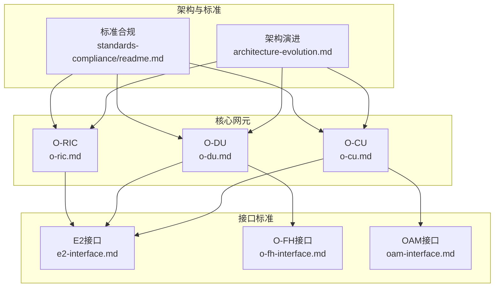
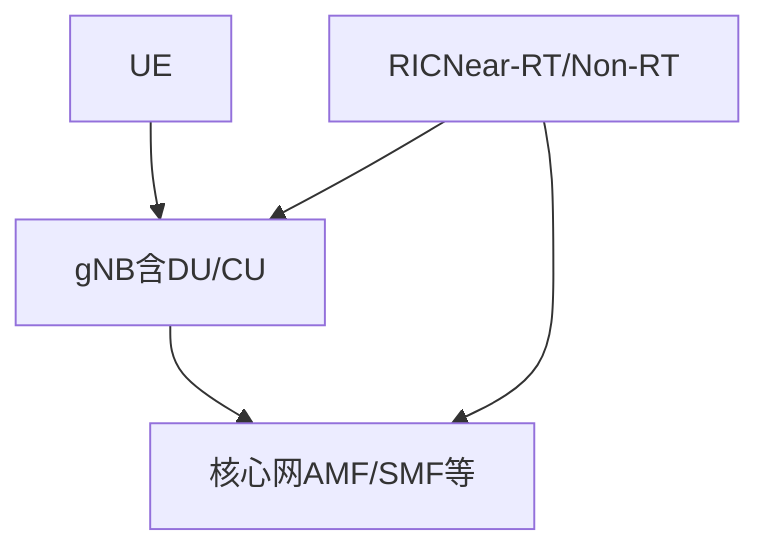
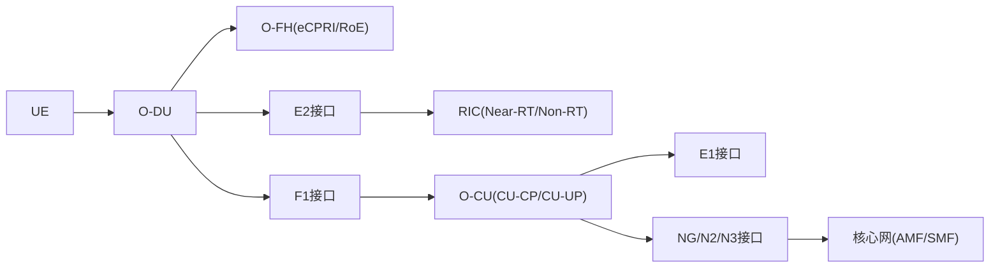

# 3GPP标准集成

<cite>
**本文引用的文件**
- [架构演进.md](file://01-architecture-system/architecture-evolution.md)
- [O-CU.md](file://02-core-components/o-cu.md)
- [O-DU.md](file://02-core-components/o-du.md)
- [O-RIC.md](file://02-core-components/o-ric.md)
- [E2接口.md](file://03-interface-standards/e2-interface.md)
- [O-FH接口.md](file://03-interface-standards/o-fh-interface.md)
- [OAM接口.md](file://03-interface-standards/oam-interface.md)
- [标准合规.md](file://09-standards-compliance/readme.md)
- [标准合规（中文）.md](file://09-standards-compliance/readme-zh.md)
- [RIC开发.md](file://07-ric-development/readme.md)
- [RIC开发（中文）.md](file://07-ric-development/readme-zh.md)
</cite>

## 目录
1. [引言](#引言)
2. [项目结构](#项目结构)
3. [核心组件](#核心组件)
4. [架构总览](#架构总览)
5. [详细组件分析](#详细组件分析)
6. [依赖关系分析](#依赖关系分析)
7. [性能考虑](#性能考虑)
8. [故障排查指南](#故障排查指南)
9. [结论](#结论)
10. [附录](#附录)

## 引言
本文件围绕3GPP标准在O-RAN（Open RAN）体系中的集成，系统梳理Release 15至18的演进脉络，重点解析NG-RAN架构与关键接口（F1、E1、Xn、NG、N2/N3），并结合E2接口与RIC（RAN Intelligent Controller）能力，形成从标准到实现的完整视图。文档既适合工程实践者，也适合对3GPP标准与O-RAN融合感兴趣的读者。

## 项目结构
本仓库以主题域组织3GPP与O-RAN相关内容，涵盖架构演进、核心网元、接口标准、RIC能力、合规与最佳实践等模块。与3GPP标准集成最相关的模块包括：
- 架构演进：提供从传统RAN到O-RAN的整体演进视角，奠定标准融合的宏观背景
- 核心组件：O-CU、O-DU、O-RIC分别对应3GPP NG-RAN中的CU、DU、RIC，是标准落地的关键载体
- 接口标准：E2、O-FH、OAM等接口文档，体现3GPP与O-RAN标准的衔接与扩展
- 标准合规：明确3GPP TS清单与演进路线，支撑标准集成与合规验证
- RIC开发：提供RIC架构、xApps/rApps开发与智能算法实践，支撑性能测量与KPI落地

图表来源
- [架构演进.md](file://01-architecture-system/architecture-evolution.md#L1-L183)
- [标准合规.md](file://09-standards-compliance/readme.md#L78-L134)
- [O-CU.md](file://02-core-components/o-cu.md#L1-L419)
- [O-DU.md](file://02-core-components/o-du.md#L1-L415)
- [O-RIC.md](file://02-core-components/o-ric.md#L1-L437)
- [E2接口.md](file://03-interface-standards/e2-interface.md#L1-L337)
- [O-FH接口.md](file://03-interface-standards/o-fh-interface.md#L1-L397)
- [OAM接口.md](file://03-interface-standards/oam-interface.md#L1-L353)

章节来源
- [架构演进.md](file://01-architecture-system/architecture-evolution.md#L1-L183)
- [标准合规.md](file://09-standards-compliance/readme.md#L78-L134)

## 核心组件
- O-CU（CU-CP/CU-UP分离）：承担RRC/NG控制面与PDCP/SDAP用户面处理，支撑F1/E1接口，实现控制与用户面解耦
- O-DU（DU）：负责物理层与MAC层处理，对接O-FH前传与E2接口，强调低时延与高可靠
- O-RIC（Near-RT/Non-RT）：实现E2接口服务化与xApps/rApps运行环境，支撑策略与实时控制闭环

章节来源
- [O-CU.md](file://02-core-components/o-cu.md#L1-L419)
- [O-DU.md](file://02-core-components/o-du.md#L1-L415)
- [O-RIC.md](file://02-core-components/o-ric.md#L1-L437)

## 架构总览
3GPP NG-RAN在Release 15-18逐步引入CU/DU/RAU分离、CU-CP/CU-UP分离，并在后续版本中持续增强空口与协议能力。O-RAN在此基础上，通过开放接口（E2、A1、O1、O-FH）实现功能解耦与智能化，形成“集中+分布”的灵活部署形态。

图表来源
- [O-CU.md](file://02-core-components/o-cu.md#L17-L27)
- [O-DU.md](file://02-core-components/o-du.md#L68-L86)
- [O-RIC.md](file://02-core-components/o-ric.md#L5-L72)

## 详细组件分析

### NG-RAN架构与3GPP演进（Release 15-18）
- Release 15：确立5G NR初始能力，奠定空口与核心网接口基础
- Release 16：增强eMBB、URLLC与mMTC能力，完善协议细节
- Release 17：引入更灵活的帧结构、更丰富的多连接场景
- Release 18：进一步增强空口与核心网能力，为6G演进做准备
- 3GPP TS 38.300/38.401：总体描述与NG-RAN架构描述，是理解接口与网元职责的基础

章节来源
- [标准合规.md](file://09-standards-compliance/readme.md#L78-L108)
- [标准合规（中文）.md](file://09-standards-compliance/readme-zh.md#L78-L108)

### F1接口（CU-DU接口）
- 功能定位：承载RRC消息、MAC控制、用户面数据（F1-U），支持控制面（F1-C）与用户面分离
- 协议与承载：F1-C基于SCTP/STREAMS，F1-U基于GTP-U
- 与O-CU/O-DU的关系：O-CU的CU-CP/CU-UP通过F1与O-DU交互，实现高层控制与低层处理的解耦

章节来源
- [O-CU.md](file://02-core-components/o-cu.md#L108-L116)
- [O-DU.md](file://02-core-components/o-du.md#L68-L74)

### E1接口（CU-CP-CU-UP接口）
- 功能定位：CU-CP与CU-UP之间的内部接口，传输控制信息与用户面配置
- 部署形态：支持集成/分离部署，满足集中式与边缘化需求

章节来源
- [O-CU.md](file://02-core-components/o-cu.md#L49-L61)

### Xn接口（gNB-gNB接口）
- 功能定位：支持gNB间移动性管理、数据转发与协调
- 与3GPP TS 38.423对应，是多gNB协同的关键

章节来源
- [标准合规.md](file://09-standards-compliance/readme.md#L88-L96)
- [标准合规（中文）.md](file://09-standards-compliance/readme-zh.md#L88-L96)

### NG/N2/N3接口（gNB-AMF/SMF接口）
- NG：gNB与AMF之间的控制面接口，承载RRC消息与NAS消息
- N2：RAN与核心网之间的控制面接口（如与AMF）
- N3：RAN与核心网之间的用户面接口（如与UPF）
- 与3GPP TS 38.401/38.300对应，支撑端到端连接与会话管理

章节来源
- [O-CU.md](file://02-core-components/o-cu.md#L17-L27)
- [标准合规.md](file://09-standards-compliance/readme.md#L88-L96)
- [标准合规（中文）.md](file://09-standards-compliance/readme-zh.md#L88-L96)

### RIC在3GPP标准中的定位与演进
- Near-RT RIC：毫秒级闭环，基于E2接口与CU/DU交互，部署xApps
- Non-RT RIC：秒级到分钟级策略管理，基于A1接口与Near-RT RIC协作，部署rApps
- 与3GPP TS 38.300/38.413的接口规范相衔接，支撑性能测量与KPI落地

章节来源
- [O-RIC.md](file://02-core-components/o-ric.md#L7-L72)
- [标准合规.md](file://09-standards-compliance/readme.md#L97-L102)
- [标准合规（中文）.md](file://09-standards-compliance/readme-zh.md#L97-L102)

### 性能测量与KPI（3GPP TS 32.541/32.542/32.543）
- 性能测量（PM）规范与数据采集规范，支撑网络优化与运维决策
- KPI定义与采集流程，与E2接口的KPI订阅/报告（E2SM-KPM）协同

章节来源
- [标准合规.md](file://09-standards-compliance/readme.md#L97-L102)
- [标准合规（中文）.md](file://09-standards-compliance/readme-zh.md#L97-L102)

### E2接口（RIC与CU/DU服务化）
- 协议栈：SCTP/STREAMS，支持服务发现、调用、事件通知与订阅管理
- 实时性：Near-RT RIC通常要求亚毫秒级响应
- 与xApps运行环境、服务模型（E2SM）协同

章节来源
- [E2接口.md](file://03-interface-standards/e2-interface.md#L1-L337)
- [O-RIC.md](file://02-core-components/o-ric.md#L7-L32)

### O-FH接口（DU-RU前传）
- 协议：eCPRI/RoE，承载IQ数据、RU控制与同步
- 同步：IEEE 1588 PTP与同步以太网（SyncE），满足纳秒级精度
- 与O-DU/O-RU部署形态密切相关

章节来源
- [O-FH接口.md](file://03-interface-standards/o-fh-interface.md#L1-L397)
- [O-DU.md](file://02-core-components/o-du.md#L42-L61)

### OAM接口（端到端管理）
- 功能：拓扑、配置、软件、故障、性能、安全、资源、测试、备份恢复
- 协议：SNMP、NETCONF/YANG、REST/gRPC等
- 与3GPP核心网管理域协同，支撑端到端运维

章节来源
- [OAM接口.md](file://03-interface-standards/oam-interface.md#L1-L353)

## 依赖关系分析
- O-DU依赖O-FH前传与同步（PTP/SyncE），并通过E2接口与RIC交互
- O-CU通过F1接口与O-DU交互，通过E1接口与CU-UP交互，通过NG接口与核心网交互
- RIC通过E2接口与CU/DU交互，通过A1接口与Non-RT RIC交互，支撑策略与KPI闭环

图表来源
- [O-DU.md](file://02-core-components/o-du.md#L68-L86)
- [O-FH接口.md](file://03-interface-standards/o-fh-interface.md#L61-L97)
- [E2接口.md](file://03-interface-standards/e2-interface.md#L63-L98)
- [O-CU.md](file://02-core-components/o-cu.md#L108-L121)
- [OAM接口.md](file://03-interface-standards/oam-interface.md#L62-L87)

章节来源
- [O-DU.md](file://02-core-components/o-du.md#L1-L415)
- [O-FH接口.md](file://03-interface-standards/o-fh-interface.md#L1-L397)
- [E2接口.md](file://03-interface-standards/e2-interface.md#L1-L337)
- [O-CU.md](file://02-core-components/o-cu.md#L1-L419)
- [OAM接口.md](file://03-interface-standards/oam-interface.md#L1-L353)

## 性能考虑
- 时延与同步：O-DU对物理层/MACh层时延与PTP精度提出严格要求；O-FH需兼顾带宽、延迟与同步
- 实时性：E2接口在Near-RT场景下需满足亚毫秒级响应；F1接口需满足端到端时延预算
- 可靠性：接口冗余、路径保护与故障恢复机制是保障高可用的关键
- 资源与扩展：水平/垂直扩展、自动扩缩容与资源池化，支撑弹性与成本优化

章节来源
- [O-DU.md](file://02-core-components/o-du.md#L51-L67)
- [O-FH接口.md](file://03-interface-standards/o-fh-interface.md#L117-L178)
- [E2接口.md](file://03-interface-standards/e2-interface.md#L90-L147)

## 故障排查指南
- 接口层面：E2/F1/O-FH/OAM的连接状态、吞吐量、延迟与错误率监控与告警分级
- 设备层面：DU/RU/CU/RIC的资源使用、同步状态、配置一致性与变更回滚
- 业务层面：基于KPI与PM数据的根因分析与自动恢复

章节来源
- [E2接口.md](file://03-interface-standards/e2-interface.md#L148-L201)
- [O-FH接口.md](file://03-interface-standards/o-fh-interface.md#L199-L266)
- [OAM接口.md](file://03-interface-standards/oam-interface.md#L160-L206)

## 结论
3GPP标准与O-RAN的深度融合，通过CU/DU/RAU解耦、CU-CP/CU-UP分离与开放接口（E2/A1/O-FH），实现了从集中式到分布式的灵活架构。Release 15-18持续演进的空口与协议能力，为O-RAN的智能化（RIC/xApps/rApps）与端到端管理（OAM）提供了坚实基础。结合性能测量与KPI体系，可实现闭环优化与持续演进。

## 附录
- 3GPP TS清单与演进路线：参见标准合规文档中的Release 15-18清单与接口规范索引
- RIC开发与应用：参见RIC开发文档中的架构、服务模型与算法实践

章节来源
- [标准合规.md](file://09-standards-compliance/readme.md#L78-L134)
- [标准合规（中文）.md](file://09-standards-compliance/readme-zh.md#L78-L134)
- [RIC开发.md](file://07-ric-development/readme.md#L1-L368)
- [RIC开发（中文）.md](file://07-ric-development/readme-zh.md#L1-L340)