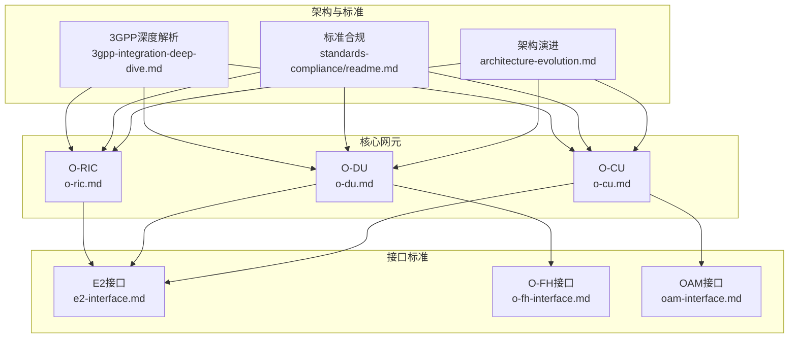
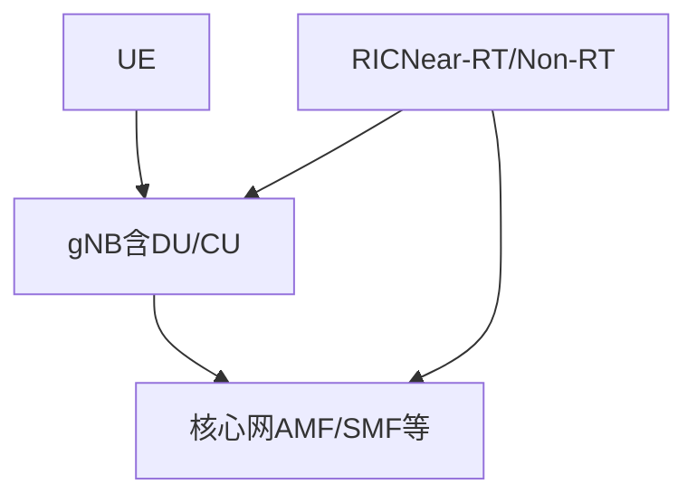
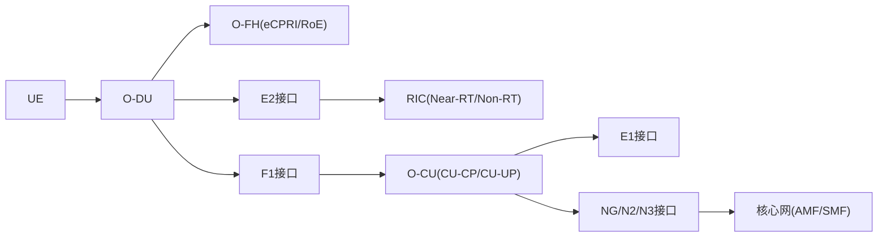

# 3GPP标准集成

<cite>
**本文引用的文件**
- [架构演进.md](file://01-architecture-system/architecture-evolution.md)
- [O-CU.md](file://02-core-components/o-cu.md)
- [O-DU.md](file://02-core-components/o-du.md)
- [O-RIC.md](file://02-core-components/o-ric.md)
- [E2接口.md](file://03-interface-standards/e2-interface.md)
- [O-FH接口.md](file://03-interface-standards/o-fh-interface.md)
- [OAM接口.md](file://03-interface-standards/oam-interface.md)
- [3GPP标准集成深度解析.md](file://09-standards-compliance/3gpp-integration/3gpp-integration-deep-dive.md)
- [3GPP标准集成.md](file://09-standards-compliance/3gpp-integration/readme.md)
- [标准合规.md](file://09-standards-compliance/readme.md)
- [标准合规（中文）.md](file://09-standards-compliance/readme-zh.md)
- [RIC开发.md](file://07-ric-development/readme.md)
- [RIC开发（中文）.md](file://07-ric-development/readme-zh.md)
</cite>

## 更新摘要
**变更内容**
- 新增了3GPP标准集成深度解析章节，涵盖Release 15-18的详细规范
- 扩展了NG-RAN架构和接口协议的详细说明
- 增强了RIC功能与3GPP标准的集成分析
- 完善了性能测量和KPI定义的技术细节
- 更新了演进路线图和未来发展方向

## 目录
1. [引言](#引言)
2. [项目结构](#项目结构)
3. [核心组件](#核心组件)
4. [架构总览](#架构总览)
5. [详细组件分析](#详细组件分析)
6. [依赖关系分析](#依赖关系分析)
7. [性能考虑](#性能考虑)
8. [故障排查指南](#故障排查指南)
9. [结论](#结论)
10. [附录](#附录)

## 引言
本文件围绕3GPP标准在O-RAN（Open RAN）体系中的集成，系统梳理Release 15至18的演进脉络，重点解析NG-RAN架构与关键接口（F1、E1、Xn、NG、N2/N3），并结合E2接口与RIC（RAN Intelligent Controller）能力，形成从标准到实现的完整视图。文档既适合工程实践者，也适合对3GPP标准与O-RAN融合感兴趣的读者。

## 项目结构
本仓库以主题域组织3GPP与O-RAN相关内容，涵盖架构演进、核心网元、接口标准、RIC能力、合规与最佳实践等模块。与3GPP标准集成最相关的模块包括：
- 架构演进：提供从传统RAN到O-RAN的整体演进视角，奠定标准融合的宏观背景
- 核心组件：O-CU、O-DU、O-RIC分别对应3GPP NG-RAN中的CU、DU、RIC，是标准落地的关键载体
- 接口标准：E2、O-FH、OAM等接口文档，体现3GPP与O-RAN标准的衔接与扩展
- 标准合规：明确3GPP TS清单与演进路线，支撑标准集成与合规验证
- RIC开发：提供RIC架构、xApps/rApps开发与智能算法实践，支撑性能测量与KPI落地

**图表来源**
- [架构演进.md:1-183](file://01-architecture-system/architecture-evolution.md#L1-L183)
- [标准合规.md:78-134](file://09-standards-compliance/readme.md#L78-L134)
- [3GPP标准集成深度解析.md:1-553](file://09-standards-compliance/3gpp-integration/3gpp-integration-deep-dive.md#L1-L553)
- [O-CU.md:1-419](file://02-core-components/o-cu.md#L1-L419)
- [O-DU.md:1-415](file://02-core-components/o-du.md#L1-L415)
- [O-RIC.md:1-437](file://02-core-components/o-ric.md#L1-L437)
- [E2接口.md:1-365](file://03-interface-standards/e2-interface.md#L1-L365)
- [O-FH接口.md:1-397](file://03-interface-standards/o-fh-interface.md#L1-L397)
- [OAM接口.md:1-353](file://03-interface-standards/oam-interface.md#L1-L353)

**章节来源**
- [架构演进.md:1-183](file://01-architecture-system/architecture-evolution.md#L1-L183)
- [标准合规.md:78-134](file://09-standards-compliance/readme.md#L78-L134)
- [3GPP标准集成深度解析.md:1-553](file://09-standards-compliance/3gpp-integration/3gpp-integration-deep-dive.md#L1-L553)

## 核心组件
- O-CU（CU-CP/CU-UP分离）：承担RRC/NG控制面与PDCP/SDAP用户面处理，支撑F1/E1接口，实现控制与用户面解耦
- O-DU（DU）：负责物理层与MAC层处理，对接O-FH前传与E2接口，强调低时延与高可靠
- O-RIC（Near-RT/Non-RT）：实现E2接口服务化与xApps/rApps运行环境，支撑策略与实时控制闭环

**章节来源**
- [O-CU.md:1-419](file://02-core-components/o-cu.md#L1-L419)
- [O-DU.md:1-415](file://02-core-components/o-du.md#L1-L415)
- [O-RIC.md:1-437](file://02-core-components/o-ric.md#L1-L437)

## 架构总览
3GPP NG-RAN在Release 15-18逐步引入CU/DU/RAU分离、CU-CP/CU-UP分离，并在后续版本中持续增强空口与协议能力。O-RAN在此基础上，通过开放接口（E2、A1、O1、O-FH）实现功能解耦与智能化，形成"集中+分布"的灵活部署形态。

**图表来源**
- [O-CU.md:17-27](file://02-core-components/o-cu.md#L17-L27)
- [O-DU.md:68-86](file://02-core-components/o-du.md#L68-L86)
- [O-RIC.md:5-72](file://02-core-components/o-ric.md#L5-L72)

## 详细组件分析

### 3GPP NR标准详解（Release 15-18）

#### Release 15：5G NR初始版本
- **TS 38.300**：NR和NG-RAN总体描述，奠定基础架构
- **TS 38.401**：NG-RAN架构描述，定义gNB/ng-eNB/AMF/SMF/UPF组件
- **TS 38.211/212/213**：物理层信道、调制、复用和过程规范
- **NSA/SA架构**：支持非独立组网和独立组网两种部署模式

#### Release 16：5G NR增强版本
- **URLLC增强**：超可靠低时延通信特性完善
- **V2X支持**：车联网通信能力增强
- **NR-U**：非授权频谱支持
- **定位增强**：更精确的位置服务能力

#### Release 17：5G NR进一步增强
- **mMTC增强**：海量机器类型通信优化
- **NR RedCap**：降低能力的NR设备支持
- **IAB**：集成接入和回传技术
- **多SIM支持**：多SIM操作能力

#### Release 18：5G Advanced
- **AI/ML集成**：人工智能和机器学习在网络优化中的应用
- **网络切片增强**：更灵活的切片管理能力
- **XR支持**：扩展现实应用支持
- **6G准备**：为下一代移动通信做准备

**章节来源**
- [3GPP标准集成深度解析.md:9-133](file://09-standards-compliance/3gpp-integration/3gpp-integration-deep-dive.md#L9-L133)

### NG-RAN架构详解

#### gNB架构组件
- **Central Unit (CU)**：处理高层协议（RRC、PDCP、SDAP）
- **Distributed Unit (DU)**：处理低层协议（RLC、MAC、PHY）
- **Radio Unit (RU)**：处理RF处理和天线功能
- **F1接口**：连接CU到DU
- **E1接口**：连接CU-CP到CU-UP

#### CU-DU分离架构
- **CU-CP**：中央单元的控制面部分
- **CU-UP**：中央单元的用户面部分
- **DU**：具有实时处理的分布式单元
- **RU**：具有RF处理的无线电单元
- **功能拆分**：CU和DU之间的灵活功能拆分

#### 部署选项
- **共址CU/DU**：CU和DU在同一位置
- **分离CU/DU**：CU集中化，DU分布式
- **CU云化**：CU部署在云基础设施
- **DU站点**：DU部署在小区站点
- **RU天线**：RU与天线集成

**章节来源**
- [3GPP标准集成深度解析.md:134-161](file://09-standards-compliance/3gpp-integration/3gpp-integration-deep-dive.md#L134-L161)

### F1接口详解（CU-DU接口）

#### F1接口功能
- **F1-C（控制面）**：RRC信令和控制过程
- **F1-U（用户面）**：用户数据传输
- **F1建立**：F1接口建立过程
- **F1重置**：F1接口重置过程
- **F1配置**：F1接口配置管理

#### F1-C过程
- **F1建立**：初始F1接口建立
- **gNB-DU配置更新**：DU配置更新
- **gNB-CU配置更新**：CU配置更新
- **UE上下文建立**：UE上下文建立
- **UE上下文修改**：UE上下文修改

#### F1-U过程
- **用户数据传输**：用户面数据传输
- **流量控制**：流量控制机制
- **错误指示**：错误指示过程
- **跟踪开始/停止**：跟踪激活和去激活
- **资源状态**：资源状态报告

**章节来源**
- [3GPP标准集成深度解析.md:162-187](file://09-standards-compliance/3gpp-integration/3gpp-integration-deep-dive.md#L162-L187)
- [O-CU.md:108-116](file://02-core-components/o-cu.md#L108-L116)
- [O-DU.md:68-74](file://02-core-components/o-du.md#L68-L74)

### E1接口详解（CU-CP-CU-UP接口）

#### E1接口功能
- **E1-C（控制面）**：承载上下文管理
- **E1-U（用户面）**：用户面数据传输
- **E1建立**：E1接口建立过程
- **E1重置**：E1接口重置过程
- **E1配置**：E1接口配置管理

#### E1-C过程
- **承载上下文建立**：承载上下文建立
- **承载上下文修改**：承载上下文修改
- **承载上下文释放**：承载上下文释放
- **承载上下文不活动通知**：不活动通知
- **承载上下文状态传输**：状态传输过程

**章节来源**
- [3GPP标准集成深度解析.md:188-205](file://09-standards-compliance/3gpp-integration/3gpp-integration-deep-dive.md#L188-L205)
- [O-CU.md:49-61](file://02-core-components/o-cu.md#L49-L61)

### Xn接口详解（gNB-gNB接口）

#### Xn接口功能
- **Xn-C（控制面）**：gNB间信令
- **Xn-U（用户面）**：gNB间用户数据传输
- **Xn建立**：Xn接口建立过程
- **Xn重置**：Xn接口重置过程
- **Xn配置**：Xn接口配置管理

#### Xn-C过程
- **切换准备**：切换准备过程
- **切换执行**：切换执行过程
- **RAN寻呼**：RAN寻呼过程
- **RAN配置传输**：配置传输过程
- **RAN状态传输**：状态传输过程

**章节来源**
- [3GPP标准集成深度解析.md:206-223](file://09-standards-compliance/3gpp-integration/3gpp-integration-deep-dive.md#L206-L223)
- [标准合规.md:88-96](file://09-standards-compliance/readme.md#L88-L96)
- [标准合规（中文）.md:88-96](file://09-standards-compliance/readme-zh.md#L88-L96)

### NG/N2/N3接口详解（gNB-AMF/SMF接口）

#### NG接口
- **NG-C（控制面）**：gNB与AMF之间的控制面接口
- **NG-U（用户面）**：gNB与UPF之间的用户面接口
- **NGAP协议**：NG应用协议
- **SCTP传输**：流控制传输协议

#### N2接口（gNB-AMF）
- **协议栈**：NGAP/SCTP/IP
- **功能**：注册、认证、移动性管理
- **过程**：初始注册、切换、寻呼
- **安全**：IPsec、TLS安全保护
- **QoS**：服务质量信令

#### N3接口（gNB-UPF）
- **协议栈**：GTP-U/UDP/IP
- **功能**：用户面数据传输
- **过程**：数据转发、隧道管理
- **QoS**：服务质量执行
- **安全**：IPsec安全保护

**章节来源**
- [3GPP标准集成深度解析.md:298-333](file://09-standards-compliance/3gpp-integration/3gpp-integration-deep-dive.md#L298-L333)
- [O-CU.md:17-27](file://02-core-components/o-cu.md#L17-L27)
- [标准合规.md:88-96](file://09-standards-compliance/readme.md#L88-L96)
- [标准合规（中文）.md:88-96](file://09-standards-compliance/readme-zh.md#L88-L96)

### RIC在3GPP标准中的定位与演进

#### RIC架构在3GPP中
- **Near-RT RIC**：实时控制和优化
- **Non-RT RIC**：策略管理和长期优化
- **RIC功能**：数据采集、分析、策略执行
- **RIC接口**：E2、A1、O1接口
- **RIC部署**：云原生部署架构

#### RIC与NG-RAN集成
- **E2接口集成**：RIC连接到CU/DU
- **A1接口集成**：从Non-RT RIC分发策略
- **O1接口集成**：管理和编排
- **数据采集**：性能和配置数据采集
- **策略执行**：实时策略执行

#### 相关接口规范
- **E2接口规范**：E2AP协议、E2服务模型、E2过程
- **A1接口规范**：A1AP协议、A1策略框架、A1过程
- **性能测量规范**：TS 32.541/32.542/32.543

**章节来源**
- [3GPP标准集成深度解析.md:334-425](file://09-standards-compliance/3gpp-integration/3gpp-integration-deep-dive.md#L334-L425)
- [O-RIC.md:7-72](file://02-core-components/o-ric.md#L7-L72)
- [标准合规.md:97-102](file://09-standards-compliance/readme.md#L97-L102)
- [标准合规（中文）.md:97-102](file://09-standards-compliance/readme-zh.md#L97-L102)

### 性能测量与KPI详解

#### 性能测量框架
- **测量类型**：流量、资源、质量测量
- **测量对象**：小区、UE、承载测量
- **测量周期**：实时、短期、长期测量
- **测量上报**：事件触发、周期性上报
- **测量存储**：历史数据存储

#### KPI定义与计算
- **可访问性KPI**：RRC建立成功率、ERAB建立成功率
- **保持性KPI**：呼叫掉话率、会话连续性
- **移动性KPI**：切换成功率、跨RAT切换
- **完整性KPI**：吞吐量、时延、丢包率
- **利用率KPI**：资源利用率、容量使用

#### 数据采集方法
- **文件采集**：批量数据采集
- **流式采集**：实时数据流
- **事件采集**：事件触发数据采集
- **轮询采集**：请求响应数据采集
- **混合采集**：组合采集方法

**章节来源**
- [3GPP标准集成深度解析.md:372-425](file://09-standards-compliance/3gpp-integration/3gpp-integration-deep-dive.md#L372-L425)

### E2接口详解（RIC与CU/DU服务化）

#### 协议栈架构
- **应用层**：E2AP（E2应用协议）+ E2SM服务模型插件
- **传输层**：SCTP（流控制传输协议），提供可靠有序的消息传输
- **网络层**：IPv4/IPv6
- **数据链路层**：以太网（通常为10/25/100 GE）

#### E2SM服务模型
- **E2SM-KPM（关键性能测量）**：定义性能测量数据的上报格式
- **E2SM-RC（RAN控制）**：定义RIC对E2 Node的控制服务
- **E2SM-NI（网络信息）**：定义网络拓扑、小区配置等静态信息的上报
- **E2SM-MRO/MO（移动鲁棒性/优化）**：移动鲁棒性优化和移动优化
- **E2SM-MAC/RLC/PDCP**：定义L2层内部状态的暴露

#### 生产环境部署考量
- **网络规划**：带宽需求、延迟要求、可靠性、QoS配置
- **部署架构**：集中式、分布式、混合部署
- **性能优化**：传输层优化、应用层优化、网络优化
- **运维管理**：监控告警、故障处理

**章节来源**
- [3GPP标准集成深度解析.md:354-371](file://09-standards-compliance/3gpp-integration/3gpp-integration-deep-dive.md#L354-L371)
- [E2接口.md:1-365](file://03-interface-standards/e2-interface.md#L1-L365)
- [O-RIC.md:7-32](file://02-core-components/o-ric.md#L7-L32)

### O-FH接口详解（DU-RU前传）

#### 协议栈
- **eCPRI/RoE**：增强型通用公共无线电接口/以太网上载波
- **IQ数据**：数字基带数据
- **RU控制**：无线电单元控制
- **同步**：IEEE 1588 PTP与同步以太网（SyncE）

#### 同步要求
- **时间同步精度**：通常要求在100ns以内
- **与O-RU的时间同步精度**：通常要求在100ns以内
- **与O-CU的时间同步精度**：通常要求在1μs以内
- **支持IEEE 1588 PTP v2协议**

**章节来源**
- [3GPP标准集成深度解析.md:224-241](file://09-standards-compliance/3gpp-integration/3gpp-integration-deep-dive.md#L224-L241)
- [O-FH接口.md:1-397](file://03-interface-standards/o-fh-interface.md#L1-L397)
- [O-DU.md:42-61](file://02-core-components/o-du.md#L42-L61)

### OAM接口详解（端到端管理）

#### 功能范围
- **拓扑管理**：网络拓扑发现和管理
- **配置管理**：设备配置和参数管理
- **软件管理**：软件升级和版本管理
- **故障管理**：故障检测和告警
- **性能管理**：性能监控和优化
- **安全管理**：安全策略和访问控制
- **资源管理**：资源分配和监控
- **测试管理**：设备测试和验证
- **备份恢复**：配置备份和恢复

#### 协议支持
- **SNMP**：简单网络管理协议
- **NETCONF/YANG**：网络配置和网络建模
- **REST/gRPC**：现代API接口

**章节来源**
- [OAM接口.md:1-353](file://03-interface-standards/oam-interface.md#L1-L353)

## 依赖关系分析
- O-DU依赖O-FH前传与同步（PTP/SyncE），并通过E2接口与RIC交互
- O-CU通过F1接口与O-DU交互，通过E1接口与CU-UP交互，通过NG接口与核心网交互
- RIC通过E2接口与CU/DU交互，通过A1接口与Non-RT RIC交互，支撑策略与KPI闭环

**图表来源**
- [O-DU.md:68-86](file://02-core-components/o-du.md#L68-L86)
- [O-FH接口.md:61-97](file://03-interface-standards/o-fh-interface.md#L61-L97)
- [E2接口.md:63-98](file://03-interface-standards/e2-interface.md#L63-L98)
- [O-CU.md:108-121](file://02-core-components/o-cu.md#L108-L121)
- [OAM接口.md:62-87](file://03-interface-standards/oam-interface.md#L62-L87)

**章节来源**
- [O-DU.md:1-415](file://02-core-components/o-du.md#L1-L415)
- [O-FH接口.md:1-397](file://03-interface-standards/o-fh-interface.md#L1-L397)
- [E2接口.md:1-365](file://03-interface-standards/e2-interface.md#L1-L365)
- [O-CU.md:1-419](file://02-core-components/o-cu.md#L1-L419)
- [OAM接口.md:1-353](file://03-interface-standards/oam-interface.md#L1-L353)

## 性能考虑
- **时延与同步**：O-DU对物理层/MAC层时延与PTP精度提出严格要求；O-FH需兼顾带宽、延迟与同步
- **实时性**：E2接口在Near-RT场景下需满足亚毫秒级响应；F1接口需满足端到端时延预算
- **可靠性**：接口冗余、路径保护与故障恢复机制是保障高可用的关键
- **资源与扩展**：水平/垂直扩展、自动扩缩容与资源池化，支撑弹性与成本优化

**章节来源**
- [O-DU.md:51-67](file://02-core-components/o-du.md#L51-L67)
- [O-FH接口.md:117-178](file://03-interface-standards/o-fh-interface.md#L117-L178)
- [E2接口.md:90-147](file://03-interface-standards/e2-interface.md#L90-L147)

## 故障排查指南
- **接口层面**：E2/F1/O-FH/OAM的连接状态、吞吐量、延迟与错误率监控与告警分级
- **设备层面**：DU/RU/CU/RIC的资源使用、同步状态、配置一致性与变更回滚
- **业务层面**：基于KPI与PM数据的根因分析与自动恢复

**章节来源**
- [E2接口.md:148-201](file://03-interface-standards/e2-interface.md#L148-L201)
- [O-FH接口.md:199-266](file://03-interface-standards/o-fh-interface.md#L199-L266)
- [OAM接口.md:160-206](file://03-interface-standards/oam-interface.md#L160-L206)

## 结论
3GPP标准与O-RAN的深度融合，通过CU/DU/RAU解耦、CU-CP/CU-UP分离与开放接口（E2/A1/O-FH），实现了从集中式到分布式的灵活架构。Release 15-18持续演进的空口与协议能力，为O-RAN的智能化（RIC/xApps/rApps）与端到端管理（OAM）提供了坚实基础。结合性能测量与KPI体系，可实现闭环优化与持续演进。

## 附录
- **3GPP TS清单与演进路线**：参见3GPP标准集成深度解析文档中的Release 15-18详细规范
- **RIC开发与应用**：参见RIC开发文档中的架构、服务模型与算法实践
- **生产环境最佳实践**：参见3GPP标准集成深度解析文档中的生产环境指导

**章节来源**
- [3GPP标准集成深度解析.md:426-553](file://09-standards-compliance/3gpp-integration/3gpp-integration-deep-dive.md#L426-L553)
- [标准合规.md:78-134](file://09-standards-compliance/readme.md#L78-L134)
- [标准合规（中文）.md:78-134](file://09-standards-compliance/readme-zh.md#L78-L134)
- [RIC开发.md:1-368](file://07-ric-development/readme.md#L1-L368)
- [RIC开发（中文）.md:1-340](file://07-ric-development/readme-zh.md#L1-L340)