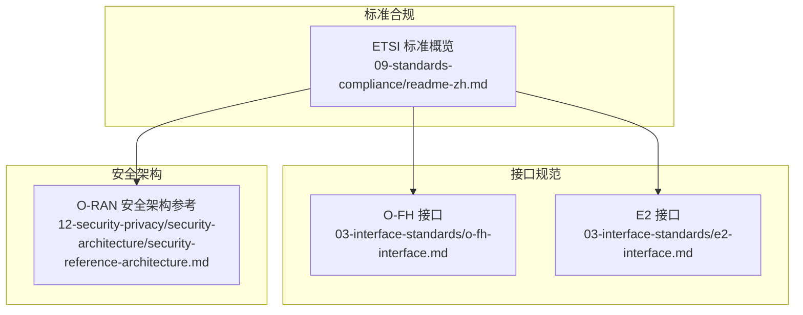
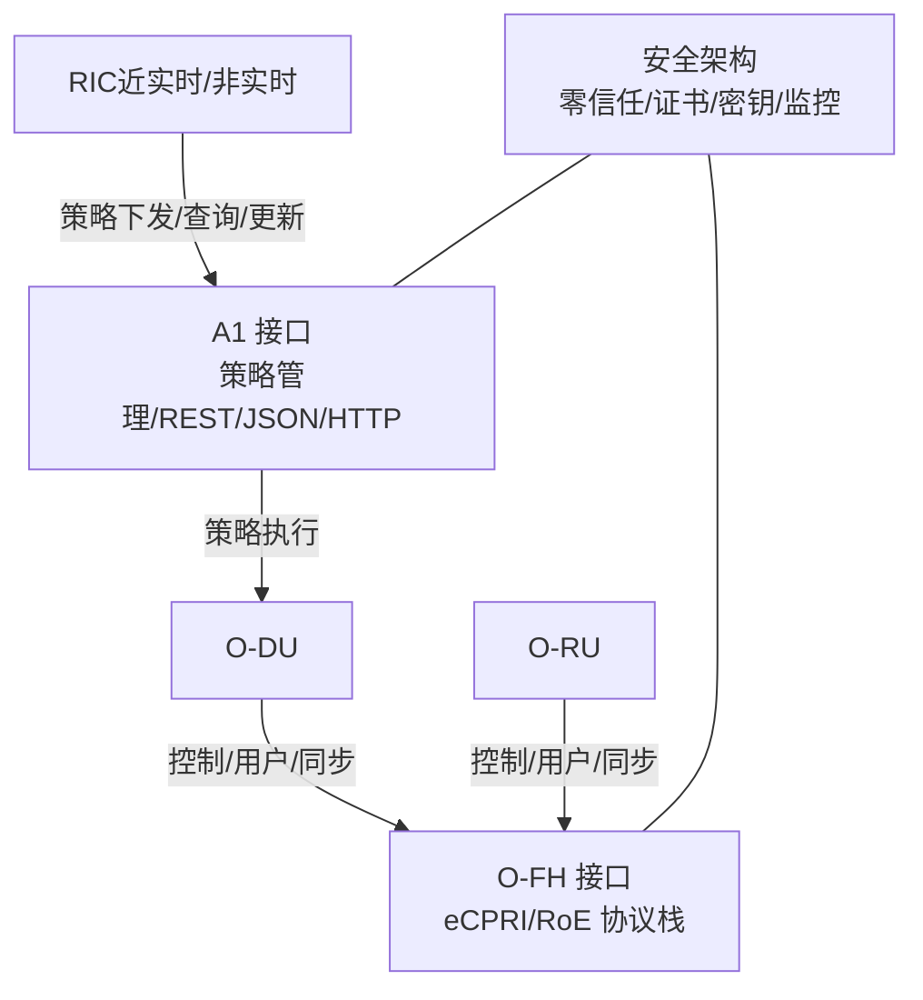
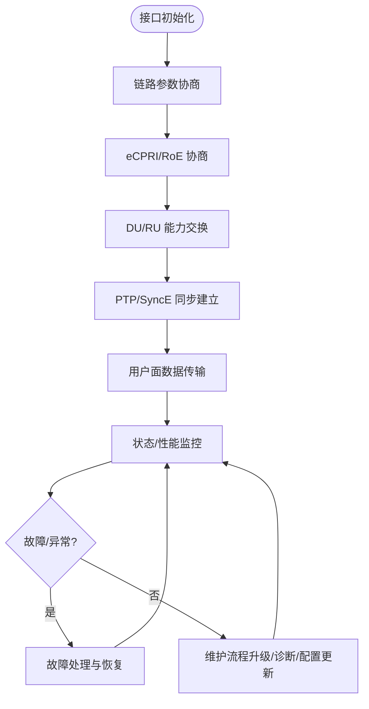
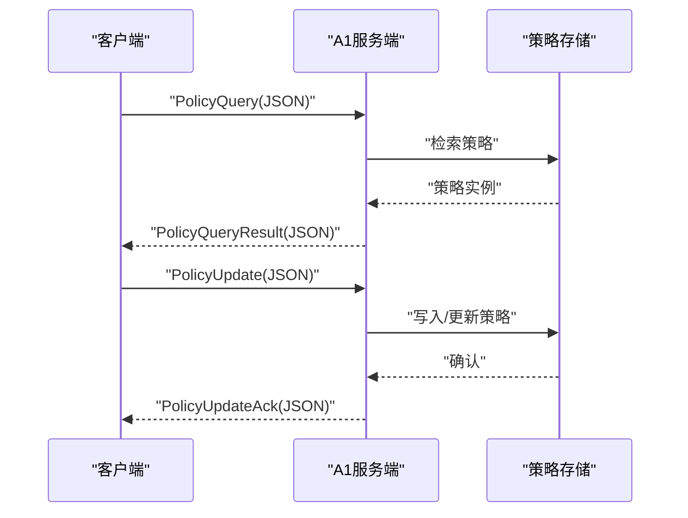
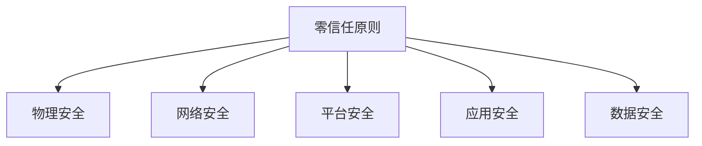
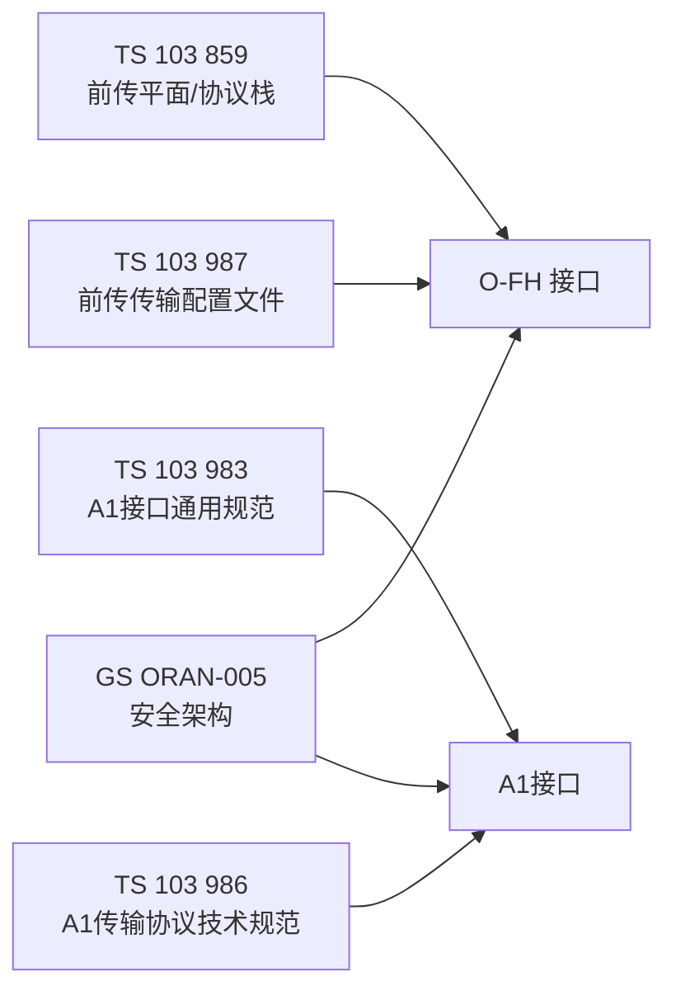

# ETSI标准详解

<cite>
**本文引用的文件**
- [03-interface-standards/o-fh-interface.md](file://03-interface-standards/o-fh-interface.md)
- [09-standards-compliance/readme-zh.md](file://09-standards-compliance/readme-zh.md)
- [12-security-privacy/security-architecture/security-reference-architecture.md](file://12-security-privacy/security-architecture/security-reference-architecture.md)
- [03-interface-standards/e2-interface.md](file://03-interface-standards/e2-interface.md)
</cite>

## 目录
1. [简介](#简介)
2. [项目结构](#项目结构)
3. [核心组件](#核心组件)
4. [架构总览](#架构总览)
5. [详细组件分析](#详细组件分析)
6. [依赖分析](#依赖分析)
7. [性能考虑](#性能考虑)
8. [故障排查指南](#故障排查指南)
9. [结论](#结论)
10. [附录](#附录)

## 简介
本文件面向ETSI标准在O-RAN领域的落地实施，围绕以下标准进行系统化技术规范解读与工程化建议：
- ETSI TS 103 859：前传控制、用户与同步平面规范
- ETSI TS 103 983：A1接口通用规范与原则
- ETSI TS 103 986：A1接口传输协议技术规范（REST/JSON/HTTP）
- ETSI TS 103 987：O-RAN前传传输配置文件规范
- ETSI GS ORAN-005：O-RAN安全架构

内容涵盖协议栈定义、控制面/用户面/同步面规范、A1接口架构原则、RESTful API与JSON数据格式、HTTP/HTTPS传输要求、错误处理机制与性能要求，并给出实施要点与配置参数说明，帮助读者在生产环境中高效、合规地完成O-RAN部署与运维。

## 项目结构
本仓库以主题域组织O-RAN相关内容，与ETSI标准直接相关的知识主要分布在“接口规范”“标准合规”“安全架构”等模块中。下图展示与ETSI标准相关的主要文件与模块关系：

图表来源
- [03-interface-standards/o-fh-interface.md](file://03-interface-standards/o-fh-interface.md#L1-L397)
- [09-standards-compliance/readme-zh.md](file://09-standards-compliance/readme-zh.md#L46-L76)
- [12-security-privacy/security-architecture/security-reference-architecture.md](file://12-security-privacy/security-architecture/security-reference-architecture.md#L1-L559)

章节来源
- file://03-interface-standards/o-fh-interface.md#L1-L397
- file://09-standards-compliance/readme-zh.md#L46-L76
- file://12-security-privacy/security-architecture/security-reference-architecture.md#L1-L559

## 核心组件
- 前传接口（O-FH）：定义DU与RU之间的标准化前传接口，支持eCPRI/RoE协议栈，覆盖用户面、控制面与同步面，明确初始化/运行/维护流程及部署与运维要点。
- A1接口：定义非实时RIC与近实时RIC之间的策略管理接口，明确架构原则、策略生命周期、REST/JSON/HTTP传输与错误处理、性能要求。
- 前传传输配置文件：定义传输配置文件、配置参数、配置管理流程与验证要求，支撑前传接口的工程化落地。
- 安全架构：提供零信任模型、分层纵深防御、证书与密钥管理、身份认证与授权、监控与合规等安全体系，支撑ETSI GS ORAN-005要求。

章节来源
- file://03-interface-standards/o-fh-interface.md#L59-L116
- file://09-standards-compliance/readme-zh.md#L46-L76
- file://12-security-privacy/security-architecture/security-reference-architecture.md#L6-L71

## 架构总览
下图从系统视角展示ETSI标准在O-RAN中的应用关系：前传接口（O-FH）负责DU与RU之间的控制/用户/同步数据面，A1接口负责RIC间策略管理，安全架构贯穿各平面与接口。

图表来源
- [03-interface-standards/o-fh-interface.md](file://03-interface-standards/o-fh-interface.md#L59-L116)
- [09-standards-compliance/readme-zh.md](file://09-standards-compliance/readme-zh.md#L46-L76)
- [12-security-privacy/security-architecture/security-reference-architecture.md](file://12-security-privacy/security-architecture/security-reference-architecture.md#L6-L71)

## 详细组件分析

### 前传接口（O-FH）与TS 103 859
- 协议栈与平面
  - 用户面：数字基带IQ数据传输、速率适配、对齐与时延控制
  - 控制面：RU配置/状态/故障管理、操作维护（升级/诊断/性能监控）
  - 同步面：PTP时间同步、SyncE频率同步、同步保护与状态指示
- 接口消息与流程
  - 初始化/正常运行/维护流程，明确DU/RU能力交换与同步建立顺序
- 部署与运维
  - 带宽/延迟/可靠性/QoS规划，传输介质（光/无线/混合），同步精度与测试，硬件选型与监控告警，配置管理与故障处理，性能优化与容量规划

图表来源
- [03-interface-standards/o-fh-interface.md](file://03-interface-standards/o-fh-interface.md#L98-L116)

章节来源
- file://03-interface-standards/o-fh-interface.md#L59-L116
- file://03-interface-standards/o-fh-interface.md#L117-L288

### A1接口（TS 103 983/986）
- 架构原则与策略管理
  - 策略类型与格式、生命周期管理、安全要求
- 传输协议与REST规范
  - RESTful API、JSON数据格式、HTTP/HTTPS传输、错误处理机制、性能要求
- 实施要点
  - 明确策略查询/更新/删除等操作的请求/响应结构与语义
  - 采用TLS保护传输，实施访问控制与审计
  - 设计合理的超时与重试策略，满足性能目标

图表来源
- [09-standards-compliance/readme-zh.md](file://09-standards-compliance/readme-zh.md#L53-L64)

章节来源
- file://09-standards-compliance/readme-zh.md#L53-L64

### 前传传输配置文件（TS 103 987）
- 传输配置文件定义与类型
- 配置参数规范与管理流程
- 配置验证要求与一致性校验

章节来源
- file://09-standards-compliance/readme-zh.md#L65-L70

### 安全架构（GS ORAN-005）
- 安全威胁分析与要求定义
- 零信任模型与分层纵深防御
- 证书与密钥管理、身份认证与授权、安全监控与合规

图表来源
- [12-security-privacy/security-architecture/security-reference-architecture.md](file://12-security-privacy/security-architecture/security-reference-architecture.md#L38-L71)

章节来源
- file://12-security-privacy/security-architecture/security-reference-architecture.md#L6-L71
- file://12-security-privacy/security-architecture/security-reference-architecture.md#L247-L337

### E2接口（补充：与A1接口协同）
- 基于SCTP/STREAMS的服务化接口，支持RIC与CU/DU之间的服务发现、调用、事件通知与订阅管理
- 协议栈与消息类型、部署架构与性能优化、监控告警与故障处理、版本管理与安全最佳实践

章节来源
- file://03-interface-standards/e2-interface.md#L33-L89
- file://03-interface-standards/e2-interface.md#L90-L147
- file://03-interface-standards/e2-interface.md#L148-L240

## 依赖分析
- 标准间关系
  - TS 103 859定义前传接口的控制/用户/同步平面与协议栈，为O-FH部署提供基础
  - TS 103 983/986定义A1接口的策略管理与REST/JSON/HTTP传输，支撑RIC间策略协同
  - TS 103 987定义前传传输配置文件，保障配置一致性与可验证性
  - GS ORAN-005提供安全架构与合规要求，贯穿上述接口与平面
- 接口依赖
  - A1接口依赖安全架构提供的认证、授权与传输加密能力
  - O-FH接口依赖安全架构提供的证书与密钥管理、访问控制与监控

图表来源
- [09-standards-compliance/readme-zh.md](file://09-standards-compliance/readme-zh.md#L46-L76)

章节来源
- file://09-standards-compliance/readme-zh.md#L46-L76

## 性能考虑
- 前传接口（O-FH）
  - 带宽与延迟：根据天线数、带宽、调制方式计算带宽需求，预留冗余；优化传输路径与QoS，满足URLLC时延要求
  - 同步精度：时间同步小于100ns、频率同步小于10ppb，部署高精度时间服务器与同步源冗余
  - 可靠性：链路聚合、设备级冗余、PTP透传与低延迟设计
- A1接口
  - REST/JSON/HTTP：启用TLS 1.3，设置合理的超时与重试；对策略消息进行压缩与批处理
  - 性能要求：明确响应时间与吞吐量目标，实施限流与熔断
- 安全架构
  - 证书与密钥管理：采用PBKDF2等机制派生密钥，AES-GCM加密，OCSP/CRL验证
  - 监控与告警：SIEM集成、威胁检测与自动处置

章节来源
- file://03-interface-standards/o-fh-interface.md#L117-L198
- file://09-standards-compliance/readme-zh.md#L59-L64
- file://12-security-privacy/security-architecture/security-reference-architecture.md#L147-L245

## 故障排查指南
- 前传接口（O-FH）
  - 常见故障：连接断开、同步丢失、性能劣化、硬件故障
  - 定位手段：告警分析、日志分析、连通性测试、同步精度测试
  - 恢复措施：修复传输链路/设备、调整同步配置、更换硬件、回滚配置
- A1接口
  - 常见故障：策略查询/更新失败、鉴权失败、传输超时
  - 定位手段：接口日志、策略状态核对、TLS握手与证书链验证
  - 恢复措施：修复网络/证书/权限、重试与降级、回滚策略
- 安全架构
  - 常见故障：证书过期/吊销、密钥泄露、访问控制异常
  - 定位手段：审计日志、威胁检测、密钥派生校验
  - 恢复措施：证书轮换、密钥重置、策略修复与告警抑制

章节来源
- file://03-interface-standards/o-fh-interface.md#L247-L288
- file://12-security-privacy/security-architecture/security-reference-architecture.md#L339-L513

## 结论
ETSI标准为O-RAN的前传与A1接口提供了系统性的技术规范与安全要求。TS 103 859明确了前传协议栈与三平面规范；TS 103 983/986定义了A1接口的策略管理与REST/JSON/HTTP传输；TS 103 987规范了前传传输配置文件；GS ORAN-005给出了安全架构与合规要求。结合本仓库中的接口与安全文档，可形成从协议到实现、从安全到运维的完整工程化落地路径。

## 附录
- 实施要点摘要
  - 前传接口：按TS 103 859完成协议栈与三平面配置，落实带宽/延迟/同步/可靠性规划与运维流程
  - A1接口：按TS 103 983/986完成策略管理与REST/JSON/HTTP实现，落实安全与性能要求
  - 前传配置文件：按TS 103 987完成配置文件定义、参数规范与验证流程
  - 安全架构：按GS ORAN-005完成零信任与分层防御、证书与密钥管理、身份认证与授权、监控与合规
- 配置参数示例（按标准条目）
  - 同步精度：时间同步<100ns、频率同步<10ppb
  - 传输协议：HTTP/HTTPS/TLS 1.3
  - 策略生命周期：查询/更新/删除与版本管理
  - 前传配置文件：类型、参数、管理流程与验证要求

章节来源
- file://03-interface-standards/o-fh-interface.md#L169-L172
- file://09-standards-compliance/readme-zh.md#L59-L70
- file://12-security-privacy/security-architecture/security-reference-architecture.md#L247-L337