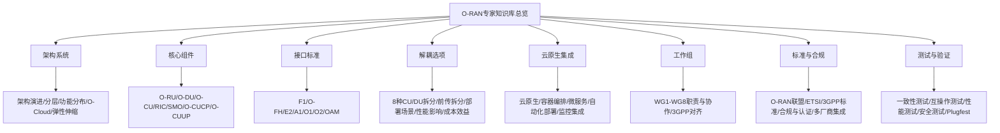
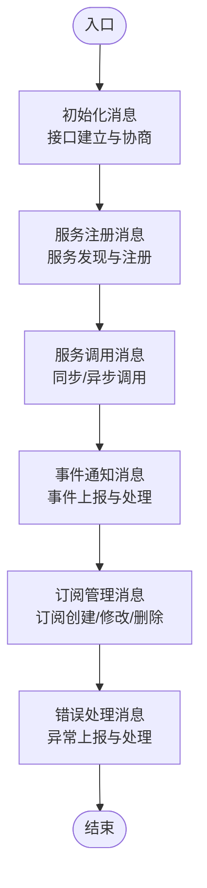

# O-RAN联盟标准体系

<cite>
**本文引用的文件**
- [O-RAN专家知识库总览](file://README.md)
- [工作组详细职责](file://06-working-groups/wg-detailed-responsibilities.md)
- [O-RAN架构系统概览](file://01-architecture-system/readme.md)
- [O-RIC（RAN智能控制器）](file://02-core-components/o-ric.md)
- [E2接口](file://03-interface-standards/e2-interface.md)
- [开放前传接口（O-FH）](file://03-interface-standards/o-fh-interface.md)
- [云原生架构与O-RAN集成](file://05-cloud-integration/cloud-native-architecture.md)
- [O-RAN标准与规范](file://09-standards-compliance/readme.md)
- [O-RAN一致性测试](file://13-testing-validation/conformance-testing/o-ran-conformance-testing.md)
</cite>

## 目录
1. [引言](#引言)
2. [项目结构](#项目结构)
3. [核心组件](#核心组件)
4. [架构总览](#架构总览)
5. [详细组件分析](#详细组件分析)
6. [依赖关系分析](#依赖关系分析)
7. [性能考虑](#性能考虑)
8. [故障排查指南](#故障排查指南)
9. [结论](#结论)
10. [附录](#附录)

## 引言
本文件面向O-RAN联盟标准体系的系统化解读，围绕六大工作组（WG2-WG8）的职责与规范，结合O-RAN整体架构、RIC架构、SMO架构、O-CU/O-DU/O-RU功能划分、接口定义与关系，以及白盒硬件规格、容器化部署规范、软件组件接口规范、软件生命周期管理与更新升级规范，提供权威、可操作的规范指导。同时给出标准文档获取渠道与版本跟踪方法，帮助读者在生产环境中高效落地O-RAN标准。

## 项目结构
该知识库以主题域组织，形成“架构—组件—接口—解耦—云原生—工作组—标准—测试”的完整知识链路，便于从宏观到微观逐层推进学习与落地。

图表来源
- [O-RAN专家知识库总览](file://README.md#L6-L54)

章节来源
- [O-RAN专家知识库总览](file://README.md#L6-L54)

## 核心组件
- O-RU（射频单元）：射频处理、数字前端、天线连接与同步功能
- O-DU（分布式单元）：物理层处理、MAC部分功能、实时性分析
- O-CU（集中式单元）：CU-CP（RRC层、NG接口控制面）、CU-UP（PDCP/SDAP用户面）
- O-RIC（RAN智能控制器）：近实时RIC（毫秒级闭环、xApps运行环境）、非实时RIC（秒至分钟级策略、rApps运行环境）
- SMO（服务管理与编排）：网络服务生命周期、配置/故障/性能管理
- O-CUCP/O-CUUP：跨厂商协调与管理功能

章节来源
- [O-RAN架构系统概览](file://01-architecture-system/readme.md#L15-L25)
- [O-RIC（RAN智能控制器）](file://02-core-components/o-ric.md#L1-L73)

## 架构总览
- 架构演进：从传统RAN到O-RAN的技术演进
- 分层架构：服务层、控制层、管理层划分与职责边界
- 功能分布：各层功能与责任边界
- O-Cloud架构：基于云原生的基础设施层设计
- 弹性伸缩：O-RAN架构的弹性扩展能力与设计原则

章节来源
- [O-RAN架构系统概览](file://01-architecture-system/readme.md#L8-L13)

## 详细组件分析

### 工作组职责与规范（WG2-WG8）
- WG1：架构与用例定义，输出参考架构、用例文档与设计指南
- WG2：非实时RIC与A1接口，定义Non-RT RIC架构、A1接口协议与策略管理框架
- WG3：近实时RIC与E2接口，定义Near-RT RIC架构、E2接口协议与xApps框架
- WG4：O-CU/O-DU/O-RU接口，定义F1接口增强、O-FH前传接口与测试规范
- WG5：服务管理与编排，定义SMO架构、O1接口与服务编排规范
- WG6：安全，定义安全架构、接口安全与安全测试要求
- WG8：测试与集成，定义测试框架、集成指南与互操作性测试规范

章节来源
- [工作组详细职责](file://06-working-groups/wg-detailed-responsibilities.md#L7-L607)

### RIC架构与SMO架构
- Near-RT RIC：毫秒级控制闭环、xApps运行环境、E2接口服务、实时数据处理
- Non-RT RIC：策略管理、rApps运行环境、A1接口服务、数据分析与建模
- SMO：配置/故障/性能管理、软件生命周期、网络服务编排与安全合规

章节来源
- [O-RIC（RAN智能控制器）](file://02-core-components/o-ric.md#L7-L73)
- [O-RIC（RAN智能控制器）](file://02-core-components/o-ric.md#L96-L117)
- [O-RIC（RAN智能控制器）](file://02-core-components/o-ric.md#L214-L301)

### 接口标准体系
- E2接口：基于SCTP/STREAMS的服务化接口，支持服务发现、调用、事件通知与订阅管理
- A1接口：Non-RT RIC与Near-RT RIC之间的策略管理接口，RESTful架构
- O1接口：SMO与网络元素之间的管理接口，基于NETCONF/YANG
- O-FH接口：O-DU与O-RU之间的标准化前传接口，支持eCPRI/RoE，含同步与定时要求
- F1接口：O-CU/O-DU之间的3GPP定义接口，支持控制面与用户面分离
- O2/OAM接口：云资源管理与整体网络管理监控接口

章节来源
- [E2接口](file://03-interface-standards/e2-interface.md#L1-L337)
- [开放前传接口（O-FH）](file://03-interface-standards/o-fh-interface.md#L1-L397)
- [O-RAN架构系统概览](file://01-architecture-system/readme.md#L27-L34)

### 白盒硬件规格与前传要求
- 白盒O-RU/O-DU硬件规格、通用硬件平台要求、HAL规范与兼容性测试
- O-FH前传接口的协议栈（eCPRI/RoE）、消息格式、同步与定时机制、带宽与延迟要求

章节来源
- [O-RAN标准与规范](file://09-standards-compliance/readme.md#L21-L26)
- [开放前传接口（O-FH）](file://03-interface-standards/o-fh-interface.md#L61-L97)

### 容器化部署规范与云原生集成
- 容器化：功能组件容器化、快速部署与扩缩容、资源利用率提升
- 微服务架构：功能拆分、独立部署与扩展、容错性与技术多样性
- 自动化编排：Kubernetes编排、自动扩缩容、自我修复、服务发现
- 基础设施即代码：IaC自动化、网络配置代码化、环境复制与一致性
- 部署模式：集中式、边缘云、混合云三种模式及适用场景与优劣势

章节来源
- [云原生架构与O-RAN集成](file://05-cloud-integration/cloud-native-architecture.md#L9-L64)
- [云原生架构与O-RAN集成](file://05-cloud-integration/cloud-native-architecture.md#L65-L122)
- [云原生架构与O-RAN集成](file://05-cloud-integration/cloud-native-architecture.md#L235-L296)

### 软件组件接口规范与生命周期管理
- 软件架构定义、容器化部署规范、组件接口规范
- 软件生命周期管理：版本控制、发布流程、灰度发布、回滚策略
- 软件更新与升级规范：滚动更新、蓝绿部署、金丝雀发布、资源管理

章节来源
- [O-RAN标准与规范](file://09-standards-compliance/readme.md#L27-L32)
- [云原生架构与O-RAN集成](file://05-cloud-integration/cloud-native-architecture.md#L207-L234)

### 安全规范与测试规范
- 安全架构：威胁分析、安全机制设计、合规要求
- 接口安全：认证、授权、加密、密钥管理
- 测试规范：一致性测试、互操作性测试、性能测试、安全测试、Plugfest指南

章节来源
- [O-RAN标准与规范](file://09-standards-compliance/readme.md#L33-L44)
- [O-RAN一致性测试](file://13-testing-validation/conformance-testing/o-ran-conformance-testing.md#L1-L67)

### 关键流程图：E2接口消息处理与服务模型

图表来源
- [E2接口](file://03-interface-standards/e2-interface.md#L79-L89)

## 依赖关系分析
- 组件耦合：O-RIC与CU/DU通过E2接口耦合；Non-RT RIC与Near-RT RIC通过A1接口耦合；SMO通过O1接口管理网络元素
- 外部依赖：3GPP标准（NG-RAN、F1/E1/Xn等）、ETSI标准（A1接口、前传接口、安全架构）
- 协作机制：工作组间技术协调、文档一致性、用例驱动；与3GPP的职责分工与互补关系

章节来源
- [工作组详细职责](file://06-working-groups/wg-detailed-responsibilities.md#L419-L490)
- [O-RAN标准与规范](file://09-standards-compliance/readme.md#L78-L108)

## 性能考虑
- E2接口：SCTP参数优化、多流配置、多路径、消息压缩、批量处理、缓存机制、网络拓扑优化、SR-IOV/DPDK加速、负载均衡
- O-FH接口：带宽需求计算、延迟控制、链路冗余、QoS配置、传输介质选择（光纤/无线/混合）、同步精度与稳定性
- RIC：Near-RT RIC低延迟优化、Non-RT RIC数据处理与模型训练优化、xApps/rApps性能优化、系统集成优化

章节来源
- [E2接口](file://03-interface-standards/e2-interface.md#L131-L147)
- [开放前传接口（O-FH）](file://03-interface-standards/o-fh-interface.md#L117-L178)
- [O-RIC（RAN智能控制器）](file://02-core-components/o-ric.md#L283-L301)

## 故障排查指南
- E2接口：连接故障、消息故障、服务故障、性能故障的定位与恢复；告警分级、关联分析、自动化处理
- O-FH接口：连接故障、同步故障、性能劣化、硬件故障的定位与恢复；告警处理、配置变更与回滚
- RIC：接口状态、应用状态、资源利用率、处理延迟的监控与告警；配置变更管理、故障定位与恢复

章节来源
- [E2接口](file://03-interface-standards/e2-interface.md#L170-L189)
- [开放前传接口（O-FH）](file://03-interface-standards/o-fh-interface.md#L247-L266)
- [O-RIC（RAN智能控制器）](file://02-core-components/o-ric.md#L261-L282)

## 结论
O-RAN联盟标准体系以工作组为核心，围绕架构、接口、硬件、软件、安全与测试六大维度形成闭环标准。通过云原生技术与O-RAN深度融合，结合严格的测试与合规流程，可在多厂商环境下实现高可靠、低时延、可扩展的5G/6G无线接入网络。建议在生产实践中以工作组标准为依据，结合一致性测试与Plugfest互操作验证，持续跟踪标准演进，确保系统与生态的长期兼容与先进性。

## 附录

### 标准文档获取渠道与版本跟踪
- O-RAN联盟官网与规范库
- ETSI O-RAN标准库
- 3GPP RAN规范
- O-RAN软件社区（OSCO）

章节来源
- [O-RAN专家知识库总览](file://README.md#L299-L306)
- [O-RAN标准与规范](file://09-standards-compliance/readme.md#L248-L288)

### 生产环境中的工作组标准应用
- 标准选择：版本成熟度、互操作性、支持期限与演进路径
- 合规验证：接口一致性测试、功能验证、业务场景测试
- 部署策略：渐进式部署与混合部署，确保平滑过渡

章节来源
- [工作组详细职责](file://06-working-groups/wg-detailed-responsibilities.md#L491-L528)