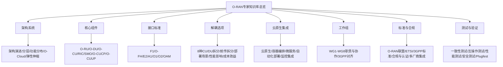

# O-RAN联盟标准体系

<cite>
**本文引用的文件**
- [O-RAN专家知识库总览](file://README.md)
- [工作组详细职责](file://06-working-groups/wg-detailed-responsibilities.md)
- [O-RAN架构系统概览](file://01-architecture-system/readme.md)
- [O-RIC（RAN智能控制器）](file://02-core-components/o-ric.md)
- [E2接口](file://03-interface-standards/e2-interface.md)
- [开放前传接口（O-FH）](file://03-interface-standards/o-fh-interface.md)
- [云原生架构与O-RAN集成](file://05-cloud-integration/cloud-native-architecture.md)
- [O-RAN标准与规范](file://09-standards-compliance/readme.md)
- [O-RAN联盟规范深度分析](file://09-standards-compliance/oran-alliance-specs/oran-alliance-specs-deep-dive.md)
- [ETSI标准深度分析](file://09-standards-compliance/etsi-standards/etsi-standards-deep-dive.md)
- [合规认证深度分析](file://09-standards-compliance/compliance-certification/compliance-certification-deep-dive.md)
- [O-RAN一致性测试](file://13-testing-validation/conformance-testing/o-ran-conformance-testing.md)
</cite>

## 目录
1. [引言](#引言)
2. [项目结构](#项目结构)
3. [核心组件](#核心组件)
4. [架构总览](#架构总览)
5. [详细组件分析](#详细组件分析)
6. [依赖关系分析](#依赖关系分析)
7. [性能考虑](#性能考虑)
8. [故障排查指南](#故障排查指南)
9. [结论](#结论)
10. [附录](#附录)

## 引言
本文件面向O-RAN联盟标准体系的系统化解读，围绕六大工作组（WG2-WG8）的职责与规范，结合O-RAN整体架构、RIC架构、SMO架构、O-CU/O-DU/O-RU功能划分、接口定义与关系，以及白盒硬件规格、容器化部署规范、软件组件接口规范、软件生命周期管理与更新升级规范，提供权威、可操作的规范指导。同时给出标准文档获取渠道与版本跟踪方法，帮助读者在生产环境中高效落地O-RAN标准。

**更新说明**：本次更新新增了O-RAN联盟规范的深度分析内容，涵盖WG2-WG8工作组的完整规范要求和合规性要求，为生产环境部署提供更详细的指导。

## 项目结构
该知识库以主题域组织，形成"架构—组件—接口—解耦—云原生—工作组—标准—测试"的完整知识链路，便于从宏观到微观逐层推进学习与落地。

**图表来源**
- [O-RAN专家知识库总览:6-54](file://README.md#L6-L54)

**章节来源**
- [O-RAN专家知识库总览:6-54](file://README.md#L6-L54)

## 核心组件
- O-RU（射频单元）：射频处理、数字前端、天线连接与同步功能
- O-DU（分布式单元）：物理层处理、MAC部分功能、实时性分析
- O-CU（集中式单元）：CU-CP（RRC层、NG接口控制面）、CU-UP（PDCP/SDAP用户面）
- O-RIC（RAN智能控制器）：近实时RIC（毫秒级闭环、xApps运行环境）、非实时RIC（秒至分钟级策略、rApps运行环境）
- SMO（服务管理与编排）：网络服务生命周期、配置/故障/性能管理
- O-CUCP/O-CUUP：跨厂商协调与管理功能

**章节来源**
- [O-RAN架构系统概览:15-25](file://01-architecture-system/readme.md#L15-L25)
- [O-RIC（RAN智能控制器）:1-73](file://02-core-components/o-ric.md#L1-L73)

## 架构总览
- 架构演进：从传统RAN到O-RAN的技术演进
- 分层架构：服务层、控制层、管理层划分与职责边界
- 功能分布：各层功能与责任边界
- O-Cloud架构：基于云原生的基础设施层设计
- 弹性伸缩：O-RAN架构的弹性扩展能力与设计原则

**章节来源**
- [O-RAN架构系统概览:8-13](file://01-architecture-system/readme.md#L8-L13)

## 详细组件分析

### O-RAN联盟规范体系深度分析

#### WG2：架构规范（Architecture Specifications）
WG2负责定义O-RAN的整体架构，包括：

**O-RAN架构概述**
- **开放性**：支持多厂商部署的标准化接口
- **智能化**：通过RIC实现AI/ML驱动的网络优化
- **解耦性**：分离硬件和软件组件以实现灵活性
- **云原生**：利用云技术实现可扩展性和韧性

**核心架构组件**
- **O-RAN无线单元（O-RU）**：处理物理层功能和射频处理
- **O-RAN分布式单元（O-DU）**：处理实时L1/L2功能
- **O-RAN集中式单元（O-CU）**：处理非实时L2/L3功能，分为CU-CP（控制面）和CU-UP（用户面）
- **近实时RIC**：提供近实时控制和优化（10ms-1s）
- **非实时RIC**：提供非实时优化和策略管理（>1s）
- **SMO（服务管理和编排）**：提供管理和编排功能

**关键接口定义**
- **E2接口**：连接近实时RIC到O-CU和O-DU
- **A1接口**：连接非实时RIC到近实时RIC
- **O1接口**：连接SMO到O-RAN网络元素
- **O2接口**：连接SMO到O-Cloud基础设施
- **O-FH接口**：连接O-DU到O-RU（前传）
- **M-Plane接口**：O-RU配置的平面管理接口

**RIC架构**
- **Near-RT RIC架构**：基于容器的微服务设计，支持可扩展性；处理E2接口连接；管理xApp生命周期；执行基于Non-RT RIC输入的策略；收集并提供实时网络数据访问
- **Non-RT RIC架构**：管理A1策略及其生命周期；提供rApps执行环境；执行长期数据分析和模式识别；管理机器学习模型训练和部署；与SMO集成进行管理和编排

**SMO架构**
- **管理功能**：配置、故障、性能和安全管理
- **编排功能**：服务编排和生命周期管理
- **自动化功能**：自动部署、扩缩容和自愈
- **分析功能**：网络分析和报告
- **集成功能**：与外部系统和OSS/BSS集成

**章节来源**
- [O-RAN联盟规范深度分析:9-71](file://09-standards-compliance/oran-alliance-specs/oran-alliance-specs-deep-dive.md#L9-L71)

#### WG3：接口规范（Interface Specifications）
WG3定义了O-RAN的关键接口规范：

**E2接口规范**
- **协议栈**：SCTP over IP用于可靠传输；E2AP（E2应用协议）用于信令；E2SM-KPM、E2SM-RC、E2SM-GNB-CU-UP服务模型
- **服务模型**：E2SM-KPM（关键性能指标）启用性能指标订阅；E2SM-RC（RAN控制）允许对RAN元素的控制命令；E2SM-GNB-CU-UP提供CU-UP功能的控制能力；自定义E2SM支持厂商特定服务模型
- **节点管理**：E2节点的自动发现和注册；E2节点连接的持续监控；跨E2节点的xApp工作负载分发；带资源清理的控制断开

**A1接口规范**
- **策略框架**：指导、执行和信息策略；策略创建、更新、删除和状态监控；基于JSON的策略定义；向近实时RIC实例的高效分发
- **服务操作**：A1策略的CRUD操作；来自近实时RIC的执行通知；长作业协调；上下文信息分发

**O1接口规范**
- **管理服务**：网络元素配置；告警和事件管理；性能数据收集；安全策略执行；配置文件和日志文件传输
- **协议栈**：TCP/HTTP(S)用于可靠传输；YANG模型用于配置和状态数据；RESTful API用于管理操作；TLS用于安全通信

**O-FH接口规范**
- **协议栈**：eCPRI用于高吞吐量数据传输；O-FH控制平面用于配置；精确时间协议；O-RU管理和配置
- **拆分选项**：Split 7.2x在O-DU和O-RU之间的功能拆分；Split 8在O-RU中的完整物理层；Split 7.3部分物理层拆分；厂商特定的功能拆分

**章节来源**
- [O-RAN联盟规范深度分析:72-152](file://09-standards-compliance/oran-alliance-specs/oran-alliance-specs-deep-dive.md#L72-L152)

#### WG4：硬件规范（Hardware Specifications）
WG4定义了白盒硬件规范：

**白盒O-RU硬件规范**
- **硬件要求**：频段、功率等级、调制支持的RF要求；物理层处理的FPGA/ASIC要求；前传接口合规性；温度、湿度和电源规格的环境要求；外形尺寸、安装和冷却的机械要求
- **硬件抽象层（HAL）**：软件和硬件之间的抽象；硬件访问的标准接口；厂商特定的实现；HAL实现的合规性测试

**白盒O-DU硬件规范**
- **硬件平台要求**：CPU、内存和存储规格的计算要求；L1处理的硬件加速要求；网络接口规格；MTBF和可用性规格的可靠性要求；吞吐量和延迟规格的性能要求
- **硬件兼容性测试**：标准化的测试方法；硬件测试工具和设备；全面的测试场景覆盖；标准化的测试结果报告

**章节来源**
- [O-RAN联盟规范深度分析:153-190](file://09-standards-compliance/oran-alliance-specs/oran-alliance-specs-deep-dive.md#L153-L190)

#### WG5：软件规范（Software Specifications）
WG5定义了O-RAN软件架构：

**O-RAN软件架构**
- **软件组件**：操作系统、容器运行时、编排的平台软件；xApps、rApps和网络功能的应用软件；SMO和管理工具的管理软件；接口适配器和中间件的集成软件
- **软件生命周期管理**：使用CI/CD管道的自动部署；动态配置管理；水平和垂直缩放机制；自动故障检测和恢复；零停机升级程序

**容器化部署规范**
- **容器要求**：标准化镜像格式和注册表的容器镜像；容器运行时要求（Docker、containerd）；Kubernetes原生部署和管理；CPU、内存和存储资源分配；容器的微分段网络策略
- **部署模式**：分解应用程序的微服务部署；辅助服务的边车模式；初始化和设置容器的初始化容器；一次性执行的批处理作业

**章节来源**
- [O-RAN联盟规范深度分析:191-228](file://09-standards-compliance/oran-alliance-specs/oran-alliance-specs-deep-dive.md#L191-L228)

#### WG6：安全规范（Security Specifications）
WG6定义了O-RAN安全架构：

**O-RAN安全架构**
- **安全框架**：全面威胁建模和风险评估；所有组件的安全要求；安全控制的实施；定期安全评估和审计
- **接口安全**：相互认证、加密、完整性保护的E2接口安全；基于TLS的安全通信的A1接口安全；基于角色的访问控制、审计日志的O1接口安全；安全前传通信的O-FH接口安全

**认证和授权**
- **认证机制**：X.509证书认证的基于证书的认证；JWT/OAuth2认证的基于令牌的认证；增强安全的MFA的多因素认证；持续验证和最小权限的零信任架构
- **授权框架**：基于角色的权限的基于角色的访问控制（RBAC）；基于属性的策略的基于属性的访问控制（ABAC）；实时策略执行；全面的审计轨迹的审计日志

**章节来源**
- [O-RAN联盟规范深度分析:229-264](file://09-standards-compliance/oran-alliance-specs/oran-alliance-specs-deep-dive.md#L229-L264)

#### WG8：测试规范（Testing Specifications）
WG8定义了互操作性测试规范：

**互操作性测试**
- **测试框架**：测试环境架构；测试工具和设备；标准化测试程序；测试结果报告格式
- **测试场景**：接口连通性验证的基本连通性；功能和功能验证的功能测试；性能和可扩展性测试的性能测试；负载和压力测试的压力测试；错误处理和边缘情况测试的负面测试

**一致性测试**
- **一致性测试套件**：协议实现验证的协议一致性；接口规范合规的接口一致性；功能实现验证的功能一致性；性能要求验证的性能一致性
- **认证流程**：一致性测试执行；测试结果分析和报告；成功完成后的认证颁发；持续合规监控的认证维护

**章节来源**
- [O-RAN联盟规范深度分析:265-301](file://09-standards-compliance/oran-alliance-specs/oran-alliance-specs-deep-dive.md#L265-L301)

### 工作组职责与规范（WG2-WG8）
- WG1：架构与用例定义，输出参考架构、用例文档与设计指南
- WG2：非实时RIC与A1接口，定义Non-RT RIC架构、A1接口协议与策略管理框架
- WG3：近实时RIC与E2接口，定义Near-RT RIC架构、E2接口协议与xApps框架
- WG4：O-CU/O-DU/O-RU接口，定义F1接口增强、O-FH前传接口与测试规范
- WG5：服务管理与编排，定义SMO架构、O1接口与服务编排规范
- WG6：安全，定义安全架构、接口安全与安全测试要求
- WG8：测试与集成，定义测试框架、集成指南与互操作性测试规范

**章节来源**
- [工作组详细职责:7-607](file://06-working-groups/wg-detailed-responsibilities.md#L7-L607)

### RIC架构与SMO架构
- Near-RT RIC：毫秒级控制闭环、xApps运行环境、E2接口服务、实时数据处理
- Non-RT RIC：策略管理、rApps运行环境、A1接口服务、数据分析与建模
- SMO：配置/故障/性能管理、软件生命周期、网络服务编排与安全合规

**章节来源**
- [O-RIC（RAN智能控制器）:7-73](file://02-core-components/o-ric.md#L7-L73)
- [O-RIC（RAN智能控制器）:96-117](file://02-core-components/o-ric.md#L96-L117)
- [O-RIC（RAN智能控制器）:214-301](file://02-core-components/o-ric.md#L214-L301)

### 接口标准体系
- E2接口：基于SCTP/STREAMS的服务化接口，支持服务发现、调用、事件通知与订阅管理
- A1接口：Non-RT RIC与Near-RT RIC之间的策略管理接口，RESTful架构
- O1接口：SMO与网络元素之间的管理接口，基于NETCONF/YANG
- O-FH接口：O-DU与O-RU之间的标准化前传接口，支持eCPRI/RoE，含同步与定时要求
- F1接口：O-CU/O-DU之间的3GPP定义接口，支持控制面与用户面分离
- O2/OAM接口：云资源管理与整体网络管理监控接口

**章节来源**
- [E2接口:1-337](file://03-interface-standards/e2-interface.md#L1-L337)
- [开放前传接口（O-FH）:1-397](file://03-interface-standards/o-fh-interface.md#L1-L397)
- [O-RAN架构系统概览:27-34](file://01-architecture-system/readme.md#L27-L34)

### 白盒硬件规格与前传要求
- 白盒O-RU/O-DU硬件规格、通用硬件平台要求、HAL规范与兼容性测试
- O-FH前传接口的协议栈（eCPRI/RoE）、消息格式、同步与定时机制、带宽与延迟要求

**章节来源**
- [O-RAN标准与规范:21-26](file://09-standards-compliance/readme.md#L21-L26)
- [开放前传接口（O-FH）:61-97](file://03-interface-standards/o-fh-interface.md#L61-L97)

### 容器化部署规范与云原生集成
- 容器化：功能组件容器化、快速部署与扩缩容、资源利用率提升
- 微服务架构：功能拆分、独立部署与扩展、容错性与技术多样性
- 自动化编排：Kubernetes编排、自动扩缩容、自我修复、服务发现
- 基础设施即代码：IaC自动化、网络配置代码化、环境复制与一致性
- 部署模式：集中式、边缘云、混合云三种模式及适用场景与优劣势

**章节来源**
- [云原生架构与O-RAN集成:9-64](file://05-cloud-integration/cloud-native-architecture.md#L9-L64)
- [云原生架构与O-RAN集成:65-122](file://05-cloud-integration/cloud-native-architecture.md#L65-L122)
- [云原生架构与O-RAN集成:235-296](file://05-cloud-integration/cloud-native-architecture.md#L235-L296)

### 软件组件接口规范与生命周期管理
- 软件架构定义、容器化部署规范、组件接口规范
- 软件生命周期管理：版本控制、发布流程、灰度发布、回滚策略
- 软件更新与升级规范：滚动更新、蓝绿部署、金丝雀发布、资源管理

**章节来源**
- [O-RAN标准与规范:27-32](file://09-standards-compliance/readme.md#L27-L32)
- [云原生架构与O-RAN集成:207-234](file://05-cloud-integration/cloud-native-architecture.md#L207-L234)

### 安全规范与测试规范
- 安全架构：威胁分析、安全机制设计、合规要求
- 接口安全：认证、授权、加密、密钥管理
- 测试规范：一致性测试、互操作性测试、性能测试、安全测试、Plugfest指南

**章节来源**
- [O-RAN标准与规范:33-44](file://09-standards-compliance/readme.md#L33-L44)
- [O-RAN一致性测试:1-67](file://13-testing-validation/conformance-testing/o-ran-conformance-testing.md#L1-L67)

### 关键流程图：E2接口消息处理与服务模型

**图表来源**
- [E2接口:79-89](file://03-interface-standards/e2-interface.md#L79-L89)

## 依赖关系分析
- 组件耦合：O-RIC与CU/DU通过E2接口耦合；Non-RT RIC与Near-RT RIC通过A1接口耦合；SMO通过O1接口管理网络元素
- 外部依赖：3GPP标准（NG-RAN、F1/E1/Xn等）、ETSI标准（A1接口、前传接口、安全架构）
- 协作机制：工作组间技术协调、文档一致性、用例驱动；与3GPP的职责分工与互补关系

**章节来源**
- [工作组详细职责:419-490](file://06-working-groups/wg-detailed-responsibilities.md#L419-L490)
- [O-RAN标准与规范:78-108](file://09-standards-compliance/readme.md#L78-L108)

## 性能考虑
- E2接口：SCTP参数优化、多流配置、多路径、消息压缩、批量处理、缓存机制、网络拓扑优化、SR-IOV/DPDK加速、负载均衡
- O-FH接口：带宽需求计算、延迟控制、链路冗余、QoS配置、传输介质选择（光纤/无线/混合）、同步精度与稳定性
- RIC：Near-RT RIC低延迟优化、Non-RT RIC数据处理与模型训练优化、xApps/rApps性能优化、系统集成优化

**章节来源**
- [E2接口:131-147](file://03-interface-standards/e2-interface.md#L131-L147)
- [开放前传接口（O-FH）:117-178](file://03-interface-standards/o-fh-interface.md#L117-L178)
- [O-RIC（RAN智能控制器）:283-301](file://02-core-components/o-ric.md#L283-L301)

## 故障排查指南
- E2接口：连接故障、消息故障、服务故障、性能故障的定位与恢复；告警分级、关联分析、自动化处理
- O-FH接口：连接故障、同步故障、性能劣化、硬件故障的定位与恢复；告警处理、配置变更与回滚
- RIC：接口状态、应用状态、资源利用率、处理延迟的监控与告警；配置变更管理、故障定位与恢复

**章节来源**
- [E2接口:170-189](file://03-interface-standards/e2-interface.md#L170-L189)
- [开放前传接口（O-FH）:247-266](file://03-interface-standards/o-fh-interface.md#L247-L266)
- [O-RIC（RAN智能控制器）:261-282](file://02-core-components/o-ric.md#L261-L282)

## 结论
O-RAN联盟标准体系以工作组为核心，围绕架构、接口、硬件、软件、安全与测试六大维度形成闭环标准。通过云原生技术与O-RAN深度融合，结合严格的测试与合规流程，可在多厂商环境下实现高可靠、低时延、可扩展的5G/6G无线接入网络。建议在生产实践中以工作组标准为依据，结合一致性测试与Plugfest互操作验证，持续跟踪标准演进，确保系统与生态的长期兼容与先进性。

**更新说明**：新增的O-RAN联盟规范深度分析内容为生产环境部署提供了更详细的指导，包括完整的WG2-WG8规范要求和合规性要求，有助于确保多厂商环境下的互操作性和合规性。

## 附录

### 标准文档获取渠道与版本跟踪
- O-RAN联盟官网与规范库
- ETSI O-RAN标准库
- 3GPP RAN规范
- O-RAN软件社区（OSCO）

**章节来源**
- [O-RAN专家知识库总览:299-306](file://README.md#L299-L306)
- [O-RAN标准与规范:248-288](file://09-standards-compliance/readme.md#L248-L288)

### 生产环境中的工作组标准应用
- 标准选择：版本成熟度、互操作性、支持期限与演进路径
- 合规验证：接口一致性测试、功能验证、业务场景测试
- 部署策略：渐进式部署与混合部署，确保平滑过渡

**章节来源**
- [工作组详细职责:491-528](file://06-working-groups/wg-detailed-responsibilities.md#L491-L528)

### 生产环境最佳实践

#### 规范合规性
- **早期参与**：尽早参与O-RAN联盟工作组
- **持续监控**：跟踪规范更新和变更
- **合规测试**：定期进行合规测试和验证
- **文档维护**：维护全面的合规文档

#### 多厂商集成
- **接口测试**：彻底的接口兼容性测试
- **Plugfest参与**：定期参与O-RAN Plugfest活动
- **问题解决**：建立问题解决流程
- **最佳实践分享**：与行业合作伙伴分享经验

#### 安全实施
- **设计即安全**：从一开始就实施安全
- **定期评估**：定期进行安全评估
- **事件响应**：建立事件响应程序
- **持续改进**：持续改进安全态势

**章节来源**
- [O-RAN联盟规范深度分析:302-324](file://09-standards-compliance/oran-alliance-specs/oran-alliance-specs-deep-dive.md#L302-L324)

### ETSI标准与O-RAN规范的关系

ETSI标准为O-RAN提供了具体的技术规范，与O-RAN联盟规范形成互补：

- **ETSI TS 103 859**：O-RAN前传控制、用户和同步平面规范
- **ETSI TS 103 983**：A1接口一般规范
- **ETSI TS 103 986**：A1接口传输协议规范
- **ETSI TS 103 987**：前传传输配置文件规范
- **ETSI GS ORAN-005**：O-RAN安全架构

这些ETSI标准为O-RAN联盟规范提供了具体的技术实现指导，确保不同厂商设备之间的互操作性。

**章节来源**
- [ETSI标准深度分析:1-200](file://09-standards-compliance/etsi-standards/etsi-standards-deep-dive.md#L1-L200)

### 合规认证流程

O-RAN认证过程包括多个阶段：

#### 认证类型
- **一致性认证**：规范合规性认证
- **互操作性认证**：多厂商互操作性认证
- **性能认证**：性能要求认证
- **安全认证**：安全要求认证
- **端到端认证**：完整解决方案认证

#### 认证流程步骤
- **申请**：提交认证申请
- **文档审查**：提交的文档审查
- **测试准备**：准备认证测试
- **测试执行**：执行认证测试
- **结果分析**：分析测试结果
- **认证颁发**：成功完成后颁发认证
- **认证维护**：通过持续合规维护认证

**章节来源**
- [合规认证深度分析:119-142](file://09-standards-compliance/compliance-certification/compliance-certification-deep-dive.md#L119-L142)