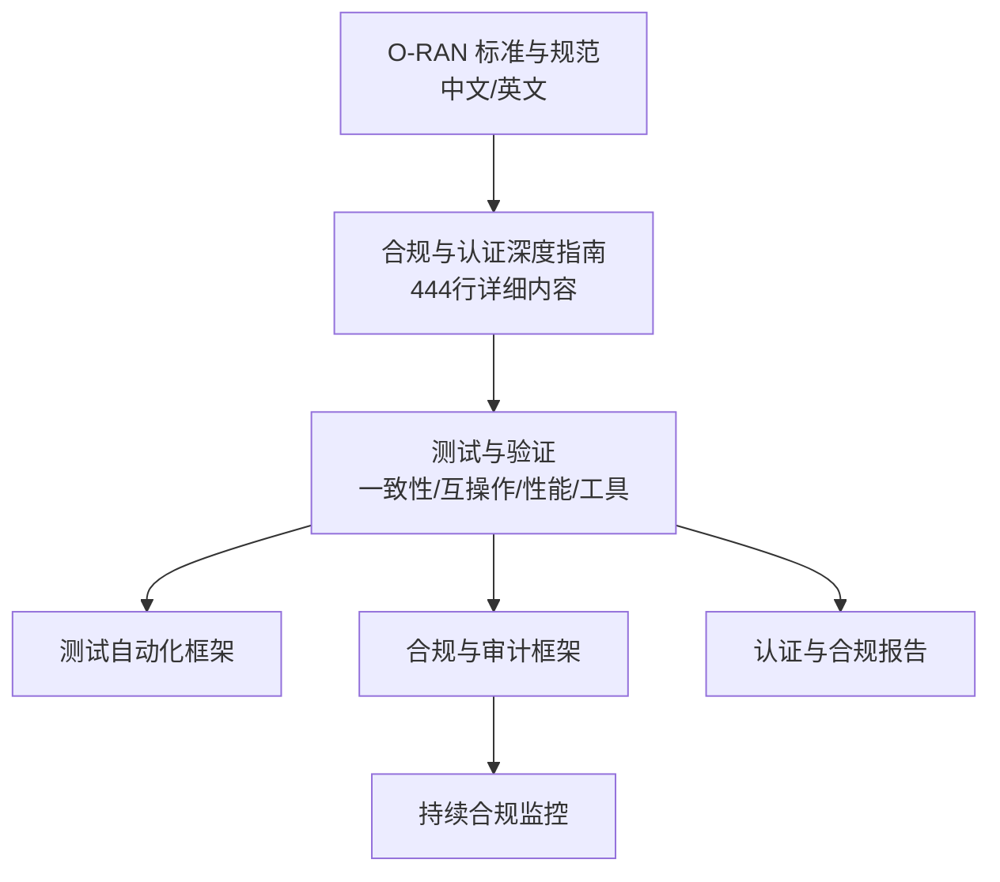
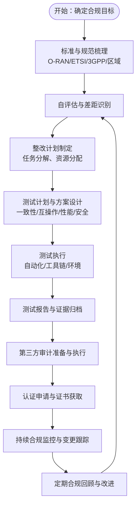
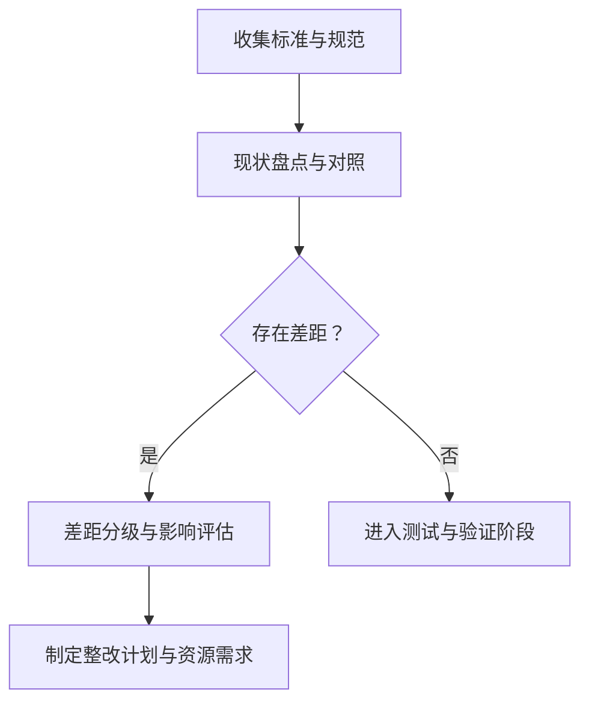
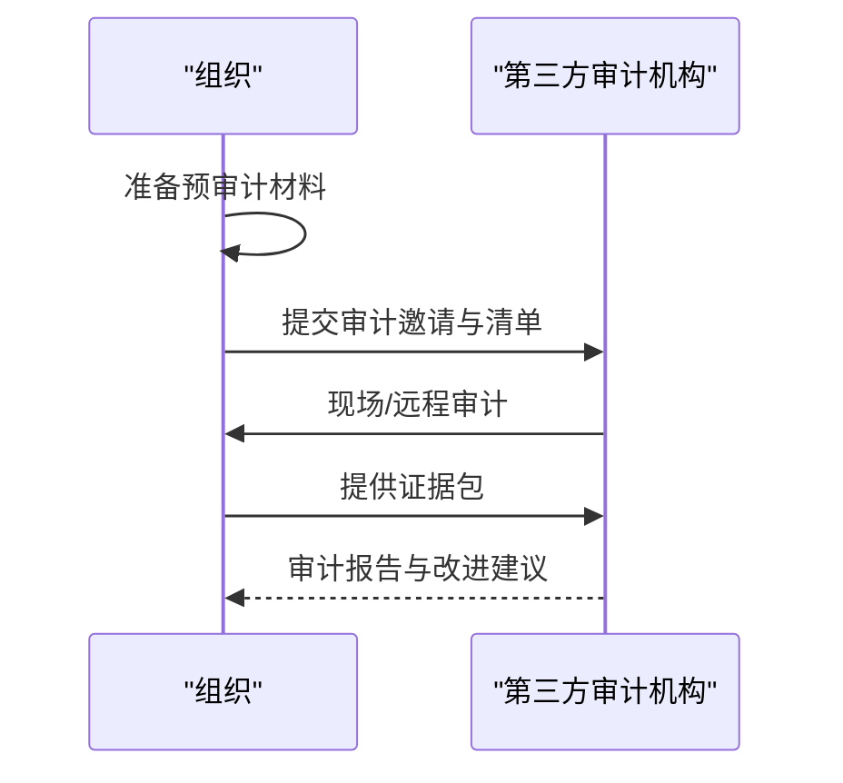
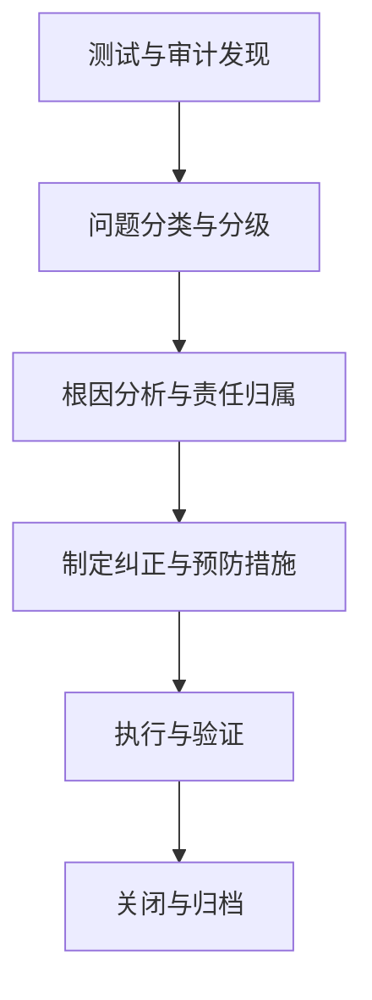
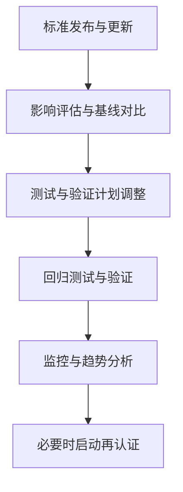
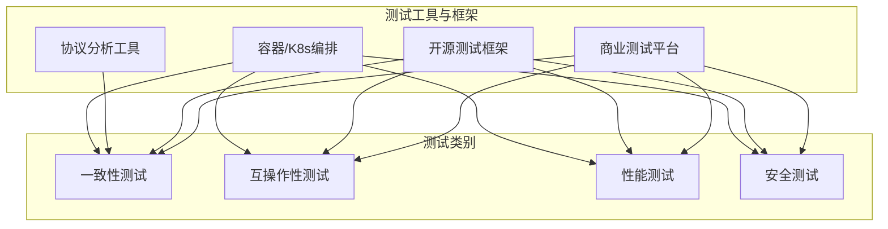
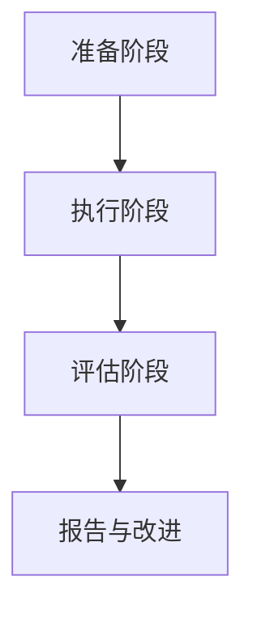
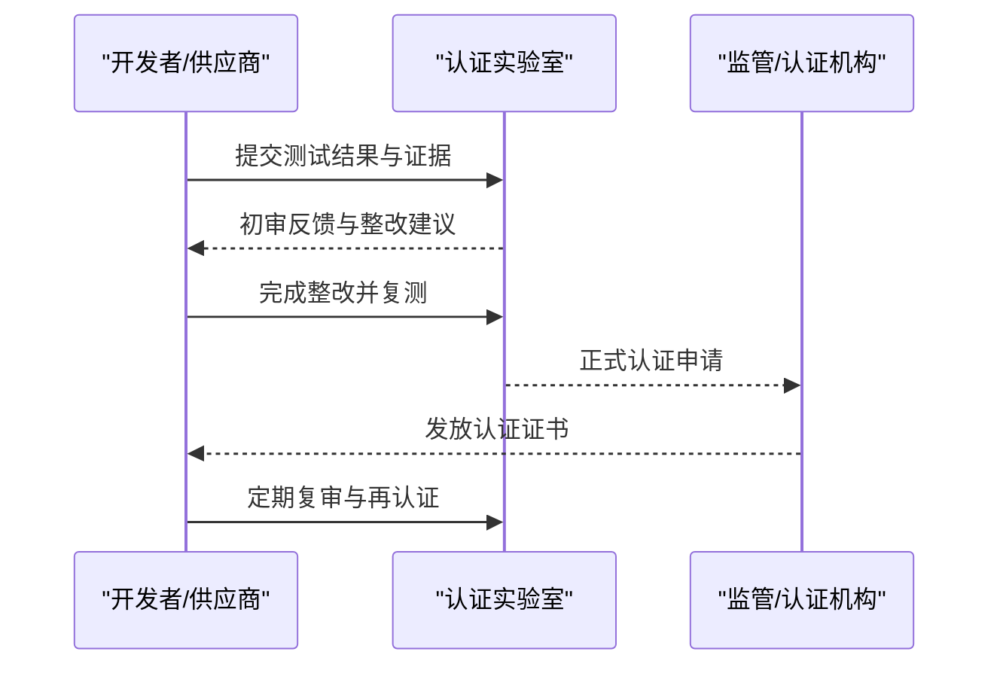
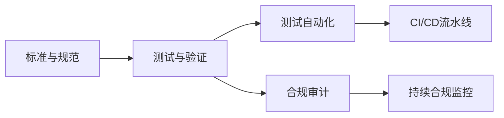

# 合规与认证

<cite>
**本文引用的文件**
- [O-RAN 标准与规范（中文）](file://09-standards-compliance/readme-zh.md)
- [O-RAN 标准与规范（英文）](file://09-standards-compliance/readme.md)
- [合规与认证深度指南](file://09-standards-compliance/compliance-certification/compliance-certification-deep-dive.md)
- [合规与认证概览](file://09-standards-compliance/compliance-certification/readme.md)
- [O-RAN 测试一致性验证（英文）](file://13-testing-validation/conformance-testing/o-ran-conformance-testing-en.md)
- [O-RAN 测试一致性验证（中文）](file://13-testing-validation/conformance-testing/o-ran-conformance-testing.md)
- [O-RAN 互操作性测试（中文）](file://13-testing-validation/interoperability/interoperability-testing.md)
- [O-RAN 测试工具与框架（中文）](file://13-testing-validation/testing-tools/testing-tools-frameworks.md)
- [O-RAN 测试自动化框架（中文）](file://13-testing-validation/automation-framework/test-automation-framework.md)
- [O-RAN 合规与审计框架（中文）](file://12-security-privacy/compliance-auditing/compliance-auditing-framework.md)
- [ETSI O-RAN 标准深度指南](file://09-standards-compliance/etsi-standards/etsi-standards-deep-dive.md)
- [O-RAN 联盟规范深度指南](file://09-standards-compliance/oran-alliance-specs/oran-alliance-specs-deep-dive.md)
- [O-RAN 专家知识库总览（中文）](file://README.md)
</cite>

## 更新摘要
**变更内容**
- 新增了完整的合规与认证深度指南章节，涵盖444行详细内容
- 扩展了合规要求部分，包括O-RAN联盟、ETSI、3GPP标准的详细合规要求
- 增加了认证流程的完整说明，包括自评估、第三方审计、合规报告等
- 完善了测试实验室信息，包括认证实验室列表、设备要求和测试程序
- 增强了持续合规监控机制和标准变更跟踪流程

## 目录
1. [引言](#引言)
2. [项目结构](#项目结构)
3. [核心组件](#核心组件)
4. [架构总览](#架构总览)
5. [详细组件分析](#详细组件分析)
6. [依赖分析](#依赖分析)
7. [性能考虑](#性能考虑)
8. [故障排查指南](#故障排查指南)
9. [结论](#结论)
10. [附录](#附录)

## 引言
本文件面向合规与认证全流程，系统梳理 O-RAN 联盟、ETSI、3GPP 标准的合规要求与认证流程，结合仓库内测试与合规相关文档，给出从自评估、第三方审计、合规报告、不符合项处理到持续合规监控的完整实施步骤，并覆盖认证后持续合规管理与标准变更跟踪机制。同时，提供测试实验室与工具选型建议、测试程序与报告模板、以及互操作性测试与认证申请的关键要点。

**更新** 新增了详细的合规与认证深度指南，提供了更全面的合规要求和认证流程指导。

## 项目结构
本知识库围绕"标准与合规""测试与验证""安全与审计"三大主线组织，形成从标准理解、测试执行、自动化落地到合规审计与持续监控的闭环。

**图表来源**
- [O-RAN 标准与规范（中文）:1-371](file://09-standards-compliance/readme-zh.md#L1-L371)
- [合规与认证深度指南:1-444](file://09-standards-compliance/compliance-certification/compliance-certification-deep-dive.md#L1-L444)
- [O-RAN 测试一致性验证（英文）:1-617](file://13-testing-validation/conformance-testing/o-ran-conformance-testing-en.md#L1-L617)
- [O-RAN 互操作性测试（中文）:1-231](file://13-testing-validation/interoperability/interoperability-testing.md#L1-L231)
- [O-RAN 测试工具与框架（中文）:1-598](file://13-testing-validation/testing-tools/testing-tools-frameworks.md#L1-L598)
- [O-RAN 测试自动化框架（中文）:1-134](file://13-testing-validation/automation-framework/test-automation-framework.md#L1-L134)
- [O-RAN 合规与审计框架（中文）:1-486](file://12-security-privacy/compliance-auditing/compliance-auditing-framework.md#L1-L486)

**章节来源**
- [O-RAN 专家知识库总览（中文）:48-54](file://README.md#L48-L54)

## 核心组件
- 标准与合规体系：O-RAN 联盟规范、ETSI 标准、3GPP 标准及区域/行业合规要求。
- 测试与验证：一致性测试、互操作性测试、性能测试、安全测试与工具链。
- 合规审计与持续监控：GDPR/Telecom 安全要求、第三方审计准备、证据收集、合规仪表盘与告警阈值。
- 自动化与流水线：CI/CD 集成、容器化测试环境、并行执行与结果分析。

**更新** 新增了完整的合规与认证深度指南，提供了更详细的合规要求和认证流程。

**章节来源**
- [合规与认证深度指南:9-444](file://09-standards-compliance/compliance-certification/compliance-certification-deep-dive.md#L9-L444)
- [O-RAN 标准与规范（中文）:110-135](file://09-standards-compliance/readme-zh.md#L110-L135)
- [O-RAN 标准与规范（英文）:110-135](file://09-standards-compliance/readme.md#L110-L135)
- [O-RAN 测试自动化框架（中文）:1-134](file://13-testing-validation/automation-framework/test-automation-framework.md#L1-L134)
- [O-RAN 合规与审计框架（中文）:1-486](file://12-security-privacy/compliance-auditing/compliance-auditing-framework.md#L1-L486)

## 架构总览
下图展示从标准理解到测试执行再到合规审计与持续监控的整体流程，强调"测试—认证—持续合规"的闭环。

**图表来源**
- [合规与认证深度指南:119-444](file://09-standards-compliance/compliance-certification/compliance-certification-deep-dive.md#L119-L444)
- [O-RAN 标准与规范（中文）:110-135](file://09-standards-compliance/readme-zh.md#L110-L135)
- [O-RAN 测试一致性验证（英文）:35-67](file://13-testing-validation/conformance-testing/o-ran-conformance-testing-en.md#L35-L67)
- [O-RAN 互操作性测试（中文）:179-192](file://13-testing-validation/interoperability/interoperability-testing.md#L179-L192)
- [O-RAN 合规与审计框架（中文）:432-486](file://12-security-privacy/compliance-auditing/compliance-auditing-framework.md#L432-L486)

## 详细组件分析

### 1. 标准与合规要求
**更新** 新增了详细的合规要求分类和具体要求。

#### O-RAN 联盟合规要求
- **接口合规**：E2、A1、O1、O-FH、M-Plane 接口规范符合性
- **架构合规**：组件架构、部署架构、安全架构、管理架构、集成架构
- **功能合规**：基础功能、高级功能、性能功能、安全功能、管理功能

#### ETSI 标准合规要求
- **前传合规**：协议合规、时序合规、性能合规、安全合规、管理合规
- **A1 接口合规**：协议合规、策略合规、安全合规、性能合规、管理合规

#### 3GPP 标准合规要求
- **NR 合规**：物理层合规、协议栈合规、接口合规、特性合规、性能合规
- **架构合规**：gNB 架构、CU-DU 拆分、接口协议、部署选项、集成要求

#### 区域监管合规要求
- **频谱合规**：频段、功率限制、干扰限制、许可要求、共享要求
- **安全合规**：电磁场暴露、安全标准、环境要求、健康要求、建筑规范

#### 行业特定合规要求
- **医疗行业**：医疗设备法规、患者安全、数据隐私、可靠性要求、互操作性
- **工业物联网**：工业安全、可靠性要求、环境要求、安全要求、互操作性

**章节来源**
- [合规与认证深度指南:9-118](file://09-standards-compliance/compliance-certification/compliance-certification-deep-dive.md#L9-L118)
- [O-RAN 标准与规范（中文）:8-109](file://09-standards-compliance/readme-zh.md#L8-L109)
- [O-RAN 标准与规范（英文）:8-109](file://09-standards-compliance/readme.md#L8-L109)

### 2. 认证流程
**更新** 新增了完整的认证流程说明，包括认证类型、流程步骤和各类认证要求。

#### O-RAN 认证程序
- **认证类型**：符合性认证、互操作性认证、性能认证、安全认证、端到端认证
- **认证流程步骤**：申请、文档审查、测试准备、测试执行、结果分析、认证颁发、认证维护

#### 符合性测试认证
- **测试类别**：协议符合性、接口符合性、特性符合性、性能符合性、安全符合性
- **测试程序**：测试计划、测试环境搭建、测试用例执行、结果记录、问题解决、重新测试、最终验证

#### 互操作性测试认证
- **测试场景**：基本连接性、功能测试、性能测试、压力测试、负向测试
- **测试环境**：多厂商设置、互操作性测试工具、标准化测试程序、测试结果分析、问题解决

#### 安全认证
- **安全测试类别**：漏洞评估、渗透测试、安全协议测试、访问控制测试、数据保护测试
- **安全认证流程**：安全评估、漏洞修复、安全测试、合规验证、安全认证颁发

#### 行业认证
- **行业认证**：医疗认证、工业认证、汽车认证、公共安全认证、企业网络认证
- **认证要求**：行业标准、监管要求、性能要求、安全要求、互操作性要求

**章节来源**
- [合规与认证深度指南:119-224](file://09-standards-compliance/compliance-certification/compliance-certification-deep-dive.md#L119-L224)

### 3. 测试实验室与设备
**更新** 新增了详细的测试实验室信息和设备要求。

#### O-RAN 认证实验室列表
- **实验室类型**：符合性测试实验室、互操作性测试实验室、性能测试实验室、安全测试实验室、端到端测试实验室
- **实验室位置**：北美、欧洲、亚太地区、其他地区、虚拟实验室

#### 测试实验室能力要求
- **技术能力**：测试设备、测试环境、测试软件、测试自动化、测试报告
- **运营能力**：测试规划、测试执行、结果分析、问题解决、认证支持

#### 测试设备和工具
- **测试设备**：协议分析仪、信号发生器、频谱分析仪、网络分析仪、安全测试工具
- **测试软件**：测试自动化软件、测试管理软件、结果分析软件、仿真软件、合规软件

#### 测试程序和流程
- **测试规划**：测试策略、测试计划开发、测试用例设计、测试环境搭建、测试数据准备
- **测试执行**：测试初始化、测试用例执行、测试监控、结果记录、问题记录

#### 测试报告和认证
- **测试报告结构**：执行摘要、测试方法、测试结果、问题摘要、改进建议
- **认证文档**：认证申请、测试证据、合规声明、认证颁发、维护文档

**章节来源**
- [合规与认证深度指南:225-318](file://09-standards-compliance/compliance-certification/compliance-certification-deep-dive.md#L225-L318)

### 4. 合规验证程序
**更新** 新增了完整的合规验证程序，包括自评估、第三方审计、合规报告等。

#### 自评估程序
- **自评估流程**：差距分析、需求映射、文档审查、实现验证、报告生成
- **自评估工具**：合规检查清单、差距分析工具、文档工具、验证工具、报告工具

#### 第三方审计
- **审计流程**：审计规划、审计准备、审计执行、审计报告、整改
- **审计类型**：合规审计、安全审计、性能审计、流程审计、认证审计

#### 合规报告
- **报告类型**：合规状态报告、差距分析报告、整改进度报告、第三方审计报告、认证状态报告
- **报告组件**：执行摘要、详细发现、差距分析、整改计划、改进建议

#### 不符合项处理
- **不符合项类型**：严重不符合项、主要不符合项、次要不符合项、观察项、改进机会
- **不符合项流程**：识别、记录、根因分析、纠正措施、验证、关闭

#### 持续合规监控
- **监控框架**：监控策略、监控工具、监控程序、监控报告、持续改进
- **监控活动**：定期评估、变更监控、性能监控、安全监控、审计监控

**章节来源**
- [合规与认证深度指南:319-411](file://09-standards-compliance/compliance-certification/compliance-certification-deep-dive.md#L319-L411)

### 5. 生产环境最佳实践
**更新** 新增了生产环境的合规管理、认证管理和审计管理最佳实践。

#### 合规管理
- **合规策略**：制定全面的合规策略
- **合规框架**：实施合规框架
- **合规工具**：使用合规管理工具
- **合规培训**：对员工进行合规要求培训
- **合规文化**：培养合规文化

#### 认证管理
- **认证规划**：规划认证活动
- **认证跟踪**：跟踪认证状态
- **认证维护**：维护认证
- **认证续期**：根据需要续期认证
- **认证扩展**：扩展认证范围

#### 审计管理
- **审计准备**：为审计做准备
- **审计支持**：支持审计活动
- **审计跟进**：跟进审计发现
- **审计改进**：基于审计结果改进
- **审计关系**：与维护机构保持良好关系

**章节来源**
- [合规与认证深度指南:412-437](file://09-standards-compliance/compliance-certification/compliance-certification-deep-dive.md#L412-L437)

### 6. 自评估程序
- 差距识别：对照标准逐项核查实现状态，输出差距清单与风险等级。
- 合规矩阵：将标准条款映射到具体功能模块与测试点。
- 整改计划：设定优先级、责任人、里程碑与验收标准。

建议流程

**图表来源**
- [合规与认证深度指南:321-338](file://09-standards-compliance/compliance-certification/compliance-certification-deep-dive.md#L321-L338)
- [O-RAN 标准与规范（中文）:110-135](file://09-standards-compliance/readme-zh.md#L110-L135)
- [O-RAN 标准与规范（英文）:110-135](file://09-standards-compliance/readme.md#L110-L135)

**章节来源**
- [合规与认证深度指南:321-338](file://09-standards-compliance/compliance-certification/compliance-certification-deep-dive.md#L321-L338)
- [O-RAN 标准与规范（中文）:110-135](file://09-standards-compliance/readme-zh.md#L110-L135)
- [O-RAN 标准与规范（英文）:110-135](file://09-standards-compliance/readme.md#L110-L135)

### 7. 第三方审计
- 审计准备：文档清单、技术证据、人员安排、访问与远程能力验证。
- 证据收集：系统配置、安全策略、日志与变更记录、漏洞与补丁管理、渗透测试报告。
- 报告生成：合规状态、评分、建议与下次复审时间。

**图表来源**
- [合规与认证深度指南:339-356](file://09-standards-compliance/compliance-certification/compliance-certification-deep-dive.md#L339-L356)
- [O-RAN 合规与审计框架（中文）:199-431](file://12-security-privacy/compliance-auditing/compliance-auditing-framework.md#L199-L431)

**章节来源**
- [合规与认证深度指南:339-356](file://09-standards-compliance/compliance-certification/compliance-certification-deep-dive.md#L339-L356)
- [O-RAN 合规与审计框架（中文）:199-431](file://12-security-privacy/compliance-auditing/compliance-auditing-framework.md#L199-L431)

### 8. 合规报告与不符合项处理
- 合规报告：测试结果、覆盖率、问题统计、结论与建议。
- 不符合项处理：分类分级、根因分析、纠正与预防措施、验证关闭与跟踪。

**图表来源**
- [合规与认证深度指南:375-393](file://09-standards-compliance/compliance-certification/compliance-certification-deep-dive.md#L375-L393)
- [O-RAN 合规与审计框架（中文）:432-486](file://12-security-privacy/compliance-auditing/compliance-auditing-framework.md#L432-L486)

**章节来源**
- [合规与认证深度指南:375-393](file://09-standards-compliance/compliance-certification/compliance-certification-deep-dive.md#L375-L393)
- [O-RAN 合规与审计框架（中文）:432-486](file://12-security-privacy/compliance-auditing/compliance-auditing-framework.md#L432-L486)

### 9. 持续合规监控与标准变更跟踪
- 监控指标：合规得分、控制有效性、审计发现整改率、监管状态。
- 告警阈值：偏离目标或趋势异常自动触发预警。
- 变更跟踪：订阅标准组织公告、参与工作组、建立变更影响评估与回归测试机制。

**图表来源**
- [合规与认证深度指南:394-411](file://09-standards-compliance/compliance-certification/compliance-certification-deep-dive.md#L394-L411)
- [O-RAN 合规与审计框架（中文）:432-486](file://12-security-privacy/compliance-auditing/compliance-auditing-framework.md#L432-L486)
- [O-RAN 标准与规范（中文）:358-364](file://09-standards-compliance/readme-zh.md#L358-L364)

**章节来源**
- [合规与认证深度指南:394-411](file://09-standards-compliance/compliance-certification/compliance-certification-deep-dive.md#L394-L411)
- [O-RAN 合规与审计框架（中文）:432-486](file://12-security-privacy/compliance-auditing/compliance-auditing-framework.md#L432-L486)
- [O-RAN 标准与规范（中文）:358-364](file://09-standards-compliance/readme-zh.md#L358-L364)

### 10. 认证实验室与测试工具
- 认证实验室：参与官方 Plugfest、提交测试结果、获取互操作/符合性认证。
- 测试设备与工具：商业（如 Spirent、Keysight、Anritsu）与开源（Robot Framework、PyTest、Wireshark 插件、容器/K8s）工具组合。
- 测试程序：一致性测试（架构/接口/功能/性能/安全）、互操作性测试（多厂商组合）、性能基准与回归测试。

**图表来源**
- [合规与认证深度指南:265-318](file://09-standards-compliance/compliance-certification/compliance-certification-deep-dive.md#L265-L318)
- [O-RAN 测试工具与框架（中文）:1-598](file://13-testing-validation/testing-tools/testing-tools-frameworks.md#L1-L598)
- [O-RAN 互操作性测试（中文）:1-231](file://13-testing-validation/interoperability/interoperability-testing.md#L1-L231)
- [O-RAN 测试一致性验证（英文）:6-67](file://13-testing-validation/conformance-testing/o-ran-conformance-testing-en.md#L6-L67)

**章节来源**
- [合规与认证深度指南:265-318](file://09-standards-compliance/compliance-certification/compliance-certification-deep-dive.md#L265-L318)
- [O-RAN 测试工具与框架（中文）:1-598](file://13-testing-validation/testing-tools/testing-tools-frameworks.md#L1-L598)
- [O-RAN 互操作性测试（中文）:1-231](file://13-testing-validation/interoperability/interoperability-testing.md#L1-L231)
- [O-RAN 测试一致性验证（英文）:6-67](file://13-testing-validation/conformance-testing/o-ran-conformance-testing-en.md#L6-L67)

### 11. 测试流程与报告
- 准备阶段：测试计划、环境配置、工具校准、基线建立。
- 执行阶段：用例执行、实时监控、异常处理、中间结果分析。
- 评估阶段：汇总结果、识别不符合项、根因分析、提出改进建议。

**图表来源**
- [合规与认证深度指南:283-318](file://09-standards-compliance/compliance-certification/compliance-certification-deep-dive.md#L283-L318)
- [O-RAN 测试一致性验证（英文）:35-67](file://13-testing-validation/conformance-testing/o-ran-conformance-testing-en.md#L35-L67)

**章节来源**
- [合规与认证深度指南:283-318](file://09-standards-compliance/compliance-certification/compliance-certification-deep-dive.md#L283-L318)
- [O-RAN 测试一致性验证（英文）:35-67](file://13-testing-validation/conformance-testing/o-ran-conformance-testing-en.md#L35-L67)

### 12. 认证申请与持续合规
- 认证流程：预认证测试（自测/供应商测试）、官方实验室测试、报告与证据提交、第三方认证、证书颁发。
- 持续合规：定期复审、变更管理、回归测试、监控与告警、再认证周期。

**图表来源**
- [合规与认证深度指南:121-142](file://09-standards-compliance/compliance-certification/compliance-certification-deep-dive.md#L121-L142)
- [O-RAN 标准与规范（中文）:117-122](file://09-standards-compliance/readme-zh.md#L117-L122)
- [O-RAN 标准与规范（英文）:117-122](file://09-standards-compliance/readme.md#L117-L122)

**章节来源**
- [合规与认证深度指南:121-142](file://09-standards-compliance/compliance-certification/compliance-certification-deep-dive.md#L121-L142)
- [O-RAN 标准与规范（中文）:117-122](file://09-standards-compliance/readme-zh.md#L117-L122)
- [O-RAN 标准与规范（英文）:117-122](file://09-standards-compliance/readme.md#L117-L122)

## 依赖分析
- 标准依赖：O-RAN 联盟规范是接口与功能实现的基础；ETSI 与 3GPP 标准提供协议细节与演进方向。
- 测试依赖：测试工具与框架支撑一致性与互操作性验证；自动化框架与 CI/CD 管线保障测试可重复与可追溯。
- 审计依赖：合规仪表盘与证据收集工具为第三方审计提供可视化与可追溯证据。

**图表来源**
- [合规与认证深度指南:1-444](file://09-standards-compliance/compliance-certification/compliance-certification-deep-dive.md#L1-L444)
- [O-RAN 标准与规范（中文）:1-371](file://09-standards-compliance/readme-zh.md#L1-L371)
- [O-RAN 测试自动化框架（中文）:1-134](file://13-testing-validation/automation-framework/test-automation-framework.md#L1-L134)
- [O-RAN 合规与审计框架（中文）:432-486](file://12-security-privacy/compliance-auditing/compliance-auditing-framework.md#L432-L486)

**章节来源**
- [合规与认证深度指南:1-444](file://09-standards-compliance/compliance-certification/compliance-certification-deep-dive.md#L1-L444)
- [O-RAN 标准与规范（中文）:1-371](file://09-standards-compliance/readme-zh.md#L1-L371)
- [O-RAN 测试自动化框架（中文）:1-134](file://13-testing-validation/automation-framework/test-automation-framework.md#L1-L134)
- [O-RAN 合规与审计框架（中文）:432-486](file://12-security-privacy/compliance-auditing/compliance-auditing-framework.md#L432-L486)

## 性能考虑
- 测试性能：通过容器化与并行执行提升吞吐与稳定性；使用 Prometheus/Grafana 实时观测资源与性能指标。
- 合规成本：自动化与持续监控降低人工成本与风险暴露；工具链与环境隔离减少回归风险。
- 标准演进：关注 3GPP/ETSI 新版本对性能与安全的影响，提前纳入基线与回归测试。

[本节为通用指导，不直接分析具体文件]

## 故障排查指南
- 测试失败：检查测试环境配置、端口与协议一致性、日志与抓包；使用仪表盘定位异常趋势。
- 审计问题：完善证据包、补齐缺失文档与流程、加强人员培训与访问控制。
- 不符合项：按分级流程处理，确保根因分析与纠正措施闭环。

**章节来源**
- [合规与认证深度指南:375-393](file://09-standards-compliance/compliance-certification/compliance-certification-deep-dive.md#L375-L393)
- [O-RAN 测试工具与框架（中文）:481-598](file://13-testing-validation/testing-tools/testing-tools-frameworks.md#L481-L598)
- [O-RAN 合规与审计框架（中文）:238-431](file://12-security-privacy/compliance-auditing/compliance-auditing-framework.md#L238-L431)

## 结论
通过标准体系梳理、自评估与整改、测试与认证、以及持续合规监控与变更跟踪，可构建覆盖全生命周期的 O-RAN 合规与认证体系。结合自动化测试与审计工具，可显著提升效率与可信度，确保系统在多厂商环境下稳定、安全、合规地运行。

**更新** 新增的详细合规与认证深度指南提供了更全面的技术指导和实践参考，有助于组织和厂商更好地理解和实施 O-RAN 合规与认证流程。

[本节为总结性内容，不直接分析具体文件]

## 附录
- 实施清单
  - 差距识别与整改计划
  - 测试用例设计与执行
  - 测试报告与证据归档
  - 第三方审计准备与执行
  - 认证申请与证书维护
  - 持续监控与变更跟踪

- 参考资源
  - O-RAN 联盟官网与规范
  - ETSI O-RAN 标准
  - 3GPP RAN 规范
  - ATIS O-RAN 认证

**章节来源**
- [合规与认证深度指南:438-444](file://09-standards-compliance/compliance-certification/compliance-certification-deep-dive.md#L438-L444)
- [O-RAN 标准与规范（中文）:365-371](file://09-standards-compliance/readme-zh.md#L365-L371)
- [O-RAN 标准与规范（英文）:365-371](file://09-standards-compliance/readme.md#L365-L371)