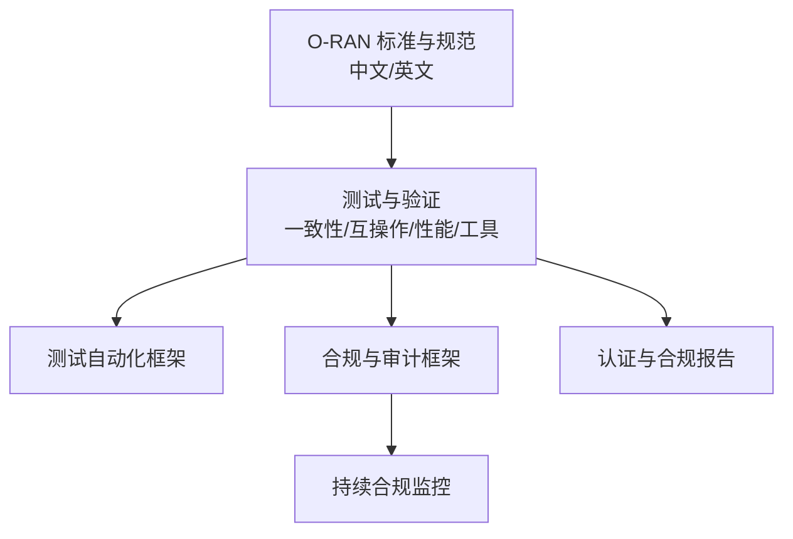
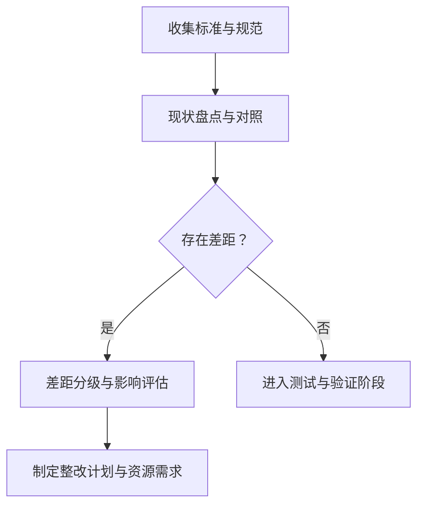
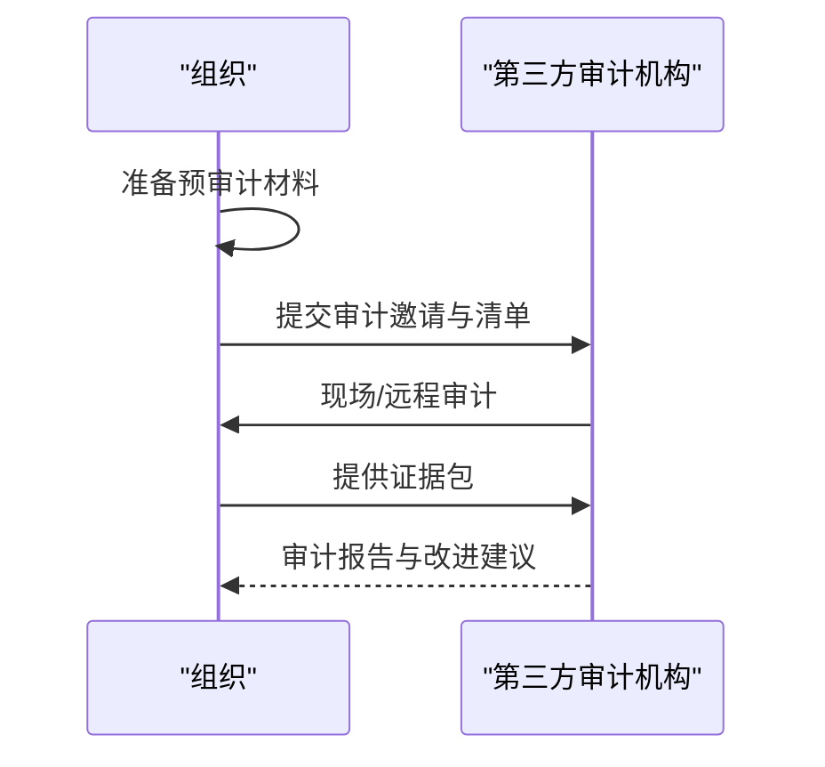
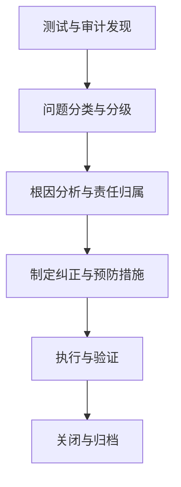
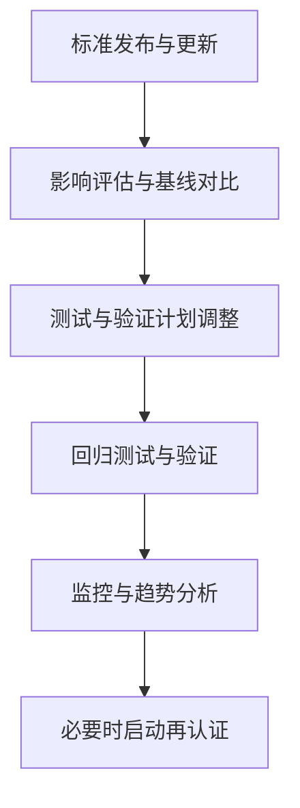
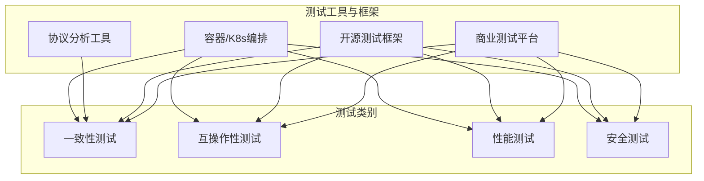
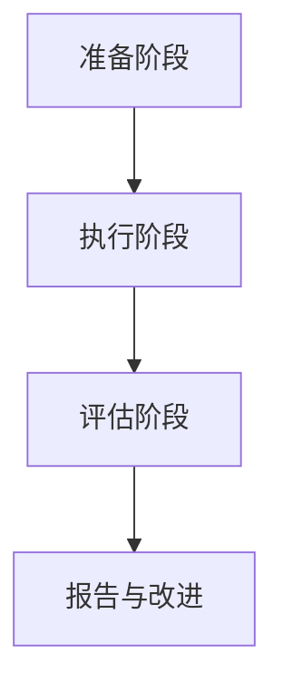
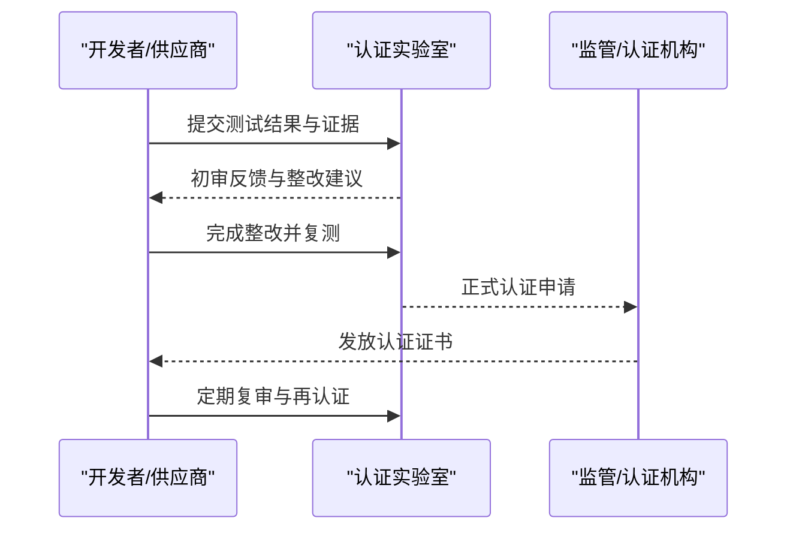
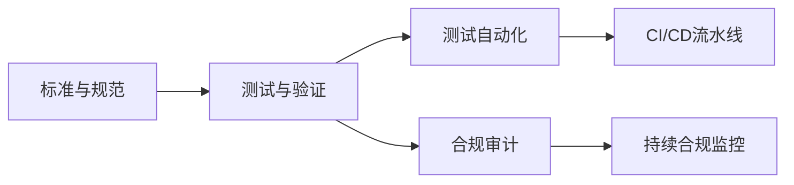

# 合规与认证

<cite>
**本文引用的文件**
- [O-RAN 标准与规范（中文）](file://09-standards-compliance/readme-zh.md)
- [O-RAN 标准与规范（英文）](file://09-standards-compliance/readme.md)
- [O-RAN 测试一致性验证（英文）](file://13-testing-validation/conformance-testing/o-ran-conformance-testing-en.md)
- [O-RAN 测试一致性验证（中文）](file://13-testing-validation/conformance-testing/o-ran-conformance-testing.md)
- [O-RAN 互操作性测试（中文）](file://13-testing-validation/interoperability/interoperability-testing.md)
- [O-RAN 测试工具与框架（中文）](file://13-testing-validation/testing-tools/testing-tools-frameworks.md)
- [O-RAN 测试自动化框架（中文）](file://13-testing-validation/automation-framework/test-automation-framework.md)
- [O-RAN 合规与审计框架（中文）](file://12-security-privacy/compliance-auditing/compliance-auditing-framework.md)
- [O-RAN 专家知识库总览（中文）](file://README.md)
</cite>

## 目录
1. [引言](#引言)
2. [项目结构](#项目结构)
3. [核心组件](#核心组件)
4. [架构总览](#架构总览)
5. [详细组件分析](#详细组件分析)
6. [依赖分析](#依赖分析)
7. [性能考虑](#性能考虑)
8. [故障排查指南](#故障排查指南)
9. [结论](#结论)
10. [附录](#附录)

## 引言
本文件面向合规与认证全流程，系统梳理 O-RAN 联盟、ETSI、3GPP 标准的合规要求与认证流程，结合仓库内测试与合规相关文档，给出从自评估、第三方审计、合规报告、不符合项处理到持续合规监控的完整实施步骤，并覆盖认证后持续合规管理与标准变更跟踪机制。同时，提供测试实验室与工具选型建议、测试程序与报告模板、以及互操作性测试与认证申请的关键要点。

## 项目结构
本知识库围绕“标准与合规”“测试与验证”“安全与审计”三大主线组织，形成从标准理解、测试执行、自动化落地到合规审计与持续监控的闭环。

**图表来源**
- [O-RAN 标准与规范（中文）](file://09-standards-compliance/readme-zh.md#L1-L371)
- [O-RAN 标准与规范（英文）](file://09-standards-compliance/readme.md#L1-L371)
- [O-RAN 测试一致性验证（英文）](file://13-testing-validation/conformance-testing/o-ran-conformance-testing-en.md#L1-L617)
- [O-RAN 互操作性测试（中文）](file://13-testing-validation/interoperability/interoperability-testing.md#L1-L231)
- [O-RAN 测试工具与框架（中文）](file://13-testing-validation/testing-tools/testing-tools-frameworks.md#L1-L598)
- [O-RAN 测试自动化框架（中文）](file://13-testing-validation/automation-framework/test-automation-framework.md#L1-L134)
- [O-RAN 合规与审计框架（中文）](file://12-security-privacy/compliance-auditing/compliance-auditing-framework.md#L1-L486)

**章节来源**
- [O-RAN 专家知识库总览（中文）](file://README.md#L48-L54)

## 核心组件
- 标准与合规体系：O-RAN 联盟规范、ETSI 标准、3GPP 标准及区域/行业合规要求。
- 测试与验证：一致性测试、互操作性测试、性能测试、安全测试与工具链。
- 合规审计与持续监控：GDPR/Telecom 安全要求、第三方审计准备、证据收集、合规仪表盘与告警阈值。
- 自动化与流水线：CI/CD 集成、容器化测试环境、并行执行与结果分析。

**章节来源**
- [O-RAN 标准与规范（中文）](file://09-standards-compliance/readme-zh.md#L110-L135)
- [O-RAN 标准与规范（英文）](file://09-standards-compliance/readme.md#L110-L135)
- [O-RAN 测试自动化框架（中文）](file://13-testing-validation/automation-framework/test-automation-framework.md#L1-L134)
- [O-RAN 合规与审计框架（中文）](file://12-security-privacy/compliance-auditing/compliance-auditing-framework.md#L1-L486)

## 架构总览
下图展示从标准理解到测试执行再到合规审计与持续监控的整体流程，强调“测试—认证—持续合规”的闭环。

**图表来源**
- [O-RAN 标准与规范（中文）](file://09-standards-compliance/readme-zh.md#L110-L135)
- [O-RAN 测试一致性验证（英文）](file://13-testing-validation/conformance-testing/o-ran-conformance-testing-en.md#L35-L67)
- [O-RAN 互操作性测试（中文）](file://13-testing-validation/interoperability/interoperability-testing.md#L179-L192)
- [O-RAN 合规与审计框架（中文）](file://12-security-privacy/compliance-auditing/compliance-auditing-framework.md#L432-L486)

## 详细组件分析

### 1. 标准与合规要求
- O-RAN 联盟规范：架构、接口、硬件、软件、安全、测试等 WG 分工明确，是实现互操作性的基础。
- ETSI 标准：TS 103 859（前传）、TS 103 983/986（A1 接口）、TS 103 987（传输配置文件）、GS ORAN-005（安全架构）。
- 3GPP 标准：NG-RAN 架构、F1/E1/Xn/NG/N2/N3 接口、RIC 相关规范与演进路线。
- 区域与行业合规：GDPR、电信安全、本地法规与行业特定要求。

实施要点
- 明确适用标准范围与版本，建立合规矩阵与映射表。
- 将标准要求转化为可验证的测试用例与指标。
- 建立跨部门协作机制，确保技术实现与流程制度匹配。

**章节来源**
- [O-RAN 标准与规范（中文）](file://09-standards-compliance/readme-zh.md#L8-L109)
- [O-RAN 标准与规范（英文）](file://09-standards-compliance/readme.md#L8-L109)

### 2. 自评估程序
- 差距识别：对照标准逐项核查实现状态，输出差距清单与风险等级。
- 合规矩阵：将标准条款映射到具体功能模块与测试点。
- 整改计划：设定优先级、责任人、里程碑与验收标准。

建议流程

**图表来源**
- [O-RAN 标准与规范（中文）](file://09-standards-compliance/readme-zh.md#L110-L135)
- [O-RAN 标准与规范（英文）](file://09-standards-compliance/readme.md#L110-L135)

**章节来源**
- [O-RAN 标准与规范（中文）](file://09-standards-compliance/readme-zh.md#L110-L135)
- [O-RAN 标准与规范（英文）](file://09-standards-compliance/readme.md#L110-L135)

### 3. 第三方审计
- 审计准备：文档清单、技术证据、人员安排、访问与远程能力验证。
- 证据收集：系统配置、安全策略、日志与变更记录、漏洞与补丁管理、渗透测试报告。
- 报告生成：合规状态、评分、建议与下次复审时间。

**图表来源**
- [O-RAN 合规与审计框架（中文）](file://12-security-privacy/compliance-auditing/compliance-auditing-framework.md#L199-L431)

**章节来源**
- [O-RAN 合规与审计框架（中文）](file://12-security-privacy/compliance-auditing/compliance-auditing-framework.md#L199-L431)

### 4. 合规报告与不符合项处理
- 合规报告：测试结果、覆盖率、问题统计、结论与建议。
- 不符合项处理：分类分级、根因分析、纠正与预防措施、验证关闭与跟踪。

**图表来源**
- [O-RAN 合规与审计框架（中文）](file://12-security-privacy/compliance-auditing/compliance-auditing-framework.md#L432-L486)

**章节来源**
- [O-RAN 合规与审计框架（中文）](file://12-security-privacy/compliance-auditing/compliance-auditing-framework.md#L432-L486)

### 5. 持续合规监控与标准变更跟踪
- 监控指标：合规得分、控制有效性、审计发现整改率、监管状态。
- 告警阈值：偏离目标或趋势异常自动触发预警。
- 变更跟踪：订阅标准组织公告、参与工作组、建立变更影响评估与回归测试机制。

**图表来源**
- [O-RAN 合规与审计框架（中文）](file://12-security-privacy/compliance-auditing/compliance-auditing-framework.md#L432-L486)
- [O-RAN 标准与规范（中文）](file://09-standards-compliance/readme-zh.md#L358-L364)

**章节来源**
- [O-RAN 合规与审计框架（中文）](file://12-security-privacy/compliance-auditing/compliance-auditing-framework.md#L432-L486)
- [O-RAN 标准与规范（中文）](file://09-standards-compliance/readme-zh.md#L358-L364)

### 6. 认证实验室与测试工具
- 认证实验室：参与官方 Plugfest、提交测试结果、获取互操作/符合性认证。
- 测试设备与工具：商业（如 Spirent、Keysight、Anritsu）与开源（Robot Framework、PyTest、Wireshark 插件、容器/K8s）工具组合。
- 测试程序：一致性测试（架构/接口/功能/性能/安全）、互操作性测试（多厂商组合）、性能基准与回归测试。

**图表来源**
- [O-RAN 测试工具与框架（中文）](file://13-testing-validation/testing-tools/testing-tools-frameworks.md#L1-L598)
- [O-RAN 互操作性测试（中文）](file://13-testing-validation/interoperability/interoperability-testing.md#L1-L231)
- [O-RAN 测试一致性验证（英文）](file://13-testing-validation/conformance-testing/o-ran-conformance-testing-en.md#L6-L67)

**章节来源**
- [O-RAN 测试工具与框架（中文）](file://13-testing-validation/testing-tools/testing-tools-frameworks.md#L1-L598)
- [O-RAN 互操作性测试（中文）](file://13-testing-validation/interoperability/interoperability-testing.md#L1-L231)
- [O-RAN 测试一致性验证（英文）](file://13-testing-validation/conformance-testing/o-ran-conformance-testing-en.md#L6-L67)

### 7. 测试流程与报告
- 准备阶段：测试计划、环境配置、工具校准、基线建立。
- 执行阶段：用例执行、实时监控、异常处理、中间结果分析。
- 评估阶段：汇总结果、识别不符合项、根因分析、提出改进建议。

**图表来源**
- [O-RAN 测试一致性验证（英文）](file://13-testing-validation/conformance-testing/o-ran-conformance-testing-en.md#L35-L67)

**章节来源**
- [O-RAN 测试一致性验证（英文）](file://13-testing-validation/conformance-testing/o-ran-conformance-testing-en.md#L35-L67)

### 8. 认证申请与持续合规
- 认证流程：预认证测试（自测/供应商测试）、官方实验室测试、报告与证据提交、第三方认证、证书颁发。
- 持续合规：定期复审、变更管理、回归测试、监控与告警、再认证周期。

**图表来源**
- [O-RAN 标准与规范（中文）](file://09-standards-compliance/readme-zh.md#L117-L122)
- [O-RAN 标准与规范（英文）](file://09-standards-compliance/readme.md#L117-L122)

**章节来源**
- [O-RAN 标准与规范（中文）](file://09-standards-compliance/readme-zh.md#L117-L122)
- [O-RAN 标准与规范（英文）](file://09-standards-compliance/readme.md#L117-L122)

## 依赖分析
- 标准依赖：O-RAN 联盟规范是接口与功能实现的基础；ETSI 与 3GPP 标准提供协议细节与演进方向。
- 测试依赖：测试工具与框架支撑一致性与互操作性验证；自动化框架与 CI/CD 管线保障测试可重复与可追溯。
- 审计依赖：合规仪表盘与证据收集工具为第三方审计提供可视化与可追溯证据。

**图表来源**
- [O-RAN 标准与规范（中文）](file://09-standards-compliance/readme-zh.md#L1-L371)
- [O-RAN 测试自动化框架（中文）](file://13-testing-validation/automation-framework/test-automation-framework.md#L1-L134)
- [O-RAN 合规与审计框架（中文）](file://12-security-privacy/compliance-auditing/compliance-auditing-framework.md#L432-L486)

**章节来源**
- [O-RAN 标准与规范（中文）](file://09-standards-compliance/readme-zh.md#L1-L371)
- [O-RAN 测试自动化框架（中文）](file://13-testing-validation/automation-framework/test-automation-framework.md#L1-L134)
- [O-RAN 合规与审计框架（中文）](file://12-security-privacy/compliance-auditing/compliance-auditing-framework.md#L432-L486)

## 性能考虑
- 测试性能：通过容器化与并行执行提升吞吐与稳定性；使用 Prometheus/Grafana 实时观测资源与性能指标。
- 合规成本：自动化与持续监控降低人工成本与风险暴露；工具链与环境隔离减少回归风险。
- 标准演进：关注 3GPP/ETSI 新版本对性能与安全的影响，提前纳入基线与回归测试。

[本节为通用指导，不直接分析具体文件]

## 故障排查指南
- 测试失败：检查测试环境配置、端口与协议一致性、日志与抓包；使用仪表盘定位异常趋势。
- 审计问题：完善证据包、补齐缺失文档与流程、加强人员培训与访问控制。
- 不符合项：按分级流程处理，确保根因分析与纠正措施闭环。

**章节来源**
- [O-RAN 测试工具与框架（中文）](file://13-testing-validation/testing-tools/testing-tools-frameworks.md#L481-L598)
- [O-RAN 合规与审计框架（中文）](file://12-security-privacy/compliance-auditing/compliance-auditing-framework.md#L238-L431)

## 结论
通过标准体系梳理、自评估与整改、测试与认证、以及持续合规监控与变更跟踪，可构建覆盖全生命周期的 O-RAN 合规与认证体系。结合自动化测试与审计工具，可显著提升效率与可信度，确保系统在多厂商环境下稳定、安全、合规地运行。

[本节为总结性内容，不直接分析具体文件]

## 附录
- 实施清单
  - 差距识别与整改计划
  - 测试用例设计与执行
  - 测试报告与证据归档
  - 第三方审计准备与执行
  - 认证申请与证书维护
  - 持续监控与变更跟踪

- 参考资源
  - O-RAN 联盟官网与规范
  - ETSI O-RAN 标准
  - 3GPP RAN 规范
  - ATIS O-RAN 认证

**章节来源**
- [O-RAN 标准与规范（中文）](file://09-standards-compliance/readme-zh.md#L365-L371)
- [O-RAN 标准与规范（英文）](file://09-standards-compliance/readme.md#L365-L371)