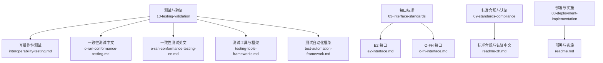
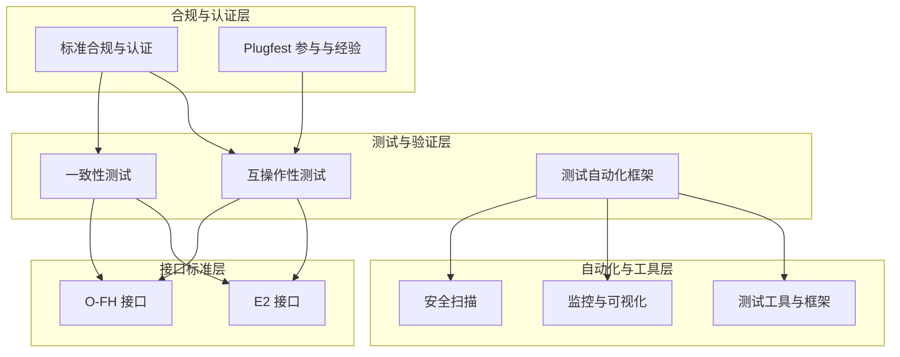
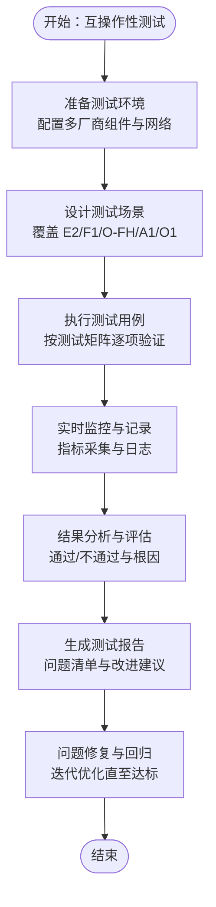
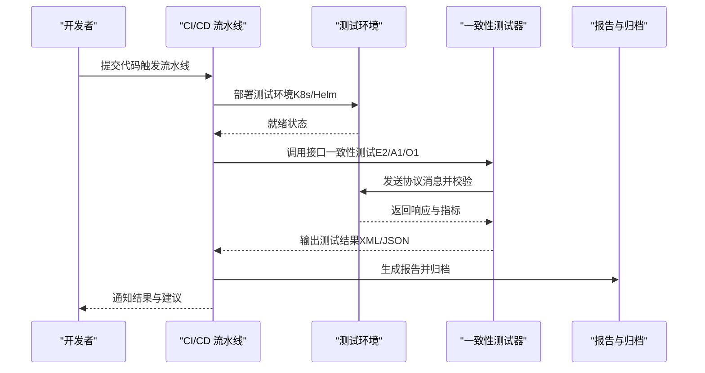
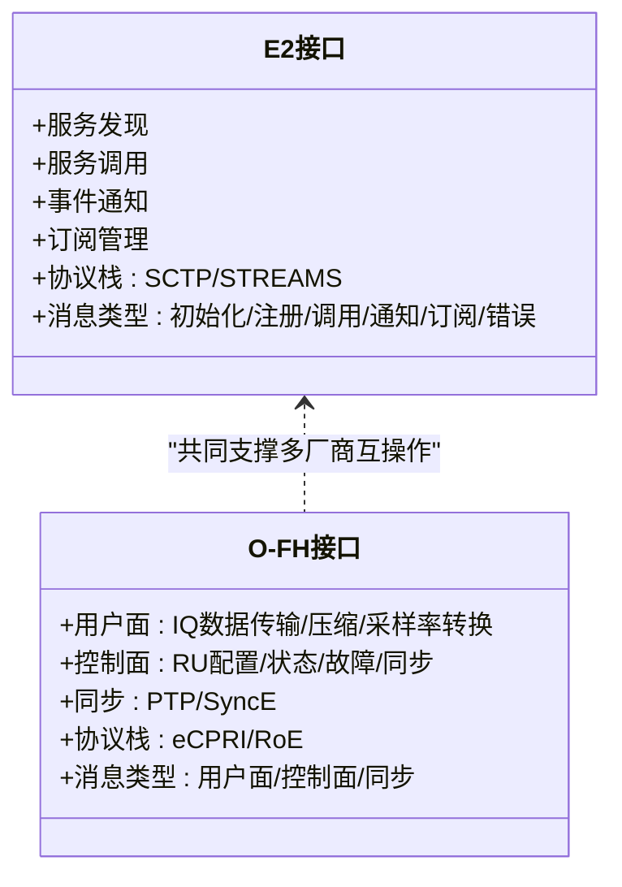
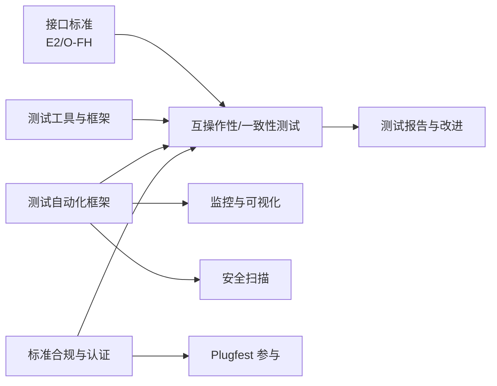

# 多厂商集成实践

<cite>
**本文引用的文件**
- [互操作性测试.md](file://13-testing-validation/interoperability/interoperability-testing.md)
- [一致性测试.md（中文）](file://13-testing-validation/conformance-testing/o-ran-conformance-testing.md)
- [一致性测试框架.md（英文）](file://13-testing-validation/conformance-testing/o-ran-conformance-testing-en.md)
- [测试工具与框架.md](file://13-testing-validation/testing-tools/testing-tools-frameworks.md)
- [测试自动化框架.md](file://13-testing-validation/automation-framework/test-automation-framework.md)
- [E2 接口.md](file://03-interface-standards/e2-interface.md)
- [O-FH 接口.md](file://03-interface-standards/o-fh-interface.md)
- [标准合规与认证.md（中文）](file://09-standards-compliance/readme-zh.md)
- [部署与实施.md](file://08-deployment-implementation/readme.md)
</cite>

## 目录
1. [引言](#引言)
2. [项目结构](#项目结构)
3. [核心组件](#核心组件)
4. [架构总览](#架构总览)
5. [详细组件分析](#详细组件分析)
6. [依赖关系分析](#依赖关系分析)
7. [性能考虑](#性能考虑)
8. [故障排查指南](#故障排查指南)
9. [结论](#结论)
10. [附录](#附录)

## 引言
本文件面向多厂商集成实践，系统梳理在 O-RAN 生态中面临的挑战与应对策略，覆盖接口兼容性、功能差异、性能差异、安全策略差异、运维工具差异等方面；并提供接口适配层设计、功能映射与转换、性能调优与优化、安全策略统一、运维工具集成等系统性方案。同时，结合互操作性测试与一致性测试的完整流程，给出测试场景设计、测试用例开发、测试环境搭建、测试执行记录、问题识别与解决的实施细节，并总结 O-RAN Plugfest 的概况、参与流程、测试场景、结果分析与经验。

## 项目结构
围绕多厂商集成主题，本仓库中与测试、接口标准、自动化与合规相关的内容主要分布在如下目录：
- 13-testing-validation：测试与验证相关，含互操作性测试、一致性测试、测试工具与框架、自动化框架
- 03-interface-standards：接口标准文档，含 E2、O-FH 等关键接口
- 09-standards-compliance：标准合规与认证，含多厂商集成实践与 Plugfest
- 08-deployment-implementation：部署与实施，含集成测试策略与 Plugfest 参与

**图示来源**
- [互操作性测试.md](file://13-testing-validation/interoperability/interoperability-testing.md#L1-L231)
- [一致性测试.md（中文）](file://13-testing-validation/conformance-testing/o-ran-conformance-testing.md#L1-L67)
- [一致性测试框架.md（英文）](file://13-testing-validation/conformance-testing/o-ran-conformance-testing-en.md#L1-L617)
- [测试工具与框架.md](file://13-testing-validation/testing-tools/testing-tools-frameworks.md#L1-L598)
- [测试自动化框架.md](file://13-testing-validation/automation-framework/test-automation-framework.md#L1-L134)
- [E2 接口.md](file://03-interface-standards/e2-interface.md#L1-L337)
- [O-FH 接口.md](file://03-interface-standards/o-fh-interface.md#L1-L397)
- [标准合规与认证.md（中文）](file://09-standards-compliance/readme-zh.md#L136-L192)
- [部署与实施.md](file://08-deployment-implementation/readme.md#L62-L92)

**章节来源**
- [互操作性测试.md](file://13-testing-validation/interoperability/interoperability-testing.md#L1-L231)
- [一致性测试框架.md（英文）](file://13-testing-validation/conformance-testing/o-ran-conformance-testing-en.md#L1-L617)
- [测试工具与框架.md](file://13-testing-validation/testing-tools/testing-tools-frameworks.md#L1-L598)
- [测试自动化框架.md](file://13-testing-validation/automation-framework/test-automation-framework.md#L1-L134)
- [E2 接口.md](file://03-interface-standards/e2-interface.md#L1-L337)
- [O-FH 接口.md](file://03-interface-standards/o-fh-interface.md#L1-L397)
- [标准合规与认证.md（中文）](file://09-standards-compliance/readme-zh.md#L136-L192)
- [部署与实施.md](file://08-deployment-implementation/readme.md#L62-L92)

## 核心组件
- 多厂商互操作性测试：覆盖 E2、F1、O-FH、A1、O1 等接口，定义测试目标、测试场景、测试矩阵、验证标准与最佳实践
- 一致性测试框架：面向 O-RAN 联盟测试套件与 3GPP 规范，提供接口一致性、架构一致性、功能与性能一致性验证方法
- 测试工具与框架：涵盖商业与开源测试工具、协议分析、容器化与编排、监控与可视化、安全扫描等
- 接口标准：E2 接口（服务化、SCTP/STREAMS）、O-FH 接口（eCPRI/RoE、同步）等，提供协议栈、消息类型、部署与运维要点
- 自动化测试框架：CI/CD 集成、测试编排、并行执行、结果分析与报告、安全合规集成
- 标准合规与认证：多厂商集成挑战与策略、Plugfest 参与流程与经验、互操作性测试流程

**章节来源**
- [互操作性测试.md](file://13-testing-validation/interoperability/interoperability-testing.md#L6-L26)
- [一致性测试框架.md（英文）](file://13-testing-validation/conformance-testing/o-ran-conformance-testing-en.md#L8-L24)
- [测试工具与框架.md](file://13-testing-validation/testing-tools/testing-tools-frameworks.md#L6-L598)
- [E2 接口.md](file://03-interface-standards/e2-interface.md#L3-L110)
- [O-FH 接口.md](file://03-interface-standards/o-fh-interface.md#L3-L117)
- [测试自动化框架.md](file://13-testing-validation/automation-framework/test-automation-framework.md#L6-L134)
- [标准合规与认证.md（中文）](file://09-standards-compliance/readme-zh.md#L136-L192)

## 架构总览
多厂商集成的总体架构由“测试与验证层”、“接口标准层”、“自动化与工具层”、“合规与认证层”构成，形成闭环的质量保障体系。

**图示来源**
- [互操作性测试.md](file://13-testing-validation/interoperability/interoperability-testing.md#L1-L231)
- [一致性测试框架.md（英文）](file://13-testing-validation/conformance-testing/o-ran-conformance-testing-en.md#L1-L617)
- [测试自动化框架.md](file://13-testing-validation/automation-framework/test-automation-framework.md#L1-L134)
- [E2 接口.md](file://03-interface-standards/e2-interface.md#L1-L337)
- [O-FH 接口.md](file://03-interface-standards/o-fh-interface.md#L1-L397)
- [标准合规与认证.md（中文）](file://09-standards-compliance/readme-zh.md#L136-L192)

## 详细组件分析

### 多厂商互操作性测试
- 测试目标：多厂商兼容性、接口标准合规、系统集成验证（端到端、跨组件通信、网络切片、多域协调、服务链）
- 测试场景：E2 接口多厂商通信、F1 接口 CU-DU 互通（设置环境、消息流程、错误处理与恢复）
- 测试方法论：黑盒、灰盒、白盒测试策略
- 测试环境：多厂商测试床配置（网络分区、组件清单）
- 验证标准：功能互操作性（消息成功率、协议合规、特性兼容、错误恢复）、性能互操作性（时延一致性、吞吐维持、资源利用、可扩展性）、可靠性指标（连接稳定性、故障恢复时间、会话持久性、负载均衡）
- 最佳实践：预测试准备、测试执行、后测试活动
- 工具与框架：商业测试工具、开源测试方案、自研测试框架（Python、Docker、Kubernetes、Prometheus/Grafana）

**图示来源**
- [互操作性测试.md](file://13-testing-validation/interoperability/interoperability-testing.md#L28-L231)

**章节来源**
- [互操作性测试.md](file://13-testing-validation/interoperability/interoperability-testing.md#L6-L26)
- [互操作性测试.md](file://13-testing-validation/interoperability/interoperability-testing.md#L28-L95)
- [互操作性测试.md](file://13-testing-validation/interoperability/interoperability-testing.md#L97-L178)
- [互操作性测试.md](file://13-testing-validation/interoperability/interoperability-testing.md#L179-L231)

### 一致性测试框架（O-RAN 联盟与 3GPP）
- 测试套件：架构一致性、接口一致性、功能一致性、性能一致性、安全一致性
- 接口一致性测试：E2、A1、O1 等接口协议验证，消息流程与字段校验
- 3GPP 规范验证：NG-RAN 架构、5G NR 协议、RAN 功能规范、互操作性要求
- 自动化测试平台：测试用例管理、自动执行引擎、结果分析与回归机制
- 测试流程：准备阶段、执行阶段、评估阶段
- 质量保证：测试覆盖度、测试有效性

**图示来源**
- [一致性测试框架.md（英文）](file://13-testing-validation/conformance-testing/o-ran-conformance-testing-en.md#L517-L617)

**章节来源**
- [一致性测试框架.md（英文）](file://13-testing-validation/conformance-testing/o-ran-conformance-testing-en.md#L6-L24)
- [一致性测试框架.md（英文）](file://13-testing-validation/conformance-testing/o-ran-conformance-testing-en.md#L26-L149)
- [一致性测试框架.md（英文）](file://13-testing-validation/conformance-testing/o-ran-conformance-testing-en.md#L293-L617)

### 接口标准：E2 与 O-FH
- E2 接口：服务化架构、SCTP/STREAMS 传输、E2AP/E2SM 协议、消息类型（初始化、服务注册、服务调用、事件通知、订阅管理、错误处理）、部署与运维要点（网络规划、部署架构、性能优化、监控告警、故障处理、版本管理）
- O-FH 接口：eCPRI/RoE 用户面与控制面、同步（PTP/SyncE）、协议栈与消息、部署与运维要点（带宽与延迟、传输技术、同步规划、硬件选型、监控与告警、配置管理、故障处理、性能优化）

**图示来源**
- [E2 接口.md](file://03-interface-standards/e2-interface.md#L3-L110)
- [O-FH 接口.md](file://03-interface-standards/o-fh-interface.md#L3-L117)

**章节来源**
- [E2 接口.md](file://03-interface-standards/e2-interface.md#L7-L201)
- [O-FH 接口.md](file://03-interface-standards/o-fh-interface.md#L7-L288)

### 测试工具与框架
- 商业测试工具：Spirent、Keysight、Anritsu 等多厂商 O-RAN 测试平台
- 开源测试工具：Robot Framework、PyTest、Wireshark 插件、容器化与编排
- 监控与可视化：Prometheus、Grafana
- 安全扫描：静态分析、动态应用安全测试、容器与网络扫描
- 测试数据管理：合成数据生成、匿名化与版本控制

**章节来源**
- [测试工具与框架.md](file://13-testing-validation/testing-tools/testing-tools-frameworks.md#L6-L598)

### 测试自动化框架
- 架构：测试编排层、执行引擎、测试数据管理、结果分析模块、报告系统
- 技术栈：CI/CD、容器编排、测试框架、监控与版本控制
- 最佳实践：模块化、可维护性、可扩展性、可靠性、可追溯性
- 先进特性：AI 驱动测试优化、并行执行与资源调度
- 监控与分析：实时监控、趋势与根因分析、覆盖率与基准对比
- 安全与合规：测试环境隔离、安全扫描、合规验证与审计

**章节来源**
- [测试自动化框架.md](file://13-testing-validation/automation-framework/test-automation-framework.md#L6-L134)

### 多厂商集成挑战与策略
- 面临挑战：接口兼容性、功能差异、性能差异、安全策略差异、运维工具差异
- 集成策略：接口适配层设计、功能映射与转换、性能调优与优化、安全策略统一、运维工具集成
- Plugfest 参与：活动概述、参与流程、测试场景、结果分析、经验总结
- 互操作性测试：测试场景设计、测试用例开发、测试环境搭建、测试执行与记录、问题识别与解决

**章节来源**
- [标准合规与认证.md（中文）](file://09-standards-compliance/readme-zh.md#L136-L192)
- [部署与实施.md](file://08-deployment-implementation/readme.md#L62-L92)

## 依赖关系分析
多厂商集成实践涉及跨层依赖，测试与验证依赖接口标准与工具链，自动化框架贯穿测试执行与监控，合规与认证提供质量门槛。

**图示来源**
- [E2 接口.md](file://03-interface-standards/e2-interface.md#L1-L337)
- [O-FH 接口.md](file://03-interface-standards/o-fh-interface.md#L1-L397)
- [互操作性测试.md](file://13-testing-validation/interoperability/interoperability-testing.md#L1-L231)
- [测试工具与框架.md](file://13-testing-validation/testing-tools/testing-tools-frameworks.md#L1-L598)
- [测试自动化框架.md](file://13-testing-validation/automation-framework/test-automation-framework.md#L1-L134)
- [标准合规与认证.md（中文）](file://09-standards-compliance/readme-zh.md#L136-L192)

**章节来源**
- [E2 接口.md](file://03-interface-standards/e2-interface.md#L1-L337)
- [O-FH 接口.md](file://03-interface-standards/o-fh-interface.md#L1-L397)
- [互操作性测试.md](file://13-testing-validation/interoperability/interoperability-testing.md#L1-L231)
- [测试工具与框架.md](file://13-testing-validation/testing-tools/testing-tools-frameworks.md#L1-L598)
- [测试自动化框架.md](file://13-testing-validation/automation-framework/test-automation-framework.md#L1-L134)
- [标准合规与认证.md（中文）](file://09-standards-compliance/readme-zh.md#L136-L192)

## 性能考虑
- 接口性能：E2 与 O-FH 的时延、吞吐、抖动与丢包率控制；SCTP 参数优化、多流配置、网络加速（SR-IOV/DPDK）、QoS 保障
- 系统性能：端到端时延、并发用户承载、稳定性与可扩展性、资源利用率与容量规划
- 测试与优化：基准建立、性能回归测试、热力图与趋势分析、容量与负载规划

**章节来源**
- [E2 接口.md](file://03-interface-standards/e2-interface.md#L131-L170)
- [O-FH 接口.md](file://03-interface-standards/o-fh-interface.md#L267-L288)
- [一致性测试框架.md（英文）](file://13-testing-validation/conformance-testing/o-ran-conformance-testing-en.md#L517-L617)

## 故障排查指南
- 常见故障：连接断连、消息解析错误、服务不可用、性能劣化、同步丢失、硬件故障
- 定位手段：告警分析、日志分析、信令追踪、接口与同步测试
- 恢复流程：连接恢复、配置调整、服务重启、升级修复
- 运维最佳实践：监控体系、自动化运维、容量管理、安全加固

**章节来源**
- [E2 接口.md](file://03-interface-standards/e2-interface.md#L170-L239)
- [O-FH 接口.md](file://03-interface-standards/o-fh-interface.md#L247-L327)

## 结论
多厂商集成实践需要以接口标准为基础、以测试与验证为核心、以自动化与工具为支撑、以合规与认证为保障。通过系统化的互操作性测试与一致性测试，配合完善的测试工具链与自动化框架，可有效应对接口兼容性、功能差异、性能差异、安全策略差异与运维工具差异等挑战，最终达成高质量、可扩展、可演进的 O-RAN 多厂商协同体系。

## 附录
- Plugfest 参与流程与经验：活动概述、参与流程、测试场景、结果分析、经验总结
- 互操作性测试流程：测试场景设计、测试用例开发、测试环境搭建、测试执行与记录、问题识别与解决

**章节来源**
- [标准合规与认证.md（中文）](file://09-standards-compliance/readme-zh.md#L136-L192)
- [部署与实施.md](file://08-deployment-implementation/readme.md#L62-L92)