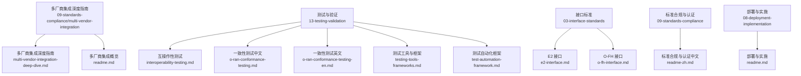
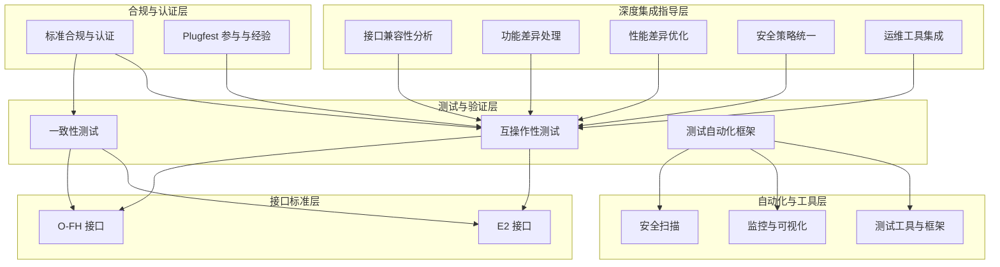
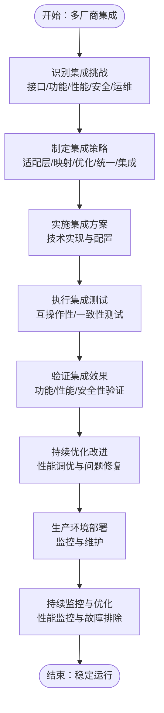
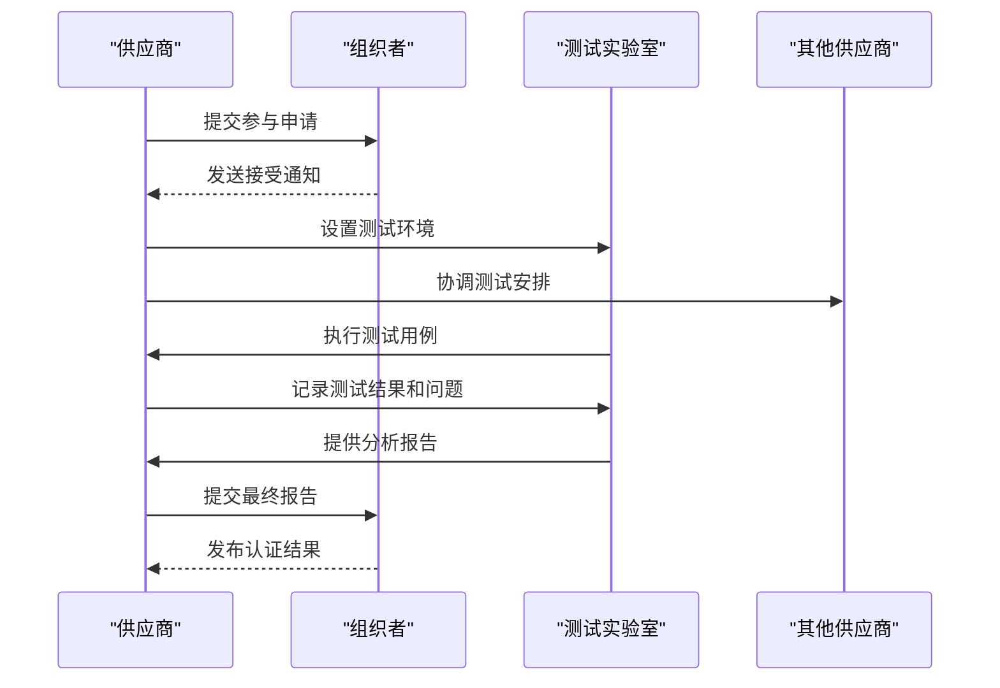
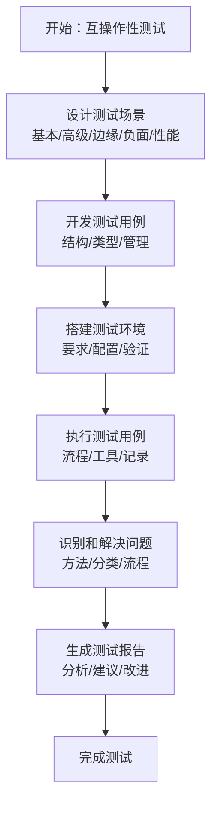
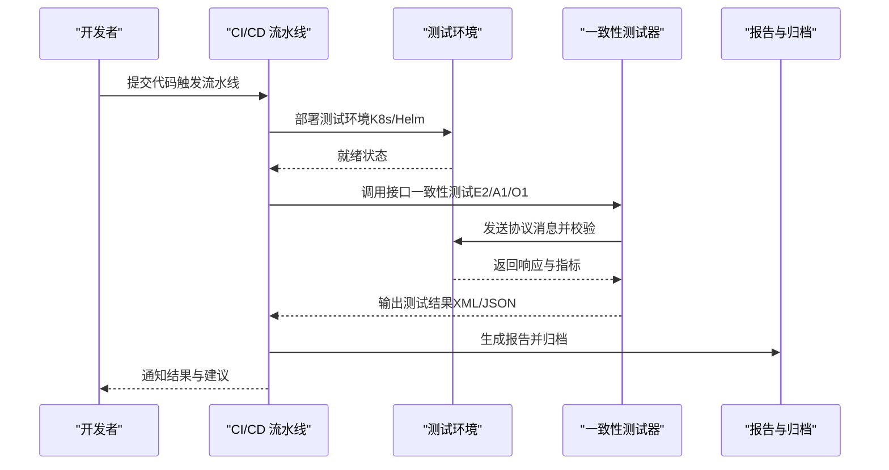
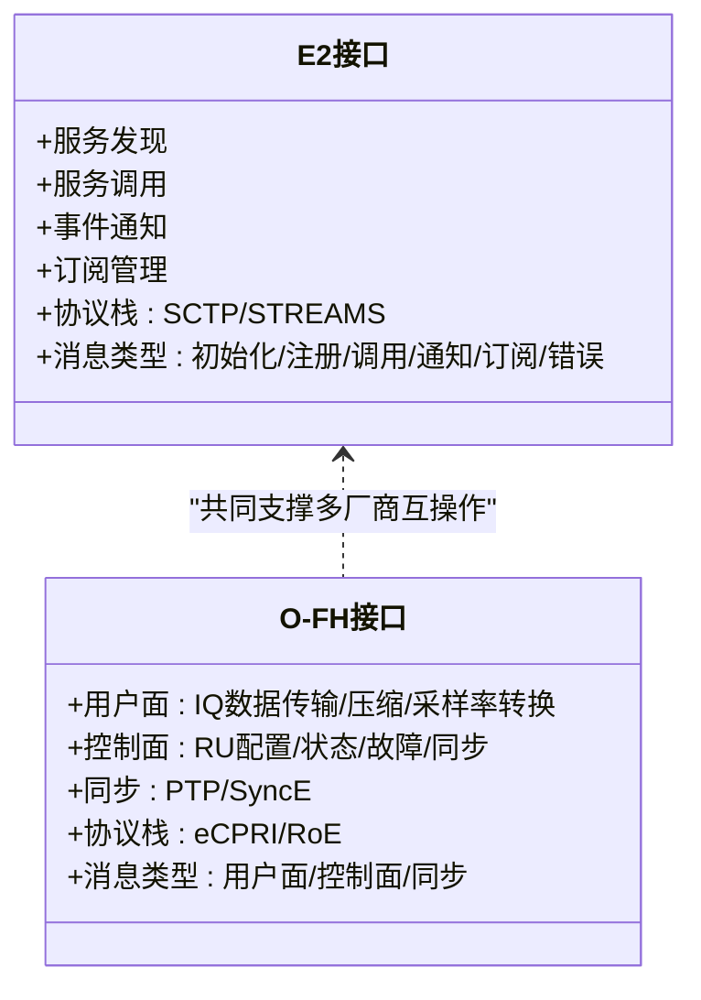
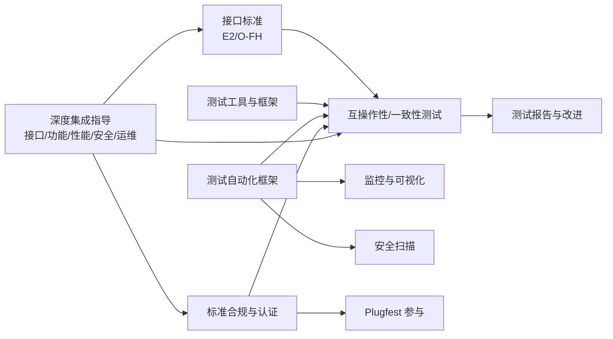

# 多厂商集成实践

<cite>
**本文引用的文件**
- [多厂商集成深度指南.md](file://09-standards-compliance/multi-vendor-integration/multi-vendor-integration-deep-dive.md)
- [多厂商集成实践.md](file://09-standards-compliance/multi-vendor-integration/readme.md)
- [互操作性测试.md](file://13-testing-validation/interoperability/interoperability-testing.md)
- [一致性测试.md（中文）](file://13-testing-validation/conformance-testing/o-ran-conformance-testing.md)
- [一致性测试框架.md（英文）](file://13-testing-validation/conformance-testing/o-ran-conformance-testing-en.md)
- [测试工具与框架.md](file://13-testing-validation/testing-tools/testing-tools-frameworks.md)
- [测试自动化框架.md](file://13-testing-validation/automation-framework/test-automation-framework.md)
- [E2 接口.md](file://03-interface-standards/e2-interface.md)
- [O-FH 接口.md](file://03-interface-standards/o-fh-interface.md)
- [标准合规与认证.md（中文）](file://09-standards-compliance/readme-zh.md)
- [部署与实施.md](file://08-deployment-implementation/readme.md)
</cite>

## 更新摘要
**变更内容**
- 新增多厂商集成深度指南章节，涵盖572行详细内容
- 扩展接口兼容性问题分析，包含协议、数据格式、接口行为三个维度
- 完善功能差异分析，涵盖特性支持、性能差异、配置差异
- 深化性能差异分析，包括处理性能、吞吐量、延迟三个层面
- 增强安全策略差异分析，涵盖认证、授权、加密三个方面
- 扩展运维工具差异分析，包括管理接口、监控、配置管理
- 新增接口适配层设计详细指导
- 完善Plugfest参与流程和测试场景
- 强化互操作性测试方法论和最佳实践

## 目录
1. [引言](#引言)
2. [项目结构](#项目结构)
3. [核心组件](#核心组件)
4. [架构总览](#架构总览)
5. [详细组件分析](#详细组件分析)
6. [依赖关系分析](#依赖关系分析)
7. [性能考虑](#性能考虑)
8. [故障排查指南](#故障排查指南)
9. [结论](#结论)
10. [附录](#附录)

## 引言
本文件面向多厂商集成实践，系统梳理在 O-RAN 生态中面临的挑战与应对策略，覆盖接口兼容性、功能差异、性能差异、安全策略差异、运维工具差异等方面；并提供接口适配层设计、功能映射与转换、性能调优与优化、安全策略统一、运维工具集成等系统性方案。同时，结合互操作性测试与一致性测试的完整流程，给出测试场景设计、测试用例开发、测试环境搭建、测试执行记录、问题识别与解决的实施细节，并总结 O-RAN Plugfest 的概况、参与流程、测试场景、结果分析与经验。

**更新** 新增了基于572行深度指南的详细多厂商集成指导，涵盖从初始规划到持续运营的全生命周期管理。

## 项目结构
围绕多厂商集成主题，本仓库中与测试、接口标准、自动化与合规相关的内容主要分布在如下目录：
- 09-standards-compliance/multi-vendor-integration：多厂商集成深度指南与概览
- 13-testing-validation：测试与验证相关，含互操作性测试、一致性测试、测试工具与框架、自动化框架
- 03-interface-standards：接口标准文档，含 E2、O-FH 等关键接口
- 08-deployment-implementation：部署与实施，含集成测试策略与 Plugfest 参与

**图示来源**
- [多厂商集成深度指南.md:1-572](file://09-standards-compliance/multi-vendor-integration/multi-vendor-integration-deep-dive.md#L1-L572)
- [多厂商集成实践.md:1-46](file://09-standards-compliance/multi-vendor-integration/readme.md#L1-L46)
- [互操作性测试.md:1-231](file://13-testing-validation/interoperability/interoperability-testing.md#L1-L231)
- [一致性测试框架.md（英文）:1-617](file://13-testing-validation/conformance-testing/o-ran-conformance-testing-en.md#L1-L617)
- [测试工具与框架.md:1-598](file://13-testing-validation/testing-tools/testing-tools-frameworks.md#L1-L598)
- [测试自动化框架.md:1-134](file://13-testing-validation/automation-framework/test-automation-framework.md#L1-L134)
- [E2 接口.md:1-365](file://03-interface-standards/e2-interface.md#L1-L365)
- [O-FH 接口.md:1-397](file://03-interface-standards/o-fh-interface.md#L1-L397)
- [标准合规与认证.md（中文）:1-130](file://09-standards-compliance/readme-zh.md#L1-L130)
- [部署与实施.md:62-92](file://08-deployment-implementation/readme.md#L62-L92)

**章节来源**
- [多厂商集成深度指南.md:1-572](file://09-standards-compliance/multi-vendor-integration/multi-vendor-integration-deep-dive.md#L1-L572)
- [多厂商集成实践.md:1-46](file://09-standards-compliance/multi-vendor-integration/readme.md#L1-L46)
- [互操作性测试.md:1-231](file://13-testing-validation/interoperability/interoperability-testing.md#L1-L231)
- [一致性测试框架.md（英文）:1-617](file://13-testing-validation/conformance-testing/o-ran-conformance-testing-en.md#L1-L617)
- [测试工具与框架.md:1-598](file://13-testing-validation/testing-tools/testing-tools-frameworks.md#L1-L598)
- [测试自动化框架.md:1-134](file://13-testing-validation/automation-framework/test-automation-framework.md#L1-L134)
- [E2 接口.md:1-365](file://03-interface-standards/e2-interface.md#L1-L365)
- [O-FH 接口.md:1-397](file://03-interface-standards/o-fh-interface.md#L1-L397)
- [标准合规与认证.md（中文）:1-130](file://09-standards-compliance/readme-zh.md#L1-L130)
- [部署与实施.md:62-92](file://08-deployment-implementation/readme.md#L62-L92)

## 核心组件
- **多厂商集成深度指南**：涵盖接口兼容性、功能差异、性能差异、安全策略差异、运维工具差异的全面分析，提供系统性的集成策略和最佳实践
- **多厂商互操作性测试**：覆盖 E2、F1、O-FH、A1、O1 等接口，定义测试目标、测试场景、测试矩阵、验证标准与最佳实践
- **一致性测试框架**：面向 O-RAN 联盟测试套件与 3GPP 规范，提供接口一致性、架构一致性、功能与性能一致性验证方法
- **测试工具与框架**：涵盖商业与开源测试工具、协议分析、容器化与编排、监控与可视化、安全扫描等
- **接口标准**：E2 接口（服务化、SCTP/STREAMS）、O-FH 接口（eCPRI/RoE、同步）等，提供协议栈、消息类型、部署与运维要点
- **自动化测试框架**：CI/CD 集成、测试编排、并行执行、结果分析与报告、安全合规集成
- **标准合规与认证**：多厂商集成挑战与策略、Plugfest 参与流程与经验、互操作性测试流程

**更新** 新增了基于深度指南的多厂商集成核心能力，包括完整的挑战分析和策略指导。

**章节来源**
- [多厂商集成深度指南.md:9-572](file://09-standards-compliance/multi-vendor-integration/multi-vendor-integration-deep-dive.md#L9-L572)
- [多厂商集成实践.md:6-46](file://09-standards-compliance/multi-vendor-integration/readme.md#L6-L46)
- [互操作性测试.md:6-27](file://13-testing-validation/interoperability/interoperability-testing.md#L6-L27)
- [一致性测试框架.md（英文）:8-24](file://13-testing-validation/conformance-testing/o-ran-conformance-testing-en.md#L8-L24)
- [测试工具与框架.md:6-598](file://13-testing-validation/testing-tools/testing-tools-frameworks.md#L6-L598)
- [E2 接口.md:3-110](file://03-interface-standards/e2-interface.md#L3-L110)
- [O-FH 接口.md:3-117](file://03-interface-standards/o-fh-interface.md#L3-L117)
- [测试自动化框架.md:6-134](file://13-testing-validation/automation-framework/test-automation-framework.md#L6-L134)
- [标准合规与认证.md（中文）:37-42](file://09-standards-compliance/readme-zh.md#L37-L42)

## 架构总览
多厂商集成的总体架构由"深度集成指导层"、"测试与验证层"、"接口标准层"、"自动化与工具层"、"合规与认证层"构成，形成闭环的质量保障体系。

**图示来源**
- [多厂商集成深度指南.md:9-572](file://09-standards-compliance/multi-vendor-integration/multi-vendor-integration-deep-dive.md#L9-L572)
- [互操作性测试.md:1-231](file://13-testing-validation/interoperability/interoperability-testing.md#L1-L231)
- [一致性测试框架.md（英文）:1-617](file://13-testing-validation/conformance-testing/o-ran-conformance-testing-en.md#L1-L617)
- [测试自动化框架.md:1-134](file://13-testing-validation/automation-framework/test-automation-framework.md#L1-L134)
- [E2 接口.md:1-365](file://03-interface-standards/e2-interface.md#L1-L365)
- [O-FH 接口.md:1-397](file://03-interface-standards/o-fh-interface.md#L1-L397)
- [标准合规与认证.md（中文）:1-130](file://09-standards-compliance/readme-zh.md#L1-L130)

## 详细组件分析

### 多厂商集成深度指南

#### 集成挑战分析

**接口兼容性问题**
- **协议兼容性**：不同协议版本实现、供应商特定协议扩展、可选协议功能支持、协议行为解释差异、时序和序列要求差异
- **数据格式兼容性**：不同消息格式实现、数据编码方法、数据结构实现、数据验证规则、数据转换需求
- **接口行为兼容性**：错误处理方法、超时处理、重试机制、流量控制实现、资源管理方法

**功能差异**
- **特性支持差异**：必需特性实现、可选特性支持、特性组合支持、特性依赖处理、特性限制实现
- **性能差异**：吞吐量能力、延迟特性、可扩展性能力、可靠性特性、效率特性
- **配置差异**：配置参数集、默认配置值、配置验证规则、配置依赖、配置管理方法

**性能差异**
- **处理性能**：CPU处理能力、内存性能特性、存储性能特性、网络性能能力、硬件加速能力
- **吞吐量性能**：数据吞吐量、控制面吞吐量、管理面吞吐量、聚合吞吐量、突发吞吐量
- **延迟性能**：处理延迟特性、传输延迟特性、队列延迟特性、端到端延迟特性、抖动特性

**安全策略差异**
- **认证差异**：认证方法支持、认证协议实现、凭据管理方法、认证策略实现、认证系统集成
- **授权差异**：授权模型实现、授权策略实现、基于角色的访问控制、基于属性的访问控制、授权系统集成
- **加密差异**：加密算法支持、加密协议实现、密钥管理方法、证书管理方法、安全策略实现

**运维工具差异**
- **管理接口差异**：管理协议支持、管理API实现、管理数据模型实现、管理操作支持、管理系统集成
- **监控差异**：监控指标实现、监控协议支持、监控工具集成、监控告警实现、监控报告格式
- **配置管理差异**：配置工具支持、自动化能力、验证方法、备份恢复方法、版本管理方法

#### 集成策略

**接口适配层设计**
- **适配层架构**：协议适配与转换、数据格式转换、行为规范化、错误处理标准化、性能优化
- **适配层实现**：中间件解决方案、网关解决方案、代理解决方案、适配器解决方案、自定义解决方案
- **适配层优势**：减少供应商锁定、灵活集成选项、可扩展集成架构、可维护集成解决方案、可重用集成组件

**功能映射与转换**
- **功能映射策略**：直接功能映射、间接功能映射、复合功能映射、条件功能映射、动态功能映射
- **功能转换方法**：数据格式转换、协议转换、接口适配、行为规范化、性能优化
- **功能映射工具**：功能映射工具、数据转换工具、映射验证工具、映射测试工具、映射文档工具

**性能调优与优化**
- **性能优化策略**：瓶颈识别、资源利用优化、配置参数优化、处理算法优化、系统架构优化
- **性能调优方法**：性能剖析与分析、性能基准测试、负载测试与优化、压力测试与优化、容量规划与优化
- **性能监控**：实时性能监控、历史性能分析、性能趋势分析、性能告警与通知、性能报告与分析

**安全策略统一**
- **安全策略框架**：统一安全策略定义、跨供应商安全策略实现、一致的安全策略执行、安全策略合规监控、安全策略更新
- **安全集成方法**：集中式安全管理、分布式安全执行、混合安全方法、联邦安全管理、零信任安全实现
- **安全策略工具**：安全策略管理工具、安全策略执行工具、安全策略监控工具、安全策略合规工具、安全策略报告工具

**运维工具集成**
- **OAM集成策略**：OAM工具整合、OAM工具集成、OAM工具联邦、OAM流程自动化、OAM工具标准化
- **OAM集成方法**：基于API的工具集成、基于数据的工具集成、基于流程的工具集成、基于工作流的工具集成、基于仪表板的工具集成
- **OAM集成优势**：提高运营效率、降低运营复杂性、改善运营可见性、加快问题解决、降低运营成本

**图示来源**
- [多厂商集成深度指南.md:9-572](file://09-standards-compliance/multi-vendor-integration/multi-vendor-integration-deep-dive.md#L9-L572)

**章节来源**
- [多厂商集成深度指南.md:9-572](file://09-standards-compliance/multi-vendor-integration/multi-vendor-integration-deep-dive.md#L9-L572)

### O-RAN Plugfest 参与

#### Plugfest 概述
- **目标**：验证多厂商互操作性、验证规范合规性、识别集成问题、分享集成最佳实践、发展 O-RAN 生态系统
- **类型**：接口特定互操作性测试、端到端解决方案测试、特性特定测试、性能测试、安全测试
- **组织**：规划阶段、执行阶段、结果分析与报告、问题解决与后续、文档与知识共享

#### 参与流程
- **注册流程**：提交参与申请、审查提交的文档、接收接受通知、接收准备要求、协调物流
- **准备流程**：制定测试计划、设置测试环境、准备配置、准备文档、准备测试团队
- **执行流程**：执行测试用例、记录识别的问题、记录测试结果、与其他供应商协作、生成测试报告

#### 测试场景
- **基本连接场景**：接口建立测试、基本通信测试、配置交换测试、状态监控测试、错误处理测试
- **功能测试场景**：特性实现验证、真实场景测试、边缘情况和边界测试、负面场景测试、回归测试
- **性能测试场景**：吞吐量性能测试、延迟性能测试、可扩展性测试、压力测试、耐久性测试

#### 结果分析
- **分析方法**：定量结果分析、定性结果分析、比较结果分析、趋势分析、根本原因分析
- **分析工具**：结果数据分析工具、结果可视化工具、结果报告工具、结果协作工具、结果文档工具
- **分析结果**：识别的问题和挑战、识别的最佳实践、改进建议、后续行动项、知识共享结果

#### 经验总结
- **经验教训**：技术经验、流程经验、协作经验、管理经验、战略经验
- **最佳实践**：集成最佳实践、测试最佳实践、协作最佳实践、文档最佳实践、沟通最佳实践
- **改进领域**：技术改进领域、流程改进领域、工具改进领域、文档改进领域、协作改进领域

**图示来源**
- [多厂商集成深度指南.md:273-403](file://09-standards-compliance/multi-vendor-integration/multi-vendor-integration-deep-dive.md#L273-L403)

**章节来源**
- [多厂商集成深度指南.md:273-403](file://09-standards-compliance/multi-vendor-integration/multi-vendor-integration-deep-dive.md#L273-L403)

### 互操作性测试

#### 测试场景设计
- **测试场景类别**：基本互操作性场景、高级互操作性场景、边缘情况和边界场景、负面和错误场景、性能和可扩展性场景
- **测试场景开发**：分析测试需求、设计测试场景、开发测试用例、准备测试数据、设置测试环境
- **测试场景验证**：同行评审、专家评审、试点测试、基于反馈的场景细化、场景执行批准

#### 测试用例开发
- **测试用例结构**：唯一测试用例标识符、描述性测试用例名称、测试用例目标、测试用例前提条件、详细测试步骤、预期测试结果、通过/失败标准
- **测试用例类型**：功能测试用例、性能测试用例、安全测试用例、负面测试用例、回归测试用例
- **测试用例管理**：测试用例库管理、测试用例版本控制、测试用例评审流程、测试用例维护、测试用例执行报告

#### 测试环境搭建
- **环境要求**：硬件组件要求、软件组件要求、网络基础设施要求、安全基础设施要求、管理基础设施要求
- **环境配置**：组件配置、接口配置、安全配置、监控配置、管理配置
- **环境验证**：组件功能验证、接口连接验证、安全配置验证、性能基线验证、环境文档验证

#### 测试执行与记录
- **测试执行流程**：初始化测试环境、执行测试用例、监控测试执行、收集测试结果、记录识别的问题
- **测试执行工具**：自动化测试执行工具、测试执行监控工具、测试结果收集工具、问题跟踪和管理工具、测试执行报告工具
- **测试结果记录**：收集测试结果数据、分析测试结果、记录测试结果、生成测试报告、归档测试结果

#### 问题识别与解决
- **问题识别方法**：自动问题检测、手动问题识别、基于监控的检测、用户报告问题、主动问题分析
- **问题分类**：需要立即关注的严重问题、需要及时关注的主要问题、需要关注的小问题、增强请求、观察和建议
- **问题解决流程**：记录问题详情、分析根本原因、开发解决方案、实施解决方案、验证解决方案有效性、关闭问题记录

**图示来源**
- [多厂商集成深度指南.md:405-539](file://09-standards-compliance/multi-vendor-integration/multi-vendor-integration-deep-dive.md#L405-L539)
- [互操作性测试.md:28-231](file://13-testing-validation/interoperability/interoperability-testing.md#L28-L231)

**章节来源**
- [多厂商集成深度指南.md:405-539](file://09-standards-compliance/multi-vendor-integration/multi-vendor-integration-deep-dive.md#L405-L539)
- [互操作性测试.md:28-231](file://13-testing-validation/interoperability/interoperability-testing.md#L28-L231)

### 一致性测试框架（O-RAN 联盟与 3GPP）
- **测试套件**：架构一致性、接口一致性、功能一致性、性能一致性、安全一致性
- **接口一致性测试**：E2、A1、O1 等接口协议验证，消息流程与字段校验
- **3GPP 规范验证**：NG-RAN 架构、5G NR 协议、RAN 功能规范、互操作性要求
- **自动化测试平台**：测试用例管理、自动执行引擎、结果分析与回归机制
- **测试流程**：准备阶段、执行阶段、评估阶段
- **质量保证**：测试覆盖度、测试有效性

**图示来源**
- [一致性测试框架.md（英文）:517-617](file://13-testing-validation/conformance-testing/o-ran-conformance-testing-en.md#L517-L617)

**章节来源**
- [一致性测试框架.md（英文）:6-24](file://13-testing-validation/conformance-testing/o-ran-conformance-testing-en.md#L6-L24)
- [一致性测试框架.md（英文）:26-149](file://13-testing-validation/conformance-testing/o-ran-conformance-testing-en.md#L26-L149)
- [一致性测试框架.md（英文）:293-617](file://13-testing-validation/conformance-testing/o-ran-conformance-testing-en.md#L293-L617)

### 接口标准：E2 与 O-FH
- **E2 接口**：服务化架构、SCTP/STREAMS 传输、E2AP/E2SM 协议、消息类型（初始化、服务注册、服务调用、事件通知、订阅管理、错误处理）、部署与运维要点（网络规划、部署架构、性能优化、监控告警、故障处理、版本管理）
- **O-FH 接口**：eCPRI/RoE 用户面与控制面、同步（PTP/SyncE）、协议栈与消息、部署与运维要点（带宽与延迟、传输技术、同步规划、硬件选型、监控与告警、配置管理、故障处理、性能优化）

**图示来源**
- [E2 接口.md:3-110](file://03-interface-standards/e2-interface.md#L3-L110)
- [O-FH 接口.md:3-117](file://03-interface-standards/o-fh-interface.md#L3-L117)

**章节来源**
- [E2 接口.md:7-201](file://03-interface-standards/e2-interface.md#L7-L201)
- [O-FH 接口.md:7-288](file://03-interface-standards/o-fh-interface.md#L7-L288)

### 测试工具与框架
- **商业测试工具**：Spirent、Keysight、Anritsu 等多厂商 O-RAN 测试平台
- **开源测试工具**：Robot Framework、PyTest、Wireshark 插件、容器化与编排
- **监控与可视化**：Prometheus、Grafana
- **安全扫描**：静态分析、动态应用安全测试、容器与网络扫描
- **测试数据管理**：合成数据生成、匿名化与版本控制

**章节来源**
- [测试工具与框架.md:6-598](file://13-testing-validation/testing-tools/testing-tools-frameworks.md#L6-L598)

### 测试自动化框架
- **架构**：测试编排层、执行引擎、测试数据管理、结果分析模块、报告系统
- **技术栈**：CI/CD、容器编排、测试框架、监控与版本控制
- **最佳实践**：模块化、可维护性、可扩展性、可靠性、可追溯性
- **先进特性**：AI 驱动测试优化、并行执行与资源调度
- **监控与分析**：实时监控、趋势与根因分析、覆盖率与基准对比
- **安全与合规**：测试环境隔离、安全扫描、合规验证与审计

**章节来源**
- [测试自动化框架.md:6-134](file://13-testing-validation/automation-framework/test-automation-framework.md#L6-L134)

## 依赖关系分析
多厂商集成实践涉及跨层依赖，深度集成指导为所有测试和验证活动提供基础，测试与验证依赖接口标准与工具链，自动化框架贯穿测试执行与监控，合规与认证提供质量门槛。

**图示来源**
- [多厂商集成深度指南.md:9-572](file://09-standards-compliance/multi-vendor-integration/multi-vendor-integration-deep-dive.md#L9-L572)
- [E2 接口.md:1-365](file://03-interface-standards/e2-interface.md#L1-L365)
- [O-FH 接口.md:1-397](file://03-interface-standards/o-fh-interface.md#L1-L397)
- [互操作性测试.md:1-231](file://13-testing-validation/interoperability/interoperability-testing.md#L1-L231)
- [测试工具与框架.md:1-598](file://13-testing-validation/testing-tools/testing-tools-frameworks.md#L1-L598)
- [测试自动化框架.md:1-134](file://13-testing-validation/automation-framework/test-automation-framework.md#L1-L134)
- [标准合规与认证.md（中文）:1-130](file://09-standards-compliance/readme-zh.md#L1-L130)

**章节来源**
- [多厂商集成深度指南.md:9-572](file://09-standards-compliance/multi-vendor-integration/multi-vendor-integration-deep-dive.md#L9-L572)
- [E2 接口.md:1-365](file://03-interface-standards/e2-interface.md#L1-L365)
- [O-FH 接口.md:1-397](file://03-interface-standards/o-fh-interface.md#L1-L397)
- [互操作性测试.md:1-231](file://13-testing-validation/interoperability/interoperability-testing.md#L1-L231)
- [测试工具与框架.md:1-598](file://13-testing-validation/testing-tools/testing-tools-frameworks.md#L1-L598)
- [测试自动化框架.md:1-134](file://13-testing-validation/automation-framework/test-automation-framework.md#L1-L134)
- [标准合规与认证.md（中文）:1-130](file://09-standards-compliance/readme-zh.md#L1-L130)

## 性能考虑
- **接口性能**：E2 与 O-FH 的时延、吞吐、抖动与丢包率控制；SCTP 参数优化、多流配置、网络加速（SR-IOV/DPDK）、QoS 保障
- **系统性能**：端到端时延、并发用户承载、稳定性与可扩展性、资源利用率与容量规划
- **测试与优化**：基准建立、性能回归测试、热力图与趋势分析、容量与负载规划
- **深度优化**：瓶颈识别、资源优化、配置优化、算法优化、架构优化

**更新** 新增了基于深度指南的性能优化策略和方法论。

**章节来源**
- [E2 接口.md:131-170](file://03-interface-standards/e2-interface.md#L131-L170)
- [O-FH 接口.md:119-178](file://03-interface-standards/o-fh-interface.md#L119-L178)
- [一致性测试框架.md（英文）:517-617](file://13-testing-validation/conformance-testing/o-ran-conformance-testing-en.md#L517-L617)
- [多厂商集成深度指南.md:195-220](file://09-standards-compliance/multi-vendor-integration/multi-vendor-integration-deep-dive.md#L195-L220)

## 故障排查指南
- **常见故障**：连接断连、消息解析错误、服务不可用、性能劣化、同步丢失、硬件故障
- **定位手段**：告警分析、日志分析、信令追踪、接口与同步测试
- **恢复流程**：连接恢复、配置调整、服务重启、升级修复
- **运维最佳实践**：监控体系、自动化运维、容量管理、安全加固
- **深度故障分析**：自动检测、手动识别、监控检测、用户报告、主动分析

**更新** 新增了基于深度指南的系统化故障识别和解决方法。

**章节来源**
- [E2 接口.md:170-239](file://03-interface-standards/e2-interface.md#L170-L239)
- [O-FH 接口.md:200-327](file://03-interface-standards/o-fh-interface.md#L200-L327)
- [多厂商集成深度指南.md:513-539](file://09-standards-compliance/multi-vendor-integration/multi-vendor-integration-deep-dive.md#L513-L539)

## 结论
多厂商集成实践需要以深度集成指导为基础、以接口标准为核心、以测试与验证为支撑、以自动化与工具为手段、以合规与认证为保障。通过系统化的多厂商集成策略、完善的互操作性测试与一致性测试、配合全面的测试工具链与自动化框架，可有效应对接口兼容性、功能差异、性能差异、安全策略差异与运维工具差异等挑战，最终达成高质量、可扩展、可演进的 O-RAN 多厂商协同体系。

**更新** 强调了深度集成指导在多厂商集成中的核心作用，提供了更系统化的集成方法和最佳实践。

## 附录
- **Plugfest 参与流程与经验**：活动概述、参与流程、测试场景、结果分析、经验总结
- **互操作性测试流程**：测试场景设计、测试用例开发、测试环境搭建、测试执行与记录、问题识别与解决
- **生产环境最佳实践**：多厂商管理、集成管理、质量保证

**更新** 新增了基于深度指南的生产环境最佳实践指导。

**章节来源**
- [多厂商集成深度指南.md:273-572](file://09-standards-compliance/multi-vendor-integration/multi-vendor-integration-deep-dive.md#L273-L572)
- [互操作性测试.md:28-231](file://13-testing-validation/interoperability/interoperability-testing.md#L28-L231)
- [标准合规与认证.md（中文）:37-42](file://09-standards-compliance/readme-zh.md#L37-L42)
- [部署与实施.md:62-92](file://08-deployment-implementation/readme.md#L62-L92)