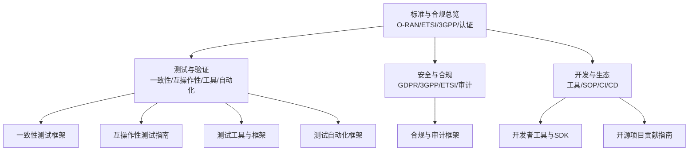
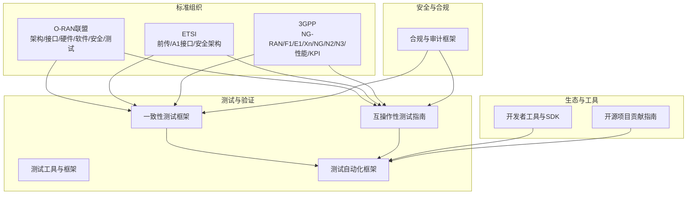
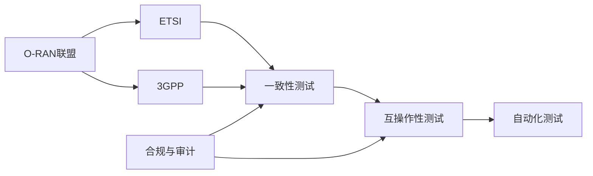
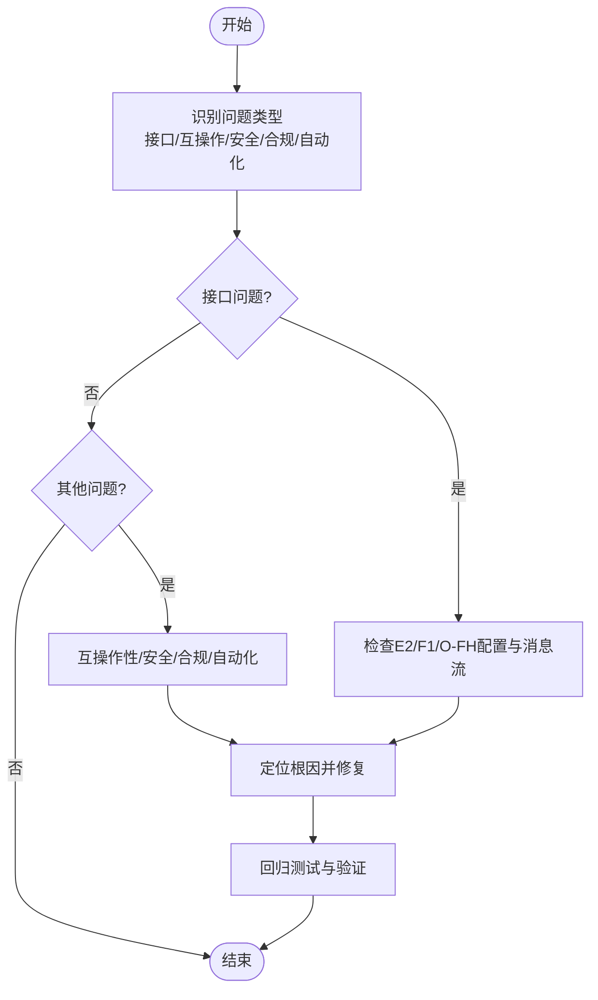

# 标准与合规

<cite>
**本文引用的文件**
- [O-RAN 标准与规范](file://09-standards-compliance/readme-zh.md)
- [O-RAN 测试一致性验证](file://13-testing-validation/conformance-testing/o-ran-conformance-testing.md)
- [O-RAN Conformance Testing Framework](file://13-testing-validation/conformance-testing/o-ran-conformance-testing-en.md)
- [O-RAN Interoperability Testing](file://13-testing-validation/interoperability/interoperability-testing.md)
- [O-RAN 测试工具与框架](file://13-testing-validation/testing-tools/testing-tools-frameworks.md)
- [O-RAN Compliance and Auditing Framework](file://12-security-privacy/compliance-auditing/compliance-auditing-framework.md)
- [O-RAN Test Automation Framework](file://13-testing-validation/automation-framework/test-automation-framework.md)
- [O-RAN 开发者工具和SDK](file://17-open-source-ecosystem/developer-tools/oran-development-tools-zh.md)
- [O-RAN 联盟工作组详细职责](file://06-working-groups/wg-detailed-responsibilities.md)
</cite>

## 目录
1. [引言](#引言)
2. [项目结构](#项目结构)
3. [核心组件](#核心组件)
4. [架构总览](#架构总览)
5. [详细组件分析](#详细组件分析)
6. [依赖分析](#依赖分析)
7. [性能考虑](#性能考虑)
8. [故障排查指南](#故障排查指南)
9. [结论](#结论)
10. [附录](#附录)

## 引言
本文件面向O-RAN标准与合规，系统梳理O-RAN联盟标准体系、ETSI关键标准（TS 103 859、TS 103 983、TS 103 986、TS 103 987、GS ORAN-005）、3GPP标准（NG-RAN、F1/E1/Xn/NG/N2/N3、RIC相关）以及测试与认证流程，结合多厂商集成实践、Plugfest参与与最佳实践，帮助读者建立从“理解—应用—验证—持续改进”的闭环能力。

## 项目结构
围绕标准与合规主题，知识库按专题组织，便于分层次学习与检索：
- 标准与合规总览：O-RAN标准体系、ETSI与3GPP标准、合规与认证流程、多厂商集成与最佳实践
- 测试与验证：一致性测试、互操作性测试、测试工具与自动化框架
- 安全与合规：GDPR、3GPP与ETSI安全要求、第三方审计与持续合规
- 开发与生态：开发者工具、开源项目贡献、测试仿真与CI/CD集成

章节来源
- file://09-standards-compliance/readme-zh.md#L1-L371

## 核心组件
- 标准体系与关系
  - O-RAN联盟规范：架构、接口、硬件、软件、安全、测试六大工作组职责与规范
  - ETSI标准：前传协议栈、A1接口通用与传输、前传传输配置文件、安全架构
  - 3GPP标准：NG-RAN架构、F1/E1/Xn/NG/N2/N3接口、RIC相关性能与KPI
- 合规与认证流程
  - 合规要求：O-RAN联盟、ETSI、3GPP、区域与行业特定要求
  - 认证程序：符合性测试、互操作性测试、安全认证、第三方认证
  - 测试实验室：认证机构、能力要求、设备与流程、报告与证书
  - 合规验证：自评估、第三方审核、报告与非符合项处理、持续监控
- 多厂商集成与Plugfest
  - 挑战：接口兼容、功能/性能/安全/运维差异
  - 策略：接口适配层、功能映射、性能优化、安全策略统一、运维工具集成
  - 参与：Plugfest概述、流程、场景、结果分析与经验总结
- 行业最佳实践
  - 部署：网络规划、架构设计、硬件/软件配置、集成测试
  - 集成：框架、适配、数据同步、告警/事件、故障诊断与恢复
  - 性能：网络/接口/资源/延迟/吞吐优化
  - 安全：架构设计、访问控制、数据保护、监控与审计、应急响应
  - 运维：监控设计、告警策略、故障处理、变更与容量规划

章节来源
- file://09-standards-compliance/readme-zh.md#L8-L193

## 架构总览
下图展示O-RAN标准与合规的整体架构：三大标准组织（O-RAN联盟、ETSI、3GPP）协同定义架构、接口与安全；测试与验证贯穿一致性、互操作性与自动化；安全与合规贯穿全生命周期；生态与工具支撑开发、测试与CI/CD。

图表来源
- file://09-standards-compliance/readme-zh.md#L46-L108
- file://13-testing-validation/conformance-testing/o-ran-conformance-testing.md#L6-L14
- file://13-testing-validation/interoperability/interoperability-testing.md#L6-L26
- file://13-testing-validation/testing-tools/testing-tools-frameworks.md#L1-L598
- file://13-testing-validation/automation-framework/test-automation-framework.md#L6-L21
- file://12-security-privacy/compliance-auditing/compliance-auditing-framework.md#L1-L486
- file://17-open-source-ecosystem/developer-tools/oran-development-tools-zh.md#L1-L800

## 详细组件分析

### O-RAN联盟规范体系
- 架构规范（WG2）：O-RAN总体架构、RIC/SMO功能定义、O-CU/O-DU/O-RU功能划分、接口定义与关系
- 接口规范（WG3）：E2、A1、O1、O-FH、M-Plane接口规范
- 硬件规范（WG4）：白盒RU/DU、通用平台、HAL、兼容性测试
- 软件规范（WG5）：软件架构、容器化部署、组件接口、生命周期管理、更新升级
- 安全规范（WG6）：安全架构、接口安全、认证授权、数据保护、审计与合规
- 测试规范（WG8）：互操作性、符合性、性能、安全测试、Plugfest指南

章节来源
- file://06-working-groups/wg-detailed-responsibilities.md#L7-L55
- file://06-working-groups/wg-detailed-responsibilities.md#L56-L107
- file://06-working-groups/wg-detailed-responsibilities.md#L108-L159
- file://06-working-groups/wg-detailed-responsibilities.md#L160-L208
- file://06-working-groups/wg-detailed-responsibilities.md#L209-L259
- file://06-working-groups/wg-detailed-responsibilities.md#L261-L314
- file://06-working-groups/wg-detailed-responsibilities.md#L367-L418

### ETSI标准详解
- TS 103 859：前传控制/用户/同步平面、协议栈、C/U/S平面、传输配置文件
- TS 103 983：A1接口通用规范与原则、策略管理框架、生命周期、安全要求
- TS 103 986：A1接口传输协议（REST/JSON/HTTP(S)、错误处理、性能）
- TS 103 987：前传传输配置文件（定义、类型、参数、管理与验证）
- GS ORAN-005：安全架构（威胁分析、要求、机制、评估与合规）

章节来源
- file://09-standards-compliance/readme-zh.md#L46-L76

### 3GPP标准集成
- 5G NR（Release 15-18）：物理层、复用与编码、层过程
- NG-RAN架构与接口：F1、E1、Xn、NG、N2/N3
- RIC相关：功能概述、接口、性能测量与KPI
- 演进路线：Release 15/16/17/18与未来方向

章节来源
- file://09-standards-compliance/readme-zh.md#L78-L108

### 合规与认证流程
- 合规要求：O-RAN联盟、ETSI、3GPP、区域与行业特定
- 认证流程：符合性、互操作性、安全、第三方认证
- 测试实验室：机构清单、能力要求、设备与流程、报告与证书
- 合规验证：自评估、第三方审核、报告、非符合项处理、持续监控

章节来源
- file://09-standards-compliance/readme-zh.md#L110-L135

### 多厂商集成与Plugfest
- 挑战：接口兼容、功能/性能/安全/运维差异
- 策略：接口适配层、功能映射、性能优化、安全统一、运维集成
- Plugfest：概述、流程、场景、结果分析、经验总结
- 互操作性测试：场景设计、用例开发、环境搭建、执行与记录、问题识别与解决

章节来源
- file://09-standards-compliance/readme-zh.md#L136-L161

### 行业最佳实践
- 部署：网络规划、架构设计、硬件/软件配置、集成测试
- 集成：框架、适配、数据同步、告警/事件、故障诊断与恢复
- 性能：网络/接口/资源/延迟/吞吐优化
- 安全：架构设计、访问控制、数据保护、监控与审计、应急响应
- 运维：监控设计、告警策略、故障处理、变更与容量规划

章节来源
- file://09-standards-compliance/readme-zh.md#L162-L193

### 一致性测试框架
- 测试框架：架构、接口、功能、性能、安全一致性测试
- 规范验证：NG-RAN架构、5G NR协议、RAN功能、互操作性
- 测试环境：测试床配置、自动化平台
- 流程：准备、执行、评估
- 质量保证：覆盖度、有效性

章节来源
- file://13-testing-validation/conformance-testing/o-ran-conformance-testing.md#L1-L67

### 一致性测试方法学与自动化
- O-RAN联盟测试套件：架构、接口、功能、性能、安全一致性
- 3GPP规范验证：NG-RAN架构、5G NR协议、RAN功能、互操作性
- 测试床配置：Kubernetes/Helm、端口/协议/配置
- 测试数据生成：网络流量、UE移动性、故障场景
- CI/CD集成：流水线阶段、制品与报告、性能回归

章节来源
- file://13-testing-validation/conformance-testing/o-ran-conformance-testing-en.md#L6-L291

### 互操作性测试指南
- 目标：多厂商兼容、接口标准、系统集成
- 场景：E2、F1、O-FH、A1、O1接口互通
- 方法：黑盒/灰盒/白盒测试
- 环境：多厂商测试床、测试矩阵
- 验证：功能/性能/可靠性指标
- 认证：O-RAN认证、行业标准、合规

章节来源
- file://13-testing-validation/interoperability/interoperability-testing.md#L1-L231

### 测试工具与框架
- 商业工具：Spirent、Keysight、Anritsu、Wireshark扩展
- 开源框架：Robot Framework、PyTest、Docker/K8s、Prometheus/Grafana
- 自动化：CI/CD流水线、测试数据管理、安全扫描

章节来源
- file://13-testing-validation/testing-tools/testing-tools-frameworks.md#L1-L598

### 测试自动化框架
- 架构：编排层、执行引擎、数据管理、结果分析、报告
- 技术栈：CI/CD、容器编排、测试框架、监控、版本控制
- 实施：环境配置、脚本开发、最佳实践、高级特性（AI优化、并行执行）、监控与分析、安全与合规

章节来源
- file://13-testing-validation/automation-framework/test-automation-framework.md#L1-L134

### 合规与审计框架
- GDPR：DPIA模板、实施清单
- 3GPP安全：TS 33.501/33.102/33.401要求与O-RAN影响
- ETSI安全：安全架构与测试合规检查脚本与报告
- 第三方审计：准备清单、证据收集、证据包生成、持续监控仪表盘

章节来源
- file://12-security-privacy/compliance-auditing/compliance-auditing-framework.md#L1-L486

### 开发者工具与生态
- 开发环境：容器化Dockerfile、依赖安装、Python环境、O-RAN工具链
- IDE配置：VS Code扩展、PyCharm风格、YAML/Kubernetes关联
- 测试与仿真：测试框架、网络模拟器、CLI接口
- 开源贡献：项目列表、流程、规范、社区参与、晋升路径

章节来源
- file://17-open-source-ecosystem/developer-tools/oran-development-tools-zh.md#L1-L800
- file://17-open-source-ecosystem/core-projects/contribution-guide.md#L1-L113

## 依赖分析
- 组织间依赖
  - O-RAN联盟定义架构与接口边界，ETSI细化前传与A1接口，3GPP定义5G NR基础
  - 三者协同：O-RAN在3GPP基础上扩展开放与智能化，ETSI补充传输与安全细节
- 测试与验证依赖
  - 一致性测试依赖标准版本与测试床配置
  - 互操作性测试依赖多厂商环境与测试矩阵
  - 自动化测试依赖CI/CD与监控系统
- 安全与合规依赖
  - 3GPP/ETSI安全要求驱动安全架构与测试
  - 审计框架支撑合规报告与持续监控

图表来源
- file://09-standards-compliance/readme-zh.md#L338-L342
- file://13-testing-validation/conformance-testing/o-ran-conformance-testing-en.md#L6-L291
- file://13-testing-validation/interoperability/interoperability-testing.md#L1-L231
- file://12-security-privacy/compliance-auditing/compliance-auditing-framework.md#L1-L486

章节来源
- file://09-standards-compliance/readme-zh.md#L338-L363

## 性能考虑
- 接口性能：E2/F1/O-FH延迟与吞吐阈值、压缩算法与信号质量权衡
- 系统性能：端到端连通性、平均/尾部延迟、切换成功率、资源利用率
- 测试基准：性能回归、对比基线、容量规划与扩容策略
- 自动化与可观测性：Prometheus/Grafana指标采集与告警，提升问题定位效率

章节来源
- file://13-testing-validation/testing-tools/testing-tools-frameworks.md#L481-L559
- file://13-testing-validation/conformance-testing/o-ran-conformance-testing-en.md#L269-L291

## 故障排查指南
- 接口问题
  - E2：连接建立、订阅管理、指示消息交换、控制命令执行、连接维护与恢复
  - F1：设置流程、UE上下文、承载建立/修改、RRC转移、错误处理与恢复
  - O-FH：前传配置选项、压缩算法有效性
- 互操作性问题
  - 多厂商组合测试矩阵、失败场景注入与恢复验证
- 安全与合规问题
  - DPIA与合规清单、安全测试脚本、审计证据包生成与报告
- 自动化与CI问题
  - 流水线阶段、测试报告、覆盖率与回归分析

章节来源
- file://13-testing-validation/interoperability/interoperability-testing.md#L28-L178
- file://13-testing-validation/conformance-testing/o-ran-conformance-testing-en.md#L570-L615
- file://12-security-privacy/compliance-auditing/compliance-auditing-framework.md#L238-L430

## 结论
通过系统化理解O-RAN联盟、ETSI与3GPP标准，结合一致性与互操作性测试、自动化与工具链、安全与合规框架，以及多厂商集成与Plugfest实践，可以构建从“标准理解—测试验证—认证合规—持续改进”的完整能力闭环，支撑O-RAN网络高质量部署与运营。

## 附录
- 学习资源与参考链接：O-RAN联盟、ETSI、3GPP官网与认证机构
- 实验室项目：合规评估、接口测试、多厂商集成测试、Plugfest参与、认证准备
- 生产环境最佳实践：标准合规、合规管理、多厂商集成、持续改进

章节来源
- file://09-standards-compliance/readme-zh.md#L248-L371
- file://09-standards-compliance/readme-zh.md#L302-L335