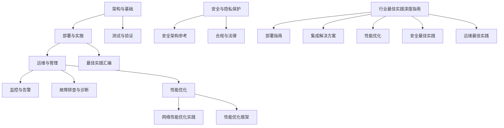
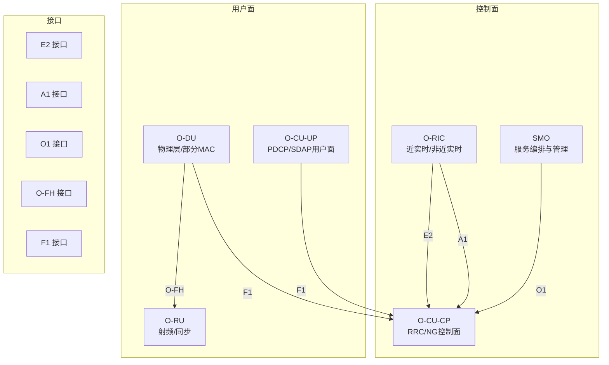
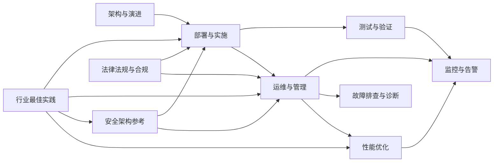

# 行业最佳实践

<cite>
**本文引用的文件**
- [O-RAN 基础知识](file://01-architecture-system/readme.md)
- [O-RAN 架构演进](file://01-architecture-system/architecture-evolution.md)
- [O-RAN 实施](file://08-deployment-implementation/readme.md)
- [O-RAN 测试与验证](file://13-testing-validation/readme.md)
- [O-RAN 运维与管理](file://14-operations-management/readme.md)
- [O-RAN 运维与管理-性能优化框架](file://14-operations-management/performance-optimization/performance-optimization-framework.md)
- [O-RAN 安全与隐私保护](file://12-security-privacy/readme.md)
- [O-RAN 安全架构参考](file://12-security-privacy/security-architecture/security-reference-architecture.md)
- [O-RAN 性能优化](file://26-performance-optimization/readme.md)
- [O-RAN 网络性能优化实践](file://26-performance-optimization/network-optimization/network-performance-tuning.md)
- [O-RAN 监控与告警](file://28-monitoring-alerting/readme.md)
- [O-RAN 故障排查与诊断](file://27-troubleshooting-diagnosis/readme.md)
- [O-RAN 最佳实践汇编](file://30-best-practices/readme.md)
- [可持续发展](file://24-sustainable-development/readme.md)
- [法律法规与合规](file://25-legal-regulations/readme.md)
- [O-RAN 行业最佳实践深度指南](file://09-standards-compliance/industry-best-practices/industry-best-practices-deep-dive.md)
- [O-RAN 行业最佳实践概览](file://09-standards-compliance/industry-best-practices/readme.md)
</cite>

## 更新摘要
**变更内容**
- 新增了全面的行业最佳实践深度指南章节，涵盖部署、集成、性能优化、安全和运维的完整最佳实践
- 更新了网络规划与部署架构部分，增加了详细的硬件选型和软件配置指导
- 扩展了多厂商集成与接口适配解决方案，包含完整的集成框架和适配策略
- 增强了数据同步机制和告警事件管理的内容
- 完善了性能优化策略，包括网络、接口、资源利用率和延迟优化
- 强化了安全架构设计和访问控制策略
- 丰富了运维最佳实践，包括监控系统设计、告警管理、故障处理等

## 目录
1. [引言](#引言)
2. [项目结构](#项目结构)
3. [核心组件](#核心组件)
4. [架构总览](#架构总览)
5. [详细组件分析](#详细组件分析)
6. [依赖关系分析](#依赖关系分析)
7. [性能考量](#性能考量)
8. [故障排查与诊断](#故障排查与诊断)
9. [结论](#结论)
10. [附录](#附录)

## 引言
本文件面向O-RAN网络的部署与运维，结合仓库中的架构、部署、测试、监控、安全、性能优化、故障排查与合规等专题资料，形成一套可执行的行业最佳实践指南。内容覆盖网络规划、硬件与软件选型、集成测试、多厂商适配、数据同步与告警、性能调优、安全架构与合规、以及运维流程与容量规划等关键领域，帮助云平台与网络工程团队在生产环境中稳定、高效、安全地交付O-RAN网络。

**更新** 新增了基于701行行业最佳实践深度指南的全面内容，提供了从网络规划到生产环境运营的完整最佳实践体系。

## 项目结构
本仓库围绕O-RAN的"架构—部署—测试—运维—安全—性能—监控—故障—合规—最佳实践"形成完整知识体系，便于按主题检索与落地实施。

**图表来源**
- [O-RAN 基础知识:1-161](file://01-architecture-system/readme.md#L1-L161)
- [O-RAN 实施:1-353](file://08-deployment-implementation/readme.md#L1-L353)
- [O-RAN 测试与验证:1-103](file://13-testing-validation/readme.md#L1-L103)
- [O-RAN 运维与管理:1-126](file://14-operations-management/readme.md#L1-L126)
- [O-RAN 监控与告警:1-95](file://28-monitoring-alerting/readme.md#L1-L95)
- [O-RAN 故障排查与诊断:1-105](file://27-troubleshooting-diagnosis/readme.md#L1-L105)
- [O-RAN 性能优化:1-67](file://26-performance-optimization/readme.md#L1-L67)
- [O-RAN 网络性能优化实践:1-98](file://26-performance-optimization/network-optimization/network-performance-tuning.md#L1-L98)
- [O-RAN 运维与管理-性能优化框架:1-650](file://14-operations-management/performance-optimization/performance-optimization-framework.md#L1-L650)
- [O-RAN 安全与隐私保护:1-67](file://12-security-privacy/readme.md#L1-L67)
- [O-RAN 安全架构参考:1-559](file://12-security-privacy/security-architecture/security-reference-architecture.md#L1-L559)
- [O-RAN 最佳实践汇编:1-113](file://30-best-practices/readme.md#L1-L113)
- [O-RAN 行业最佳实践深度指南:1-701](file://09-standards-compliance/industry-best-practices/industry-best-practices-deep-dive.md#L1-L701)
- [O-RAN 法律法规与合规:1-74](file://25-legal-regulations/readme.md#L1-L74)

**章节来源**
- [O-RAN 基础知识:1-161](file://01-architecture-system/readme.md#L1-L161)
- [O-RAN 实施:1-353](file://08-deployment-implementation/readme.md#L1-L353)

## 核心组件
- 架构与演进：明确O-RAN参考架构、分层设计、功能分布、云原生与弹性伸缩，理解从传统RAN到O-RAN的技术演进与挑战。
- 核心网元：掌握O-RU、O-DU、O-CU、O-RIC、SMO及跨厂商协调功能的职责边界与协作方式。
- 接口标准：熟悉E2、A1、O1、O-FH、F1等接口协议与应用场景，支撑多厂商集成与互通。
- 解耦与部署：理解CU/DU/RU解耦、功能分割点、前传/中传/回传网络要求与带宽/时延预算。
- 云平台集成：容器编排、微服务、自动化部署与监控集成，支撑弹性与可观测性。

**章节来源**
- [O-RAN 基础知识:8-59](file://01-architecture-system/readme.md#L8-L59)
- [O-RAN 架构演进:1-183](file://01-architecture-system/architecture-evolution.md#L1-L183)

## 架构总览
下图展示O-RAN核心网元与关键接口的交互关系，体现控制面与用户面分离、近实时与非近实时智能控制、以及SMO的生命周期管理职责。

**图表来源**
- [O-RAN 基础知识:27-34](file://01-architecture-system/readme.md#L27-L34)
- [O-RAN 架构演进:41-74](file://01-architecture-system/architecture-evolution.md#L41-L74)

## 详细组件分析

### 网络规划与部署架构
- **覆盖规划**：使用适当的传播模型进行覆盖预测，基于覆盖需求选择天线，战略性站点选择以实现最优覆盖，频率规划用于干扰管理，容量规划满足流量需求。
- **容量规划**：开发准确的流量模型，适当配置网络容量，优化资源配置，实施有效的负载均衡，规划未来可扩展性需求。
- **干扰管理**：分析潜在干扰源，协调频率以最小化干扰，实施有效的功率控制，使用波束成形减少干扰，实现干扰缓解技术。
- **部署架构设计**：集中式/分布式/混合/云原生/边缘部署架构的设计原则、站点选择、跨域互联与一致性管理、容灾与高可用。
- **硬件选型与配置**：服务器规格、加速卡、存储与备份、电源与制冷、能耗优化，基于性能、可扩展性、可靠性、成本和供应商支持进行硬件选择。
- **软件部署与配置**：蓝绿部署、金丝雀部署、滚动部署、A/B测试部署、特性标志部署等零停机部署策略，配置模板、配置自动化、配置验证、版本控制和备份恢复。
- **集成测试策略**：接口、功能、性能、互操作与回归测试，CI/CD与自动化测试流水线。
- **运维体系**：监控、告警、故障管理、性能管理、配置管理、容量管理与SLA治理。
- **安全加固**：网络分段、访问控制、加密传输、接口认证授权、系统与容器安全、安全监控与审计。
- **自动化与编排**：IaC、Ansible、Kubernetes/Helm/ArgoCD、蓝绿/金丝雀发布与自愈。

**更新** 新增了基于行业最佳实践的深度网络规划指导，包括覆盖规划、容量规划和干扰管理的详细策略。

**章节来源**
- [O-RAN 行业最佳实践深度指南:11-140](file://09-standards-compliance/industry-best-practices/industry-best-practices-deep-dive.md#L11-L140)
- [O-RAN 实施:8-196](file://08-deployment-implementation/readme.md#L8-L196)

### 多厂商集成与接口适配
- **接口协议一致性**：E2消息流与错误处理、A1策略下发与执行监控、O1配置/告警/性能数据、O-FH同步/带宽/误码、F1 CU-DU通信与移动性。
- **互操作性**：多厂商兼容性测试、跨厂商功能验证、Plugfest与认证准备。
- **配置与版本管理**：CMDB、Git、变更审计与回滚、自动化配置与补丁管理。
- **运维自动化**：基础设施即代码、容器编排、GitOps持续交付、监控自动化。
- **集成架构**：分层集成架构、模块化集成组件、服务导向集成、事件驱动集成、微服务集成。
- **集成模式**：适配器模式、网关模式、代理模式、中介者模式、桥接模式。
- **集成治理**：定义集成标准、制定集成策略、规范集成流程、选择集成工具、监控集成健康状态。
- **协议适配**：协议转换、协议格式转换、协议桥接、协议调解、协议规范化。
- **数据适配**：数据格式转换、数据模型映射、数据增强、数据完整性验证、数据格式规范化。
- **行为适配**：行为翻译、行为实现规范化、行为差异补偿、期望行为模拟、不同行为模式适配。

**更新** 新增了完整的集成框架、接口适配解决方案和行为适配策略，提供了系统化的多厂商集成方法。

**章节来源**
- [O-RAN 行业最佳实践深度指南:143-194](file://09-standards-compliance/industry-best-practices/industry-best-practices-deep-dive.md#L143-L194)
- [O-RAN 实施:62-196](file://08-deployment-implementation/readme.md#L62-L196)
- [O-RAN 测试与验证:15-57](file://13-testing-validation/readme.md#L15-L57)

### 数据同步与一致性
- **分布式场景的数据一致性与分布式协调机制**，跨站点数据同步策略与冲突解决。
- **配置与状态同步**：跨域配置一致性、版本控制与冲突检测、回滚与修复。
- **日志与指标同步**：统一采集、去重与聚合，保障跨域可观测性。
- **同步策略**：实时同步、近实时同步、批量同步、事件驱动同步、混合同步方法。
- **同步方法**：全量同步、增量同步、差异同步、选择性同步、优先级同步。
- **同步挑战**：跨系统数据一致性维护、数据冲突解决、同步性能优化、可靠同步保证、同步机制扩展性。

**更新** 新增了系统化的数据同步机制，包括多种同步策略和方法，以及同步挑战的解决方案。

**章节来源**
- [O-RAN 行业最佳实践深度指南:195-220](file://09-standards-compliance/industry-best-practices/industry-best-practices-deep-dive.md#L195-L220)
- [O-RAN 实施:15-26](file://08-deployment-implementation/readme.md#L15-L26)

### 告警与事件管理
- **多维监控**：基础设施、网络、应用、业务KPI；分层告警与聚合抑制。
- **告警分级与规则**：CPU/内存/磁盘/网络/业务阈值，重复/依赖/时段抑制与智能聚合。
- **可视化与报告**：仪表盘、拓扑图、趋势分析、容量/安全/业务影响报告。
- **工具链**：Prometheus/Grafana/Alertmanager、ELK、Splunk、New Relic等。
- **告警管理**：相关告警关联、无关告警过滤、按严重性优先级排序、关键告警升级、有效告警解决。
- **事件管理**：多源事件收集、实时事件处理、相关事件关联、利益相关者通知、事件归档分析。
- **管理工具**：告警管理工具、事件管理工具、事件关联引擎、事件通知系统、告警和事件报告工具。
- **告警设计**：清晰的告警标准定义、告警严重级别定义、告警关联规则设计、告警升级程序、告警文档记录。
- **告警处理**：多源告警收集、无关告警过滤、相关告警关联、利益相关者通知、有效告警解决。
- **告警优化**：告警噪音减少、重要性优先级排序、告警处理自动化、告警模式分析、告警管理持续改进。

**更新** 新增了完整的告警和事件管理体系，包括告警设计、处理和优化的全流程指导。

**章节来源**
- [O-RAN 行业最佳实践深度指南:221-246](file://09-standards-compliance/industry-best-practices/industry-best-practices-deep-dive.md#L221-L246)
- [O-RAN 监控与告警:6-95](file://28-monitoring-alerting/readme.md#L6-L95)

### 故障诊断与恢复
- **故障分类**：硬件、软件、网络、协议；影响范围与严重性评估。
- **诊断流程**：现象收集、初步调查、深入分析、根因定位、修复与验证。
- **工具箱**：系统/网络/应用诊断工具，专用O-RAN诊断软件与协议分析器。
- **预防性维护**：定期巡检、异常预警、预测性分析、自动化修复脚本与知识库。
- **故障检测**：主动故障检测、被动故障检测、预测性故障检测、自动化故障检测、手动故障检测。
- **故障诊断**：故障根因分析、按类型和严重性分类故障、将故障隔离到特定组件、相关故障关联、故障详情记录。
- **故障恢复**：自动化故障恢复、手动故障恢复程序、优雅降级策略、备用系统故障转移、自愈能力。
- **故障处理程序**：主动故障检测方法、被动故障检测方法、自动化故障检测、手动故障检测、预测性故障检测。
- **故障分析**：故障根因分析、按类型分类故障、评估故障影响、相关故障关联、故障详情记录。
- **故障解决**：即时故障解决、临时变通方案、永久故障修复、故障解决验证、解决详情记录。

**更新** 新增了系统化的故障检测和恢复机制，包括主动检测、预测性检测和自愈能力。

**章节来源**
- [O-RAN 行业最佳实践深度指南:247-272](file://09-standards-compliance/industry-best-practices/industry-best-practices-deep-dive.md#L247-L272)
- [O-RAN 故障排查与诊断:6-105](file://27-troubleshooting-diagnosis/readme.md#L6-L105)

### 安全架构与合规
- **零信任模型**：域划分、最小权限、持续验证、微分段。
- **加密与密钥**：证书层次结构、组件证书签发与轮换、密钥派生与加解密。
- **身份与访问**：mTLS、RBAC、OAuth2/OpenID、审计日志。
- **安全监控**：SIEM集成、威胁检测、情报联动、响应建议。
- **合规框架**：GDPR、NIST、ISO27001、ETSI与3GPP安全要求。
- **纵深防御**：分层安全控制、安全区域和边界建立、清晰的安全边界定义、每层访问控制、所有安全层监控。
- **零信任架构**：始终验证每次访问请求、授予最低必要权限、假设已遭入侵并相应计划、实施微分段、持续监控威胁。
- **安全框架**：实施NIST网络安全框架、实施ISO 27001安全管理、实施CIS安全控制、实施行业标准、满足监管要求。
- **认证策略**：关键系统实施MFA、使用证书进行系统认证、使用令牌进行API认证、实施强密码策略、实施安全会话管理。
- **授权策略**：为用户访问实施RBAC、为细粒度控制实施ABAC、实施基于策略的访问控制、实施基于时间的访问限制、实施基于位置的访问限制。
- **访问控制实施**：集中式身份管理、跨系统联邦身份、为用户便利性实施SSO、管理特权访问、定期访问审查和认证。
- **数据分类**：定义数据分类级别、实施分类策略、实施数据标记、为每个级别定义处理程序、定义数据保留策略。
- **数据加密**：静态数据加密、传输中数据加密、尽可能在使用中加密数据、实施强大的密钥管理、实施证书生命周期管理。
- **数据丢失防护**：实施DLP策略、监控数据丢失事件、防止未经批准的数据传输、检测数据丢失事件、响应数据丢失事件。
- **安全监控**：实施集中式日志管理、与SIEM系统集成、实施威胁检测能力、实施异常检测、实施实时安全监控。
- **安全审计**：实施全面审计日志记录、维护所有活动的审计跟踪、定期进行安全审计、进行合规审计、聘请第三方审计员。
- **事件响应**：制定事件响应计划、检测安全事件、遏制安全事件、消除安全威胁、从安全事件中恢复。
- **事件响应计划**：建立事件响应团队、制定响应程序、制定沟通计划、定义升级程序、定义恢复程序。
- **事件响应执行**：检测和安件事件、遏制安全事件、消除安全威胁、从事件中恢复、记录经验教训。
- **持续改进**：进行事后审查、改进响应流程、增强响应工具、培训响应团队、测试响应程序。

**更新** 新增了完整的零信任安全架构、多层防御策略和全面的事件响应机制。

**章节来源**
- [O-RAN 行业最佳实践深度指南:405-536](file://09-standards-compliance/industry-best-practices/industry-best-practices-deep-dive.md#L405-L536)
- [O-RAN 安全与隐私保护:8-67](file://12-security-privacy/readme.md#L8-L67)
- [O-RAN 安全架构参考:8-559](file://12-security-privacy/security-architecture/security-reference-architecture.md#L8-L559)

### 性能优化策略
- **网络层**：频谱效率、干扰管理、传输效率、QoS参数、负载均衡。
- **计算层**：CPU亲和/调度、内存大页/池化、存储I/O、网络I/O（中断合并/批处理/零拷贝）。
- **应用层**：RIC应用与接口优化、微服务调用链优化、容器资源限制与启动效率。
- **监控与基线**：性能基线、瓶颈识别、根因分析、效果验证与持续优化。
- **无线性能优化**：优化无线覆盖、优化网络容量、管理和减少干扰、优化切换性能、优化功率控制设置。
- **传输性能优化**：优化带宽利用率、降低网络延迟、最小化抖动、最小化丢包率、优化服务质量。
- **核心网优化**：优化会话管理、优化移动性管理、优化资源配置、优化负载均衡、规划容量需求。
- **E2接口优化**：优化E2接口吞吐量、降低E2接口延迟、优化订阅管理、优化数据采集、优化资源管理。
- **A1接口优化**：优化策略分发、优化策略执行、优化通知机制、优化可扩展性、优化可靠性。
- **O1接口优化**：优化管理操作、优化配置管理、优化故障管理、优化性能管理、优化安全管理。
- **计算资源优化**：优化CPU利用率、优化内存使用、优化存储利用率、优化硬件加速器使用、优化虚拟化效率。
- **网络资源优化**：优化带宽使用、优化频谱利用率、优化接口使用、优化协议效率、优化数据压缩。
- **管理资源优化**：优化工具使用、优化管理流程、优化自动化效率、优化监控效率、优化报告效率。
- **端到端延迟优化**：优化空口延迟、优化传输延迟、优化处理延迟、优化队列管理、优化协议延迟。
- **延迟降低技术**：部署边缘计算以降低延迟、实施缓存以减少延迟、预取数据以减少延迟、压缩数据以减少传输时间、并行处理以减少延迟。
- **延迟监控和测量**：实时监控延迟、分析历史延迟数据、分析延迟趋势、识别延迟瓶颈、验证延迟优化效果。
- **数据吞吐量优化**：优化带宽利用率、优化调制方案、优化编码方案、优化MIMO配置、优化载波聚合。
- **控制吞吐量优化**：优化信令效率、优化协议效率、优化处理效率、优化队列管理、优化资源配置。
- **吞吐量监控和测量**：实时监控吞吐量、分析历史吞吐量数据、分析吞吐量趋势、识别吞吐量瓶颈、验证吞吐量优化效果。

**更新** 新增了全面的性能优化策略，涵盖网络、接口、资源利用率和延迟等多个维度的优化方法。

**章节来源**
- [O-RAN 行业最佳实践深度指南:273-404](file://09-standards-compliance/industry-best-practices/industry-best-practices-deep-dive.md#L273-L404)
- [O-RAN 性能优化:6-67](file://26-performance-optimization/readme.md#L6-L67)
- [O-RAN 网络性能优化实践:1-98](file://26-performance-optimization/network-optimization/network-performance-tuning.md#L1-L98)
- [O-RAN 运维与管理-性能优化框架:1-650](file://14-operations-management/performance-optimization/performance-optimization-framework.md#L1-L650)

### 运维最佳实践
- **日常运维**：健康检查、变更流程、版本升级、补丁与安全更新、备份与恢复。
- **自动化**：Ansible/Kubernetes/CI/CD/IaC、无人值守与自愈。
- **容量规划**：负载预测、扩容时机、资源利用率优化、成本优化。
- **生命周期**：设计/部署/运行/维护/退役全周期管理与文档化。
- **监控架构**：分层监控、分布式监控、集中化管理、可扩展架构、弹性架构。
- **监控组件**：监控数据收集、监控数据处理、监控数据存储、监控数据分析、监控数据可视化。
- **监控能力**：实时监控能力、历史数据分析、趋势分析能力、预测分析能力、告警和通知能力。
- **变更管理**：变更请求、变更影响评估、变更审批、变更实施计划、变更沟通。
- **变更实施**：变更准备、变更执行、变更实施监控、变更成功验证、必要时变更回滚。
- **变更审查**：变更后实施审查、变更成功评估、记录经验教训、改进变更流程、更新文档。
- **容量评估**：评估当前容量利用率、预测未来容量需求、识别容量瓶颈、清点可用资源、预测容量需求。
- **容量规划**：定义规划期限、设定容量目标、确定资源需求、规划容量预算、规划容量实施。
- **容量管理**：监控容量利用率、优化容量使用、按需扩展容量、报告容量状态、定期审查容量计划。
- **运营卓越**：标准化运营流程、自动化重复任务、持续改进运营、管理运营知识、培训运营人员。
- **风险管理**：识别运营风险、评估风险影响和可能性、减轻已识别风险、监控风险指标、响应风险事件。
- **质量管理**：建立质量标准、实施质量流程、监控质量指标、持续改进质量、报告质量状态。

**更新** 新增了完整的运维管理体系，包括监控系统设计、告警管理策略、故障处理程序、变更管理程序和容量规划程序。

**章节来源**
- [O-RAN 行业最佳实践深度指南:537-668](file://09-standards-compliance/industry-best-practices/industry-best-practices-deep-dive.md#L537-L668)
- [O-RAN 运维与管理:6-126](file://14-operations-management/readme.md#L6-L126)
- [O-RAN 最佳实践汇编:51-113](file://30-best-practices/readme.md#L51-L113)

## 依赖关系分析
O-RAN部署与运维涉及多层依赖：架构定义驱动接口与网元职责，接口与网元决定网络与硬件规划，测试与监控保障质量与稳定性，安全与合规贯穿全生命周期，性能优化与运维自动化提升效率与可靠性。

**图表来源**
- [O-RAN 基础知识:1-161](file://01-architecture-system/readme.md#L1-L161)
- [O-RAN 实施:1-353](file://08-deployment-implementation/readme.md#L1-L353)
- [O-RAN 测试与验证:1-103](file://13-testing-validation/readme.md#L1-L103)
- [O-RAN 运维与管理:1-126](file://14-operations-management/readme.md#L1-L126)
- [O-RAN 监控与告警:1-95](file://28-monitoring-alerting/readme.md#L1-L95)
- [O-RAN 故障排查与诊断:1-105](file://27-troubleshooting-diagnosis/readme.md#L1-L105)
- [O-RAN 性能优化:1-67](file://26-performance-optimization/readme.md#L1-L67)
- [O-RAN 安全架构参考:1-559](file://12-security-privacy/security-architecture/security-reference-architecture.md#L1-L559)
- [O-RAN 法律法规与合规:1-74](file://25-legal-regulations/readme.md#L1-L74)
- [O-RAN 行业最佳实践深度指南:1-701](file://09-standards-compliance/industry-best-practices/industry-best-practices-deep-dive.md#L1-L701)

## 性能考量
- **端到端时延与抖动**：无线资源优化、传输协议优化、QoS参数精细化、队列与缓冲策略。
- **吞吐量与并发**：负载均衡、动态调度、容量弹性、Jumbo帧与中断合并。
- **资源利用率**：CPU亲和绑定、NUMA感知、内存大页、容器资源限额、垃圾回收调优。
- **监控与回归**：建立性能基线、趋势分析、回归测试、自动化优化与效果评估。
- **延迟优化**：采用边缘计算、缓存、预取、压缩和并行处理等技术降低延迟。
- **吞吐量优化**：通过带宽优化、调制方案优化、编码方案优化和MIMO配置优化提升吞吐量。
- **资源优化**：优化计算资源、网络资源和管理资源的利用率。

**更新** 新增了基于行业最佳实践的详细性能优化策略，包括延迟优化、吞吐量优化和资源优化。

**章节来源**
- [O-RAN 行业最佳实践深度指南:353-404](file://09-standards-compliance/industry-best-practices/industry-best-practices-deep-dive.md#L353-L404)
- [O-RAN 网络性能优化实践:1-98](file://26-performance-optimization/network-optimization/network-performance-tuning.md#L1-L98)
- [O-RAN 运维与管理-性能优化框架:1-650](file://14-operations-management/performance-optimization/performance-optimization-framework.md#L1-L650)
- [O-RAN 性能优化:26-67](file://26-performance-optimization/readme.md#L26-L67)

## 故障排查与诊断
- **分类与流程**：硬件/软件/网络/协议故障的分类与系统化排查流程。
- **工具与方法**：日志/指标/协议分析、根因分析（5 Why/Fishbone/FTD）、时间线与关联分析。
- **SOP与知识库**：故障响应、升级、沟通、复盘与知识沉淀。
- **主动检测**：通过监控和预测性分析主动发现潜在问题。
- **预测性检测**：利用AI和机器学习技术预测故障发生。
- **自愈能力**：实现自动化的故障检测和恢复机制。
- **故障分类**：按类型和严重性对故障进行分类管理。
- **故障隔离**：将故障精确隔离到特定组件或模块。
- **故障关联**：识别和分析相关故障之间的关联性。

**更新** 新增了主动检测、预测性检测和自愈能力的故障处理方法。

**图表来源**
- [O-RAN 故障排查与诊断:26-50](file://27-troubleshooting-diagnosis/readme.md#L26-L50)

**章节来源**
- [O-RAN 行业最佳实践深度指南:247-272](file://09-standards-compliance/industry-best-practices/industry-best-practices-deep-dive.md#L247-L272)
- [O-RAN 故障排查与诊断:6-105](file://27-troubleshooting-diagnosis/readme.md#L6-L105)

## 结论
通过将架构、部署、测试、监控、安全、性能与运维最佳实践系统化整合，可构建面向生产的O-RAN网络交付与运营体系。建议以零信任安全架构为基础，以多厂商接口一致性为核心，以自动化与可观测性为手段，以性能优化与容量规划为保障，持续迭代与改进，确保网络在安全性、可靠性、性能与成本之间取得最优平衡。

**更新** 基于新增的行业最佳实践深度指南，提供了更全面的O-RAN网络部署与运营最佳实践体系，涵盖了从网络规划到生产环境运营的完整流程。

## 附录
- **绿色与可持续**：能效优化、可再生能源、循环设计、碳足迹管理与长期发展规划。
- **合规与法律**：数据保护、网络安全、知识产权、跨境数据传输与监管遵循。
- **生产环境最佳实践**：运营卓越、风险管理、质量管理的综合指导。

**更新** 新增了生产环境最佳实践指导，包括运营卓越、风险管理和质量管理的综合方法。

**章节来源**
- [O-RAN 行业最佳实践深度指南:669-701](file://09-standards-compliance/industry-best-practices/industry-best-practices-deep-dive.md#L669-L701)
- [可持续发展:6-65](file://24-sustainable-development/readme.md#L6-L65)
- [法律法规与合规:6-74](file://25-legal-regulations/readme.md#L6-L74)