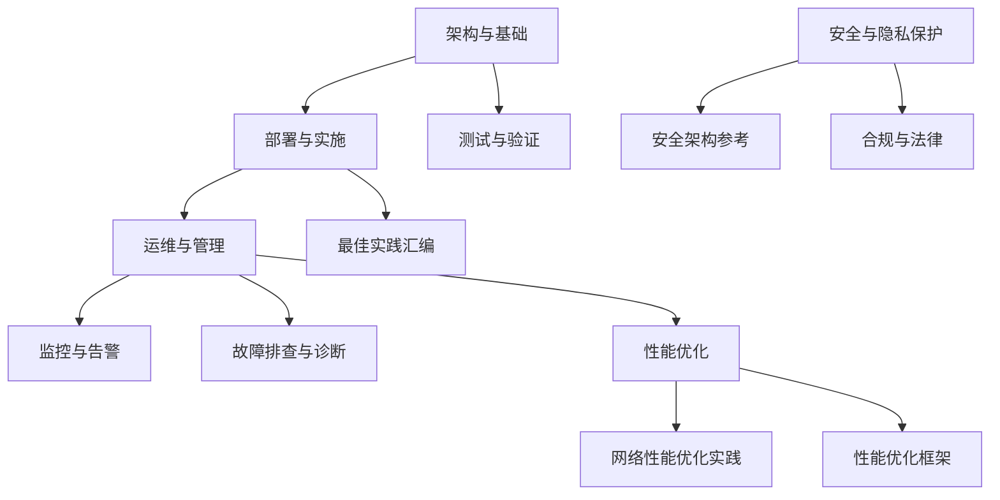
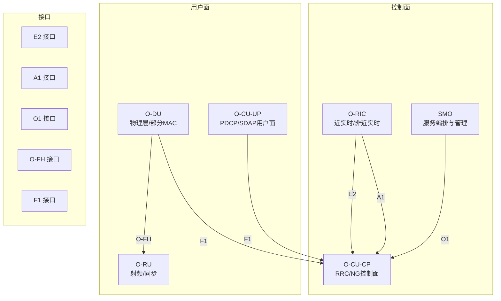
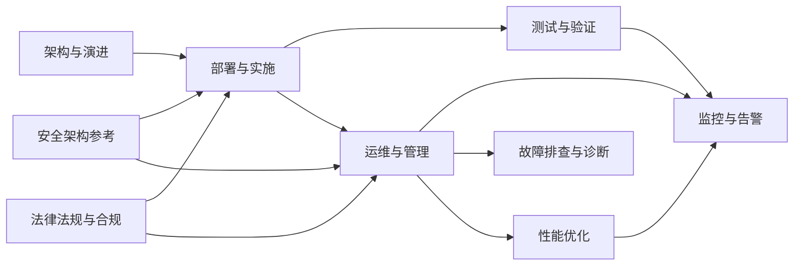
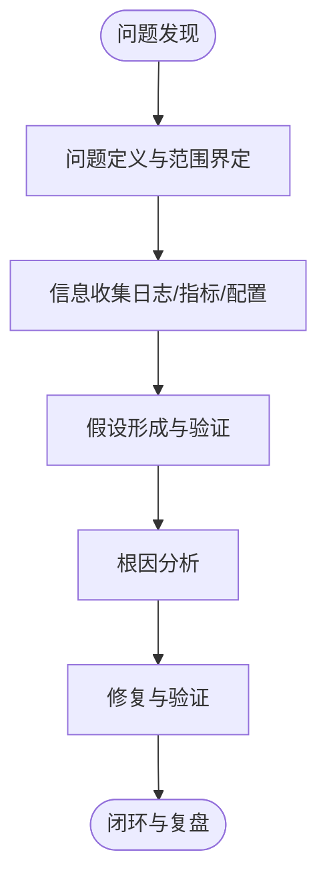

# 行业最佳实践

<cite>
**本文引用的文件**
- [O-RAN 基础知识](file://01-architecture-system/readme.md)
- [O-RAN 架构演进](file://01-architecture-system/architecture-evolution.md)
- [O-RAN 实施](file://08-deployment-implementation/readme.md)
- [O-RAN 测试与验证](file://13-testing-validation/readme.md)
- [O-RAN 运维与管理](file://14-operations-management/readme.md)
- [O-RAN 运维与管理-性能优化框架](file://14-operations-management/performance-optimization/performance-optimization-framework.md)
- [O-RAN 安全与隐私保护](file://12-security-privacy/readme.md)
- [O-RAN 安全架构参考](file://12-security-privacy/security-architecture/security-reference-architecture.md)
- [O-RAN 性能优化](file://26-performance-optimization/readme.md)
- [O-RAN 网络性能优化实践](file://26-performance-optimization/network-optimization/network-performance-tuning.md)
- [O-RAN 监控与告警](file://28-monitoring-alerting/readme.md)
- [O-RAN 故障排查与诊断](file://27-troubleshooting-diagnosis/readme.md)
- [O-RAN 最佳实践汇编](file://30-best-practices/readme.md)
- [可持续发展](file://24-sustainable-development/readme.md)
- [法律法规与合规](file://25-legal-regulations/readme.md)
</cite>

## 目录
1. [引言](#引言)
2. [项目结构](#项目结构)
3. [核心组件](#核心组件)
4. [架构总览](#架构总览)
5. [详细组件分析](#详细组件分析)
6. [依赖关系分析](#依赖关系分析)
7. [性能考量](#性能考量)
8. [故障排查与诊断](#故障排查与诊断)
9. [结论](#结论)
10. [附录](#附录)

## 引言
本文件面向O-RAN网络的部署与运维，结合仓库中的架构、部署、测试、监控、安全、性能优化、故障排查与合规等专题资料，形成一套可执行的行业最佳实践指南。内容覆盖网络规划、硬件与软件选型、集成测试、多厂商适配、数据同步与告警、性能调优、安全架构与合规、以及运维流程与容量规划等关键领域，帮助云平台与网络工程团队在生产环境中稳定、高效、安全地交付O-RAN网络。

## 项目结构
本仓库围绕O-RAN的“架构—部署—测试—运维—安全—性能—监控—故障—合规—最佳实践”形成完整知识体系，便于按主题检索与落地实施。

**图表来源**
- [O-RAN 基础知识](file://01-architecture-system/readme.md#L1-L161)
- [O-RAN 实施](file://08-deployment-implementation/readme.md#L1-L353)
- [O-RAN 测试与验证](file://13-testing-validation/readme.md#L1-L103)
- [O-RAN 运维与管理](file://14-operations-management/readme.md#L1-L126)
- [O-RAN 监控与告警](file://28-monitoring-alerting/readme.md#L1-L95)
- [O-RAN 故障排查与诊断](file://27-troubleshooting-diagnosis/readme.md#L1-L105)
- [O-RAN 性能优化](file://26-performance-optimization/readme.md#L1-L67)
- [O-RAN 网络性能优化实践](file://26-performance-optimization/network-optimization/network-performance-tuning.md#L1-L98)
- [O-RAN 运维与管理-性能优化框架](file://14-operations-management/performance-optimization/performance-optimization-framework.md#L1-L650)
- [O-RAN 安全与隐私保护](file://12-security-privacy/readme.md#L1-L67)
- [O-RAN 安全架构参考](file://12-security-privacy/security-architecture/security-reference-architecture.md#L1-L559)
- [O-RAN 最佳实践汇编](file://30-best-practices/readme.md#L1-L113)
- [O-RAN 法律法规与合规](file://25-legal-regulations/readme.md#L1-L74)

**章节来源**
- [O-RAN 基础知识](file://01-architecture-system/readme.md#L1-L161)
- [O-RAN 实施](file://08-deployment-implementation/readme.md#L1-L353)

## 核心组件
- 架构与演进：明确O-RAN参考架构、分层设计、功能分布、云原生与弹性伸缩，理解从传统RAN到O-RAN的技术演进与挑战。
- 核心网元：掌握O-RU、O-DU、O-CU、O-RIC、SMO及跨厂商协调功能的职责边界与协作方式。
- 接口标准：熟悉E2、A1、O1、O-FH、F1等接口协议与应用场景，支撑多厂商集成与互通。
- 解耦与部署：理解CU/DU/RU解耦、功能分割点、前传/中传/回传网络要求与带宽/时延预算。
- 云平台集成：容器编排、微服务、自动化部署与监控集成，支撑弹性与可观测性。

**章节来源**
- [O-RAN 基础知识](file://01-architecture-system/readme.md#L8-L59)
- [O-RAN 架构演进](file://01-architecture-system/architecture-evolution.md#L1-L183)

## 架构总览
下图展示O-RAN核心网元与关键接口的交互关系，体现控制面与用户面分离、近实时与非近实时智能控制、以及SMO的生命周期管理职责。

**图表来源**
- [O-RAN 基础知识](file://01-architecture-system/readme.md#L27-L34)
- [O-RAN 架构演进](file://01-architecture-system/architecture-evolution.md#L41-L74)

## 详细组件分析

### 网络规划与部署架构
- 集中式/分布式/混合/边缘/多云部署架构的设计原则、站点选择、跨域互联与一致性管理、容灾与高可用。
- 前传/中传/回传网络规划：带宽、QoS、时延预算、Spine-Leaf、VXLAN、RoE/eCPRI承载。
- 硬件与基础设施：服务器规格、加速卡、存储与备份、电源与制冷、能耗优化。
- 集成测试策略：接口、功能、性能、互操作与回归测试，CI/CD与自动化测试流水线。
- 运维体系：监控、告警、故障管理、性能管理、配置管理、容量管理与SLA治理。
- 安全加固：网络分段、访问控制、加密传输、接口认证授权、系统与容器安全、安全监控与审计。
- 自动化与编排：IaC、Ansible、Kubernetes/Helm/ArgoCD、蓝绿/金丝雀发布与自愈。

**章节来源**
- [O-RAN 实施](file://08-deployment-implementation/readme.md#L8-L196)

### 多厂商集成与接口适配
- 接口协议一致性：E2消息流与错误处理、A1策略下发与执行监控、O1配置/告警/性能数据、O-FH同步/带宽/误码、F1 CU-DU通信与移动性。
- 互操作性：多厂商兼容性测试、跨厂商功能验证、Plugfest与认证准备。
- 配置与版本管理：CMDB、Git、变更审计与回滚、自动化配置与补丁管理。
- 运维自动化：基础设施即代码、容器编排、GitOps持续交付、监控自动化。

**章节来源**
- [O-RAN 实施](file://08-deployment-implementation/readme.md#L62-L196)
- [O-RAN 测试与验证](file://13-testing-validation/readme.md#L15-L57)

### 数据同步与一致性
- 分布式场景的数据一致性与分布式协调机制，跨站点数据同步策略与冲突解决。
- 配置与状态同步：跨域配置一致性、版本控制与冲突检测、回滚与修复。
- 日志与指标同步：统一采集、去重与聚合，保障跨域可观测性。

**章节来源**
- [O-RAN 实施](file://08-deployment-implementation/readme.md#L15-L26)

### 告警与事件管理
- 多维监控：基础设施、网络、应用、业务KPI；分层告警与聚合抑制。
- 告警分级与规则：CPU/内存/磁盘/网络/业务阈值，重复/依赖/时段抑制与智能聚合。
- 可视化与报告：仪表盘、拓扑图、趋势分析、容量/安全/业务影响报告。
- 工具链：Prometheus/Grafana/Alertmanager、ELK、Splunk、New Relic等。

**章节来源**
- [O-RAN 监控与告警](file://28-monitoring-alerting/readme.md#L6-L95)

### 故障诊断与恢复
- 故障分类：硬件、软件、网络、协议；影响范围与严重性评估。
- 诊断流程：现象收集、初步调查、深入分析、根因定位、修复与验证。
- 工具箱：系统/网络/应用诊断工具，专用O-RAN诊断软件与协议分析器。
- 预防性维护：定期巡检、异常预警、预测性分析、自动化修复脚本与知识库。

**章节来源**
- [O-RAN 故障排查与诊断](file://27-troubleshooting-diagnosis/readme.md#L6-L105)

### 安全架构与合规
- 零信任模型：域划分、最小权限、持续验证、微分段。
- 加密与密钥：证书层次结构、组件证书签发与轮换、密钥派生与加解密。
- 身份与访问：mTLS、RBAC、OAuth2/OpenID、审计日志。
- 安全监控：SIEM集成、威胁检测、情报联动、响应建议。
- 合规框架：GDPR、NIST、ISO27001、ETSI与3GPP安全要求。

**章节来源**
- [O-RAN 安全与隐私保护](file://12-security-privacy/readme.md#L8-L67)
- [O-RAN 安全架构参考](file://12-security-privacy/security-architecture/security-reference-architecture.md#L8-L559)

### 性能优化策略
- 网络层：频谱效率、干扰管理、传输效率、QoS参数、负载均衡。
- 计算层：CPU亲和/调度、内存大页/池化、存储I/O、网络I/O（中断合并/批处理/零拷贝）。
- 应用层：RIC应用与接口优化、微服务调用链优化、容器资源限制与启动效率。
- 监控与基线：性能基线、瓶颈识别、根因分析、效果验证与持续优化。

**章节来源**
- [O-RAN 性能优化](file://26-performance-optimization/readme.md#L6-L67)
- [O-RAN 网络性能优化实践](file://26-performance-optimization/network-optimization/network-performance-tuning.md#L1-L98)
- [O-RAN 运维与管理-性能优化框架](file://14-operations-management/performance-optimization/performance-optimization-framework.md#L1-L650)

### 运维最佳实践
- 日常运维：健康检查、变更流程、版本升级、补丁与安全更新、备份与恢复。
- 自动化：Ansible/Kubernetes/CI/CD/IaC、无人值守与自愈。
- 容量规划：负载预测、扩容时机、资源利用率优化、成本优化。
- 生命周期：设计/部署/运行/维护/退役全周期管理与文档化。

**章节来源**
- [O-RAN 运维与管理](file://14-operations-management/readme.md#L6-L126)
- [O-RAN 最佳实践汇编](file://30-best-practices/readme.md#L51-L113)

## 依赖关系分析
O-RAN部署与运维涉及多层依赖：架构定义驱动接口与网元职责，接口与网元决定网络与硬件规划，测试与监控保障质量与稳定性，安全与合规贯穿全生命周期，性能优化与运维自动化提升效率与可靠性。

**图表来源**
- [O-RAN 基础知识](file://01-architecture-system/readme.md#L1-L161)
- [O-RAN 实施](file://08-deployment-implementation/readme.md#L1-L353)
- [O-RAN 测试与验证](file://13-testing-validation/readme.md#L1-L103)
- [O-RAN 运维与管理](file://14-operations-management/readme.md#L1-L126)
- [O-RAN 监控与告警](file://28-monitoring-alerting/readme.md#L1-L95)
- [O-RAN 故障排查与诊断](file://27-troubleshooting-diagnosis/readme.md#L1-L105)
- [O-RAN 性能优化](file://26-performance-optimization/readme.md#L1-L67)
- [O-RAN 安全架构参考](file://12-security-privacy/security-architecture/security-reference-architecture.md#L1-L559)
- [O-RAN 法律法规与合规](file://25-legal-regulations/readme.md#L1-L74)

## 性能考量
- 端到端时延与抖动：无线资源优化、传输协议优化、QoS参数精细化、队列与缓冲策略。
- 吞吐量与并发：负载均衡、动态调度、容量弹性、Jumbo帧与中断合并。
- 资源利用率：CPU亲和绑定、NUMA感知、内存大页、容器资源限额、垃圾回收调优。
- 监控与回归：建立性能基线、趋势分析、回归测试、自动化优化与效果评估。

**章节来源**
- [O-RAN 网络性能优化实践](file://26-performance-optimization/network-optimization/network-performance-tuning.md#L1-L98)
- [O-RAN 运维与管理-性能优化框架](file://14-operations-management/performance-optimization/performance-optimization-framework.md#L1-L650)
- [O-RAN 性能优化](file://26-performance-optimization/readme.md#L26-L67)

## 故障排查与诊断
- 分类与流程：硬件/软件/网络/协议故障的分类与系统化排查流程。
- 工具与方法：日志/指标/协议分析、根因分析（5 Why/Fishbone/FTD）、时间线与关联分析。
- SOP与知识库：故障响应、升级、沟通、复盘与知识沉淀。

**图表来源**
- [O-RAN 故障排查与诊断](file://27-troubleshooting-diagnosis/readme.md#L26-L50)

**章节来源**
- [O-RAN 故障排查与诊断](file://27-troubleshooting-diagnosis/readme.md#L6-L105)

## 结论
通过将架构、部署、测试、监控、安全、性能与运维最佳实践系统化整合，可构建面向生产的O-RAN网络交付与运营体系。建议以零信任安全架构为基础，以多厂商接口一致性为核心，以自动化与可观测性为手段，以性能优化与容量规划为保障，持续迭代与改进，确保网络在安全性、可靠性、性能与成本之间取得最优平衡。

## 附录
- 绿色与可持续：能效优化、可再生能源、循环设计、碳足迹管理与长期发展规划。
- 合规与法律：数据保护、网络安全、知识产权、跨境数据传输与监管遵循。

**章节来源**
- [可持续发展](file://24-sustainable-development/readme.md#L6-L65)
- [法律法规与合规](file://25-legal-regulations/readme.md#L6-L74)