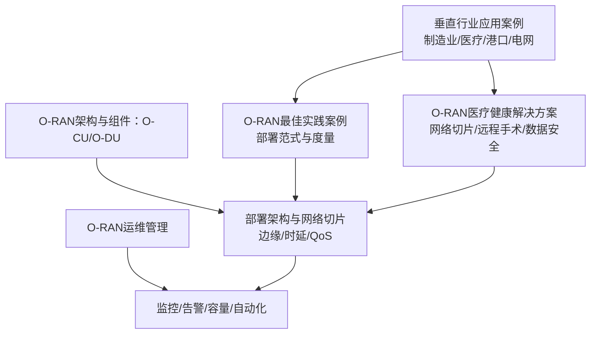
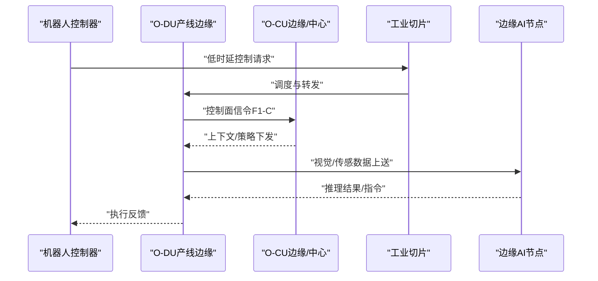
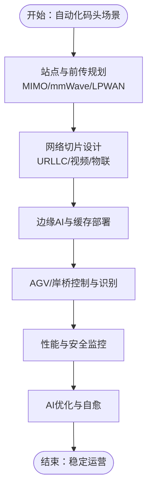
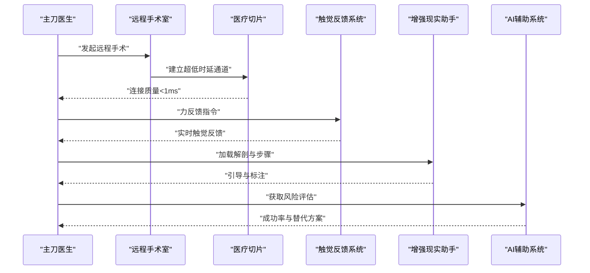
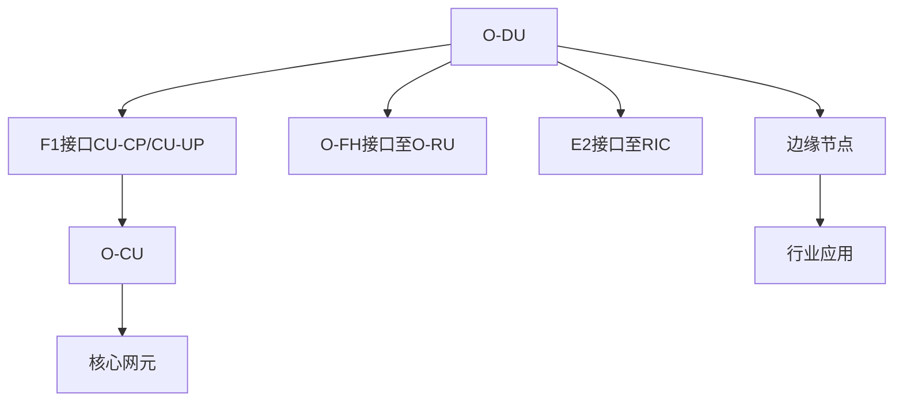

# 垂直行业应用案例

<cite>
**本文引用的文件**
- [垂直行业O-RAN应用案例](file://21-case-studies/industry-applications/vertical-industry-o-ran-cases.md)
- [O-RAN医疗健康解决方案](file://16-industry-solutions/healthcare/o-ran-healthcare-solutions.md)
- [O-RAN最佳实践案例](file://21-case-studies/best-practices/o-ran-best-practice-cases.md)
- [O-RAN运维管理](file://14-operations-management/readme-zh.md)
- [O-RAN架构与组件：O-CU](file://02-core-components/o-cu.md)
- [O-RAN架构与组件：O-DU](file://02-core-components/o-du.md)
- [O-RAN应用案例：制造业场景](file://10-application-scenarios/readme.md)
</cite>

## 目录
1. [引言](#引言)
2. [项目结构](#项目结构)
3. [核心组件](#核心组件)
4. [架构总览](#架构总览)
5. [详细组件分析](#详细组件分析)
6. [依赖关系分析](#依赖关系分析)
7. [性能考量](#性能考量)
8. [故障排查指南](#故障排查指南)
9. [结论](#结论)
10. [附录](#附录)

## 引言
本文件面向O-RAN在垂直行业的规模化落地，围绕智能制造工厂（工业4.0）、智慧港口物流（自动化码头）、智能电网监控（电力系统通信）、远程医疗系统（高速院际连接）四大场景，提供可复制的实践指导。内容涵盖行业特定需求、定制化方案设计、关键挑战与技术突破、性能与可靠性指标、安全性与成本效益分析，并给出部署架构、网络切片、边缘计算集成与智能化服务实现的参考模板与实施指南。

## 项目结构
本仓库提供了O-RAN在多行业应用的案例与最佳实践，以及核心网元（O-CU/O-DU）的架构与运维知识，形成“案例—架构—运维”的闭环支撑体系。



**图示来源**
- [垂直行业O-RAN应用案例](file://21-case-studies/industry-applications/vertical-industry-o-ran-cases.md#L1-L311)
- [O-RAN最佳实践案例](file://21-case-studies/best-practices/o-ran-best-practice-cases.md#L1-L210)
- [O-RAN医疗健康解决方案](file://16-industry-solutions/healthcare/o-ran-healthcare-solutions.md#L1-L484)
- [O-RAN架构与组件：O-CU](file://02-core-components/o-cu.md#L1-L419)
- [O-RAN架构与组件：O-DU](file://02-core-components/o-du.md#L1-L415)
- [O-RAN运维管理](file://14-operations-management/readme-zh.md#L1-L126)

**章节来源**
- [垂直行业O-RAN应用案例](file://21-case-studies/industry-applications/vertical-industry-o-ran-cases.md#L1-L311)
- [O-RAN最佳实践案例](file://21-case-studies/best-practices/o-ran-best-practice-cases.md#L1-L210)
- [O-RAN医疗健康解决方案](file://16-industry-solutions/healthcare/o-ran-healthcare-solutions.md#L1-L484)
- [O-RAN运维管理](file://14-operations-management/readme-zh.md#L1-L126)

## 核心组件
- O-CU（集中式单元）：负责控制面与用户面的分离处理，支持云化部署与弹性扩展，适配多业务QoS与网络切片。
- O-DU（分布式单元）：承担物理层与MAC层实时处理，强调低时延、高可靠与确定性转发，支撑URLLC与mMTC场景。
- 医疗健康解决方案：提供医疗专用网络切片、IoT设备接入与异常检测、远程手术的超低时延与安全通道。
- 运维管理：覆盖监控告警、性能优化、容量规划、自动化与生命周期管理，保障O-RAN在复杂行业场景下的稳定运行。

**章节来源**
- [O-RAN架构与组件：O-CU](file://02-core-components/o-cu.md#L1-L419)
- [O-RAN架构与组件：O-DU](file://02-core-components/o-du.md#L1-L415)
- [O-RAN医疗健康解决方案](file://16-industry-solutions/healthcare/o-ran-healthcare-solutions.md#L1-L484)
- [O-RAN运维管理](file://14-operations-management/readme-zh.md#L1-L126)

## 架构总览
O-RAN在垂直行业的典型部署采用“云化核心+边缘接入+网络切片+AI优化”的架构，结合行业特定的QoS与安全要求，实现确定性时延、高可靠与强隔离。

```mermaid
graph TB
subgraph "核心网"
CCU["O-CU控制面/用户面分离"]
AMF["AMF/NSSF等核心网元"]
NMS["网络与业务管理系统"]
end
subgraph "接入网"
ODU["O-DU物理/MAC层处理"]
ORU["O-RU射频拉远"]
FH["前传接口eCPRI/RoE"]
end
subgraph "边缘与业务"
EDGE["边缘计算节点"]
APP["行业应用制造/医疗/港口/电网"]
MON["监控与AI优化"]
end
subgraph "切片与安全"
SLICE["网络切片URLLC/mMTC/企业专网"]
SEC["零信任/加密/审计"]
end
APP --> SLICE
SLICE --> EDGE
EDGE --> ODU
ODU <- --> FH
ODU --> CCU
CCU --> AMF
MON --> CCU
MON --> ODU
SEC --> SLICE
SEC --> EDGE
```

**图示来源**
- [O-RAN架构与组件：O-CU](file://02-core-components/o-cu.md#L62-L121)
- [O-RAN架构与组件：O-DU](file://02-core-components/o-du.md#L68-L86)
- [O-RAN最佳实践案例](file://21-case-studies/best-practices/o-ran-best-practice-cases.md#L83-L96)

## 详细组件分析

### 智能制造工厂（工业4.0）
- 行业需求
  - 超低时延（<1ms）、超高可靠（99.999%）、确定性网络（TSN融合）、工业系统IT/OT融合。
  - 支持AGV/机器人协同、机器视觉质检、预测性维护与柔性产线重构。
- 方案设计
  - 网络切片：为机器人控制、视觉检测、设备维护分别划分切片，保障时延与可靠性。
  - 边缘计算：在产线侧部署边缘节点，就近处理视频与传感器数据，降低回传压力。
  - O-RAN部署：O-DU靠近O-RU，O-CU集中或边缘化部署，结合云化与微服务。
- 关键挑战与突破
  - 挑战：高密度小包、移动性与异构设备接入；突破：TSN与时隙调度、边缘AI与缓存优化。
- 性能与可靠性
  - 案例实测：端到端时延<0.5ms，覆盖率≥99.5%，峰值吞吐>20Gbps。
- 成本效益
  - 案例收益：OEE提升15%，废品率下降25%，年节省超千万欧元。
- 实施步骤
  - 需求与切片设计→站点与前传网络规划→O-DU/O-CU部署→边缘节点与应用对接→试运行与优化→全面推广。



**图示来源**
- [垂直行业O-RAN应用案例](file://21-case-studies/industry-applications/vertical-industry-o-ran-cases.md#L14-L48)
- [O-RAN架构与组件：O-DU](file://02-core-components/o-du.md#L51-L67)
- [O-RAN架构与组件：O-CU](file://02-core-components/o-cu.md#L49-L61)

**章节来源**
- [垂直行业O-RAN应用案例](file://21-case-studies/industry-applications/vertical-industry-o-ran-cases.md#L8-L54)
- [O-RAN应用案例：制造业场景](file://10-application-scenarios/readme.md#L391-L404)
- [O-RAN架构与组件：O-DU](file://02-core-components/o-du.md#L51-L67)
- [O-RAN架构与组件：O-CU](file://02-core-components/o-cu.md#L49-L61)

### 智慧港口物流（自动化码头）
- 行业需求
  - 高移动性（岸桥/场桥/AGV高速）、广域覆盖、高可靠、抗盐雾腐蚀。
  - 自动导引运输车（AGV）编队、远程控制岸桥、视觉识别与防撞。
- 方案设计
  - Massive MIMO广覆盖+mmWave高容量+LPWAN物联网；网络切片隔离高价值业务。
  - 边缘AI用于目标识别与路径规划，前传采用RoE/eCPRI。
- 关键挑战与突破
  - 挑战：移动性与多径衰落；突破：多波束跟踪、Doppler补偿、冗余回传。
- 性能与可靠性
  - 案例实测：吞吐提升45%，事故率下降80%，碳排放降低30%。
- 实施步骤
  - 港区勘测与频谱规划→站点与前传部署→O-RAN核心网元安装→边缘与应用联调→试运行与优化。



**图示来源**
- [垂直行业O-RAN应用案例](file://21-case-studies/industry-applications/vertical-industry-o-ran-cases.md#L161-L201)

**章节来源**
- [垂直行业O-RAN应用案例](file://21-case-studies/industry-applications/vertical-industry-o-ran-cases.md#L161-L201)

### 智能电网监控（电力系统通信）
- 行业需求
  - 高可靠性（99.97%以上）、广域覆盖、低功耗长距（LPWAN）、边缘控制与实时性。
  - 风电/光伏并网、负荷预测、故障定位与自动恢复。
- 方案设计
  - LPWAN+5G+卫星备份的全场景覆盖；边缘计算就近控制与预测。
  - 切片隔离：监控/控制/管理业务分区，保障关键控制面时延。
- 关键挑战与突破
  - 挑战：复杂电磁环境与极端天气；突破：抗干扰与冗余链路、边缘自治。
- 性能与可靠性
  - 案例实测：可再生能源占比提升60%，传输损耗下降15%，碳强度下降25%。
- 实施步骤
  - 电网拓扑与LPWAN覆盖→5G与卫星回传部署→边缘控制节点→切片与安全策略→联调与演练。


**图示来源**
- [垂直行业O-RAN应用案例](file://21-case-studies/industry-applications/vertical-industry-o-ran-cases.md#L239-L278)

**章节来源**
- [垂直行业O-RAN应用案例](file://21-case-studies/industry-applications/vertical-industry-o-ran-cases.md#L239-L278)

### 远程医疗系统（高速院际连接）
- 行业需求
  - 超低时延（<1ms）、超高可靠、端到端加密、HIPAA合规、医疗设备隔离。
  - 远程手术、远程会诊、危重患者监护、移动救护车通信。
- 方案设计
  - 医疗专用切片：紧急手术、连续监测、行政办公三层切片，差异化QoS。
  - 医疗IoT：统一接入与异常检测，紧急事件触发自动响应。
  - 远程手术：超低时延连接、触觉反馈、AR辅助与AI助手。
- 关键挑战与突破
  - 挑战：时延抖动与丢包控制、安全与隐私；突破：确定性转发、零信任与加密。
- 性能与可靠性
  - 案例实测：远程手术成功率99.8%，应急响应时间缩短70%，特检费用下降30%。
- 实施步骤
  - 医疗网络切片与安全策略→IoT接入与异常检测→远程手术通道→远程会诊与移动场景→持续优化与合规审计。



**图示来源**
- [O-RAN医疗健康解决方案](file://16-industry-solutions/healthcare/o-ran-healthcare-solutions.md#L277-L456)

**章节来源**
- [O-RAN医疗健康解决方案](file://16-industry-solutions/healthcare/o-ran-healthcare-solutions.md#L1-L484)

## 依赖关系分析
- 组件耦合
  - O-DU与O-CU通过F1接口耦合，O-FH连接O-DU与O-RU，E2接口连接RIC；三者协同决定时延与可靠性。
- 行业应用依赖
  - 制造业依赖确定性网络与边缘AI；港口依赖高移动性与广域覆盖；电网依赖广域与低功耗；医疗依赖安全与超低时延。
- 运维依赖
  - 监控与自动化贯穿部署、运行与优化全过程，支撑切片与边缘的弹性与韧性。



**图示来源**
- [O-RAN架构与组件：O-DU](file://02-core-components/o-du.md#L68-L86)
- [O-RAN架构与组件：O-CU](file://02-core-components/o-cu.md#L101-L121)

**章节来源**
- [O-RAN架构与组件：O-DU](file://02-core-components/o-du.md#L68-L86)
- [O-RAN架构与组件：O-CU](file://02-core-components/o-cu.md#L101-L121)

## 性能考量
- 时延与可靠性
  - URLLC场景：端到端<1ms，可用性99.999%；mMTC场景：海量连接与低功耗；eMBB场景：高吞吐与广覆盖。
- QoS与切片
  - 基于业务等级的差异化QoS参数（时延、抖动、丢包、带宽），按需切片隔离。
- 边缘与缓存
  - 将计算与存储下沉至边缘，结合缓存与本地转发，显著降低回传压力。
- 自动化与AI
  - 基于监控与历史数据的AI优化，实现自愈、容量预测与资源动态调度。

**章节来源**
- [O-RAN最佳实践案例](file://21-case-studies/best-practices/o-ran-best-practice-cases.md#L98-L103)
- [O-RAN运维管理](file://14-operations-management/readme-zh.md#L36-L57)

## 故障排查指南
- 快速定位
  - 告警分级与关联分析，结合日志与信令追踪，定位接口、资源与配置类故障。
- 恢复流程
  - 服务重启、配置回滚、资源扩容与接口修复；建立自动化处置与演练机制。
- 监控与优化
  - 实时监控处理延迟、吞吐量、误码率与资源利用率；设置阈值与智能告警，持续优化。

**章节来源**
- [O-RAN运维管理](file://14-operations-management/readme-zh.md#L22-L34)
- [O-RAN运维管理](file://14-operations-management/readme-zh.md#L225-L263)

## 结论
O-RAN在垂直行业的成功落地，需要以“网络切片+边缘计算+确定性时延+安全合规”为核心，结合行业业务特点进行定制化设计。通过最佳实践的部署范式、严谨的运维体系与持续的AI优化，可在智能制造、智慧港口、智能电网与远程医疗等领域实现显著的效率提升、成本节约与安全增强。

## 附录
- 参考模板
  - 制造业：确定性网络+边缘AI+TSN融合+切片隔离
  - 港口：广域覆盖+高移动性+边缘识别+冗余回传
  - 电网：LPWAN+5G+卫星备份+边缘控制+切片隔离
  - 医疗：超低时延+零信任+加密+IoT异常检测+远程手术通道
- 实施清单
  - 需求与场景梳理→切片与安全策略→站点与前传规划→核心网元与边缘部署→联调与演练→监控与优化→推广与迭代