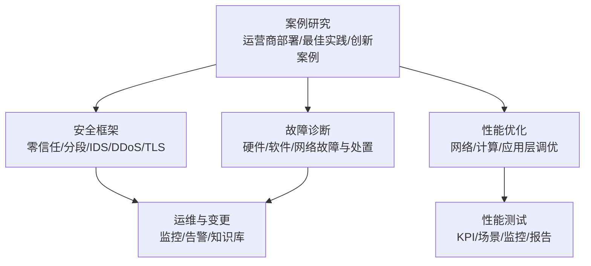
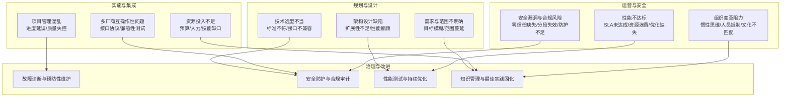
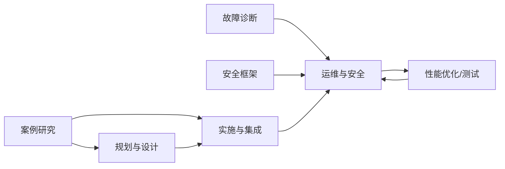

# 失败案例分析

<cite>
**本文引用的文件**
- [O-RAN 案例研究总览](file://21-case-studies/readme.md)
- [运营商 O-RAN 部署案例](file://21-case-studies/operator-cases/carrier-o-ran-deployment-cases.md)
- [最佳实践案例集合](file://21-case-studies/best-practices/o-ran-best-practice-cases.md)
- [O-RAN 故障诊断与排除](file://27-troubleshooting-diagnosis/readme-zh.md)
- [O-RAN 网络安全框架](file://12-security-privacy/network-security/network-security-framework-zh.md)
- [O-RAN 性能优化与调优](file://26-performance-optimization/readme-zh.md)
- [O-RAN 性能优化框架](file://14-operations-management/performance-optimization/performance-optimization-framework-zh.md)
- [O-RAN 性能测试](file://13-testing-validation/performance-testing/performance-testing-zh.md)
</cite>

## 目录
1. [简介](#简介)
2. [项目结构](#项目结构)
3. [核心组件](#核心组件)
4. [架构总览](#架构总览)
5. [详细组件分析](#详细组件分析)
6. [依赖分析](#依赖分析)
7. [性能考虑](#性能考虑)
8. [故障排查指南](#故障排查指南)
9. [结论](#结论)
10. [附录](#附录)

## 简介
本文件面向O-RAN项目的管理者与工程团队，系统梳理实施失败的典型技术与管理问题，并结合仓库中的成功案例、性能优化与安全框架，给出失败诊断、根因分析与改进措施。内容覆盖架构设计缺陷、多厂商互操作性、安全与合规风险、性能不达标等技术问题，以及需求不明确、资源不足、项目管理混乱、组织变革阻力等管理问题。通过失败教训总结、风险预警机制与预防措施，帮助项目规避常见陷阱，提升成功率。

## 项目结构
本仓库围绕O-RAN全生命周期的知识体系组织，其中与“失败案例分析”直接相关的内容主要分布在以下主题域：
- 案例研究：运营商部署、最佳实践、创新案例
- 故障诊断：硬件、软件、网络故障分类与处置流程
- 安全框架：零信任、网络分段、入侵检测、DDoS防护、TLS配置
- 性能优化：网络/计算/应用层优化、调优方法论、监控与测试
- 测试验证：性能测试场景、KPI与SLA、监控与分析

**章节来源**
- file://21-case-studies/readme.md#L1-L74
- file://27-troubleshooting-diagnosis/readme-zh.md#L1-L105
- file://12-security-privacy/network-security/network-security-framework-zh.md#L1-L473
- file://26-performance-optimization/readme-zh.md#L1-L67
- file://14-operations-management/performance-optimization/performance-optimization-framework-zh.md#L1-L342
- file://13-testing-validation/performance-testing/performance-testing-zh.md#L1-L327

## 核心组件
- 案例研究与最佳实践：提供可复用的成功模式与失败警示，支撑规划与实施阶段的风险识别与对策制定。
- 故障诊断与排除：提供系统性的故障分类、定位流程、工具与预防性维护，支撑运维阶段的快速恢复与稳定性保障。
- 安全框架：覆盖零信任、网络分段、入侵检测、DDoS缓解与安全通信协议，支撑安全与合规风险治理。
- 性能优化与测试：提供性能调优方法论、关键指标、测试场景与监控仪表板，支撑性能不达标问题的诊断与改进。

**章节来源**
- file://21-case-studies/readme.md#L42-L74
- file://27-troubleshooting-diagnosis/readme-zh.md#L26-L105
- file://12-security-privacy/network-security/network-security-framework-zh.md#L6-L473
- file://26-performance-optimization/readme-zh.md#L26-L67
- file://13-testing-validation/performance-testing/performance-testing-zh.md#L58-L327

## 架构总览
下图展示O-RAN项目从规划到运维的关键失败风险与对应治理手段，强调“技术—管理—安全—性能”的协同治理。

**图示来源**
- file://21-case-studies/readme.md#L42-L74
- file://27-troubleshooting-diagnosis/readme-zh.md#L26-L105
- file://12-security-privacy/network-security/network-security-framework-zh.md#L6-L473
- file://26-performance-optimization/readme-zh.md#L26-L67
- file://13-testing-validation/performance-testing/performance-testing-zh.md#L58-L327

## 详细组件分析

### 技术层面失败案例与根因
- 架构设计缺陷导致扩展性不足与性能瓶颈
  - 表现：部署后容量与延迟不达标、资源利用率低、扩容困难。
  - 根因：缺乏容量规划与可扩展性设计、网络/计算/应用层优化不足。
  - 对策：参考性能优化框架与测试验证方法，建立性能基线、瓶颈识别与持续优化闭环。
- 多厂商设备互操作性问题
  - 表现：接口协议异常、消息格式错误、互通测试失败。
  - 根因：接口标准理解偏差、兼容性测试不充分、缺少统一的集成验证流程。
  - 对策：借鉴最佳实践中的“多厂商集成测试与认证”流程，强化标准化接口与协议一致性。
- 安全漏洞与合规风险
  - 表现：安全策略阻断、攻击防护误判、DDoS影响业务连续性。
  - 根因：零信任与网络分段缺失、入侵检测与缓解策略不完善、TLS与密钥管理薄弱。
  - 对策：采用零信任与分段策略、部署IDS/IPS与DDoS缓解、完善TLS与访问控制。
- 性能不达标无法满足业务需求
  - 表现：吞吐量/时延/可靠性未达SLA，用户体验差。
  - 根因：缺少性能测试与基线、调优工具链不健全、缺少持续监控与预警。
  - 对策：建立性能测试场景与KPI体系，实施持续性能监控与回归测试。

**章节来源**
- file://21-case-studies/readme.md#L44-L54
- file://12-security-privacy/network-security/network-security-framework-zh.md#L6-L473
- file://26-performance-optimization/readme-zh.md#L26-L67
- file://13-testing-validation/performance-testing/performance-testing-zh.md#L29-L327

### 管理层面失败案例与根因
- 需求不明确导致目标模糊与范围蔓延
  - 表现：目标漂移、需求变更频繁、交付物偏离预期。
  - 根因：缺乏需求定义与验收标准、变更管理缺失。
  - 对策：参考最佳实践中的“需求定义—风险评估—分阶段实施”流程，建立清晰的KPI与里程碑。
- 资源投入不足导致预算短缺与人员配备不足
  - 表现：进度滞后、质量下降、运维压力大。
  - 根因：预算与资源规划不充分、技能缺口未提前识别。
  - 对策：在规划阶段进行资源与技能评估，建立预算与人员保障机制。
- 项目管理混乱导致进度延误与质量失控
  - 表现：里程碑延期、测试与验收不一致、问题积压。
  - 根因：缺乏科学的项目管理方法与质量控制流程。
  - 对策：采用敏捷与里程碑评审机制，强化质量门禁与变更控制。
- 组织变革阻力导致惯性思维与人员抵制
  - 表现：新技术采纳困难、流程重构受阻、知识共享不足。
  - 根因：缺乏变革领导力与文化引导。
  - 对策：建立变革管理与培训体系，推动知识库建设与最佳实践固化。

**章节来源**
- file://21-case-studies/readme.md#L50-L54
- file://21-case-studies/best-practices/o-ran-best-practice-cases.md#L132-L210

### 失败诊断与改进措施
- 失败诊断流程
  - 现象收集与影响评估 → 初步排查 → 深入分析 → 根因确定 → 解决方案 → 预防性措施
  - 结合故障分类（硬件/软件/网络）与工具箱（系统/网络/应用/专用工具），形成标准化处置模板。
- 改进措施
  - 技术：完善架构设计与性能基线、加强多厂商兼容性测试、强化安全防护与合规审计。
  - 管理：明确需求与范围、保障资源与技能、规范项目管理与变更控制、推动组织变革与知识管理。

**章节来源**
- file://27-troubleshooting-diagnosis/readme-zh.md#L26-L105
- file://21-case-studies/readme.md#L42-L74

### 风险预警机制与预防措施
- 风险预警机制
  - 建立性能监控与告警：吞吐量、延迟、资源利用率、错误率等关键指标的阈值与联动。
  - 安全事件告警：入侵检测、异常流量、策略误判等自动告警与处置流程。
  - 变更与发布风险：CI/CD流水线中的自动化测试与质量门禁。
- 预防措施
  - 规划阶段：需求与技术方案论证、风险评估与应对预案。
  - 实施阶段：分阶段部署、里程碑评审、标准化变更管理。
  - 运维阶段：持续优化、知识库与专家支持体系、定期演练与复盘。

**章节来源**
- file://13-testing-validation/performance-testing/performance-testing-zh.md#L244-L327
- file://12-security-privacy/network-security/network-security-framework-zh.md#L114-L426
- file://21-case-studies/best-practices/o-ran-best-practice-cases.md#L190-L210

### 纠正行动方案
- 技术纠偏
  - 性能：基于性能测试与监控，识别瓶颈并实施网络/计算/应用层优化；建立回归测试与基线对比。
  - 安全：完善零信任与分段策略，部署IDS/IPS与DDoS缓解，强化TLS与访问控制。
  - 互操作：完善接口协议一致性与兼容性测试，建立供应商评估与认证流程。
- 管理纠偏
  - 需求与范围：冻结需求基线，建立变更控制委员会与验收标准。
  - 资源与技能：补充预算与人员，开展针对性培训与外部引进。
  - 项目管理：引入里程碑评审与质量门禁，强化跨团队协作与透明沟通。
  - 组织变革：推动高层承诺与文化引导，建立知识共享与最佳实践固化机制。

**章节来源**
- file://13-testing-validation/performance-testing/performance-testing-zh.md#L58-L327
- file://12-security-privacy/network-security/network-security-framework-zh.md#L6-L473
- file://21-case-studies/best-practices/o-ran-best-practice-cases.md#L132-L210

## 依赖分析
- 案例研究为规划与实施提供依据，指导技术选型与风险识别。
- 故障诊断与安全框架为运维阶段提供工具与流程，降低故障影响与安全风险。
- 性能优化与测试为性能不达标问题提供系统化解决路径，支撑持续改进。
- 四者共同构成“规划—实施—运维—优化”的闭环，耦合度高、协同性强。

**图示来源**
- file://21-case-studies/readme.md#L1-L74
- file://27-troubleshooting-diagnosis/readme-zh.md#L1-L105
- file://12-security-privacy/network-security/network-security-framework-zh.md#L1-L473
- file://26-performance-optimization/readme-zh.md#L1-L67
- file://13-testing-validation/performance-testing/performance-testing-zh.md#L1-L327

## 性能考虑
- 性能基线与测试场景：建立峰值吞吐量、延迟、抖动、丢包等KPI，结合不同负载因子与扩展场景验证系统能力。
- 调优方法论：网络接口参数、内核TCP优化、NUMA感知绑定、CPU亲和性与调度器调优、容器资源限制与探针配置。
- 监控与仪表板：Prometheus/Grafana等工具链，构建实时性能监控与异常检测，支撑持续优化与容量规划。

**章节来源**
- file://26-performance-optimization/readme-zh.md#L26-L67
- file://14-operations-management/performance-optimization/performance-optimization-framework-zh.md#L1-L342
- file://13-testing-validation/performance-testing/performance-testing-zh.md#L29-L327

## 故障排查指南
- 故障分类：硬件、软件、网络三类故障，分别对应不同的排查重点与工具。
- 诊断流程：现象收集→影响评估→初步排查→深入分析→根因确定→解决方案→预防性维护。
- 工具与方法：系统诊断工具、网络诊断工具、应用诊断工具、专用诊断工具；定期检查、自动化监控、知识库与专家支持。

**章节来源**
- file://27-troubleshooting-diagnosis/readme-zh.md#L6-L105

## 结论
O-RAN项目失败往往源于技术与管理双重风险的叠加：架构设计缺陷、互操作性不足、安全与合规缺失、性能不达标，以及需求不明确、资源不足、项目管理混乱、组织变革阻力。通过借鉴成功案例的最佳实践，结合系统化的故障诊断、安全防护与性能优化体系，建立风险预警与预防机制，可显著提升项目成功率与运营质量。建议将“规划—实施—运维—优化”的闭环纳入组织能力，持续沉淀知识与经验，形成可复制、可推广的O-RAN治理范式。

## 附录
- 成功案例要点：分阶段部署、多厂商集成测试、自动化与监控、持续优化与知识管理。
- 失败警示要点：需求模糊、资源不足、管理混乱、安全与性能忽视、组织抵触。
- 风险清单：架构扩展性、接口兼容性、安全防护、性能SLA、预算与人员、项目流程、组织文化。

**章节来源**
- file://21-case-studies/operator-cases/carrier-o-ran-deployment-cases.md#L375-L401
- file://21-case-studies/best-practices/o-ran-best-practice-cases.md#L130-L210
- file://21-case-studies/readme.md#L26-L74