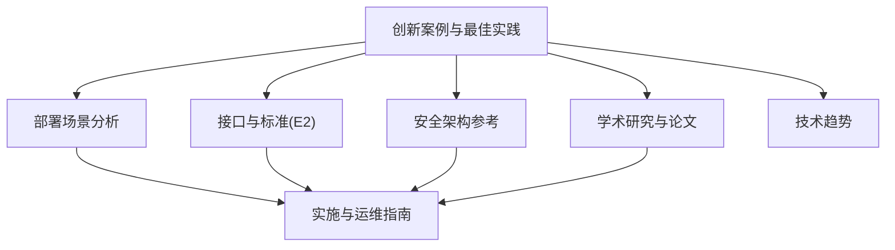
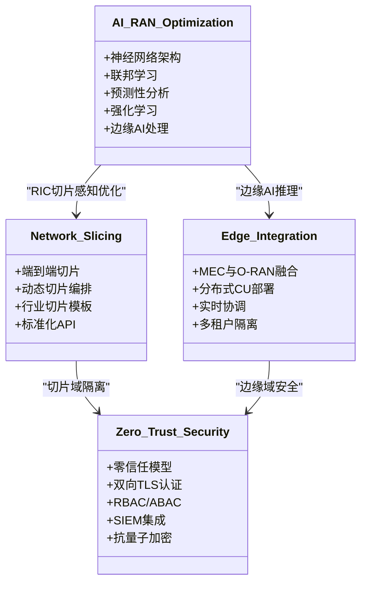
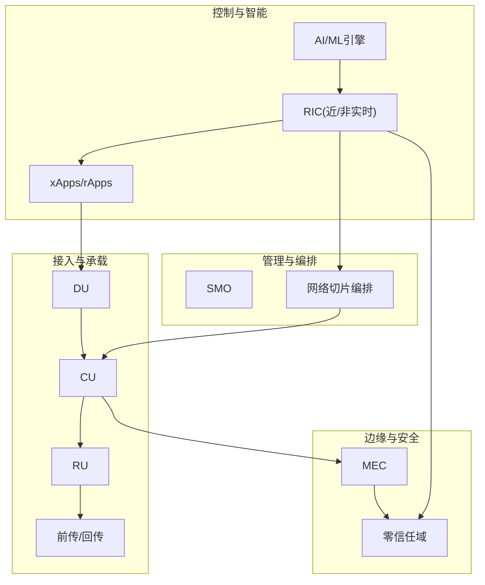
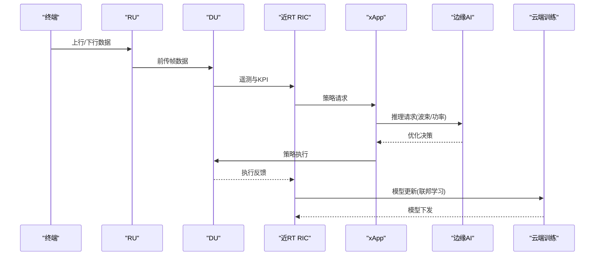
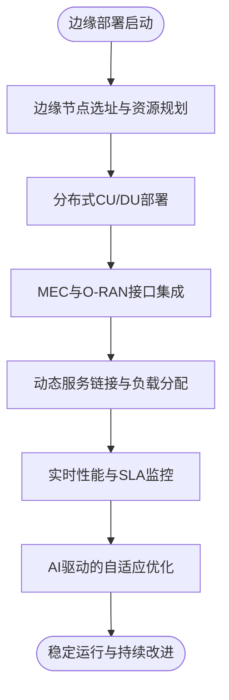
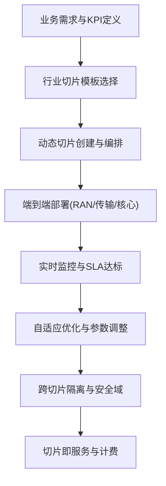
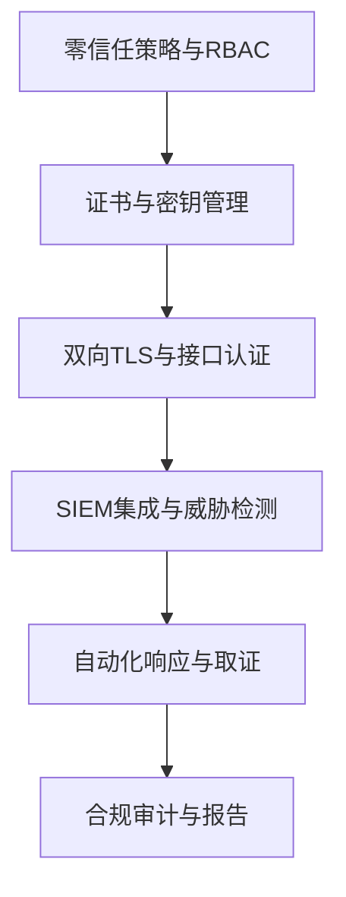
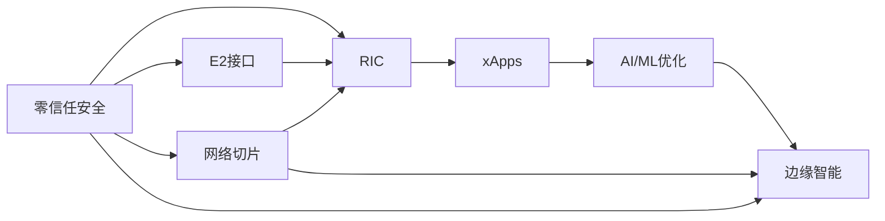

# 技术创新案例

<cite>
**本文引用的文件**
- [O-RAN 创新案例](file://21-case-studies/innovation-cases/o-ran-innovation-cases-zh.md)
- [O-RAN RIC 与 AI 论文](file://11-academic-papers/ric-ai/readme.md)
- [O-RAN 安全架构参考](file://12-security-privacy/security-architecture/security-reference-architecture-zh.md)
- [部署场景分析](file://04-disaggregation-options/deployment-scenarios.md)
- [O-RAN 最佳实践案例](file://21-case-studies/best-practices/o-ran-best-practice-cases-zh.md)
- [O-RAN 架构演进](file://01-architecture-system/architecture-evolution.md)
- [E2 接口](file://03-interface-standards/e2-interface.md)
- [O-RAN 技术发展趋势分析](file://15-future-development/technology-trends/technology-evolution-roadmap.md)
- [O-RAN 实施](file://08-deployment-implementation/readme.md)
</cite>

## 目录
1. [引言](#引言)
2. [项目结构](#项目结构)
3. [核心组件](#核心组件)
4. [架构总览](#架构总览)
5. [详细组件分析](#详细组件分析)
6. [依赖分析](#依赖分析)
7. [性能考量](#性能考量)
8. [故障排查指南](#故障排查指南)
9. [结论](#结论)
10. [附录](#附录)

## 引言
本文件面向O-RAN技术创新实践者，系统梳理并提炼AI驱动的网络优化、边缘智能部署、网络切片定制化服务、零信任安全等四大创新方向的理论基础、技术架构、实现路径、实验验证与规模化推广策略。通过对真实案例、学术研究、标准规范与最佳实践的交叉印证，形成可复制、可推广、可评估的创新方法论与实施蓝图，帮助读者在开放、智能、虚拟化的O-RAN生态中实现技术突破与商业价值。

## 项目结构
本仓库围绕O-RAN的架构演进、接口标准、部署实施、安全与隐私、测试验证、运维管理、未来趋势等多个维度构建知识体系。与技术创新案例直接相关的核心模块如下：
- 创新案例与最佳实践：展示AI/ML驱动优化、边缘计算融合、网络切片定制、零信任安全等突破性成果与可复制模式
- 学术论文与研究：聚焦RIC架构、xApps开发、AI/ML在RAN优化中的应用、预测性分析等前沿研究
- 安全架构参考：提供零信任模型、纵深防御、证书与密钥管理、SIEM集成、合规与审计等安全实现指南
- 部署场景分析：覆盖集中式、分布式、混合式、边缘与多云部署的适用条件、技术要求与优化策略
- 接口与标准：E2接口协议栈、服务模型、部署与运维要点，支撑RIC与CU/DU的智能协同
- 技术趋势：从5G到6G演进、AI原生架构、量子通信、新兴应用场景等未来方向

**图表来源**
- [O-RAN 创新案例](file://21-case-studies/innovation-cases/o-ran-innovation-cases-zh.md#L1-L322)
- [O-RAN RIC 与 AI 论文](file://11-academic-papers/ric-ai/readme.md#L1-L98)
- [O-RAN 安全架构参考](file://12-security-privacy/security-architecture/security-reference-architecture-zh.md#L1-L530)
- [部署场景分析](file://04-disaggregation-options/deployment-scenarios.md#L1-L563)
- [E2 接口](file://03-interface-standards/e2-interface.md#L1-L337)
- [O-RAN 技术发展趋势分析](file://15-future-development/technology-trends/technology-evolution-roadmap.md#L1-L68)
- [O-RAN 实施](file://08-deployment-implementation/readme.md#L1-L353)

**章节来源**
- [O-RAN 创新案例](file://21-case-studies/innovation-cases/o-ran-innovation-cases-zh.md#L1-L322)
- [O-RAN 实施](file://08-deployment-implementation/readme.md#L1-L353)

## 核心组件
本节从技术创新视角，提炼四大关键组件及其在O-RAN生态中的作用与协同关系：
- AI/ML驱动的网络优化（含边缘AI、联邦学习、预测性分析、强化学习）
- 边缘智能部署（MEC与O-RAN融合、分布式智能、低延迟应用）
- 网络切片定制化（端到端切片、动态编排、行业切片模板）
- 零信任安全（基于身份的持续认证、微分段、AI入侵检测、抗量子加密）

**图表来源**
- [O-RAN 创新案例](file://21-case-studies/innovation-cases/o-ran-innovation-cases-zh.md#L6-L188)
- [O-RAN RIC 与 AI 论文](file://11-academic-papers/ric-ai/readme.md#L14-L57)
- [O-RAN 安全架构参考](file://12-security-privacy/security-architecture/security-reference-architecture-zh.md#L8-L71)

**章节来源**
- [O-RAN 创新案例](file://21-case-studies/innovation-cases/o-ran-innovation-cases-zh.md#L6-L188)
- [O-RAN RIC 与 AI 论文](file://11-academic-papers/ric-ai/readme.md#L14-L57)
- [O-RAN 安全架构参考](file://12-security-privacy/security-architecture/security-reference-architecture-zh.md#L8-L71)

## 架构总览
下图展示四大创新在O-RAN整体架构中的位置与交互关系，强调“开放接口+智能控制+云原生+安全可信”的协同路径。

**图表来源**
- [O-RAN 架构演进](file://01-architecture-system/architecture-evolution.md#L41-L74)
- [E2 接口](file://03-interface-standards/e2-interface.md#L63-L90)
- [O-RAN 创新案例](file://21-case-studies/innovation-cases/o-ran-innovation-cases-zh.md#L6-L188)

**章节来源**
- [O-RAN 架构演进](file://01-architecture-system/architecture-evolution.md#L41-L74)
- [E2 接口](file://03-interface-standards/e2-interface.md#L63-L90)

## 详细组件分析

### AI/ML驱动的网络优化
- 技术原理
  - 深度强化学习用于资源分配与波束成形
  - 联邦学习实现分布式隐私保护优化
  - 预测性分析用于容量规划与故障预警
  - 异常检测提升网络安全鲁棒性
- 实现方法
  - 近端RT RIC与边缘AI协同，实现毫秒级闭环
  - 基于E2接口的xApps策略下发与反馈
  - 云侧模型训练与边缘侧推理的协同机制
- 应用效果
  - 频谱效率、能耗、延迟、容量利用率显著提升
  - 自愈能力与自动化运维水平大幅提升
- 推广价值
  - 降低运营成本、缩短服务上线时间、提升客户满意度
  - 为运营商提供差异化竞争能力

**图表来源**
- [O-RAN 创新案例](file://21-case-studies/innovation-cases/o-ran-innovation-cases-zh.md#L13-L26)
- [O-RAN RIC 与 AI 论文](file://11-academic-papers/ric-ai/readme.md#L14-L57)
- [E2 接口](file://03-interface-standards/e2-interface.md#L170-L189)

**章节来源**
- [O-RAN 创新案例](file://21-case-studies/innovation-cases/o-ran-innovation-cases-zh.md#L6-L58)
- [O-RAN RIC 与 AI 论文](file://11-academic-papers/ric-ai/readme.md#L14-L57)

### 边缘智能部署
- 技术原理
  - 将CU功能下沉至边缘，实现超低延迟与本地化处理
  - MEC与O-RAN融合，支持AR/VR、工业控制、自动驾驶等应用
  - 多租户隔离与动态服务链接
- 实现方法
  - 边缘节点的分布式CU/DU部署与协调
  - 基于E2接口的边缘与核心协同
  - 自动化编排与弹性伸缩
- 应用效果
  - 延迟降至亚毫秒级，吞吐量提升百倍，可靠性达99.999%
- 推广价值
  - 为垂直行业提供定制化低时延服务，加速数字化转型

**图表来源**
- [O-RAN 创新案例](file://21-case-studies/innovation-cases/o-ran-innovation-cases-zh.md#L60-L102)
- [部署场景分析](file://04-disaggregation-options/deployment-scenarios.md#L110-L161)

**章节来源**
- [O-RAN 创新案例](file://21-case-studies/innovation-cases/o-ran-innovation-cases-zh.md#L60-L102)
- [部署场景分析](file://04-disaggregation-options/deployment-scenarios.md#L110-L161)

### 网络切片定制化服务
- 技术原理
  - 端到端切片（RAN/传输/核心）统一编排
  - 面向行业的切片模板（制造、医疗、交通、娱乐）
  - 切片即服务（SaaS）模式与标准化API
- 实现方法
  - 切片感知的RIC与xApps开发
  - 动态创建、修改与隔离
  - 实时性能监控与调整
- 应用效果
  - 收入增长、客户留存、配置效率与差异化优势
- 推广价值
  - 为垂直行业提供可复制的网络能力即服务模式

**图表来源**
- [O-RAN 创新案例](file://21-case-studies/innovation-cases/o-ran-innovation-cases-zh.md#L103-L145)
- [O-RAN 实施](file://08-deployment-implementation/readme.md#L119-L125)

**章节来源**
- [O-RAN 创新案例](file://21-case-studies/innovation-cases/o-ran-innovation-cases-zh.md#L103-L145)
- [O-RAN 实施](file://08-deployment-implementation/readme.md#L119-L125)

### 零信任安全保护
- 技术原理
  - 永不信任、持续验证、最小权限、微分段
  - 双向TLS认证、RBAC/ABAC、加密与密钥管理
  - SIEM集成、威胁检测与自动化响应
  - 抗量子加密与区块链审计
- 实现方法
  - 安全域划分与访问控制策略
  - 证书与密钥生命周期管理
  - 安全监控与事件响应流程
- 应用效果
  - 威胁检测准确率99.7%，自动化响应亚秒级，合规100%
- 推广价值
  - 在开放性与互操作性前提下提供端到端安全，降低安全风险与合规成本

**图表来源**
- [O-RAN 安全架构参考](file://12-security-privacy/security-architecture/security-reference-architecture-zh.md#L8-L71)
- [O-RAN 安全架构参考](file://12-security-privacy/security-architecture/security-reference-architecture-zh.md#L247-L337)
- [O-RAN 安全架构参考](file://12-security-privacy/security-architecture/security-reference-architecture-zh.md#L486-L528)

**章节来源**
- [O-RAN 安全架构参考](file://12-security-privacy/security-architecture/security-reference-architecture-zh.md#L8-L71)
- [O-RAN 安全架构参考](file://12-security-privacy/security-architecture/security-reference-architecture-zh.md#L247-L337)
- [O-RAN 安全架构参考](file://12-security-privacy/security-architecture/security-reference-architecture-zh.md#L486-L528)

## 依赖分析
四大创新组件在O-RAN生态中存在紧密依赖关系：
- AI/ML优化依赖E2接口与xApps生态，支撑近实时闭环与策略执行
- 边缘智能依赖MEC与O-RAN融合，实现低延迟与本地化服务
- 网络切片依赖端到端编排与标准化API，实现跨域协同
- 零信任安全贯穿所有域，提供统一的认证、授权与监控

**图表来源**
- [E2 接口](file://03-interface-standards/e2-interface.md#L63-L90)
- [O-RAN 创新案例](file://21-case-studies/innovation-cases/o-ran-innovation-cases-zh.md#L6-L188)
- [O-RAN 安全架构参考](file://12-security-privacy/security-architecture/security-reference-architecture-zh.md#L8-L71)

**章节来源**
- [E2 接口](file://03-interface-standards/e2-interface.md#L63-L90)
- [O-RAN 创新案例](file://21-case-studies/innovation-cases/o-ran-innovation-cases-zh.md#L6-L188)
- [O-RAN 安全架构参考](file://12-security-privacy/security-architecture/security-reference-architecture-zh.md#L8-L71)

## 性能考量
- 低延迟与高可靠：近RT RIC与边缘部署需满足亚毫秒级响应与99.999%可用性
- 可扩展性与弹性：容器化与微服务架构支持按需扩缩容与跨域编排
- 能效与成本：AI优化与绿色设计降低能耗，自动化运维降低OPEX
- 安全与合规：零信任与加密策略在保障安全的同时不影响性能

[本节为通用性能讨论，无需列出具体文件来源]

## 故障排查指南
- 常见问题分类：接口故障（E2/A1/O1/O-FH/F1）、性能问题（延迟/吞吐/丢包）、可用性问题、配置冲突、多厂商兼容
- 排查流程：问题定义、信息收集（日志/指标/配置）、假设验证、根因分析（5 Why/Fishbone/故障树）、解决方案与验证
- 诊断工具：Wireshark/tcpdump、协议分析器、ELK/Splunk、Prometheus/Grafana、Ping/Traceroute/MTR
- 标准作业流程：故障响应、升级、沟通、复盘与知识库更新

**章节来源**
- [O-RAN 实施](file://08-deployment-implementation/readme.md#L126-L157)
- [O-RAN 实施](file://08-deployment-implementation/readme.md#L180-L196)

## 结论
四大创新方向在O-RAN生态中相辅相成：AI/ML驱动优化提供智能决策与自适应能力；边缘智能部署实现低时延与本地化服务；网络切片定制化满足垂直行业差异化需求；零信任安全在开放与互操作前提下提供端到端保护。通过标准化接口（如E2）、云原生架构与自动化运维体系，这些创新可实现从试点到规模化推广的稳健演进，并为企业创造显著的商业价值与竞争优势。

[本节为总结性内容，无需列出具体文件来源]

## 附录
- 研发过程与实验验证
  - 分阶段试点：概念验证→区域扩展→全国推广
  - 自动化测试与CI/CD：接口测试、功能测试、性能测试、互操作测试
  - 持续监控与优化：KPI/KQI监控、容量规划、成本优化
- 试点应用与规模化推广
  - 案例参考：德国电信、乐天移动、威瑞森、沃达丰等
  - 关键成功因素：高层支持、技术专长、厂商管理、变革管理、流程标准化、性能监控
- 评估标准与风险控制
  - 评估指标：部署效率、运营成本、能效、可用性、客户满意度
  - 风险控制：多厂商兼容、回退机制、安全审计、合规检查
- 知识产权保护与商业化路径
  - 知识产权：专利布局、开源贡献、标准参与
  - 商业化：切片即服务、平台化运营、生态合作

**章节来源**
- [O-RAN 最佳实践案例](file://21-case-studies/best-practices/o-ran-best-practice-cases-zh.md#L6-L130)
- [O-RAN 实施](file://08-deployment-implementation/readme.md#L197-L250)
- [O-RAN 技术发展趋势分析](file://15-future-development/technology-trends/technology-evolution-roadmap.md#L1-L68)