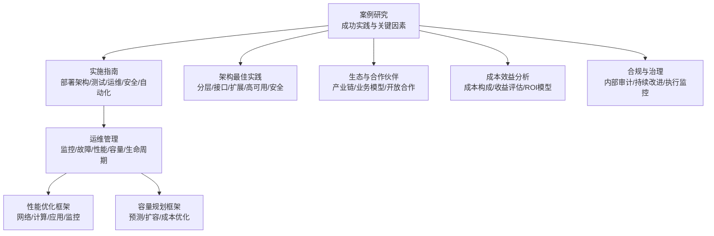
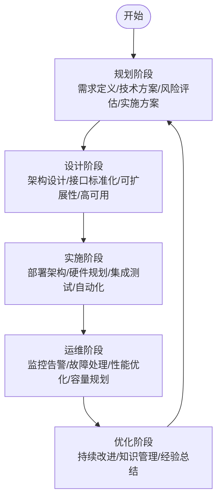
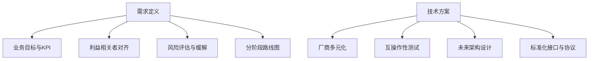
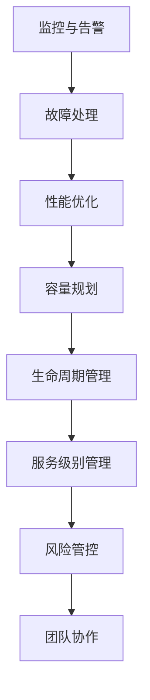
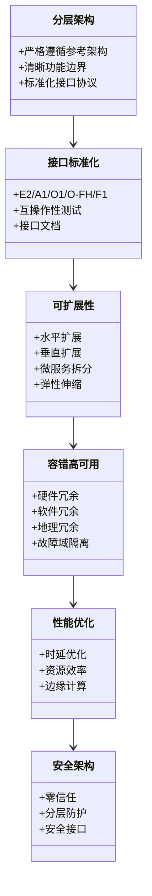
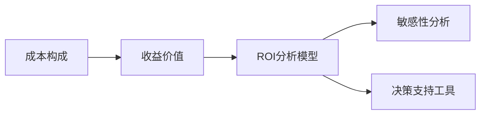
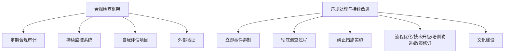
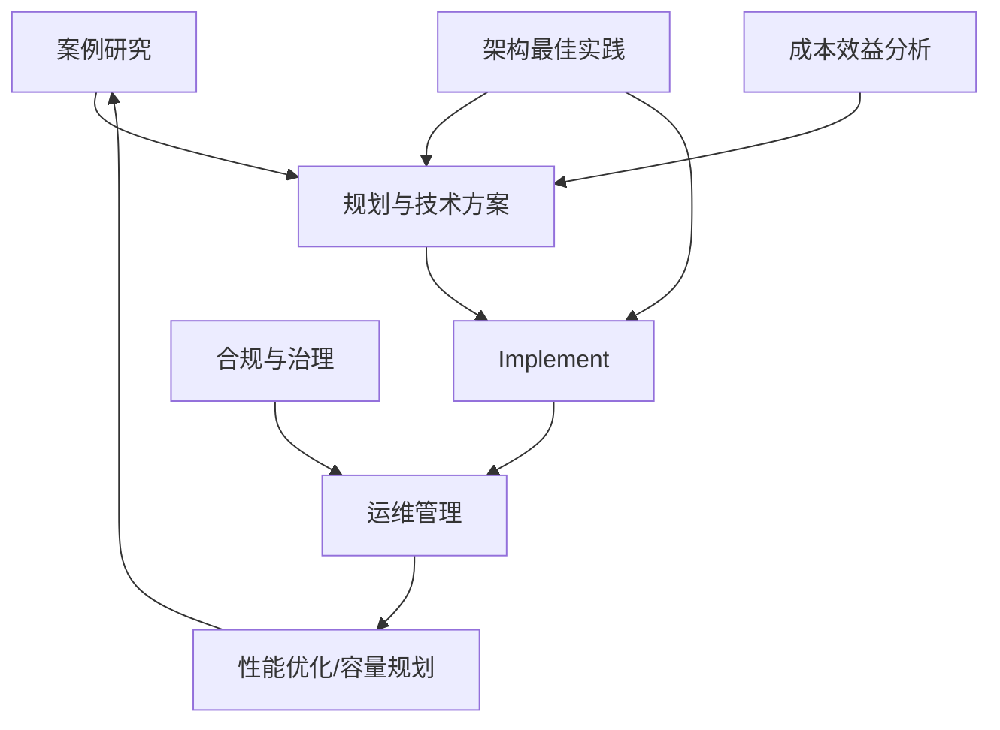
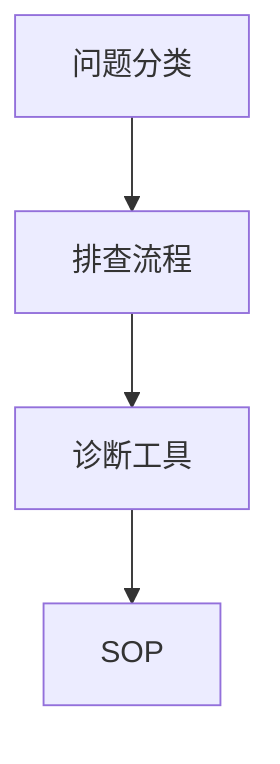

# O-RAN最佳实践

<cite>
**本文引用的文件**
- [O-RAN最佳实践案例](file://21-case-studies/best-practices/o-ran-best-practice-cases.md)
- [O-RAN最佳实践案例（中文）](file://21-case-studies/best-practices/o-ran-best-practice-cases-zh.md)
- [O-RAN实施](file://08-deployment-implementation/readme.md)
- [O-RAN运维管理](file://14-operations-management/readme.md)
- [O-RAN运维管理（中文）](file://14-operations-management/readme-zh.md)
- [O-RAN架构设计最佳实践](file://30-best-practices/architecture-practices/architecture-design-best-practices.md)
- [O-RAN生态系统与合作伙伴](file://20-ecosystem-partnership/readme.md)
- [O-RAN成本效益分析](file://18-cost-benefit-analysis/readme.md)
- [O-RAN性能优化框架](file://14-operations-management/performance-optimization/performance-optimization-framework.md)
- [O-RAN容量规划框架](file://14-operations-management/capacity-planning/capacity-planning-framework.md)
- [O-RAN合规管理](file://25-legal-regulations/compliance-system/o-ran-compliance-management.md)
- [O-RAN合规实施指南](file://25-legal-regulations/implementation-guides/o-ran-compliance-implementation.md)
</cite>

## 目录
1. [引言](#引言)
2. [项目结构](#项目结构)
3. [核心组件](#核心组件)
4. [架构总览](#架构总览)
5. [详细组件分析](#详细组件分析)
6. [依赖关系分析](#依赖关系分析)
7. [性能考量](#性能考量)
8. [故障排查指南](#故障排查指南)
9. [结论](#结论)
10. [附录](#附录)

## 引言
本文件面向O-RAN部署与运维的实践者，系统梳理成功案例、实施方法与最佳实践，围绕“规划—实施—运维—优化”的全生命周期，给出可复制、可落地的方法论与检查清单，帮助读者在真实环境中高效推进O-RAN项目，实现业务价值与技术优势的双重提升。

## 项目结构
该仓库以主题域划分，形成覆盖“规划、设计、实施、运维、优化、合规、成本”等维度的知识体系。其中与最佳实践直接相关的内容集中在以下模块：
- 案例研究：汇集运营商与产业伙伴的成功实践，提炼共性模式与关键成功因素
- 实施指南：涵盖部署架构、硬件与基础设施、集成测试、运维体系、故障排查、安全与自动化
- 运维管理：日常运维、监控告警、故障处理、性能优化、容量规划、生命周期管理
- 架构最佳实践：分层架构、接口标准化、可扩展性、容错与高可用、性能优化、安全架构
- 生态与成本：产业生态、合作伙伴类型、商业模式、成本构成与ROI分析
- 合规与治理：合规体系、监督与监控、持续改进

**图表来源**
- [O-RAN最佳实践案例](file://21-case-studies/best-practices/o-ran-best-practice-cases.md#L1-L210)
- [O-RAN实施](file://08-deployment-implementation/readme.md#L1-L353)
- [O-RAN运维管理](file://14-operations-management/readme.md#L1-L126)
- [O-RAN性能优化框架](file://14-operations-management/performance-optimization/performance-optimization-framework.md#L1-L650)
- [O-RAN容量规划框架](file://14-operations-management/capacity-planning/capacity-planning-framework.md#L1-L505)
- [O-RAN架构设计最佳实践](file://30-best-practices/architecture-practices/architecture-design-best-practices.md#L1-L300)
- [O-RAN生态系统与合作伙伴](file://20-ecosystem-partnership/readme.md#L1-L64)
- [O-RAN成本效益分析](file://18-cost-benefit-analysis/readme.md#L1-L62)
- [O-RAN合规管理](file://25-legal-regulations/compliance-system/o-ran-compliance-management.md#L131-L260)

**章节来源**
- [O-RAN最佳实践案例](file://21-case-studies/best-practices/o-ran-best-practice-cases.md#L1-L210)
- [O-RAN实施](file://08-deployment-implementation/readme.md#L1-L353)

## 核心组件
- 规划与需求定义：明确业务目标、KPI、风险评估与分阶段路线图
- 技术选型与架构设计：分层架构、标准化接口、可扩展与高可用设计
- 实施与测试：部署架构设计、硬件与基础设施规划、集成测试策略、自动化与运维体系
- 运维与优化：监控告警、故障处理、性能优化、容量规划、生命周期管理
- 成本与收益：成本构成、直接与间接收益、ROI模型与敏感性分析
- 合规与治理：内部审计、持续改进、执行监控与违规处理

**章节来源**
- [O-RAN最佳实践案例](file://21-case-studies/best-practices/o-ran-best-practice-cases.md#L134-L177)
- [O-RAN实施](file://08-deployment-implementation/readme.md#L8-L125)
- [O-RAN运维管理](file://14-operations-management/readme.md#L6-L126)
- [O-RAN成本效益分析](file://18-cost-benefit-analysis/readme.md#L6-L62)

## 架构总览
下图展示了从“规划—实施—运维—优化”的闭环实践路径，以及各环节的关键抓手与协同关系。

**图表来源**
- [O-RAN最佳实践案例](file://21-case-studies/best-practices/o-ran-best-practice-cases.md#L134-L177)
- [O-RAN实施](file://08-deployment-implementation/readme.md#L8-L125)
- [O-RAN运维管理](file://14-operations-management/readme.md#L6-L126)

## 详细组件分析

### 规划阶段：需求定义与技术方案论证
- 需求定义：明确业务目标与KPI、利益相关者对齐、风险评估与缓解计划、分阶段实施路线图
- 技术方案：厂商多元化以确保真正开放、互操作性测试、面向未来的架构设计、标准化接口与协议
- 关键成功因素矩阵：高管支持、技术专长、厂商管理、变革管理、流程标准化、性能监控

**图表来源**
- [O-RAN最佳实践案例](file://21-case-studies/best-practices/o-ran-best-practice-cases.md#L134-L147)

**章节来源**
- [O-RAN最佳实践案例](file://21-case-studies/best-practices/o-ran-best-practice-cases.md#L134-L147)

### 实施阶段：部署架构与测试体系
- 部署架构设计：集中式、分布式、混合式、边缘式、多云部署策略
- 硬件与基础设施：服务器规格、网络基础设施、存储架构、电源与冷却
- 集成测试：接口测试、功能测试、性能测试、互操作性测试、回归测试与CI/CD
- 运维体系：监控系统、故障管理、性能管理、配置管理、容量管理
- 故障排查：问题分类、排查流程、诊断工具、根因分析、SOP
- 安全实现：网络安全、接口安全、系统安全、安全监控
- 自动化与编排：基础设施即代码、自动化部署、自动化运维、编排工具

**图表来源**
- [O-RAN实施](file://08-deployment-implementation/readme.md#L8-L125)

**章节来源**
- [O-RAN实施](file://08-deployment-implementation/readme.md#L8-L125)

### 运维阶段：监控、优化与容量规划
- 监控与告警：实时监控、关键指标阈值、异常检测、告警分级与通知、根因分析
- 故障处理：快速定位、应急响应、恢复最佳实践、事后分析与改进、知识库建设
- 自动化运维：Ansible、Kubernetes、CI/CD、IaC、无人值守
- 性能优化：网络层优化、计算层优化、应用层调优、监控工具链
- 容量规划：负载预测、扩展性设计、成本优化、容量基准与扩容时机
- 生命周期管理：设计、部署、运行、维护、退役；配置版本控制、环境一致性、变更影响评估、回退机制；文档维护与知识传承
- 服务级别管理：SLA指标定义、服务质量监控、性能基线、服务改进计划、客户满意度管理
- 风险管控：风险识别、评估方法、缓解措施、应急预案、业务连续性保障
- 团队协作：组织架构、技能矩阵、知识分享、跨部门协作、持续学习文化

**图表来源**
- [O-RAN运维管理](file://14-operations-management/readme.md#L6-L126)

**章节来源**
- [O-RAN运维管理](file://14-operations-management/readme.md#L6-L126)

### 架构设计最佳实践
- 分层架构：严格遵循参考架构、清晰的功能边界、标准化接口协议
- 接口标准化：E2/A1/O1/O-FH/F1接口规范与兼容性保障
- 可扩展性：水平扩展与垂直扩展策略、微服务拆分、资源弹性伸缩
- 容错与高可用：硬件/软件/地理冗余、故障域划分、熔断与舱壁隔离
- 性能优化：时延敏感设计（DPDK/SR-IOV/FPGA/内核旁路）、资源效率（NUMA感知、大页内存、QoS）
- 安全架构：零信任模型、分层防护、安全接口设计（认证/授权/数据保护/访问控制）
- 架构演进：技术前瞻性（6G/AI/区块链/数字孪生）、可维护性（模块化/文档/可测试性）

**图表来源**
- [O-RAN架构设计最佳实践](file://30-best-practices/architecture-practices/architecture-design-best-practices.md#L6-L300)

**章节来源**
- [O-RAN架构设计最佳实践](file://30-best-practices/architecture-practices/architecture-design-best-practices.md#L6-L300)

### 成本与收益：ROI与决策支持
- 成本构成：硬件设备、软件许可、集成服务、培训认证、基础设施
- 运维成本：人工、软件维护、硬件维护、能耗、管理费用
- 直接收益：CAPEX降低、OPEX优化、灵活性增强、创新加速
- 间接收益：竞争优势、运营效率、客户体验、生态价值
- ROI模型：NPV、IRR、回收期、BCR；敏感性分析、风险量化、实施优先级排序

**图表来源**
- [O-RAN成本效益分析](file://18-cost-benefit-analysis/readme.md#L6-L62)

**章节来源**
- [O-RAN成本效益分析](file://18-cost-benefit-analysis/readme.md#L6-L62)

### 合规与治理：持续改进与执行监控
- 内部审计：审计计划与范围、现场工作、报告与沟通、质量保证
- 持续改进：关键绩效指标、仪表板与报告、基准对比、改进目标设定、利益相关者反馈
- 执行监控：定期合规审计、持续监控系统、自我评估、外部验证
- 违规处理与增强：事件遏制、彻底调查、纪律处分、纠正措施、流程优化、技术升级、培训改进、政策修订、文化建设

**图表来源**
- [O-RAN合规管理](file://25-legal-regulations/compliance-system/o-ran-compliance-management.md#L131-L260)
- [O-RAN合规实施指南](file://25-legal-regulations/implementation-guides/o-ran-compliance-implementation.md#L302-L327)

**章节来源**
- [O-RAN合规管理](file://25-legal-regulations/compliance-system/o-ran-compliance-management.md#L131-L260)
- [O-RAN合规实施指南](file://25-legal-regulations/implementation-guides/o-ran-compliance-implementation.md#L302-L327)

## 依赖关系分析
- 案例研究为规划与实施提供实证依据，驱动技术方案与风险评估
- 实施指南承接案例研究，细化部署架构、测试与运维体系
- 运维管理在实施完成后进入常态化运行，支撑性能优化与容量规划
- 架构最佳实践贯穿全生命周期，确保设计与实现的一致性
- 成本与收益分析为决策提供量化支撑，指导资源投入与优先级
- 合规与治理保障项目在受控轨道运行，促进持续改进

**图表来源**
- [O-RAN最佳实践案例](file://21-case-studies/best-practices/o-ran-best-practice-cases.md#L134-L177)
- [O-RAN实施](file://08-deployment-implementation/readme.md#L8-L125)
- [O-RAN运维管理](file://14-operations-management/readme.md#L6-L126)
- [O-RAN架构设计最佳实践](file://30-best-practices/architecture-practices/architecture-design-best-practices.md#L6-L300)
- [O-RAN成本效益分析](file://18-cost-benefit-analysis/readme.md#L6-L62)
- [O-RAN合规管理](file://25-legal-regulations/compliance-system/o-ran-compliance-management.md#L131-L260)

**章节来源**
- [O-RAN最佳实践案例](file://21-case-studies/best-practices/o-ran-best-practice-cases.md#L134-L177)
- [O-RAN实施](file://08-deployment-implementation/readme.md#L8-L125)
- [O-RAN运维管理](file://14-operations-management/readme.md#L6-L126)

## 性能考量
- 网络性能优化：接口调优、内核参数、NUMA感知绑定、优先队列与流量控制
- 计算性能优化：CPU亲和性与调度、内核调度器调优、进程优先级、NUMA内存绑定
- 应用层优化：容器资源请求/限制、垃圾回收与并发参数、健康探针与就绪探测
- 监控与自动调优：性能仪表板、趋势分析、自动化调优与报告生成

**图表来源**
- [O-RAN性能优化框架](file://14-operations-management/performance-optimization/performance-optimization-framework.md#L6-L650)

**章节来源**
- [O-RAN性能优化框架](file://14-operations-management/performance-optimization/performance-optimization-framework.md#L6-L650)

## 故障排查指南
- 问题分类：接口故障、性能问题、可用性问题、配置问题、兼容性问题
- 排查流程：问题定义与范围界定、信息收集（日志/指标/配置）、假设形成与验证、根因分析（5Why/鱼骨图/故障树/时间线/关联分析）、解决方案实施与验证
- 诊断工具：网络分析器、协议分析器、日志分析、性能分析、网络监控工具
- SOP：故障响应、升级流程、沟通流程、复盘流程、知识库更新

**图表来源**
- [O-RAN实施](file://08-deployment-implementation/readme.md#L126-L157)

**章节来源**
- [O-RAN实施](file://08-deployment-implementation/readme.md#L126-L157)

## 结论
成功的O-RAN部署需要“规划—实施—运维—优化”的系统化方法论。通过借鉴成功案例、遵循架构最佳实践、建立完善的测试与运维体系、持续开展性能优化与容量规划，并辅以成本效益分析与合规治理，能够有效降低项目风险、提升交付质量与运营效率，最终实现业务价值与技术优势的双重提升。

## 附录

### 实施步骤与检查清单
- 规划阶段
  - 明确业务目标与KPI，完成利益相关者对齐
  - 进行技术方案论证与风险评估，制定分阶段路线图
  - 评估厂商选择与互操作性测试能力
- 实施阶段
  - 设计部署架构（集中/分布式/边缘/多云），完成硬件与基础设施规划
  - 制定集成测试计划（接口/功能/性能/互操作/回归），建立CI/CD
  - 建立监控告警、故障处理、性能管理、配置管理、容量管理
  - 实施安全加固与自动化运维
- 运维阶段
  - 持续监控与告警，快速故障定位与恢复
  - 基于指标的性能优化与容量规划
  - 建立知识库与经验总结机制
- 优化阶段
  - 基于AI/ML的持续优化与创新
  - 成本优化与生态建设

### 评估标准
- 规划评估：目标达成度、风险可控性、路线图可行性
- 实施评估：测试覆盖率、自动化程度、交付质量与进度
- 运维评估：MTTR/MTBF、SLA达标率、故障恢复效率
- 优化评估：性能指标改善、成本节约、用户体验提升
- 合规评估：审计发现整改率、持续改进成效、违规事件数