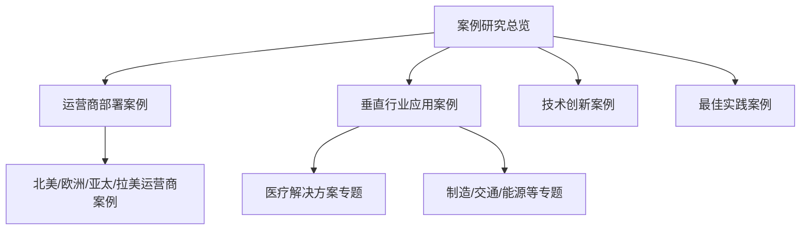
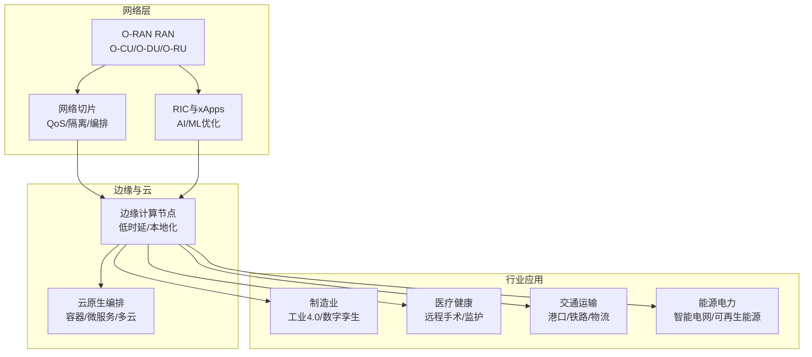
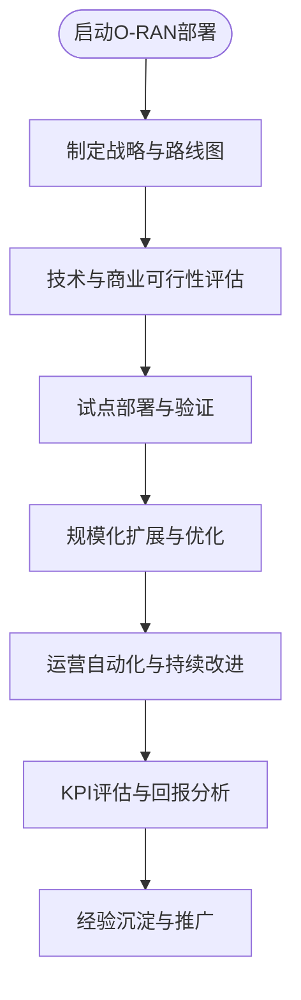
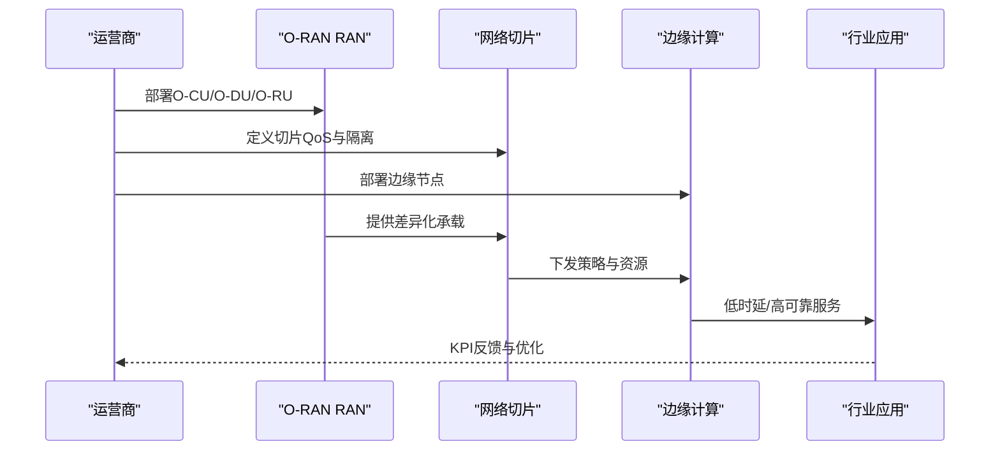
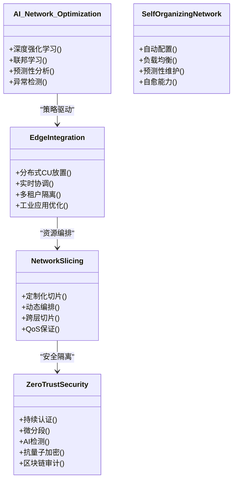
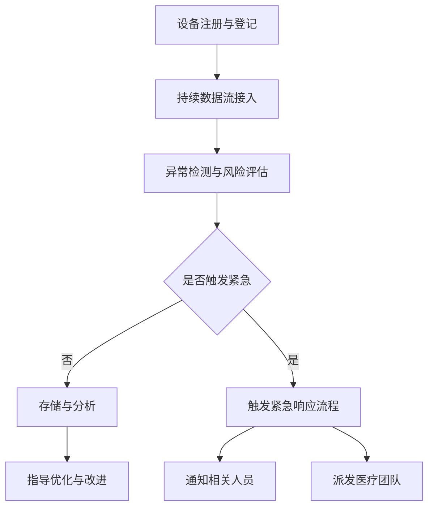
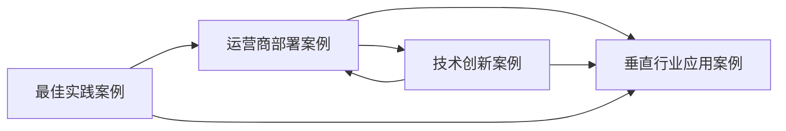

# 案例研究

<cite>
**本文引用的文件**
- [O-RAN 创新案例（中文）](file://21-case-studies/innovation-cases/o-ran-innovation-cases-zh.md)
- [O-RAN 最佳实践案例（中文）](file://21-case-studies/best-practices/o-ran-best-practice-cases-zh.md)
- [运营商O-RAN部署案例（英文）](file://21-case-studies/operator-cases/carrier-o-ran-deployment-cases.md)
- [垂直行业O-RAN应用（英文）](file://21-case-studies/industry-applications/vertical-industry-o-ran-cases.md)
- [O-RAN 医疗解决方案（中文）](file://16-industry-solutions/healthcare/o-ran-healthcare-solutions-zh.md)
- [O-RAN 行业解决方案概览（中文）](file://16-industry-solutions/readme.md)
</cite>

## 目录
1. [引言](#引言)
2. [项目结构](#项目结构)
3. [核心组件](#核心组件)
4. [架构总览](#架构总览)
5. [详细组件分析](#详细组件分析)
6. [依赖分析](#依赖分析)
7. [性能考量](#性能考量)
8. [故障排查指南](#故障排查指南)
9. [结论](#结论)
10. [附录](#附录)

## 引言
本文件面向O-RAN案例研究的实践指导，围绕三大主题展开：运营商部署案例、垂直行业应用案例、技术创新案例，并结合最佳实践与方法论，形成可复制、可推广的知识体系。内容来源于仓库中的案例研究与行业解决方案文档，旨在帮助读者系统理解O-RAN在不同场景下的落地路径、技术选型、实施过程与效果评估方法。

## 项目结构
本仓库围绕O-RAN的架构、组件、接口、部署、标准、应用、生态、测试、运维、未来趋势等维度构建了完整的知识体系。与案例研究直接相关的主要目录如下：
- 21-case-studies：包含运营商案例、垂直行业应用案例、创新案例与最佳实践案例
- 16-industry-solutions：面向制造、能源、交通、医疗、教育等行业的解决方案概览与医疗专题
- 其他相关主题：如测试验证、运维管理、安全隐私、性能优化等，为案例研究提供方法论与工具支撑

## 核心组件
- 运营商部署案例：覆盖绿地建设、混合部署、标准统一、规模化扩展、区域协同等路径，强调战略规划、技术选型、厂商管理与运营优化。
- 垂直行业应用案例：聚焦制造（工业4.0）、医疗（远程手术、远程监护）、交通（港口自动化、铁路5G）、能源（智能电网）等，突出网络切片、边缘计算、时延与可靠性保障。
- 技术创新案例：涵盖AI/ML驱动的网络优化、自组织网络、边缘计算集成、网络切片创新、零信任安全、6G前瞻技术等，强调跨技术融合与未来演进。
- 最佳实践案例：总结成功模式、关键成功因素、实施路线图与经验教训，提供可操作的参考框架。

章节来源
- file://21-case-studies/operator-cases/carrier-o-ran-deployment-cases.md#L1-L401
- file://21-case-studies/industry-applications/vertical-industry-o-ran-cases.md#L1-L311
- file://21-case-studies/innovation-cases/o-ran-innovation-cases-zh.md#L1-L322
- file://21-case-studies/best-practices/o-ran-best-practice-cases-zh.md#L1-L210
- file://16-industry-solutions/healthcare/o-ran-healthcare-solutions-zh.md#L1-L484
- file://16-industry-solutions/readme.md#L1-L58

## 架构总览
以下图示化展示O-RAN在不同场景中的应用架构要点：网络切片、边缘计算、AI优化、安全隔离与跨域编排。

图表来源
- [运营商O-RAN部署案例（英文）](file://21-case-studies/operator-cases/carrier-o-ran-deployment-cases.md#L1-L401)
- [垂直行业O-RAN应用（英文）](file://21-case-studies/industry-applications/vertical-industry-o-ran-cases.md#L1-L311)
- [O-RAN 创新案例（中文）](file://21-case-studies/innovation-cases/o-ran-innovation-cases-zh.md#L1-L322)
- [O-RAN 医疗解决方案（中文）](file://16-industry-solutions/healthcare/o-ran-healthcare-solutions-zh.md#L1-L484)

## 详细组件分析

### 运营商部署案例分析
- 北美：Dish Network从零开始的云原生O-RAN 5G网络；T-Mobile在既有网络中集成O-RAN，侧重农村覆盖与效率提升。
- 欧洲：Vodafone多国统一部署与本地适配；Orange法国在RIC与xApp方面实现技术领先。
- 亚太：Rakuten Mobile端到端云原生网络；Reliance Jio在复杂地理与人口条件下实现大规模部署。
- 拉丁美洲：América Móvil区域化协调部署，兼顾监管与本地化。
- 成功要素：清晰愿景与目标、干系人对齐、分阶段实施、风险管控、标准合规、互操作性测试、性能基线、安全集成、组织变革与能力建设、供应商管理、实时监控与优化、持续改进与创新生态。

章节来源
- file://21-case-studies/operator-cases/carrier-o-ran-deployment-cases.md#L1-L401
- file://21-case-studies/best-practices/o-ran-best-practice-cases-zh.md#L130-L210

### 垂直行业应用案例分析
- 制造业：宝马工厂的私有5G网络，强调超低时延、高可靠、边缘AI与TSN集成；西门子多厂标准化部署与数字孪生。
- 医疗健康：梅奥诊所远程手术网络，强调亚毫秒级时延、零信任安全与HIPAA合规；NHS英格兰5G测试床。
- 交通运输：鹿特丹港自动化码头与德铁5G网络，强调高移动性、手摇优化与乘客服务。
- 能源电力：国家电网智能电网，强调LPWAN、边缘控制与可再生能源集成。
- 成功要素：标准合规、多厂商互操作、安全体系、可扩展架构、分阶段部署、实时监控、知识转移与持续改进。

图表来源
- [垂直行业O-RAN应用（英文）](file://21-case-studies/industry-applications/vertical-industry-o-ran-cases.md#L1-L311)
- [O-RAN 医疗解决方案（中文）](file://16-industry-solutions/healthcare/o-ran-healthcare-solutions-zh.md#L1-L484)

章节来源
- file://21-case-studies/industry-applications/vertical-industry-o-ran-cases.md#L1-L311
- file://16-industry-solutions/readme.md#L1-L58

### 技术创新案例分析
- AI/ML驱动的网络优化：深度强化学习、联邦学习、预测性分析、异常检测。
- 自组织网络：自动配置、参数优化、负载均衡、干扰管理、预测性故障检测与自愈。
- 边缘计算集成：分布式CU放置、RAN与边缘实时协调、多租户隔离、工业物联网与AR/VR优化。
- 网络切片创新：面向制造、医疗、交通、娱乐的定制化切片，动态编排与跨层切片。
- 安全创新：零信任架构、持续认证、设备证明、AI入侵检测、抗量子加密、区块链审计。
- 未来技术：6G研究网络、太赫兹通信、卫星-RAN融合、扩展现实与科学应用。

图表来源
- [O-RAN 创新案例（中文）](file://21-case-studies/innovation-cases/o-ran-innovation-cases-zh.md#L1-L322)

章节来源
- file://21-case-studies/innovation-cases/o-ran-innovation-cases-zh.md#L1-L322

### 医疗健康专题分析
- 网络切片：针对急危重症、患者监护、行政办公等场景定义优先级、时延、可靠性与带宽保障。
- 医疗物联网：设备注册、数据采集、异常检测、紧急响应触发与通知流程。
- 远程医疗：高质量视频咨询平台的指标与安全特性；远程手术辅助系统（触觉反馈、AR叠加、AI助手、实时监测）。
- 医疗大数据：人群健康管理的数据来源、分析方法与隐私保护技术。

图表来源
- [O-RAN 医疗解决方案（中文）](file://16-industry-solutions/healthcare/o-ran-healthcare-solutions-zh.md#L60-L213)

章节来源
- file://16-industry-solutions/healthcare/o-ran-healthcare-solutions-zh.md#L1-L484
- file://16-industry-solutions/readme.md#L26-L30

## 依赖分析
- 案例间耦合：运营商部署案例为垂直行业应用提供网络底座；技术创新案例为运营商与行业应用提供能力增强；最佳实践案例为所有场景提供方法论与风险控制。
- 外部依赖：标准合规（3GPP/O-RAN）、互操作性测试、安全框架、云原生与边缘计算生态。
- 接口与协议：F1/X2/A1/E2等接口在不同案例中承担不同角色，贯穿部署、优化与运维。

图表来源
- [运营商O-RAN部署案例（英文）](file://21-case-studies/operator-cases/carrier-o-ran-deployment-cases.md#L1-L401)
- [垂直行业O-RAN应用（英文）](file://21-case-studies/industry-applications/vertical-industry-o-ran-cases.md#L1-L311)
- [O-RAN 创新案例（中文）](file://21-case-studies/innovation-cases/o-ran-innovation-cases-zh.md#L1-L322)
- [O-RAN 最佳实践案例（中文）](file://21-case-studies/best-practices/o-ran-best-practice-cases-zh.md#L1-L210)

## 性能考量
- 时延与可靠性：面向工业控制、远程手术、自动驾驶等场景，案例普遍强调亚毫秒级时延与99.9%以上可用性。
- 资源效率：通过AI/ML优化、边缘分流、切片编排、动态功率与频谱共享等手段提升能效与容量利用率。
- 可扩展性：多厂商互操作、多云部署、模块化切片与边缘节点弹性扩展。
- 安全与合规：零信任、端到端加密、合规自动化与取证能力。

章节来源
- file://21-case-studies/innovation-cases/o-ran-innovation-cases-zh.md#L28-L101
- file://21-case-studies/innovation-cases/o-ran-innovation-cases-zh.md#L183-L187
- file://21-case-studies/best-practices/o-ran-best-practice-cases-zh.md#L38-L44
- file://21-case-studies/industry-applications/vertical-industry-o-ran-cases.md#L43-L53
- file://16-industry-solutions/healthcare/o-ran-healthcare-solutions-zh.md#L10-L50

## 故障排查指南
- 运维监控：建立实时性能仪表板、预测性分析与自动化修复工作流。
- 质量保证：自动化测试框架、持续集成/部署、性能基准测试与安全合规验证。
- 知识管理：文档与操作手册、培训与技能发展、社区分享与经验教训制度化。
- 应急预案：回退机制、应急计划与灾难恢复（如卫星回传、冗余链路）。

章节来源
- file://21-case-studies/best-practices/o-ran-best-practice-cases-zh.md#L130-L177
- file://21-case-studies/operator-cases/carrier-o-ran-deployment-cases.md#L375-L400

## 结论
O-RAN的案例研究显示，成功的部署不仅依赖于技术架构的先进性，更取决于清晰的战略、严谨的工程实践、强大的组织能力与持续的创新生态。运营商与行业用户应结合自身场景，采用分阶段、可迭代的方式推进，同时重视标准合规、互操作性、安全与可持续性，最终实现业务价值与技术领先的双重目标。

## 附录
- 方法与工具
  - 案例收集：按区域/行业/技术维度分类，建立标准化模板（背景、方法、结果、教训）。
  - 分析框架：SWOT/成功因子矩阵/ROI分析/风险评估。
  - 效果评估：KPI体系（时延、可靠性、能效、覆盖率、成本、客户满意度）。
  - 知识提炼：最佳实践清单、失败教训归档、案例库检索与推荐。
- 案例库管理与维护
  - 结构化存储：按主题、地域、时间、成熟度分级索引。
  - 版本与更新：建立评审机制与更新日志，标注来源与适用范围。
  - 共享与传播：内网知识平台、培训材料、白皮书与外部分享。

章节来源
- file://21-case-studies/best-practices/o-ran-best-practice-cases-zh.md#L190-L210
- file://21-case-studies/innovation-cases/o-ran-innovation-cases-zh.md#L292-L322