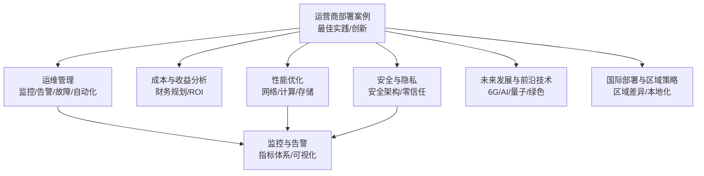
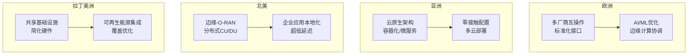
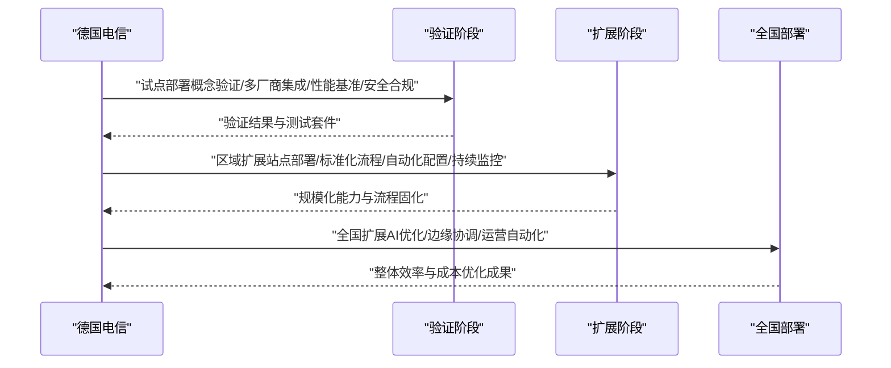
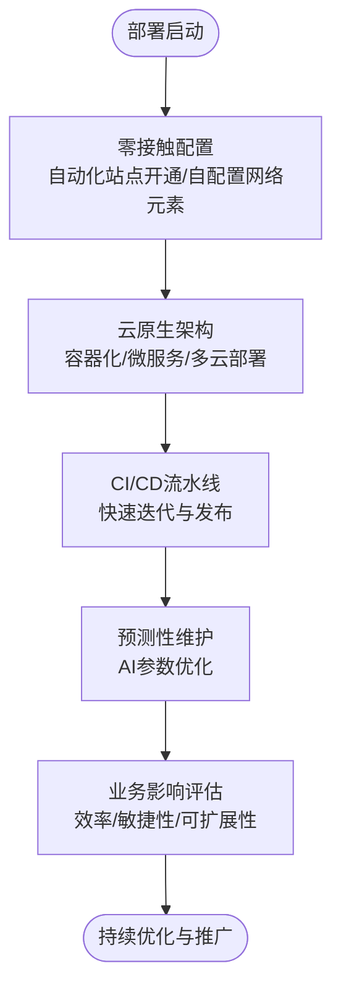
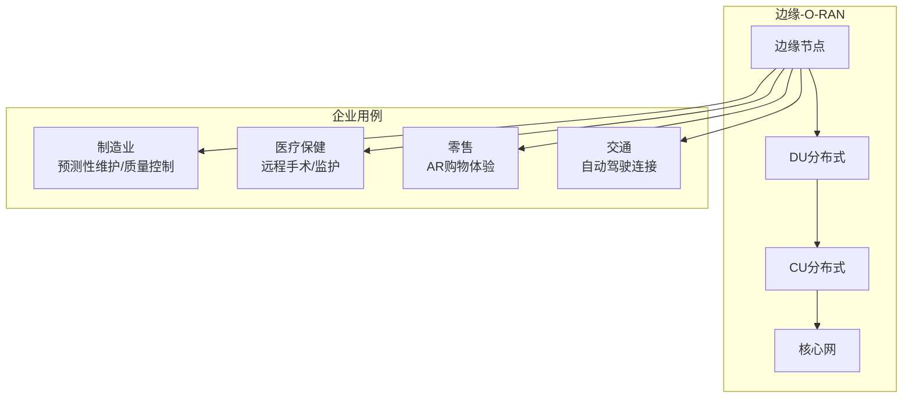
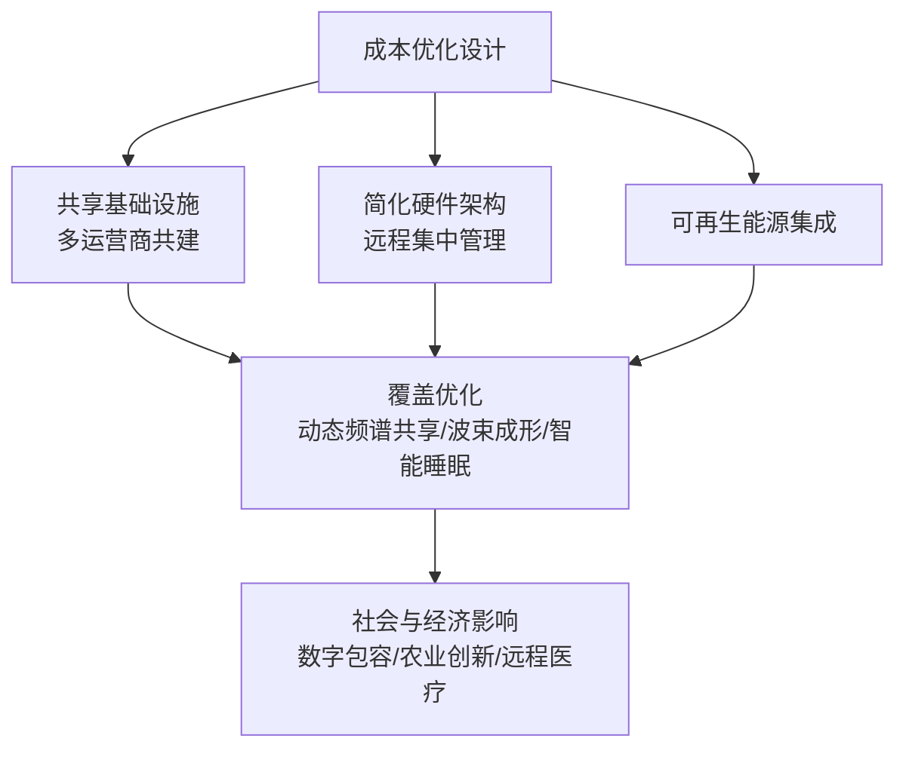
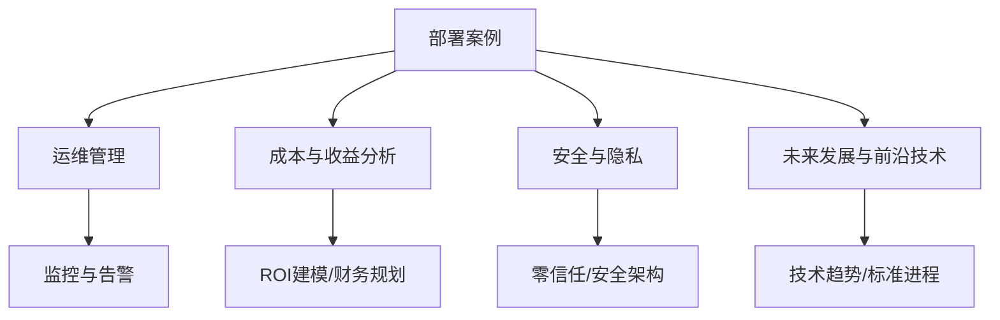

# 运营商部署案例

<cite>
**本文引用的文件**
- [运营商O-RAN部署案例（中文）](file://21-case-studies/operator-cases/carrier-o-ran-deployment-cases-zh.md)
- [最佳实践案例（中文）](file://21-case-studies/best-practices/o-ran-best-practice-cases-zh.md)
- [创新案例（中文）](file://21-case-studies/innovation-cases/o-ran-innovation-cases-zh.md)
- [运维管理（中文）](file://14-operations-management/readme-zh.md)
- [未来发展与前沿技术（中文）](file://15-future-development/readme-zh.md)
- [国际部署与区域策略（中文）](file://23-international-deployment/regional-strategies/o-ran-regional-deployment-strategies-zh.md)
- [成本与收益分析（中文）](file://18-cost-benefit-analysis/financial-planning/oran-financial-planning-zh.md)
- [性能优化（中文）](file://26-performance-optimization/network-optimization/network-performance-tuning.md)
- [监控与告警（中文）](file://28-monitoring-alerting/metric-system/monitoring-metrics-framework.md)
- [安全与隐私（中文）](file://12-security-privacy/security-architecture/security-reference-architecture-zh.md)
</cite>

## 目录
1. [引言](#引言)
2. [项目结构](#项目结构)
3. [核心组件](#核心组件)
4. [架构总览](#架构总览)
5. [详细组件分析](#详细组件分析)
6. [依赖分析](#依赖分析)
7. [性能考量](#性能考量)
8. [故障排查指南](#故障排查指南)
9. [结论](#结论)
10. [附录](#附录)

## 引言
本文件面向运营商，提供基于真实案例的O-RAN部署实践指导，覆盖欧洲大规模商用、亚洲工业区私有网络、北美边缘计算融合、拉丁美洲农村覆盖等典型场景。内容围绕技术选型、实施路径、资源配置、效果评估、成本控制、性能优化、风险管控与成功指标展开，并给出可复用的实施模板与流程建议，帮助运营商在不同区域与环境下高效推进O-RAN落地。

## 项目结构
本仓库提供了从架构演进、核心组件、接口标准到部署实施、运维管理、成本分析、性能优化、监控告警、安全架构以及未来发展的完整知识体系。针对运营商部署案例，以下文件构成关键支撑：
- 运营商部署案例：总结欧洲、亚洲、北美、拉丁美洲的代表性部署经验与方法论
- 最佳实践案例：提炼跨案例的共同成功模式与关键成功因素矩阵
- 创新案例：展示AI/ML、边缘计算、网络切片、安全与未来技术的前沿集成
- 运维管理：提供日常运维、监控告警、故障处理、自动化与性能优化的实操指南
- 未来发展与前沿技术：面向6G、AI原生、量子通信、绿色通信等趋势的前瞻布局
- 国际部署与区域策略：结合区域差异制定本地化部署策略
- 成本与收益分析：财务规划、ROI建模与成本控制工具
- 性能优化与监控告警：网络与系统性能调优、指标体系与可视化
- 安全与隐私：安全架构参考与零信任理念在O-RAN中的落地

**章节来源**
- file://21-case-studies/operator-cases/carrier-o-ran-deployment-cases-zh.md#L1-L200
- file://21-case-studies/best-practices/o-ran-best-practice-cases-zh.md#L1-L210
- file://21-case-studies/innovation-cases/o-ran-innovation-cases-zh.md#L1-L322
- file://14-operations-management/readme-zh.md#L1-L126
- file://15-future-development/readme-zh.md#L1-L151
- file://23-international-deployment/regional-strategies/o-ran-regional-deployment-strategies-zh.md#L1-L200
- file://18-cost-benefit-analysis/financial-planning/oran-financial-planning-zh.md#L1-L200
- file://26-performance-optimization/network-optimization/network-performance-tuning.md#L1-L200
- file://28-monitoring-alerting/metric-system/monitoring-metrics-framework.md#L1-L200
- file://12-security-privacy/security-architecture/security-reference-architecture-zh.md#L1-L200

## 核心组件
- 欧洲运营商：以德国电信为代表的大规模商用部署，强调厂商多元化、分阶段推进、自动化测试与性能监控，实现部署效率与运营成本双降
- 亚洲运营商：以乐天移动为代表的端到端云原生网络，突出零接触配置、云原生架构与多云部署，显著提升资本效率与服务敏捷性
- 北美运营商：以威瑞森为代表的边缘计算与O-RAN深度融合，实现超低延迟与企业级应用本地化分流
- 拉丁美洲运营商：以沃达丰为代表的农村覆盖扩展，通过共享基础设施、简化硬件与可再生能源集成，实现经济可行的广覆盖

**章节来源**
- file://21-case-studies/best-practices/o-ran-best-practice-cases-zh.md#L6-L129
- file://21-case-studies/innovation-cases/o-ran-innovation-cases-zh.md#L8-L102

## 架构总览
O-RAN部署在不同区域呈现出差异化架构取向：
- 欧洲：以开放RAN为核心，强调多厂商互操作与标准化接口，结合AI/ML优化与边缘计算协调
- 亚洲：云原生优先，容器化与微服务设计贯穿全网，DevOps流水线与多云部署成为标配
- 北美：边缘-O-RAN架构，CU/DU分布式放置，面向企业应用的超低延迟与本地分流
- 拉丁美洲：低成本、高弹性的O-RAN设计，共享基础设施与可再生能源集成，配合覆盖优化技术

**图表来源**
- file://21-case-studies/best-practices/o-ran-best-practice-cases-zh.md#L32-L44
- file://21-case-studies/innovation-cases/o-ran-innovation-cases-zh.md#L59-L79
- file://21-case-studies/innovation-cases/o-ran-innovation-cases-zh.md#L68-L80
- file://21-case-studies/best-practices/o-ran-best-practice-cases-zh.md#L111-L122

## 详细组件分析

### 欧洲运营商：大规模商用部署（德国电信）
- 技术选型：多厂商合作确保开放性；标准化接口与互操作性测试；AI驱动优化与边缘计算协调
- 实施路径：三阶段推进（试点—区域扩展—全国扩展），配套自动化测试与持续监控
- 资源配置：集中管理与自动化配置工作流，降低部署与运维成本
- 效果评估：部署效率、运营成本、能效与网络可用性均有显著改善

**图表来源**
- file://21-case-studies/best-practices/o-ran-best-practice-cases-zh.md#L11-L30

**章节来源**
- file://21-case-studies/best-practices/o-ran-best-practice-cases-zh.md#L6-L44

### 亚洲运营商：工业区私有网络（乐天移动）
- 技术选型：端到端云原生，容器化网络功能、微服务设计、CI/CD流水线、多云部署
- 实施路径：零接触配置（自动化站点开通、自配置网络元素、AI参数优化、预测性维护）
- 资源配置：按需弹性扩展、服务快速上线、月度功能发布节奏
- 效果评估：资本效率、运营敏捷性、可扩展性与创新速度显著提升

**图表来源**
- file://21-case-studies/best-practices/o-ran-best-practice-cases-zh.md#L52-L71

**章节来源**
- file://21-case-studies/best-practices/o-ran-best-practice-cases-zh.md#L46-L77

### 北美运营商：边缘计算与O-RAN融合（威瑞森）
- 技术选型：边缘-O-RAN架构，分布式CU/DU放置，超低延迟与企业流量本地分流
- 实施路径：面向制造业、医疗保健、零售与交通等企业用例，构建安全多租户隔离
- 资源配置：边缘节点与RAN的实时协调、动态服务链接与负载分配
- 效果评估：延迟降低、带宽效率提升、服务可靠性与传输成本优化

**图表来源**
- file://21-case-studies/best-practices/o-ran-best-practice-cases-zh.md#L84-L96

**章节来源**
- file://21-case-studies/best-practices/o-ran-best-practice-cases-zh.md#L78-L103

### 拉丁美洲运营商：农村覆盖的成本优化（沃达丰）
- 技术选型：共享基础设施、简化硬件、远程集中管理、可再生能源集成
- 实施路径：动态频谱共享、波束成形优化、智能睡眠模式与预测性容量规划
- 资源配置：多运营商共享与远程运维，降低单站成本与运维复杂度
- 效果评估：数字包容、经济发展、农业创新与远程医疗成效显著

**图表来源**
- file://21-case-studies/best-practices/o-ran-best-practice-cases-zh.md#L110-L129

**章节来源**
- file://21-case-studies/best-practices/o-ran-best-practice-cases-zh.md#L104-L129

### 跨案例最佳实践与关键成功因素
- 战略规划卓越：明确业务目标与KPI、利益相关者对齐、风险评估与分阶段路线图
- 实施卓越：敏捷项目管理、自动化测试与CI/CD、性能基准与安全合规
- 运营卓越：实时监控与预测性分析、自动化修复与持续改进、知识管理与经验制度化

**章节来源**
- file://21-case-studies/best-practices/o-ran-best-practice-cases-zh.md#L134-L177

## 依赖分析
- 案例与运维：部署案例强调自动化测试与持续监控，运维管理提供监控告警、故障处理与自动化工具，二者形成闭环
- 案例与成本：部署案例展示成本优化成果，成本分析提供财务规划与ROI建模工具，支撑投资决策
- 案例与安全：部署案例涉及安全合规与零信任理念，安全架构提供参考框架与实施要点
- 案例与未来：部署案例体现AI/ML、边缘计算、网络切片等创新方向，未来发展提供6G、AI原生、量子通信等趋势指引

**图表来源**
- file://14-operations-management/readme-zh.md#L15-L34
- file://18-cost-benefit-analysis/financial-planning/oran-financial-planning-zh.md#L1-L200
- file://12-security-privacy/security-architecture/security-reference-architecture-zh.md#L1-L200
- file://15-future-development/readme-zh.md#L98-L151

**章节来源**
- file://21-case-studies/best-practices/o-ran-best-practice-cases-zh.md#L179-L209
- file://14-operations-management/readme-zh.md#L1-L126
- file://18-cost-benefit-analysis/financial-planning/oran-financial-planning-zh.md#L1-L200
- file://12-security-privacy/security-architecture/security-reference-architecture-zh.md#L1-L200
- file://15-future-development/readme-zh.md#L1-L151

## 性能考量
- 网络性能：无线资源优化、传输效率提升、负载均衡、QoS参数调整、网络切片优化
- 计算资源：CPU/内存分配、容器资源限制、调度策略、缓存与并发优化
- 存储性能：数据库优化、缓存层设计、访问模式与备份策略、数据生命周期管理
- 监控与指标：建立实时性能仪表板、关键指标阈值、异常检测与根因分析工具

**章节来源**
- file://14-operations-management/readme-zh.md#L36-L81
- file://26-performance-optimization/network-optimization/network-performance-tuning.md#L1-L200
- file://28-monitoring-alerting/metric-system/monitoring-metrics-framework.md#L1-L200

## 故障排查指南
- 快速定位：基于监控告警与日志分析，结合根因分析工具
- 应急响应：制定分级告警与通知机制，明确应急流程与回退策略
- 故障恢复：标准化恢复步骤与自动化修复工作流
- 事后改进：知识库建设、经验总结与流程优化

**章节来源**
- file://14-operations-management/readme-zh.md#L22-L27

## 结论
运营商应结合自身区域特点与业务目标，借鉴欧洲的规模化经验、亚洲的云原生实践、北美的边缘融合模式与拉美低成本覆盖方案，构建以多厂商互操作、自动化与AI优化、安全与合规、成本控制与性能优化为核心的O-RAN部署体系。通过分阶段推进、标准化流程与持续改进，实现商业价值与技术领先的双重目标。

## 附录

### 部署流程模板（通用）
- 部署前阶段
  - 全面评估：技术与商业可行性研究
  - 利益相关者对齐：高管承诺与组织准备
  - 技能发展：O-RAN与云原生网络培训
  - 厂商评估：多厂商选择与集成标准
- 实施阶段
  - 分阶段方法：试点—扩展—全国
  - 自动化优先：CI/CD与自动化测试
  - 性能基线：KPI与监控体系
  - 风险管理：回退与应急计划
- 部署后阶段
  - 持续优化：AI/ML与预测性分析
  - 知识分享：经验制度化与社区协作
  - 生态系统：开源与标准贡献
  - 创新管道：关注新兴技术与用例

**章节来源**
- file://21-case-studies/best-practices/o-ran-best-practice-cases-zh.md#L192-L209

### 成功指标衡量（示例）
- 部署效率：单位站点部署时间
- 成本优化：运营支出降低、资本效率提升
- 能效与可靠性：能耗降低、网络可用性
- 业务影响：服务敏捷性、客户满意度、收入增长

**章节来源**
- file://21-case-studies/best-practices/o-ran-best-practice-cases-zh.md#L38-L44
- file://21-case-studies/best-practices/o-ran-best-practice-cases-zh.md#L66-L71
- file://21-case-studies/best-practices/o-ran-best-practice-cases-zh.md#L98-L102
- file://21-case-studies/best-practices/o-ran-best-practice-cases-zh.md#L124-L129

### 区域策略与本地化
- 国际部署与区域策略：结合区域差异制定本地化部署策略，包括法规、成本、技术成熟度与市场环境

**章节来源**
- file://23-international-deployment/regional-strategies/o-ran-regional-deployment-strategies-zh.md#L1-L200