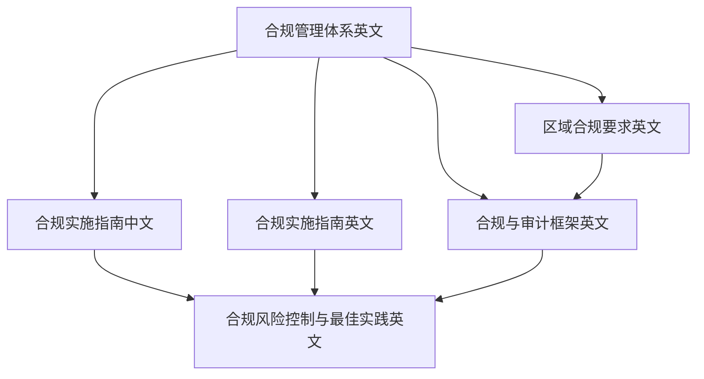
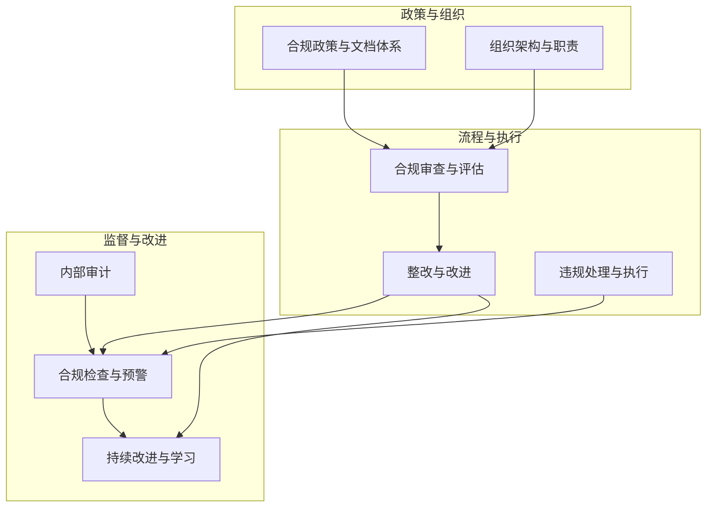
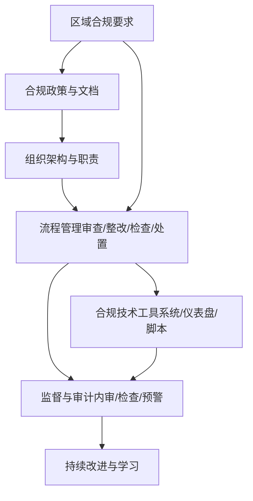

# 合规管理体系

<cite>
**本文引用的文件**
- [合规管理体系（英文）](file://25-legal-regulations/compliance-system/o-ran-compliance-management.md)
- [合规实施指南（中文）](file://25-legal-regulations/implementation-guides/o-ran-compliance-implementation-zh.md)
- [合规实施指南（英文）](file://25-legal-regulations/implementation-guides/o-ran-compliance-implementation.md)
- [区域合规要求（英文）](file://25-legal-regulations/regional-requirements/o-ran-regional-compliance.md)
- [合规与审计框架（英文）](file://12-security-privacy/compliance-auditing/compliance-auditing-framework.md)
- [法律合规总览（英文）](file://25-legal-regulations/readme.md)
- [知识库总览（英文）](file://README.md)
</cite>

## 目录
1. [引言](#引言)
2. [项目结构](#项目结构)
3. [核心组件](#核心组件)
4. [架构总览](#架构总览)
5. [详细组件分析](#详细组件分析)
6. [依赖分析](#依赖分析)
7. [性能考虑](#性能考虑)
8. [故障排查指南](#故障排查指南)
9. [结论](#结论)
10. [附录](#附录)

## 引言
本文件面向O-RAN技术部署的企业，系统化构建合规管理体系的管理指导。围绕合规政策制定、组织架构设计、流程管理体系建设、监督与审计机制、违规处理与持续改进等维度，结合区域监管差异与技术标准，形成可落地、可执行、可量化的合规管理闭环。目标是帮助组织在满足国际与区域监管要求的同时，建立全员参与、持续演进的合规文化与能力。

## 项目结构
本知识库围绕“合规与审计”“区域合规要求”“实施指南”等主题，提供了从顶层设计到落地执行的完整材料。合规相关的核心内容主要分布在以下目录：
- 25-legal-regulations/compliance-system：合规管理体系框架与流程
- 25-legal-regulations/implementation-guides：合规实施步骤、资源与培训
- 25-legal-regulations/regional-requirements：多区域监管要求与对比
- 12-security-privacy/compliance-auditing：GDPR、3GPP、ETSI等合规与审计框架
- 25-legal-regulations/readme：合规风险控制与实施要点
- README：知识库整体结构与合规相关内容索引

图表来源
- [合规管理体系（英文）](file://25-legal-regulations/compliance-system/o-ran-compliance-management.md#L1-L287)
- [合规实施指南（中文）](file://25-legal-regulations/implementation-guides/o-ran-compliance-implementation-zh.md#L1-L406)
- [合规实施指南（英文）](file://25-legal-regulations/implementation-guides/o-ran-compliance-implementation.md#L1-L406)
- [区域合规要求（英文）](file://25-legal-regulations/regional-requirements/o-ran-regional-compliance.md#L1-L318)
- [合规与审计框架（英文）](file://12-security-privacy/compliance-auditing/compliance-auditing-framework.md#L1-L486)
- [法律合规总览（英文）](file://25-legal-regulations/readme.md#L54-L74)

章节来源
- [合规管理体系（英文）](file://25-legal-regulations/compliance-system/o-ran-compliance-management.md#L1-L287)
- [合规实施指南（中文）](file://25-legal-regulations/implementation-guides/o-ran-compliance-implementation-zh.md#L1-L406)
- [合规实施指南（英文）](file://25-legal-regulations/implementation-guides/o-ran-compliance-implementation.md#L1-L406)
- [区域合规要求（英文）](file://25-legal-regulations/regional-requirements/o-ran-regional-compliance.md#L1-L318)
- [合规与审计框架（英文）](file://12-security-privacy/compliance-auditing/compliance-auditing-framework.md#L1-L486)
- [法律合规总览（英文）](file://25-legal-regulations/readme.md#L54-L74)
- [知识库总览（英文）](file://README.md#L191-L200)

## 核心组件
- 合规政策与文档体系：覆盖数据保护、网络安全、隐私与运营合规的政策层级、支撑程序、维护与沟通策略。
- 组织架构与职责：董事会监督、高管领导、合规部门、业务单元嵌入代表、外部关系协调等。
- 流程管理：合规审查与评估（差距分析、风险评估、持续监控、第三方评估）、整改与改进（问题识别、行动计划、实施监督、效果验证）。
- 监督与审计：内部审计（计划、执行、报告、质量保证）、合规检查（自动与人工、KPI、预警系统）。
- 违规处理与执行：事件检测与上报、调查流程、决策与处置、整改与复核。
- 持续改进：绩效测量与分析、学习与发展（培训、知识管理、能力建设、创新与适应）。

章节来源
- [合规管理体系（英文）](file://25-legal-regulations/compliance-system/o-ran-compliance-management.md#L6-L287)

## 架构总览
合规管理体系由“政策—组织—流程—监督—执行—改进”六大支柱构成，贯穿企业全生命周期，形成“识别—评估—应对—监控—改进”的闭环。

图表来源
- [合规管理体系（英文）](file://25-legal-regulations/compliance-system/o-ran-compliance-management.md#L79-L287)

## 详细组件分析

### 合规政策与文档体系
- 核心合规政策：数据保护、网络安全、隐私、运营合规；配套支撑程序（实施指南、培训材料、检查表、审计协议）、维护机制（定期评审、版本控制、反馈与法规更新）、传播策略（发布方式、员工意识、客户通知、公开披露）。
- 设计要点：层次清晰、权责明确、可操作性强、可追溯、可审计。

章节来源
- [合规管理体系（英文）](file://25-legal-regulations/compliance-system/o-ran-compliance-management.md#L8-L47)

### 组织架构与职责分工
- 董事会监督：合规委员会、风险偏好、政策审批、绩效监测。
- 高管领导：首席合规官、合规指导委员会、跨职能协调、资源配置。
- 合规部门：按领域划分的合规经理、法律与监管专家、隐私官、安全合规分析师。
- 业务单元：嵌入式合规代表、本地合规大使、产品与运营合规对接。
- 外部关系：法务、监管联络、行业组织、审计与咨询。

章节来源
- [合规管理体系（英文）](file://25-legal-regulations/compliance-system/o-ran-compliance-management.md#L49-L77)

### 合规审查与评估
- 差距分析：现状评估、监管映射、成熟度评分、改进机会识别。
- 风险导向评估：风险分类、影响与概率分析、优先级排序、资源优化。
- 持续监控：持续合规检查、自动化控制测试、异常报告、趋势分析。
- 第三方评估：供应商合规、供应链风险、尽职调查、合同合规验证。

章节来源
- [合规管理体系（英文）](file://25-legal-regulations/compliance-system/o-ran-compliance-management.md#L81-L104)

### 整改与改进
- 问题识别与分类：严重程度、根因分析、影响评估、相关方通知。
- 行动计划：整改时限、资源分配、责任分工、成功标准。
- 实施监督：进度跟踪、里程碑评审、资源调整、质量保证。
- 效果验证：后置测试、控制有效性、经验总结、持续改进融合。

章节来源
- [合规管理体系（英文）](file://25-legal-regulations/compliance-system/o-ran-compliance-management.md#L106-L129)

### 内部审计
- 审计规划与范围：年度计划、基于风险的选择、资源与相关方协调。
- 审计执行：现场工作、证据收集、访谈与观察、工作底稿。
- 报告与沟通：发现分级、报告规范、管理回复、跟踪。
- 质量保证：项目治理、方法标准化、能力建设、持续改进。

章节来源
- [合规管理体系（英文）](file://25-legal-regulations/compliance-system/o-ran-compliance-management.md#L133-L156)

### 合规检查与预警
- 自动化合规检查：实时交易监控、系统配置校验、访问日志分析、数据流合规验证。
- 人工检查：周期性合规巡检、抽样测试、文档审查、物理安全检查。
- 关键指标：合规率、违规事件、整改完成率、培训有效率。
- 预警系统：异常检测算法、阈值告警、趋势分析、预测性风险建模。

章节来源
- [合规管理体系（英文）](file://25-legal-regulations/compliance-system/o-ran-compliance-management.md#L158-L181)

### 违规处理与执行
- 事件检测与上报：违规识别、强制上报、举报保护、匿名通道。
- 调查流程：初步评估、证据保全、访谈取证、时间线管理。
- 决策与处置：违规等级、适用惩戒、从轻因素、公平一致。
- 解决与复核：执行、整改跟踪、相关方沟通、归档结案。

章节来源
- [合规管理体系（英文）](file://25-legal-regulations/compliance-system/o-ran-compliance-management.md#L185-L208)

### 纪律与补救措施
- 渐进式纪律：口头警告、书面申诫、停职、解雇。
- 组织补救：流程重塑、系统升级、培训改进、政策修订。
- 经济后果：罚款与处罚、赔偿、保险理赔、成本回收。
- 声誉管理：公开策略、利益相关方沟通、媒体关系、品牌保护。

章节来源
- [合规管理体系（英文）](file://25-legal-regulations/compliance-system/o-ran-compliance-management.md#L210-L233)

### 持续改进与学习
- 绩效测量与分析：关键指标、仪表盘与报告、对标比较、改进目标。
- 学习与发展：课程设计、知识库、能力评估、创新与适应。

章节来源
- [合规管理体系（英文）](file://25-legal-regulations/compliance-system/o-ran-compliance-management.md#L235-L285)

### 实施步骤与资源
- 阶段一：现状评估（差距分析、现有控制、风险识别、资源评估、利益相关者参与、基线建立）。
- 阶段二：系统建设（政策与程序、组织设计、技术基础设施、测试与验证）。
- 资源分配：人员部署（核心团队、扩展资源、组织整合）、技术与资金（系统、安全、集成、创新、预算、优化）。
- 培训与推广：意识培养、运营培训、持续支持。
- 执行监控：合规检查、违规处理、持续改进。
- 最佳实践：顶层设计、全员参与、技术支撑、持续改进、文化培育。

章节来源
- [合规实施指南（中文）](file://25-legal-regulations/implementation-guides/o-ran-compliance-implementation-zh.md#L8-L406)
- [合规实施指南（英文）](file://25-legal-regulations/implementation-guides/o-ran-compliance-implementation.md#L8-L406)

### 区域合规要求与对比
- 中国：网络安全法、数据安全法、个人信息保护法、电信条例及关键信息基础设施、跨境数据传输、网络产品安全、内部合规管理。
- 欧盟：GDPR、ePrivacy指令、NIS指令、数字服务法案（DSA）、电子通信法、无线电设备指令、网络安全法、国家实施差异。
- 美国：联邦通信委员会（FCC）频谱管理、设备授权、网络安全、消费者保护；联邦与州隐私法、行业特定法规、各州执法差异。
- 亚太：日本、韩国等区域监管与技术标准、认证与互认、市场准入条件。
- 对比与协同：数据保护、网络安全、设备认证、市场准入的横向对比与区域合作框架（如ASEAN、APEC、RCEP、CPTPP）。

章节来源
- [区域合规要求（英文）](file://25-legal-regulations/regional-requirements/o-ran-regional-compliance.md#L6-L318)

### 合规与审计框架（技术标准与工具）
- GDPR：数据保护影响评估（DPIA）模板、合规检查清单、隐私保障、咨询与审批。
- 电信安全标准：3GPP安全要求（TS 33.501/33.102/33.401）、ETSI标准（TS 103 859、TS 103 983）与安全测试脚本、合规报告生成。
- 第三方审计：审计准备清单、证据收集工具（系统、应用、合规证据打包）、仪表盘与告警阈值。

章节来源
- [合规与审计框架（英文）](file://12-security-privacy/compliance-auditing/compliance-auditing-framework.md#L1-L486)

## 依赖分析
合规体系的运行依赖于政策、组织、流程、监督与技术工具的协同：
- 政策与组织决定合规方向与资源投入；
- 流程管理确保审查、整改、检查与处置的闭环；
- 监督与审计提供证据与持续改进建议；
- 技术工具（合规系统、监控仪表盘、自动化测试脚本）提升效率与可追溯性；
- 区域合规要求驱动差异化策略与资源配置。

图表来源
- [合规管理体系（英文）](file://25-legal-regulations/compliance-system/o-ran-compliance-management.md#L6-L287)
- [合规与审计框架（英文）](file://12-security-privacy/compliance-auditing/compliance-auditing-framework.md#L1-L486)
- [区域合规要求（英文）](file://25-legal-regulations/regional-requirements/o-ran-regional-compliance.md#L1-L318)

## 性能考虑
- 合规效率：通过自动化合规检查、统一合规系统、标准化流程减少重复劳动与人工成本。
- 风险控制：基于风险的审计与检查优先级、关键指标监控与预警，降低高风险事件发生概率。
- 可追溯性：完善的证据收集与归档、审计轨迹、合规报告模板，缩短审计准备时间。
- 资源优化：分阶段实施、预算与成本效益分析、供应商与外包管理，平衡短期收益与长期战略。

## 故障排查指南
- 合规审查未达标
  - 检查差距分析是否覆盖全部监管要求与业务流程。
  - 确认支撑程序与培训材料已下发并留痕。
  - 查看持续监控与趋势分析是否触发预警。
- 审计发现问题未闭环
  - 核对整改计划的责任人、时限与验收标准。
  - 检查实施监督记录与效果验证结果。
  - 确认后续改进是否纳入流程与培训。
- 区域合规不一致
  - 对照区域合规要求清单，识别差异点与高风险领域。
  - 建立本地化实施支持（法律、监管、文化、语言）。
  - 定期更新合规系统以反映法规变化。
- 技术工具失效
  - 检查合规系统与监控仪表盘的数据采集频率与保留策略。
  - 校验自动化测试脚本与证据收集工具的执行日志。
  - 确认报告生成与告警阈值配置正确。

章节来源
- [合规与审计框架（英文）](file://12-security-privacy/compliance-auditing/compliance-auditing-framework.md#L432-L486)
- [合规实施指南（中文）](file://25-legal-regulations/implementation-guides/o-ran-compliance-implementation-zh.md#L302-L352)
- [合规实施指南（英文）](file://25-legal-regulations/implementation-guides/o-ran-compliance-implementation.md#L302-L352)

## 结论
通过政策、组织、流程、监督与技术工具的系统化协同，O-RAN企业可在多区域监管环境下建立稳健的合规管理体系。建议以“顶层设计—分步实施—全员参与—技术支撑—持续改进”为主线，结合区域合规差异与技术标准，构建可落地、可衡量、可持续的合规能力，实现合规与业务发展的有机统一。

## 附录
- 合规风险控制与最佳实践要点
  - 风险识别：法规梳理、风险点分析
  - 风险评估：风险等级、影响度分析
  - 风险应对：预防措施、应急预案、损失控制
  - 持续监控：风险监控、预警机制、动态调整
  - 最佳实践：高层设计、全员参与、技术支撑、持续改进、文化培育

章节来源
- [法律合规总览（英文）](file://25-legal-regulations/readme.md#L54-L74)