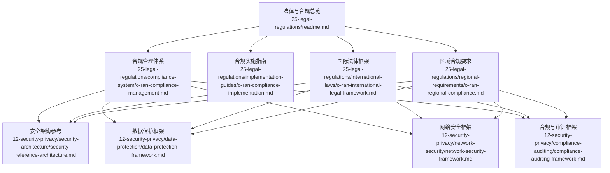
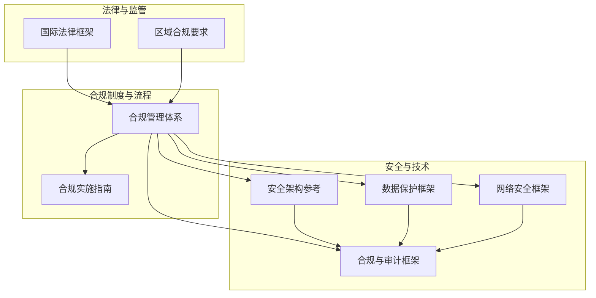
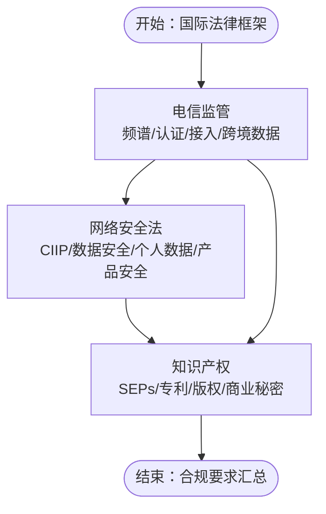
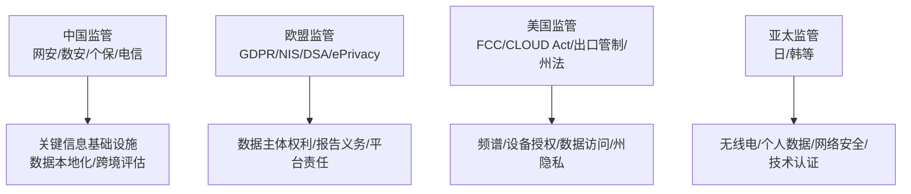
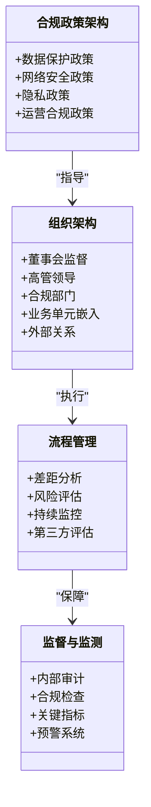
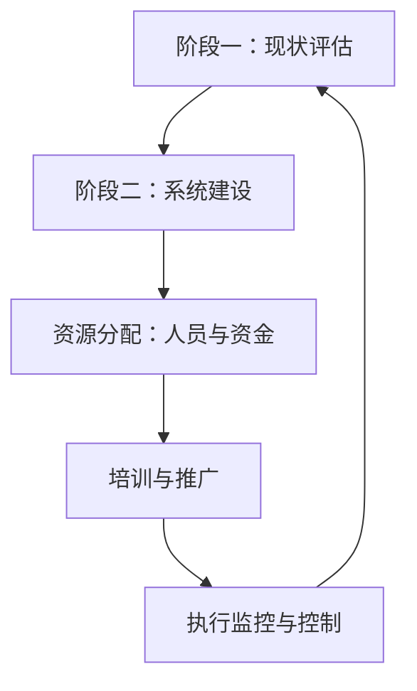
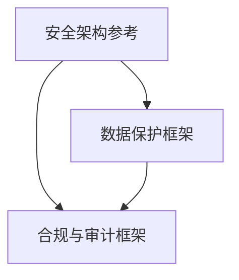
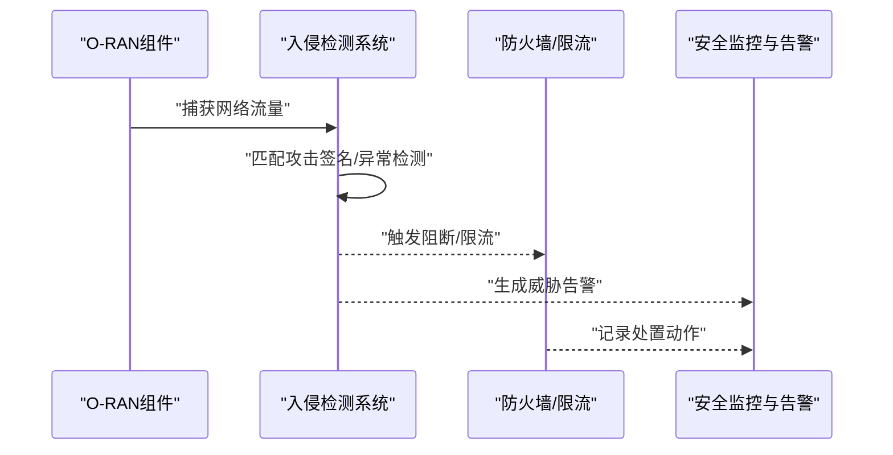
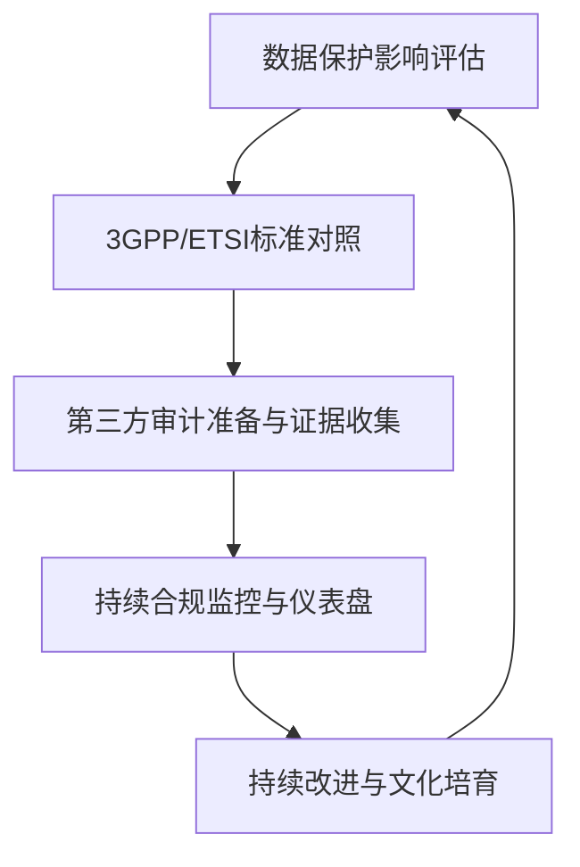
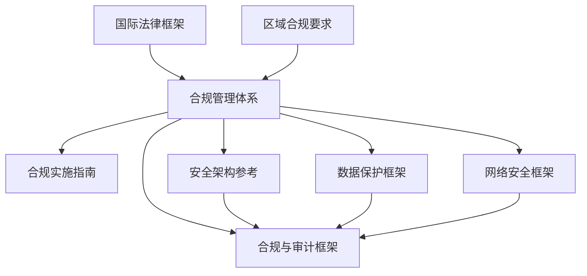

# 国际法律框架

<cite>
**本文引用的文件**
- [README.md（法律法规总览）](file://25-legal-regulations/readme.md)
- [合规管理体系（英文）](file://25-legal-regulations/compliance-system/o-ran-compliance-management.md)
- [合规实施指南（英文）](file://25-legal-regulations/implementation-guides/o-ran-compliance-implementation.md)
- [国际法律框架（英文）](file://25-legal-regulations/international-laws/o-ran-international-legal-framework.md)
- [区域合规要求（英文）](file://25-legal-regulations/regional-requirements/o-ran-regional-compliance.md)
- [安全架构参考（英文）](file://12-security-privacy/security-architecture/security-reference-architecture.md)
- [数据保护框架（英文）](file://12-security-privacy/data-protection/data-protection-framework.md)
- [网络安全框架（英文）](file://12-security-privacy/network-security/network-security-framework.md)
- [合规与审计框架（英文）](file://12-security-privacy/compliance-auditing/compliance-auditing-framework.md)
</cite>

## 目录
1. [引言](#引言)
2. [项目结构](#项目结构)
3. [核心组件](#核心组件)
4. [架构总览](#架构总览)
5. [详细组件分析](#详细组件分析)
6. [依赖分析](#依赖分析)
7. [性能考虑](#性能考虑)
8. [故障排查指南](#故障排查指南)
9. [结论](#结论)
10. [附录](#附录)

## 引言
本文件面向O-RAN国际法律合规，系统梳理全球范围内的电信法规体系，覆盖频谱管理、网络接入、服务监管与数据保护等核心法律要求；深入解读网络安全法的关键条款，包括基础设施保护、数据安全管理、个人信息保护与网络产品安全；总结知识产权法在O-RAN部署中的应用，涵盖专利保护、标准必要专利（SEPs）、版权保护与商业秘密保护；并提供国际法律适用性分析，帮助组织理解不同司法管辖区的法律差异与合规要点。同时，结合安全架构与合规审计框架，形成“法律—技术—流程—审计”的闭环合规体系。

## 项目结构
法律合规相关内容主要分布在“25-legal-regulations”目录下，并与“12-security-privacy”中的安全与合规主题文档形成互补。整体结构如下：

图表来源
- [README.md（法律法规总览）](file://25-legal-regulations/readme.md#L1-L74)
- [合规管理体系（英文）](file://25-legal-regulations/compliance-system/o-ran-compliance-management.md#L1-L287)
- [合规实施指南（英文）](file://25-legal-regulations/implementation-guides/o-ran-compliance-implementation.md#L1-L406)
- [国际法律框架（英文）](file://25-legal-regulations/international-laws/o-ran-international-legal-framework.md#L1-L266)
- [区域合规要求（英文）](file://25-legal-regulations/regional-requirements/o-ran-regional-compliance.md#L1-L318)
- [安全架构参考（英文）](file://12-security-privacy/security-architecture/security-reference-architecture.md#L1-L559)
- [数据保护框架（英文）](file://12-security-privacy/data-protection/data-protection-framework.md#L1-L376)
- [网络安全框架（英文）](file://12-security-privacy/network-security/network-security-framework.md#L1-L473)
- [合规与审计框架（英文）](file://12-security-privacy/compliance-auditing/compliance-auditing-framework.md#L1-L486)

章节来源
- [README.md（法律法规总览）](file://25-legal-regulations/readme.md#L1-L74)

## 核心组件
- 法律与合规总览：明确国际电信法规、网络安全法、知识产权法三大板块，以及中国、欧盟、美国等区域监管要点与合规管理框架。
- 合规管理体系：从政策制定、组织架构、流程管理到持续监督，构建系统化的合规制度。
- 合规实施指南：提供阶段性落地步骤、资源分配、培训推广与执行监控的实操方法。
- 国际法律框架：系统解析频谱管理、设备认证、跨境数据传输、关键信息基础设施保护、数据安全与隐私、专利与技术许可等议题。
- 区域合规要求：聚焦中国、欧盟、美国及亚太地区（日韩）的监管差异与合规要点。
- 安全架构与数据保护：将法律合规要求转化为安全架构、加密与密钥管理、隐私增强技术与审计日志等技术实现。
- 合规与审计框架：提供DPIA模板、3GPP/ETSI标准对照、第三方审计准备与证据收集、持续合规监控仪表盘等。

章节来源
- [合规管理体系（英文）](file://25-legal-regulations/compliance-system/o-ran-compliance-management.md#L1-L287)
- [合规实施指南（英文）](file://25-legal-regulations/implementation-guides/o-ran-compliance-implementation.md#L1-L406)
- [国际法律框架（英文）](file://25-legal-regulations/international-laws/o-ran-international-legal-framework.md#L1-L266)
- [区域合规要求（英文）](file://25-legal-regulations/regional-requirements/o-ran-regional-compliance.md#L1-L318)
- [安全架构参考（英文）](file://12-security-privacy/security-architecture/security-reference-architecture.md#L1-L559)
- [数据保护框架（英文）](file://12-security-privacy/data-protection/data-protection-framework.md#L1-L376)
- [网络安全框架（英文）](file://12-security-privacy/network-security/network-security-framework.md#L1-L473)
- [合规与审计框架（英文）](file://12-security-privacy/compliance-auditing/compliance-auditing-framework.md#L1-L486)

## 架构总览
以下图示展示法律合规在O-RAN部署中的总体架构：由“国际法律框架”与“区域合规要求”提供法律依据，通过“合规管理体系”与“合规实施指南”进行制度化与落地，配合“安全架构参考”“数据保护框架”“网络安全框架”“合规与审计框架”形成技术与流程闭环。

图表来源
- [国际法律框架（英文）](file://25-legal-regulations/international-laws/o-ran-international-legal-framework.md#L1-L266)
- [区域合规要求（英文）](file://25-legal-regulations/regional-requirements/o-ran-regional-compliance.md#L1-L318)
- [合规管理体系（英文）](file://25-legal-regulations/compliance-system/o-ran-compliance-management.md#L1-L287)
- [合规实施指南（英文）](file://25-legal-regulations/implementation-guides/o-ran-compliance-implementation.md#L1-L406)
- [安全架构参考（英文）](file://12-security-privacy/security-architecture/security-reference-architecture.md#L1-L559)
- [数据保护框架（英文）](file://12-security-privacy/data-protection/data-protection-framework.md#L1-L376)
- [网络安全框架（英文）](file://12-security-privacy/network-security/network-security-framework.md#L1-L473)
- [合规与审计框架（英文）](file://12-security-privacy/compliance-auditing/compliance-auditing-framework.md#L1-L486)

## 详细组件分析

### 国际法律框架（Telecommunications, Cybersecurity, IP）
- 电信监管：频谱管理与许可、设备认证与互操作、接入与服务监管、跨境数据流动。
- 网络安全法：关键信息基础设施保护、数据安全分级与评估、个人数据保护、网络产品安全审查与供应链安全。
- 知识产权：标准必要专利（FRAND承诺、许可费率、争端解决）、专利申请与侵权预防、版权与开源合规、商业秘密保护与竞业限制。

图表来源
- [国际法律框架（英文）](file://25-legal-regulations/international-laws/o-ran-international-legal-framework.md#L8-L161)

章节来源
- [国际法律框架（英文）](file://25-legal-regulations/international-laws/o-ran-international-legal-framework.md#L1-L266)

### 区域合规要求（中国、欧盟、美国、亚太）
- 中国：《网络安全法》《数据安全法》《个人信息保护法》《电信条例》，强调关键信息基础设施保护、数据本地化、跨境数据安全评估、网络产品安全认证与漏洞管理。
- 欧盟：GDPR、ePrivacy指令、NIS指令、数字服务法案（DSA），关注数据主体权利、隐私保护、事件报告、平台责任与风险评估。
- 美国：联邦通信委员会（FCC）规则、《澄清海外合法使用数据法》（CLOUD Act）、出口管制（EAR）、州层面隐私法（如加州CCPA）。
- 亚太：日本、韩国等在无线电与电信业务、个人数据保护、网络安全与技术认证方面各有侧重。

图表来源
- [区域合规要求（英文）](file://25-legal-regulations/regional-requirements/o-ran-regional-compliance.md#L6-L318)

章节来源
- [区域合规要求（英文）](file://25-legal-regulations/regional-requirements/o-ran-regional-compliance.md#L1-L318)

### 合规管理体系（Policy, Org, Process, Supervision）
- 政策与文档：数据保护、网络安全、隐私、运营合规的政策架构与支撑程序。
- 组织架构：董事会监督、高管领导、合规部门、业务单元嵌入、外部关系。
- 流程管理：差距分析、风险评估、持续监控、第三方评估。
- 监督与监测：内部审计、合规检查、关键指标、预警系统。

图表来源
- [合规管理体系（英文）](file://25-legal-regulations/compliance-system/o-ran-compliance-management.md#L8-L181)

章节来源
- [合规管理体系（英文）](file://25-legal-regulations/compliance-system/o-ran-compliance-management.md#L1-L287)

### 合规实施指南（阶段、资源、培训、执行）
- 阶段一：现状评估（差距分析、现有控制、风险识别、资源评估、利益相关者参与、基线建立）。
- 阶段二：系统建设（政策与程序、组织设计、资源分配、角色定义、技术基础设施、测试验证）。
- 资源分配：人员部署（核心团队、扩展资源、组织整合、外部关系）、技术支持与资金（技术投资、预算框架、资源优化）。
- 培训与推广：高层培训、管理层发展、员工教育、专业化培训、运营培训实施。
- 执行监控与控制：定期审计、持续监控、自我评估、外部验证、违规处理与持续改进。

图表来源
- [合规实施指南（英文）](file://25-legal-regulations/implementation-guides/o-ran-compliance-implementation.md#L8-L352)

章节来源
- [合规实施指南（英文）](file://25-legal-regulations/implementation-guides/o-ran-compliance-implementation.md#L1-L406)

### 安全架构与数据保护（法律到技术的映射）
- 安全架构：零信任模型、纵深防御、加密要求、证书与密钥管理、身份与访问控制、安全监控与分析、合规与审计要求（GDPR、NIST、ISO 27001、3GPP）。
- 数据保护：静态与传输加密、密钥管理（含硬件安全模块）、差分隐私、数据泄露防护（DLP）、GDPR合规清单、审计日志框架。

图表来源
- [安全架构参考（英文）](file://12-security-privacy/security-architecture/security-reference-architecture.md#L6-L559)
- [数据保护框架（英文）](file://12-security-privacy/data-protection/data-protection-framework.md#L1-L376)
- [合规与审计框架（英文）](file://12-security-privacy/compliance-auditing/compliance-auditing-framework.md#L1-L486)

章节来源
- [安全架构参考（英文）](file://12-security-privacy/security-architecture/security-reference-architecture.md#L1-L559)
- [数据保护框架（英文）](file://12-security-privacy/data-protection/data-protection-framework.md#L1-L376)
- [合规与审计框架（英文）](file://12-security-privacy/compliance-auditing/compliance-auditing-framework.md#L1-L486)

### 网络安全框架（威胁检测、DDoS防护、安全通信）
- 网络分段与微隔离（零信任域划分）、VLAN与命名空间实现、网络隔离策略。
- 入侵检测与防护（签名匹配、流量特征、异常检测）、DDoS防护（速率限制、连接限制、NFTables规则、地理过滤）。
- 安全通信（TLS配置、OCSP Stapling、速率限制、安全头）。

图表来源
- [网络安全框架（英文）](file://12-security-privacy/network-security/network-security-framework.md#L114-L473)

章节来源
- [网络安全框架（英文）](file://12-security-privacy/network-security/network-security-framework.md#L1-L473)

### 合规与审计框架（DPIA、3GPP/ETSI、第三方审计、持续监控）
- DPIA模板：系统描述、必要性与比例性、风险评估、隐私保障、咨询与审批。
- 3GPP/ETSI标准：TS 33.501、TS 33.102、TS 33.401与O-RAN接口影响；ETSI O-RAN安全架构与测试标准的合规检查器。
- 第三方审计：审计准备清单、证据收集（系统、应用、合规证据打包、哈希校验）、报告生成。
- 持续合规监控：仪表盘指标（合规得分、控制有效性、审计整改率、监管状态）、阈值告警与通知。

图表来源
- [合规与审计框架（英文）](file://12-security-privacy/compliance-auditing/compliance-auditing-framework.md#L8-L486)

章节来源
- [合规与审计框架（英文）](file://12-security-privacy/compliance-auditing/compliance-auditing-framework.md#L1-L486)

## 依赖分析
- 法律与监管依赖：国际法律框架与区域合规要求是合规管理体系与实施指南的输入；安全架构与数据保护框架为法律合规提供技术实现路径；合规与审计框架贯穿全流程，提供证据与监控。
- 组织与流程依赖：合规管理体系为合规实施指南提供制度基础；合规实施指南推动组织与技术资源落地；合规与审计框架对体系运行进行监督与改进。
- 技术与标准依赖：安全架构与数据保护框架遵循GDPR、NIST、ISO 27001、3GPP、ETSI等标准；网络安全框架提供DDoS与入侵检测的技术手段；合规与审计框架提供持续监控与证据管理。

图表来源
- [国际法律框架（英文）](file://25-legal-regulations/international-laws/o-ran-international-legal-framework.md#L1-L266)
- [区域合规要求（英文）](file://25-legal-regulations/regional-requirements/o-ran-regional-compliance.md#L1-L318)
- [合规管理体系（英文）](file://25-legal-regulations/compliance-system/o-ran-compliance-management.md#L1-L287)
- [合规实施指南（英文）](file://25-legal-regulations/implementation-guides/o-ran-compliance-implementation.md#L1-L406)
- [安全架构参考（英文）](file://12-security-privacy/security-architecture/security-reference-architecture.md#L1-L559)
- [数据保护框架（英文）](file://12-security-privacy/data-protection/data-protection-framework.md#L1-L376)
- [网络安全框架（英文）](file://12-security-privacy/network-security/network-security-framework.md#L1-L473)
- [合规与审计框架（英文）](file://12-security-privacy/compliance-auditing/compliance-auditing-framework.md#L1-L486)

章节来源
- [合规管理体系（英文）](file://25-legal-regulations/compliance-system/o-ran-compliance-management.md#L1-L287)
- [合规实施指南（英文）](file://25-legal-regulations/implementation-guides/o-ran-compliance-implementation.md#L1-L406)
- [合规与审计框架（英文）](file://12-security-privacy/compliance-auditing/compliance-auditing-framework.md#L1-L486)

## 性能考虑
- 合规成本与效益：预算分配框架包含一次性与持续运营成本、应急规划与ROI测量，建议以风险为基础进行资源优化与分阶段投入。
- 技术效率：采用自动化合规检查、集中式监控与报告工具、AI/ML辅助的风险建模与异常检测，降低人工成本并提升响应速度。
- 合规成熟度：通过定期评估与改进，逐步提升合规得分、控制有效性与审计整改率，减少违规风险与潜在损失。

## 故障排查指南
- 合规问题识别：利用合规检查框架（定期审计、持续监控、自我评估、外部验证）识别问题与改进机会。
- 违规处理流程：从违规发现、报告、调查、决策到整改与复核，确保处置闭环与可追溯。
- 技术故障定位：结合安全监控与分析（SIEM集成、威胁检测、日志分析）快速定位异常与攻击行为，采取阻断与恢复措施。
- 证据与报告：使用审计证据收集工具生成证据包，确保审计与监管检查具备完整、可验证的材料。

章节来源
- [合规实施指南（英文）](file://25-legal-regulations/implementation-guides/o-ran-compliance-implementation.md#L302-L352)
- [合规与审计框架（英文）](file://12-security-privacy/compliance-auditing/compliance-auditing-framework.md#L199-L486)
- [安全架构参考（英文）](file://12-security-privacy/security-architecture/security-reference-architecture.md#L339-L559)
- [网络安全框架（英文）](file://12-security-privacy/network-security/network-security-framework.md#L114-L473)

## 结论
通过国际法律框架与区域合规要求的系统梳理，结合合规管理体系与实施指南的制度化与流程化推进，辅以安全架构、数据保护、网络安全与合规审计的技术与证据支撑，O-RAN组织可在复杂多变的全球监管环境中实现稳健、可持续的合规运营。建议以风险为导向，持续优化资源配置与技术能力，强化跨部门协同与合规文化建设，确保在技术创新的同时满足法律与监管要求。

## 附录
- 法律合规术语速查：频谱管理、关键信息基础设施（CIIP）、数据分类分级、标准必要专利（SEPs）、差分隐私、零信任、DDoS防护、DPIA、3GPP/ETSI标准等。
- 推荐阅读顺序：先读“国际法律框架”与“区域合规要求”，再读“合规管理体系”与“合规实施指南”，最后结合“安全架构参考”“数据保护框架”“网络安全框架”“合规与审计框架”进行落地与验证。