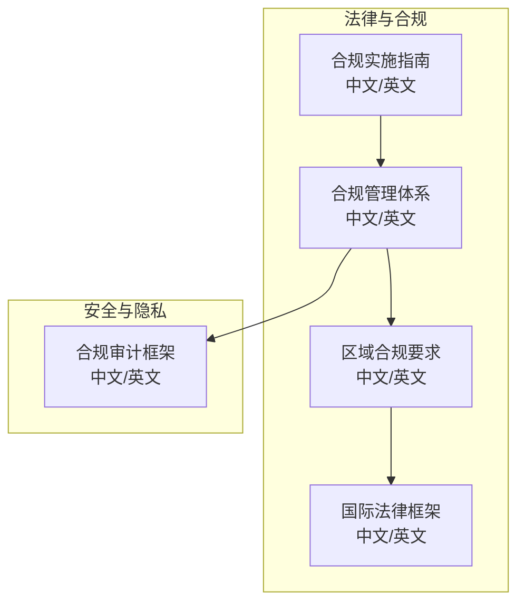
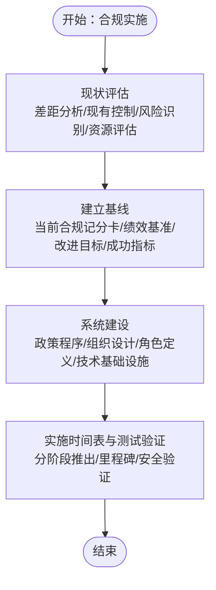
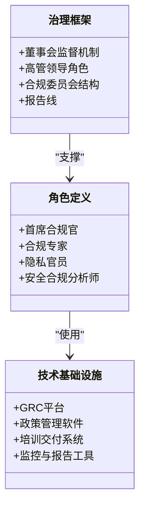
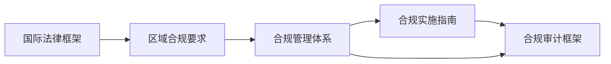

# 地区监管要求

<cite>
**本文引用的文件**
- [O-RAN 法律合规实施指南（中文）](file://25-legal-regulations/implementation-guides/o-ran-compliance-implementation-zh.md)
- [O-RAN 法律合规实施指南（英文）](file://25-legal-regulations/implementation-guides/o-ran-compliance-implementation.md)
- [O-RAN 合规管理体系（中文）](file://25-legal-regulations/compliance-system/o-ran-compliance-management-zh.md)
- [O-RAN 合规管理体系（英文）](file://25-legal-regulations/compliance-system/o-ran-compliance-management.md)
- [O-RAN 区域合规要求（中文）](file://25-legal-regulations/regional-requirements/o-ran-regional-compliance-zh.md)
- [O-RAN 区域合规要求（英文）](file://25-legal-regulations/regional-requirements/o-ran-regional-compliance.md)
- [O-RAN 国际法律框架（中文）](file://25-legal-regulations/international-laws/o-ran-international-legal-framework-zh.md)
- [O-RAN 国际法律框架（英文）](file://25-legal-regulations/international-laws/o-ran-international-legal-framework.md)
- [合规审计框架（中文）](file://12-security-privacy/compliance-auditing/compliance-auditing-framework-zh.md)
- [合规审计框架（英文）](file://12-security-privacy/compliance-auditing/compliance-auditing-framework.md)
</cite>

## 目录
1. [引言](#引言)
2. [项目结构](#项目结构)
3. [核心组件](#核心组件)
4. [架构总览](#架构总览)
5. [详细组件分析](#详细组件分析)
6. [依赖分析](#依赖分析)
7. [性能考虑](#性能考虑)
8. [故障排查指南](#故障排查指南)
9. [结论](#结论)
10. [附录](#附录)

## 引言
本文件面向O-RAN全球部署的企业与组织，围绕“地区监管要求”主题，系统梳理与落地合规实施路径。依据仓库中现有的法律合规与国际法律框架文档，结合O-RAN技术特性与跨区域运营场景，形成覆盖中国、欧盟、美国三大关键市场的合规要点与实施建议，帮助企业在满足监管要求的同时，构建可持续、可演进的合规体系。

## 项目结构
本仓库中与“地区监管要求”直接相关的内容主要分布在以下两个知识域：
- 法律合规与国际法律框架：提供合规体系、实施指南、区域合规要求以及国际法律框架的总体说明。
- 安全与隐私中的合规审计：提供合规审计框架，支撑合规体系的持续监控与改进。



图表来源
- [O-RAN 法律合规实施指南（中文）](file://25-legal-regulations/implementation-guides/o-ran-compliance-implementation-zh.md#L1-L406)
- [O-RAN 合规管理体系（中文）](file://25-legal-regulations/compliance-system/o-ran-compliance-management-zh.md)
- [O-RAN 区域合规要求（中文）](file://25-legal-regulations/regional-requirements/o-ran-regional-compliance-zh.md)
- [O-RAN 国际法律框架（中文）](file://25-legal-regulations/international-laws/o-ran-international-legal-framework-zh.md)
- [合规审计框架（中文）](file://12-security-privacy/compliance-auditing/compliance-auditing-framework-zh.md)

章节来源
- [O-RAN 法律合规实施指南（中文）](file://25-legal-regulations/implementation-guides/o-ran-compliance-implementation-zh.md#L1-L406)
- [O-RAN 合规管理体系（中文）](file://25-legal-regulations/compliance-system/o-ran-compliance-management-zh.md)
- [O-RAN 区域合规要求（中文）](file://25-legal-regulations/regional-requirements/o-ran-regional-compliance-zh.md)
- [O-RAN 国际法律框架（中文）](file://25-legal-regulations/international-laws/o-ran-international-legal-framework-zh.md)
- [合规审计框架（中文）](file://12-security-privacy/compliance-auditing/compliance-auditing-framework-zh.md)

## 核心组件
- 合规实施指南：提供从现状评估到系统建设、资源分配、培训推广、执行监控与持续改进的全流程步骤与最佳实践。
- 合规管理体系：定义治理结构、角色职责、组织设计、绩效管理与技术基础设施，支撑合规制度化运行。
- 区域合规要求：聚焦中国、欧盟、美国等关键市场的监管要点与落地建议，作为合规策略制定的基础。
- 国际法律框架：提供国际法律与监管的总体映射，辅助识别跨境合规风险与应对路径。
- 合规审计框架：提供定期审计、持续监控、自我评估与外部验证的方法论，保障合规体系的有效性。

章节来源
- [O-RAN 法律合规实施指南（中文）](file://25-legal-regulations/implementation-guides/o-ran-compliance-implementation-zh.md#L6-L110)
- [O-RAN 合规管理体系（中文）](file://25-legal-regulations/compliance-system/o-ran-compliance-management-zh.md)
- [O-RAN 区域合规要求（中文）](file://25-legal-regulations/regional-requirements/o-ran-regional-compliance-zh.md)
- [O-RAN 国际法律框架（中文）](file://25-legal-regulations/international-laws/o-ran-international-legal-framework-zh.md)
- [合规审计框架（中文）](file://12-security-privacy/compliance-auditing/compliance-auditing-framework-zh.md)

## 架构总览
下图展示了从“合规策略制定”到“执行与监控”的整体架构，强调跨区域监管要求的映射与落地路径。

```mermaid
graph TB
subgraph "策略与规划"
P1["国际法律框架"]
P2["区域合规要求"]
P3["合规管理体系"]
end
subgraph "实施与运行"
I1["合规实施指南"]
I2["合规审计框架"]
end
subgraph "结果与改进"
R1["持续监控与审计"]
R2["违规处理与改进"]
R3["最佳实践与文化"
end
P1 --> P2 --> P3 --> I1
I1 --> I2 --> R1
R1 --> R2 --> R3
```

图表来源
- [O-RAN 国际法律框架（中文）](file://25-legal-regulations/international-laws/o-ran-international-legal-framework-zh.md)
- [O-RAN 区域合规要求（中文）](file://25-legal-regulations/regional-requirements/o-ran-regional-compliance-zh.md)
- [O-RAN 合规管理体系（中文）](file://25-legal-regulations/compliance-system/o-ran-compliance-management-zh.md)
- [O-RAN 法律合规实施指南（中文）](file://25-legal-regulations/implementation-guides/o-ran-compliance-implementation-zh.md#L1-L406)
- [合规审计框架（中文）](file://12-security-privacy/compliance-auditing/compliance-auditing-framework-zh.md)

## 详细组件分析

### 合规实施指南（现状评估与系统建设）
- 现状评估：包含差距分析、现有控制评估、风险识别与资源评估，形成基线与改进目标。
- 系统建设：涵盖政策与程序制定、组织结构设计、角色定义、绩效管理与技术基础设施，明确GRC平台、培训交付系统与监控工具的集成要求。
- 实施时间表与测试验证：提供分阶段推出计划、里程碑定义与安全验证流程。



图表来源
- [O-RAN 法律合规实施指南（中文）](file://25-legal-regulations/implementation-guides/o-ran-compliance-implementation-zh.md#L8-L110)

章节来源
- [O-RAN 法律合规实施指南（中文）](file://25-legal-regulations/implementation-guides/o-ran-compliance-implementation-zh.md#L8-L110)

### 合规管理体系（治理、角色与技术基础设施）
- 治理框架：明确董事会监督、高管领导、合规委员会与报告线。
- 角色定义：首席合规官、合规专家、隐私官员、安全合规分析师等职责与能力建设。
- 技术基础设施：GRC平台、政策管理软件、培训交付系统与监控报告工具的集成与对齐。



图表来源
- [O-RAN 合规管理体系（中文）](file://25-legal-regulations/compliance-system/o-ran-compliance-management-zh.md)
- [O-RAN 法律合规实施指南（中文）](file://25-legal-regulations/implementation-guides/o-ran-compliance-implementation-zh.md#L68-L109)

章节来源
- [O-RAN 合规管理体系（中文）](file://25-legal-regulations/compliance-system/o-ran-compliance-management-zh.md)
- [O-RAN 法律合规实施指南（中文）](file://25-legal-regulations/implementation-guides/o-ran-compliance-implementation-zh.md#L68-L109)

### 区域合规要求（中国、欧盟、美国）
- 中国：聚焦网络安全、数据安全、个人信息保护与电信条例等核心法律的合规要求与实施要点。
- 欧盟：覆盖GDPR数据保护规则、NIS指令网络安全要求、数字服务法案与数字市场法案的具体影响。
- 美国：涵盖FCC规则、CLOUD法案跨境数据访问、出口管制与州级隐私法律的合规要求。
- 差异对比：基于上述三地监管差异，为企业制定全球化合规策略提供参考。

章节来源
- [O-RAN 区域合规要求（中文）](file://25-legal-regulations/regional-requirements/o-ran-regional-compliance-zh.md)
- [O-RAN 区域合规要求（英文）](file://25-legal-regulations/regional-requirements/o-ran-regional-compliance.md)

### 国际法律框架（跨境与多法域映射）
- 提供国际法律与监管的总体映射，辅助识别跨境合规风险与应对路径，支撑区域合规要求的制定与落地。

章节来源
- [O-RAN 国际法律框架（中文）](file://25-legal-regulations/international-laws/o-ran-international-legal-framework-zh.md)
- [O-RAN 国际法律框架（英文）](file://25-legal-regulations/international-laws/o-ran-international-legal-framework.md)

### 合规审计框架（持续监控与改进）
- 定期合规审计、持续监控系统、自我评估项目与外部验证，形成闭环的合规质量保证机制。
- 结合违规处理与持续改进，推动合规文化与最佳实践落地。

章节来源
- [合规审计框架（中文）](file://12-security-privacy/compliance-auditing/compliance-auditing-framework-zh.md)
- [合规审计框架（英文）](file://12-security-privacy/compliance-auditing/compliance-auditing-framework.md)

## 依赖分析
合规体系内部各组件之间存在强耦合与协同关系：
- 国际法律框架与区域合规要求共同决定合规策略方向；
- 合规管理体系为策略落地提供组织与技术支撑；
- 合规实施指南承接策略与体系，形成可执行的操作手册；
- 合规审计框架贯穿实施全过程，保障体系有效运行与持续改进。



图表来源
- [O-RAN 国际法律框架（中文）](file://25-legal-regulations/international-laws/o-ran-international-legal-framework-zh.md)
- [O-RAN 区域合规要求（中文）](file://25-legal-regulations/regional-requirements/o-ran-regional-compliance-zh.md)
- [O-RAN 合规管理体系（中文）](file://25-legal-regulations/compliance-system/o-ran-compliance-management-zh.md)
- [O-RAN 法律合规实施指南（中文）](file://25-legal-regulations/implementation-guides/o-ran-compliance-implementation-zh.md#L1-L406)
- [合规审计框架（中文）](file://12-security-privacy/compliance-auditing/compliance-auditing-framework-zh.md)

## 性能考虑
- 合规体系的“性能”体现在：合规目标达成率、风险暴露降低、审计通过率、违规事件数量下降、员工合规意识提升等指标。
- 建议通过持续监控与审计、关键绩效指标（KPI）与成功指标的设定，以及定期的体系评估与改进，实现合规体系的高效运行与持续优化。

## 故障排查指南
- 合规审计与监控：定期开展合规审计、持续监控与自我评估，识别薄弱环节与改进机会。
- 违规处理与改进：建立违规响应程序、根本原因分析与纠正措施实施机制，推动体系持续改进。
- 文化与沟通：通过合规冠军、认可与奖励、持续沟通与改进建议机制，营造全员参与的合规文化。

章节来源
- [O-RAN 法律合规实施指南（中文）](file://25-legal-regulations/implementation-guides/o-ran-compliance-implementation-zh.md#L304-L352)
- [合规审计框架（中文）](file://12-security-privacy/compliance-auditing/compliance-auditing-framework-zh.md)

## 结论
通过国际法律框架与区域合规要求的映射，结合合规管理体系与实施指南，企业可在O-RAN技术部署中建立系统化、可操作、可持续的合规体系。配合合规审计框架的持续监控与改进，能够有效降低合规风险、提升运营效率，并为全球化合规策略提供坚实支撑。

## 附录
- 术语与缩写：GRC（治理、风险、合规）、KPI（关键绩效指标）、CAF（合规审计框架）。
- 参考文件路径：请参阅“章节来源”与“图表来源”中列出的文件与行号，以获取更详细的实施步骤与最佳实践。