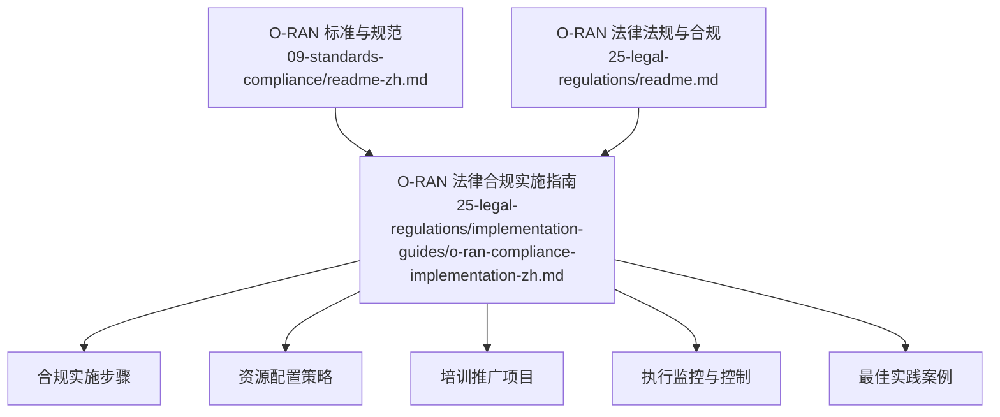
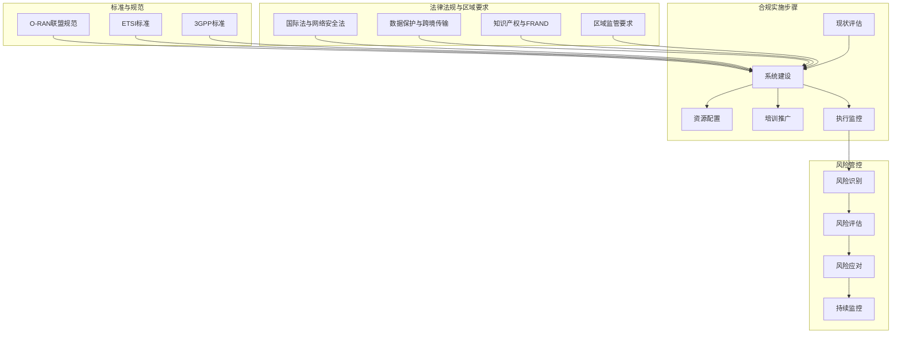
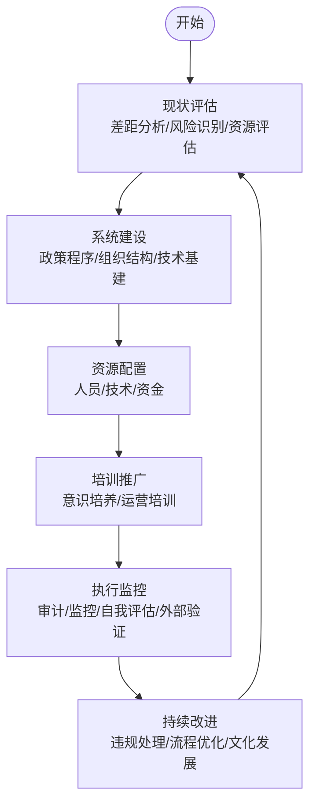
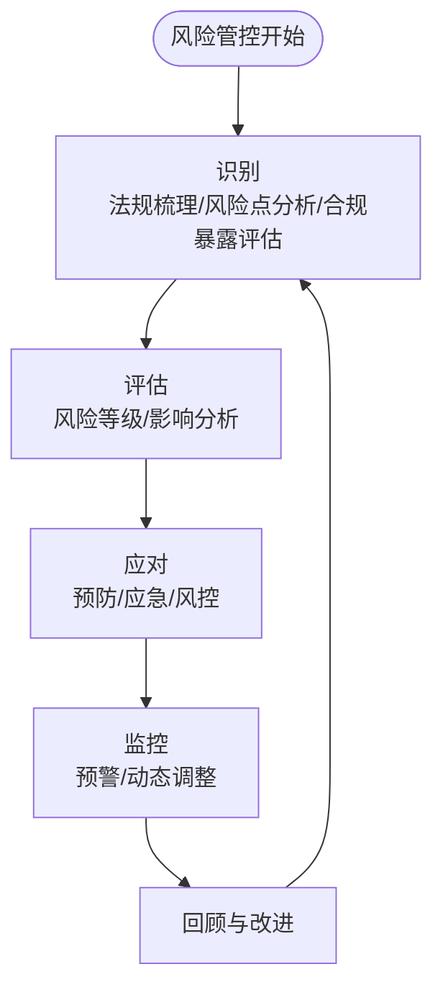
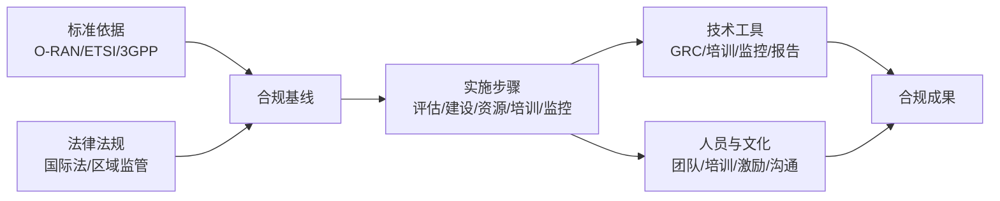

# 实施指南

<cite>
**本文引用的文件**
- [O-RAN 标准与规范](file://09-standards-compliance/readme-zh.md)
- [O-RAN 法律合规实施指南](file://25-legal-regulations/implementation-guides/o-ran-compliance-implementation-zh.md)
- [O-RAN 法律法规与合规](file://25-legal-regulations/readme.md)
</cite>

## 目录
1. [引言](#引言)
2. [项目结构](#项目结构)
3. [核心组件](#核心组件)
4. [架构总览](#架构总览)
5. [详细组件分析](#详细组件分析)
6. [依赖分析](#依赖分析)
7. [性能考虑](#性能考虑)
8. [故障排查指南](#故障排查指南)
9. [结论](#结论)
10. [附录](#附录)

## 引言
本实施指南面向O-RAN合规落地，围绕“现状评估—系统建设—资源配置—培训推广—执行监控”五大阶段，结合O-RAN联盟、ETSI与3GPP标准，以及国际与区域法律法规，提供可操作的步骤清单、最佳实践案例与风险管控建议，帮助组织建立可持续的合规管理体系，确保O-RAN部署合法合规、稳定运行。

## 项目结构
本仓库包含O-RAN标准与规范、合规实施指南、法律法规与区域要求等专题文档，便于从“标准依据—合规框架—落地步骤—风险控制”四个维度构建合规体系。

图表来源
- [O-RAN 标准与规范](file://09-standards-compliance/readme-zh.md#L1-L371)
- [O-RAN 法律合规实施指南](file://25-legal-regulations/implementation-guides/o-ran-compliance-implementation-zh.md#L1-L406)
- [O-RAN 法律法规与合规](file://25-legal-regulations/readme.md#L1-L74)

章节来源
- [O-RAN 标准与规范](file://09-standards-compliance/readme-zh.md#L1-L371)
- [O-RAN 法律合规实施指南](file://25-legal-regulations/implementation-guides/o-ran-compliance-implementation-zh.md#L1-L406)
- [O-RAN 法律法规与合规](file://25-legal-regulations/readme.md#L1-L74)

## 核心组件
- 标准依据与合规验证：明确O-RAN联盟、ETSI、3GPP标准要求，建立自评估、互操作性测试、第三方认证与持续监控机制。
- 合规实施步骤：覆盖现状评估、系统建设、资源配置、培训推广、执行监控等关键环节。
- 法律法规与区域要求：梳理国际法、网络安全法、数据保护法、知识产权法及区域监管要求，形成合规基线。
- 风险识别与应对：建立风险识别、评估、响应与持续监控机制，保障合规稳健推进。

章节来源
- [O-RAN 标准与规范](file://09-standards-compliance/readme-zh.md#L110-L135)
- [O-RAN 法律合规实施指南](file://25-legal-regulations/implementation-guides/o-ran-compliance-implementation-zh.md#L8-L42)
- [O-RAN 法律法规与合规](file://25-legal-regulations/readme.md#L6-L59)

## 架构总览
下图展示合规实施的总体架构：以标准依据为“基座”，以合规实施步骤为“路径”，以资源配置与培训推广为“支撑”，以执行监控与风险控制为“保障”。

图表来源
- [O-RAN 标准与规范](file://09-standards-compliance/readme-zh.md#L8-L135)
- [O-RAN 法律合规实施指南](file://25-legal-regulations/implementation-guides/o-ran-compliance-implementation-zh.md#L60-L67)
- [O-RAN 法律法规与合规](file://25-legal-regulations/readme.md#L6-L59)

## 详细组件分析

### 合规实施步骤清单
- 阶段一：现状评估
  - 差距分析：监管要求清单、现有控制评估、风险识别、资源评估
  - 利益相关者参与：高管对齐、部门咨询、员工意识评估、客户影响评估
  - 基线建立：当前合规记分卡、绩效基准、改进目标、成功指标
- 阶段二：系统建设
  - 政策与程序：核心政策框架、实施程序、培训与沟通、文档管理
  - 组织结构：治理框架、资源分配、角色定义、绩效管理
  - 技术基础设施：合规管理系统、集成要求、实施时间表、测试与验证
- 阶段三：资源配置
  - 人员部署：核心合规团队、扩展合规资源、组织整合
  - 技术支持与资金：技术投资、预算分配框架、应急规划、投资回报测量、资源优化
- 阶段四：培训推广
  - 合规意识培养：高管领导培训、管理层发展、员工教育、专业化培训项目
  - 运营培训实施：实践应用培训、技术平台培训、持续学习项目、绩效支持资源
- 阶段五：执行监控
  - 合规检查框架：定期合规审计、持续监控系统、自我评估项目、外部验证
  - 违规处理与持续改进：违规响应程序、绩效分析、系统增强、文化发展

图表来源
- [O-RAN 法律合规实施指南](file://25-legal-regulations/implementation-guides/o-ran-compliance-implementation-zh.md#L8-L42)
- [O-RAN 法律合规实施指南](file://25-legal-regulations/implementation-guides/o-ran-compliance-implementation-zh.md#L44-L110)
- [O-RAN 法律合规实施指南](file://25-legal-regulations/implementation-guides/o-ran-compliance-implementation-zh.md#L112-L248)
- [O-RAN 法律合规实施指南](file://25-legal-regulations/implementation-guides/o-ran-compliance-implementation-zh.md#L250-L300)
- [O-RAN 法律合规实施指南](file://25-legal-regulations/implementation-guides/o-ran-compliance-implementation-zh.md#L302-L352)

章节来源
- [O-RAN 法律合规实施指南](file://25-legal-regulations/implementation-guides/o-ran-compliance-implementation-zh.md#L6-L352)

### 合规系统建设方法
- 合规政策制定
  - 明确数据保护、网络安全、隐私合规、运营指南等核心政策
  - 建立实施程序、角色与责任矩阵、决策协议、异常处理流程
- 流程设计
  - 将合规纳入日常运营流程，设置审查周期、版本控制、访问控制与存档保留
- 技术工具选择
  - GRC平台、政策管理软件、培训交付系统、监控与报告工具
  - 确保与现有系统兼容、数据流集成、API连接与安全架构对齐
- 人员培训
  - 高管领导培训、管理层合规项目、员工角色特定培训、专业化认证与持续学习

章节来源
- [O-RAN 法律合规实施指南](file://25-legal-regulations/implementation-guides/o-ran-compliance-implementation-zh.md#L47-L67)
- [O-RAN 法律合规实施指南](file://25-legal-regulations/implementation-guides/o-ran-compliance-implementation-zh.md#L90-L109)
- [O-RAN 法律合规实施指南](file://25-legal-regulations/implementation-guides/o-ran-compliance-implementation-zh.md#L252-L300)

### 合规风险管控指南
- 风险识别
  - 法律法规梳理、风险点分析、合规暴露评估、潜在处罚与运营影响评估
- 风险评估
  - 风险等级评价、影响程度分析
- 风险应对
  - 预防措施、应急预案、损失控制
- 监控机制
  - 风险监控、预警机制、动态调整

图表来源
- [O-RAN 法律法规与合规](file://25-legal-regulations/readme.md#L54-L59)
- [O-RAN 法律合规实施指南](file://25-legal-regulations/implementation-guides/o-ran-compliance-implementation-zh.md#L329-L352)

章节来源
- [O-RAN 法律法规与合规](file://25-legal-regulations/readme.md#L54-L59)
- [O-RAN 法律合规实施指南](file://25-legal-regulations/implementation-guides/o-ran-compliance-implementation-zh.md#L329-L352)

### 合规最佳实践案例
- 顶层设计
  - 高管领导承诺、整体规划方法、系统性实施、持续演进
- 全员参与
  - 文化整合、跨部门协作、利益相关者参与、持续沟通
- 技术支持
  - 合规管理系统、自动化工具、数据分析与可视化
- 持续改进
  - 定期框架评估、适应性改进、创新整合、最佳实践采用
- 文化建设
  - 合规冠军项目、认可与奖励、沟通增强、持续改进文化

章节来源
- [O-RAN 法律合规实施指南](file://25-legal-regulations/implementation-guides/o-ran-compliance-implementation-zh.md#L356-L404)

### 标准与规范的合规验证
- 合规要求
  - O-RAN联盟、ETSI、3GPP、区域监管与行业特定要求
- 认证流程
  - O-RAN认证程序、符合性测试认证、互操作性测试认证、安全认证、行业认证
- 测试实验室
  - 认证实验室列表、能力要求、测试设备与工具、测试程序与报告
- 合规验证
  - 自评估程序、第三方审核、合规报告、不符合项处理、持续合规监控

章节来源
- [O-RAN 标准与规范](file://09-standards-compliance/readme-zh.md#L110-L135)

## 依赖分析
合规体系的构建依赖于三大支柱：
- 标准依据：O-RAN联盟、ETSI、3GPP标准构成技术与接口合规基线
- 法律法规：国际法、网络安全法、数据保护法、知识产权法与区域监管要求构成法律合规基线
- 实施步骤：现状评估—系统建设—资源配置—培训推广—执行监控形成闭环

图表来源
- [O-RAN 标准与规范](file://09-standards-compliance/readme-zh.md#L8-L135)
- [O-RAN 法律法规与合规](file://25-legal-regulations/readme.md#L6-L59)
- [O-RAN 法律合规实施指南](file://25-legal-regulations/implementation-guides/o-ran-compliance-implementation-zh.md#L60-L67)

章节来源
- [O-RAN 标准与规范](file://09-standards-compliance/readme-zh.md#L8-L135)
- [O-RAN 法律法规与合规](file://25-legal-regulations/readme.md#L6-L59)
- [O-RAN 法律合规实施指南](file://25-legal-regulations/implementation-guides/o-ran-compliance-implementation-zh.md#L60-L67)

## 性能考虑
- 合规流程的效率与质量
  - 通过自动化工具减少重复劳动，提升合规检查与监控效率
  - 建立基于风险的审计与监控优先级，集中资源于高风险领域
- 技术系统的可扩展性
  - 合规管理系统应具备良好的扩展性与与现有IT架构的兼容性
- 培训与认知提升
  - 通过持续培训与沟通，降低人为错误导致的合规风险

## 故障排查指南
- 合规审计与监控
  - 定期开展合规审计，关注高风险领域；利用持续监控系统进行实时异常检测
- 自我评估与外部验证
  - 建立部门自我评估机制，配合第三方审计与监管检查准备
- 违规处理与改进
  - 对违规事件进行快速响应、彻底调查、适当处置与纠正措施落实
  - 基于绩效分析识别根本原因，推动流程优化与系统增强

章节来源
- [O-RAN 法律合规实施指南](file://25-legal-regulations/implementation-guides/o-ran-compliance-implementation-zh.md#L304-L352)

## 结论
通过以标准依据为基座、以实施步骤为主线、以资源配置与培训推广为支撑、以执行监控与风险控制为保障，组织可系统性地建立可持续的O-RAN合规管理体系。建议优先完成现状评估与系统建设，同步推进资源配置与培训推广，并以持续监控与风险管控为抓手，不断迭代优化，确保O-RAN部署的合法合规与高效运营。

## 附录
- 参考资料与学习资源
  - O-RAN联盟官方文档、ETSI标准、3GPP规范、白皮书与部署指南
- 实验室项目与最佳实践
  - 合规性评估、接口测试、多厂商集成测试、Plugfest参与、认证准备与生产环境最佳实践

章节来源
- [O-RAN 标准与规范](file://09-standards-compliance/readme-zh.md#L248-L335)