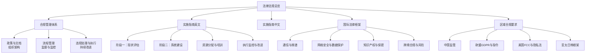
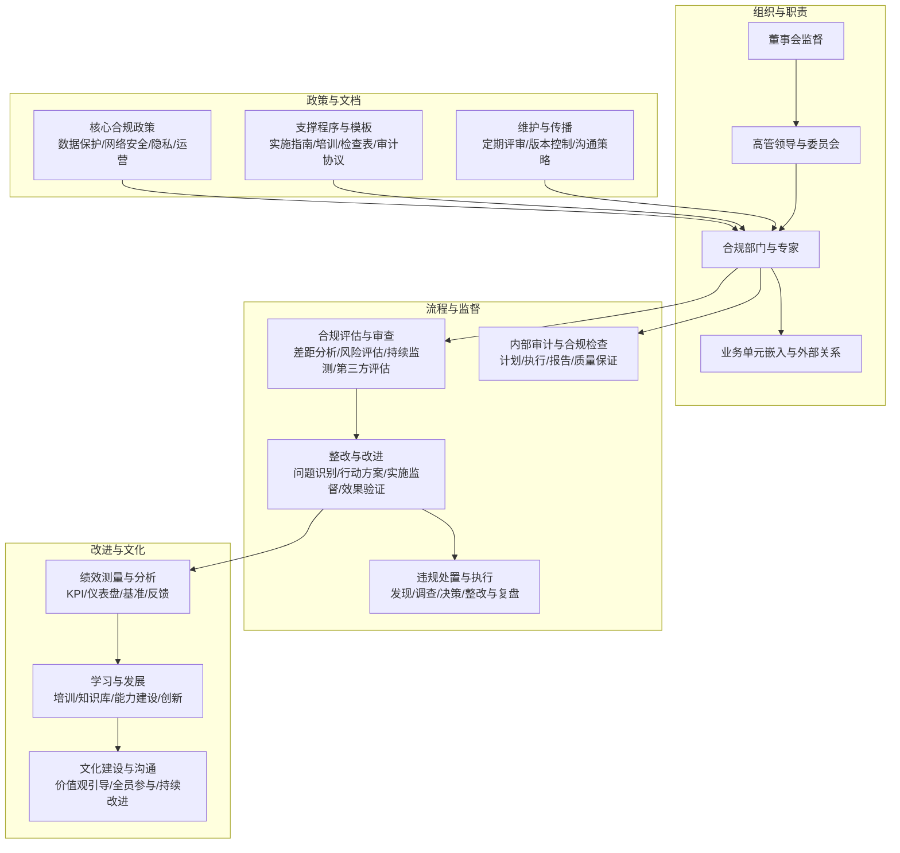
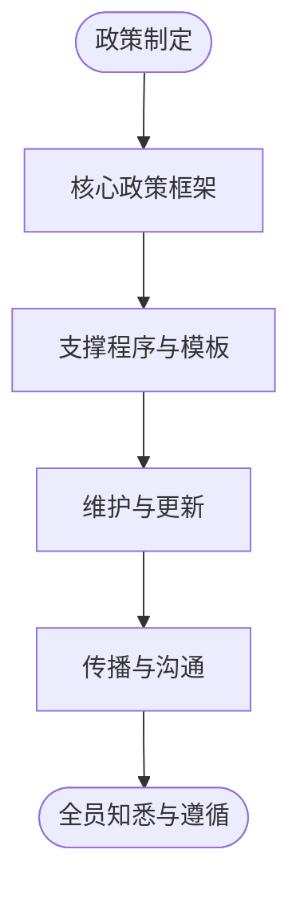
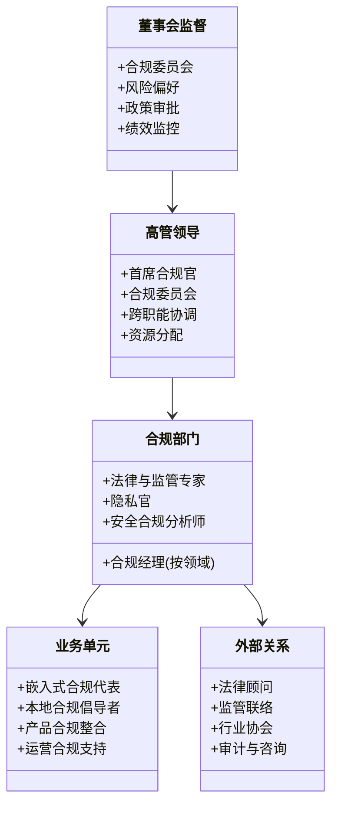
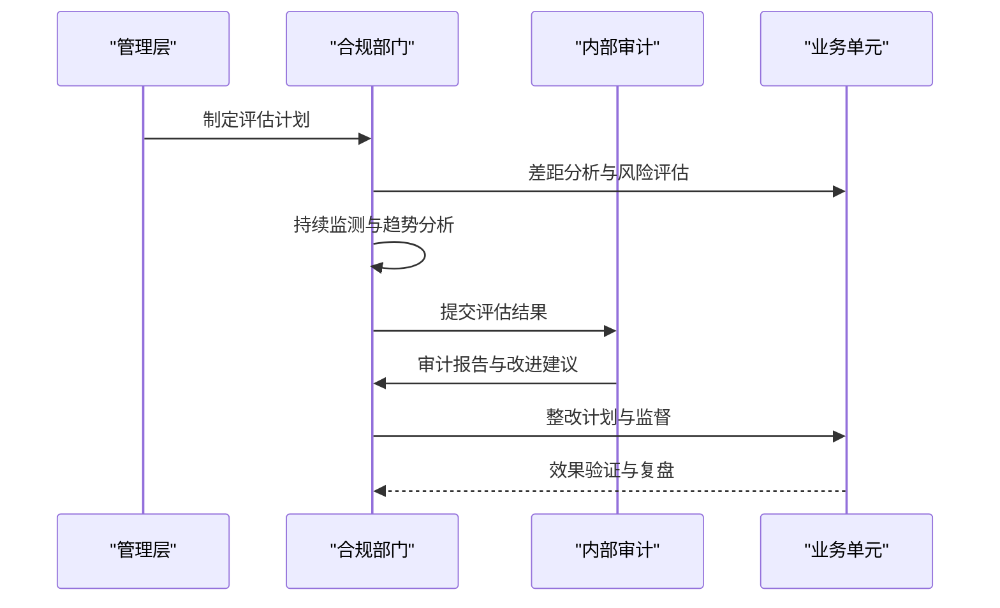
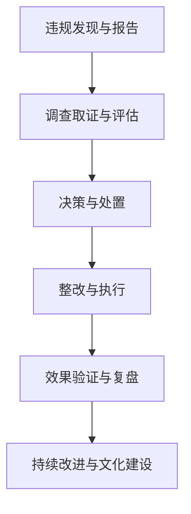
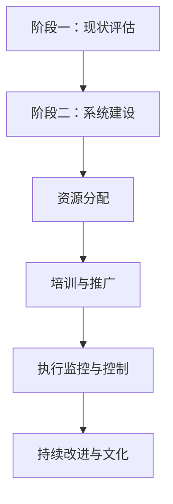
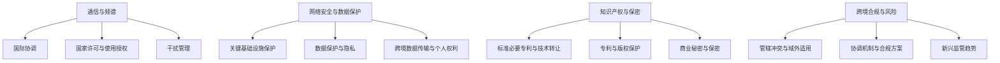
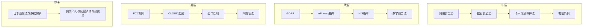
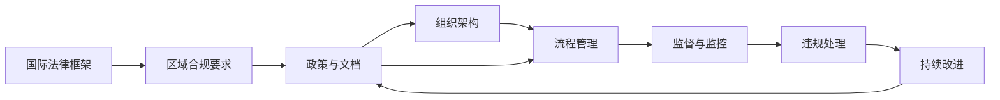

# 法律法规

<cite>
**本文引用的文件**
- [法律法规总览](file://25-legal-regulations/readme.md)
- [合规管理体系](file://25-legal-regulations/compliance-system/o-ran-compliance-management.md)
- [实施指南（英文）](file://25-legal-regulations/implementation-guides/o-ran-compliance-implementation.md)
- [实施指南（中文）](file://25-legal-regulations/implementation-guides/o-ran-compliance-implementation-zh.md)
- [国际法律框架](file://25-legal-regulations/international-laws/o-ran-international-legal-framework.md)
- [区域合规要求](file://25-legal-regulations/regional-requirements/o-ran-regional-compliance.md)
</cite>

## 目录
1. [引言](#引言)
2. [项目结构](#项目结构)
3. [核心组件](#核心组件)
4. [架构总览](#架构总览)
5. [详细组件分析](#详细组件分析)
6. [依赖分析](#依赖分析)
7. [性能考虑](#性能考虑)
8. [故障排查指南](#故障排查指南)
9. [结论](#结论)
10. [附录](#附录)

## 引言
本文件面向O-RAN技术部署中的法律法规与合规管理，系统梳理国际法律框架、区域监管要求、合规管理体系、实施指南、风险识别与管理、以及合规文化建设等关键主题。内容基于仓库中“25-legal-regulations”目录下的权威文档，旨在为组织提供可落地的合规指导与最佳实践，确保在多司法辖区环境下实现稳健、可持续的合规运营。

## 项目结构
“25-legal-regulations”目录下包含四个子主题文档，分别覆盖：
- 法律法规总览：概览国际法律、区域监管、合规体系与实施要点
- 合规管理体系：合规政策、组织架构、流程管理、监督与违规处置、持续改进
- 实施指南（中/英）：从现状评估到系统建设、资源分配、培训推广、执行监控与持续改进的全流程步骤
- 国际法律框架：通信、网络安全、知识产权与跨境合规的国际规则与风险应对
- 区域合规要求：中国、欧盟、美国及亚太主要国家的监管要点与比较分析

图表来源
- [法律法规总览](file://25-legal-regulations/readme.md#L1-L74)
- [合规管理体系](file://25-legal-regulations/compliance-system/o-ran-compliance-management.md#L1-L287)
- [实施指南（英文）](file://25-legal-regulations/implementation-guides/o-ran-compliance-implementation.md#L1-L406)
- [国际法律框架](file://25-legal-regulations/international-laws/o-ran-international-legal-framework.md#L1-L266)
- [区域合规要求](file://25-legal-regulations/regional-requirements/o-ran-regional-compliance.md#L1-L318)

章节来源
- [法律法规总览](file://25-legal-regulations/readme.md#L1-L74)

## 核心组件
- 合规政策与文档体系：明确数据保护、网络安全、隐私与运营合规的核心政策，配套实施指南、培训材料、检查表与审计协议，并建立定期评审与版本控制机制。
- 组织架构与职责：构建由董事会监督、高管领导、合规部门执行、业务单元嵌入与外部关系协同组成的治理框架。
- 流程管理与监督：以差距分析、风险评估、持续监测与第三方评估为核心的系统化评估；以问题识别、整改计划、实施监督与效果验证的闭环改进。
- 违规处理与持续改进：建立违规发现、调查、决策与处置流程，配套纪律与补救措施、财务后果与声誉管理；以指标、仪表盘、基准对比与反馈机制推动持续优化。
- 实施步骤与最佳实践：从现状评估、系统建设、资源分配、培训推广到执行监控与改进的文化建设，形成可复制的推进方法论。

章节来源
- [合规管理体系](file://25-legal-regulations/compliance-system/o-ran-compliance-management.md#L8-L77)
- [合规管理体系](file://25-legal-regulations/compliance-system/o-ran-compliance-management.md#L79-L181)
- [合规管理体系](file://25-legal-regulations/compliance-system/o-ran-compliance-management.md#L183-L287)
- [实施指南（英文）](file://25-legal-regulations/implementation-guides/o-ran-compliance-implementation.md#L6-L110)
- [实施指南（英文）](file://25-legal-regulations/implementation-guides/o-ran-compliance-implementation.md#L302-L406)

## 架构总览
合规架构围绕“政策—组织—流程—监督—改进”的闭环展开，强调跨职能协同、技术支撑与文化塑造：

图表来源
- [合规管理体系](file://25-legal-regulations/compliance-system/o-ran-compliance-management.md#L8-L77)
- [合规管理体系](file://25-legal-regulations/compliance-system/o-ran-compliance-management.md#L79-L181)
- [合规管理体系](file://25-legal-regulations/compliance-system/o-ran-compliance-management.md#L183-L287)

## 详细组件分析

### 合规政策与文档体系
- 核心政策维度：数据保护、网络安全、隐私与运营合规，覆盖数据处理、跨境传输、事件响应、漏洞管理、访问控制与设备认证等关键点。
- 支撑程序：实施指南、培训材料、检查表与审计协议，确保政策可执行、可验证、可追溯。
- 维护与传播：定期评审、版本控制、利益相关方反馈与监管更新纳入，保障政策时效性与适用性。

图表来源
- [合规管理体系](file://25-legal-regulations/compliance-system/o-ran-compliance-management.md#L8-L47)

章节来源
- [合规管理体系](file://25-legal-regulations/compliance-system/o-ran-compliance-management.md#L8-L47)

### 组织架构与职责
- 董事会监督：合规委员会、风险偏好、政策审批与绩效监控。
- 高管领导：首席合规官、合规委员会、跨职能协调与资源配置。
- 合规部门：按领域划分的合规经理、法律与监管专家、隐私官与安全合规分析师。
- 业务单元与外部关系：嵌入式合规代表、本地合规倡导者、产品合规整合、外部法律顾问与审计师协作。

图表来源
- [合规管理体系](file://25-legal-regulations/compliance-system/o-ran-compliance-management.md#L49-L77)

章节来源
- [合规管理体系](file://25-legal-regulations/compliance-system/o-ran-compliance-management.md#L49-L77)

### 流程管理与监督
- 合规评估与审查：差距分析、风险评估、持续监测与第三方评估，确保合规状态可控。
- 整改与改进：问题分类、行动方案、实施监督与效果验证，形成闭环。
- 内部审计与合规检查：计划、执行、报告与质量保证，结合自动化与人工检查、关键指标与预警系统。

图表来源
- [合规管理体系](file://25-legal-regulations/compliance-system/o-ran-compliance-management.md#L79-L181)

章节来源
- [合规管理体系](file://25-legal-regulations/compliance-system/o-ran-compliance-management.md#L79-L181)

### 违规处理与持续改进
- 违规响应：违规发现与报告、调查取证、决策与处置、整改与复盘。
- 处置与补救：渐进式纪律、组织性补救、财务后果与声誉管理。
- 持续改进：指标与仪表盘、基准对比、反馈集成与学习发展。

图表来源
- [合规管理体系](file://25-legal-regulations/compliance-system/o-ran-compliance-management.md#L183-L287)

章节来源
- [合规管理体系](file://25-legal-regulations/compliance-system/o-ran-compliance-management.md#L183-L287)

### 实施指南（英文）
- 阶段一：现状评估——差距分析、现有控制评估、风险识别与资源评估，建立基线。
- 阶段二：系统建设——政策与程序、组织结构、技术基础设施与测试验证。
- 资源分配——人员部署、技术与资金、资源优化与绩效监控。
- 培训与推广——意识培养、运营培训与持续支持。
- 执行监控与控制——合规检查框架、违规处理与持续改进。
- 最佳实践——顶层设计、全员参与、技术支撑与文化发展。

图表来源
- [实施指南（英文）](file://25-legal-regulations/implementation-guides/o-ran-compliance-implementation.md#L6-L110)
- [实施指南（英文）](file://25-legal-regulations/implementation-guides/o-ran-compliance-implementation.md#L302-L406)

章节来源
- [实施指南（英文）](file://25-legal-regulations/implementation-guides/o-ran-compliance-implementation.md#L6-L110)
- [实施指南（英文）](file://25-legal-regulations/implementation-guides/o-ran-compliance-implementation.md#L302-L406)

### 实施指南（中文）
- 阶段一：现状评估——监管要求清单、现有控制评估、风险识别与资源评估，建立基线。
- 阶段二：系统建设——政策与程序、组织结构、技术基础设施与测试验证。
- 资源分配——人员部署、技术与资金、资源优化与绩效监控。
- 培训与推广——意识培养、运营培训与持续支持。
- 执行监控与控制——合规检查框架、违规处理与持续改进。
- 最佳实践——顶层设计、全员参与、技术支撑与文化发展。

章节来源
- [实施指南（中文）](file://25-legal-regulations/implementation-guides/o-ran-compliance-implementation-zh.md#L8-L42)
- [实施指南（中文）](file://25-legal-regulations/implementation-guides/o-ran-compliance-implementation-zh.md#L44-L110)
- [实施指南（中文）](file://25-legal-regulations/implementation-guides/o-ran-compliance-implementation-zh.md#L112-L248)
- [实施指南（中文）](file://25-legal-regulations/implementation-guides/o-ran-compliance-implementation-zh.md#L250-L406)

### 国际法律框架
- 通信与频谱：国际协调、国家许可、使用授权与干扰管理。
- 网络安全与数据保护：关键基础设施保护、数据安全与隐私、跨境数据传输、个人权利与安全保障。
- 知识产权与保密：标准必要专利、专利策略、版权与软件保护、技术秘密与保密。
- 跨境合规与风险：管辖冲突、域外适用、协调机制与合规解决方案；新兴监管趋势（AI、IoT、5G/6G、量子）。

图表来源
- [国际法律框架](file://25-legal-regulations/international-laws/o-ran-international-legal-framework.md#L6-L187)
- [国际法律框架](file://25-legal-regulations/international-laws/o-ran-international-legal-framework.md#L189-L266)

章节来源
- [国际法律框架](file://25-legal-regulations/international-laws/o-ran-international-legal-framework.md#L6-L187)
- [国际法律框架](file://25-legal-regulations/international-laws/o-ran-international-legal-framework.md#L189-L266)

### 区域合规要求
- 中国：网络安全法、数据安全法、个人信息保护法、电信条例；关键信息基础设施、数据跨境传输、网络产品安全与合规管理。
- 欧盟：GDPR、ePrivacy指令、NIS指令、数字服务法；数据主体权利、网络与信息系统安全、在线平台责任。
- 美国：FCC规则、CLOUD法案、出口管制、州隐私法；频谱管理、设备授权、网络安全、消费者保护与各州隐私法。
- 亚太：日本、韩国等国家的通信法、个人数据保护法、网络安全法与技术认证要求。
- 区域比较与协调：数据保护、网络安全、设备认证与市场准入的比较分析与区域合作框架。

图表来源
- [区域合规要求](file://25-legal-regulations/regional-requirements/o-ran-regional-compliance.md#L6-L108)
- [区域合规要求](file://25-legal-regulations/regional-requirements/o-ran-regional-compliance.md#L110-L160)
- [区域合规要求](file://25-legal-regulations/regional-requirements/o-ran-regional-compliance.md#L162-L212)
- [区域合规要求](file://25-legal-regulations/regional-requirements/o-ran-regional-compliance.md#L214-L318)

章节来源
- [区域合规要求](file://25-legal-regulations/regional-requirements/o-ran-regional-compliance.md#L6-L108)
- [区域合规要求](file://25-legal-regulations/regional-requirements/o-ran-regional-compliance.md#L110-L160)
- [区域合规要求](file://25-legal-regulations/regional-requirements/o-ran-regional-compliance.md#L162-L212)
- [区域合规要求](file://25-legal-regulations/regional-requirements/o-ran-regional-compliance.md#L214-L318)

## 依赖分析
- 政策与组织：合规政策需与组织架构匹配，确保职责清晰、资源到位、跨职能协同顺畅。
- 流程与监督：评估与改进流程依赖于持续监测与审计，形成闭环；违规处置依赖于明确的流程与制度保障。
- 实施与文档：实施指南与合规管理体系相互支撑，前者提供落地步骤，后者提供制度保障。
- 国际与区域：国际法律框架为区域合规提供通用规则与风险应对思路，区域要求细化具体义务与执行方式。

图表来源
- [合规管理体系](file://25-legal-regulations/compliance-system/o-ran-compliance-management.md#L8-L181)
- [国际法律框架](file://25-legal-regulations/international-laws/o-ran-international-legal-framework.md#L1-L266)
- [区域合规要求](file://25-legal-regulations/regional-requirements/o-ran-regional-compliance.md#L1-L318)

章节来源
- [合规管理体系](file://25-legal-regulations/compliance-system/o-ran-compliance-management.md#L8-L181)
- [国际法律框架](file://25-legal-regulations/international-laws/o-ran-international-legal-framework.md#L1-L266)
- [区域合规要求](file://25-legal-regulations/regional-requirements/o-ran-regional-compliance.md#L1-L318)

## 性能考虑
- 合规效率：通过自动化合规检查、统一的合规管理系统与集中化监控，降低人工成本与提升响应速度。
- 风险优先级：基于风险评估与概率分析，优化资源配置，聚焦高影响/高概率风险，提高投入产出比。
- 指标与仪表盘：建立关键绩效指标与可视化仪表盘，快速识别趋势与薄弱环节，支持及时调整策略。
- 持续改进：定期评估与反馈集成，推动流程优化与技术创新，保持合规体系的敏捷性与前瞻性。

## 故障排查指南
- 合规评估与差距分析：核对监管要求清单、现有控制与风险识别是否完整，确保基线建立准确。
- 组织与职责：确认合规委员会、首席合规官与业务单元代表的职责边界与汇报关系是否清晰。
- 流程与监督：检查持续监测系统、异常检测与趋势分析是否运行正常，审计与整改流程是否闭环。
- 违规处置：核查违规发现、调查取证、决策与处置流程是否规范，整改与复盘是否落实。
- 实施与培训：评估培训覆盖率、系统使用情况与员工反馈，确保政策有效传达与执行。

章节来源
- [合规管理体系](file://25-legal-regulations/compliance-system/o-ran-compliance-management.md#L79-L181)
- [合规管理体系](file://25-legal-regulations/compliance-system/o-ran-compliance-management.md#L183-L287)
- [实施指南（英文）](file://25-legal-regulations/implementation-guides/o-ran-compliance-implementation.md#L302-L406)

## 结论
通过系统化的合规政策、清晰的组织架构、严格的流程管理与持续的监督改进，结合国际法律框架与区域监管要求的深入理解，O-RAN技术公司可以在复杂的多司法辖区环境中实现稳健合规运营。实施指南提供了可操作的步骤与最佳实践，有助于组织自上而下推动合规文化建设，实现可持续增长与创新。

## 附录
- 法律法规总览：国际法律、区域监管、合规体系与实施要点概览。
- 合规管理体系：政策、组织、流程、监督与改进的系统化框架。
- 实施指南（中/英）：从现状评估到系统建设、资源分配、培训推广与执行监控的全流程步骤。
- 国际法律框架：通信、网络安全、知识产权与跨境合规的国际规则与风险应对。
- 区域合规要求：中国、欧盟、美国及亚太主要国家的监管要点与比较分析。

章节来源
- [法律法规总览](file://25-legal-regulations/readme.md#L1-L74)
- [合规管理体系](file://25-legal-regulations/compliance-system/o-ran-compliance-management.md#L1-L287)
- [实施指南（英文）](file://25-legal-regulations/implementation-guides/o-ran-compliance-implementation.md#L1-L406)
- [实施指南（中文）](file://25-legal-regulations/implementation-guides/o-ran-compliance-implementation-zh.md#L1-L406)
- [国际法律框架](file://25-legal-regulations/international-laws/o-ran-international-legal-framework.md#L1-L266)
- [区域合规要求](file://25-legal-regulations/regional-requirements/o-ran-regional-compliance.md#L1-L318)