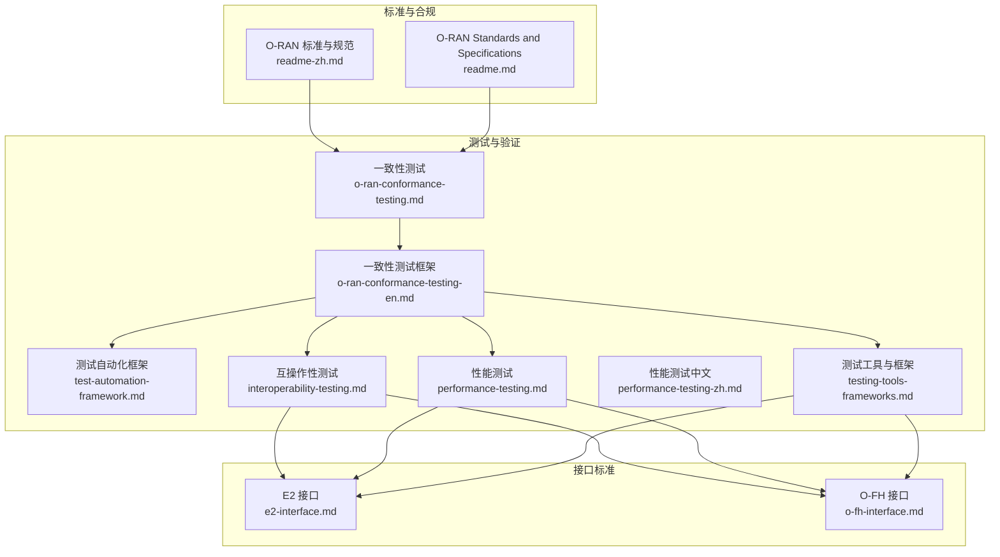
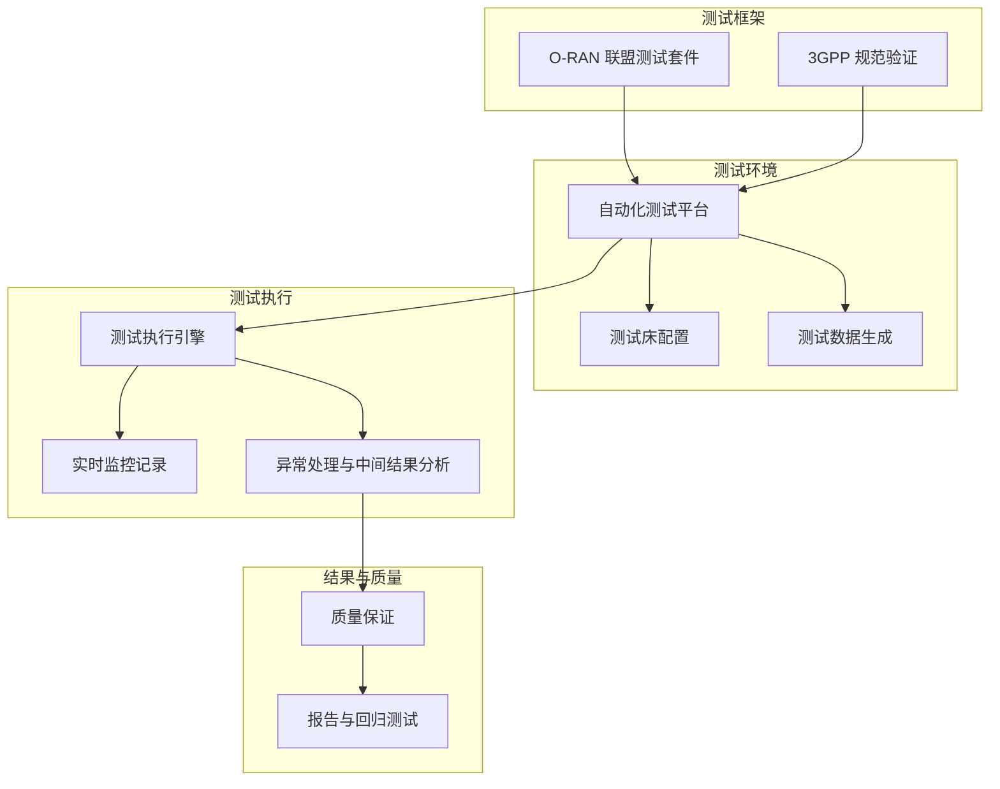
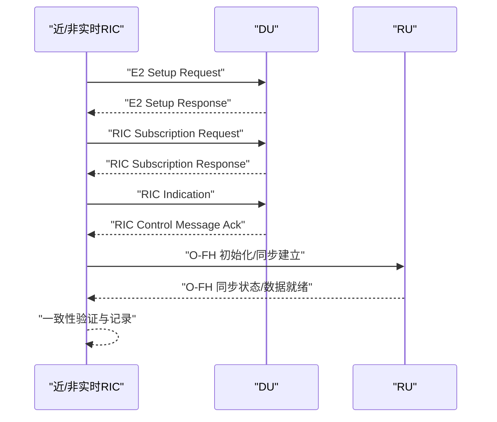
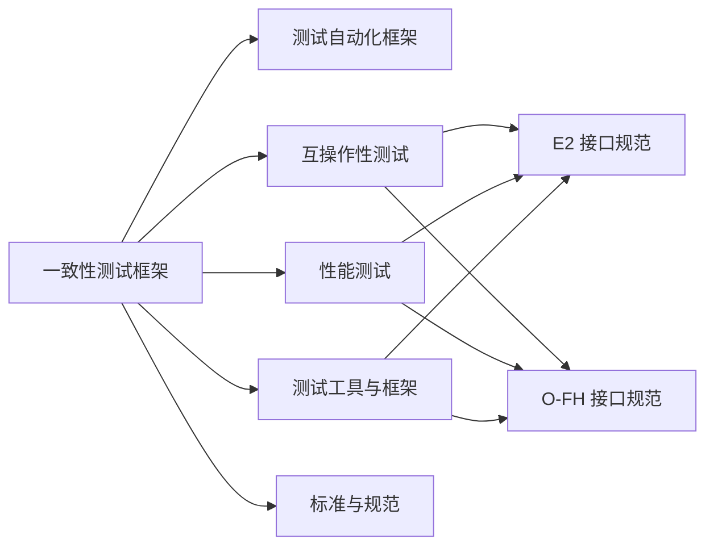

# 一致性测试

<cite>
**本文引用的文件**
- [O-RAN 测试一致性验证](file://13-testing-validation/conformance-testing/o-ran-conformance-testing.md)
- [O-RAN Conformance Testing Framework](file://13-testing-validation/conformance-testing/o-ran-conformance-testing-en.md)
- [O-RAN 测试自动化框架](file://13-testing-validation/automation-framework/test-automation-framework.md)
- [O-RAN 互操作性测试](file://13-testing-validation/interoperability/interoperability-testing.md)
- [O-RAN 性能测试](file://13-testing-validation/performance-testing/performance-testing.md)
- [O-RAN 性能测试（中文）](file://13-testing-validation/performance-testing/performance-testing-zh.md)
- [O-RAN 测试工具与框架](file://13-testing-validation/testing-tools/testing-tools-frameworks.md)
- [E2 接口](file://03-interface-standards/e2-interface.md)
- [O-FH 接口](file://03-interface-standards/o-fh-interface.md)
- [O-RAN 标准与规范](file://09-standards-compliance/readme-zh.md)
- [O-RAN Standards and Specifications](file://09-standards-compliance/readme.md)
</cite>

## 更新摘要
**变更内容**
- 大幅扩展了测试框架架构章节，新增详细的硬件软件要求
- 增加了完整的测试工具链说明，包括O-RAN SC工具和第三方工具
- 新增了自动化测试框架的详细实现示例
- 完善了测试类别分类，涵盖接口、功能、性能、安全等多个维度
- 添加了完整的认证流程说明，包括O-RAN Alliance认证要求
- 增强了最佳实践和常见问题解决方案
- 更新了工具与资源部分，包含开源和商业测试平台

## 目录
1. [简介](#简介)
2. [项目结构](#项目结构)
3. [核心组件](#核心组件)
4. [架构总览](#架构总览)
5. [详细组件分析](#详细组件分析)
6. [依赖分析](#依赖分析)
7. [性能考虑](#性能考虑)
8. [故障排查指南](#故障排查指南)
9. [结论](#结论)
10. [附录](#附录)

## 简介
本指南面向O-RAN一致性测试的系统化落地，围绕O-RAN联盟测试套件、3GPP规范符合性验证、接口协议一致性检查流程，构建"测试框架—测试环境—测试流程—质量保证—持续集成"的完整闭环。文档覆盖功能规范验证测试、配置管理测试、协议栈符合性测试的实施步骤，并提供测试用例设计、测试执行策略、结果分析与不符合项处理的实操指引，同时给出多厂商设备一致性测试、版本兼容性验证、升级路径验证与回归测试策略的实施方案。

**更新** 基于最新的O-RAN测试框架架构，新增了详细的硬件软件要求、测试工具链、自动化测试框架和完整认证程序的实施指导。

## 项目结构
本仓库与一致性测试直接相关的知识域主要分布在"测试与验证""接口标准""标准与合规"等模块。下图展示与一致性测试相关的主要文件与模块关系：

**图表来源**
- [O-RAN 测试一致性验证:1-246](file://13-testing-validation/conformance-testing/o-ran-conformance-testing.md#L1-L246)
- [O-RAN Conformance Testing Framework:1-627](file://13-testing-validation/conformance-testing/o-ran-conformance-testing-en.md#L1-L627)
- [O-RAN 测试自动化框架:1-144](file://13-testing-validation/automation-framework/test-automation-framework.md#L1-L144)
- [O-RAN 互操作性测试:1-241](file://13-testing-validation/interoperability/interoperability-testing.md#L1-L241)
- [O-RAN 性能测试:1-337](file://13-testing-validation/performance-testing/performance-testing.md#L1-L337)
- [O-RAN 测试工具与框架:1-608](file://13-testing-validation/testing-tools/testing-tools-frameworks.md#L1-L608)
- [E2 接口:1-375](file://03-interface-standards/e2-interface.md#L1-L375)
- [O-FH 接口:1-407](file://03-interface-standards/o-fh-interface.md#L1-L407)
- [O-RAN 标准与规范:1-140](file://09-standards-compliance/readme-zh.md#L1-L140)
- [O-RAN Standards and Specifications:1-140](file://09-standards-compliance/readme.md#L1-L140)

**章节来源**
- [O-RAN 测试一致性验证:1-246](file://13-testing-validation/conformance-testing/o-ran-conformance-testing.md#L1-L246)
- [O-RAN Conformance Testing Framework:1-627](file://13-testing-validation/conformance-testing/o-ran-conformance-testing-en.md#L1-L627)
- [O-RAN 测试自动化框架:1-144](file://13-testing-validation/automation-framework/test-automation-framework.md#L1-L144)
- [O-RAN 互操作性测试:1-241](file://13-testing-validation/interoperability/interoperability-testing.md#L1-L241)
- [O-RAN 性能测试:1-337](file://13-testing-validation/performance-testing/performance-testing.md#L1-L337)
- [O-RAN 测试工具与框架:1-608](file://13-testing-validation/testing-tools/testing-tools-frameworks.md#L1-L608)
- [E2 接口:1-375](file://03-interface-standards/e2-interface.md#L1-L375)
- [O-FH 接口:1-407](file://03-interface-standards/o-fh-interface.md#L1-L407)
- [O-RAN 标准与规范:1-140](file://09-standards-compliance/readme-zh.md#L1-L140)
- [O-RAN Standards and Specifications:1-140](file://09-standards-compliance/readme.md#L1-L140)

## 核心组件
- **测试框架与套件**
  - O-RAN联盟测试套件：架构一致性、接口一致性、功能一致性、性能一致性、安全一致性。
  - 3GPP规范验证：NG-RAN架构、5G NR协议、RAN功能规范、互操作性要求。
- **测试环境与自动化**
  - 自动化测试平台：测试用例管理、自动执行引擎、结果分析报告、回归测试机制。
  - 测试自动化框架：测试编排层、执行引擎、数据管理、结果分析、报告系统。
- **接口一致性测试**
  - E2接口：基于SCTP/STREAMS的服务化接口，支持服务发现、调用、事件通知、订阅管理。
  - O-FH接口：基于eCPRI/RoE的前传接口，支持用户平面、控制平面、同步平面。
- **性能一致性测试**
  - 网络性能、资源性能、可扩展性测试，关键KPI与测试场景。
- **互操作性测试**
  - 多厂商兼容性、接口标准合规、系统集成验证。
- **测试工具与方法**
  - 商业与开源测试工具、协议分析、容器化与Kubernetes编排、监控与告警。

**更新** 新增了详细的测试框架架构，包括硬件软件要求、测试工具链、自动化测试框架和完整认证程序。

**章节来源**
- [O-RAN 测试一致性验证:15-32](file://13-testing-validation/conformance-testing/o-ran-conformance-testing.md#L15-L32)
- [O-RAN Conformance Testing Framework:18-34](file://13-testing-validation/conformance-testing/o-ran-conformance-testing-en.md#L18-L34)
- [O-RAN 测试自动化框架:18-31](file://13-testing-validation/automation-framework/test-automation-framework.md#L18-L31)
- [E2 接口:17-54](file://03-interface-standards/e2-interface.md#L17-L54)
- [O-FH 接口:17-68](file://03-interface-standards/o-fh-interface.md#L17-L68)
- [O-RAN 性能测试:18-38](file://13-testing-validation/performance-testing/performance-testing.md#L18-L38)
- [O-RAN 互操作性测试:18-37](file://13-testing-validation/interoperability/interoperability-testing.md#L18-L37)
- [O-RAN 测试工具与框架:16-69](file://13-testing-validation/testing-tools/testing-tools-frameworks.md#L16-L69)

## 架构总览
下图展示一致性测试从"测试框架—测试环境—测试执行—结果分析—回归测试"的整体架构与关键交互：

**更新** 架构图展示了完整的测试框架体系，包括详细的测试环境配置和自动化测试平台。

**图表来源**
- [O-RAN 测试一致性验证:35-115](file://13-testing-validation/conformance-testing/o-ran-conformance-testing.md#L35-L115)
- [O-RAN Conformance Testing Framework:303-368](file://13-testing-validation/conformance-testing/o-ran-conformance-testing-en.md#L303-L368)
- [O-RAN 测试自动化框架:34-48](file://13-testing-validation/automation-framework/test-automation-framework.md#L34-L48)

**章节来源**
- [O-RAN 测试一致性验证:35-115](file://13-testing-validation/conformance-testing/o-ran-conformance-testing.md#L35-L115)
- [O-RAN Conformance Testing Framework:303-368](file://13-testing-validation/conformance-testing/o-ran-conformance-testing-en.md#L303-L368)
- [O-RAN 测试自动化框架:34-48](file://13-testing-validation/automation-framework/test-automation-framework.md#L34-L48)

## 详细组件分析

### 组件A：测试框架架构与环境搭建

#### 硬件要求
| 组件 | 最低配置 | 推荐配置 | 说明 |
|------|----------|----------|------|
| 测试服务器 | 16核 CPU, 64GB RAM | 32核 CPU, 128GB RAM | 运行测试工具和模拟器 |
| 网络设备 | 10GbE 交换机 | 25GbE/100GbE 交换机 | 高速网络连接 |
| 存储 | 1TB SSD | 4TB NVMe SSD | 测试数据和日志存储 |
| 时钟同步 | GPS 接收器 | PTP 主时钟 | 时间敏感测试 |
| 射频设备 | 软件无线电 (SDR) | 商用 O-RU | 射频接口测试 |

#### 软件要求
- **操作系统**: Ubuntu 20.04/22.04 LTS, CentOS 8
- **容器运行时**: Docker 20.10+, containerd 1.5+
- **编排平台**: Kubernetes 1.21+ (用于云原生测试)
- **虚拟化**: KVM, VMware ESXi, 或 Hyper-V
- **网络工具**: Wireshark, tcpdump, iperf3, netperf

#### 测试工具链
| 工具名称 | 用途 | 支持接口 | 版本 |
|----------|------|----------|------|
| **O-RAN SC 近实时 RIC** | RIC 平台测试 | E2, A1 | 3.0+ |
| **O-RAN SC E2 模拟器** | E2 接口测试 | E2 | 2.0+ |
| **O-RAN SC A1 模拟器** | A1 接口测试 | A1 | 1.5+ |
| **O-RAN SC O1 适配器** | O1 接口测试 | O1 | 1.0+ |
| **O-RAN SC O2 服务** | O2 接口测试 | O2 | 0.5+ |

**更新** 新增了详细的硬件软件要求和测试工具链配置，为实际部署提供具体指导。

**章节来源**
- [O-RAN 测试一致性验证:37-70](file://13-testing-validation/conformance-testing/o-ran-conformance-testing.md#L37-L70)
- [O-RAN Conformance Testing Framework:307-368](file://13-testing-validation/conformance-testing/o-ran-conformance-testing-en.md#L307-L368)

### 组件B：接口一致性测试（E2与O-FH）
- E2接口一致性测试
  - 关键点：服务发现、服务调用、事件通知、订阅管理；基于SCTP/STREAMS协议栈；消息类型覆盖初始化、服务注册、调用、通知、订阅、错误处理。
  - 实施步骤：建立连接、交换初始化消息、验证服务注册/发现、执行订阅管理、验证事件通知与控制消息处理、连接维护与恢复。
  - 验证维度：消息格式与内容、时延、错误恢复、连接韧性。
- O-FH接口一致性测试
  - 关键点：用户平面（IQ数据传输、压缩）、控制平面（RU配置、状态、故障、同步）、同步（PTP、SyncE）。
  - 实施步骤：初始化流程（物理连接、链路协商、协议版本、能力交换）、正常运行（同步建立、数据传输、状态监控、故障处理）、维护流程（软件升级、诊断测试、配置更新）。
  - 验证维度：带宽利用率、延迟、误码率、同步精度与稳定性、鲁棒性与冗余。

**图表来源**
- [E2 接口:21-54](file://03-interface-standards/e2-interface.md#L21-L54)
- [O-FH 接口:110-126](file://03-interface-standards/o-fh-interface.md#L110-L126)

**章节来源**
- [E2 接口:17-54](file://03-interface-standards/e2-interface.md#L17-L54)
- [O-FH 接口:17-68](file://03-interface-standards/o-fh-interface.md#L17-L68)

### 组件C：测试类别与工作流程

#### 接口一致性测试
| 接口 | 测试重点 | 关键测试项 |
|------|----------|------------|
| **E2** | E2AP 协议、E2SM、连接管理 | 协议消息格式、服务模型实现、连接建立维护 |
| **A1** | 策略管理、服务接口、通知机制 | 策略类型实例、服务接口、查询接口 |
| **O1** | 配置管理、故障管理、性能管理 | 配置接口、故障管理功能、性能管理接口 |
| **O2** | 资源管理、工作负载、基础设施 | 资源管理接口、工作负载管理、服务接口 |
| **O-FH** | 前传协议、分割选项、同步 | 协议验证、分割选项测试、同步机制验证 |

#### 功能一致性测试
| 测试对象 | 测试重点 | 关键测试项 |
|----------|----------|------------|
| **RIC 平台** | 近实时/非实时 RIC、服务接口 | 平台功能、服务接口、应用管理 |
| **xApp** | 生命周期、功能、性能 | 部署启动、功能实现、性能指标 |
| **rApp** | 生命周期、功能、集成 | 部署管理、功能实现、RIC 集成 |

#### 性能一致性测试
| 测试类型 | 测试重点 | 关键测试项 |
|----------|----------|------------|
| **吞吐量** | 峰值、持续、并发吞吐 | 最大吞吐能力、长时间稳定、多用户并发 |
| **延迟** | 端到端、控制面、用户面延迟 | 延迟特性、信令延迟、数据延迟 |
| **可靠性** | 故障恢复、冗余切换 | 故障恢复能力、冗余组件切换、压力测试 |

#### 安全一致性测试
| 测试类型 | 测试重点 | 关键测试项 |
|----------|----------|------------|
| **认证** | 身份认证、证书管理、密钥管理 | 用户设备认证、数字证书、密钥轮换 |
| **加密** | 数据加密、接口加密、密钥交换 | 传输存储加密、通信加密、加密算法 |
| **访问控制** | 权限管理、角色访问、审计 | 权限管理、角色访问控制、审计日志 |

**更新** 新增了完整的测试类别分类，涵盖接口、功能、性能、安全等多个维度的详细测试项。

**章节来源**
- [O-RAN 测试一致性验证:118-147](file://13-testing-validation/conformance-testing/o-ran-conformance-testing.md#L118-L147)

### 组件D：认证流程与质量保证

#### O-RAN Alliance 认证要求
- **技术规范符合性**：符合 O-RAN 技术规范要求
- **互操作性验证**：多厂商组件互操作性测试
- **性能达标**：满足性能指标要求
- **安全合规**：符合安全标准和法规要求

#### 认证测试实验室
- **授权实验室**：O-RAN Alliance 授权的测试实验室
- **测试能力**：实验室的测试设备和工具能力
- **认证范围**：支持的认证类型和接口
- **测试流程**：标准化的认证测试流程

#### 认证证书获取
- **申请流程**：认证申请提交和审核
- **测试执行**：在授权实验室执行认证测试
- **结果评估**：测试结果分析和评估
- **证书颁发**：通过认证后颁发证书

**更新** 新增了完整的认证流程说明，包括认证要求、测试实验室选择和证书获取流程。

**章节来源**
- [O-RAN 测试一致性验证:188-207](file://13-testing-validation/conformance-testing/o-ran-conformance-testing.md#L188-L207)

### 组件E：最佳实践与问题解决

#### 测试覆盖率与效率优化
| 优化策略 | 具体措施 | 预期效果 |
|----------|----------|----------|
| **需求追踪矩阵** | 建立需求与测试用例的映射 | 确保全面覆盖 |
| **风险测试** | 基于风险优先级的测试策略 | 高风险场景优先测试 |
| **自动化测试** | 测试脚本开发和执行 | 提高执行效率 |
| **并行测试** | 分布式测试执行 | 缩短测试周期 |

#### 常见问题与解决方案
| 问题类型 | 常见问题 | 解决方案 |
|----------|----------|----------|
| 接口兼容性 | 协议版本不匹配 | 使用版本协商机制，确保向后兼容 |
| 性能瓶颈 | 吞吐量不达标 | 优化数据路径，增加硬件资源 |
| 安全漏洞 | 认证机制缺陷 | 实施多因素认证，加强密钥管理 |
| 互操作性 | 多厂商组件集成问题 | 建立标准化测试用例，进行充分集成测试 |

**更新** 新增了最佳实践和常见问题解决方案，提供实用的测试优化和问题处理指导。

**章节来源**
- [O-RAN 测试一致性验证:208-225](file://13-testing-validation/conformance-testing/o-ran-conformance-testing.md#L208-L225)

## 依赖分析
- 组件耦合与协作
  - 一致性测试框架依赖测试自动化框架与测试工具，支撑接口一致性、功能规范、性能与互操作性测试。
  - 接口一致性测试依赖具体接口规范（E2、O-FH），并与性能测试、配置管理测试耦合。
  - 性能测试依赖监控系统（Prometheus/Grafana）与测试数据生成器。
- 外部依赖与集成点
  - 标准与规范：O-RAN联盟、ETSI、3GPP标准。
  - 测试工具：Wireshark插件、Robot Framework、PyTest、Docker/Kubernetes、Prometheus/Grafana。
- 潜在循环依赖
  - 通过清晰的模块边界（测试框架、测试环境、测试执行、结果分析）避免循环依赖。

**图表来源**
- [O-RAN Conformance Testing Framework:18-34](file://13-testing-validation/conformance-testing/o-ran-conformance-testing-en.md#L18-L34)
- [O-RAN 测试自动化框架:18-31](file://13-testing-validation/automation-framework/test-automation-framework.md#L18-L31)
- [O-RAN 互操作性测试:18-37](file://13-testing-validation/interoperability/interoperability-testing.md#L18-L37)
- [O-RAN 性能测试:18-38](file://13-testing-validation/performance-testing/performance-testing.md#L18-L38)
- [O-RAN 测试工具与框架:16-69](file://13-testing-validation/testing-tools/testing-tools-frameworks.md#L16-L69)
- [E2 接口:17-54](file://03-interface-standards/e2-interface.md#L17-L54)
- [O-FH 接口:17-68](file://03-interface-standards/o-fh-interface.md#L17-L68)
- [O-RAN 标准与规范:18-25](file://09-standards-compliance/readme-zh.md#L18-L25)

**章节来源**
- [O-RAN Conformance Testing Framework:18-34](file://13-testing-validation/conformance-testing/o-ran-conformance-testing-en.md#L18-L34)
- [O-RAN 测试自动化框架:18-31](file://13-testing-validation/automation-framework/test-automation-framework.md#L18-L31)
- [O-RAN 互操作性测试:18-37](file://13-testing-validation/interoperability/interoperability-testing.md#L18-L37)
- [O-RAN 性能测试:18-38](file://13-testing-validation/performance-testing/performance-testing.md#L18-L38)
- [O-RAN 测试工具与框架:16-69](file://13-testing-validation/testing-tools/testing-tools-frameworks.md#L16-L69)
- [E2 接口:17-54](file://03-interface-standards/e2-interface.md#L17-L54)
- [O-FH 接口:17-68](file://03-interface-standards/o-fh-interface.md#L17-L68)
- [O-RAN 标准与规范:18-25](file://09-standards-compliance/readme-zh.md#L18-L25)

## 性能考虑
- 测试环境性能
  - 硬件规格与软件栈：CPU/内存/网络/存储配置，容器运行时与编排平台，监控系统。
  - 网络拓扑：流量生成网络、控制面/用户面/管理网络隔离。
- 测试执行性能
  - 并行执行与资源调度、测试结果聚合与报告、跨测试依赖协调。
- 指标与监控
  - Prometheus查询表达式、Grafana仪表盘、告警规则与阈值设定。
- 优化建议
  - 网络优化（接口调优、QoS、负载均衡、协议优化）、系统优化（CPU亲和、内存/存储I/O、内核参数、容器优化）、应用优化（算法效率、缓存、数据库、API、并行处理）。

**更新** 基于新的测试框架架构，提供了更详细的性能考虑和优化建议。

**章节来源**
- [O-RAN 性能测试:150-177](file://13-testing-validation/performance-testing/performance-testing.md#L150-L177)
- [O-RAN 测试工具与框架:491-569](file://13-testing-validation/testing-tools/testing-tools-frameworks.md#L491-L569)

## 故障排查指南
- 常见问题定位
  - 接口连接故障、消息传输失败、服务调用失败、性能劣化、同步丢失、硬件故障。
- 定位方法
  - 告警分析、日志分析、信令分析、测试验证。
- 恢复策略
  - 连接恢复、配置调整、服务重启、软件升级修复。
- 监控与告警
  - 接口状态、服务状态、告警分级与关联分析、与其他监控系统集成。

**更新** 基于新的测试框架，提供了更全面的故障排查方法和恢复策略。

**章节来源**
- [E2 接口:208-227](file://03-interface-standards/e2-interface.md#L208-L227)
- [O-FH 接口:257-276](file://03-interface-standards/o-fh-interface.md#L257-L276)

## 结论
本指南基于最新扩展的O-RAN测试框架，构建了面向O-RAN一致性的系统化测试方法论与实施路径。通过详细的测试框架架构、硬件软件要求、测试工具链、自动化测试框架和完整认证程序，结合接口一致性、功能规范、配置管理、协议栈与性能测试，可有效支撑多厂商设备一致性测试、版本兼容性验证、升级路径验证与回归测试策略的落地执行。

**更新** 基于大幅扩展的测试框架文档，提供了更完整和实用的O-RAN一致性测试实施方案。

## 附录
- 测试用例设计与执行策略
  - 基于规范逐条映射测试用例，覆盖正常/异常/边界场景，采用自动化与半自动化结合。
- 结果分析与不符合项处理
  - 建立不符合项跟踪与闭环机制，输出根因分析与改进建议。
- 持续集成与回归测试
  - CI/CD流水线集成一致性测试与性能回归测试，自动化发布与回滚。

**更新** 新增了详细的工具与资源参考，包括开源和商业测试平台的详细信息。

**章节来源**
- [O-RAN 测试一致性验证:148-173](file://13-testing-validation/conformance-testing/o-ran-conformance-testing.md#L148-L173)
- [O-RAN Conformance Testing Framework:527-627](file://13-testing-validation/conformance-testing/o-ran-conformance-testing-en.md#L527-L627)
- [O-RAN 测试自动化框架:89-101](file://13-testing-validation/automation-framework/test-automation-framework.md#L89-L101)
- [O-RAN 测试一致性验证:226-246](file://13-testing-validation/conformance-testing/o-ran-conformance-testing.md#L226-L246)