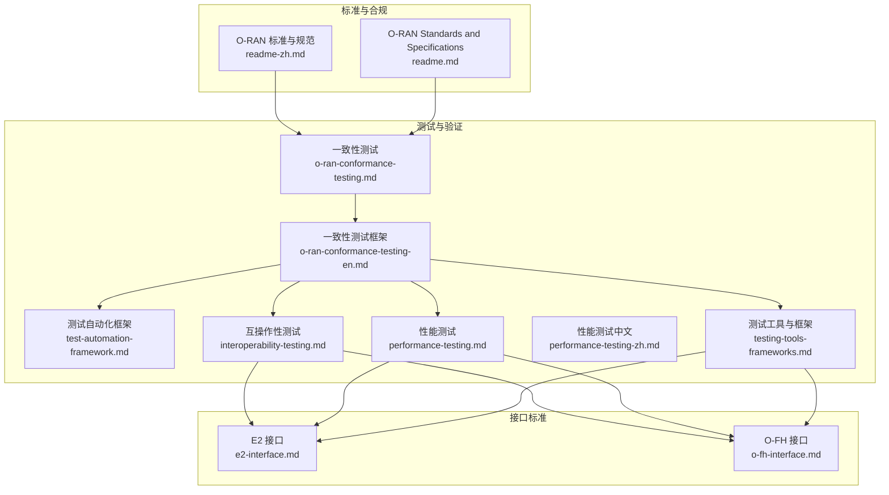
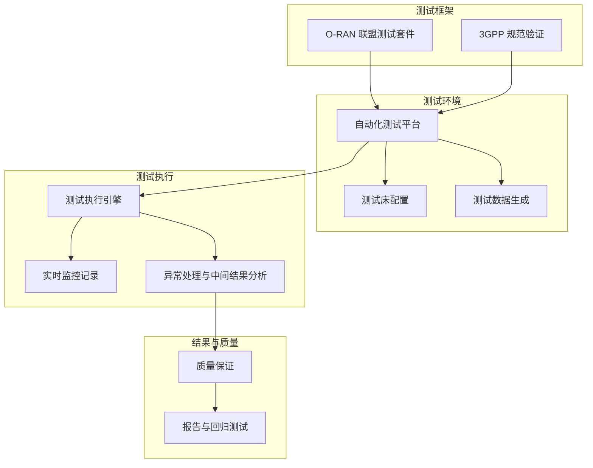
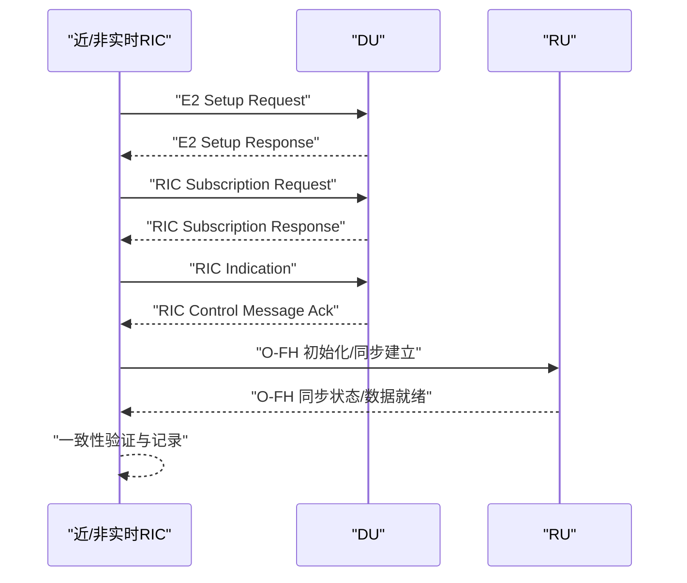
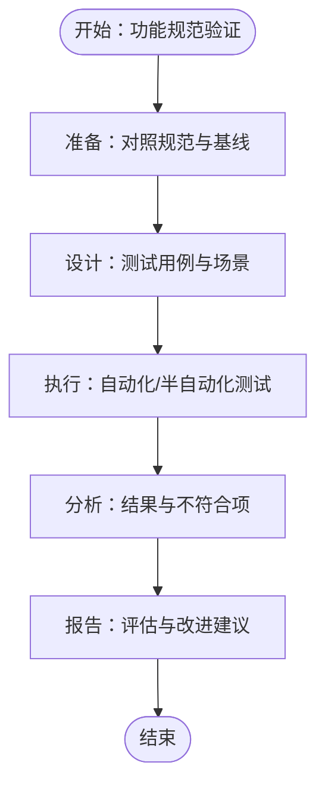
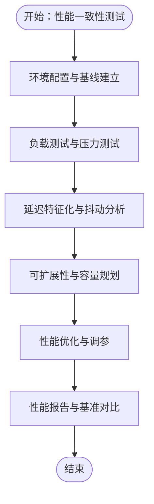
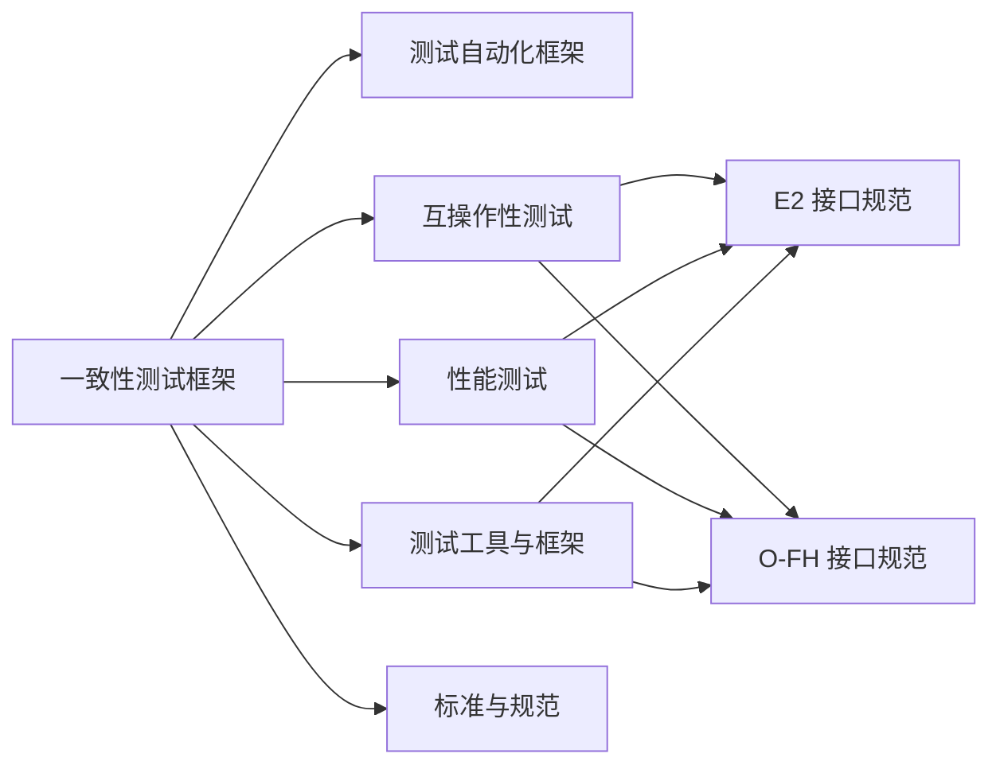

# 一致性测试

<cite>
**本文引用的文件**
- [O-RAN 一致性测试](file://13-testing-validation/conformance-testing/o-ran-conformance-testing.md)
- [O-RAN Conformance Testing Framework](file://13-testing-validation/conformance-testing/o-ran-conformance-testing-en.md)
- [O-RAN 测试自动化框架](file://13-testing-validation/automation-framework/test-automation-framework.md)
- [O-RAN 互操作性测试](file://13-testing-validation/interoperability/interoperability-testing.md)
- [O-RAN 性能测试](file://13-testing-validation/performance-testing/performance-testing.md)
- [O-RAN 性能测试（中文）](file://13-testing-validation/performance-testing/performance-testing-zh.md)
- [O-RAN 测试工具与框架](file://13-testing-validation/testing-tools/testing-tools-frameworks.md)
- [E2 接口](file://03-interface-standards/e2-interface.md)
- [O-FH 接口](file://03-interface-standards/o-fh-interface.md)
- [O-RAN 标准与规范](file://09-standards-compliance/readme-zh.md)
- [O-RAN Standards and Specifications](file://09-standards-compliance/readme.md)
</cite>

## 目录
1. [简介](#简介)
2. [项目结构](#项目结构)
3. [核心组件](#核心组件)
4. [架构总览](#架构总览)
5. [详细组件分析](#详细组件分析)
6. [依赖分析](#依赖分析)
7. [性能考虑](#性能考虑)
8. [故障排查指南](#故障排查指南)
9. [结论](#结论)
10. [附录](#附录)

## 简介
本指南面向O-RAN一致性测试的系统化落地，围绕O-RAN联盟测试套件、3GPP规范符合性验证、接口协议一致性检查流程，构建“测试框架—测试环境—测试流程—质量保证—持续集成”的完整闭环。文档覆盖功能规范验证测试、配置管理测试、协议栈符合性测试的实施步骤，并提供测试用例设计、测试执行策略、结果分析与不符合项处理的实操指引，同时给出多厂商设备一致性测试、版本兼容性验证、升级路径验证与回归测试策略的实施方案。

## 项目结构
本仓库与一致性测试直接相关的知识域主要分布在“测试与验证”“接口标准”“标准与合规”等模块。下图展示与一致性测试相关的主要文件与模块关系：

**图表来源**
- [O-RAN 一致性测试](file://13-testing-validation/conformance-testing/o-ran-conformance-testing.md#L1-L67)
- [O-RAN Conformance Testing Framework](file://13-testing-validation/conformance-testing/o-ran-conformance-testing-en.md#L1-L617)
- [O-RAN 测试自动化框架](file://13-testing-validation/automation-framework/test-automation-framework.md#L1-L134)
- [O-RAN 互操作性测试](file://13-testing-validation/interoperability/interoperability-testing.md#L1-L231)
- [O-RAN 性能测试](file://13-testing-validation/performance-testing/performance-testing.md#L1-L327)
- [O-RAN 性能测试（中文）](file://13-testing-validation/performance-testing/performance-testing-zh.md#L1-L327)
- [O-RAN 测试工具与框架](file://13-testing-validation/testing-tools/testing-tools-frameworks.md#L1-L598)
- [E2 接口](file://03-interface-standards/e2-interface.md#L1-L337)
- [O-FH 接口](file://03-interface-standards/o-fh-interface.md#L1-L397)
- [O-RAN 标准与规范](file://09-standards-compliance/readme-zh.md#L1-L371)
- [O-RAN Standards and Specifications](file://09-standards-compliance/readme.md#L1-L371)

**章节来源**
- [O-RAN 一致性测试](file://13-testing-validation/conformance-testing/o-ran-conformance-testing.md#L1-L67)
- [O-RAN Conformance Testing Framework](file://13-testing-validation/conformance-testing/o-ran-conformance-testing-en.md#L1-L617)
- [O-RAN 测试自动化框架](file://13-testing-validation/automation-framework/test-automation-framework.md#L1-L134)
- [O-RAN 互操作性测试](file://13-testing-validation/interoperability/interoperability-testing.md#L1-L231)
- [O-RAN 性能测试](file://13-testing-validation/performance-testing/performance-testing.md#L1-L327)
- [O-RAN 性能测试（中文）](file://13-testing-validation/performance-testing/performance-testing-zh.md#L1-L327)
- [O-RAN 测试工具与框架](file://13-testing-validation/testing-tools/testing-tools-frameworks.md#L1-L598)
- [E2 接口](file://03-interface-standards/e2-interface.md#L1-L337)
- [O-FH 接口](file://03-interface-standards/o-fh-interface.md#L1-L397)
- [O-RAN 标准与规范](file://09-standards-compliance/readme-zh.md#L1-L371)
- [O-RAN Standards and Specifications](file://09-standards-compliance/readme.md#L1-L371)

## 核心组件
- 测试框架与套件
  - O-RAN联盟测试套件：架构一致性、接口一致性、功能一致性、性能一致性、安全一致性。
  - 3GPP规范验证：NG-RAN架构、5G NR协议、RAN功能规范、互操作性要求。
- 测试环境与自动化
  - 自动化测试平台：测试用例管理、自动执行引擎、结果分析报告、回归测试机制。
  - 测试自动化框架：测试编排层、执行引擎、数据管理、结果分析、报告系统。
- 接口一致性测试
  - E2接口：基于SCTP/STREAMS的服务化接口，支持服务发现、调用、事件通知、订阅管理。
  - O-FH接口：基于eCPRI/RoE的前传接口，支持用户平面、控制平面、同步平面。
- 性能一致性测试
  - 网络性能、资源性能、可扩展性测试，关键KPI与测试场景。
- 互操作性测试
  - 多厂商兼容性、接口标准合规、系统集成验证。
- 测试工具与方法
  - 商业与开源测试工具、协议分析、容器化与Kubernetes编排、监控与告警。

**章节来源**
- [O-RAN 一致性测试](file://13-testing-validation/conformance-testing/o-ran-conformance-testing.md#L6-L67)
- [O-RAN Conformance Testing Framework](file://13-testing-validation/conformance-testing/o-ran-conformance-testing-en.md#L8-L291)
- [O-RAN 测试自动化框架](file://13-testing-validation/automation-framework/test-automation-framework.md#L6-L134)
- [E2 接口](file://03-interface-standards/e2-interface.md#L1-L337)
- [O-FH 接口](file://03-interface-standards/o-fh-interface.md#L1-L397)
- [O-RAN 性能测试](file://13-testing-validation/performance-testing/performance-testing.md#L6-L327)
- [O-RAN 互操作性测试](file://13-testing-validation/interoperability/interoperability-testing.md#L6-L231)
- [O-RAN 测试工具与框架](file://13-testing-validation/testing-tools/testing-tools-frameworks.md#L1-L598)

## 架构总览
下图展示一致性测试从“测试框架—测试环境—测试执行—结果分析—回归测试”的整体架构与关键交互：

**图表来源**
- [O-RAN 一致性测试](file://13-testing-validation/conformance-testing/o-ran-conformance-testing.md#L21-L67)
- [O-RAN Conformance Testing Framework](file://13-testing-validation/conformance-testing/o-ran-conformance-testing-en.md#L293-L617)
- [O-RAN 测试自动化框架](file://13-testing-validation/automation-framework/test-automation-framework.md#L6-L134)

**章节来源**
- [O-RAN 一致性测试](file://13-testing-validation/conformance-testing/o-ran-conformance-testing.md#L21-L67)
- [O-RAN Conformance Testing Framework](file://13-testing-validation/conformance-testing/o-ran-conformance-testing-en.md#L293-L617)
- [O-RAN 测试自动化框架](file://13-testing-validation/automation-framework/test-automation-framework.md#L6-L134)

## 详细组件分析

### 组件A：接口一致性测试（E2与O-FH）
- E2接口一致性测试
  - 关键点：服务发现、服务调用、事件通知、订阅管理；基于SCTP/STREAMS协议栈；消息类型覆盖初始化、服务注册、调用、通知、订阅、错误处理。
  - 实施步骤：建立连接、交换初始化消息、验证服务注册/发现、执行订阅管理、验证事件通知与控制消息处理、连接维护与恢复。
  - 验证维度：消息格式与内容、时延、错误恢复、连接韧性。
- O-FH接口一致性测试
  - 关键点：用户平面（IQ数据传输、压缩）、控制平面（RU配置、状态、故障、同步）、同步（PTP、SyncE）。
  - 实施步骤：初始化流程（物理连接、链路协商、协议版本、能力交换）、正常运行（同步建立、数据传输、状态监控、故障处理）、维护流程（软件升级、诊断测试、配置更新）。
  - 验证维度：带宽利用率、延迟、误码率、同步精度与稳定性、鲁棒性与冗余。

**图表来源**
- [E2 接口](file://03-interface-standards/e2-interface.md#L79-L98)
- [O-FH 接口](file://03-interface-standards/o-fh-interface.md#L98-L116)

**章节来源**
- [E2 接口](file://03-interface-standards/e2-interface.md#L7-L337)
- [O-FH 接口](file://03-interface-standards/o-fh-interface.md#L1-L397)

### 组件B：功能规范验证测试
- 范围：基于O-RAN联盟规范与3GPP标准的功能验证，覆盖架构、接口、硬件、软件、安全、测试规范。
- 方法：对照规范逐条验证，设计测试用例，执行并记录结果，输出不符合项与改进建议。
- 关键支撑：标准与规范文档、测试工具与框架、自动化测试平台。

**图表来源**
- [O-RAN 标准与规范](file://09-standards-compliance/readme-zh.md#L8-L44)
- [O-RAN Standards and Specifications](file://09-standards-compliance/readme.md#L8-L44)
- [O-RAN 一致性测试](file://13-testing-validation/conformance-testing/o-ran-conformance-testing.md#L35-L67)

**章节来源**
- [O-RAN 标准与规范](file://09-standards-compliance/readme-zh.md#L8-L44)
- [O-RAN Standards and Specifications](file://09-standards-compliance/readme.md#L8-L44)
- [O-RAN 一致性测试](file://13-testing-validation/conformance-testing/o-ran-conformance-testing.md#L35-L67)

### 组件C：配置管理测试
- 覆盖范围：接口配置（端口、协议、QoS）、同步配置（PTP/SyncE）、RU参数（小区、天线、功率）、变更管理与回滚。
- 实施策略：配置模板化、变更审批流程、变更验证与回滚预案、配置备份与恢复。
- 工具与平台：容器化配置管理、Kubernetes ConfigMap/Secret、自动化配置下发与校验。

**章节来源**
- [O-FH 接口](file://03-interface-standards/o-fh-interface.md#L227-L246)
- [O-RAN 测试工具与框架](file://13-testing-validation/testing-tools/testing-tools-frameworks.md#L298-L357)

### 组件D：协议栈符合性测试
- E2协议栈：应用层（E2AP/E2SM）、传输层（SCTP）、网络层（IP）、数据链路层（以太网）。
- O-FH协议栈：eCPRI/RoE应用层、以太网传输层、PTP/SyncE同步层。
- 测试重点：消息编解码、路由与处理、错误处理与异常管理、同步精度与切换、QoS保障。

**章节来源**
- [E2 接口](file://03-interface-standards/e2-interface.md#L63-L73)
- [O-FH 接口](file://03-interface-standards/o-fh-interface.md#L61-L81)

### 组件E：性能一致性测试
- KPI与目标：峰值吞吐量、用户面/控制面延迟、连接建立时间、切换成功率、会话建立速率、数据库查询响应、API响应时间、容器启动/VM配置时间、自动扩展响应、负载均衡延迟、存储IOPS。
- 测试场景：峰值性能、延迟特征化、可扩展性验证、压力测试与稳定性评估。
- 优化建议：网络优化（接口调优、缓冲区管理、QoS、负载均衡、协议优化）、系统优化（CPU亲和、内存管理、存储I/O、内核参数、容器优化）、应用优化（算法效率、缓存策略、数据库优化、API性能、并行处理）。

**图表来源**
- [O-RAN 性能测试](file://13-testing-validation/performance-testing/performance-testing.md#L29-L327)
- [O-RAN 性能测试（中文）](file://13-testing-validation/performance-testing/performance-testing-zh.md#L29-L327)

**章节来源**
- [O-RAN 性能测试](file://13-testing-validation/performance-testing/performance-testing.md#L29-L327)
- [O-RAN 性能测试（中文）](file://13-testing-validation/performance-testing/performance-testing-zh.md#L29-L327)

### 组件F：互操作性测试
- 多厂商兼容性：验证不同厂商设备间的E2、F1、O-FH、A1、O1接口互通。
- 测试矩阵：按CU/DU/RIC厂商组合定义测试类型、期望结果。
- 方法论：黑盒/灰盒/白盒测试相结合，关注消息交换成功率、协议合规性、功能兼容性、错误处理与恢复。
- 工具与平台：商业测试工具（Spirent、Keysight、Anritsu）、开源框架（Robot Framework、PyTest）、容器/Kubernetes编排。

**章节来源**
- [O-RAN 互操作性测试](file://13-testing-validation/interoperability/interoperability-testing.md#L6-L231)
- [O-RAN 测试工具与框架](file://13-testing-validation/testing-tools/testing-tools-frameworks.md#L6-L598)

## 依赖分析
- 组件耦合与协作
  - 一致性测试框架依赖测试自动化框架与测试工具，支撑接口一致性、功能规范、性能与互操作性测试。
  - 接口一致性测试依赖具体接口规范（E2、O-FH），并与性能测试、配置管理测试耦合。
  - 性能测试依赖监控系统（Prometheus/Grafana）与测试数据生成器。
- 外部依赖与集成点
  - 标准与规范：O-RAN联盟、ETSI、3GPP标准。
  - 测试工具：Wireshark插件、Robot Framework、PyTest、Docker/Kubernetes、Prometheus/Grafana。
- 潜在循环依赖
  - 通过清晰的模块边界（测试框架、测试环境、测试执行、结果分析）避免循环依赖。

**图表来源**
- [O-RAN Conformance Testing Framework](file://13-testing-validation/conformance-testing/o-ran-conformance-testing-en.md#L8-L291)
- [O-RAN 测试自动化框架](file://13-testing-validation/automation-framework/test-automation-framework.md#L6-L134)
- [O-RAN 互操作性测试](file://13-testing-validation/interoperability/interoperability-testing.md#L6-L231)
- [O-RAN 性能测试](file://13-testing-validation/performance-testing/performance-testing.md#L6-L327)
- [O-RAN 测试工具与框架](file://13-testing-validation/testing-tools/testing-tools-frameworks.md#L1-L598)
- [E2 接口](file://03-interface-standards/e2-interface.md#L1-L337)
- [O-FH 接口](file://03-interface-standards/o-fh-interface.md#L1-L397)
- [O-RAN 标准与规范](file://09-standards-compliance/readme-zh.md#L1-L371)

**章节来源**
- [O-RAN Conformance Testing Framework](file://13-testing-validation/conformance-testing/o-ran-conformance-testing-en.md#L8-L291)
- [O-RAN 测试自动化框架](file://13-testing-validation/automation-framework/test-automation-framework.md#L6-L134)
- [O-RAN 互操作性测试](file://13-testing-validation/interoperability/interoperability-testing.md#L6-L231)
- [O-RAN 性能测试](file://13-testing-validation/performance-testing/performance-testing.md#L6-L327)
- [O-RAN 测试工具与框架](file://13-testing-validation/testing-tools/testing-tools-frameworks.md#L1-L598)
- [E2 接口](file://03-interface-standards/e2-interface.md#L1-L337)
- [O-FH 接口](file://03-interface-standards/o-fh-interface.md#L1-L397)
- [O-RAN 标准与规范](file://09-standards-compliance/readme-zh.md#L1-L371)

## 性能考虑
- 测试环境性能
  - 硬件规格与软件栈：CPU/内存/网络/存储配置，容器运行时与编排平台，监控系统。
  - 网络拓扑：流量生成网络、控制面/用户面/管理网络隔离。
- 测试执行性能
  - 并行执行与资源调度、测试结果聚合与报告、跨测试依赖协调。
- 指标与监控
  - Prometheus查询表达式、Grafana仪表盘、告警规则与阈值设定。
- 优化建议
  - 网络优化（接口调优、QoS、负载均衡、协议优化）、系统优化（CPU亲和、内存/存储I/O、内核参数、容器优化）、应用优化（算法效率、缓存、数据库、API、并行处理）。

**章节来源**
- [O-RAN 性能测试](file://13-testing-validation/performance-testing/performance-testing.md#L140-L327)
- [O-RAN 性能测试（中文）](file://13-testing-validation/performance-testing/performance-testing-zh.md#L140-L327)
- [O-RAN 测试工具与框架](file://13-testing-validation/testing-tools/testing-tools-frameworks.md#L481-L598)

## 故障排查指南
- 常见问题定位
  - 接口连接故障、消息传输失败、服务调用失败、性能劣化、同步丢失、硬件故障。
- 定位方法
  - 告警分析、日志分析、信令分析、测试验证。
- 恢复策略
  - 连接恢复、配置调整、服务重启、软件升级修复。
- 监控与告警
  - 接口状态、服务状态、告警分级与关联分析、与其他监控系统集成。

**章节来源**
- [E2 接口](file://03-interface-standards/e2-interface.md#L170-L240)
- [O-FH 接口](file://03-interface-standards/o-fh-interface.md#L247-L288)

## 结论
本指南基于仓库中的测试与标准文档，构建了面向O-RAN一致性的系统化测试方法论与实施路径。通过明确测试框架、测试环境、测试流程与质量保证机制，结合接口一致性、功能规范、配置管理、协议栈与性能测试，可有效支撑多厂商设备一致性测试、版本兼容性验证、升级路径验证与回归测试策略的落地执行。

## 附录
- 测试用例设计与执行策略
  - 基于规范逐条映射测试用例，覆盖正常/异常/边界场景，采用自动化与半自动化结合。
- 结果分析与不符合项处理
  - 建立不符合项跟踪与闭环机制，输出根因分析与改进建议。
- 持续集成与回归测试
  - CI/CD流水线集成一致性测试与性能回归测试，自动化发布与回滚。

**章节来源**
- [O-RAN 一致性测试](file://13-testing-validation/conformance-testing/o-ran-conformance-testing.md#L35-L67)
- [O-RAN Conformance Testing Framework](file://13-testing-validation/conformance-testing/o-ran-conformance-testing-en.md#L517-L617)
- [O-RAN 测试自动化框架](file://13-testing-validation/automation-framework/test-automation-framework.md#L79-L134)