# 互操作性测试

<cite>
**本文引用的文件**
- [互操作性测试.md](file://13-testing-validation/interoperability/interoperability-testing.md)
- [一致性测试框架.md](file://13-testing-validation/conformance-testing/o-ran-conformance-testing-en.md)
- [性能测试.md](file://13-testing-validation/performance-testing/performance-testing.md)
- [测试自动化框架.md](file://13-testing-validation/automation-framework/test-automation-framework.md)
- [测试工具与框架.md](file://13-testing-validation/testing-tools/testing-tools-frameworks.md)
- [标准与规范.md](file://09-standards-compliance/readme.md)
- [接口标准：O-FH 接口.md](file://03-interface-standards/o-fh-interface.md)
- [部署与实施.md](file://08-deployment-implementation/readme.md)
- [应用性能调优.md](file://26-performance-optimization/application-tuning/o-ran-application-performance-tuning.md)
- [运维最佳实践.md](file://30-best-practices/operations-practices/o-ran-operations-best-practices.md)
</cite>

## 目录
1. [简介](#简介)
2. [项目结构](#项目结构)
3. [核心组件](#核心组件)
4. [架构总览](#架构总览)
5. [详细组件分析](#详细组件分析)
6. [依赖关系分析](#依赖关系分析)
7. [性能考量](#性能考量)
8. [故障排查指南](#故障排查指南)
9. [结论](#结论)
10. [附录](#附录)

## 简介
本文件面向O-RAN互操作性测试，聚焦于多厂商设备兼容性验证、接口互操作性验证、版本兼容性测试流程、升级路径验证与回归测试策略，并提供Plugfest参与指导、跨厂商集成测试、网络拓扑兼容性与业务场景验证的完整测试方案。文档基于仓库中现有的测试与标准规范材料，结合接口一致性、性能基准、工具链与自动化框架，形成可落地的测试策略与最佳实践。

## 项目结构
围绕互操作性测试，仓库中与之直接相关的内容主要分布在以下主题域：
- 测试与验证：互操作性测试、一致性测试、性能测试、测试自动化与测试工具
- 标准与规范：O-RAN联盟、ETSI、3GPP相关标准与合规要求
- 接口标准：E2、A1、O1、O-FH、F1等接口规范
- 部署与实施：集成测试策略、Plugfest参与与回归测试
- 运维与最佳实践：测试质量门禁、持续监控与优化

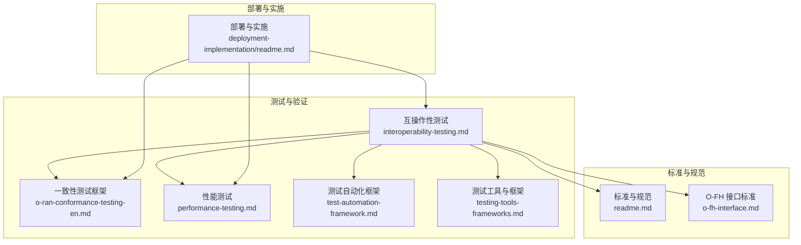

**图表来源**
- [互操作性测试.md](file://13-testing-validation/interoperability/interoperability-testing.md#L1-L231)
- [一致性测试框架.md](file://13-testing-validation/conformance-testing/o-ran-conformance-testing-en.md#L1-L617)
- [性能测试.md](file://13-testing-validation/performance-testing/performance-testing.md#L1-L327)
- [测试自动化框架.md](file://13-testing-validation/automation-framework/test-automation-framework.md#L1-L134)
- [测试工具与框架.md](file://13-testing-validation/testing-tools/testing-tools-frameworks.md#L1-L598)
- [标准与规范.md](file://09-standards-compliance/readme.md#L1-L371)
- [接口标准：O-FH 接口.md](file://03-interface-standards/o-fh-interface.md#L289-L326)
- [部署与实施.md](file://08-deployment-implementation/readme.md#L62-L92)

**章节来源**
- [互操作性测试.md](file://13-testing-validation/interoperability/interoperability-testing.md#L1-L231)
- [一致性测试框架.md](file://13-testing-validation/conformance-testing/o-ran-conformance-testing-en.md#L1-L617)
- [性能测试.md](file://13-testing-validation/performance-testing/performance-testing.md#L1-L327)
- [测试自动化框架.md](file://13-testing-validation/automation-framework/test-automation-framework.md#L1-L134)
- [测试工具与框架.md](file://13-testing-validation/testing-tools/testing-tools-frameworks.md#L1-L598)
- [标准与规范.md](file://09-standards-compliance/readme.md#L1-L371)
- [接口标准：O-FH 接口.md](file://03-interface-standards/o-fh-interface.md#L289-L326)
- [部署与实施.md](file://08-deployment-implementation/readme.md#L62-L92)

## 核心组件
- 多厂商互操作性测试框架：定义目标、场景、方法学与验证标准，覆盖E2、F1、O-FH、A1、O1等接口。
- 一致性测试框架：面向O-RAN联盟、ETSI、3GPP标准的接口一致性验证，提供测试用例模板与执行流程。
- 性能测试框架：吞吐、延迟、抖动、连接密度、资源利用率等KPI的测试方法与基准。
- 测试自动化与工具：CI/CD集成、容器化测试环境、协议分析工具、开源与商业测试平台。
- 标准与规范：O-RAN联盟、ETSI、3GPP标准解读与合规流程；Plugfest参与与多厂商集成实践。
- 部署与实施：集成测试策略、回归测试与升级路径验证。

**章节来源**
- [互操作性测试.md](file://13-testing-validation/interoperability/interoperability-testing.md#L6-L27)
- [一致性测试框架.md](file://13-testing-validation/conformance-testing/o-ran-conformance-testing-en.md#L6-L25)
- [性能测试.md](file://13-testing-validation/performance-testing/performance-testing.md#L6-L28)
- [测试自动化框架.md](file://13-testing-validation/automation-framework/test-automation-framework.md#L6-L21)
- [标准与规范.md](file://09-standards-compliance/readme.md#L8-L44)
- [部署与实施.md](file://08-deployment-implementation/readme.md#L62-L92)

## 架构总览
下图展示互操作性测试的整体架构：从标准与规范出发，通过一致性测试与性能测试验证接口与系统行为，借助自动化框架与工具链支撑测试执行与结果分析，并在部署与实施阶段落实回归测试与升级路径验证。

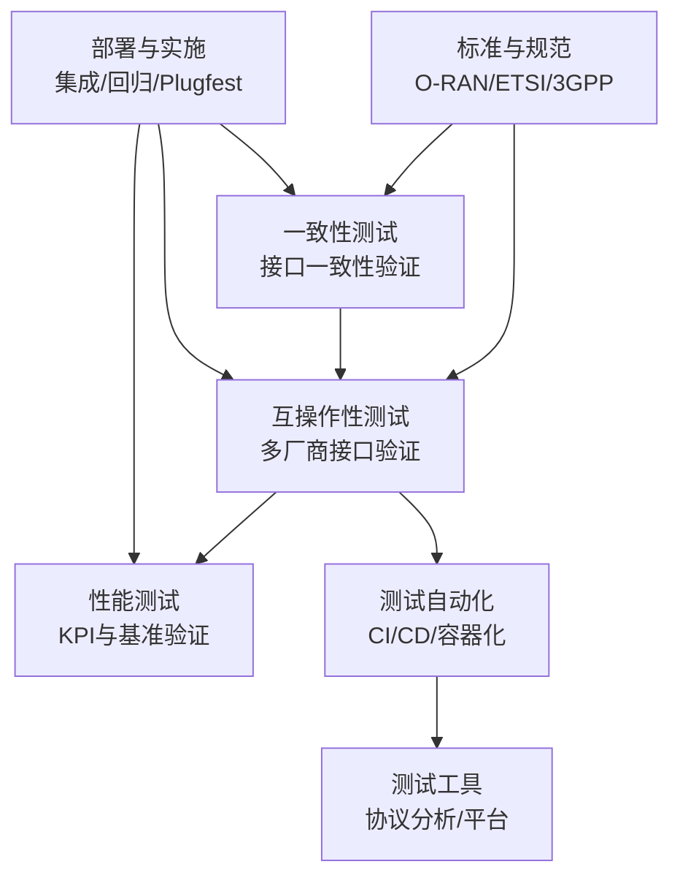

**图表来源**
- [标准与规范.md](file://09-standards-compliance/readme.md#L8-L44)
- [一致性测试框架.md](file://13-testing-validation/conformance-testing/o-ran-conformance-testing-en.md#L6-L25)
- [互操作性测试.md](file://13-testing-validation/interoperability/interoperability-testing.md#L28-L95)
- [性能测试.md](file://13-testing-validation/performance-testing/performance-testing.md#L6-L28)
- [测试自动化框架.md](file://13-testing-validation/automation-framework/test-automation-framework.md#L6-L21)
- [测试工具与框架.md](file://13-testing-validation/testing-tools/testing-tools-frameworks.md#L6-L60)
- [部署与实施.md](file://08-deployment-implementation/readme.md#L62-L92)

## 详细组件分析

### 多厂商互操作性测试策略
- 测试目标：验证不同厂商设备间的互通、标准接口实现一致性、系统集成能力与升级迁移能力。
- 方法学：黑盒、灰盒、白盒相结合，关注协议合规、消息格式与时序、错误处理与回退。
- 验证标准：消息交换成功率、协议合规率、功能兼容性、性能一致性、可靠性指标。
- 工具与框架：商业平台（如Spirent、Keysight）与开源方案（Open5GS、srsRAN、OAI、Free5GC），以及自研自动化框架与容器编排。

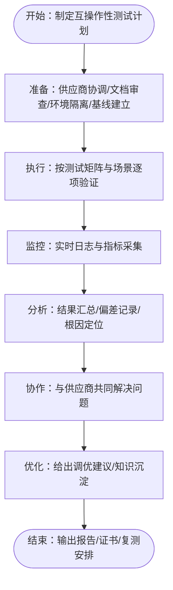

**图表来源**
- [互操作性测试.md](file://13-testing-validation/interoperability/interoperability-testing.md#L193-L212)

**章节来源**
- [互操作性测试.md](file://13-testing-validation/interoperability/interoperability-testing.md#L6-L27)
- [互操作性测试.md](file://13-testing-validation/interoperability/interoperability-testing.md#L97-L116)
- [互操作性测试.md](file://13-testing-validation/interoperability/interoperability-testing.md#L159-L178)
- [互操作性测试.md](file://13-testing-validation/interoperability/interoperability-testing.md#L213-L231)

### 接口互操作性验证方法
- E2接口：近实时RIC与DU之间的连接建立、订阅管理、指示消息与控制消息处理、连接维护与恢复。
- F1接口：CU与DU之间的连接建立、UE上下文管理、承载建立与修改、RRC控制面传输、错误处理与恢复。
- O-FH接口：前传接口的同步、带宽、比特错误率、压缩算法与eCPRI协议配置。
- A1/O1接口：策略下发与查询、管理配置与告警、YANG/NETCONF协议一致性。

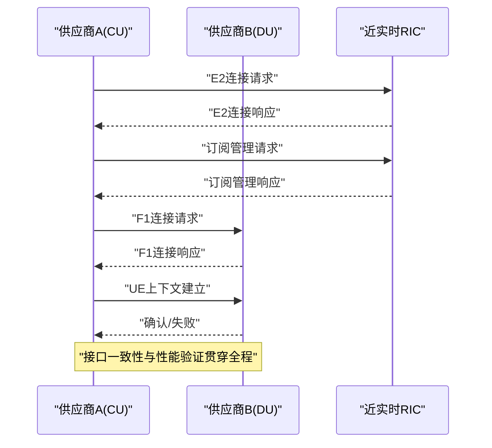

**图表来源**
- [互操作性测试.md](file://13-testing-validation/interoperability/interoperability-testing.md#L30-L56)
- [互操作性测试.md](file://13-testing-validation/interoperability/interoperability-testing.md#L58-L95)

**章节来源**
- [互操作性测试.md](file://13-testing-validation/interoperability/interoperability-testing.md#L14-L19)
- [互操作性测试.md](file://13-testing-validation/interoperability/interoperability-testing.md#L30-L56)
- [互操作性测试.md](file://13-testing-validation/interoperability/interoperability-testing.md#L58-L95)

### 版本兼容性测试流程
- 标准版本对齐：依据O-RAN联盟、ETSI、3GPP的最新版本，明确接口版本与编码格式（如E2AP/A1AP、ASN.1 PER）。
- 一致性测试：针对E2/A1/O1接口的消息类型、字段与超时要求进行验证。
- 回归测试：在新版本或补丁发布后，执行一致性与性能回归，确保向后兼容与稳定性。

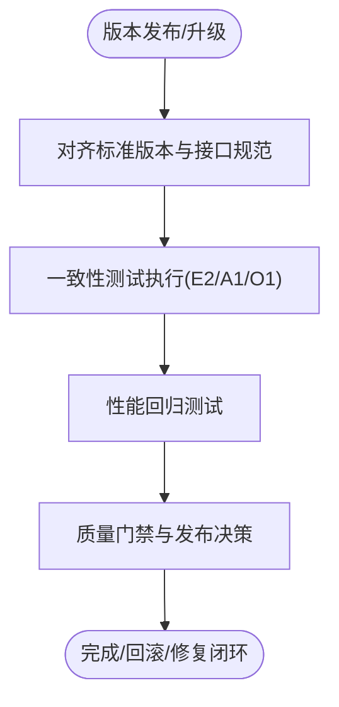

**图表来源**
- [一致性测试框架.md](file://13-testing-validation/conformance-testing/o-ran-conformance-testing-en.md#L37-L56)
- [一致性测试框架.md](file://13-testing-validation/conformance-testing/o-ran-conformance-testing-en.md#L58-L116)
- [部署与实施.md](file://08-deployment-implementation/readme.md#L87-L92)

**章节来源**
- [一致性测试框架.md](file://13-testing-validation/conformance-testing/o-ran-conformance-testing-en.md#L37-L56)
- [一致性测试框架.md](file://13-testing-validation/conformance-testing/o-ran-conformance-testing-en.md#L58-L116)
- [部署与实施.md](file://08-deployment-implementation/readme.md#L87-L92)

### 升级路径验证与回归测试策略
- 升级路径验证：在不同版本组合（如CU/DU/RIC）上验证功能与性能，确保升级前后一致性。
- 回归测试：在CI/CD流水线中集成回归测试，包括单元测试、接口测试、性能基准与安全扫描。
- 最佳实践：建立基线、自动化触发、结果趋势分析与告警联动。

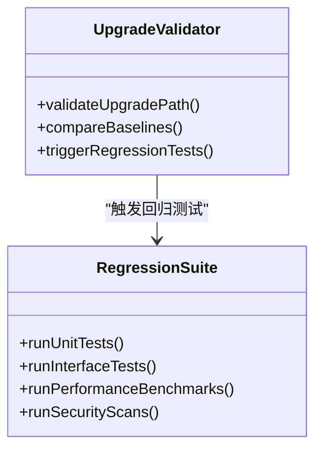

**图表来源**
- [测试自动化框架.md](file://13-testing-validation/automation-framework/test-automation-framework.md#L79-L84)
- [应用性能调优.md](file://26-performance-optimization/application-tuning/o-ran-application-performance-tuning.md#L248-L264)

**章节来源**
- [测试自动化框架.md](file://13-testing-validation/automation-framework/test-automation-framework.md#L79-L84)
- [应用性能调优.md](file://26-performance-optimization/application-tuning/o-ran-application-performance-tuning.md#L248-L264)

### 不同厂商设备组合的测试场景设计
- 测试矩阵：按CU/DU/RIC厂商组合定义基础连通性、高级特性、性能与安全验证。
- 端到端场景：RU-DU-F1-CU-E2-RIC到核心网的完整链路验证。
- 失败注入：链路中断、组件崩溃等故障场景，验证恢复时间与容错能力。

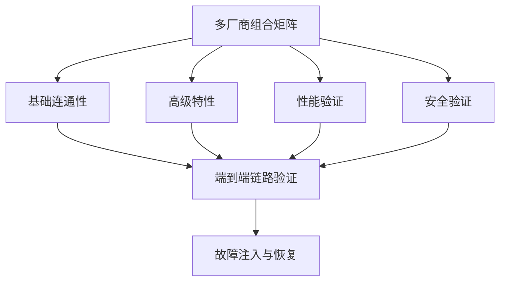

**图表来源**
- [互操作性测试.md](file://13-testing-validation/interoperability/interoperability-testing.md#L151-L158)
- [互操作性测试.md](file://13-testing-validation/interoperability/interoperability-testing.md#L119-L149)

**章节来源**
- [互操作性测试.md](file://13-testing-validation/interoperability/interoperability-testing.md#L151-L158)
- [互操作性测试.md](file://13-testing-validation/interoperability/interoperability-testing.md#L119-L149)

### 接口协议一致性验证
- E2接口：E2Setup、RICSubscription等消息序列与字段校验。
- A1接口：PolicyQuery/Update/Delete等策略生命周期验证。
- O1接口：NETCONF/YANG模型与操作（get/edit/copy）验证。
- O-FH接口：同步、带宽、压缩算法与eCPRI配置验证。

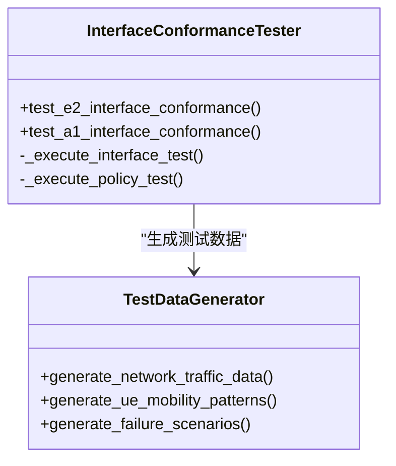

**图表来源**
- [一致性测试框架.md](file://13-testing-validation/conformance-testing/o-ran-conformance-testing-en.md#L32-L139)
- [一致性测试框架.md](file://13-testing-validation/conformance-testing/o-ran-conformance-testing-en.md#L362-L515)

**章节来源**
- [一致性测试框架.md](file://13-testing-validation/conformance-testing/o-ran-conformance-testing-en.md#L26-L150)
- [一致性测试框架.md](file://13-testing-validation/conformance-testing/o-ran-conformance-testing-en.md#L362-L515)

### 性能基准对比与故障模式分析
- 基准指标：峰值吞吐、用户面/控制面延迟、连接建立时间、切换成功率、容器/VM启动时间、存储IOPS等。
- 对比分析：不同厂商组合在相同负载下的吞吐、延迟与资源占用对比。
- 故障模式：链路中断、组件崩溃、高负载拥塞等场景下的恢复时间与影响范围。

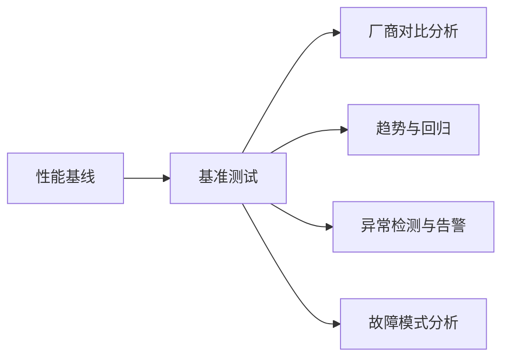

**图表来源**
- [性能测试.md](file://13-testing-validation/performance-testing/performance-testing.md#L29-L57)
- [性能测试.md](file://13-testing-validation/performance-testing/performance-testing.md#L169-L242)

**章节来源**
- [性能测试.md](file://13-testing-validation/performance-testing/performance-testing.md#L29-L57)
- [性能测试.md](file://13-testing-validation/performance-testing/performance-testing.md#L169-L242)

### Plugfest参与指导与跨厂商集成测试
- 参与流程：了解Plugfest概述、测试场景、结果分析与经验总结。
- 集成策略：接口适配层、功能映射与转换、性能调优、安全策略统一、运维工具集成。
- 测试环境：隔离的多厂商测试床，按矩阵组合验证。

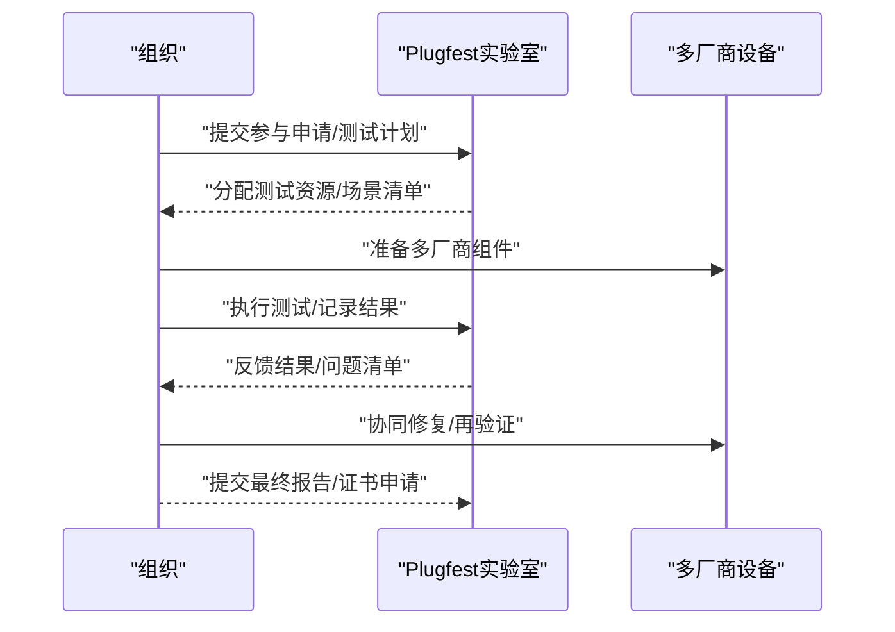

**图表来源**
- [标准与规范.md](file://09-standards-compliance/readme.md#L149-L154)
- [标准与规范.md](file://09-standards-compliance/readme.md#L136-L150)

**章节来源**
- [标准与规范.md](file://09-standards-compliance/readme.md#L149-L154)
- [标准与规范.md](file://09-standards-compliance/readme.md#L136-L150)

## 依赖关系分析
- 标准与规范是测试的基础输入，决定测试目标与验收准则。
- 一致性测试与性能测试分别从“正确性”和“性能”两个维度验证接口与系统。
- 自动化框架与工具链支撑测试执行、数据生成、监控与报告。
- 部署与实施阶段将测试结果转化为生产可用的集成方案与回归保障。

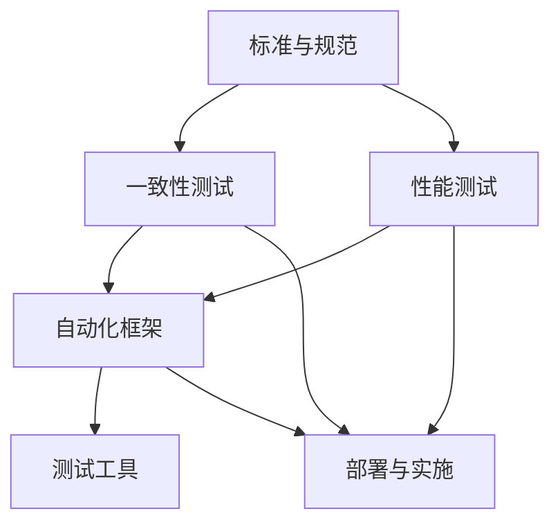

**图表来源**
- [标准与规范.md](file://09-standards-compliance/readme.md#L8-L44)
- [一致性测试框架.md](file://13-testing-validation/conformance-testing/o-ran-conformance-testing-en.md#L6-L25)
- [性能测试.md](file://13-testing-validation/performance-testing/performance-testing.md#L6-L28)
- [测试自动化框架.md](file://13-testing-validation/automation-framework/test-automation-framework.md#L6-L21)
- [测试工具与框架.md](file://13-testing-validation/testing-tools/testing-tools-frameworks.md#L6-L60)
- [部署与实施.md](file://08-deployment-implementation/readme.md#L62-L92)

**章节来源**
- [标准与规范.md](file://09-standards-compliance/readme.md#L8-L44)
- [一致性测试框架.md](file://13-testing-validation/conformance-testing/o-ran-conformance-testing-en.md#L6-L25)
- [性能测试.md](file://13-testing-validation/performance-testing/performance-testing.md#L6-L28)
- [测试自动化框架.md](file://13-testing-validation/automation-framework/test-automation-framework.md#L6-L21)
- [测试工具与框架.md](file://13-testing-validation/testing-tools/testing-tools-frameworks.md#L6-L60)
- [部署与实施.md](file://08-deployment-implementation/readme.md#L62-L92)

## 性能考量
- 端到端吞吐与延迟：在RU-DU-F1-CU-E2-RIC到核心网路径上进行持续压力与峰值测试。
- 资源利用与扩展：CPU、内存、存储I/O、网络带宽的监控与优化。
- 可扩展性：水平扩展下的线性/次线性性能与负载均衡有效性。
- 基准与对比：建立行业基准，持续跟踪与对比不同厂商组合的性能表现。

**章节来源**
- [性能测试.md](file://13-testing-validation/performance-testing/performance-testing.md#L8-L28)
- [性能测试.md](file://13-testing-validation/performance-testing/performance-testing.md#L169-L242)
- [接口标准：O-FH 接口.md](file://03-interface-standards/o-fh-interface.md#L289-L326)

## 故障排查指南
- 延迟与抖动：使用Prometheus/Grafana进行端到端延迟与抖动监控，定位瓶颈。
- 错误率与恢复：统计E2/F1错误计数，结合日志与抓包分析恢复时间。
- 故障注入：链路中断、组件崩溃场景下的恢复时间与影响范围评估。
- 安全扫描：静态与动态安全扫描，容器镜像与网络端口扫描，生成合规报告。

**章节来源**
- [性能测试.md](file://13-testing-validation/performance-testing/performance-testing.md#L244-L265)
- [测试工具与框架.md](file://13-testing-validation/testing-tools/testing-tools-frameworks.md#L561-L596)

## 结论
通过标准与规范驱动的互操作性测试，结合一致性与性能验证、自动化与工具链支撑，以及完善的回归与升级路径验证，可以有效保障多厂商O-RAN系统的稳定、可靠与高性能。Plugfest参与与跨厂商集成实践进一步提升了系统的实际兼容性与可运维性。

## 附录
- 测试工具与平台：商业（Spirent、Keysight、Anritsu、Rohde&Schwarz）与开源（Open5GS、srsRAN、OAI、Free5GC）。
- 监控与可视化：Prometheus/Grafana、容器与节点指标、接口性能热力图。
- 质量门禁与持续改进：测试质量评审、测试结果准确性验证、测试环境代表性评估、测试过程可重复性保证。

**章节来源**
- [测试工具与框架.md](file://13-testing-validation/testing-tools/testing-tools-frameworks.md#L6-L60)
- [测试工具与框架.md](file://13-testing-validation/testing-tools/testing-tools-frameworks.md#L481-L559)
- [运维最佳实践.md](file://30-best-practices/operations-practices/o-ran-operations-best-practices.md#L164-L194)