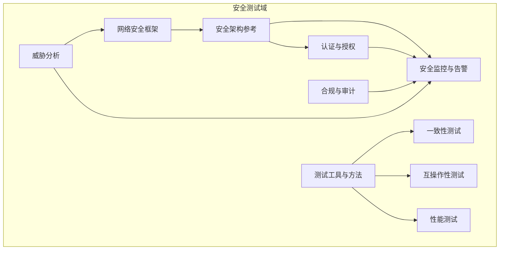
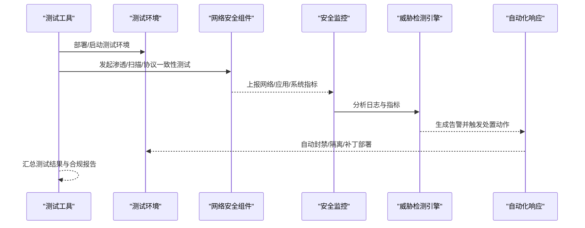
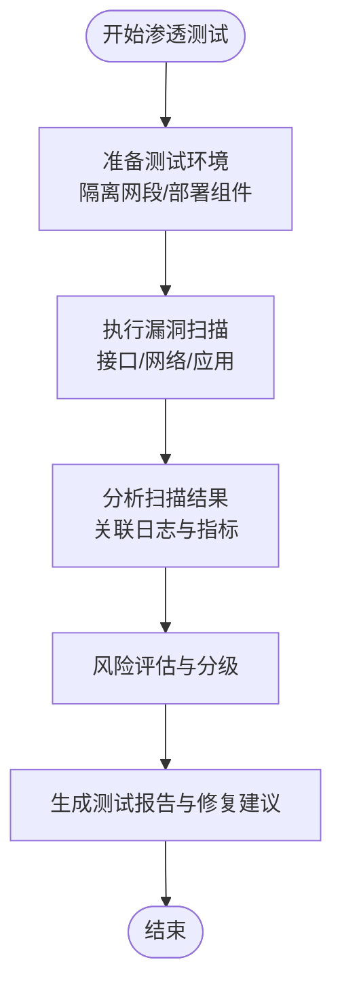
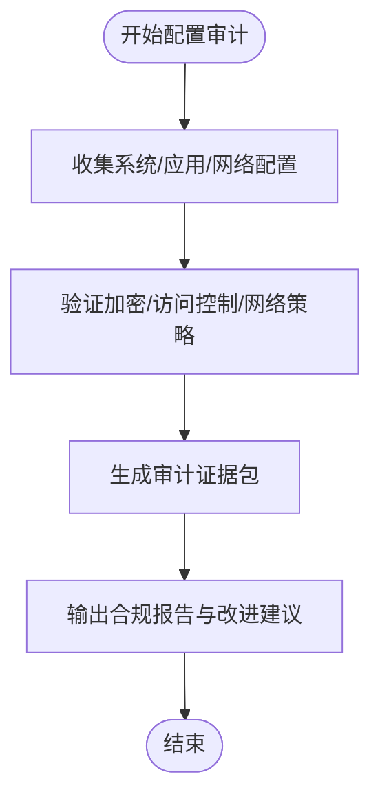
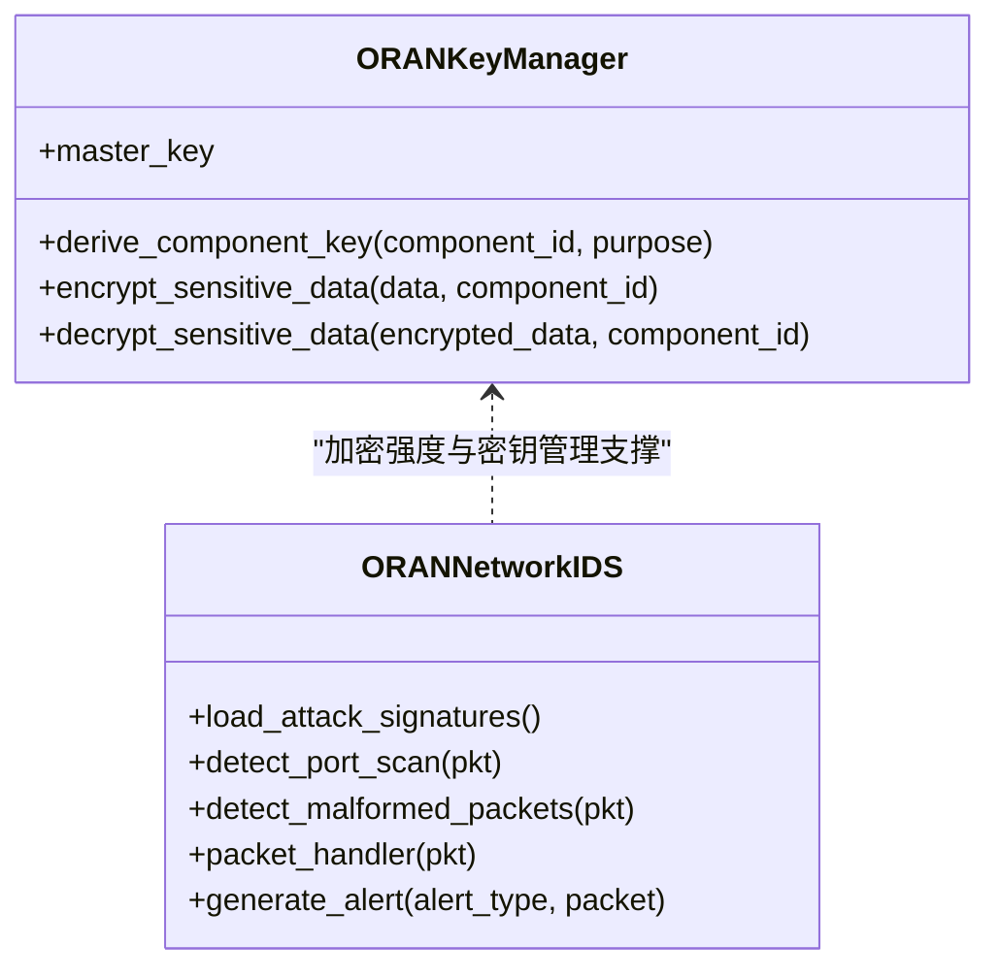
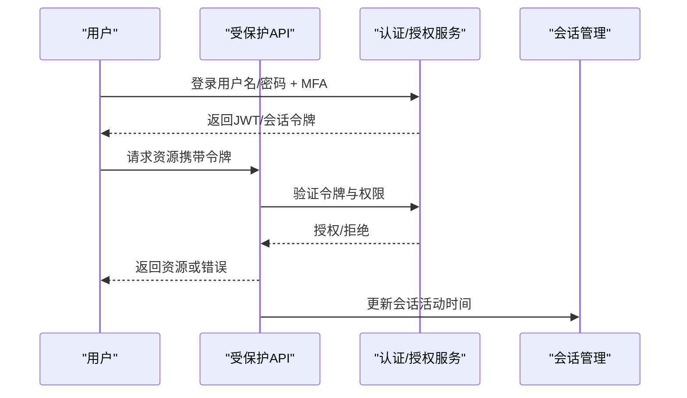
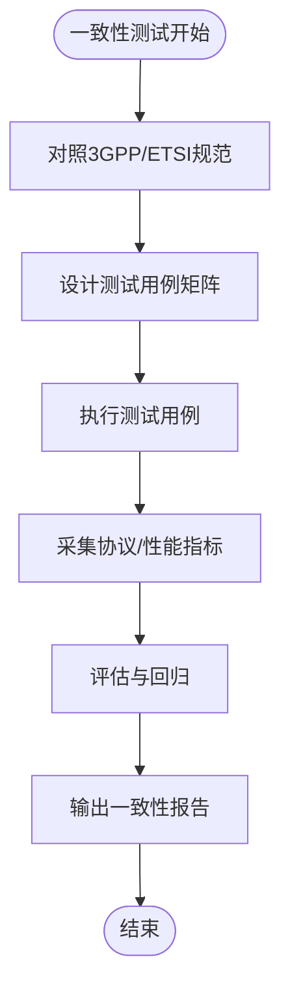
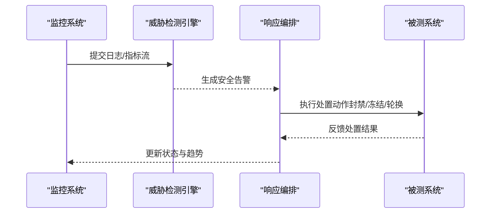
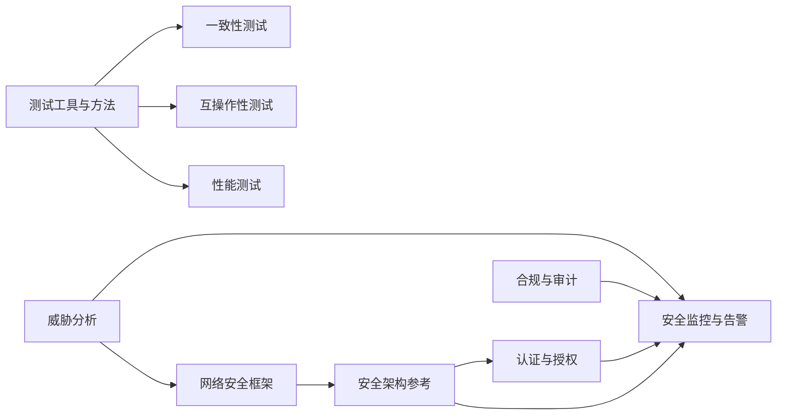

# 安全测试

<cite>
**本文引用的文件**
- [网络安全框架](file://12-security-privacy/network-security/network-security-framework.md)
- [安全架构参考](file://12-security-privacy/security-architecture/security-reference-architecture.md)
- [合规与审计框架](file://12-security-privacy/compliance-auditing/compliance-auditing-framework.md)
- [认证框架](file://12-security-privacy/authentication/authentication-framework.md)
- [安全监控与告警框架](file://12-security-privacy/monitoring-alerting/security-monitoring-framework.md)
- [测试工具与框架](file://13-testing-validation/testing-tools/testing-tools-frameworks.md)
- [一致性测试](file://13-testing-validation/conformance-testing/o-ran-conformance-testing.md)
- [互操作性测试](file://13-testing-validation/interoperability/interoperability-testing.md)
- [性能测试](file://13-testing-validation/performance-testing/performance-testing.md)
- [威胁分析（网络）](file://29-security-threats/threat-analysis/network-security-threats.md)
</cite>

## 目录
1. [简介](#简介)
2. [项目结构](#项目结构)
3. [核心组件](#核心组件)
4. [架构总览](#架构总览)
5. [详细组件分析](#详细组件分析)
6. [依赖关系分析](#依赖关系分析)
7. [性能考量](#性能考量)
8. [故障排查指南](#故障排查指南)
9. [结论](#结论)
10. [附录](#附录)

## 简介
本指南面向O-RAN系统的网络安全验证，围绕渗透测试、漏洞扫描、安全配置审计、加密强度验证、访问控制测试、安全协议符合性测试、安全监控有效性与安全事件响应测试，提供从工具选择、测试环境搭建、测试用例设计到结果分析的全流程实践方案。文档以仓库中的网络安全框架、安全架构、认证与密钥管理、安全监控、测试工具与方法论为基础，结合威胁分析与合规审计，形成可落地的安全测试实施蓝图。

## 项目结构
本仓库中与安全测试直接相关的核心模块包括：
- 网络安全框架：零信任域划分、网络分段、入侵检测与DDoS防护、TLS配置与流量整形
- 安全架构参考：零信任模型、防御纵深、证书与密钥管理、SIEM集成与威胁检测
- 认证与授权：多因子认证、PKI证书体系、OAuth2/JWT、会话管理
- 合规与审计：GDPR、3GPP、ETSI标准映射与合规检查脚本
- 安全监控与告警：多层监控、实时威胁检测、自动化响应编排
- 测试工具与方法：商用/开源测试平台、容器化测试环境、CI/CD集成、安全扫描
- 一致性与互操作性测试：接口一致性、跨厂商兼容性、性能基线
- 威胁分析：常见网络攻击类型与防护要点

**图表来源**
- [网络安全框架](file://12-security-privacy/network-security/network-security-framework.md#L1-L473)
- [安全架构参考](file://12-security-privacy/security-architecture/security-reference-architecture.md#L1-L559)
- [认证框架](file://12-security-privacy/authentication/authentication-framework.md#L1-L208)
- [合规与审计框架](file://12-security-privacy/compliance-auditing/compliance-auditing-framework.md#L1-L486)
- [安全监控与告警框架](file://12-security-privacy/monitoring-alerting/security-monitoring-framework.md#L1-L733)
- [测试工具与框架](file://13-testing-validation/testing-tools/testing-tools-frameworks.md#L1-L598)
- [一致性测试](file://13-testing-validation/conformance-testing/o-ran-conformance-testing.md#L1-L67)
- [互操作性测试](file://13-testing-validation/interoperability/interoperability-testing.md#L1-L231)
- [性能测试](file://13-testing-validation/performance-testing/performance-testing.md#L1-L327)
- [威胁分析（网络）](file://29-security-threats/threat-analysis/network-security-threats.md)

**章节来源**
- [网络安全框架](file://12-security-privacy/network-security/network-security-framework.md#L1-L473)
- [安全架构参考](file://12-security-privacy/security-architecture/security-reference-architecture.md#L1-L559)
- [测试工具与框架](file://13-testing-validation/testing-tools/testing-tools-frameworks.md#L1-L598)

## 核心组件
- 网络安全域与零信任：基于安全域划分（管理域、控制面、用户面、基础设施域），实施最小权限、持续验证与微分段
- 入侵检测与DDoS防护：基于签名与行为的检测、速率限制与流量整形、NFTables与iptables规则
- 加密与通信安全：TLS 1.3/1.2配置、OCSP Stapling、安全头、证书颁发与吊销链路
- 密钥与证书管理：根CA/中间CA层次、组件证书签发、密钥派生与AEAD加密
- 认证与授权：多因子认证、RBAC角色映射、OAuth2/JWT令牌、会话管理
- 安全监控与告警：多层监控、威胁检测引擎、合规检查脚本、自动化响应编排
- 测试工具与方法：商用/开源测试平台、容器化测试环境、CI/CD集成、安全扫描流水线

**章节来源**
- [网络安全框架](file://12-security-privacy/network-security/network-security-framework.md#L6-L426)
- [安全架构参考](file://12-security-privacy/security-architecture/security-reference-architecture.md#L8-L513)
- [认证框架](file://12-security-privacy/authentication/authentication-framework.md#L8-L185)
- [安全监控与告警框架](file://12-security-privacy/monitoring-alerting/security-monitoring-framework.md#L8-L637)
- [测试工具与框架](file://13-testing-validation/testing-tools/testing-tools-frameworks.md#L6-L598)

## 架构总览
下图展示安全测试在O-RAN系统中的端到端交互：测试工具驱动测试执行，采集网络/应用/系统层指标，经由威胁检测引擎与合规检查脚本进行分析，触发安全监控与告警，并联动自动化响应编排。

**图表来源**
- [测试工具与框架](file://13-testing-validation/testing-tools/testing-tools-frameworks.md#L561-L598)
- [安全监控与告警框架](file://12-security-privacy/monitoring-alerting/security-monitoring-framework.md#L119-L217)
- [网络安全框架](file://12-security-privacy/network-security/network-security-framework.md#L114-L426)

## 详细组件分析

### 渗透测试与漏洞扫描实施
- 工具选择
  - 商用：Spirent、Keysight、Anritsu等具备O-RAN接口一致性与协议栈验证能力的平台
  - 开源：Wireshark插件、Robot Framework、PyTest、Docker/K8s容器化测试环境
- 扫描范围
  - 接口层面：E2/F1/O-FH/A1/O1协议一致性与异常模式检测
  - 网络层面：端口扫描、SYN洪泛、ICMP洪泛、畸形包检测
  - 应用层面：API安全、会话劫持、RBAC绕过、敏感信息泄露
- 执行流程
  - 环境准备：隔离测试网段、部署被测组件、配置测试工具
  - 扫描执行：按接口与协议维度执行自动化扫描
  - 结果分析：关联日志与指标，定位脆弱点与风险等级
  - 报告输出：生成合规与修复建议报告

**图表来源**
- [测试工具与框架](file://13-testing-validation/testing-tools/testing-tools-frameworks.md#L6-L598)
- [网络安全框架](file://12-security-privacy/network-security/network-security-framework.md#L114-L426)

**章节来源**
- [测试工具与框架](file://13-testing-validation/testing-tools/testing-tools-frameworks.md#L6-L98)
- [网络安全框架](file://12-security-privacy/network-security/network-security-framework.md#L114-L259)

### 安全配置审计流程
- 审计目标
  - 加密强度：TLS版本、密码套件、OCSP启用、安全头
  - 访问控制：RBAC策略、多因子认证、会话超时与令牌强度
  - 网络安全：防火墙规则、速率限制、微分段、DDoS缓解
- 审计清单
  - 证书有效性与吊销链：根/中间CA、域名匹配、有效期
  - 密钥管理：密钥长度、轮换周期、硬件安全模块使用
  - 日志与审计：完整性、保留期、集中化存储与查询
- 自动化脚本
  - 合规检查脚本：TLS版本、密码策略、SSH配置、不必要的服务
  - 审计证据收集：系统信息、安全配置、网络服务、应用配置、合规状态

**图表来源**
- [合规与审计框架](file://12-security-privacy/compliance-auditing/compliance-auditing-framework.md#L310-L440)
- [安全架构参考](file://12-security-privacy/security-architecture/security-reference-architecture.md#L76-L145)

**章节来源**
- [合规与审计框架](file://12-security-privacy/compliance-auditing/compliance-auditing-framework.md#L1-L486)
- [安全架构参考](file://12-security-privacy/security-architecture/security-reference-architecture.md#L73-L245)

### 加密强度验证策略
- TLS配置验证
  - 版本与套件：仅启用TLS 1.3/1.2，禁用弱套件；启用OCSP Stapling与安全头
  - 证书链：根CA可信、中间CA层级正确、吊销检查启用
- 密钥与算法
  - 密钥长度与算法：RSA 2048+/ECC曲线、AEAD对称加密
  - 密钥派生：PBKDF2迭代次数、盐值随机性、密钥轮换策略
- 实施要点
  - 组件证书签发与部署：按域划分CA、自动签发与续期
  - 密钥生命周期：生成、存储、使用、归档与销毁

**图表来源**
- [安全架构参考](file://12-security-privacy/security-architecture/security-reference-architecture.md#L147-L245)
- [网络安全框架](file://12-security-privacy/network-security/network-security-framework.md#L114-L259)

**章节来源**
- [安全架构参考](file://12-security-privacy/security-architecture/security-reference-architecture.md#L147-L245)
- [网络安全框架](file://12-security-privacy/network-security/network-security-framework.md#L428-L471)

### 访问控制测试
- 多因子认证（MFA）
  - 配置主/次/三次认证级别，验证不同权限级别的访问路径
- RBAC与权限映射
  - 角色定义与LDAP组映射，验证越权访问阻断
- 会话管理
  - 令牌生成与校验、超时与刷新、IP绑定与活动追踪

**图表来源**
- [认证框架](file://12-security-privacy/authentication/authentication-framework.md#L72-L185)
- [安全架构参考](file://12-security-privacy/security-architecture/security-reference-architecture.md#L284-L337)

**章节来源**
- [认证框架](file://12-security-privacy/authentication/authentication-framework.md#L8-L185)
- [安全架构参考](file://12-security-privacy/security-architecture/security-reference-architecture.md#L284-L337)

### 安全协议符合性测试设计与执行
- 一致性测试
  - 接口一致性：E2/A1/O1/F1/O-FH消息格式、时序与错误处理
  - 功能一致性：订阅管理、指示消息、策略下发与执行
- 互操作性测试
  - 多厂商组合：CU/DU/RIC跨厂商互通，消息交换成功率与延迟
- 性能一致性
  - 基于基准的吞吐、延迟、抖动与连接密度测试

**图表来源**
- [一致性测试](file://13-testing-validation/conformance-testing/o-ran-conformance-testing.md#L6-L67)
- [互操作性测试](file://13-testing-validation/interoperability/interoperability-testing.md#L28-L177)
- [性能测试](file://13-testing-validation/performance-testing/performance-testing.md#L169-L242)

**章节来源**
- [一致性测试](file://13-testing-validation/conformance-testing/o-ran-conformance-testing.md#L1-L67)
- [互操作性测试](file://13-testing-validation/interoperability/interoperability-testing.md#L1-L231)
- [性能测试](file://13-testing-validation/performance-testing/performance-testing.md#L1-L327)

### 安全监控有效性测试与安全事件响应测试
- 监控有效性
  - 多层指标采集：网络/应用/系统/数据层
  - 实时威胁检测：异常登录、端口扫描、异常数据传输
  - 合规监控：定期合规检查与报告生成
- 响应测试
  - 自动化编排：可疑IP封禁、账户冻结、密钥轮换、取证镜像
  - 告警与升级：分级阈值、通知链路、升级策略

**图表来源**
- [安全监控与告警框架](file://12-security-privacy/monitoring-alerting/security-monitoring-framework.md#L119-L217)
- [安全监控与告警框架](file://12-security-privacy/monitoring-alerting/security-monitoring-framework.md#L442-L637)

**章节来源**
- [安全监控与告警框架](file://12-security-privacy/monitoring-alerting/security-monitoring-framework.md#L1-L733)

## 依赖关系分析
- 组件耦合
  - 网络安全框架与安全架构参考共同决定零信任与分段策略
  - 认证与授权依赖密钥/证书管理与会话管理
  - 安全监控与告警依赖测试工具与合规脚本提供的数据与指标
- 外部依赖
  - 商用测试平台（Spirent/Keysight/Anritsu）与开源工具（Wireshark/Robot Framework/PyTest）
  - 合规标准（GDPR、3GPP、ETSI）与监管要求

**图表来源**
- [网络安全框架](file://12-security-privacy/network-security/network-security-framework.md#L1-L473)
- [安全架构参考](file://12-security-privacy/security-architecture/security-reference-architecture.md#L1-L559)
- [认证框架](file://12-security-privacy/authentication/authentication-framework.md#L1-L208)
- [合规与审计框架](file://12-security-privacy/compliance-auditing/compliance-auditing-framework.md#L1-L486)
- [安全监控与告警框架](file://12-security-privacy/monitoring-alerting/security-monitoring-framework.md#L1-L733)
- [测试工具与框架](file://13-testing-validation/testing-tools/testing-tools-frameworks.md#L1-L598)
- [一致性测试](file://13-testing-validation/conformance-testing/o-ran-conformance-testing.md#L1-L67)
- [互操作性测试](file://13-testing-validation/interoperability/interoperability-testing.md#L1-L231)
- [性能测试](file://13-testing-validation/performance-testing/performance-testing.md#L1-L327)
- [威胁分析（网络）](file://29-security-threats/threat-analysis/network-security-threats.md)

**章节来源**
- [网络安全框架](file://12-security-privacy/network-security/network-security-framework.md#L1-L473)
- [安全架构参考](file://12-security-privacy/security-architecture/security-reference-architecture.md#L1-L559)
- [测试工具与框架](file://13-testing-validation/testing-tools/testing-tools-frameworks.md#L1-L598)

## 性能考量
- 测试环境与工具
  - 使用容器/K8s编排测试环境，确保可重复性与隔离性
  - 利用Prometheus/Grafana进行实时监控与可视化
- 性能基线
  - 基于性能测试文档设定吞吐、延迟、抖动与连接密度目标
  - 将安全措施（速率限制、DDoS缓解）纳入性能影响评估

**章节来源**
- [测试工具与框架](file://13-testing-validation/testing-tools/testing-tools-frameworks.md#L298-L559)
- [性能测试](file://13-testing-validation/performance-testing/performance-testing.md#L1-L327)

## 故障排查指南
- 常见问题
  - TLS握手失败：检查证书链、OCSP、密码套件与客户端版本
  - 认证失败：核对MFA令牌、RBAC权限、会话令牌有效性
  - 网络异常：核查防火墙规则、速率限制、微分段策略
- 排查步骤
  - 快速定位：查看最近告警与日志，确认受影响组件
  - 深入分析：抓包分析协议消息、检查密钥与证书状态
  - 修复验证：执行最小化回归测试，确认修复有效且无副作用

**章节来源**
- [网络安全框架](file://12-security-privacy/network-security/network-security-framework.md#L311-L426)
- [安全监控与告警框架](file://12-security-privacy/monitoring-alerting/security-monitoring-framework.md#L306-L440)

## 结论
通过将网络安全框架、安全架构参考、认证与密钥管理、安全监控与告警、测试工具与方法、一致性/互操作性/性能测试以及威胁分析有机整合，本指南提供了O-RAN网络安全验证的系统化实施路径。建议在实际部署中以零信任与防御纵深为核心，以自动化测试与监控为抓手，以合规与审计为保障，持续改进安全成熟度。

## 附录
- 测试环境搭建建议
  - 使用容器/K8s快速搭建隔离测试环境，预置Wireshark插件与测试脚本
  - 在管理域/控制面/用户面/基础设施域分别部署测试组件
- 测试用例设计模板
  - 接口一致性：消息格式、时序、错误码
  - 安全性：弱密码、未授权访问、证书过期、加密强度不足
  - 性能：峰值吞吐、延迟分布、抖动、并发连接数
- 结果分析与报告
  - 输出测试报告、修复建议、合规评分与改进计划