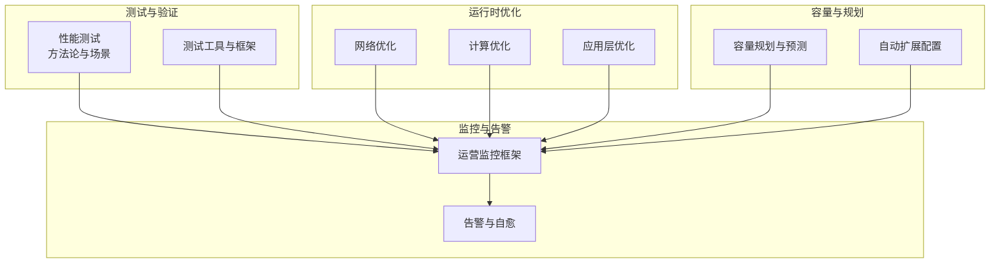
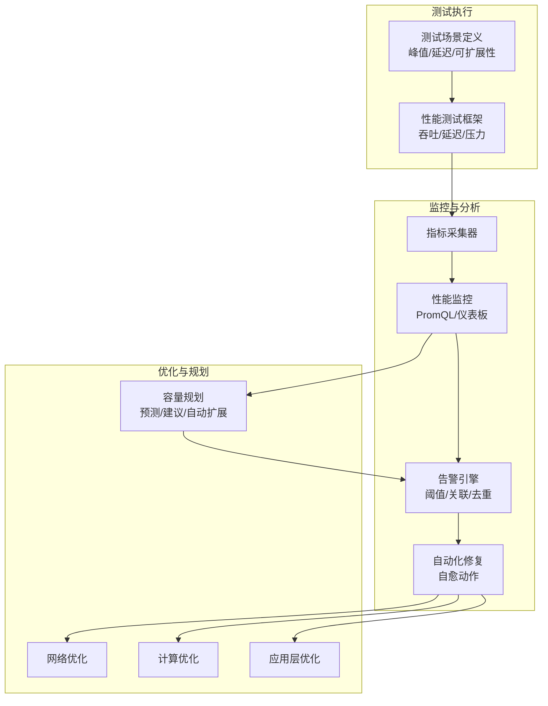
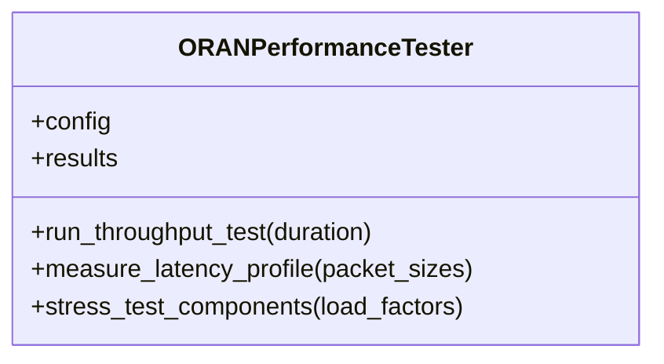
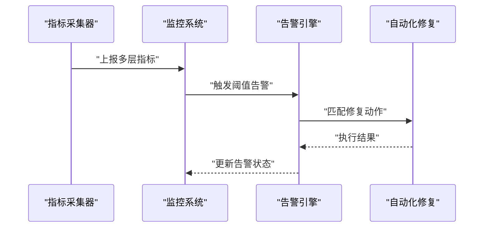
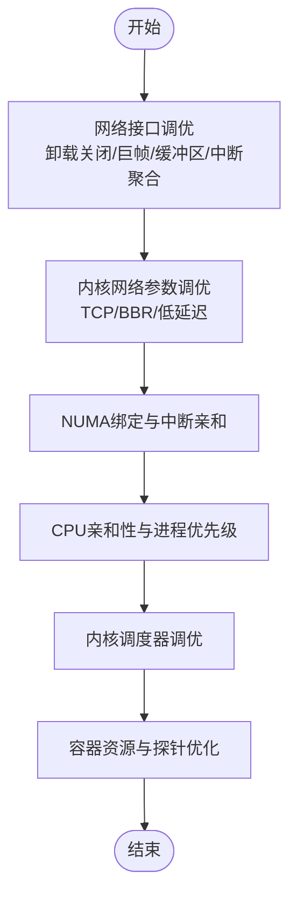
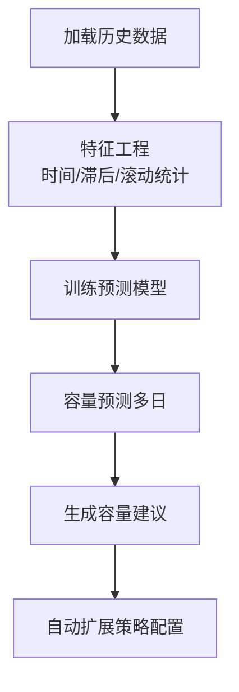

# 性能测试

<cite>
**本文引用的文件**
- [性能测试（中文）](file://13-testing-validation/performance-testing/performance-testing-zh.md)
- [性能测试（英文）](file://13-testing-validation/performance-testing/performance-testing.md)
- [性能优化框架（中文）](file://14-operations-management/performance-optimization/performance-optimization-framework-zh.md)
- [容量规划框架（中文）](file://14-operations-management/capacity-planning/capacity-planning-framework-zh.md)
- [网络性能优化实践](file://26-performance-optimization/network-optimization/network-performance-tuning.md)
- [运营监控告警系统（中文）](file://14-operations-management/monitoring-alerting/operations-monitoring-framework-zh.md)
</cite>

## 目录
1. [简介](#简介)
2. [项目结构](#项目结构)
3. [核心组件](#核心组件)
4. [架构总览](#架构总览)
5. [详细组件分析](#详细组件分析)
6. [依赖关系分析](#依赖关系分析)
7. [性能考量](#性能考量)
8. [故障排查指南](#故障排查指南)
9. [结论](#结论)
10. [附录](#附录)

## 简介
本指南面向O-RAN系统的性能测试与压力验证，覆盖吞吐量与延迟基准、并发连接压力、资源利用率分析、故障恢复时间测量、可扩展性验证与容量规划，并提供性能基线建立、性能回归检测、优化建议与生产监控的完整流程。文档结合仓库中现有的性能测试方法论、监控框架与优化实践，形成可落地的测试与运维闭环。

## 项目结构
围绕性能测试主题，仓库中与之直接相关的内容主要分布在以下模块：
- 测试方法论与场景：13-testing-validation/performance-testing
- 运行时优化与调优：14-operations-management/performance-optimization
- 容量规划与预测：14-operations-management/capacity-planning
- 网络性能优化实践：26-performance-optimization/network-optimization
- 生产监控与告警：14-operations-management/monitoring-alerting

章节来源
- file://13-testing-validation/performance-testing/performance-testing-zh.md#L1-L327
- file://14-operations-management/performance-optimization/performance-optimization-framework-zh.md#L1-L342
- file://14-operations-management/capacity-planning/capacity-planning-framework-zh.md#L1-L505
- file://26-performance-optimization/network-optimization/network-performance-tuning.md#L1-L98
- file://14-operations-management/monitoring-alerting/operations-monitoring-framework-zh.md#L1-L909

## 核心组件
- 性能测试框架与场景：提供吞吐量、延迟、丢包、抖动、连接密度等测试类别，以及峰值性能、延迟特征化、可扩展性验证等场景模板。
- 监控与指标采集：多层监控（基础设施/应用/业务），指标采集器与告警规则，支持实时可视化与自动化修复。
- 运行时优化：网络接口调优、内核参数、NUMA绑定、CPU亲和性与调度、容器资源优化。
- 容量规划：历史数据加载、特征工程、机器学习预测、容量建议与自动扩展策略。
- 网络性能优化：频谱效率、干扰管理、数据压缩、协议优化、QoS与时延抖动控制、负载均衡。

章节来源
- file://13-testing-validation/performance-testing/performance-testing-zh.md#L6-L28
- file://14-operations-management/monitoring-alerting/operations-monitoring-framework-zh.md#L8-L44
- file://14-operations-management/performance-optimization/performance-optimization-framework-zh.md#L6-L101
- file://14-operations-management/capacity-planning/capacity-planning-framework-zh.md#L8-L186
- file://26-performance-optimization/network-optimization/network-performance-tuning.md#L8-L98

## 架构总览
下图展示从“测试执行”到“监控与优化”的闭环流程，包括测试场景、指标采集、告警与自愈、容量规划与自动扩展。

图表来源
- [性能测试（中文）](file://13-testing-validation/performance-testing/performance-testing-zh.md#L58-L167)
- [运营监控告警系统（中文）](file://14-operations-management/monitoring-alerting/operations-monitoring-framework-zh.md#L48-L260)
- [性能优化框架（中文）](file://14-operations-management/performance-optimization/performance-optimization-framework-zh.md#L103-L342)
- [容量规划框架（中文）](file://14-operations-management/capacity-planning/capacity-planning-framework-zh.md#L18-L186)

## 详细组件分析

### 组件A：性能测试框架与场景
- 测试类别：网络性能（吞吐、延迟、丢包、抖动、连接密度）、资源性能（CPU、内存、存储I/O、网络带宽、功耗）、可扩展性（水平/垂直扩展、负载分布、容量规划、增长建模）。
- 关键指标：无线接入网、核心网、云基础设施KPIs，包含目标值与测量方法。
- 测试方法论：提供Python类封装的测试执行流程，包括持续吞吐测试、延迟特征化、压力测试（按负载因子扩展环境）。
- 场景模板：峰值性能测试、延迟特征化测试、可扩展性验证测试，含测试配置、测量点与成功标准。

图表来源
- [性能测试（中文）](file://13-testing-validation/performance-testing/performance-testing-zh.md#L60-L138)

章节来源
- file://13-testing-validation/performance-testing/performance-testing-zh.md#L6-L28
- file://13-testing-validation/performance-testing/performance-testing-zh.md#L29-L57
- file://13-testing-validation/performance-testing/performance-testing-zh.md#L58-L138
- file://13-testing-validation/performance-testing/performance-testing-zh.md#L169-L242

### 组件B：监控与指标采集
- 多层监控：基础设施（CPU/内存/磁盘/网络）、应用（RIC/接口/API）、业务（KPI/SLA/QoS/业务影响）。
- 指标采集器：分层采集节点、K8s、存储、网络、RIC、接口、服务、性能、KPI、SLA、QoS、业务影响等指标。
- 告警引擎：阈值规则、指标路径提取、告警创建与通知通道（邮件/微信/短信），支持告警关联与去重。
- 自动化修复：按告警类型匹配修复动作（如高CPU/内存耗尽/RIC无响应），记录执行历史。

图表来源
- [运营监控告警系统（中文）](file://14-operations-management/monitoring-alerting/operations-monitoring-framework-zh.md#L48-L260)
- [运营监控告警系统（中文）](file://14-operations-management/monitoring-alerting/operations-monitoring-framework-zh.md#L266-L486)
- [运营监控告警系统（中文）](file://14-operations-management/monitoring-alerting/operations-monitoring-framework-zh.md#L698-L809)

章节来源
- file://14-operations-management/monitoring-alerting/operations-monitoring-framework-zh.md#L8-L44
- file://14-operations-management/monitoring-alerting/operations-monitoring-framework-zh.md#L48-L260
- file://14-operations-management/monitoring-alerting/operations-monitoring-framework-zh.md#L266-L486
- file://14-operations-management/monitoring-alerting/operations-monitoring-framework-zh.md#L698-L809

### 组件C：运行时优化（网络/计算/应用）
- 网络优化：接口调优（关闭特定卸载、巨帧、环形缓冲区、中断聚合）、流量控制与优先级队列、内核参数（TCP BBR、低延迟参数、NUMA绑定）。
- 计算优化：CPU亲和性与调度（NUMA拓扑感知、进程优先级）、内核调度器参数调优。
- 应用层优化：容器资源请求/限制、探针配置、环境变量（GC/并行度）。

图表来源
- [性能优化框架（中文）](file://14-operations-management/performance-optimization/performance-optimization-framework-zh.md#L8-L101)
- [性能优化框架（中文）](file://14-operations-management/performance-optimization/performance-optimization-framework-zh.md#L103-L234)
- [性能优化框架（中文）](file://14-operations-management/performance-optimization/performance-optimization-framework-zh.md#L236-L300)

章节来源
- file://14-operations-management/performance-optimization/performance-optimization-framework-zh.md#L8-L101
- file://14-operations-management/performance-optimization/performance-optimization-framework-zh.md#L103-L234
- file://14-operations-management/performance-optimization/performance-optimization-framework-zh.md#L236-L300

### 组件D：容量规划与自动扩展
- 负载预测：历史数据加载、时间特征与滚动统计、随机森林模型训练与预测。
- 容量建议：基于利用率阈值与增长趋势生成短期/长期建议。
- 自动扩展：针对近端RT RIC、O-DU集群、CU池的指标阈值、扩展/收缩因子、冷却期与实例上下限。

图表来源
- [容量规划框架（中文）](file://14-operations-management/capacity-planning/capacity-planning-framework-zh.md#L18-L186)
- [容量规划框架（中文）](file://14-operations-management/capacity-planning/capacity-planning-framework-zh.md#L188-L266)

章节来源
- file://14-operations-management/capacity-planning/capacity-planning-framework-zh.md#L18-L186
- file://14-operations-management/capacity-planning/capacity-planning-framework-zh.md#L188-L266

### 组件E：网络性能优化实践
- 无线资源优化：载波聚合、MCS自适应、HARQ重传、波束赋形、干扰随机化。
- 传输效率优化：头部压缩、负载压缩、协议栈优化、QoS参数精细化。
- 负载均衡：移动性参数、动态资源池、容量规划与弹性扩缩容。
- 性能监控：KPI指标体系与优化前后对比、趋势分析、ROI评估。

章节来源
- file://26-performance-optimization/network-optimization/network-performance-tuning.md#L8-L98

## 依赖关系分析
- 测试框架依赖监控系统提供实时指标与告警；监控系统依赖采集器与KPI/SLA/QoS等业务指标。
- 优化措施（网络/计算/应用）直接影响测试结果与监控指标；容量规划与自动扩展为长期稳定性提供保障。
- 告警与自愈动作对测试执行过程中的异常进行快速处置，减少对测试的影响。

图表来源
- [性能测试（中文）](file://13-testing-validation/performance-testing/performance-testing-zh.md#L58-L167)
- [运营监控告警系统（中文）](file://14-operations-management/monitoring-alerting/operations-monitoring-framework-zh.md#L48-L260)
- [容量规划框架（中文）](file://14-operations-management/capacity-planning/capacity-planning-framework-zh.md#L18-L186)

章节来源
- file://13-testing-validation/performance-testing/performance-testing-zh.md#L58-L167
- file://14-operations-management/monitoring-alerting/operations-monitoring-framework-zh.md#L48-L260
- file://14-operations-management/capacity-planning/capacity-planning-framework-zh.md#L18-L186

## 性能考量
- 基线建立：使用峰值性能测试与延迟特征化测试建立系统在标准配置下的基线指标（吞吐、延迟、抖动、丢包、连接密度）。
- 回归检测：定期执行相同场景，对比历史基线，结合监控仪表板与告警阈值识别异常。
- 资源利用率：关注CPU、内存、存储I/O、网络带宽与功耗，结合优化框架进行针对性调优。
- 可扩展性：通过可扩展性验证测试评估线性/次线性扩展，结合容量规划与自动扩展策略。
- 真实场景：结合网络性能优化实践，模拟实际无线/传输/控制面场景，验证端到端性能。

章节来源
- file://13-testing-validation/performance-testing/performance-testing-zh.md#L169-L242
- file://26-performance-optimization/network-optimization/network-performance-tuning.md#L8-L98
- file://14-operations-management/performance-optimization/performance-optimization-framework-zh.md#L6-L101

## 故障排查指南
- 快速定位：利用告警引擎的阈值规则与指标路径提取，快速定位异常类别（基础设施/应用/网络/业务）。
- 关联分析：通过告警关联规则识别级联故障与性能退化趋势，避免误报与噪声。
- 自愈处置：针对常见问题（高CPU、内存耗尽、RIC无响应）执行预置修复动作，缩短MTTR。
- 监控验证：在修复后通过监控仪表板与PromQL查询确认指标恢复，必要时回滚或进一步优化。

章节来源
- file://14-operations-management/monitoring-alerting/operations-monitoring-framework-zh.md#L266-L486
- file://14-operations-management/monitoring-alerting/operations-monitoring-framework-zh.md#L488-L528
- file://14-operations-management/monitoring-alerting/operations-monitoring-framework-zh.md#L698-L809

## 结论
通过将性能测试框架、监控告警系统、运行时优化与容量规划相结合，可形成覆盖“测试—监控—优化—规划”的完整闭环。建议在标准化测试场景基础上建立基线，持续进行回归检测与容量预测，配合自动化修复与告警联动，确保O-RAN系统在生产环境中稳定、高效、可扩展地运行。

## 附录
- 测试场景清单与成功标准：参见性能测试文档中的场景模板与KPIs。
- 监控仪表板与PromQL：参见监控框架中的查询示例与仪表板配置。
- 优化清单：参见优化框架中的网络/计算/应用层优化要点。
- 容量规划与自动扩展：参见容量规划框架中的预测模型与策略配置。

章节来源
- file://13-testing-validation/performance-testing/performance-testing-zh.md#L169-L327
- file://14-operations-management/monitoring-alerting/operations-monitoring-framework-zh.md#L244-L273
- file://14-operations-management/performance-optimization/performance-optimization-framework-zh.md#L236-L342
- file://14-operations-management/capacity-planning/capacity-planning-framework-zh.md#L188-L505