# 测试与验证

<cite>
**本文引用的文件**
- [O-RAN 性能测试](file://13-testing-validation/performance-testing/performance-testing-zh.md)
- [O-RAN 测试一致性验证](file://13-testing-validation/conformance-testing/o-ran-conformance-testing.md)
- [O-RAN Test Automation Framework](file://13-testing-validation/automation-framework/test-automation-framework.md)
- [O-RAN Interoperability Testing](file://13-testing-validation/interoperability/interoperability-testing.md)
- [O-RAN Testing Tools and Frameworks](file://13-testing-validation/testing-tools/testing-tools-frameworks.md)
- [O-RAN 标准与规范](file://09-standards-compliance/readme-zh.md)
- [E2 接口](file://03-interface-standards/e2-interface.md)
- [开放前传接口 (O-FH)](file://03-interface-standards/o-fh-interface.md)
- [GitHub Actions 工作流](file://.github/workflows/validate.yml)
- [验证脚本](file://scripts/validate.py)
- [Frontmatter 添加工具](file://scripts/add-frontmatter.py)
</cite>

## 更新摘要
**变更内容**
- 新增 CI/CD 验证基础设施章节，详细介绍 GitHub Actions 工作流配置
- 添加 frontmatter 覆盖率检查功能说明
- 集成断链检测机制
- 实现自动化报告生成和上传功能
- 更新测试框架章节以包含新的验证工具

## 目录
1. [简介](#简介)
2. [项目结构](#项目结构)
3. [核心组件](#核心组件)
4. [架构总览](#架构总览)
5. [详细组件分析](#详细组件分析)
6. [CI/CD 验证基础设施](#cicd-验证基础设施)
7. [依赖分析](#依赖分析)
8. [性能考虑](#性能考虑)
9. [故障排查指南](#故障排查指南)
10. [结论](#结论)
11. [附录](#附录)

## 简介
本文件面向O-RAN测试与验证，围绕自动化测试框架、一致性测试、互操作性测试、性能测试及测试工具使用，系统梳理O-RAN联盟测试套件、3GPP规范验证与符合性测试流程，并提供多厂商兼容性测试、接口互操作性验证与Plugfest参与指导。同时，给出性能基准测试、并发压力测试、可扩展性验证与真实世界性能场景的测试方法，以及CI/CD测试流水线、容器化测试环境与测试自动化框架的构建与使用建议，最后覆盖测试工具选择指南、集成策略与测试结果分析方法。

**更新** 新增了完整的CI/CD验证基础设施，包括GitHub Actions工作流、frontmatter覆盖率检查、断链检测和自动化报告生成功能。

## 项目结构
本仓库将测试与验证相关内容分布在"13-testing-validation"目录下，分别覆盖自动化框架、一致性测试、互操作性测试、性能测试与测试工具框架；同时，".github/workflows"提供CI/CD验证基础设施；"scripts"目录包含验证工具和frontmatter管理脚本；"09-standards-compliance"提供标准与规范背景；"03-interface-standards"提供接口层面的技术细节，支撑测试场景设计与验证。

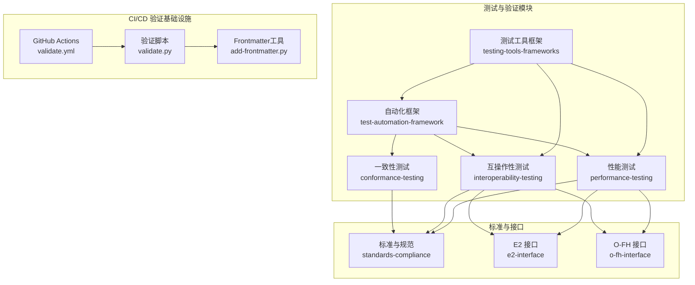

**图表来源**
- [O-RAN Test Automation Framework:1-134](file://13-testing-validation/automation-framework/test-automation-framework.md#L1-L134)
- [GitHub Actions 工作流:1-93](file://.github/workflows/validate.yml#L1-L93)
- [验证脚本:1-333](file://scripts/validate.py#L1-L333)
- [Frontmatter 添加工具:1-187](file://scripts/add-frontmatter.py#L1-L187)

**章节来源**
- [O-RAN Test Automation Framework:1-134](file://13-testing-validation/automation-framework/test-automation-framework.md#L1-L134)
- [GitHub Actions 工作流:1-93](file://.github/workflows/validate.yml#L1-L93)
- [验证脚本:1-333](file://scripts/validate.py#L1-L333)
- [Frontmatter 添加工具:1-187](file://scripts/add-frontmatter.py#L1-L187)

## 核心组件
- 自动化测试框架：提供测试编排、执行引擎、测试数据管理、结果分析与报告、CI/CD集成、监控与分析、安全与合规等能力。
- 一致性测试：覆盖O-RAN联盟测试套件（架构、接口、功能、性能、安全）与3GPP规范验证（NG-RAN架构、5G NR协议、RAN功能规范、互操作性要求）。
- 互操作性测试：验证多厂商设备在E2/F1/O-FH/A1/O1等接口上的兼容性与系统集成能力。
- 性能测试：覆盖网络性能（吞吐量、延迟、丢包、抖动、连接密度）、资源性能（CPU、内存、存储I/O、网络带宽、功耗）与可扩展性（水平/垂直扩展、负载分布、容量规划、增长建模）。
- 测试工具框架：整合商业与开源工具，提供网络测试平台、协议分析工具、容器化测试环境、Kubernetes编排、CI/CD流水线、监控与可视化、安全扫描与合规验证。
- **新增** CI/CD验证基础设施：GitHub Actions工作流、frontmatter覆盖率检查、断链检测、自动化报告生成。

**章节来源**
- [O-RAN Test Automation Framework:1-134](file://13-testing-validation/automation-framework/test-automation-framework.md#L1-L134)
- [GitHub Actions 工作流:1-93](file://.github/workflows/validate.yml#L1-L93)
- [验证脚本:1-333](file://scripts/validate.py#L1-L333)

## 架构总览
下图展示测试与验证的整体架构：自动化框架作为中枢，承载一致性测试、互操作性测试与性能测试；测试工具框架提供工具与平台支撑；CI/CD验证基础设施确保文档质量和链接完整性；标准与规范提供测试依据；接口文档为具体测试场景提供协议与实现细节。

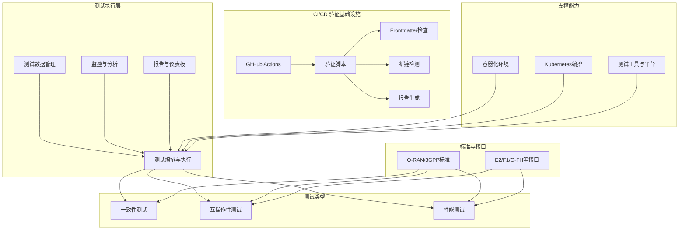

**图表来源**
- [O-RAN Test Automation Framework:1-134](file://13-testing-validation/automation-framework/test-automation-framework.md#L1-L134)
- [GitHub Actions 工作流:1-93](file://.github/workflows/validate.yml#L1-L93)
- [验证脚本:1-333](file://scripts/validate.py#L1-L333)

## 详细组件分析

### 自动化测试框架
- 核心能力：测试编排、分布式执行、测试数据管理、结果分析与报告、CI/CD集成、监控与分析、安全与合规。
- 技术栈：Jenkins/GitLab CI/GitHub Actions、Docker/Kubernetes、Robot Framework/PyTest/JUnit、Prometheus/Grafana、Git。
- 最佳实践：模块化设计、可维护性、可扩展性、可靠性、可追溯性；在CI中执行冒烟测试、定时执行综合测试、触发性能回归测试、自动化安全扫描、自动生成并发布测试报告。
- 高级特性：AI驱动的测试选择、预测性故障分析、动态测试生成、自愈测试；并行执行与资源调度、结果合并与报告、跨测试依赖与协调。
- 安全与合规：测试环境隔离、网络分段与访问控制、测试基础设施安全扫描、测试凭据与证书安全、合规性验证与审计追踪。

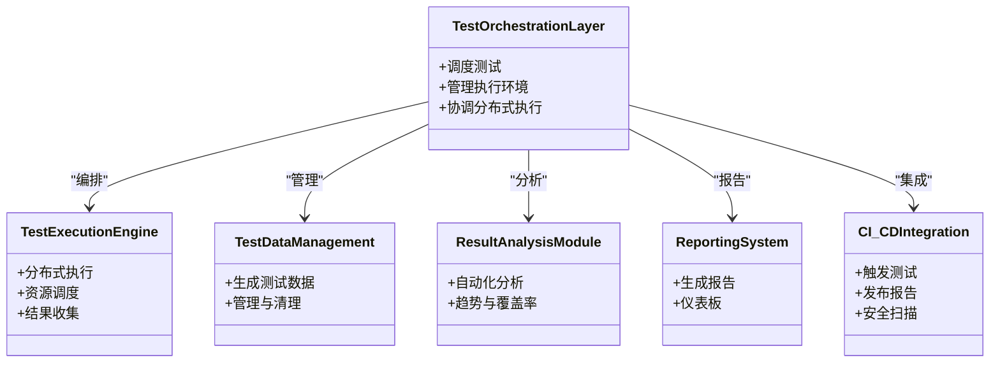

**图表来源**
- [O-RAN Test Automation Framework:1-134](file://13-testing-validation/automation-framework/test-automation-framework.md#L1-L134)

**章节来源**
- [O-RAN Test Automation Framework:1-134](file://13-testing-validation/automation-framework/test-automation-framework.md#L1-L134)

### 一致性测试
- 测试套件：架构一致性、接口一致性（E2/A1/O1等）、功能一致性、性能一致性、安全一致性。
- 3GPP验证：NG-RAN架构、5G NR协议、RAN功能规范、互操作性要求。
- 测试环境：标准化测试环境搭建、网络拓扑模拟、协议栈实现验证、测试数据准备。
- 测试流程：准备阶段（测试计划、环境验证、工具校准、基线建立）、执行阶段（用例运行、实时监控、异常处理、中间结果分析）、评估阶段（汇总结果、不符合项识别、根因分析、改进建议）。
- 质量保证：功能覆盖、场景覆盖、边界条件、异常处理；测试用例质量评审、结果准确性验证、环境代表性评估、过程可重复性保证。

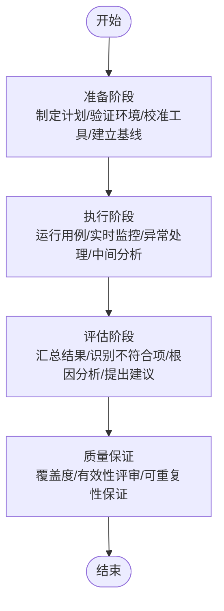

**图表来源**
- [O-RAN 测试一致性验证:1-67](file://13-testing-validation/conformance-testing/o-ran-conformance-testing.md#L1-L67)

**章节来源**
- [O-RAN 测试一致性验证:1-67](file://13-testing-validation/conformance-testing/o-ran-conformance-testing.md#L1-L67)

### 互操作性测试
- 目标：多厂商兼容性、接口标准合规、系统集成验证。
- 场景：E2接口（多厂商RIC与DU通信）、F1接口（CU与DU通信，含连接建立、UE上下文、承载管理、RRC转移、错误处理与恢复）、O-FH接口（前传接口兼容性与配置选项）。
- 方法论：黑盒测试（标准协议合规与功能要求）、灰盒测试（部分内部结构知识，验证特定厂商实现细节与优化）、白盒测试（核心算法实现、代码覆盖率、安全漏洞评估、性能优化验证）。
- 环境配置：多厂商测试床网络拓扑、组件清单与版本信息、测试矩阵（按厂商组合与期望结果）。
- 验证准则：功能性（消息交换成功率、协议合规、特性兼容、错误处理与优雅降级）、性能（延迟一致性、吞吐维持、资源共享、可扩展性）、可靠性（连接稳定性、故障恢复时间、会话持久性、负载均衡）。
- 认证与合规：O-RAN联盟认证、3GPP兼容性验证、MSA合规、区域监管要求；最佳实践（厂商协调、文档审查、环境隔离、基线建立、系统化执行、详细日志、实时监控、问题记录、结果分析、问题解决、优化建议、知识共享）。
- 工具与框架：Spirent Landslide、Keysight、Anritsu、Wireshark插件、Open5GS/srsRAN/OAI/Free5GC、自定义Python测试框架、Docker/Kubernetes、Grafana/Prometheus。

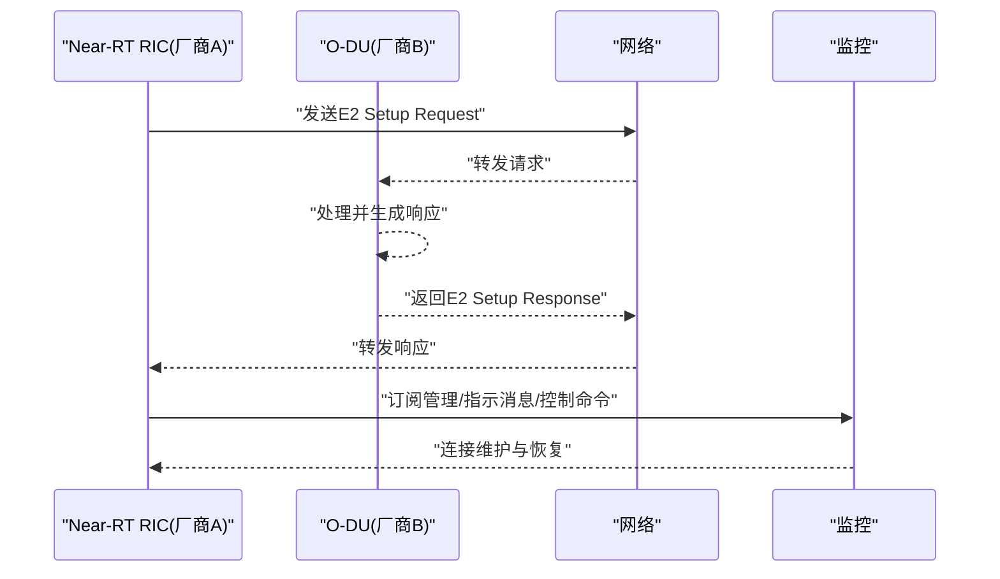

**图表来源**
- [O-RAN Interoperability Testing:30-56](file://13-testing-validation/interoperability/interoperability-testing.md#L30-L56)
- [E2 接口:1-337](file://03-interface-standards/e2-interface.md#L1-L337)

**章节来源**
- [O-RAN Interoperability Testing:1-231](file://13-testing-validation/interoperability/interoperability-testing.md#L1-L231)
- [E2 接口:1-337](file://03-interface-standards/e2-interface.md#L1-L337)
- [开放前传接口 (O-FH):1-397](file://03-interface-standards/o-fh-interface.md#L1-L397)

### 性能测试
- 类别：网络性能（吞吐量、延迟、丢包、抖动、连接密度）、资源性能（CPU、内存、存储I/O、网络带宽、功耗）、可扩展性（水平/垂直扩展、负载分布、容量规划、增长建模）。
- KPI：无线接入网（峰值吞吐量、用户面/控制面延迟、连接建立时间、切换成功率）、核心网（会话建立速率、数据包处理速率、Diameter事务速率、数据库查询响应、API响应时间）、云基础设施（容器启动时间、虚拟机配置时间、自动扩展响应、负载均衡器延迟、存储IOPS）。
- 方法论：负载测试框架（持续吞吐量测试、延迟特征化、压力测试与环境扩展）、测试环境配置（硬件规格、软件堆栈、网络拓扑）、测试场景（峰值性能、延迟特征化、可扩展性验证）。
- 监控与分析：PromQL关键指标（吞吐量、延迟、资源利用率、错误率）、实时仪表板（吞吐量趋势、延迟热力图、资源关联性、异常检测、容量规划）。
- 优化指南：网络优化（接口调优、缓冲区管理、QoS、负载均衡、协议优化）、系统优化（CPU亲和性、内存管理、存储I/O、内核参数、容器优化）、应用级优化（算法效率、缓存策略、数据库优化、API性能、并行处理）。
- 报告与文档：执行摘要、详细结果、对比分析、优化建议、风险评估；持续性能监控（自动化回归、告警系统、趋势分析、容量规划、SLA合规）。
- 行业基准：运营商级别目标（可用性、可靠性、可扩展性、效率、弹性）、竞争性能指标（上市时间、成本效益、节能、频谱效率、部署灵活性）。

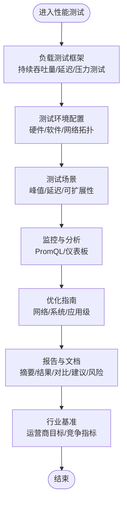

**图表来源**
- [O-RAN 性能测试:1-327](file://13-testing-validation/performance-testing/performance-testing-zh.md#L1-L327)

**章节来源**
- [O-RAN 性能测试:1-327](file://13-testing-validation/performance-testing/performance-testing-zh.md#L1-L327)

### 测试工具与框架
- 商业工具：Spirent Landslide（多厂商O-RAN测试、协议一致性、性能与负载测试、安全评估、自动化场景执行）、Keysight 5G网络测试（5G RAN测试组合、O-RAN特定用例、RF与协议一致性、性能基准、互操作性验证）、Anritsu（RAN专用测试仪器、接口合规、信号质量分析、网络优化与故障排查、现场测试与部署验证）。
- 开源工具：Robot Framework（E2/F1/O-FH接口测试套件、SSH库、配置与执行）、PyTest（O-RAN接口测试框架、标记与参数化、端到端信号链测试）、Wireshark插件（O-RAN协议解析器安装与配置、E2/F1/O-FH参数设置）、Open5GS/srsRAN/OAI/Free5GC（核心网与RAN开源实现用于互操作性测试）。
- 容器化与编排：Docker测试环境（Ubuntu基础镜像、Python测试框架、抓包与网络工具、测试脚本与配置）、Kubernetes测试编排（分布式测试控制器、配置映射、并行执行与环境隔离）。
- CI/CD流水线：GitHub Actions示例（单元测试、接口测试、性能基准、基线对比、结果发布）。
- 监控与可视化：Prometheus指标采集（测试控制器与组件指标、重命名与标签）、Grafana仪表板（测试执行概览、接口性能热力图、环境资源使用）。
- 安全测试：静态代码分析（SonarQube）、动态应用安全测试（OWASP ZAP）、容器安全扫描（Trivy/Clair）、网络渗透测试（Nmap/Nikto）、安全报告生成。

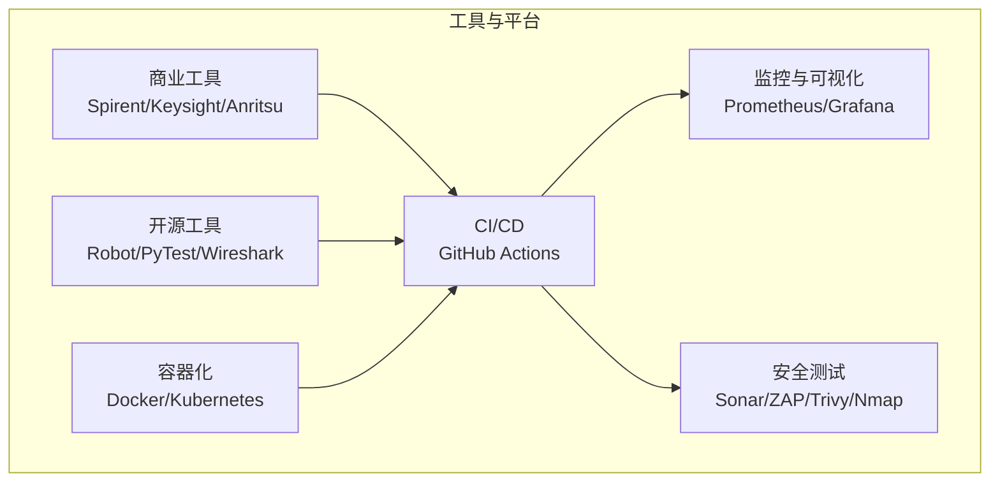

**图表来源**
- [O-RAN Testing Tools and Frameworks:1-598](file://13-testing-validation/testing-tools/testing-tools-frameworks.md#L1-L598)

**章节来源**
- [O-RAN Testing Tools and Frameworks:1-598](file://13-testing-validation/testing-tools/testing-tools-frameworks.md#L1-L598)

## CI/CD 验证基础设施

### GitHub Actions 工作流
O-RAN知识库提供了完整的CI/CD验证基础设施，通过GitHub Actions实现自动化验证和质量保证。

**主要功能：**
- **代码触发**：支持push到main/master分支、pull_request事件和工作流手动触发
- **Python环境**：使用Python 3.11进行验证脚本执行
- **验证流程**：执行validate.py脚本进行全面的知识库验证
- **Frontmatter覆盖率检查**：确保所有Markdown文件都包含必要的元数据
- **断链检测**：自动检测无效的相对链接
- **报告生成**：生成JSON格式的验证报告并上传为artifact

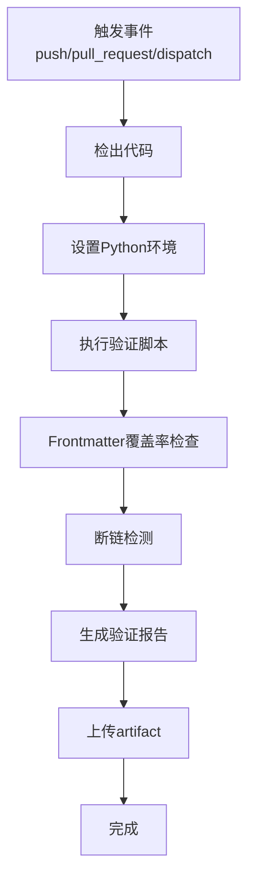

**图表来源**
- [GitHub Actions 工作流:1-93](file://.github/workflows/validate.yml#L1-L93)

### 验证脚本功能
validate.py脚本提供了全面的知识库验证功能：

**验证项目：**
- **链接验证**：检查相对链接的有效性，统计总链接数
- **双语配对**：确保readme.md和readme-zh.md成对存在
- **编号一致性**：验证目录编号的唯一性和连续性
- **空目录检测**：发现没有内容的空目录
- **Frontmatter验证**：检查必需字段（title、category、updated）的存在

**输出格式：**
- 控制台输出：彩色图标显示检查结果
- JSON格式：结构化报告数据，便于集成到其他工具
- 退出码：0表示通过，1表示警告，2表示错误

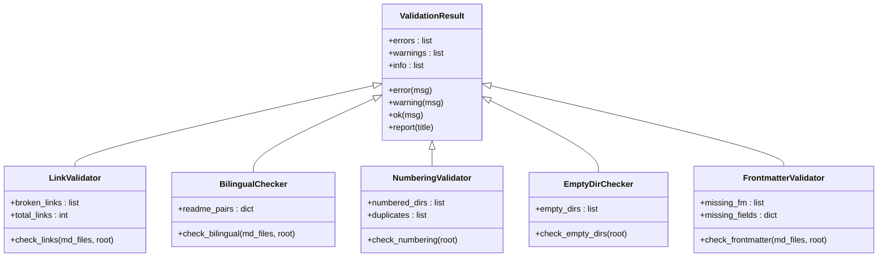

**图表来源**
- [验证脚本:33-257](file://scripts/validate.py#L33-L257)

### Frontmatter 管理工具
add-frontmatter.py脚本用于批量为Markdown文件添加frontmatter元数据：

**智能分类：**
- 根据文件路径自动推断分类（architecture、core_components、interface_standards等）
- 支持根目录文件和编号目录的不同处理逻辑
- 语言检测：自动识别中文和英文文件

**元数据生成：**
- 标题提取：从第一个H1标题获取
- 描述生成：从第一段内容提取
- 关键词识别：基于内容关键词（O-RAN、AI-RAN、RIC、5G等）
- 日期管理：自动生成last_updated字段

**处理流程：**
- 扫描所有Markdown文件
- 跳过已有frontmatter的文件
- 批量处理并显示进度
- 错误处理和异常捕获

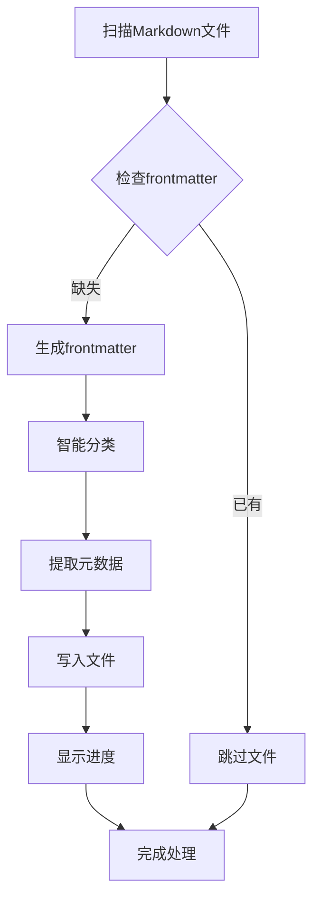

**图表来源**
- [Frontmatter 添加工具:13-187](file://scripts/add-frontmatter.py#L13-L187)

**章节来源**
- [GitHub Actions 工作流:1-93](file://.github/workflows/validate.yml#L1-L93)
- [验证脚本:1-333](file://scripts/validate.py#L1-L333)
- [Frontmatter 添加工具:1-187](file://scripts/add-frontmatter.py#L1-L187)

## 依赖分析
- 框架耦合：自动化框架为一致性测试、互操作性测试与性能测试提供统一执行与管理能力；测试工具框架为各测试类型提供工具与平台支撑。
- 标准依赖：一致性测试与互操作性测试均需遵循O-RAN联盟与3GPP标准；性能测试需对照标准KPI与行业基准。
- 接口依赖：互操作性测试与性能测试均依赖E2/F1/O-FH等接口的协议与实现细节；接口文档为测试场景设计与验证提供依据。
- 外部依赖：CI/CD平台、容器编排平台、监控与可视化平台、安全扫描工具等。
- **新增** CI/CD依赖：GitHub Actions平台、Python环境、验证脚本依赖、artifact存储等。

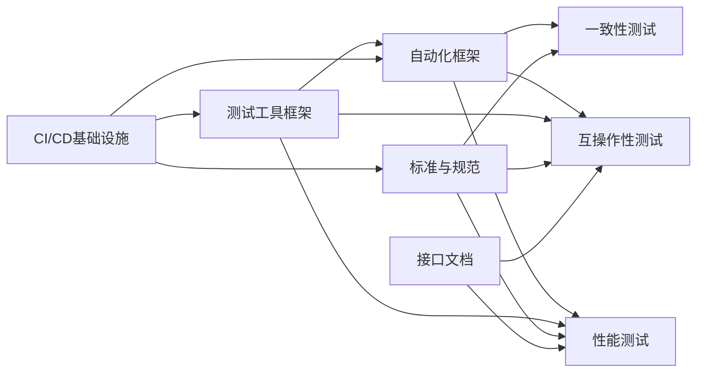

**图表来源**
- [O-RAN Test Automation Framework:1-134](file://13-testing-validation/automation-framework/test-automation-framework.md#L1-L134)
- [GitHub Actions 工作流:1-93](file://.github/workflows/validate.yml#L1-L93)

**章节来源**
- [O-RAN Test Automation Framework:1-134](file://13-testing-validation/automation-framework/test-automation-framework.md#L1-L134)
- [GitHub Actions 工作流:1-93](file://.github/workflows/validate.yml#L1-L93)
- [验证脚本:1-333](file://scripts/validate.py#L1-L333)

## 性能考虑
- 负载与压力：通过持续吞吐量测试、延迟特征化与压力测试，评估系统在峰值与压力条件下的稳定性与资源占用。
- 可扩展性：验证水平/垂直扩展对吞吐量与延迟的影响，关注负载分布与节点间通信开销。
- 监控与告警：基于PromQL的关键指标与Grafana仪表板，实现性能趋势、异常检测与容量规划。
- 优化策略：网络层面（接口调优、QoS、负载均衡）、系统层面（CPU亲和性、内存与存储I/O、内核参数）、应用层面（算法效率、缓存、数据库与API优化、并行处理）。
- 行业基准：以运营商级目标与竞争指标为参照，持续评估与改进。
- **新增** CI/CD性能：GitHub Actions工作流执行时间优化、并行任务调度、缓存策略、artifact大小管理。

**章节来源**
- [O-RAN 性能测试:1-327](file://13-testing-validation/performance-testing/performance-testing-zh.md#L1-L327)
- [GitHub Actions 工作流:1-93](file://.github/workflows/validate.yml#L1-L93)

## 故障排查指南
- 自动化框架：检查测试编排与执行日志、容器与Kubernetes状态、监控告警与指标异常、CI/CD流水线执行状态与报告。
- 一致性测试：核对测试环境配置、工具校准与基线数据、测试用例执行与中间结果、不符合项与根因分析。
- 互操作性测试：验证多厂商测试床网络拓扑与组件版本、接口消息交换与订阅管理、连接稳定性与恢复能力、性能与可靠性指标。
- 性能测试：确认测试环境硬件与软件配置、网络拓扑与带宽/延迟/抖动测量、资源利用率与异常检测、优化建议与回归验证。
- 工具与平台：检查容器镜像与配置、Kubernetes部署与服务暴露、Prometheus抓取与Grafana面板、安全扫描结果与合规报告。
- **新增** CI/CD故障排查：
  - GitHub Actions工作流失败：检查工作流配置文件语法、环境变量设置、权限配置
  - 验证脚本错误：检查Python环境版本、依赖包安装、文件路径权限
  - Frontmatter问题：检查YAML语法、必需字段完整性、编码格式
  - 断链检测：检查相对路径格式、文件存在性、链接格式正确性
  - 报告生成：检查JSON格式、文件大小限制、artifact存储配额

**章节来源**
- [O-RAN Test Automation Framework:1-134](file://13-testing-validation/automation-framework/test-automation-framework.md#L1-L134)
- [GitHub Actions 工作流:1-93](file://.github/workflows/validate.yml#L1-L93)
- [验证脚本:1-333](file://scripts/validate.py#L1-L333)

## 结论
本文件系统化地梳理了O-RAN测试与验证的方法论与实践，涵盖自动化测试框架、一致性测试、互操作性测试、性能测试与测试工具框架，并结合O-RAN联盟与3GPP标准、接口实现细节，给出了可操作的测试流程、场景设计与工具集成策略。通过CI/CD与容器化测试环境，可实现持续集成、持续交付与持续测试；借助监控与分析平台，可实现性能回归与容量规划；通过Plugfest与多厂商兼容性测试，可验证真实世界场景下的互操作性与稳定性。

**更新** 新增的CI/CD验证基础设施为O-RAN知识库提供了强大的质量保证能力，通过GitHub Actions工作流实现了自动化验证、frontmatter覆盖率检查、断链检测和报告生成，确保了文档的完整性和链接的有效性。

## 附录
- Plugfest参与：参与O-RAN Plugfest活动，准备多厂商测试场景与用例，进行互操作性与一致性验证，输出测试结果与改进建议。
- 标准与规范：持续跟踪O-RAN联盟、ETSI与3GPP标准更新，确保测试流程与工具与最新规范一致。
- 工具选择：根据测试类型与场景选择商业或开源工具，结合容器化与编排平台，构建可扩展、可重复的测试环境。
- **新增** CI/CD最佳实践：
  - 工作流优化：合理设置触发条件、使用缓存、并行执行任务
  - 验证策略：分层验证、增量检查、快速失败原则
  - 报告管理：结构化输出、长期存储、趋势分析
  - 故障恢复：重试机制、回滚策略、通知告警

**章节来源**
- [O-RAN 标准与规范:1-371](file://09-standards-compliance/readme-zh.md#L1-L371)
- [GitHub Actions 工作流:1-93](file://.github/workflows/validate.yml#L1-L93)
- [验证脚本:1-333](file://scripts/validate.py#L1-L333)