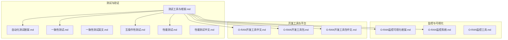
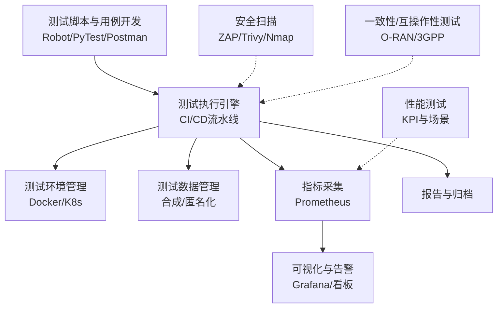
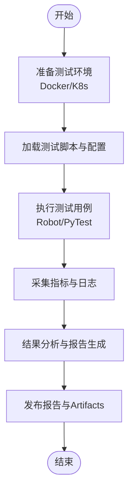
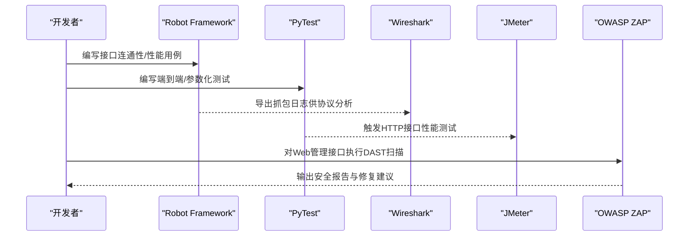
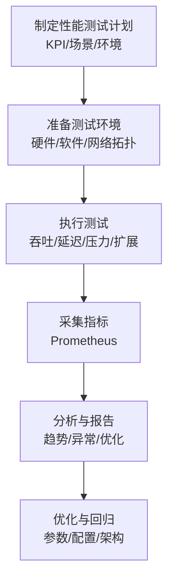
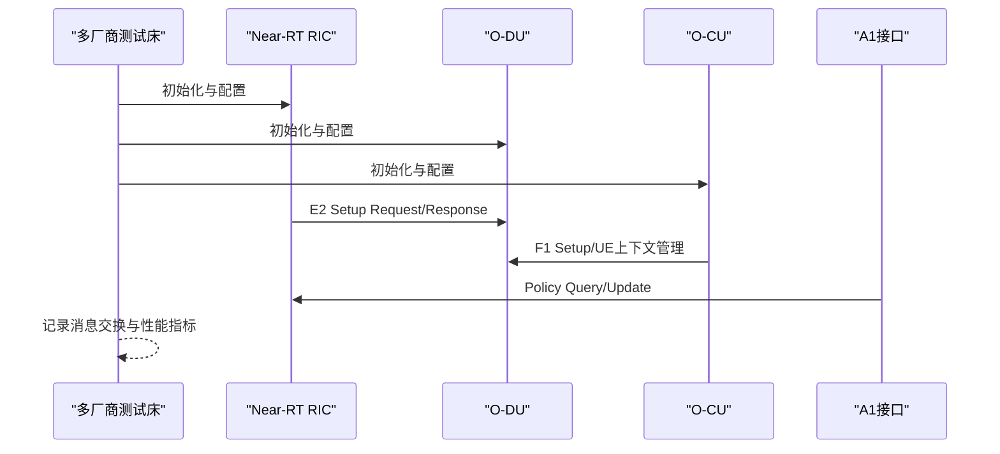
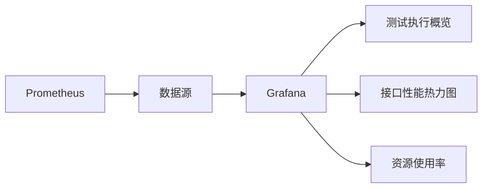
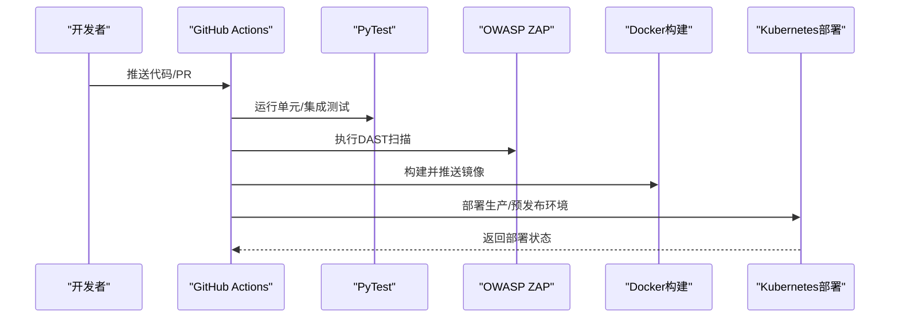
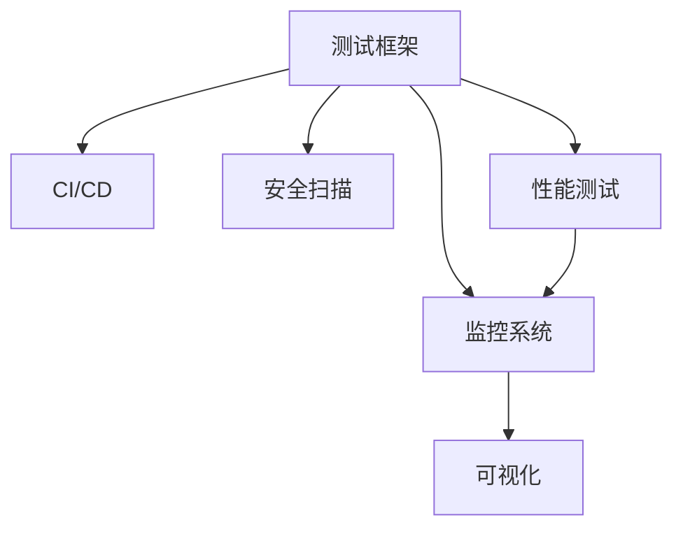

# 测试工具与工具链

<cite>
**本文引用的文件**   
- [测试工具与框架.md](file://13-testing-validation/testing-tools/testing-tools-frameworks.md)
- [自动化测试框架.md](file://13-testing-validation/automation-framework/test-automation-framework.md)
- [性能测试.md](file://13-testing-validation/performance-testing/performance-testing.md)
- [性能测试（中文）.md](file://13-testing-validation/performance-testing/performance-testing-zh.md)
- [一致性测试.md](file://13-testing-validation/conformance-testing/o-ran-conformance-testing.md)
- [一致性测试（英文）.md](file://13-testing-validation/conformance-testing/o-ran-conformance-testing-en.md)
- [互操作性测试.md](file://13-testing-validation/interoperability/interoperability-testing.md)
- [O-RAN监控可视化框架.md](file://28-monitoring-alerting/visualization/o-ran-monitoring-visualization.md)
- [O-RAN监控系统.md](file://22-tool-platforms/monitoring-systems/o-ran-monitoring-systems.md)
- [O-RAN监控工具.md](file://26-performance-optimization/monitoring-tools/o-ran-monitoring-tools.md)
- [O-RAN开发工具（中文）.md](file://17-open-source-ecosystem/developer-tools/oran-development-tools-zh.md)
- [O-RAN开发工具包.md](file://22-tool-platforms/development-tools/o-ran-development-toolkit.md)
- [O-RAN开发工具包（中文）.md](file://22-tool-platforms/development-tools/o-ran-development-toolkit-zh.md)
</cite>

## 目录
1. [简介](#简介)
2. [项目结构](#项目结构)
3. [核心组件](#核心组件)
4. [架构总览](#架构总览)
5. [详细组件分析](#详细组件分析)
6. [依赖关系分析](#依赖关系分析)
7. [性能考量](#性能考量)
8. [故障排查指南](#故障排查指南)
9. [结论](#结论)
10. [附录](#附录)

## 简介
本指南面向O-RAN系统的测试与工具链建设，围绕“工具选择—集成—定制—维护”的全生命周期，系统梳理开源与商业测试工具在自动化、性能、安全、协议分析与监控可视化方面的应用方法与最佳实践，并给出工具链集成策略与实施路线，帮助团队构建可扩展、可复用、可演进的测试体系。

## 项目结构
本仓库中与测试工具与工具链直接相关的内容主要分布在以下主题目录：
- 测试与验证：自动化框架、一致性测试、互操作性测试、性能测试、测试工具与框架
- 监控与可视化：监控可视化框架、监控系统、监控工具
- 开发工具与平台：开发工具包、开发工具（含CI/CD）

下图展示与测试工具链相关的核心文件与模块映射：

**图表来源**
- [测试工具与框架.md](file://13-testing-validation/testing-tools/testing-tools-frameworks.md#L1-L598)
- [自动化测试框架.md](file://13-testing-validation/automation-framework/test-automation-framework.md#L1-L134)
- [一致性测试.md](file://13-testing-validation/conformance-testing/o-ran-conformance-testing.md#L1-L67)
- [一致性测试（英文）.md](file://13-testing-validation/conformance-testing/o-ran-conformance-testing-en.md#L1-L617)
- [互操作性测试.md](file://13-testing-validation/interoperability/interoperability-testing.md#L1-L231)
- [性能测试.md](file://13-testing-validation/performance-testing/performance-testing.md#L1-L327)
- [性能测试（中文）.md](file://13-testing-validation/performance-testing/performance-testing-zh.md#L1-L327)
- [O-RAN监控可视化框架.md](file://28-monitoring-alerting/visualization/o-ran-monitoring-visualization.md#L1-L240)
- [O-RAN监控系统.md](file://22-tool-platforms/monitoring-systems/o-ran-monitoring-systems.md#L80-L131)
- [O-RAN监控工具.md](file://26-performance-optimization/monitoring-tools/o-ran-monitoring-tools.md#L216-L284)
- [O-RAN开发工具（中文）.md](file://17-open-source-ecosystem/developer-tools/oran-development-tools-zh.md#L800-L907)
- [O-RAN开发工具包.md](file://22-tool-platforms/development-tools/o-ran-development-toolkit.md#L331-L366)
- [O-RAN开发工具包（中文）.md](file://22-tool-platforms/development-tools/o-ran-development-toolkit-zh.md#L331-L366)

**章节来源**
- [测试工具与框架.md](file://13-testing-validation/testing-tools/testing-tools-frameworks.md#L1-L598)
- [自动化测试框架.md](file://13-testing-validation/automation-framework/test-automation-framework.md#L1-L134)

## 核心组件
- 自动化测试框架：提供测试编排、执行、数据管理、结果分析与报告的统一能力，支撑CI/CD流水线。
- 商业测试平台：Spirent、Keysight、Anritsu、Rohde & Schwarz等，覆盖协议一致性、性能与RF测试。
- 开源测试工具：Robot Framework、PyTest、Wireshark（含O-RAN插件）、JMeter（可扩展用于HTTP/REST场景）、OWASP ZAP（DAST）。
- 监控与可视化：Prometheus指标采集、Grafana看板、自定义可视化组件与仪表板模板。
- 性能测试：端到端吞吐、延迟、抖动、连接密度、可扩展性等KPI与测试场景。
- 一致性与互操作性：基于O-RAN联盟与3GPP规范的测试套件与多厂商互通验证。

**章节来源**
- [测试工具与框架.md](file://13-testing-validation/testing-tools/testing-tools-frameworks.md#L6-L98)
- [自动化测试框架.md](file://13-testing-validation/automation-framework/test-automation-framework.md#L6-L21)
- [性能测试.md](file://13-testing-validation/performance-testing/performance-testing.md#L6-L27)
- [O-RAN监控系统.md](file://22-tool-platforms/monitoring-systems/o-ran-monitoring-systems.md#L80-L131)

## 架构总览
下图展示测试工具链的整体架构：从测试设计与脚本开发，到测试执行与结果分析，再到监控与可视化，以及CI/CD集成与工具定制。

**图表来源**
- [测试工具与框架.md](file://13-testing-validation/testing-tools/testing-tools-frameworks.md#L363-L418)
- [O-RAN监控系统.md](file://22-tool-platforms/monitoring-systems/o-ran-monitoring-systems.md#L80-L131)
- [O-RAN开发工具（中文）.md](file://17-open-source-ecosystem/developer-tools/oran-development-tools-zh.md#L800-L907)

## 详细组件分析

### 自动化测试框架
- 能力概览：测试编排、分布式执行、测试数据管理、结果分析与报告、监控与告警。
- 最佳实践：模块化设计、可维护命名、可扩展性、可靠性（重试与容错）、可追溯性（需求映射）。
- CI/CD集成：在流水线中执行冒烟测试、定时综合测试、性能回归测试、安全扫描、自动报告发布。
- 数据治理：合成数据生成、敏感信息脱敏、分类型数据集管理、定期清理与版本控制。

**图表来源**
- [自动化测试框架.md](file://13-testing-validation/automation-framework/test-automation-framework.md#L22-L91)
- [测试工具与框架.md](file://13-testing-validation/testing-tools/testing-tools-frameworks.md#L363-L418)

**章节来源**
- [自动化测试框架.md](file://13-testing-validation/automation-framework/test-automation-framework.md#L22-L134)
- [测试工具与框架.md](file://13-testing-validation/testing-tools/testing-tools-frameworks.md#L361-L479)

### 商业测试平台选型与实施
- Spirent：多厂商O-RAN测试、协议一致性、性能与负载测试、安全漏洞评估、自动化场景执行；适用于端到端一致性与互操作性验证。
- Keysight：5G RAN测试组合、O-RAN特定用例、RF与协议一致性、网络性能基准、互操作性工具；适合高频复杂场景与高精度测量。
- Anritsu：专用RAN测试仪器、O-RAN接口合规、信号质量与性能分析、网络优化与故障排查、现场验证；适合现场与实验室结合。
- Rohde & Schwarz：实时信号分析、宽带示波器与分析仪、模块化平台、矢量信号分析；适合射频与信号链深度分析。

实施策略建议：
- 明确测试目标与预算，先用开源工具完成基础自动化与回归，再引入商业平台进行一致性与极限性能验证。
- 与供应商联合开展Plugfest与认证测试，确保跨厂商互通。
- 建立标准化测试流程与报告格式，便于商业平台结果复用与对比。

**章节来源**
- [测试工具与框架.md](file://13-testing-validation/testing-tools/testing-tools-frameworks.md#L10-L98)

### 开源测试工具与最佳实践
- Robot Framework：用于O-RAN接口连通性、性能与配置验证，支持标签化分类（如e2/f1/ofh、功能/性能/回归）。
- PyTest：面向接口与端到端测试，参数化与并发执行，结合K8s与容器化环境。
- Wireshark：安装O-RAN插件与配置，解析E2/F1/O-FH协议，辅助协议一致性与问题定位。
- JMeter：可扩展用于HTTP/REST接口性能测试（如A1/E2管理接口），结合Grafana可视化。
- OWASP ZAP：DAST扫描Web类控制器与管理接口，结合Trivy、Nmap等工具形成安全扫描闭环。

**图表来源**
- [测试工具与框架.md](file://13-testing-validation/testing-tools/testing-tools-frameworks.md#L103-L164)
- [测试工具与框架.md](file://13-testing-validation/testing-tools/testing-tools-frameworks.md#L563-L596)

**章节来源**
- [测试工具与框架.md](file://13-testing-validation/testing-tools/testing-tools-frameworks.md#L99-L164)
- [测试工具与框架.md](file://13-testing-validation/testing-tools/testing-tools-frameworks.md#L561-L598)

### 性能测试体系
- 测试类别：网络性能（吞吐、延迟、丢包、抖动、连接密度）、资源性能（CPU、内存、存储、网络、功耗）、可扩展性（水平/垂直扩展、负载分布、容量规划）。
- KPI与基线：针对RAN、核心网、云基础设施设定明确目标与测量方法。
- 方法论：负载测试、压力测试、峰值性能验证、延迟特征化、可扩展性验证。
- 工具与监控：Prometheus采集、Grafana看板、实时趋势与异常检测、容量规划与优化建议。

**图表来源**
- [性能测试.md](file://13-testing-validation/performance-testing/performance-testing.md#L58-L167)
- [性能测试（中文）.md](file://13-testing-validation/performance-testing/performance-testing-zh.md#L58-L167)

**章节来源**
- [性能测试.md](file://13-testing-validation/performance-testing/performance-testing.md#L6-L57)
- [性能测试.md](file://13-testing-validation/performance-testing/performance-testing.md#L169-L327)
- [性能测试（中文）.md](file://13-testing-validation/performance-testing/performance-testing-zh.md#L6-L57)
- [性能测试（中文）.md](file://13-testing-validation/performance-testing/performance-testing-zh.md#L169-L327)

### 一致性与互操作性测试
- 一致性测试：O-RAN联盟测试套件（架构、接口、功能、性能、安全）与3GPP规范验证（NG-RAN、5G NR、RAN功能、互操作性）。
- 互操作性测试：E2/F1/O-FH接口跨厂商互通、消息交换成功率、协议合规、性能一致性、可靠性指标。
- 测试方法：黑盒/灰盒/白盒结合，矩阵化测试组合，多厂商测试床配置，认证与合规。

**图表来源**
- [一致性测试（英文）.md](file://13-testing-validation/conformance-testing/o-ran-conformance-testing-en.md#L10-L150)
- [互操作性测试.md](file://13-testing-validation/interoperability/interoperability-testing.md#L30-L95)

**章节来源**
- [一致性测试.md](file://13-testing-validation/conformance-testing/o-ran-conformance-testing.md#L6-L67)
- [一致性测试（英文）.md](file://13-testing-validation/conformance-testing/o-ran-conformance-testing-en.md#L1-L617)
- [互操作性测试.md](file://13-testing-validation/interoperability/interoperability-testing.md#L1-L231)

### 监控与可视化
- Prometheus指标采集：测试执行指标、组件性能指标、告警规则配置。
- Grafana可视化：测试执行概览、接口性能热力图、环境资源使用率等面板。
- 可视化框架：布局与组织、颜色编码、响应式设计、实时更新、交互探索、预测分析与多维表示。

**图表来源**
- [测试工具与框架.md](file://13-testing-validation/testing-tools/testing-tools-frameworks.md#L483-L559)
- [O-RAN监控可视化框架.md](file://28-monitoring-alerting/visualization/o-ran-monitoring-visualization.md#L54-L131)
- [O-RAN监控系统.md](file://22-tool-platforms/monitoring-systems/o-ran-monitoring-systems.md#L80-L131)

**章节来源**
- [测试工具与框架.md](file://13-testing-validation/testing-tools/testing-tools-frameworks.md#L481-L559)
- [O-RAN监控可视化框架.md](file://28-monitoring-alerting/visualization/o-ran-monitoring-visualization.md#L1-L240)
- [O-RAN监控系统.md](file://22-tool-platforms/monitoring-systems/o-ran-monitoring-systems.md#L80-L131)

### 工具链集成与CI/CD
- GitHub Actions流水线：代码质量检查（Black/Flake8/Mypy）、单元/集成测试、覆盖率上报、Docker镜像构建与推送、Kubernetes部署。
- 测试工具链集成：将Robot/PyTest、Wireshark、JMeter、ZAP等工具纳入流水线，按阶段串联执行与报告。
- API测试：Postman/Newman、编程语言客户端（Python/Go/JS/Java）与契约测试（Pact）。

**图表来源**
- [O-RAN开发工具（中文）.md](file://17-open-source-ecosystem/developer-tools/oran-development-tools-zh.md#L800-L907)
- [测试工具与框架.md](file://13-testing-validation/testing-tools/testing-tools-frameworks.md#L363-L418)
- [O-RAN开发工具包.md](file://22-tool-platforms/development-tools/o-ran-development-toolkit.md#L331-L366)

**章节来源**
- [O-RAN开发工具（中文）.md](file://17-open-source-ecosystem/developer-tools/oran-development-tools-zh.md#L800-L907)
- [测试工具与框架.md](file://13-testing-validation/testing-tools/testing-tools-frameworks.md#L361-L418)
- [O-RAN开发工具包.md](file://22-tool-platforms/development-tools/o-ran-development-toolkit.md#L331-L366)

## 依赖关系分析
- 组件耦合：测试框架与CI/CD强耦合，监控系统与可视化弱耦合但高度依赖指标采集。
- 外部依赖：商业平台（Spirent/Keysight/Anritsu/R&S）、开源工具（Robot/PyTest/Wireshark/ZAP/JMeter）、监控栈（Prometheus/Grafana）。
- 集成点：统一测试数据管理、统一指标采集与告警、统一报告与归档。

**图表来源**
- [自动化测试框架.md](file://13-testing-validation/automation-framework/test-automation-framework.md#L15-L21)
- [测试工具与框架.md](file://13-testing-validation/testing-tools/testing-tools-frameworks.md#L481-L559)

**章节来源**
- [自动化测试框架.md](file://13-testing-validation/automation-framework/test-automation-framework.md#L15-L21)
- [测试工具与框架.md](file://13-testing-validation/testing-tools/testing-tools-frameworks.md#L481-L559)

## 性能考量
- 网络优化：接口调优、缓冲区管理、QoS、负载均衡、协议优化。
- 系统优化：CPU亲和性、内存管理、存储I/O、内核参数、容器资源限制。
- 应用优化：算法效率、缓存策略、数据库优化、API性能、并行处理。
- 持续监控：自动化回归测试、性能告警、趋势分析、容量规划、合规报告。

**章节来源**
- [性能测试.md](file://13-testing-validation/performance-testing/performance-testing.md#L274-L327)
- [性能测试（中文）.md](file://13-testing-validation/performance-testing/performance-testing-zh.md#L274-L327)

## 故障排查指南
- 协议分析：使用Wireshark插件与配置，解析E2/F1/O-FH消息，定位异常与不一致。
- 安全扫描：ZAP DAST、Trivy镜像扫描、Nmap/Nikto网络扫描，生成合规报告。
- 监控告警：Prometheus告警规则、Grafana看板异常检测、实时告警与根因分析。
- 环境隔离：测试环境与生产隔离、网络分段与访问控制、定期扫描与凭证管理。

**章节来源**
- [测试工具与框架.md](file://13-testing-validation/testing-tools/testing-tools-frameworks.md#L561-L598)
- [O-RAN监控系统.md](file://22-tool-platforms/monitoring-systems/o-ran-monitoring-systems.md#L80-L131)

## 结论
通过将开源与商业测试工具有机整合到统一的测试框架与CI/CD流水线中，结合完善的监控与可视化体系，O-RAN项目可以实现从自动化测试、性能验证、一致性与互操作性测试到安全与合规的全链路保障。建议以开源工具打底，逐步引入商业平台进行极限验证与认证，持续优化工具链与流程，确保测试体系的可持续演进。

## 附录
- 工具选择清单（示例）
  - 自动化：Robot Framework、PyTest、Postman/Newman
  - 协议分析：Wireshark（含O-RAN插件）
  - 性能：JMeter（HTTP/REST）、iperf3、容器化压测
  - 安全：OWASP ZAP、Trivy、Nmap、Nikto
  - 监控：Prometheus、Grafana、自定义看板
  - 商业平台：Spirent、Keysight、Anritsu、Rohde & Schwarz
- 工具定制与维护
  - 统一测试数据模型与匿名化策略
  - 可复用测试库与关键字封装
  - 指标采集与告警规则标准化
  - 文档与知识沉淀（测试用例、问题库、最佳实践）