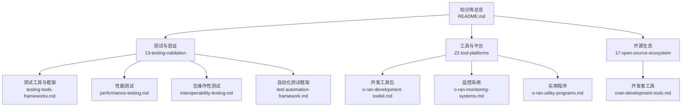
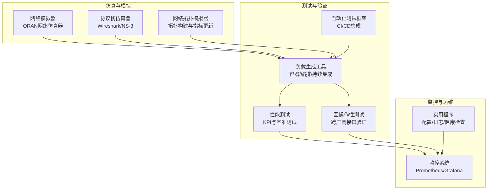
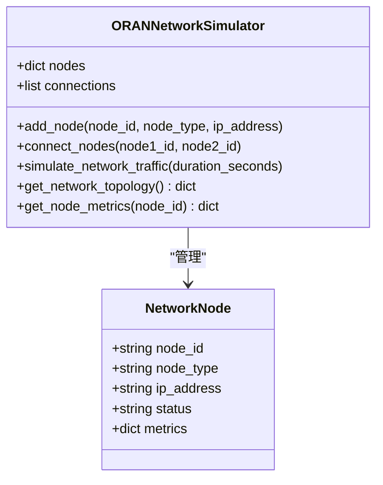
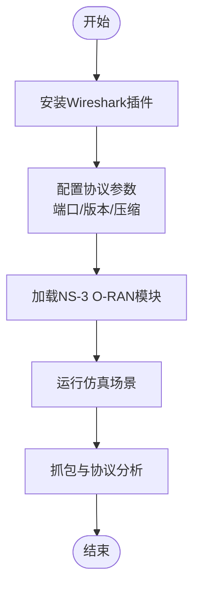
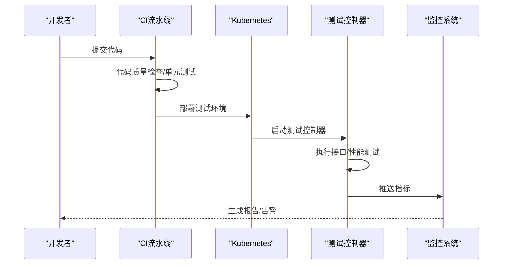
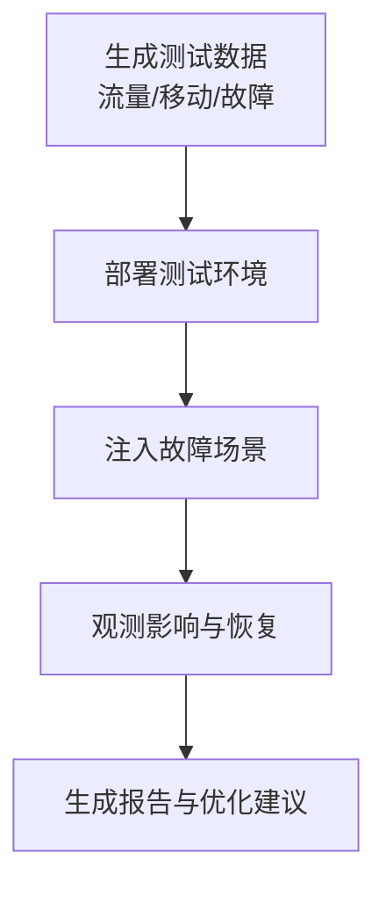
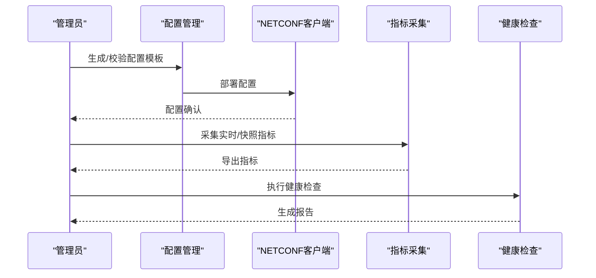
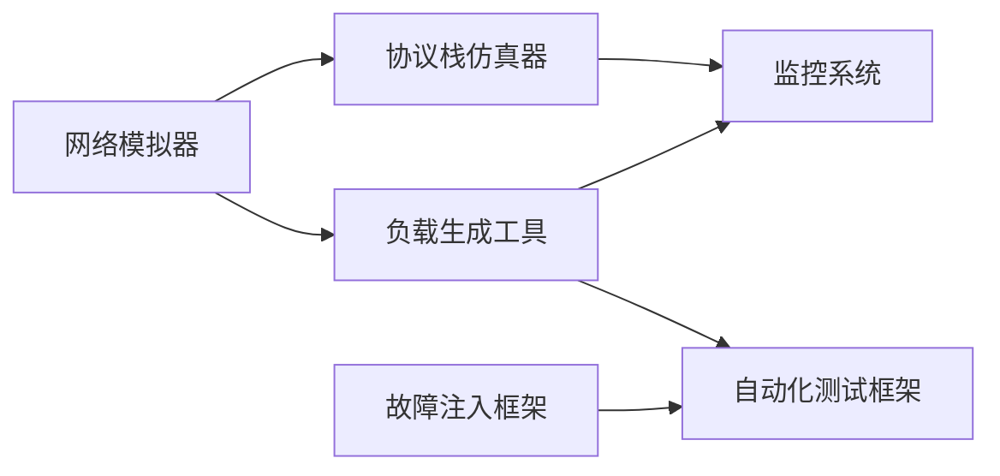
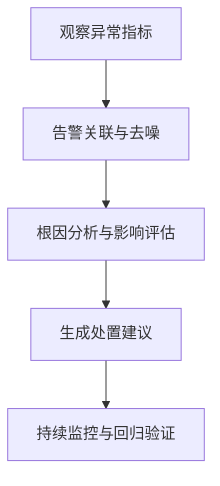

# 仿真与模拟工具

<cite>
**本文引用的文件**
- [README.md](file://README.md)
- [测试工具与框架.md](file://13-testing-validation/testing-tools/testing-tools-frameworks.md)
- [开发工具包.md](file://22-tool-platforms/development-tools/o-ran-development-toolkit.md)
- [开发工具包（中文）.md](file://22-tool-platforms/development-tools/o-ran-development-toolkit-zh.md)
- [性能测试.md](file://13-testing-validation/performance-testing/performance-testing.md)
- [监控系统.md](file://22-tool-platforms/monitoring-systems/o-ran-monitoring-systems.md)
- [实用程序.md](file://22-tool-platforms/utility-programs/o-ran-utility-programs.md)
- [互操作性测试.md](file://13-testing-validation/interoperability/interoperability-testing.md)
- [自动化测试框架.md](file://13-testing-validation/automation-framework/test-automation-framework.md)
- [网络仿真工具（开发者工具）.md](file://17-open-source-ecosystem/developer-tools/oran-development-tools.md)
- [网络仿真工具（开发者工具）（中文）.md](file://17-open-source-ecosystem/developer-tools/oran-development-tools-zh.md)
</cite>

## 目录
1. [简介](#简介)
2. [项目结构](#项目结构)
3. [核心组件](#核心组件)
4. [架构总览](#架构总览)
5. [详细组件分析](#详细组件分析)
6. [依赖关系分析](#依赖关系分析)
7. [性能考虑](#性能考虑)
8. [故障排查指南](#故障排查指南)
9. [结论](#结论)
10. [附录](#附录)

## 简介
本技术文档面向O-RAN仿真与模拟工具，围绕RAN网络模拟器、协议栈仿真器、负载生成工具、故障注入框架与网络拓扑模拟器进行系统化说明。文档结合仓库中的测试工具、开发工具、监控系统与实用程序等资料，梳理工具链的组成、配置参数、性能特征、适用场景与集成方式，并提供仿真环境搭建、参数调优、结果分析与验证流程建议。同时，给出开源工具（如Robot Framework、JMeter、Wireshark）与商业工具（如Spirent、Keysight）的对比与选型指南，以及实际使用案例、配置模板与常见问题解决方案。

## 项目结构
该知识库以主题目录组织，与仿真与测试相关的重点目录包括：
- 13-testing-validation：测试与验证体系，含测试工具、性能测试、互操作性测试、自动化框架等
- 22-tool-platforms：工具与平台，含开发工具、监控系统、实用程序等
- 17-open-source-ecosystem：开源生态，含开发者工具与仿真工具

下图展示与“仿真与模拟工具”直接相关的知识域与文件映射：

**图表来源**
- [README.md](file://README.md#L1-L472)
- [测试工具与框架.md](file://13-testing-validation/testing-tools/testing-tools-frameworks.md#L1-L598)
- [开发工具包.md](file://22-tool-platforms/development-tools/o-ran-development-toolkit.md#L1-L488)
- [开发工具包（中文）.md](file://22-tool-platforms/development-tools/o-ran-development-toolkit-zh.md#L1-L488)
- [性能测试.md](file://13-testing-validation/performance-testing/performance-testing.md#L1-L327)
- [监控系统.md](file://22-tool-platforms/monitoring-systems/o-ran-monitoring-systems.md#L1-L545)
- [实用程序.md](file://22-tool-platforms/utility-programs/o-ran-utility-programs.md#L1-L628)
- [互操作性测试.md](file://13-testing-validation/interoperability/interoperability-testing.md#L1-L231)
- [自动化测试框架.md](file://13-testing-validation/automation-framework/test-automation-framework.md#L1-L134)
- [网络仿真工具（开发者工具）.md](file://17-open-source-ecosystem/developer-tools/oran-development-tools.md#L646-L797)
- [网络仿真工具（开发者工具）（中文）.md](file://17-open-source-ecosystem/developer-tools/oran-development-tools-zh.md#L647-L798)

**章节来源**
- [README.md](file://README.md#L1-L472)

## 核心组件
- RAN网络模拟器：提供网络节点与连接的抽象，支持异步流量仿真与指标采集，便于快速搭建原型网络拓扑与度量。
- 协议栈仿真器：基于Wireshark插件与NS-3扩展，对E2/F1/O-FH等接口进行协议解析与仿真，支撑接口一致性与性能验证。
- 负载生成工具：提供容器化测试环境与Kubernetes编排，支持持续集成与分布式负载生成。
- 故障注入框架：通过测试数据生成与脚本化测试，模拟链路中断、组件崩溃等故障场景，验证恢复与容错能力。
- 网络拓扑模拟器：提供拓扑构建、连接建立与指标更新的完整流程，支持按节点类型差异化指标模拟。

上述组件在以下文件中有具体实现或配置参考：
- 网络模拟器：[网络仿真工具（开发者工具）.md](file://17-open-source-ecosystem/developer-tools/oran-development-tools.md#L646-L797)、[网络仿真工具（开发者工具）（中文）.md](file://17-open-source-ecosystem/developer-tools/oran-development-tools-zh.md#L647-L798)
- 协议栈仿真器：[测试工具与框架.md](file://13-testing-validation/testing-tools/testing-tools-frameworks.md#L63-L98)、[开发工具包.md](file://22-tool-platforms/development-tools/o-ran-development-toolkit.md#L115-L172)
- 负载生成工具：[测试工具与框架.md](file://13-testing-validation/testing-tools/testing-tools-frameworks.md#L258-L357)、[自动化测试框架.md](file://13-testing-validation/automation-framework/test-automation-framework.md#L24-L68)
- 故障注入框架：[互操作性测试.md](file://13-testing-validation/interoperability/interoperability-testing.md#L119-L149)、[性能测试.md](file://13-testing-validation/performance-testing/performance-testing.md#L140-L167)
- 网络拓扑模拟器：[实用程序.md](file://22-tool-platforms/utility-programs/o-ran-utility-programs.md#L10-L89)

**章节来源**
- [测试工具与框架.md](file://13-testing-validation/testing-tools/testing-tools-frameworks.md#L1-L598)
- [开发工具包.md](file://22-tool-platforms/development-tools/o-ran-development-toolkit.md#L1-L488)
- [开发工具包（中文）.md](file://22-tool-platforms/development-tools/o-ran-development-toolkit-zh.md#L1-L488)
- [性能测试.md](file://13-testing-validation/performance-testing/performance-testing.md#L1-L327)
- [监控系统.md](file://22-tool-platforms/monitoring-systems/o-ran-monitoring-systems.md#L1-L545)
- [实用程序.md](file://22-tool-platforms/utility-programs/o-ran-utility-programs.md#L1-L628)
- [互操作性测试.md](file://13-testing-validation/interoperability/interoperability-testing.md#L1-L231)
- [自动化测试框架.md](file://13-testing-validation/automation-framework/test-automation-framework.md#L1-L134)
- [网络仿真工具（开发者工具）.md](file://17-open-source-ecosystem/developer-tools/oran-development-tools.md#L646-L797)
- [网络仿真工具（开发者工具）（中文）.md](file://17-open-source-ecosystem/developer-tools/oran-development-tools-zh.md#L647-L798)

## 架构总览
下图展示仿真与模拟工具在O-RAN测试与验证体系中的位置与交互关系：

**图表来源**
- [测试工具与框架.md](file://13-testing-validation/testing-tools/testing-tools-frameworks.md#L1-L598)
- [开发工具包.md](file://22-tool-platforms/development-tools/o-ran-development-toolkit.md#L1-L488)
- [性能测试.md](file://13-testing-validation/performance-testing/performance-testing.md#L1-L327)
- [监控系统.md](file://22-tool-platforms/monitoring-systems/o-ran-monitoring-systems.md#L1-L545)
- [实用程序.md](file://22-tool-platforms/utility-programs/o-ran-utility-programs.md#L1-L628)
- [互操作性测试.md](file://13-testing-validation/interoperability/interoperability-testing.md#L1-L231)
- [自动化测试框架.md](file://13-testing-validation/automation-framework/test-automation-framework.md#L1-L134)

## 详细组件分析

### 组件A：RAN网络模拟器
- 设计要点
  - 节点抽象：支持O-RU/O-DU/O-CU/RIC等节点类型，具备IP地址、状态与指标字段。
  - 连接建模：通过节点对列表表达拓扑连接。
  - 异步仿真：基于事件循环模拟节点间流量，统计延迟、丢包与吞吐等指标。
  - 指标更新：按节点类型差异化生成RF功率、天线增益、处理负载、连接UE数、策略决策数等指标。
- 关键流程
  - 添加节点与建立连接
  - 按时间步长模拟节点间通信
  - 更新节点总体指标
  - 导出拓扑与节点指标
- 适用场景
  - 快速搭建原型网络拓扑
  - 接口连通性与基本性能的初步验证
  - 作为负载生成与故障注入的前置条件
- 配置与参数
  - 节点类型与IP地址
  - 连接关系（节点对）
  - 仿真时长（秒）
  - 指标采样间隔（秒）

**图表来源**
- [网络仿真工具（开发者工具）.md](file://17-open-source-ecosystem/developer-tools/oran-development-tools.md#L646-L797)
- [网络仿真工具（开发者工具）（中文）.md](file://17-open-source-ecosystem/developer-tools/oran-development-tools-zh.md#L647-L798)

**章节来源**
- [网络仿真工具（开发者工具）.md](file://17-open-source-ecosystem/developer-tools/oran-development-tools.md#L646-L797)
- [网络仿真工具（开发者工具）（中文）.md](file://17-open-source-ecosystem/developer-tools/oran-development-tools-zh.md#L647-L798)

### 组件B：协议栈仿真器（Wireshark/NS-3）
- 设计要点
  - Wireshark插件：增强E2/F1/O-FH等协议解析，支持自定义捕获与显示过滤器。
  - NS-3扩展：实现5G NR物理层、前传网络与RIC功能仿真，支持不同部署场景。
- 关键流程
  - 安装与配置Wireshark插件
  - 配置协议解析参数（端口、版本、压缩等）
  - 在NS-3中加载O-RAN模块，运行仿真场景
- 适用场景
  - 协议一致性验证
  - 时延、抖动与带宽分配分析
  - RIC策略执行与xApp交互仿真
- 配置与参数
  - Wireshark端口与版本设置
  - NS-3仿真场景（小小区、宏站、室内优化、农村部署）

**图表来源**
- [测试工具与框架.md](file://13-testing-validation/testing-tools/testing-tools-frameworks.md#L63-L98)
- [开发工具包.md](file://22-tool-platforms/development-tools/o-ran-development-toolkit.md#L115-L172)

**章节来源**
- [测试工具与框架.md](file://13-testing-validation/testing-tools/testing-tools-frameworks.md#L1-L598)
- [开发工具包.md](file://22-tool-platforms/development-tools/o-ran-development-toolkit.md#L1-L488)

### 组件C：负载生成工具（容器/编排/持续集成）
- 设计要点
  - Docker镜像：封装测试工具（Wireshark、iperf3、tcpdump等），复制测试脚本与配置。
  - Kubernetes部署：通过Deployment与ConfigMap管理测试配置，支持并行执行。
  - CI/CD：GitHub Actions流水线，包含代码质量检查、单元测试、集成测试与镜像安全扫描。
- 关键流程
  - 构建测试镜像
  - 部署测试控制器与配置
  - 执行接口测试与性能基准
  - 上报测试结果与生成报告
- 适用场景
  - 生产环境相似的测试床搭建
  - 分布式负载生成与多接口并发测试
  - 持续集成中的回归测试与性能回归检测

**图表来源**
- [测试工具与框架.md](file://13-testing-validation/testing-tools/testing-tools-frameworks.md#L258-L418)
- [自动化测试框架.md](file://13-testing-validation/automation-framework/test-automation-framework.md#L24-L68)

**章节来源**
- [测试工具与框架.md](file://13-testing-validation/testing-tools/testing-tools-frameworks.md#L1-L598)
- [自动化测试框架.md](file://13-testing-validation/automation-framework/test-automation-framework.md#L1-L134)

### 组件D：故障注入框架（测试数据与脚本）
- 设计要点
  - 测试数据生成：生成网络流量、UE移动模式与故障场景，支持JSON输出与版本化管理。
  - 场景设计：包含链路中断、组件崩溃等典型故障，定义触发条件与预期影响。
  - 脚本化测试：通过命令行工具与脚本执行，验证自动恢复与降级策略。
- 关键流程
  - 生成测试数据（流量、移动、故障）
  - 部署测试环境与注入故障
  - 观测影响范围与恢复时间
  - 形成测试报告与改进建议
- 适用场景
  - 多厂商互操作性测试中的故障验证
  - 性能压力下的稳定性与韧性评估
  - 自动化回归测试中的异常场景覆盖

**图表来源**
- [互操作性测试.md](file://13-testing-validation/interoperability/interoperability-testing.md#L119-L149)
- [性能测试.md](file://13-testing-validation/performance-testing/performance-testing.md#L140-L167)

**章节来源**
- [互操作性测试.md](file://13-testing-validation/interoperability/interoperability-testing.md#L1-L231)
- [性能测试.md](file://13-testing-validation/performance-testing/performance-testing.md#L1-L327)

### 组件E：网络拓扑模拟器（实用程序）
- 设计要点
  - 配置管理：基于YANG模型的配置模板生成、校验与批量部署。
  - 设备管理：NETCONF客户端工具，支持会话管理、配置编辑与订阅通知。
  - 指标采集：O-RAN指标采集器，支持实时与快照模式导出。
  - 健康检查：自动化健康检查脚本，覆盖K8s组件与O-RAN接口。
- 关键流程
  - 生成/校验配置模板
  - 部署配置到设备
  - 采集与导出指标
  - 执行健康检查与告警
- 适用场景
  - 日常运维与例行巡检
  - 配置合规性与漂移检测
  - 运维自动化与备份恢复

**图表来源**
- [实用程序.md](file://22-tool-platforms/utility-programs/o-ran-utility-programs.md#L10-L89)
- [实用程序.md](file://22-tool-platforms/utility-programs/o-ran-utility-programs.md#L177-L233)
- [实用程序.md](file://22-tool-platforms/utility-programs/o-ran-utility-programs.md#L436-L561)

**章节来源**
- [实用程序.md](file://22-tool-platforms/utility-programs/o-ran-utility-programs.md#L1-L628)

## 依赖关系分析
- 组件耦合
  - 网络模拟器与协议栈仿真器：前者提供拓扑与流量，后者提供协议解析与验证。
  - 负载生成工具与监控系统：前者产生负载，后者采集与可视化指标。
  - 故障注入框架与自动化测试框架：前者提供测试场景，后者提供执行与报告。
- 外部依赖
  - Wireshark插件与NS-3扩展
  - Docker与Kubernetes
  - Prometheus/Grafana
  - CI/CD平台（如GitHub Actions）

**图表来源**
- [测试工具与框架.md](file://13-testing-validation/testing-tools/testing-tools-frameworks.md#L1-L598)
- [开发工具包.md](file://22-tool-platforms/development-tools/o-ran-development-toolkit.md#L1-L488)
- [性能测试.md](file://13-testing-validation/performance-testing/performance-testing.md#L1-L327)
- [监控系统.md](file://22-tool-platforms/monitoring-systems/o-ran-monitoring-systems.md#L1-L545)
- [互操作性测试.md](file://13-testing-validation/interoperability/interoperability-testing.md#L1-L231)
- [自动化测试框架.md](file://13-testing-validation/automation-framework/test-automation-framework.md#L1-L134)

**章节来源**
- [测试工具与框架.md](file://13-testing-validation/testing-tools/testing-tools-frameworks.md#L1-L598)
- [开发工具包.md](file://22-tool-platforms/development-tools/o-ran-development-toolkit.md#L1-L488)
- [性能测试.md](file://13-testing-validation/performance-testing/performance-testing.md#L1-L327)
- [监控系统.md](file://22-tool-platforms/monitoring-systems/o-ran-monitoring-systems.md#L1-L545)
- [互操作性测试.md](file://13-testing-validation/interoperability/interoperability-testing.md#L1-L231)
- [自动化测试框架.md](file://13-testing-validation/automation-framework/test-automation-framework.md#L1-L134)

## 性能考虑
- 网络性能
  - 通过iperf3、tcpdump等工具进行吞吐、时延、抖动与丢包测量；结合Prometheus指标进行趋势分析。
  - KPI目标参考：峰值吞吐、用户面/控制面时延、连接建立时间、切换成功率等。
- 资源利用
  - CPU、内存、存储I/O与网络带宽的监控与基线对比，避免过载与瓶颈。
- 可扩展性
  - 水平/垂直扩展测试，评估节点数量与资源配置对性能的影响。
- 优化建议
  - 接口参数调优、缓冲区管理、QoS策略、内核参数与容器资源限制优化。

**章节来源**
- [性能测试.md](file://13-testing-validation/performance-testing/performance-testing.md#L1-L327)
- [监控系统.md](file://22-tool-platforms/monitoring-systems/o-ran-monitoring-systems.md#L246-L265)

## 故障排查指南
- 监控与告警
  - Prometheus告警规则与Alertmanager路由策略，实现噪声抑制、关联分析与分级告警。
  - Grafana仪表盘用于可视化关键指标与异常检测。
- 根因分析
  - 基于症状检测、依赖图谱与影响评估的自动化根因分析流程。
  - 结合日志分析与流处理，定位异常模式与潜在故障。
- 预测性维护
  - 基于统计与机器学习的异常检测与剩余寿命预测，指导预防性维护。

**图表来源**
- [监控系统.md](file://22-tool-platforms/monitoring-systems/o-ran-monitoring-systems.md#L355-L413)
- [监控系统.md](file://22-tool-platforms/monitoring-systems/o-ran-monitoring-systems.md#L415-L543)

**章节来源**
- [监控系统.md](file://22-tool-platforms/monitoring-systems/o-ran-monitoring-systems.md#L1-L545)

## 结论
本技术文档系统梳理了O-RAN仿真与模拟工具的组成与使用方法，明确了各组件在测试与验证体系中的职责与交互关系。通过网络模拟器、协议栈仿真器、负载生成工具、故障注入框架与网络拓扑模拟器的协同，可实现从接口一致性到系统性能与韧性的全链路验证。结合监控系统与自动化测试框架，能够将仿真结果转化为可观测、可追溯、可持续改进的闭环流程。

## 附录

### 仿真环境搭建与参数调优
- 环境准备
  - Docker镜像构建与测试工具安装
  - Kubernetes集群部署与ConfigMap配置
  - 监控系统（Prometheus/Grafana）部署与指标采集
- 参数调优
  - 网络接口参数、缓冲区大小、QoS策略
  - 负载生成速率、并发连接数与采样间隔
  - 指标采集周期与告警阈值

**章节来源**
- [测试工具与框架.md](file://13-testing-validation/testing-tools/testing-tools-frameworks.md#L258-L418)
- [监控系统.md](file://22-tool-platforms/monitoring-systems/o-ran-monitoring-systems.md#L10-L78)

### 结果分析与验证流程
- 性能测试报告
  - 执行摘要、详细结果、对比分析、优化建议与风险评估
- 回归与持续监控
  - 自动化回归测试、趋势分析、容量规划与合规报告

**章节来源**
- [性能测试.md](file://13-testing-validation/performance-testing/performance-testing.md#L297-L327)
- [自动化测试框架.md](file://13-testing-validation/automation-framework/test-automation-framework.md#L79-L134)

### 开源与商业工具选型指南
- 开源工具
  - Robot Framework：接口连通性与性能测试
  - Wireshark：协议解析与抓包分析
  - NS-3：网络仿真与协议栈建模
- 商业工具
  - Spirent/Keysight：多厂商一致性、性能与安全测试
- 选型建议
  - 以开源工具满足日常开发与回归测试，以商业工具完成关键场景与认证测试

**章节来源**
- [测试工具与框架.md](file://13-testing-validation/testing-tools/testing-tools-frameworks.md#L6-L98)
- [开发工具包.md](file://22-tool-platforms/development-tools/o-ran-development-toolkit.md#L115-L172)

### 实际使用案例与配置模板
- 案例
  - E2/F1/O-FH接口连通性与性能测试
  - 多厂商互操作性验证
  - 负载与压力测试场景
- 模板
  - Dockerfile与Kubernetes部署清单
  - Prometheus告警规则与Grafana仪表盘
  - 测试数据生成脚本与配置文件

**章节来源**
- [互操作性测试.md](file://13-testing-validation/interoperability/interoperability-testing.md#L1-L231)
- [监控系统.md](file://22-tool-platforms/monitoring-systems/o-ran-monitoring-systems.md#L1-L545)
- [实用程序.md](file://22-tool-platforms/utility-programs/o-ran-utility-programs.md#L1-L628)