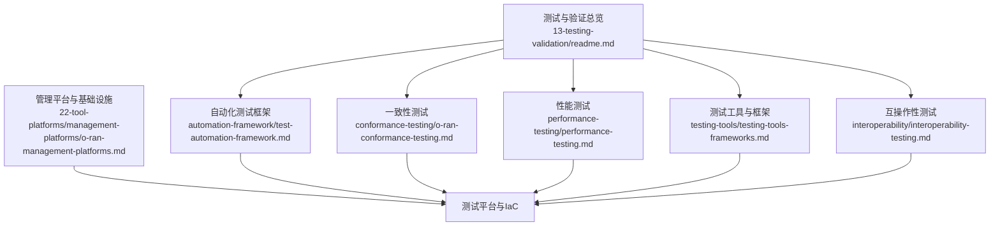
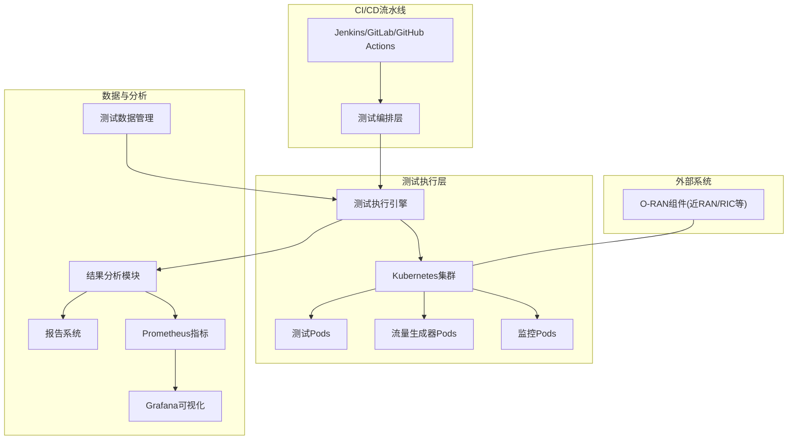
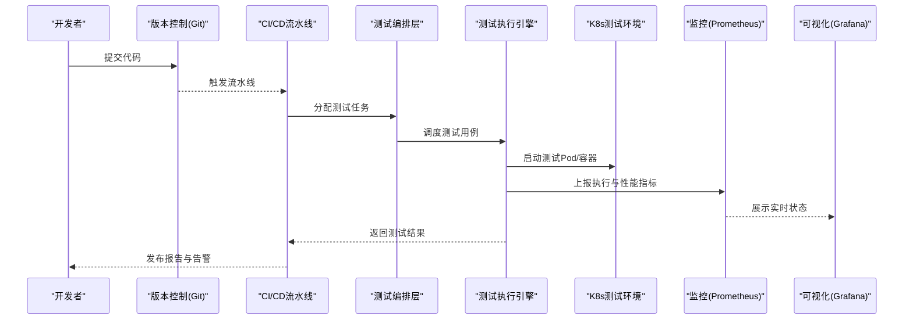
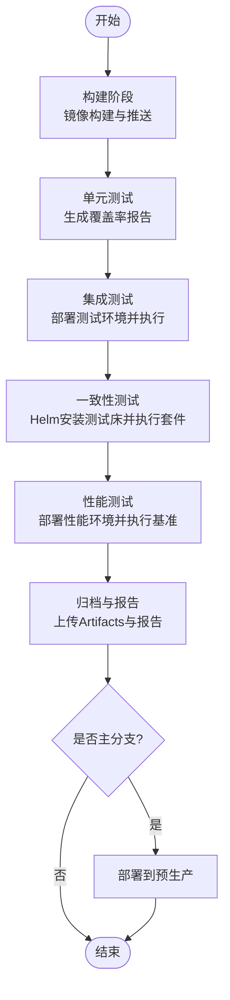
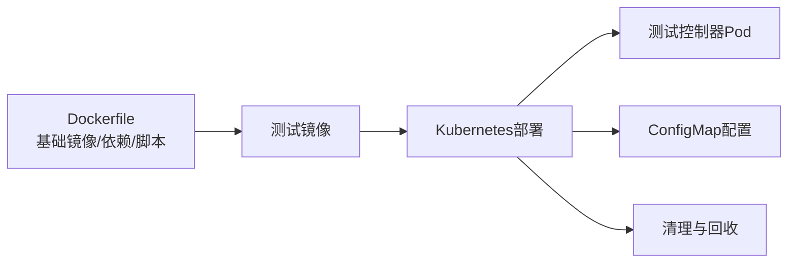
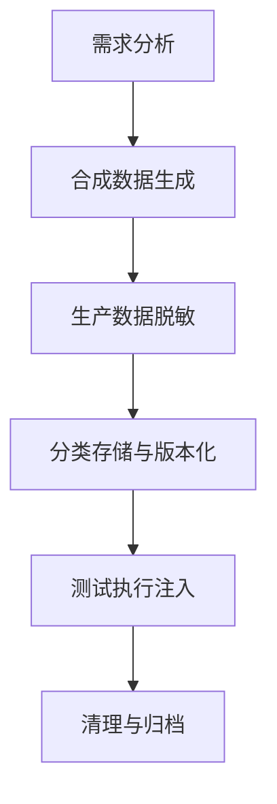
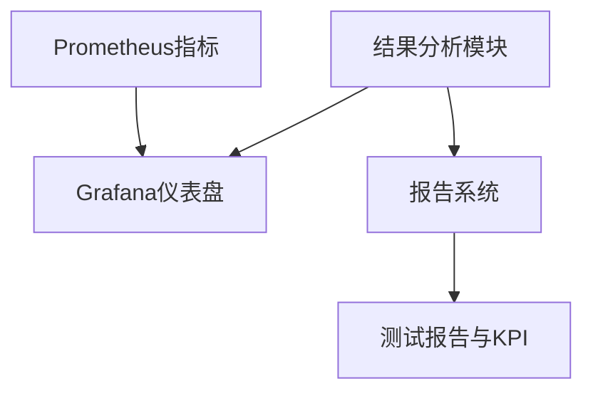
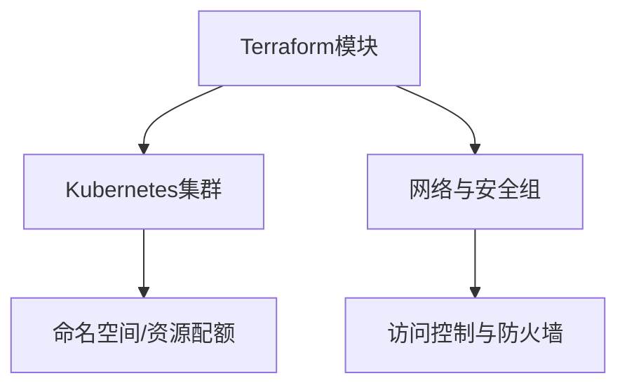
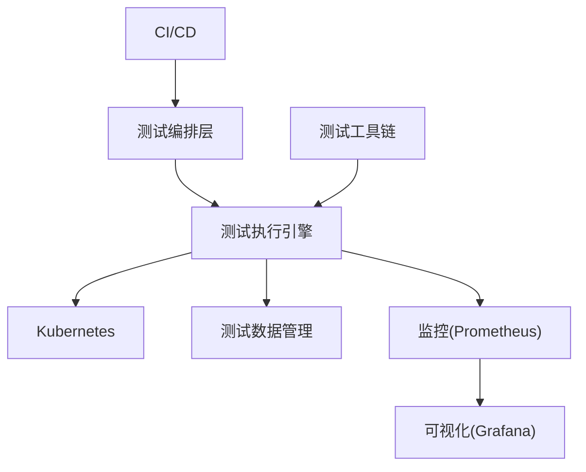

# 测试框架与平台

<cite>
**本文引用的文件**
- [README.md](file://13-testing-validation/readme.md)
- [test-automation-framework.md](file://13-testing-validation/automation-framework/test-automation-framework.md)
- [o-ran-conformance-testing.md](file://13-testing-validation/conformance-testing/o-ran-conformance-testing.md)
- [o-ran-conformance-testing-en.md](file://13-testing-validation/conformance-testing/o-ran-conformance-testing-en.md)
- [performance-testing-zh.md](file://13-testing-validation/performance-testing/performance-testing-zh.md)
- [performance-testing.md](file://13-testing-validation/performance-testing/performance-testing.md)
- [testing-tools-frameworks.md](file://13-testing-validation/testing-tools/testing-tools-frameworks.md)
- [interoperability-testing.md](file://13-testing-validation/interoperability/interoperability-testing.md)
- [o-ran-management-platforms.md](file://22-tool-platforms/management-platforms/o-ran-management-platforms.md)
</cite>

## 目录
1. [简介](#简介)
2. [项目结构](#项目结构)
3. [核心组件](#核心组件)
4. [架构总览](#架构总览)
5. [组件详解](#组件详解)
6. [依赖关系分析](#依赖关系分析)
7. [性能考量](#性能考量)
8. [故障排查指南](#故障排查指南)
9. [结论](#结论)
10. [附录](#附录)

## 简介
本文件面向O-RAN测试框架与平台，系统化梳理自动化测试平台设计架构、CI/CD集成测试流水线、容器化测试环境搭建与管理、测试数据管理策略、测试结果分析与报告生成、测试覆盖率监控机制、测试环境配置管理、并行测试执行、测试床基础设施与环境清理恢复流程，并提供测试框架选择指南、自定义测试框架开发、测试工具链集成与测试过程标准化的最佳实践。

## 项目结构
围绕测试与验证主题，仓库在“13-testing-validation”目录下提供了测试类型、自动化框架、一致性测试、性能测试、工具与框架、互操作性测试等子文档；同时在“22-tool-platforms/management-platforms”中提供基础设施即代码（IaC）与测试平台管理相关内容。整体采用按主题分层组织方式，便于检索与复用。

**图示来源**
- [README.md](file://13-testing-validation/readme.md#L1-L103)
- [test-automation-framework.md](file://13-testing-validation/automation-framework/test-automation-framework.md#L1-L134)
- [o-ran-conformance-testing.md](file://13-testing-validation/conformance-testing/o-ran-conformance-testing.md#L1-L67)
- [performance-testing.md](file://13-testing-validation/performance-testing/performance-testing.md#L1-L327)
- [testing-tools-frameworks.md](file://13-testing-validation/testing-tools/testing-tools-frameworks.md#L1-L598)
- [interoperability-testing.md](file://13-testing-validation/interoperability/interoperability-testing.md#L1-L231)
- [o-ran-management-platforms.md](file://22-tool-platforms/management-platforms/o-ran-management-platforms.md#L618-L709)

**章节来源**
- [README.md](file://13-testing-validation/readme.md#L1-L103)

## 核心组件
- 测试编排层：集中式测试调度与执行管理，负责任务分派、状态追踪与结果聚合。
- 测试执行引擎：分布式执行，支持多环境、多节点并行测试。
- 测试数据管理：测试数据生成、脱敏与版本化管理，保障隐私与可重复性。
- 结果分析模块：自动化采集与分析测试结果，输出趋势与异常检测。
- 报告系统：生成综合测试报告与可视化仪表盘。
- CI/CD集成：与Jenkins、GitLab CI、GitHub Actions等集成，实现持续测试。
- 容器编排：基于Docker/Kubernetes隔离与扩展测试环境。
- 监控与告警：Prometheus+Grafana实时监控测试执行与系统资源。

**章节来源**
- [test-automation-framework.md](file://13-testing-validation/automation-framework/test-automation-framework.md#L6-L21)
- [testing-tools-frameworks.md](file://13-testing-validation/testing-tools/testing-tools-frameworks.md#L364-L418)

## 架构总览
下图展示测试框架与平台的整体架构：从CI/CD触发测试，通过容器化测试环境隔离，执行引擎并行运行测试，数据与监控贯穿始终，最终生成报告与告警。

**图示来源**
- [test-automation-framework.md](file://13-testing-validation/automation-framework/test-automation-framework.md#L15-L21)
- [testing-tools-frameworks.md](file://13-testing-validation/testing-tools/testing-tools-frameworks.md#L298-L357)
- [performance-testing.md](file://13-testing-validation/performance-testing/performance-testing.md#L244-L272)

## 组件详解

### 自动化测试平台
- 设计目标：支持单元、集成、系统与验收测试，配合CI/CD实现持续测试。
- 技术栈：Jenkins/GitLab CI/GitHub Actions、Docker/Kubernetes、Robot Framework/PyTest/JUnit、Prometheus/Grafana、Git。
- 最佳实践：烟测每次提交、定时全量测试、性能回归触发、安全扫描自动化、报告自动发布。

**图示来源**
- [test-automation-framework.md](file://13-testing-validation/automation-framework/test-automation-framework.md#L79-L84)
- [testing-tools-frameworks.md](file://13-testing-validation/testing-tools/testing-tools-frameworks.md#L364-L418)

**章节来源**
- [test-automation-framework.md](file://13-testing-validation/automation-framework/test-automation-framework.md#L22-L134)
- [testing-tools-frameworks.md](file://13-testing-validation/testing-tools/testing-tools-frameworks.md#L364-L418)

### CI/CD集成测试流水线
- 阶段划分：构建、单元测试、集成测试、一致性测试、性能测试、部署。
- 关键流程：镜像构建与推送、Kubernetes应用/删除测试环境、执行测试、产物归档与报告生成。
- 覆盖率：单元测试阶段生成覆盖率报告并上传制品库。
- 一致性测试：通过Helm安装测试床，执行一致性套件，卸载测试床并归档结果。

**图示来源**
- [o-ran-conformance-testing-en.md](file://13-testing-validation/conformance-testing/o-ran-conformance-testing-en.md#L521-L615)

**章节来源**
- [o-ran-conformance-testing-en.md](file://13-testing-validation/conformance-testing/o-ran-conformance-testing-en.md#L517-L615)

### 容器化测试环境搭建与管理
- Docker：封装测试工具与依赖，暴露必要端口，复制配置与脚本。
- Kubernetes：通过Deployment/ConfigMap管理测试控制器与配置，启用并行执行与弹性伸缩。
- 环境隔离：命名空间与网络策略隔离不同测试域，避免相互干扰。
- 清理与回收：测试结束后删除测试资源，释放存储与网络。

**图示来源**
- [testing-tools-frameworks.md](file://13-testing-validation/testing-tools/testing-tools-frameworks.md#L260-L296)
- [testing-tools-frameworks.md](file://13-testing-validation/testing-tools/testing-tools-frameworks.md#L298-L357)

**章节来源**
- [testing-tools-frameworks.md](file://13-testing-validation/testing-tools/testing-tools-frameworks.md#L258-L357)

### 测试数据管理策略
- 合成数据生成：满足隐私合规，支持网络流量、射频信号、控制消息、性能指标等场景。
- 生产数据脱敏：对IMSI/IMEI等敏感字段进行匿名化处理。
- 数据生命周期：分类型维护测试数据集，定期清理，版本化管理Schema与配置。
- 数据驱动：通过配置中心注入测试参数，支持多场景快速切换。

**图示来源**
- [test-automation-framework.md](file://13-testing-validation/automation-framework/test-automation-framework.md#L86-L91)
- [testing-tools-frameworks.md](file://13-testing-validation/testing-tools/testing-tools-frameworks.md#L420-L479)

**章节来源**
- [test-automation-framework.md](file://13-testing-validation/automation-framework/test-automation-framework.md#L86-L91)
- [testing-tools-frameworks.md](file://13-testing-validation/testing-tools/testing-tools-frameworks.md#L420-L479)

### 测试结果分析与报告生成
- 实时监控：Prometheus抓取测试执行与系统指标，Grafana展示趋势与异常。
- 仪表盘：包含测试执行概览、接口性能热力图、资源使用率等面板。
- 报告维度：执行摘要、详细结果、对比分析、优化建议、风险评估。
- 持续监控：自动化回归测试、性能下降告警、容量规划建议、SLA合规报告。

**图示来源**
- [testing-tools-frameworks.md](file://13-testing-validation/testing-tools/testing-tools-frameworks.md#L481-L559)
- [performance-testing.md](file://13-testing-validation/performance-testing/performance-testing.md#L267-L311)

**章节来源**
- [testing-tools-frameworks.md](file://13-testing-validation/testing-tools/testing-tools-frameworks.md#L481-L559)
- [performance-testing.md](file://13-testing-validation/performance-testing/performance-testing.md#L267-L311)

### 测试覆盖率监控机制
- 单元测试覆盖率：在CI中生成覆盖率报告并上传制品库，作为质量门禁指标。
- 覆盖率趋势：结合历史数据识别覆盖缺口，指导用例补充。
- 门禁策略：未达阈值阻断合并或发布。

**章节来源**
- [o-ran-conformance-testing-en.md](file://13-testing-validation/conformance-testing/o-ran-conformance-testing-en.md#L550-L560)

### 测试环境配置管理
- IaC（Terraform）：统一管理多云/混合云的Kubernetes集群、网络与安全组。
- 网络隔离：为控制面/用户面/管理面划分子网与安全组规则。
- 可复用模块：集群、网络、安全等模块化抽象，提升一致性与可维护性。

**图示来源**
- [o-ran-management-platforms.md](file://22-tool-platforms/management-platforms/o-ran-management-platforms.md#L618-L709)

**章节来源**
- [o-ran-management-platforms.md](file://22-tool-platforms/management-platforms/o-ran-management-platforms.md#L618-L709)

### 并行测试执行
- 节点分布：跨多个执行节点分发测试任务，最大化资源利用率。
- 依赖协调：处理跨用例依赖，避免竞态与资源冲突。
- 结果聚合：统一收集与合并测试结果，输出全局报告。

**章节来源**
- [test-automation-framework.md](file://13-testing-validation/automation-framework/test-automation-framework.md#L101-L105)

### 测试床基础设施与环境清理恢复
- 测试床配置：标准化测试环境搭建、网络拓扑模拟、协议栈实现验证、测试数据准备。
- 清理与恢复：测试完成后删除测试资源，恢复默认配置，保障环境可重复性与一致性。

**章节来源**
- [o-ran-conformance-testing.md](file://13-testing-validation/conformance-testing/o-ran-conformance-testing.md#L21-L33)

### 测试框架选择指南
- 开源方案：Robot Framework（业务场景）、PyTest（接口/性能）、Wireshark插件（协议分析）。
- 商业方案：Spirent/Keysight/Anritsu等提供多厂商一致性、性能与安全测试平台。
- 选型原则：结合测试类型、团队技能、预算与合规要求，优先考虑可扩展与可观测性。

**章节来源**
- [testing-tools-frameworks.md](file://13-testing-validation/testing-tools/testing-tools-frameworks.md#L6-L98)
- [testing-tools-frameworks.md](file://13-testing-validation/testing-tools/testing-tools-frameworks.md#L213-L231)

### 自定义测试框架开发
- 模块化设计：将测试编排、执行、数据、分析与报告解耦，提升可维护性。
- 可扩展性：支持插件化测试用例与工具，适配不同接口与协议。
- 标准化：统一测试命名、标签、日志与报告格式，便于CI集成与审计。

**章节来源**
- [test-automation-framework.md](file://13-testing-validation/automation-framework/test-automation-framework.md#L70-L78)

### 测试工具链集成
- 协议分析：Wireshark插件与商业分析仪，支持E2/F1/O-FH等接口解析。
- 容器化：Docker/Kubernetes支撑分布式与弹性测试。
- 监控：Prometheus+Grafana提供实时观测与告警。
- 安全：静态分析、动态扫描、容器镜像扫描与网络渗透测试。

**章节来源**
- [testing-tools-frameworks.md](file://13-testing-validation/testing-tools/testing-tools-frameworks.md#L61-L98)
- [testing-tools-frameworks.md](file://13-testing-validation/testing-tools/testing-tools-frameworks.md#L481-L596)

### 测试过程标准化
- TDD与持续集成：单元/集成/系统/验收测试一体化。
- 质量门禁：测试计划与设计、用例开发、缺陷跟踪、KPI与改进闭环。
- 基准与回归：建立基线性能，自动化回归检测，容量规划与优化建议。

**章节来源**
- [README.md](file://13-testing-validation/readme.md#L59-L81)

## 依赖关系分析
- 组件耦合：测试编排层与执行引擎高内聚，通过Kubernetes解耦环境与任务；数据与监控贯穿各层。
- 外部依赖：CI/CD平台、容器编排、监控系统、商业/开源测试工具。
- 风险点：测试环境依赖外部云资源与网络策略，需IaC与权限治理保障一致性。

**图示来源**
- [test-automation-framework.md](file://13-testing-validation/automation-framework/test-automation-framework.md#L6-L21)
- [testing-tools-frameworks.md](file://13-testing-validation/testing-tools/testing-tools-frameworks.md#L364-L418)

**章节来源**
- [test-automation-framework.md](file://13-testing-validation/automation-framework/test-automation-framework.md#L6-L21)
- [testing-tools-frameworks.md](file://13-testing-validation/testing-tools/testing-tools-frameworks.md#L364-L418)

## 性能考量
- 性能测试类别：网络性能、资源性能、可扩展性。
- 关键KPI：峰值吞吐量、用户面/控制面延迟、连接建立时间、切换成功率、会话/事务处理速率、容器启动/自动扩展响应、存储IOPS等。
- 方法论：负载测试框架、压力测试、延迟特征化、可扩展性验证。
- 优化方向：网络接口调优、QoS、CPU亲和性、内存/存储I/O、内核参数、容器资源限制、应用算法与并行处理。

**章节来源**
- [performance-testing-zh.md](file://13-testing-validation/performance-testing/performance-testing-zh.md#L6-L57)
- [performance-testing-zh.md](file://13-testing-validation/performance-testing/performance-testing-zh.md#L58-L138)
- [performance-testing-zh.md](file://13-testing-validation/performance-testing/performance-testing-zh.md#L169-L242)
- [performance-testing-zh.md](file://13-testing-validation/performance-testing/performance-testing-zh.md#L244-L296)
- [performance-testing.md](file://13-testing-validation/performance-testing/performance-testing.md#L6-L57)
- [performance-testing.md](file://13-testing-validation/performance-testing/performance-testing.md#L58-L138)
- [performance-testing.md](file://13-testing-validation/performance-testing/performance-testing.md#L169-L242)
- [performance-testing.md](file://13-testing-validation/performance-testing/performance-testing.md#L244-L296)

## 故障排查指南
- 环境问题：检查K8s就绪状态、网络连通性、端口占用与安全组放行。
- 执行问题：查看测试控制器日志、容器事件与资源限制，确认并行任务无资源争用。
- 结果异常：核对测试数据生成与注入、监控指标异常点、覆盖率与报告差异。
- 安全扫描：审查静态分析、动态扫描与容器镜像扫描结果，按标准修复并重测。

**章节来源**
- [testing-tools-frameworks.md](file://13-testing-validation/testing-tools/testing-tools-frameworks.md#L561-L596)

## 结论
本测试框架与平台通过“编排-执行-数据-分析-报告-监控”的闭环体系，结合CI/CD与容器化技术，实现了O-RAN系统在一致性、性能、互操作性与安全性方面的全面验证。依托IaC与标准化流程，平台具备良好的可扩展性、可观测性与可重复性，能够支撑从开发到运维的全生命周期测试需求。

## 附录
- 互操作性测试：覆盖E2/F1/O-FH等接口，定义黑/灰/白盒测试策略与矩阵。
- 一致性测试：官方联盟套件与3GPP规范验证，配套测试床与自动化执行。
- 工具与框架：开源与商业工具清单，协议分析、容器化与监控集成示例。

**章节来源**
- [interoperability-testing.md](file://13-testing-validation/interoperability/interoperability-testing.md#L1-L231)
- [o-ran-conformance-testing.md](file://13-testing-validation/conformance-testing/o-ran-conformance-testing.md#L1-L67)
- [testing-tools-frameworks.md](file://13-testing-validation/testing-tools/testing-tools-frameworks.md#L1-L598)