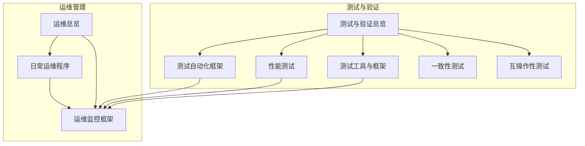
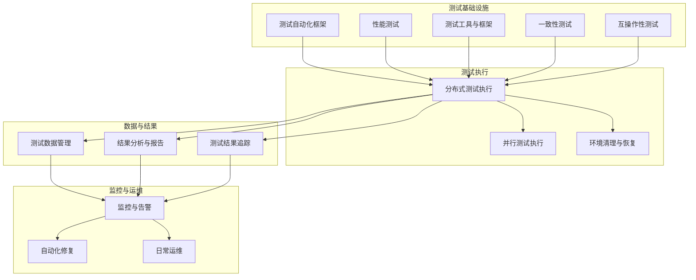
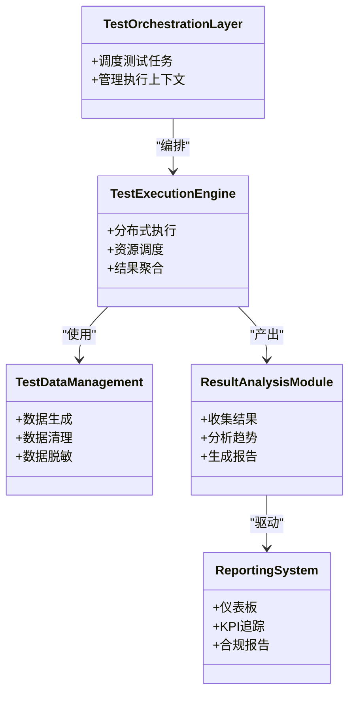
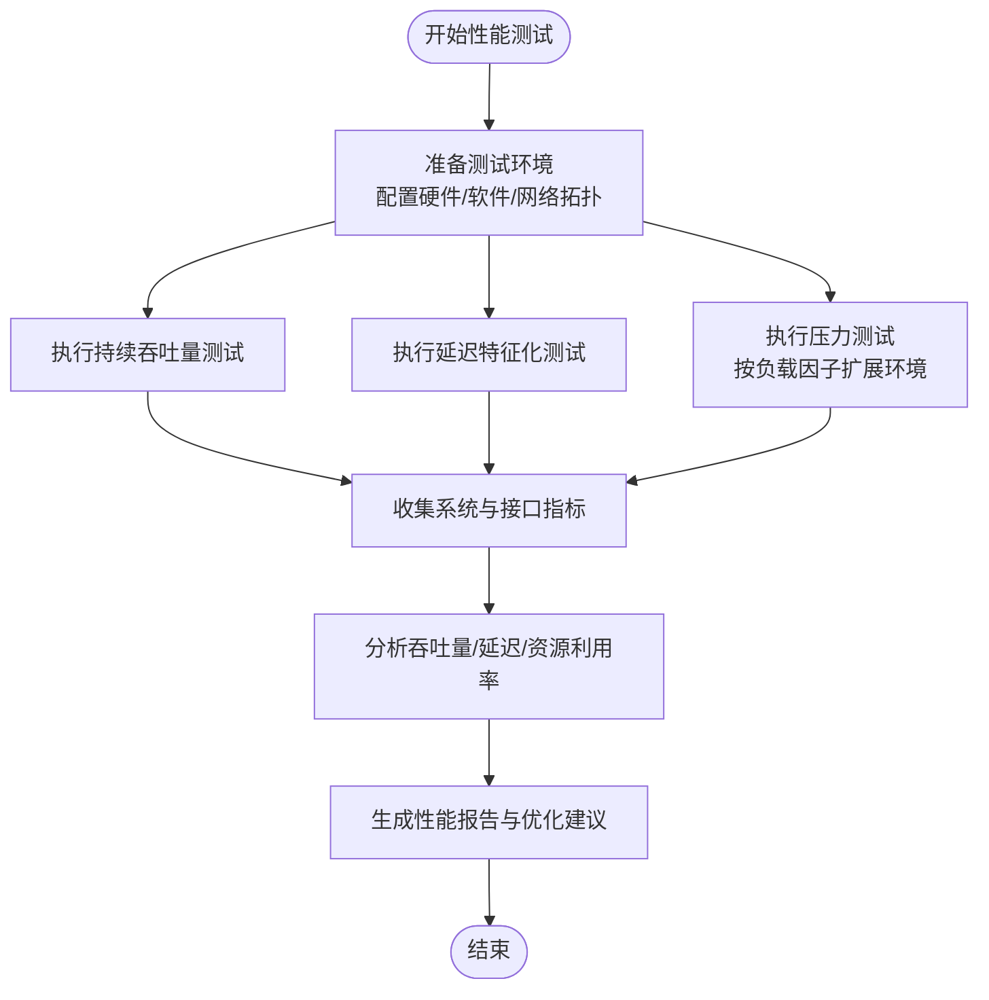
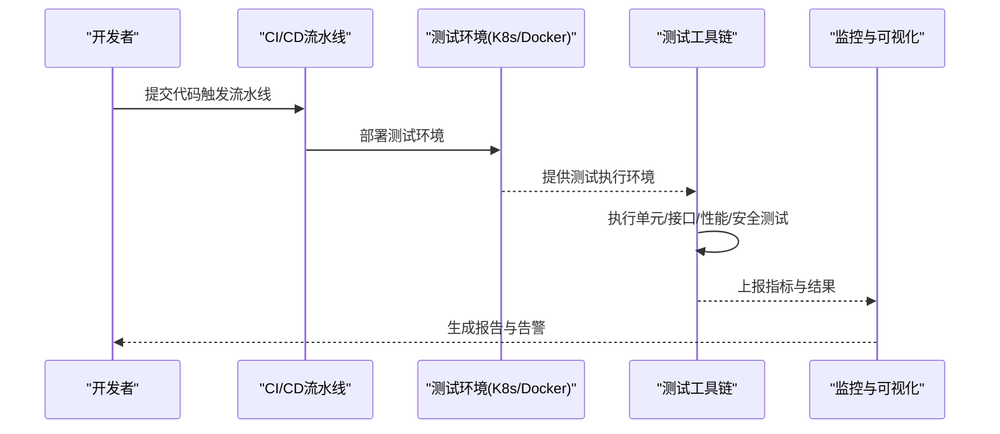
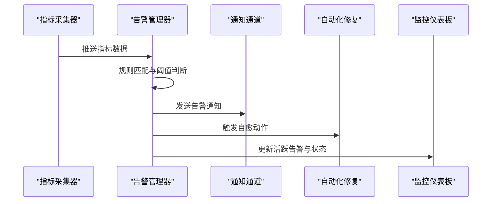
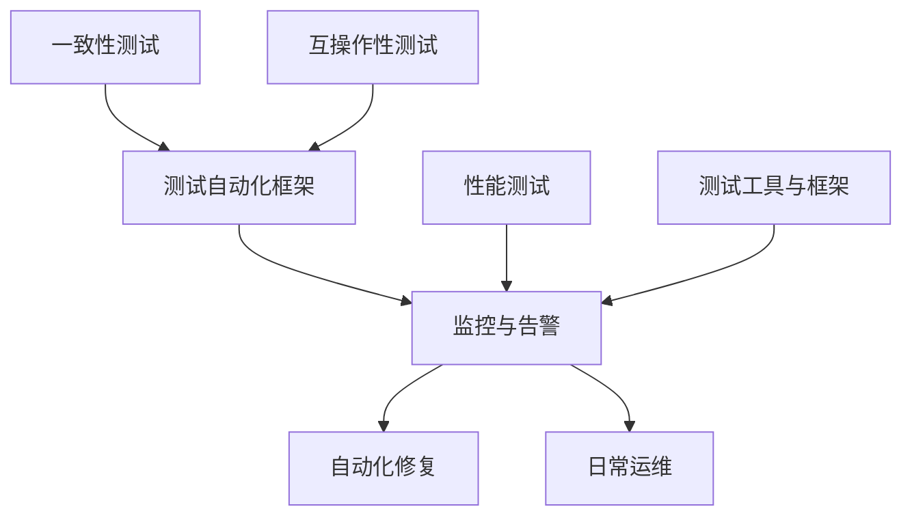

# 测试环境管理

<cite>
**本文引用的文件**
- [测试与验证总览](file://13-testing-validation/readme.md)
- [测试自动化框架](file://13-testing-validation/automation-framework/test-automation-framework.md)
- [一致性测试](file://13-testing-validation/conformance-testing/o-ran-conformance-testing.md)
- [性能测试](file://13-testing-validation/performance-testing/performance-testing-zh.md)
- [性能测试（英文）](file://13-testing-validation/performance-testing/performance-testing.md)
- [测试工具与框架](file://13-testing-validation/testing-tools/testing-tools-frameworks.md)
- [互操作性测试](file://13-testing-validation/interoperability/interoperability-testing.md)
- [运维总览](file://14-operations-management/readme-zh.md)
- [运维总览（英文）](file://14-operations-management/readme.md)
- [日常运维程序](file://14-operations-management/daily-operations/daily-operation-procedures-zh.md)
- [日常运维程序（英文）](file://14-operations-management/daily-operations/daily-operation-procedures.md)
- [运维监控框架](file://14-operations-management/monitoring-alerting/operations-monitoring-framework-zh.md)
- [运维监控框架（英文）](file://14-operations-management/monitoring-alerting/operations-monitoring-framework.md)
</cite>

## 目录
1. [简介](#简介)
2. [项目结构](#项目结构)
3. [核心组件](#核心组件)
4. [架构总览](#架构总览)
5. [详细组件分析](#详细组件分析)
6. [依赖关系分析](#依赖关系分析)
7. [性能考量](#性能考量)
8. [故障排除指南](#故障排除指南)
9. [结论](#结论)
10. [附录](#附录)

## 简介
本文件面向O-RAN测试环境管理，围绕测试床基础设施设计、环境配置管理策略、测试数据准备流程、环境清理与恢复机制、并行测试执行框架、测试环境标准化与版本控制、硬件/虚拟化/混合环境的搭建与维护、生命周期管理、资源配置优化、成本控制与性能监控等方面，提供系统化、可落地的基础设施文档。内容来源于仓库中“测试与验证”“运维管理”两大主题下的权威文档，并结合测试自动化、性能测试、工具链与监控告警等模块，形成从设计到运维的完整闭环。

## 项目结构
测试与验证相关的内容主要集中在“13-testing-validation”目录下，涵盖测试类型、自动化框架、性能测试、工具与框架、一致性测试与互操作性测试；运维管理相关内容集中在“14-operations-management”目录下，涵盖日常运维、监控告警与自动化修复等。二者共同构成测试环境管理的基础设施支撑。

**图表来源**
- [测试与验证总览](file://13-testing-validation/readme.md#L1-L103)
- [测试自动化框架](file://13-testing-validation/automation-framework/test-automation-framework.md#L1-L134)
- [性能测试](file://13-testing-validation/performance-testing/performance-testing-zh.md#L1-L327)
- [测试工具与框架](file://13-testing-validation/testing-tools/testing-tools-frameworks.md#L1-L598)
- [一致性测试](file://13-testing-validation/conformance-testing/o-ran-conformance-testing.md#L1-L67)
- [互操作性测试](file://13-testing-validation/interoperability/interoperability-testing.md#L1-L231)
- [运维总览](file://14-operations-management/readme-zh.md#L1-L126)
- [日常运维程序](file://14-operations-management/daily-operations/daily-operation-procedures-zh.md#L1-L419)
- [运维监控框架](file://14-operations-management/monitoring-alerting/operations-monitoring-framework-zh.md#L1-L800)

**章节来源**
- [测试与验证总览](file://13-testing-validation/readme.md#L1-L103)
- [运维总览](file://14-operations-management/readme-zh.md#L1-L126)

## 核心组件
- 测试自动化框架：提供测试编排、执行引擎、数据管理、结果分析与报告、监控与分析、安全与合规等能力，支撑CI/CD集成与容器化测试环境隔离。
- 性能测试：定义网络与资源性能测试类别、关键KPI、测试方法论、环境配置、场景与监控分析、优化指南及报告与持续监控。
- 测试工具与框架：整合商业与开源测试工具，提供协议分析、自动化测试框架、容器化测试环境与编排、测试数据生成与管理、监控与可视化、安全扫描与合规。
- 一致性测试：描述O-RAN联盟测试套件、3GPP规范验证、测试床配置、自动化测试平台与测试流程。
- 互操作性测试：覆盖多厂商兼容性、接口标准合规、系统集成验证，提供测试场景、方法学、环境配置与验证标准。
- 运维监控框架：构建多层监控体系（基础设施/应用/业务）、指标采集框架、智能告警引擎、仪表板与自动化修复。

**章节来源**
- [测试自动化框架](file://13-testing-validation/automation-framework/test-automation-framework.md#L1-L134)
- [性能测试](file://13-testing-validation/performance-testing/performance-testing-zh.md#L1-L327)
- [测试工具与框架](file://13-testing-validation/testing-tools/testing-tools-frameworks.md#L1-L598)
- [一致性测试](file://13-testing-validation/conformance-testing/o-ran-conformance-testing.md#L1-L67)
- [互操作性测试](file://13-testing-validation/interoperability/interoperability-testing.md#L1-L231)
- [运维监控框架](file://14-operations-management/monitoring-alerting/operations-monitoring-framework-zh.md#L1-L800)

## 架构总览
测试环境管理的总体架构由“测试基础设施—测试执行—数据与结果—监控与运维”四个层面组成，贯穿测试自动化、性能测试、工具链与监控告警，形成闭环。

**图表来源**
- [测试自动化框架](file://13-testing-validation/automation-framework/test-automation-framework.md#L1-L134)
- [性能测试](file://13-testing-validation/performance-testing/performance-testing-zh.md#L1-L327)
- [测试工具与框架](file://13-testing-validation/testing-tools/testing-tools-frameworks.md#L1-L598)
- [一致性测试](file://13-testing-validation/conformance-testing/o-ran-conformance-testing.md#L1-L67)
- [互操作性测试](file://13-testing-validation/interoperability/interoperability-testing.md#L1-L231)
- [运维监控框架](file://14-operations-management/monitoring-alerting/operations-monitoring-framework-zh.md#L1-L800)

## 详细组件分析

### 测试自动化框架
- 组件职责
  - 测试编排与调度：集中式测试调度与执行管理。
  - 测试执行引擎：跨多环境分布式执行。
  - 测试数据管理：测试数据生成、管理与清理。
  - 结果分析与报告：自动化结果收集、分析与可视化。
  - 监控与分析：测试执行期间的实时监控与趋势分析。
- 技术栈
  - CI/CD：Jenkins、GitLab CI、GitHub Actions。
  - 容器编排：Docker、Kubernetes。
  - 测试框架：Robot Framework、PyTest、JUnit。
  - 监控：Prometheus、Grafana。
  - 版本控制：Git。
- 最佳实践
  - 模块化与可维护性：清晰命名与文档。
  - 可扩展性：适配不同负载条件。
  - 可靠性：完善的错误处理与重试机制。
  - 可追溯性：测试与需求映射清晰。
  - CI集成：每次提交执行冒烟测试，定时执行综合测试，重大变更触发性能回归与安全扫描。
  - 数据治理：合成数据生成、敏感信息脱敏、按测试类型分离数据集、定期清理与版本控制。

**图表来源**
- [测试自动化框架](file://13-testing-validation/automation-framework/test-automation-framework.md#L1-L134)

**章节来源**
- [测试自动化框架](file://13-testing-validation/automation-framework/test-automation-framework.md#L1-L134)

### 性能测试
- 测试类别
  - 网络性能：吞吐量、延迟、丢包、抖动、连接密度。
  - 资源性能：CPU、内存、存储I/O、网络带宽、功耗。
  - 可扩展性：水平/垂直扩展、负载分布、容量规划、增长建模。
- 关键KPI
  - 无线接入网：峰值吞吐量、用户面/控制面延迟、连接建立时间、切换成功率。
  - 核心网：会话建立速率、数据包处理速率、Diameter事务速率、数据库查询响应、API响应时间。
  - 云基础设施：容器启动时间、VM配置时间、自动扩展响应、负载均衡器延迟、存储IOPS。
- 方法论与场景
  - 负载测试框架：持续吞吐量测试、延迟特征化、压力测试（按负载因子扩展环境）。
  - 峰值性能测试：满缓冲UDP流量、并发连接、多流并行、端到端路径验证。
  - 延迟特征化：E2/F1/O-FH接口延迟测试脚本与分析。
  - 可扩展性验证：不同扩展因子下的吞吐量、节点性能、负载均衡与通信开销。
- 监控与分析
  - 实时监控：PromQL指标（吞吐量、延迟、资源利用率、错误率）。
  - 仪表板：趋势、热力图、关联性分析、异常检测、容量规划建议。
- 优化指南
  - 网络：接口调优、缓冲区管理、QoS、负载均衡、协议优化。
  - 系统：CPU亲和性、内存管理、存储I/O、内核参数、容器优化。
  - 应用：算法效率、缓存策略、数据库优化、API性能、并行处理。

**图表来源**
- [性能测试](file://13-testing-validation/performance-testing/performance-testing-zh.md#L60-L138)
- [性能测试（英文）](file://13-testing-validation/performance-testing/performance-testing.md#L60-L138)

**章节来源**
- [性能测试](file://13-testing-validation/performance-testing/performance-testing-zh.md#L1-L327)
- [性能测试（英文）](file://13-testing-validation/performance-testing/performance-testing.md#L1-L327)

### 测试工具与框架
- 商业测试解决方案：Spirent、Keysight、Anritsu、Rohde & Schwarz等，覆盖协议一致性、性能/负载测试、RF/协议验证、网络仿真与自动化测试序列。
- 开源测试工具：Robot Framework、PyTest、Wireshark插件、Docker/Kubernetes编排、Prometheus/Grafana监控、OWASP ZAP安全扫描、JMeter性能测试。
- 容器化测试环境：Dockerfile与K8s部署配置，暴露测试端口，挂载配置与脚本，环境变量控制测试环境与并行执行。
- 测试数据管理：合成数据生成、生产数据匿名化、按类型分离数据集、定期清理与版本控制。
- 安全测试集成：静态分析、动态应用安全测试、容器镜像扫描、网络渗透测试与合规报告生成。

**图表来源**
- [测试工具与框架](file://13-testing-validation/testing-tools/testing-tools-frameworks.md#L364-L418)

**章节来源**
- [测试工具与框架](file://13-testing-validation/testing-tools/testing-tools-frameworks.md#L1-L598)

### 一致性测试
- 测试框架：O-RAN联盟测试套件、3GPP规范验证、测试床配置、自动化测试平台与回归机制。
- 测试流程：准备阶段（测试计划、环境验证、工具校准、基线建立）、执行阶段（用例运行、实时监控、异常处理、中间结果分析）、评估阶段（汇总结果、不符合项识别、根因分析、改进建议）。
- 质量保证：测试覆盖度（功能/场景/边界/异常）、测试有效性（用例质量、结果准确性、环境代表性、过程可重复性）。

**章节来源**
- [一致性测试](file://13-testing-validation/conformance-testing/o-ran-conformance-testing.md#L1-L67)

### 互操作性测试
- 目标：多厂商兼容性、接口标准合规、系统集成验证。
- 方法学：黑盒、灰盒、白盒测试策略，结合标准协议与内部实现细节。
- 环境配置：多厂商测试床网络配置、组件清单与测试矩阵。
- 验证标准：功能性/性能性/可靠性指标（连接稳定性、失败恢复时间、会话持久性、负载均衡）。

**章节来源**
- [互操作性测试](file://13-testing-validation/interoperability/interoperability-testing.md#L1-L231)

### 运维监控框架
- 多层监控体系：基础设施（物理/虚拟资源）、应用（服务/接口/性能）、业务（KPI/SLA/QoS/业务影响）。
- 指标采集：系统指标、K8s集群、存储、网络、RIC/接口/服务/性能、业务KPI/SLA/QoS/业务影响。
- 智能告警：阈值规则、告警分类与严重性、通知渠道（邮件/微信/短信/PagerDuty/Slack）、告警关联与去重。
- 自动化修复：基于告警的自愈动作框架，支持超时与重试、动作组合与历史记录。
- 实时仪表板：系统健康、应用性能、网络KPI、业务指标、活跃告警列表与趋势图。

**图表来源**
- [运维监控框架](file://14-operations-management/monitoring-alerting/operations-monitoring-framework-zh.md#L266-L486)

**章节来源**
- [运维监控框架](file://14-operations-management/monitoring-alerting/operations-monitoring-framework-zh.md#L1-L800)
- [运维监控框架（英文）](file://14-operations-management/monitoring-alerting/operations-monitoring-framework.md#L1-L800)

### 日常运维程序
- 健康检查：每日晨间系统健康验证、核心组件健康检查、网络接口监控与告警。
- 配置管理：备份与恢复策略、变更管理流程（请求、评估、实施、验证、回滚）、文档更新。
- 事件响应：严重性分级与升级矩阵、沟通协议（内部/外部/利益相关者）。
- 故障排除：常见问题（E2/F1/O-FH接口）的诊断步骤与解决措施。
- 性能监控与优化：KPI仪表板、自动化性能告警规则。

**章节来源**
- [日常运维程序](file://14-operations-management/daily-operations/daily-operation-procedures-zh.md#L1-L419)
- [日常运维程序（英文）](file://14-operations-management/daily-operations/daily-operation-procedures.md#L1-L443)

## 依赖关系分析
测试环境管理各组件之间存在紧密耦合与协同关系：
- 测试自动化框架依赖容器编排与监控系统，以实现环境隔离、执行调度与结果可视化。
- 性能测试依赖监控系统提供的实时指标与告警，以便在测试过程中进行动态调节与异常处置。
- 测试工具与框架为测试自动化与性能测试提供工具支撑，包括协议分析、安全扫描与可视化。
- 一致性测试与互操作性测试依赖测试自动化框架与监控系统，以实现自动化执行、结果分析与报告。
- 运维监控框架为上述所有测试活动提供统一的监控、告警与自动化修复能力，保障测试环境稳定运行。

**图表来源**
- [测试自动化框架](file://13-testing-validation/automation-framework/test-automation-framework.md#L1-L134)
- [性能测试](file://13-testing-validation/performance-testing/performance-testing-zh.md#L1-L327)
- [测试工具与框架](file://13-testing-validation/testing-tools/testing-tools-frameworks.md#L1-L598)
- [一致性测试](file://13-testing-validation/conformance-testing/o-ran-conformance-testing.md#L1-L67)
- [互操作性测试](file://13-testing-validation/interoperability/interoperability-testing.md#L1-L231)
- [运维监控框架](file://14-operations-management/monitoring-alerting/operations-monitoring-framework-zh.md#L1-L800)

**章节来源**
- [运维总览](file://14-operations-management/readme-zh.md#L1-L126)
- [运维总览（英文）](file://14-operations-management/readme.md#L1-L126)

## 性能考量
- 资源利用率：通过PromQL指标与仪表板持续监控CPU、内存、存储与网络，避免过载引发的性能退化。
- 测试负载与扩展：按负载因子进行压力测试，验证水平/垂直扩展能力与资源利用效率。
- 网络优化：接口调优、缓冲区管理、QoS与负载均衡，降低延迟与抖动。
- 应用优化：算法效率、缓存策略、数据库优化与API性能，减少端到端延迟。
- 自动化修复：针对高CPU、内存耗尽、RIC无响应等典型问题的自愈动作，缩短MTTR。

[本节为通用指导，无需列出具体文件来源]

## 故障排除指南
- E2接口连接问题：验证网络连通性、检查配置参数、证书与安全设置、查看日志、简化配置测试。
- F1接口性能下降：监控接口指标、检查硬件资源、验证分割选项一致性、分析流量模式与拥塞点、审查QoS设置。
- O-FH同步问题：验证IEEE 1588 PTP配置、检查GPS与时钟源、验证前传网络质量、监控同步指标、使用已知良好配置测试。
- 日常健康检查：核心组件健康检查、网络接口监控（丢包、错误、带宽利用率）、邮件告警通知。
- 变更管理：标准化变更请求、技术与业务影响评估、风险矩阵、多级审批、排期协调、实施前后验证与回滚程序。

**章节来源**
- [日常运维程序](file://14-operations-management/daily-operations/daily-operation-procedures-zh.md#L309-L359)
- [日常运维程序（英文）](file://14-operations-management/daily-operations/daily-operation-procedures.md#L309-L359)

## 结论
本文件基于仓库现有文档，系统梳理了O-RAN测试环境管理的基础设施与流程，明确了测试自动化、性能测试、工具链与监控告警的协同关系，并给出了运维监控与日常运维的实操指引。建议在实际落地中，结合组织现状完善测试环境标准化与版本控制、强化并行测试执行与资源调度、持续优化监控与自动化修复能力，以实现高质量、低成本、可扩展的测试环境管理体系。

[本节为总结性内容，无需列出具体文件来源]

## 附录
- 环境搭建指南（基于现有文档）
  - 测试自动化环境：参考测试自动化框架中的环境配置示例与容器编排配置，按需调整RU/DU/CU/RIC节点数量与资源分配。
  - 性能测试环境：参考性能测试环境配置示例，明确硬件规格、软件栈与网络拓扑。
  - 一致性与互操作性测试：参考测试床配置与多厂商测试矩阵，确保网络隔离与组件清单一致。
- 配置管理模板（基于现有文档）
  - 测试环境配置模板：参考测试自动化框架中的环境配置示例。
  - 性能测试环境配置模板：参考性能测试中的环境配置示例。
  - 配置备份与恢复模板：参考日常运维程序中的备份与恢复工作流。
  - 变更管理流程模板：参考日常运维程序中的变更管理流程与脚本。
- 故障排除手册（基于现有文档）
  - E2/F1/O-FH接口问题诊断与解决步骤。
  - 日常健康检查与网络接口监控脚本。
  - 自动化性能告警规则与阈值。
- 运维检查清单（基于现有文档）
  - 每日健康检查清单、配置备份与恢复检查、变更实施与验证清单、事件响应与升级矩阵。

**章节来源**
- [测试自动化框架](file://13-testing-validation/automation-framework/test-automation-framework.md#L24-L38)
- [性能测试](file://13-testing-validation/performance-testing/performance-testing-zh.md#L140-L167)
- [日常运维程序](file://14-operations-management/daily-operations/daily-operation-procedures-zh.md#L165-L217)
- [日常运维程序](file://14-operations-management/daily-operations/daily-operation-procedures-zh.md#L219-L281)
- [运维监控框架](file://14-operations-management/monitoring-alerting/operations-monitoring-framework-zh.md#L410-L441)