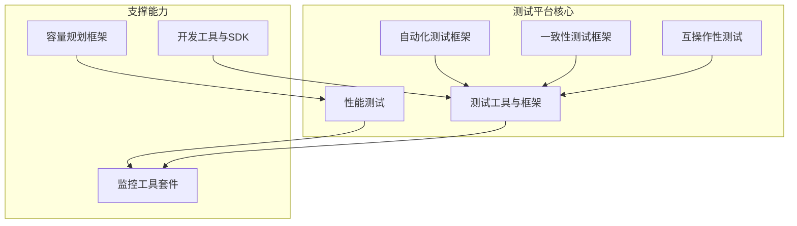
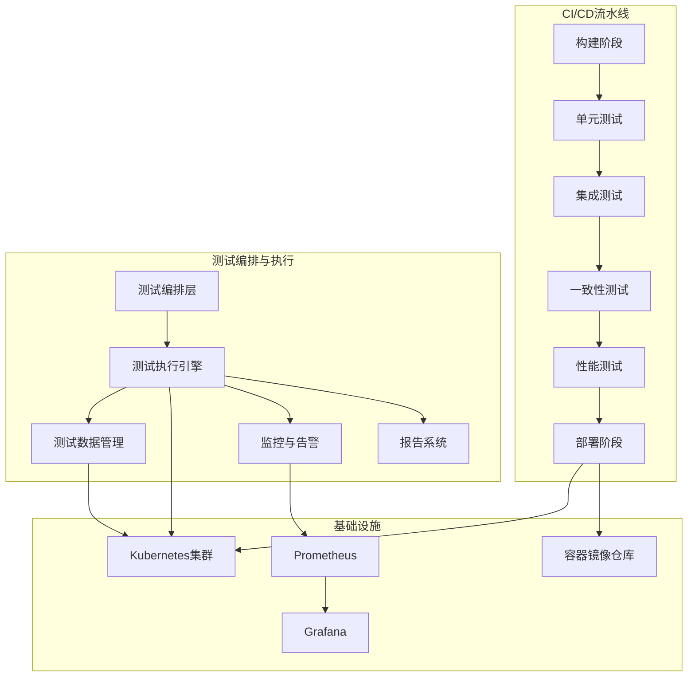
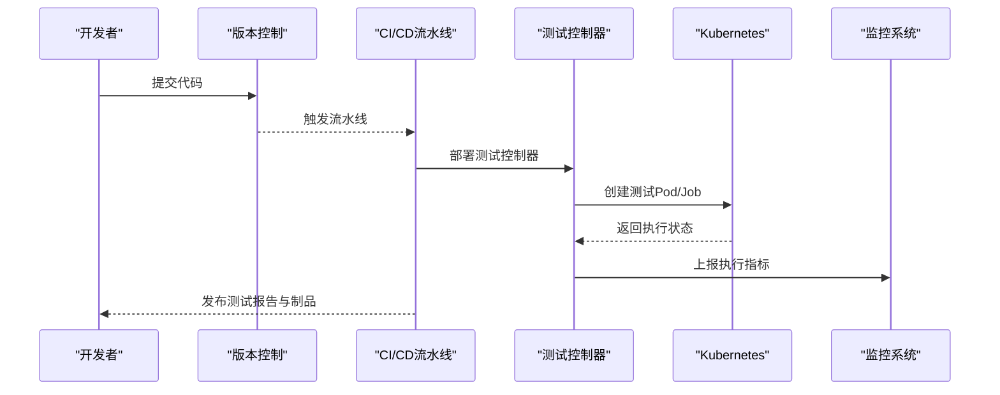
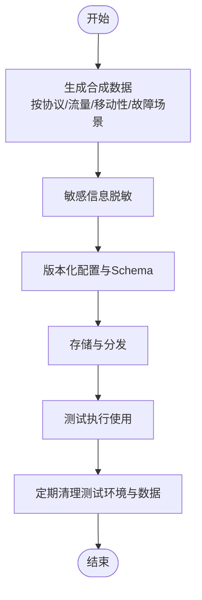
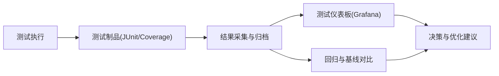
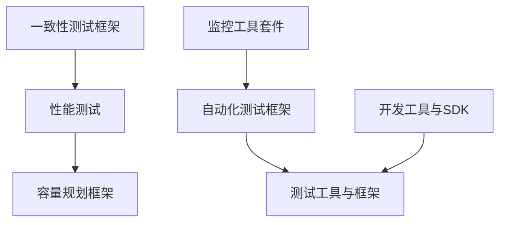

# 自动化测试平台

<cite>
**本文引用的文件**
- [自动化测试框架](file://13-testing-validation/automation-framework/test-automation-framework.md)
- [一致性测试框架](file://13-testing-validation/conformance-testing/o-ran-conformance-testing-en.md)
- [性能测试](file://13-testing-validation/performance-testing/performance-testing.md)
- [测试工具与框架](file://13-testing-validation/testing-tools/testing-tools-frameworks.md)
- [互操作性测试](file://13-testing-validation/interoperability/interoperability-testing.md)
- [开发工具与SDK](file://17-open-source-ecosystem/developer-tools/oran-development-tools.md)
- [监控工具套件](file://28-monitoring-alerting/monitoring-tools/o-ran-monitoring-tools.md)
- [容量规划框架](file://14-operations-management/capacity-planning/capacity-planning-framework-zh.md)
</cite>

## 目录
1. [简介](#简介)
2. [项目结构](#项目结构)
3. [核心组件](#核心组件)
4. [架构总览](#架构总览)
5. [详细组件分析](#详细组件分析)
6. [依赖关系分析](#依赖关系分析)
7. [性能考量](#性能考量)
8. [故障排除指南](#故障排除指南)
9. [结论](#结论)
10. [附录](#附录)

## 简介
本文件面向O-RAN自动化测试平台，系统化阐述CI/CD集成测试流水线设计、容器化测试环境搭建与管理策略、测试数据管理机制、测试结果分析与报告生成系统、测试覆盖率监控工具、测试环境配置管理、并行测试执行框架、测试床基础设施与环境清理恢复流程，并提供测试框架选择指南、自定义测试框架开发方法、测试工具链集成方案与测试过程标准化最佳实践。文档基于仓库中现有测试相关文档进行归纳与整合，形成可落地的工程化指导。

## 项目结构
围绕测试主题，仓库中与自动化测试平台直接相关的知识域包括：
- 自动化测试框架：总体架构、技术栈、环境配置与脚本示例、最佳实践与高级特性
- 一致性测试框架：O-RAN联盟测试套件、3GPP规范验证、测试环境配置、测试数据生成与CI/CD流水线
- 性能测试：性能测试分类、KPI、测试方法论、测试场景、监控与分析、优化指南
- 测试工具与框架：商业与开源测试工具、容器化测试环境、Kubernetes编排、测试数据管理、监控集成
- 互操作性测试：多厂商兼容性、接口标准合规、测试矩阵与验证准则
- 开发工具与SDK：容器化开发环境、本地Kubernetes集群与Helm开发工具
- 监控工具套件：Prometheus/Grafana生态、健康检查、分布式追踪与日志聚合
- 容量规划框架：容量基准测试、性能扫描与报告生成

**图表来源**
- [自动化测试框架](file://13-testing-validation/automation-framework/test-automation-framework.md#L1-L134)
- [一致性测试框架](file://13-testing-validation/conformance-testing/o-ran-conformance-testing-en.md#L1-L617)
- [性能测试](file://13-testing-validation/performance-testing/performance-testing.md#L1-L327)
- [测试工具与框架](file://13-testing-validation/testing-tools/testing-tools-frameworks.md#L1-L598)
- [互操作性测试](file://13-testing-validation/interoperability/interoperability-testing.md#L1-L231)
- [开发工具与SDK](file://17-open-source-ecosystem/developer-tools/oran-development-tools.md#L1-L84)
- [监控工具套件](file://28-monitoring-alerting/monitoring-tools/o-ran-monitoring-tools.md#L1-L186)
- [容量规划框架](file://14-operations-management/capacity-planning/capacity-planning-framework-zh.md#L361-L503)

**章节来源**
- [自动化测试框架](file://13-testing-validation/automation-framework/test-automation-framework.md#L1-L134)
- [一致性测试框架](file://13-testing-validation/conformance-testing/o-ran-conformance-testing-en.md#L1-L617)
- [性能测试](file://13-testing-validation/performance-testing/performance-testing.md#L1-L327)
- [测试工具与框架](file://13-testing-validation/testing-tools/testing-tools-frameworks.md#L1-L598)
- [互操作性测试](file://13-testing-validation/interoperability/interoperability-testing.md#L1-L231)
- [开发工具与SDK](file://17-open-source-ecosystem/developer-tools/oran-development-tools.md#L1-L84)
- [监控工具套件](file://28-monitoring-alerting/monitoring-tools/o-ran-monitoring-tools.md#L1-L186)
- [容量规划框架](file://14-operations-management/capacity-planning/capacity-planning-framework-zh.md#L361-L503)

## 核心组件
- 测试编排层：集中式测试调度与执行管理，支持CI/CD流水线触发与并行执行
- 测试执行引擎：分布式测试执行，基于容器与Kubernetes隔离与扩展
- 测试数据管理：合成数据生成、敏感信息脱敏、版本化数据配置与定期清理
- 结果分析模块：自动化结果采集、趋势分析、覆盖率统计与根因分析
- 报告系统：综合测试报告与仪表板，支持Jenkins、GitLab CI、GitHub Actions集成
- 监控与告警：Prometheus/Grafana实时监控、异常检测与自动化告警
- 工具链集成：Robot Framework、PyTest、JUnit、Wireshark插件、容器镜像扫描

**章节来源**
- [自动化测试框架](file://13-testing-validation/automation-framework/test-automation-framework.md#L6-L21)
- [测试工具与框架](file://13-testing-validation/testing-tools/testing-tools-frameworks.md#L359-L418)
- [监控工具套件](file://28-monitoring-alerting/monitoring-tools/o-ran-monitoring-tools.md#L10-L31)

## 架构总览
测试平台采用分层架构，上层为测试编排与报告，中间层为执行引擎与数据管理，底层为容器化基础设施与监控系统。CI/CD流水线贯穿构建、单元测试、集成测试、一致性测试、性能测试与部署阶段，测试数据与环境通过容器与Kubernetes进行隔离与管理。

**图表来源**
- [一致性测试框架](file://13-testing-validation/conformance-testing/o-ran-conformance-testing-en.md#L521-L615)
- [自动化测试框架](file://13-testing-validation/automation-framework/test-automation-framework.md#L15-L21)
- [测试工具与框架](file://13-testing-validation/testing-tools/testing-tools-frameworks.md#L298-L357)
- [监控工具套件](file://28-monitoring-alerting/monitoring-tools/o-ran-monitoring-tools.md#L10-L31)

## 详细组件分析

### 测试编排与执行引擎
- 分布式执行：通过Kubernetes部署测试控制器与配置，支持并行测试执行与资源调度
- 环境隔离：基于Docker镜像与命名空间隔离测试环境，避免资源冲突
- CI/CD集成：支持Jenkins、GitLab CI、GitHub Actions，按阶段触发测试任务并生成制品

**图表来源**
- [测试工具与框架](file://13-testing-validation/testing-tools/testing-tools-frameworks.md#L363-L418)
- [一致性测试框架](file://13-testing-validation/conformance-testing/o-ran-conformance-testing-en.md#L521-L615)

**章节来源**
- [测试工具与框架](file://13-testing-validation/testing-tools/testing-tools-frameworks.md#L298-L357)
- [一致性测试框架](file://13-testing-validation/conformance-testing/o-ran-conformance-testing-en.md#L521-L615)

### 测试数据管理机制
- 合成数据生成：按协议、流量、移动性与故障场景生成真实感数据
- 数据脱敏与隐私：对生产数据进行匿名化处理，满足合规要求
- 版本化与清理：测试数据Schema与配置纳入版本控制，定期清理测试环境与数据

**图表来源**
- [一致性测试框架](file://13-testing-validation/conformance-testing/o-ran-conformance-testing-en.md#L362-L515)
- [测试工具与框架](file://13-testing-validation/testing-tools/testing-tools-frameworks.md#L420-L479)
- [自动化测试框架](file://13-testing-validation/automation-framework/test-automation-framework.md#L86-L91)

**章节来源**
- [一致性测试框架](file://13-testing-validation/conformance-testing/o-ran-conformance-testing-en.md#L362-L515)
- [测试工具与框架](file://13-testing-validation/testing-tools/testing-tools-frameworks.md#L420-L479)
- [自动化测试框架](file://13-testing-validation/automation-framework/test-automation-framework.md#L86-L91)

### 测试结果分析与报告生成系统
- 自动化采集：统一结果格式（JUnit XML、Cobertura覆盖率），便于CI系统解析
- 趋势与仪表板：基于Prometheus/Grafana生成测试执行趋势、失败率、覆盖率与资源消耗分析
- 回归与基线对比：性能测试结果与基线对比，识别回归

**图表来源**
- [一致性测试框架](file://13-testing-validation/conformance-testing/o-ran-conformance-testing-en.md#L582-L601)
- [测试工具与框架](file://13-testing-validation/testing-tools/testing-tools-frameworks.md#L520-L559)
- [监控工具套件](file://28-monitoring-alerting/monitoring-tools/o-ran-monitoring-tools.md#L136-L181)

**章节来源**
- [一致性测试框架](file://13-testing-validation/conformance-testing/o-ran-conformance-testing-en.md#L582-L601)
- [测试工具与框架](file://13-testing-validation/testing-tools/testing-tools-frameworks.md#L520-L559)
- [监控工具套件](file://28-monitoring-alerting/monitoring-tools/o-ran-monitoring-tools.md#L136-L181)

### 测试覆盖率监控工具
- 覆盖率格式：Cobertura XML，便于CI系统解析与展示
- 覆盖率报告：在单元测试阶段生成覆盖率报告，作为质量门禁指标

**章节来源**
- [一致性测试框架](file://13-testing-validation/conformance-testing/o-ran-conformance-testing-en.md#L555-L559)

### 测试环境配置管理
- YAML配置：标准化测试环境配置（基础镜像、网络拓扑、资源分配）
- Helm部署：通过Helm Chart一键部署测试床组件（Near-RT RIC、Non-RT RIC、O-CU、O-DU、O-RU）
- 网络与存储：SDN控制器、SR-IOV、DPDK、持久卷与存储类配置

**章节来源**
- [自动化测试框架](file://13-testing-validation/automation-framework/test-automation-framework.md#L24-L38)
- [一致性测试框架](file://13-testing-validation/conformance-testing/o-ran-conformance-testing-en.md#L297-L358)

### 并行测试执行框架
- 节点分布：跨多个执行节点分发测试任务，提升吞吐
- 调度优化：智能调度与资源利用率优化
- 结果合并：统一结果收集与报告生成，处理测试间依赖与协调

**章节来源**
- [自动化测试框架](file://13-testing-validation/automation-framework/test-automation-framework.md#L101-L105)

### 测试床基础设施与环境清理恢复
- 基础设施：Kubernetes集群、SDN控制器、存储与网络插件
- 清理策略：测试结束后删除测试资源与命名空间，释放存储与网络资源
- 恢复流程：通过Helm卸载测试床或重启Pod，确保环境可重复使用

**章节来源**
- [一致性测试框架](file://13-testing-validation/conformance-testing/o-ran-conformance-testing-en.md#L297-L358)
- [一致性测试框架](file://13-testing-validation/conformance-testing/o-ran-conformance-testing-en.md#L570-L580)

### 测试框架选择指南与自定义开发
- 框架选择：根据测试类型选择Robot Framework（接口）、PyTest（单元/集成）、JUnit（Java组件）
- 自定义框架：基于Python/Robot/Kubernetes构建可扩展测试框架，支持配置中心与并行执行
- 工具链集成：Wireshark插件、Prometheus/Grafana、Trivy容器扫描、ZAP动态扫描

**章节来源**
- [测试工具与框架](file://13-testing-validation/testing-tools/testing-tools-frameworks.md#L100-L164)
- [测试工具与框架](file://13-testing-validation/testing-tools/testing-tools-frameworks.md#L258-L296)
- [测试工具与框架](file://13-testing-validation/testing-tools/testing-tools-frameworks.md#L481-L596)

### 测试过程标准化最佳实践
- 设计原则：模块化、可维护性、可扩展性、可靠性、可追溯性
- CI集成：每次提交执行冒烟测试，定时执行完整测试套件，触发性能回归测试
- 数据治理：合成数据优先、数据脱敏、分层数据集、定期清理与版本控制
- 安全与合规：测试环境隔离、网络分段、定期扫描、合规验证与审计

**章节来源**
- [自动化测试框架](file://13-testing-validation/automation-framework/test-automation-framework.md#L70-L92)
- [自动化测试框架](file://13-testing-validation/automation-framework/test-automation-framework.md#L122-L134)

## 依赖关系分析
测试平台各组件之间的耦合与协作如下：
- 自动化测试框架与测试工具框架：前者提供整体架构与最佳实践，后者提供具体工具与脚本
- 一致性测试框架与性能测试：前者负责协议与规范验证，后者负责性能与容量评估
- 监控工具套件与测试执行：监控系统贯穿测试生命周期，提供实时观测与告警
- 开发工具与SDK：为测试环境提供本地开发与调试能力

**图表来源**
- [自动化测试框架](file://13-testing-validation/automation-framework/test-automation-framework.md#L1-L134)
- [测试工具与框架](file://13-testing-validation/testing-tools/testing-tools-frameworks.md#L1-L598)
- [一致性测试框架](file://13-testing-validation/conformance-testing/o-ran-conformance-testing-en.md#L1-L617)
- [性能测试](file://13-testing-validation/performance-testing/performance-testing.md#L1-L327)
- [容量规划框架](file://14-operations-management/capacity-planning/capacity-planning-framework-zh.md#L361-L503)
- [开发工具与SDK](file://17-open-source-ecosystem/developer-tools/oran-development-tools.md#L1-L84)
- [监控工具套件](file://28-monitoring-alerting/monitoring-tools/o-ran-monitoring-tools.md#L1-L186)

**章节来源**
- [自动化测试框架](file://13-testing-validation/automation-framework/test-automation-framework.md#L1-L134)
- [测试工具与框架](file://13-testing-validation/testing-tools/testing-tools-frameworks.md#L1-L598)
- [一致性测试框架](file://13-testing-validation/conformance-testing/o-ran-conformance-testing-en.md#L1-L617)
- [性能测试](file://13-testing-validation/performance-testing/performance-testing.md#L1-L327)
- [容量规划框架](file://14-operations-management/capacity-planning/capacity-planning-framework-zh.md#L361-L503)
- [开发工具与SDK](file://17-open-source-ecosystem/developer-tools/oran-development-tools.md#L1-L84)
- [监控工具套件](file://28-monitoring-alerting/monitoring-tools/o-ran-monitoring-tools.md#L1-L186)

## 性能考量
- 性能测试分类：网络性能、资源性能、可扩展性
- KPI与指标：吞吐量、延迟、丢包率、抖动、连接密度、CPU/内存/存储/网络带宽、功耗
- 方法论：负载测试、压力测试、峰值性能验证、延迟特征化、可扩展性验证
- 监控与分析：PromQL查询、实时仪表板、异常检测、容量规划与优化建议
- 优化指南：网络接口调优、缓冲区管理、QoS、负载均衡、内核参数、容器优化、应用级优化

**章节来源**
- [性能测试](file://13-testing-validation/performance-testing/performance-testing.md#L6-L57)
- [性能测试](file://13-testing-validation/performance-testing/performance-testing.md#L58-L138)
- [性能测试](file://13-testing-validation/performance-testing/performance-testing.md#L169-L242)
- [性能测试](file://13-testing-validation/performance-testing/performance-testing.md#L244-L265)
- [容量规划框架](file://14-operations-management/capacity-planning/capacity-planning-framework-zh.md#L361-L503)

## 故障排除指南
- 环境问题：检查Kubernetes集群状态、Pod就绪、网络连通性、存储卷挂载
- 测试失败：查看测试日志、抓取协议包（Wireshark）、确认配置参数与超时设置
- 监控告警：关注Prometheus告警规则、Grafana仪表板异常、资源瓶颈与错误率上升
- 安全扫描：Trivy镜像扫描、Clair漏洞扫描、ZAP动态扫描、Nmap/Nikto网络扫描
- 回归与基线：对比历史结果与基线，定位性能退化与功能回归

**章节来源**
- [测试工具与框架](file://13-testing-validation/testing-tools/testing-tools-frameworks.md#L561-L596)
- [监控工具套件](file://28-monitoring-alerting/monitoring-tools/o-ran-monitoring-tools.md#L10-L31)

## 结论
本自动化测试平台通过清晰的分层架构、完善的CI/CD流水线、容器化与Kubernetes编排、全面的测试数据管理与监控体系，实现了O-RAN系统的持续集成、持续交付与持续测试。结合一致性测试、性能测试与互操作性测试，平台能够覆盖从接口到端到端系统的验证需求，并通过覆盖率与仪表板实现测试质量的可视化与持续改进。

## 附录
- 配置示例与部署步骤可参考以下文件路径与行号：
  - 测试环境配置示例：[自动化测试框架](file://13-testing-validation/automation-framework/test-automation-framework.md#L24-L38)
  - 测试床配置（Helm）：[一致性测试框架](file://13-testing-validation/conformance-testing/o-ran-conformance-testing-en.md#L297-L358)
  - CI/CD流水线（GitLab CI）：[一致性测试框架](file://13-testing-validation/conformance-testing/o-ran-conformance-testing-en.md#L521-L615)
  - CI/CD流水线（GitHub Actions）：[测试工具与框架](file://13-testing-validation/testing-tools/testing-tools-frameworks.md#L363-L418)
  - 容器化测试环境（Dockerfile）：[测试工具与框架](file://13-testing-validation/testing-tools/testing-tools-frameworks.md#L260-L296)
  - Kubernetes测试编排（Deployment/ConfigMap）：[测试工具与框架](file://13-testing-validation/testing-tools/testing-tools-frameworks.md#L298-L357)
  - 测试数据生成（Python）：[一致性测试框架](file://13-testing-validation/conformance-testing/o-ran-conformance-testing-en.md#L362-L515)
  - 监控与告警（Prometheus/Grafana）：[监控工具套件](file://28-monitoring-alerting/monitoring-tools/o-ran-monitoring-tools.md#L10-L31)
  - 开发环境（Dockerfile）：[开发工具与SDK](file://17-open-source-ecosystem/developer-tools/oran-development-tools.md#L10-L84)
  - 容量基准测试（Python）：[容量规划框架](file://14-operations-management/capacity-planning/capacity-planning-framework-zh.md#L361-L503)