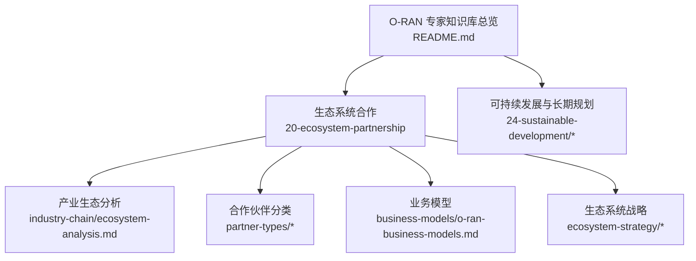
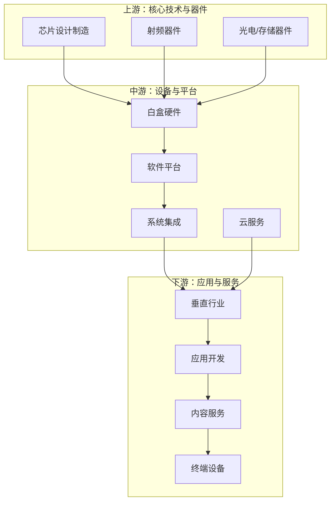
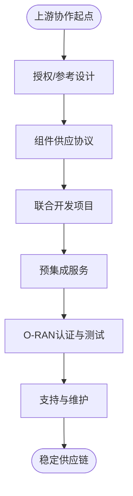
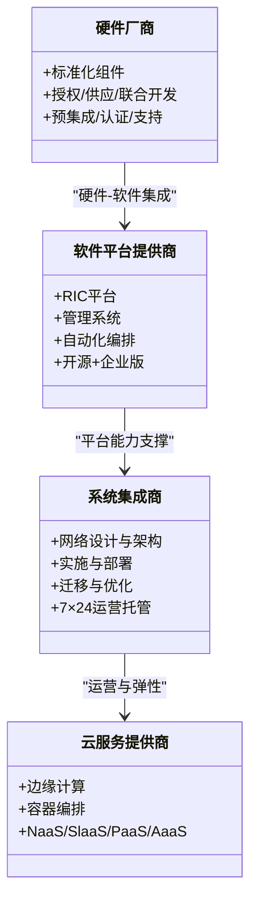
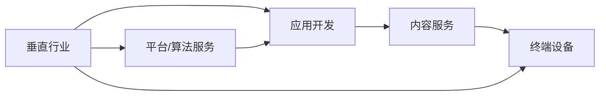
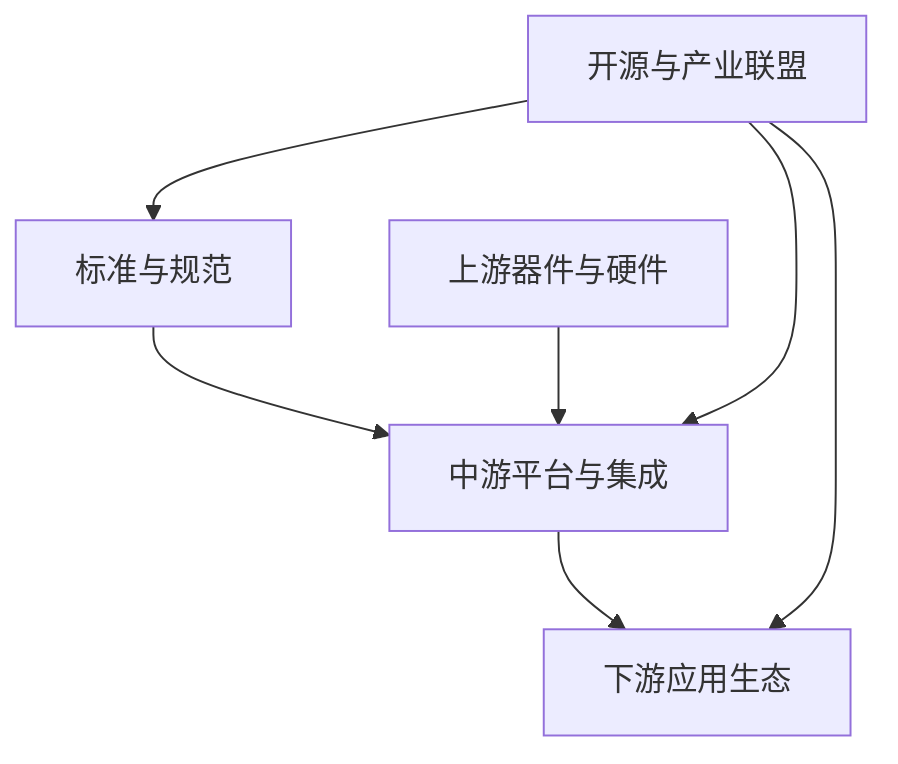

# O-RAN 产业链分析

<cite>
**本文引用的文件**
- [O-RAN 产业链生态分析](file://20-ecosystem-partnership/industry-chain/ecosystem-analysis.md)
- [O-RAN 合作伙伴类型与协作模式](file://20-ecosystem-partnership/partner-types/o-ran-partner-classification-zh.md)
- [O-RAN 生态系统战略框架](file://20-ecosystem-partnership/ecosystem-strategy/o-ran-ecosystem-strategy-zh.md)
- [O-RAN 合作伙伴类型与协作模式（英文）](file://20-ecosystem-partnership/partner-types/o-ran-partner-classification.md)
- [O-RAN 生态系统战略框架（英文）](file://20-ecosystem-partnership/ecosystem-strategy/o-ran-ecosystem-strategy.md)
- [O-RAN 业务模型与变现策略](file://20-ecosystem-partnership/business-models/o-ran-business-models.md)
- [O-RAN 长期发展规划](file://24-sustainable-development/long-term-planning/o-ran-long-term-strategy.md)
- [O-RAN 专家知识库总览](file://README.md)
</cite>

## 目录
1. [引言](#引言)
2. [项目结构](#项目结构)
3. [核心组件](#核心组件)
4. [架构总览](#架构总览)
5. [详细组件分析](#详细组件分析)
6. [依赖分析](#依赖分析)
7. [性能考虑](#性能考虑)
8. [故障排查指南](#故障排查指南)
9. [结论](#结论)
10. [附录](#附录)

## 引言
本文件面向O-RAN产业生态分析，围绕“上游供应商—中游集成商—下游应用提供商”的完整价值链进行系统梳理，结合知识库中关于合作伙伴分类、业务模型、生态系统战略与长期规划的内容，给出价值创造能力与竞争格局分析，并提出供应链管理与风险控制机制，帮助各参与方建立稳定、协同、可持续的产业合作关系。

## 项目结构
该知识库以主题域划分，涵盖O-RAN架构、核心组件、接口标准、云化集成、测试验证、运营管理、安全隐私、产业解决方案、开源生态、成本效益、人才发展、生态系统合作、案例研究、工具平台、国际部署、可持续发展、法律合规、性能优化、故障诊断、监控告警、安全威胁、最佳实践等。其中与本分析直接相关的关键目录如下：
- 20-ecosystem-partnership：包含产业生态、合作伙伴分类、业务模型与生态系统战略
- 24-sustainable-development：包含长期规划与可持续发展相关内容
- README：总体知识库结构与学习路径说明

图表来源
- [O-RAN 专家知识库总览](file://README.md#L1-L472)
- [O-RAN 产业链生态分析](file://20-ecosystem-partnership/industry-chain/ecosystem-analysis.md#L1-L127)
- [O-RAN 合作伙伴类型与协作模式](file://20-ecosystem-partnership/partner-types/o-ran-partner-classification-zh.md#L1-L218)
- [O-RAN 生态系统战略框架](file://20-ecosystem-partnership/ecosystem-strategy/o-ran-ecosystem-strategy-zh.md#L1-L189)
- [O-RAN 业务模型与变现策略](file://20-ecosystem-partnership/business-models/o-ran-business-models.md#L1-L299)
- [O-RAN 长期发展规划](file://24-sustainable-development/long-term-planning/o-ran-long-term-strategy.md#L135-L160)

章节来源
- [O-RAN 专家知识库总览](file://README.md#L1-L472)

## 核心组件
本节聚焦O-RAN产业的三大价值层级及其典型参与者与协作模式，依据知识库中的“产业生态分析”“合作伙伴分类”“生态系统战略”“业务模型”等文件进行归纳。

- 上游：核心技术与器件
  - 芯片设计制造：海思/高通/联发科/博通等
  - 射频器件：Skyworks/Qorvo等
  - 光电/存储器件：MACOM/II-VI及三星/美光/海力士等
  - 协作模式：授权（参考设计）、组件供应、联合开发；预集成、认证、支持与维护
  - 价值占比：约25%-30%

- 中游：设备与平台
  - 白盒硬件：Foxconn/Inventec/Wistron等
  - 软件平台：ONAP/ONOS/Linux基金会等
  - 集成服务：系统集成商、咨询公司
  - 云服务：AWS/Azure/阿里云/腾讯云/华为云/百度云等
  - 价值占比：约20%-25%（硬件）+15%-20%（软件平台）+15%-20%（集成服务）+10%-15%（运营服务）

- 下游：应用与服务
  - 垂直行业：制造业、能源、交通、医疗、零售等
  - 应用开发：软件开发商、平台服务商、解决方案商
  - 内容服务：视频平台、游戏公司、企业应用
  - 终端设备：手机厂商、IoT设备商、车载终端
  - 价值占比：由具体场景决定，强调平台化与生态化

章节来源
- [O-RAN 产业链生态分析](file://20-ecosystem-partnership/industry-chain/ecosystem-analysis.md#L8-L32)
- [O-RAN 合作伙伴类型与协作模式](file://20-ecosystem-partnership/partner-types/o-ran-partner-classification-zh.md#L8-L70)
- [O-RAN 合作伙伴类型与协作模式（英文）](file://20-ecosystem-partnership/partner-types/o-ran-partner-classification.md#L8-L70)

## 架构总览
下图从“价值流”角度展示O-RAN产业的三层分工与协作关系，以及关键的生态机制与商业模式。

图表来源
- [O-RAN 产业链生态分析](file://20-ecosystem-partnership/industry-chain/ecosystem-analysis.md#L8-L32)
- [O-RAN 合作伙伴类型与协作模式](file://20-ecosystem-partnership/partner-types/o-ran-partner-classification-zh.md#L8-L70)

## 详细组件分析

### 上游：芯片与器件供应商
- 角色与能力
  - 提供标准化硬件组件与关键子系统（CPU/SoC、射频前端、光电器件、存储与高速接口）
  - 通过授权、组件供应与联合开发建立长期合作
  - 提供预集成、认证与持续支持服务
- 价值与竞争
  - 价值占比约25%-30%，主要来自IP授权与芯片销售
  - 竞争焦点：技术领先性、良率与成本控制、供应链韧性
- 风险与协同
  - 风险：技术迭代、产能波动、地缘政治
  - 协同：参考设计授权、组件供应协议、联合开发项目

图表来源
- [O-RAN 合作伙伴类型与协作模式](file://20-ecosystem-partnership/partner-types/o-ran-partner-classification-zh.md#L18-L29)

章节来源
- [O-RAN 产业链生态分析](file://20-ecosystem-partnership/industry-chain/ecosystem-analysis.md#L8-L14)
- [O-RAN 合作伙伴类型与协作模式（英文）](file://20-ecosystem-partnership/partner-types/o-ran-partner-classification.md#L18-L29)

### 中游：硬件、平台与集成服务
- 硬件厂商（白盒制造商）
  - 角色：标准化服务器、网络设备与专用射频单元
  - 协作：授权、组件供应、联合开发；预集成、认证、支持与维护
- 软件平台提供商（RIC平台、管理系统、自动化编排）
  - 角色：多厂商互操作、可扩展、创新与成本效率
  - 价值：开源+企业版收费，平台即服务（PaaS）
- 系统集成商与咨询公司
  - 角色：端到端网络设计、实施、迁移、优化与托管
  - 服务：专业服务（设计/实施/迁移/优化）与托管服务（24×7运营、安全管理、性能监控、维护）
- 云服务提供商
  - 角色：边缘计算、容器编排、弹性资源与全球化部署
  - 模式：NaaS、SlaaS、PaaS、AaaS等

图表来源
- [O-RAN 合作伙伴类型与协作模式](file://20-ecosystem-partnership/partner-types/o-ran-partner-classification-zh.md#L31-L70)
- [O-RAN 生态系统战略框架](file://20-ecosystem-partnership/ecosystem-strategy/o-ran-ecosystem-strategy-zh.md#L50-L91)

章节来源
- [O-RAN 合作伙伴类型与协作模式（英文）](file://20-ecosystem-partnership/partner-types/o-ran-partner-classification.md#L31-L70)
- [O-RAN 生态系统战略框架（英文）](file://20-ecosystem-partnership/ecosystem-strategy/o-ran-ecosystem-strategy.md#L50-L91)

### 下游：垂直行业与应用生态
- 垂直行业用户
  - 制造业（工业互联网、自动化）
  - 医疗健康（远程医疗、医疗设备连接）
  - 交通运输（车联网、智能交通）
  - 能源与公用事业（智能电网、可再生能源）
  - 零售与酒店（客户体验、位置服务）
- 应用与内容
  - 软件开发商、平台服务商、解决方案商
  - 视频平台、游戏公司、企业应用
- 终端设备
  - 手机厂商、IoT设备商、车载终端
- 商业模式
  - 切片即服务（SlaaS）、平台即服务（PaaS）、算法即服务（AaaS）
  - 数据与洞察服务、订阅制与按需付费

图表来源
- [O-RAN 产业链生态分析](file://20-ecosystem-partnership/industry-chain/ecosystem-analysis.md#L25-L32)
- [O-RAN 合作伙伴类型与协作模式](file://20-ecosystem-partnership/partner-types/o-ran-partner-classification-zh.md#L124-L142)

章节来源
- [O-RAN 产业链生态分析](file://20-ecosystem-partnership/industry-chain/ecosystem-analysis.md#L25-L32)
- [O-RAN 合作伙伴类型与协作模式（英文）](file://20-ecosystem-partnership/partner-types/o-ran-partner-classification.md#L124-L142)

### 生态模式与商业模式
- 开放合作模式
  - 技术标准统一、互操作性测试（Plugfest）、开源社区建设、产业联盟协调
- 商业模式创新
  - 网络即服务（NaaS）、切片即服务（SlaaS）、平台即服务（PaaS）、算法即服务（AaaS）
  - 设备即服务（EaaS）、订阅制、结果导向定价
- 收入结构与分成
  - 硬件（30%-40%）、软件（25%-35%）、服务（20%-30%）、运营商（10%-15%）

章节来源
- [O-RAN 产业链生态分析](file://20-ecosystem-partnership/industry-chain/ecosystem-analysis.md#L67-L80)
- [O-RAN 业务模型与变现策略](file://20-ecosystem-partnership/business-models/o-ran-business-models.md#L139-L207)

### 竞争格局与趋势
- 主要竞争者类型
  - 传统设备商转型（爱立信、诺基亚、三星、中兴）
  - 新兴创新企业（Altiostar、Mavenir、Parallel Wireless、Federated Wireless）
  - 云服务提供商（AWS、Microsoft、Google、国内云商）
- 发展趋势
  - 短期：标准化加速、试点扩大、生态完善、成本下降
  - 中期：商用部署、垂直应用、AI融合、竞争加剧
  - 长期：6G演进、生态成熟、价值重构、全球普及

章节来源
- [O-RAN 产业链生态分析](file://20-ecosystem-partnership/industry-chain/ecosystem-analysis.md#L45-L99)

## 依赖分析
- 价值流依赖
  - 上游硬件是中游平台与集成的基础，中游能力决定下游应用生态的繁荣程度
- 技术与标准依赖
  - O-RAN联盟标准、ETSI/3GPP规范、互操作性测试与认证
- 生态系统依赖
  - 开源社区（O-RAN SC）、产业联盟（TM Forum、Linux Foundation）、云平台与开发者生态

图表来源
- [O-RAN 产业链生态分析](file://20-ecosystem-partnership/industry-chain/ecosystem-analysis.md#L67-L74)
- [O-RAN 生态系统战略框架](file://20-ecosystem-partnership/ecosystem-strategy/o-ran-ecosystem-strategy-zh.md#L143-L164)

章节来源
- [O-RAN 产业链生态分析](file://20-ecosystem-partnership/industry-chain/ecosystem-analysis.md#L67-L74)
- [O-RAN 生态系统战略框架（英文）](file://20-ecosystem-partnership/ecosystem-strategy/o-ran-ecosystem-strategy.md#L143-L164)

## 性能考虑
- 供应链弹性与可见性
  - 供应商生态多样化、区域供应链分散、数字化供应链可视化
- 风险管理与韧性
  - 标准参与、多元化路径、客户教育、合规监控
- 财务与运营指标
  - 生态系统健康（活跃合作伙伴数量）、技术领导力（专利申请）、市场地位（市场份额增长）、客户满意度（NPS）、财务绩效（生态系统收入）

章节来源
- [O-RAN 长期发展规划](file://24-sustainable-development/long-term-planning/o-ran-long-term-strategy.md#L135-L160)
- [O-RAN 生态系统战略框架](file://20-ecosystem-partnership/ecosystem-strategy/o-ran-ecosystem-strategy-zh.md#L166-L187)
- [O-RAN 生态系统战略框架（英文）](file://20-ecosystem-partnership/ecosystem-strategy/o-ran-ecosystem-strategy.md#L166-L187)

## 故障排查指南
- 供应链与集成问题
  - 通过预集成、认证与支持体系降低兼容性与交付风险
  - 建立分级响应与升级流程，确保问题可追溯、可闭环
- 标准与互操作问题
  - 参与Plugfest与多厂商互操作测试，提前暴露并解决兼容性问题
- 运维与性能问题
  - 借助平台即服务（PaaS）与算法即服务（AaaS），提升自动化运维与性能优化能力

章节来源
- [O-RAN 合作伙伴类型与协作模式](file://20-ecosystem-partnership/partner-types/o-ran-partner-classification-zh.md#L57-L70)
- [O-RAN 业务模型与变现策略](file://20-ecosystem-partnership/business-models/o-ran-business-models.md#L139-L168)

## 结论
O-RAN产业生态以“上游器件—中游平台—下游应用”为主线，通过开放标准、开源社区与产业联盟推动价值共创与风险共担。上游强化技术与供应链韧性，中游构建平台化与服务化能力，下游拓展垂直场景与应用生态。建议各方以标准参与、能力互补、平台开放、风险可控为核心策略，推进产业协同与可持续发展。

## 附录
- 学习与实践路径
  - 从架构与接口标准入手，逐步深入到部署实施、测试验证、运维管理与安全隐私，再扩展至产业生态与商业模式
- 参考资源
  - O-RAN联盟、ETSI、3GPP、O-RAN软件社区（OSCO）等

章节来源
- [O-RAN 专家知识库总览](file://README.md#L323-L386)