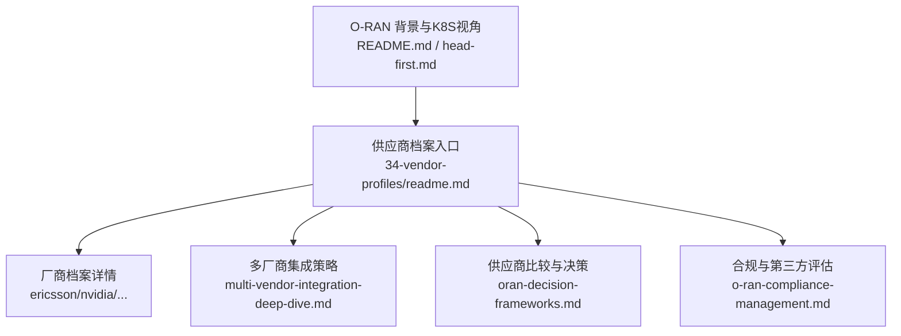
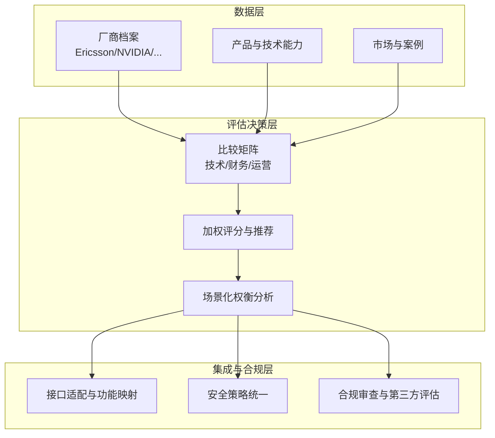
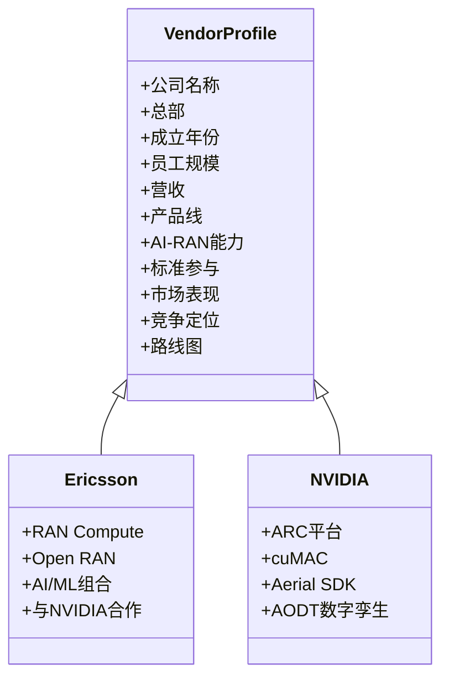
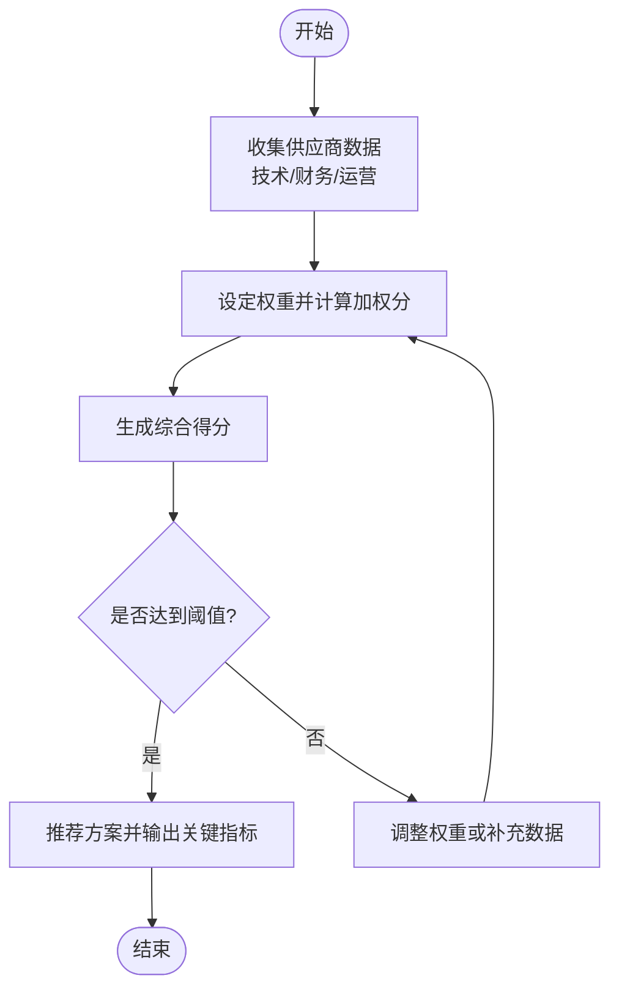
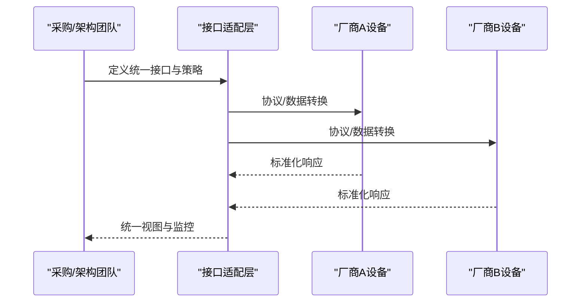
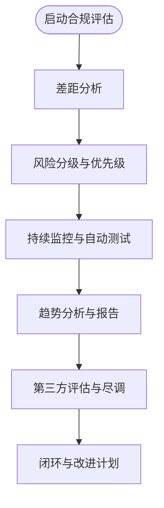
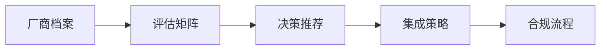
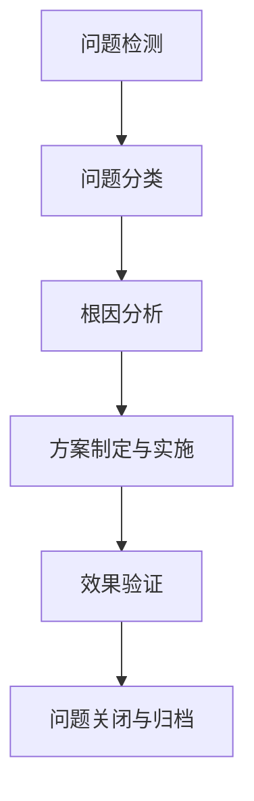

# 供应商档案系统

<cite>
**本文引用的文件**
- [README.md](file://README.md)
- [head-first.md](file://head-first.md)
- [34-vendor-profiles/readme.md](file://34-vendor-profiles/readme.md)
- [34-vendor-profiles/ericsson/readme.md](file://34-vendor-profiles/ericsson/readme.md)
- [34-vendor-profiles/nvidia/readme.md](file://34-vendor-profiles/nvidia/readme.md)
- [09-standards-compliance/multi-vendor-integration/multi-vendor-integration-deep-dive.md](file://09-standards-compliance/multi-vendor-integration/multi-vendor-integration-deep-dive.md)
- [18-cost-benefit-analysis/decision-tools/oran-decision-frameworks.md](file://18-cost-benefit-analysis/decision-tools/oran-decision-frameworks.md)
- [25-legal-regulations/compliance-system/o-ran-compliance-management.md](file://25-legal-regulations/compliance-system/o-ran-compliance-management.md)
</cite>

## 目录
1. [简介](#简介)
2. [项目结构](#项目结构)
3. [核心组件](#核心组件)
4. [架构总览](#架构总览)
5. [详细组件分析](#详细组件分析)
6. [依赖关系分析](#依赖关系分析)
7. [性能与容量考量](#性能与容量考量)
8. [故障排查指南](#故障排查指南)
9. [结论](#结论)
10. [附录](#附录)

## 简介
本“供应商档案系统”基于 O-RAN/AI-RAN 知识库仓库，聚焦于对主要设备商、芯片/平台商、测试测量厂商进行系统化建档与评估，形成可检索、可对比、可决策的供应商知识体系。系统以标准化维度（技术能力、财务成本、运营因素）构建评估矩阵，结合多厂商互操作策略、合规与风险管理，支撑从选型到部署的全生命周期管理。

## 项目结构
围绕供应商档案的核心内容分布在以下目录：
- 34-vendor-profiles：各厂商独立档案（企业概况、产品线、标准参与、市场表现、竞争定位、路线图等）
- 09-standards-compliance：多厂商集成策略、接口适配、互操作性测试方法
- 18-cost-benefit-analysis：供应商比较矩阵与决策工具
- 25-legal-regulations：合规管理与第三方评估流程
- README/head-first：O-RAN 总体背景与 K8S 视角快速入门

图表来源
- [34-vendor-profiles/readme.md:1-71](file://34-vendor-profiles/readme.md#L1-L71)
- [09-standards-compliance/multi-vendor-integration/multi-vendor-integration-deep-dive.md:141-220](file://09-standards-compliance/multi-vendor-integration/multi-vendor-integration-deep-dive.md#L141-L220)
- [18-cost-benefit-analysis/decision-tools/oran-decision-frameworks.md:478-509](file://18-cost-benefit-analysis/decision-tools/oran-decision-frameworks.md#L478-L509)
- [25-legal-regulations/compliance-system/o-ran-compliance-management.md:79-104](file://25-legal-regulations/compliance-system/o-ran-compliance-management.md#L79-L104)
- [README.md:1-50](file://README.md#L1-L50)
- [head-first.md:1-30](file://head-first.md#L1-L30)

章节来源
- [README.md:1-50](file://README.md#L1-L50)
- [head-first.md:1-30](file://head-first.md#L1-L30)
- [34-vendor-profiles/readme.md:1-71](file://34-vendor-profiles/readme.md#L1-L71)

## 核心组件
- 供应商档案库：按厂商分类（设备商、芯片/平台商、测试测量），提供统一的企业信息、产品与技术能力、市场案例、路线图与竞争定位。
- 评估与决策框架：多维评分（技术、财务、运营）、加权打分、场景化建议与权衡分析。
- 多厂商集成策略：接口适配层设计、功能映射与转换、性能调优与安全策略统一。
- 合规与第三方评估：差距分析、风险分级、持续监控与第三方尽调。

章节来源
- [34-vendor-profiles/readme.md:1-71](file://34-vendor-profiles/readme.md#L1-L71)
- [18-cost-benefit-analysis/decision-tools/oran-decision-frameworks.md:478-509](file://18-cost-benefit-analysis/decision-tools/oran-decision-frameworks.md#L478-L509)
- [09-standards-compliance/multi-vendor-integration/multi-vendor-integration-deep-dive.md:141-220](file://09-standards-compliance/multi-vendor-integration/multi-vendor-integration-deep-dive.md#L141-L220)
- [25-legal-regulations/compliance-system/o-ran-compliance-management.md:79-104](file://25-legal-regulations/compliance-system/o-ran-compliance-management.md#L79-L104)

## 架构总览
供应商档案系统由“档案数据层 + 评估决策层 + 集成与合规层”构成，面向不同角色（采购、架构师、运维）提供一致的数据视图与决策支持。

图表来源
- [34-vendor-profiles/ericsson/readme.md:1-226](file://34-vendor-profiles/ericsson/readme.md#L1-L226)
- [34-vendor-profiles/nvidia/readme.md:1-270](file://34-vendor-profiles/nvidia/readme.md#L1-L270)
- [18-cost-benefit-analysis/decision-tools/oran-decision-frameworks.md:478-509](file://18-cost-benefit-analysis/decision-tools/oran-decision-frameworks.md#L478-L509)
- [09-standards-compliance/multi-vendor-integration/multi-vendor-integration-deep-dive.md:141-220](file://09-standards-compliance/multi-vendor-integration/multi-vendor-integration-deep-dive.md#L141-L220)
- [25-legal-regulations/compliance-system/o-ran-compliance-management.md:79-104](file://25-legal-regulations/compliance-system/o-ran-compliance-management.md#L79-L104)

## 详细组件分析

### 供应商档案库
- 分类与覆盖：设备商（如 Ericsson、Nokia、Samsung、Mavenir、Huawei、ZTE）、芯片/平台商（NVIDIA、Qualcomm、Intel）、测试测量（Viavi、Keysight）。
- 档案要素：企业概况、产品线（含 AI-RAN 能力）、标准参与、市场表现（份额与案例）、竞争定位、未来路线图。
- 使用方式：按场景选择（大型运营商、中型运营商、企业专网、新兴市场）与技术路线（云原生 RAN、GPU 加速 RAN、传统演进、绿色部署）。

图表来源
- [34-vendor-profiles/ericsson/readme.md:1-226](file://34-vendor-profiles/ericsson/readme.md#L1-L226)
- [34-vendor-profiles/nvidia/readme.md:1-270](file://34-vendor-profiles/nvidia/readme.md#L1-L270)

章节来源
- [34-vendor-profiles/readme.md:1-71](file://34-vendor-profiles/readme.md#L1-L71)
- [34-vendor-profiles/ericsson/readme.md:1-226](file://34-vendor-profiles/ericsson/readme.md#L1-L226)
- [34-vendor-profiles/nvidia/readme.md:1-270](file://34-vendor-profiles/nvidia/readme.md#L1-L270)

### 评估与决策框架
- 评估维度：技术能力（接口合规、性能基准、可扩展性、集成复杂度）、财务方面（定价模型、TCO、付款条款、支持成本）、运营因素（部署周期、技能要求、支持质量、升级路径）。
- 评分方法：加权评分（技术/财务/运营权重），生成综合得分与推荐方案；支持敏感性说明与权衡分析。
- 输出：最佳方案推荐、关键指标汇总、权衡点提示。

图表来源
- [18-cost-benefit-analysis/decision-tools/oran-decision-frameworks.md:478-509](file://18-cost-benefit-analysis/decision-tools/oran-decision-frameworks.md#L478-L509)

章节来源
- [18-cost-benefit-analysis/decision-tools/oran-decision-frameworks.md:478-509](file://18-cost-benefit-analysis/decision-tools/oran-decision-frameworks.md#L478-L509)

### 多厂商集成策略
- 接口适配层：协议适配、数据适配、行为适配、错误处理适配、性能优化。
- 功能映射与转换：直接映射、间接映射、复合映射、条件映射、动态映射；数据/协议/接口/行为/性能的转换方法。
- 性能调优：瓶颈识别、资源优化、配置优化、算法优化、架构优化；实时监控、历史分析、趋势分析、告警与报告。
- 安全策略统一：跨厂商的安全策略定义、实施、执行、监控与更新。

图表来源
- [09-standards-compliance/multi-vendor-integration/multi-vendor-integration-deep-dive.md:141-220](file://09-standards-compliance/multi-vendor-integration/multi-vendor-integration-deep-dive.md#L141-L220)

章节来源
- [09-standards-compliance/multi-vendor-integration/multi-vendor-integration-deep-dive.md:141-220](file://09-standards-compliance/multi-vendor-integration/multi-vendor-integration-deep-dive.md#L141-L220)

### 合规与第三方评估
- 合规审查与评估：现状评估、监管需求映射、成熟度评分、改进机会识别。
- 风险评估：合规风险分类、影响与概率分析、缓解优先级、资源分配优化。
- 持续监控：连续合规检查、自动化控制测试、异常上报、趋势分析与报告。
- 第三方评估：供应商合规评估、供应链风险评估、合作伙伴尽职调查、合同合规验证。

图表来源
- [25-legal-regulations/compliance-system/o-ran-compliance-management.md:79-104](file://25-legal-regulations/compliance-system/o-ran-compliance-management.md#L79-L104)

章节来源
- [25-legal-regulations/compliance-system/o-ran-compliance-management.md:79-104](file://25-legal-regulations/compliance-system/o-ran-compliance-management.md#L79-L104)

## 依赖关系分析
- 档案数据依赖：厂商档案为评估与决策的基础输入。
- 评估框架依赖：评估矩阵与决策工具依赖统一的维度与权重定义。
- 集成策略依赖：接口适配与功能映射需遵循 O-RAN 标准与多厂商差异。
- 合规依赖：合规流程贯穿供应商准入、集成与运维全生命周期。

图表来源
- [34-vendor-profiles/readme.md:1-71](file://34-vendor-profiles/readme.md#L1-L71)
- [18-cost-benefit-analysis/decision-tools/oran-decision-frameworks.md:478-509](file://18-cost-benefit-analysis/decision-tools/oran-decision-frameworks.md#L478-L509)
- [09-standards-compliance/multi-vendor-integration/multi-vendor-integration-deep-dive.md:141-220](file://09-standards-compliance/multi-vendor-integration/multi-vendor-integration-deep-dive.md#L141-L220)
- [25-legal-regulations/compliance-system/o-ran-compliance-management.md:79-104](file://25-legal-regulations/compliance-system/o-ran-compliance-management.md#L79-L104)

章节来源
- [34-vendor-profiles/readme.md:1-71](file://34-vendor-profiles/readme.md#L1-L71)
- [18-cost-benefit-analysis/decision-tools/oran-decision-frameworks.md:478-509](file://18-cost-benefit-analysis/decision-tools/oran-decision-frameworks.md#L478-L509)
- [09-standards-compliance/multi-vendor-integration/multi-vendor-integration-deep-dive.md:141-220](file://09-standards-compliance/multi-vendor-integration/multi-vendor-integration-deep-dive.md#L141-L220)
- [25-legal-regulations/compliance-system/o-ran-compliance-management.md:79-104](file://25-legal-regulations/compliance-system/o-ran-compliance-management.md#L79-L104)

## 性能与容量考量
- 供应商能力对比：关注吞吐量、延迟、可扩展性、可靠性与效率等性能维度。
- 集成性能调优：通过瓶颈识别、资源配置、参数优化、算法与架构优化提升整体性能。
- 容量规划：结合部署规模与业务峰值，评估供应商的最大站点与容量支持。

章节来源
- [09-standards-compliance/multi-vendor-integration/multi-vendor-integration-deep-dive.md:47-71](file://09-standards-compliance/multi-vendor-integration/multi-vendor-integration-deep-dive.md#L47-L71)
- [09-standards-compliance/multi-vendor-integration/multi-vendor-integration-deep-dive.md:195-220](file://09-standards-compliance/multi-vendor-integration/multi-vendor-integration-deep-dive.md#L195-L220)
- [18-cost-benefit-analysis/decision-tools/oran-decision-frameworks.md:485-489](file://18-cost-benefit-analysis/decision-tools/oran-decision-frameworks.md#L485-L489)

## 故障排查指南
- 问题识别：自动化检测、人工发现、监控告警、用户反馈、主动分析。
- 问题分类：严重、主要、次要、增强建议、观察项。
- 解决流程：记录问题、根因分析、制定方案、实施验证、关闭记录。
- 合规关联：在供应商变更或集成阶段，结合合规审查与第三方评估降低风险。

图表来源
- [09-standards-compliance/multi-vendor-integration/multi-vendor-integration-deep-dive.md:513-538](file://09-standards-compliance/multi-vendor-integration/multi-vendor-integration-deep-dive.md#L513-L538)

章节来源
- [09-standards-compliance/multi-vendor-integration/multi-vendor-integration-deep-dive.md:513-538](file://09-standards-compliance/multi-vendor-integration/multi-vendor-integration-deep-dive.md#L513-L538)

## 结论
供应商档案系统以结构化档案为基础，结合多维度评估与决策工具，辅以多厂商集成策略与合规流程，形成从选型到落地的闭环能力。通过标准化接口适配与统一安全策略，降低多厂商集成的复杂性与风险；通过持续监控与第三方评估，保障长期稳定运行与合规达标。

## 附录
- 快速入门：O-RAN 背景与 K8S 视角有助于理解基站解耦、RIC 智能化与 O-Cloud 部署要点。
- 学习路径：从架构基础到接口标准、部署实现、RIC 开发、标准合规与应用场景逐步深入。

章节来源
- [head-first.md:1-30](file://head-first.md#L1-L30)
- [README.md:310-367](file://README.md#L310-L367)