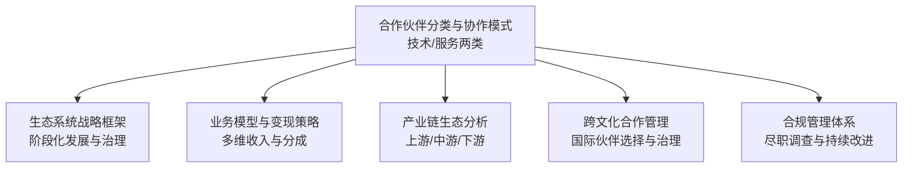
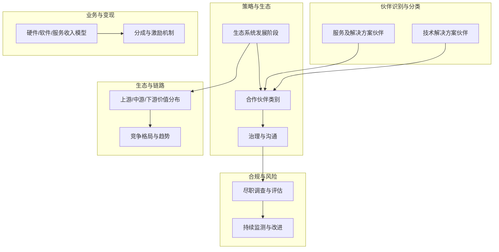
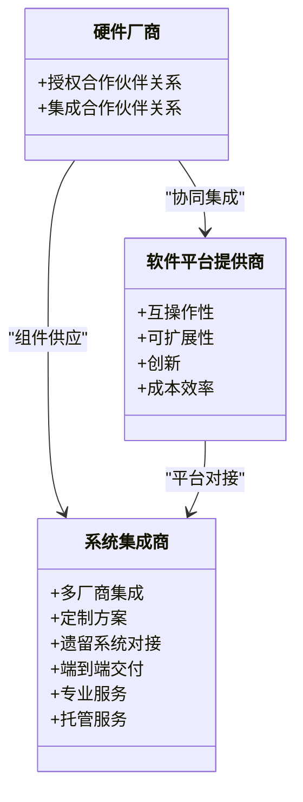
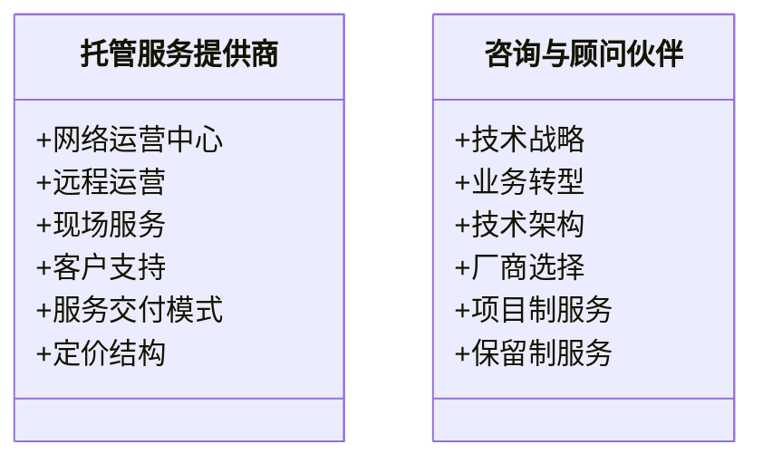
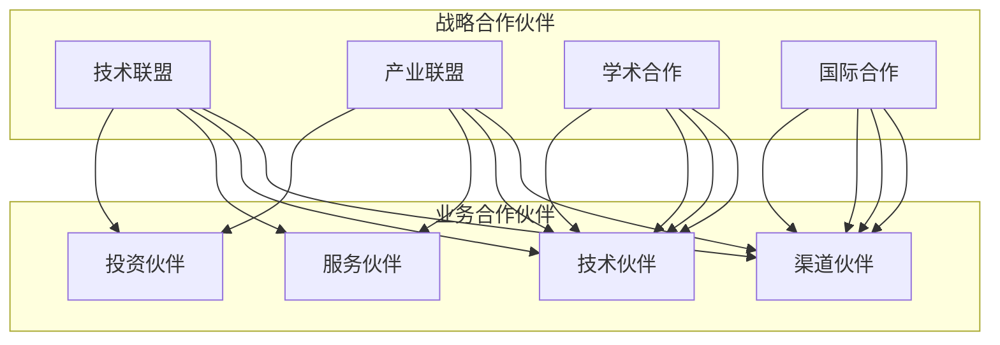
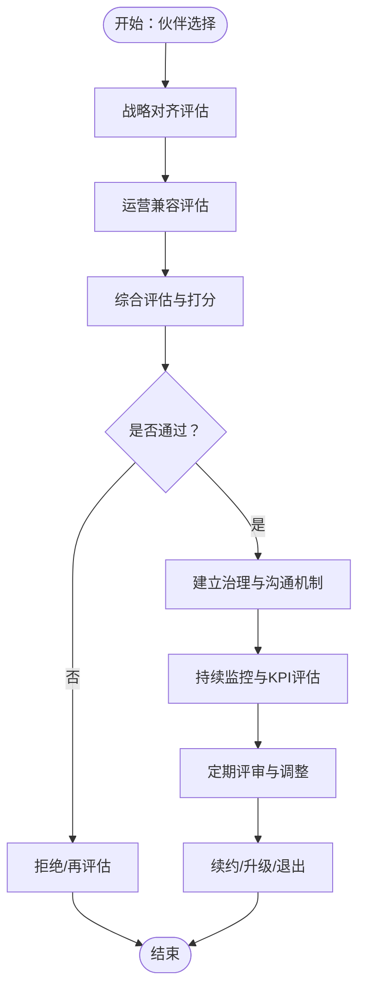
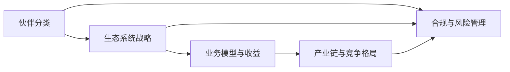

# 合作伙伴分类

<cite>
**本文引用的文件**
- [O-RAN 合作伙伴类型与协作模式](file://20-ecosystem-partnership/partner-types/o-ran-partner-classification.md)
- [O-RAN 合作伙伴类型与协作模式（中文）](file://20-ecosystem-partnership/partner-types/o-ran-partner-classification-zh.md)
- [O-RAN 生态系统战略框架](file://20-ecosystem-partnership/ecosystem-strategy/o-ran-ecosystem-strategy.md)
- [O-RAN 业务模型与变现策略](file://20-ecosystem-partnership/business-models/o-ran-business-models.md)
- [O-RAN 产业链生态分析](file://20-ecosystem-partnership/industry-chain/ecosystem-analysis.md)
- [O-RAN 跨文化合作管理](file://23-international-deployment/cross-cultural-management/o-ran-cross-cultural-management.md)
- [O-RAN 合规管理体系](file://25-legal-regulations/compliance-system/o-ran-compliance-management.md)
</cite>

## 目录
1. [引言](#引言)
2. [项目结构](#项目结构)
3. [核心组件](#核心组件)
4. [架构总览](#架构总览)
5. [详细组件分析](#详细组件分析)
6. [依赖分析](#依赖分析)
7. [性能考虑](#性能考虑)
8. [故障排查指南](#故障排查指南)
9. [结论](#结论)
10. [附录](#附录)

## 引言
本文件围绕 O-RAN 生态中的合作伙伴分类与管理体系进行系统化梳理，聚焦两类合作伙伴群组：技术解决方案合作伙伴与服务及解决方案合作伙伴；并进一步细分为战略型（技术联盟、产业联盟、学术合作、国际合作）与业务型（渠道伙伴、技术伙伴、服务伙伴、投资伙伴）。通过对角色定位、协作模式、价值主张、对齐标准、绩效测量与关系治理的深入分析，构建可执行的合作伙伴选择与评估标准体系，明确资质审核、能力评估、风险控制与绩效管理的关键抓手，并提出合作伙伴关系生命周期管理与维护策略，助力建立长期稳定的合作关系。

## 项目结构
本主题内容主要分布在“生态系统与合作伙伴”“国际部署与跨文化管理”“法律与合规”等模块，形成“分类—策略—业务—生态—治理—合规”的完整知识谱系。

图表来源
- [O-RAN 合作伙伴类型与协作模式](file://20-ecosystem-partnership/partner-types/o-ran-partner-classification.md#L1-L218)
- [O-RAN 生态系统战略框架](file://20-ecosystem-partnership/ecosystem-strategy/o-ran-ecosystem-strategy.md#L1-L189)
- [O-RAN 业务模型与变现策略](file://20-ecosystem-partnership/business-models/o-ran-business-models.md#L1-L299)
- [O-RAN 产业链生态分析](file://20-ecosystem-partnership/industry-chain/ecosystem-analysis.md#L1-L127)
- [O-RAN 跨文化合作管理](file://23-international-deployment/cross-cultural-management/o-ran-cross-cultural-management.md#L255-L316)
- [O-RAN 合规管理体系](file://25-legal-regulations/compliance-system/o-ran-compliance-management.md#L79-L260)

章节来源
- [O-RAN 合作伙伴类型与协作模式](file://20-ecosystem-partnership/partner-types/o-ran-partner-classification.md#L1-L218)
- [O-RAN 生态系统战略框架](file://20-ecosystem-partnership/ecosystem-strategy/o-ran-ecosystem-strategy.md#L1-L189)
- [O-RAN 业务模型与变现策略](file://20-ecosystem-partnership/business-models/o-ran-business-models.md#L1-L299)
- [O-RAN 产业链生态分析](file://20-ecosystem-partnership/industry-chain/ecosystem-analysis.md#L1-L127)
- [O-RAN 跨文化合作管理](file://23-international-deployment/cross-cultural-management/o-ran-cross-cultural-management.md#L255-L316)
- [O-RAN 合规管理体系](file://25-legal-regulations/compliance-system/o-ran-compliance-management.md#L79-L260)

## 核心组件
- 合作伙伴分类与协作模式：明确技术解决方案伙伴（硬件厂商、软件平台、系统集成商）与服务及解决方案伙伴（托管服务、咨询顾问）的角色边界、协作模式与价值主张。
- 生态系统战略框架：给出分阶段的生态建设路径、合作伙伴类别与治理模型，支撑长期可持续发展。
- 业务模型与变现策略：覆盖硬件、软件、服务的多维收入模型与分成机制，指导收益分配与定价策略。
- 产业链生态分析：刻画上游芯片、中游平台与集成、下游应用与服务的价值分布与竞争格局，辅助伙伴选择与定位。
- 跨文化合作管理：提供国际伙伴选择、治理结构与沟通框架，强化跨国合作的可执行性。
- 合规管理体系：提供尽职调查、风险评估、持续监测与改进的闭环流程，保障合作伙伴管理的稳健运行。

章节来源
- [O-RAN 合作伙伴类型与协作模式](file://20-ecosystem-partnership/partner-types/o-ran-partner-classification.md#L6-L218)
- [O-RAN 生态系统战略框架](file://20-ecosystem-partnership/ecosystem-strategy/o-ran-ecosystem-strategy.md#L50-L189)
- [O-RAN 业务模型与变现策略](file://20-ecosystem-partnership/business-models/o-ran-business-models.md#L54-L299)
- [O-RAN 产业链生态分析](file://20-ecosystem-partnership/industry-chain/ecosystem-analysis.md#L34-L127)
- [O-RAN 跨文化合作管理](file://23-international-deployment/cross-cultural-management/o-ran-cross-cultural-management.md#L255-L316)
- [O-RAN 合规管理体系](file://25-legal-regulations/compliance-system/o-ran-compliance-management.md#L79-L260)

## 架构总览
下图展示 O-RAN 合作伙伴管理体系的总体架构：以“分类—策略—业务—生态—治理—合规”为主线，形成从伙伴识别、评估、签约、执行、监控到退出的全生命周期闭环。

图表来源
- [O-RAN 合作伙伴类型与协作模式](file://20-ecosystem-partnership/partner-types/o-ran-partner-classification.md#L6-L218)
- [O-RAN 生态系统战略框架](file://20-ecosystem-partnership/ecosystem-strategy/o-ran-ecosystem-strategy.md#L6-L189)
- [O-RAN 业务模型与变现策略](file://20-ecosystem-partnership/business-models/o-ran-business-models.md#L54-L299)
- [O-RAN 产业链生态分析](file://20-ecosystem-partnership/industry-chain/ecosystem-analysis.md#L34-L127)
- [O-RAN 合规管理体系](file://25-legal-regulations/compliance-system/o-ran-compliance-management.md#L79-L260)

## 详细组件分析

### 一、技术解决方案合作伙伴
- 硬件厂商：标准化硬件组件供应商，强调参考设计授权、组件供应与联合开发等授权合作，以及预集成、认证与支持维护等集成合作。
- 软件平台提供商：RIC 平台、网络管理、自动化编排与分析监控等，强调互操作性、可扩展性、创新与成本效率。
- 系统集成商：多厂商集成、定制化方案、遗留系统对接与端到端交付，提供专业服务与托管服务。

图表来源
- [O-RAN 合作伙伴类型与协作模式](file://20-ecosystem-partnership/partner-types/o-ran-partner-classification.md#L8-L70)
- [O-RAN 合作伙伴类型与协作模式（中文）](file://20-ecosystem-partnership/partner-types/o-ran-partner-classification-zh.md#L8-L70)

章节来源
- [O-RAN 合作伙伴类型与协作模式](file://20-ecosystem-partnership/partner-types/o-ran-partner-classification.md#L6-L70)
- [O-RAN 合作伙伴类型与协作模式（中文）](file://20-ecosystem-partnership/partner-types/o-ran-partner-classification-zh.md#L6-L70)

### 二、服务及解决方案合作伙伴
- 托管服务提供商：网络运营中心、远程运营、现场服务与客户支持，涵盖完全托管、共管、远程监控与故障修复等交付模式，以及按站点、按使用量、按性能与混合定价。
- 咨询与顾问伙伴：技术战略、业务转型、技术架构与厂商选择等专业化服务，提供项目制与保留制两种参与模式。

图表来源
- [O-RAN 合作伙伴类型与协作模式](file://20-ecosystem-partnership/partner-types/o-ran-partner-classification.md#L74-L122)
- [O-RAN 合作伙伴类型与协作模式（中文）](file://20-ecosystem-partnership/partner-types/o-ran-partner-classification-zh.md#L74-L122)

章节来源
- [O-RAN 合作伙伴类型与协作模式](file://20-ecosystem-partnership/partner-types/o-ran-partner-classification.md#L72-L122)
- [O-RAN 合作伙伴类型与协作模式（中文）](file://20-ecosystem-partnership/partner-types/o-ran-partner-classification-zh.md#L72-L122)

### 三、战略合作伙伴与业务合作伙伴
- 战略合作伙伴：技术联盟（联合研发、技术授权、参考实现、标准协作）、产业联盟（多厂商集成、行业组织参与）、学术合作（联合研究、资助、学生实习、教师交流、孵化、技术转移、会议与出版合作）、国际合作（跨文化评估、治理与沟通）。
- 业务合作伙伴：渠道伙伴（系统集成商、分销商、托管服务、咨询）、技术伙伴（互补解决方案）、服务伙伴（集成与运维）、投资伙伴（生态赋能与标准贡献）。

图表来源
- [O-RAN 生态系统战略框架](file://20-ecosystem-partnership/ecosystem-strategy/o-ran-ecosystem-strategy.md#L50-L92)
- [O-RAN 跨文化合作管理](file://23-international-deployment/cross-cultural-management/o-ran-cross-cultural-management.md#L255-L316)

章节来源
- [O-RAN 生态系统战略框架](file://20-ecosystem-partnership/ecosystem-strategy/o-ran-ecosystem-strategy.md#L50-L92)
- [O-RAN 跨文化合作管理](file://23-international-deployment/cross-cultural-management/o-ran-cross-cultural-management.md#L255-L316)

### 四、合作伙伴选择与评估标准体系
- 战略对齐：愿景兼容、市场定位互补、技术路线图一致、商业价值观契合。
- 运营兼容：流程集成、沟通协议、质量标准、资源投入。
- 绩效测量：财务（收入、成本节约、投资回报、市场份额）、运营（交付、客户满意度、创新产出、关系健康）、战略（市场拓展、能力增强、品牌关联、生态增长）。
- 关系治理：指导委员会、工作组、定期评审、升级程序；高管简报、技术评审、项目状态、临时沟通。

图表来源
- [O-RAN 合作伙伴类型与协作模式](file://20-ecosystem-partnership/partner-types/o-ran-partner-classification.md#L170-L217)
- [O-RAN 合作伙伴类型与协作模式（中文）](file://20-ecosystem-partnership/partner-types/o-ran-partner-classification-zh.md#L170-L217)

章节来源
- [O-RAN 合作伙伴类型与协作模式](file://20-ecosystem-partnership/partner-types/o-ran-partner-classification.md#L170-L217)
- [O-RAN 合作伙伴类型与协作模式（中文）](file://20-ecosystem-partnership/partner-types/o-ran-partner-classification-zh.md#L170-L217)

### 五、合作伙伴关系生命周期管理与维护策略
- 生命周期阶段：引入（尽职调查、合同签署）、启动（治理落地、沟通机制）、执行（交付监控、变更管理）、评估（KPI回顾、关系健康度）、优化（能力提升、生态协同）、退出（资产移交、知识沉淀、关系复盘）。
- 维护策略：建立清晰的治理结构与沟通节奏，设定可量化KPI，定期进行关系健康度评估，推动跨部门协作与知识共享，确保合规与风险可控。

章节来源
- [O-RAN 合作伙伴类型与协作模式](file://20-ecosystem-partnership/partner-types/o-ran-partner-classification.md#L205-L217)
- [O-RAN 合规管理体系](file://25-legal-regulations/compliance-system/o-ran-compliance-management.md#L79-L260)

### 六、国际合作伙伴管理要点
- 伙伴选择：技术栈对齐、集成能力、质量标准、创新能力、文化适配、沟通风格、决策流程、关系构建方式、资源可用性、时间线与里程碑、法律合规、财务可行性。
- 治理结构：双方等额代表、委员会成员文化多样性、轮值主席、明确决策权限；工作组、跨职能团队、定期会议与进度跟踪；多渠道沟通、定期状态更新、升级流程、知识共享与文档标准。
- 成功度量：集成成功率、质量指标达成、按时交付、资源利用效率、信任水平、沟通有效性、冲突解决满意度、文化融合进度、收入与成本节约、市场份额与客户满意度、创新产出与知识产权、长期战略价值创造。

章节来源
- [O-RAN 跨文化合作管理](file://23-international-deployment/cross-cultural-management/o-ran-cross-cultural-management.md#L255-L316)

### 七、业务模型与收益分配
- 硬件：白盒基础设施销售（成本加价、价值导向定价、结果导向定价）；设备即服务（订阅、维护包含、弹性扩容）。
- 软件：RIC 平台许可（按小区、功能分级、用量计费）；xApps/rApps（直销、订阅、免费增值）。
- 服务：专业服务（咨询与集成、迁移、运维）；培训与支持（认证、定制培训、工坊、多级支持、SLA保障、预防性维护）。
- 新兴变现：网络切片即服务（固定带宽、动态资源池、性能计费、结果计价）；边缘计算（MEC 计算/存储/网络函数/API 访问）；数据洞察（性能分析、商业智能）。
- 生态分成：硬件（30-40%）、软件（25-35%）、服务（20-30%）、运营商（10-15%），API 市场分成、数据授权与伙伴激励。

章节来源
- [O-RAN 业务模型与变现策略](file://20-ecosystem-partnership/business-models/o-ran-business-models.md#L54-L299)

### 八、产业链与竞争格局
- 价值分布：芯片设计（25-30%）、硬件制造（20-25%）、软件平台（15-20%）、集成服务（15-20%）、运营服务（10-15%）。
- 竞争者类型：传统设备商转型、新兴创新企业、云服务提供商。
- 生态模式：标准统一、互操作性测试、开源社区、产业联盟；NaaS、SlaaS、PaaS、AaaS 等商业模式创新。
- 趋势预测：短期标准化加速、试点扩大；中期商用部署、垂直应用、技术融合、竞争加剧；长期6G演进、生态成熟、价值重构、全球普及。
- 投资机会：软件定义RAN、边缘智能、安全防护、自动化运维；风险因素：技术成熟度、市场接受度、回报周期、监管政策。

章节来源
- [O-RAN 产业链生态分析](file://20-ecosystem-partnership/industry-chain/ecosystem-analysis.md#L34-L127)

## 依赖分析
- 分类依赖策略：伙伴分类决定合作模式与治理层级，进而影响业务模型与收益分配。
- 策略驱动生态：生态系统阶段化发展与治理结构决定伙伴准入门槛与资源投入节奏。
- 业务反哺生态：多维收入模型与分成机制促进生态繁荣，推动上游/中游/下游协同。
- 合规保障执行：尽职调查与持续监测为伙伴选择与关系维护提供风控保障。

图表来源
- [O-RAN 合作伙伴类型与协作模式](file://20-ecosystem-partnership/partner-types/o-ran-partner-classification.md#L6-L218)
- [O-RAN 生态系统战略框架](file://20-ecosystem-partnership/ecosystem-strategy/o-ran-ecosystem-strategy.md#L6-L189)
- [O-RAN 业务模型与变现策略](file://20-ecosystem-partnership/business-models/o-ran-business-models.md#L54-L299)
- [O-RAN 产业链生态分析](file://20-ecosystem-partnership/industry-chain/ecosystem-analysis.md#L34-L127)
- [O-RAN 合规管理体系](file://25-legal-regulations/compliance-system/o-ran-compliance-management.md#L79-L260)

## 性能考虑
- 选择阶段：通过“技术兼容—文化适配—战略对齐—运营可行”四维评估，缩短决策周期，提高匹配度。
- 执行阶段：以KPI为抓手（财务/运营/战略），建立周/月/季多层次监控与评审机制，确保交付质量与时效。
- 生态协同：依据产业链价值分布与竞争格局，优化伙伴组合与收益分配，提升整体竞争力。
- 风险控制：将合规审查与持续监测嵌入全生命周期，降低技术碎片化、竞争响应、市场延迟与监管变化风险。

## 故障排查指南
- 伙伴不达标
  - 现象：交付延期、质量不达标、沟通不畅、关系恶化。
  - 处置：回溯选择评估维度，补充尽职调查与试运行；调整治理结构与沟通节奏；必要时启动升级程序与重新谈判。
- 收益不达预期
  - 现象：收入未达目标、成本超支、ROI不佳。
  - 处置：复盘业务模型与定价策略，优化分成机制与激励结构；加强市场推广与客户成功管理。
- 国际合作摩擦
  - 现象：文化冲突、流程差异、沟通障碍、合规风险。
  - 处置：强化跨文化评估与培训，完善治理与沟通框架，引入第三方评估与仲裁机制。

章节来源
- [O-RAN 合作伙伴类型与协作模式](file://20-ecosystem-partnership/partner-types/o-ran-partner-classification.md#L170-L217)
- [O-RAN 跨文化合作管理](file://23-international-deployment/cross-cultural-management/o-ran-cross-cultural-management.md#L255-L316)
- [O-RAN 合规管理体系](file://25-legal-regulations/compliance-system/o-ran-compliance-management.md#L79-L260)

## 结论
通过“分类—策略—业务—生态—治理—合规”的系统化方法，O-RAN 合作伙伴管理可实现从伙伴识别到关系维护的全生命周期闭环。以对齐标准与绩效测量为核心抓手，辅以国际化的治理与合规保障，能够在开放标准与多厂商协作的环境下，构建稳定、高效、可持续的合作伙伴生态。

## 附录
- 关键术语
  - 参考实现：展示多厂商集成的标杆方案。
  - 设备即服务：硬件订阅与维护一体化服务。
  - 网络切片即服务：面向垂直行业的定制化网络服务。
  - MEC：多接入边缘计算，提供边缘智能与应用开发能力。
- 建议流程
  - 伙伴选择：四维评估—合同签署—治理落地—KPI设定。
  - 关系维护：定期评审—健康度评估—优化升级—退出复盘。
  - 国际合作：文化评估—治理结构—沟通机制—风险管控。