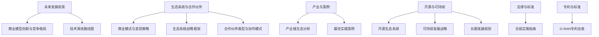
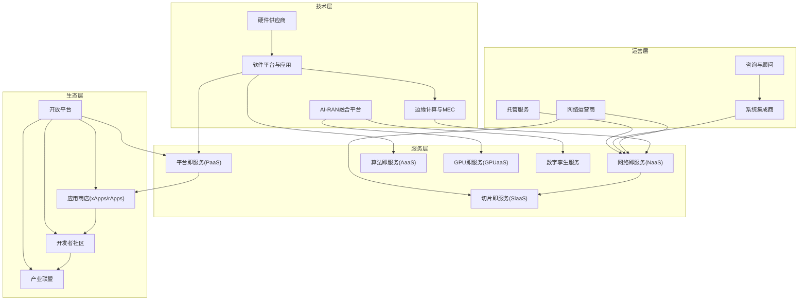
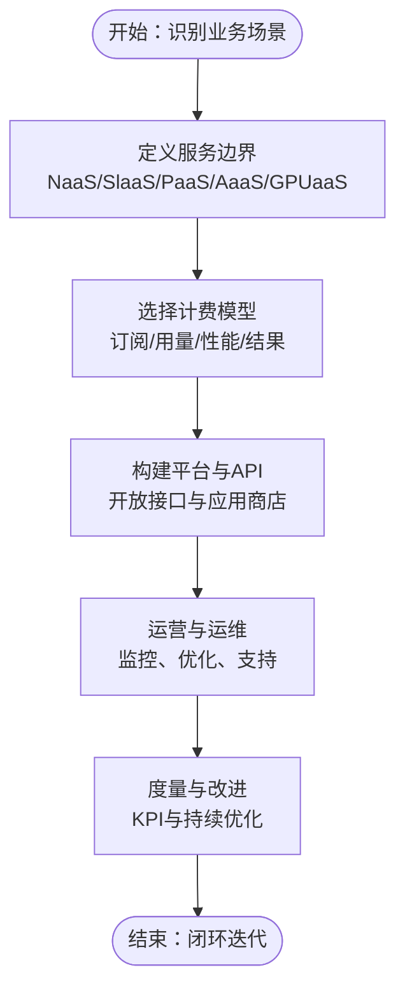
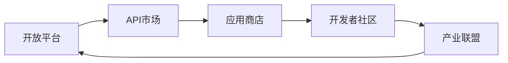
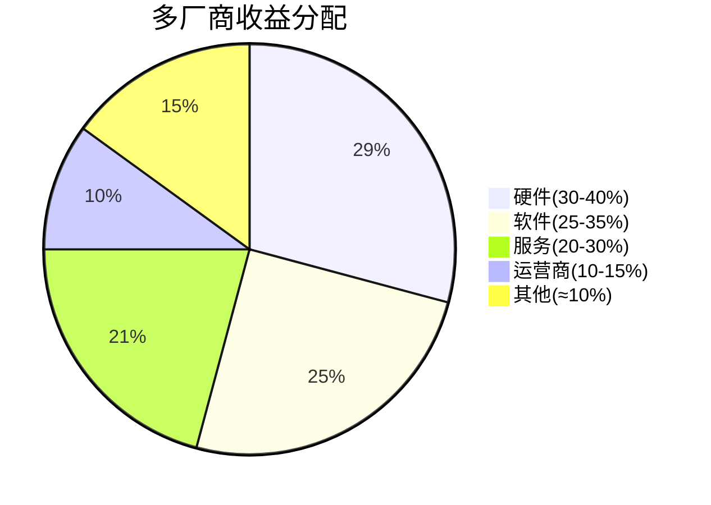
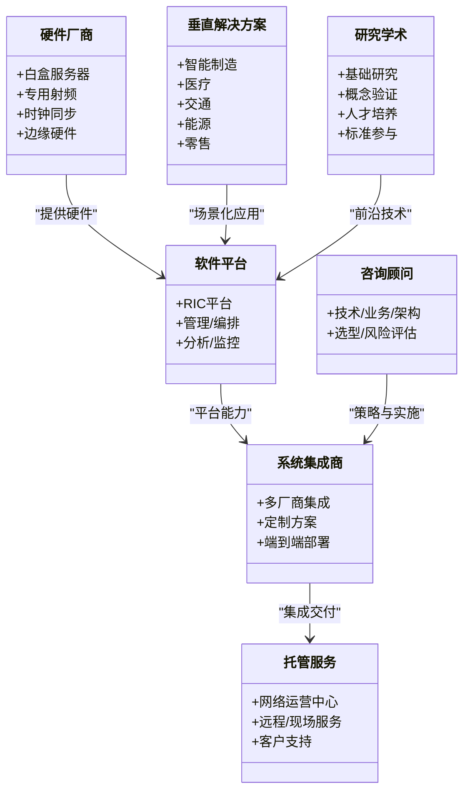
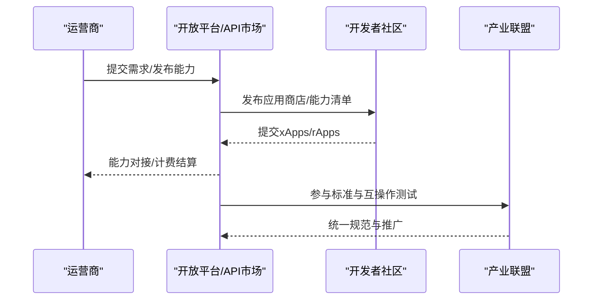
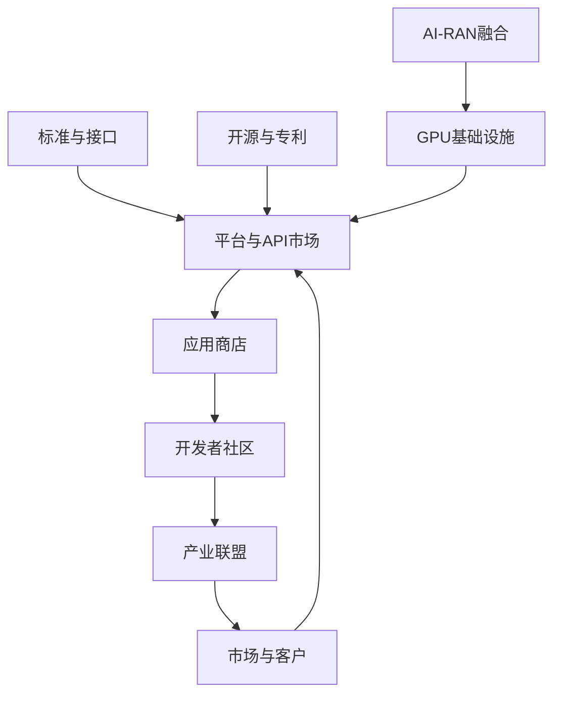

# 商业模式创新

<cite>
**本文引用的文件**
- [O-RAN 商业模型创新与竞争格局分析](file://15-future-development/market-prospects/business-model-innovation.md)
- [O-RAN 商业模式与变现策略](file://20-ecosystem-partnership/business-models/o-ran-business-models.md)
- [O-RAN 生态系统战略框架](file://20-ecosystem-partnership/ecosystem-strategy/o-ran-ecosystem-strategy.md)
- [O-RAN 生态系统战略框架（中文）](file://20-ecosystem-partnership/ecosystem-strategy/o-ran-ecosystem-strategy-zh.md)
- [O-RAN 产业链生态分析](file://20-ecosystem-partnership/industry-chain/ecosystem-analysis.md)
- [O-RAN 合作伙伴类型与协作模式](file://20-ecosystem-partnership/partner-types/o-ran-partner-classification.md)
- [O-RAN 合作伙伴类型与协作模式（中文）](file://20-ecosystem-partnership/partner-types/o-ran-partner-classification-zh.md)
- [O-RAN 最佳实践案例](file://21-case-studies/best-practices/o-ran-best-practice-cases.md)
- [O-RAN 开源生态系统](file://17-open-source-ecosystem/readme.md)
- [O-RAN 可持续发展战略](file://24-sustainable-development/readme.md)
- [O-RAN 长期发展规划](file://24-sustainable-development/long-term-planning/o-ran-long-term-strategy.md)
- [O-RAN 企业治理](file://24-sustainable-development/corporate-governance/o-ran-corporate-governance.md)
- [O-RAN 合规实施指南](file://25-legal-regulations/implementation-guides/o-ran-compliance-implementation.md)
- [O-RAN 专利总表（节选）](file://comprehensive-oran-patent-table.md)
</cite>

## 更新摘要
**变更内容**
- 新增AI-RAN融合对商业模式的影响分析
- 更新市场规模预测和投资机会评估
- 强化服务化转型模式的深度分析
- 增加运营商采购策略演变分析
- 完善竞争格局和利益相关方战略建议

## 目录
1. [引言](#引言)
2. [项目结构](#项目结构)
3. [核心组件](#核心组件)
4. [架构总览](#架构总览)
5. [详细组件分析](#详细组件分析)
6. [依赖分析](#依赖分析)
7. [性能考虑](#性能考虑)
8. [故障排查指南](#故障排查指南)
9. [结论](#结论)
10. [附录](#附录)

## 引言
本文件面向O-RAN产业的商业模式创新，系统解析网络即服务（NaaS）、切片即服务（SlaaS）、平台即服务（PaaS）、算法即服务（AaaS）等服务化转型模式，梳理开放平台、应用商店、开发者社区与产业联盟的生态构建方式，阐释技术开放、市场开放、治理开放的"三重开放"原则，并给出可持续发展的商业模式设计指导，帮助各参与方建立互利共赢的长期合作关系。随着AI-RAN融合的加速推进，O-RAN市场进入第二轮重构期，为商业模式创新带来了新的机遇和挑战。

## 项目结构
围绕O-RAN商业模式与生态建设，相关知识库主要分布在以下主题目录：
- 未来发展前景：包含市场展望、技术趋势和创新商业模式
- 生态系统与合作伙伴：包含商业模式、生态战略、合作伙伴分类与分析
- 产业与案例：包含产业链全景、最佳实践案例
- 开源与可持续：包含开源生态、长期规划、企业治理与合规
- 法律与标准：包含合规实施与专利信息

**图表来源**
- [O-RAN 商业模型创新与竞争格局分析:1-182](file://15-future-development/market-prospects/business-model-innovation.md#L1-L182)
- [O-RAN 商业模式与变现策略:1-299](file://20-ecosystem-partnership/business-models/o-ran-business-models.md#L1-L299)
- [O-RAN 生态系统战略框架:1-189](file://20-ecosystem-partnership/ecosystem-strategy/o-ran-ecosystem-strategy.md#L1-L189)

**章节来源**
- [O-RAN 商业模型创新与竞争格局分析:1-182](file://15-future-development/market-prospects/business-model-innovation.md#L1-L182)
- [O-RAN 商业模式与变现策略:1-299](file://20-ecosystem-partnership/business-models/o-ran-business-models.md#L1-L299)
- [O-RAN 生态系统战略框架:1-189](file://20-ecosystem-partnership/ecosystem-strategy/o-ran-ecosystem-strategy.md#L1-L189)

## 核心组件
- **服务化转型模式**
  - 网络即服务（NaaS）：按需订阅、弹性计费、端到端网络服务
  - 切片即服务（SlaaS）：定制化网络切片、动态资源池、性能/结果导向计费
  - 平台即服务（PaaS）：RIC平台能力开放、xApps/rApps分发、API市场
  - 算法即服务（AaaS）：AI/ML算法封装与输出、按能力/效果计费
- **AI-RAN融合新模式**
  - GPU基础设施共享：AI推理与RAN基带共享算力
  - GPUaaS（GPU as a Service）：电信站点GPU分时租赁
  - AI优化即服务：智能节能、负载均衡按效果收费
  - 数字孪生订阅：网络数字孪生平台按站点规模订阅
- **生态构建方式**
  - 开放平台：标准接口、代码开源、能力共享
  - 应用商店：xApps/rApps分发平台、开发者生态
  - 开发者社区：工具链、培训认证、竞赛与展示
  - 产业联盟：标准统一、互操作性测试、规模化效应
- **价值创造与分配**
  - 多厂商收益分配：硬件30-40%、软件25-35%、服务20-30%、运营商10-15%
  - API市场分成：交易手续费、平台订阅、数据授权、伙伴激励
- **三重开放原则**
  - 技术开放：标准公开、接口开放、代码开源
  - 市场开放：公平竞争、多方参与、共享收益
  - 治理开放：民主决策、透明运作、共同治理

**章节来源**
- [O-RAN 商业模型创新与竞争格局分析:35-66](file://15-future-development/market-prospects/business-model-innovation.md#L35-L66)
- [O-RAN 商业模式与变现策略:140-215](file://20-ecosystem-partnership/business-models/o-ran-business-models.md#L140-L215)
- [O-RAN 生态系统战略框架:50-114](file://20-ecosystem-partnership/ecosystem-strategy/o-ran-ecosystem-strategy.md#L50-L114)

## 架构总览
下图展示O-RAN商业模式的生态协同与价值流，特别突出了AI-RAN融合带来的新价值维度：

**图表来源**
- [O-RAN 商业模型创新与竞争格局分析:60-66](file://15-future-development/market-prospects/business-model-innovation.md#L60-L66)
- [O-RAN 商业模式与变现策略:140-215](file://20-ecosystem-partnership/business-models/o-ran-business-models.md#L140-L215)
- [O-RAN 生态系统战略框架:50-114](file://20-ecosystem-partnership/ecosystem-strategy/o-ran-ecosystem-strategy.md#L50-L114)

## 详细组件分析

### 服务化转型模式
- **网络即服务（NaaS）**
  - 订阅制：按容量/使用量/性能计费
  - 弹性扩容：随需调整带宽与资源
  - 运维托管：24/7监控与优化
- **切片即服务（SlaaS）**
  - 垂直行业包：制造、医疗、交通、智慧城市
  - 动态资源池：共享容量与优先级
  - 结果导向：按QoS或业务结果付费
- **平台即服务（PaaS）**
  - RIC平台：近实时与非实时RIC能力
  - xApps/rApps：应用商店与分发
  - API市场：交易手续费、订阅与数据授权
- **算法即服务（AaaS）**
  - AI/ML封装：网络优化、预测维护、容量规划
  - 能力输出：按调用次数/效果计费
- **AI-RAN融合服务**
  - GPU基础设施共享：空闲算力变现
  - GPUaaS：白天跑RAN、夜间跑AI训练/推理出租
  - AI优化即服务：智能节能、负载均衡按效果收费
  - 数字孪生订阅：网络数字孪生平台按站点规模订阅

**图表来源**
- [O-RAN 商业模型创新与竞争格局分析:60-66](file://15-future-development/market-prospects/business-model-innovation.md#L60-L66)
- [O-RAN 商业模式与变现策略:140-215](file://20-ecosystem-partnership/business-models/o-ran-business-models.md#L140-L215)

**章节来源**
- [O-RAN 商业模型创新与竞争格局分析:35-66](file://15-future-development/market-prospects/business-model-innovation.md#L35-L66)
- [O-RAN 商业模式与变现策略:140-215](file://20-ecosystem-partnership/business-models/o-ran-business-models.md#L140-L215)

### 生态系统商业模式
- **开放平台**
  - 标准接口与开源代码，降低集成门槛
  - API市场与应用商店，促进能力共享与变现
- **应用商店**
  - xApps/rApps分发平台，支持第三方开发者
  - 收益分成与数据授权，驱动生态繁荣
- **开发者社区**
  - SDK、仿真、测试框架与文档
  - 培训认证、竞赛与展示，加速技术 adoption
- **产业联盟**
  - 标准统一与互操作性测试
  - 联盟治理与协作机制，放大规模效应

**图表来源**
- [O-RAN 商业模型创新与竞争格局分析:47-53](file://15-future-development/market-prospects/business-model-innovation.md#L47-L53)
- [O-RAN 商业模式与变现策略:48-64](file://20-ecosystem-partnership/business-models/o-ran-business-models.md#L48-L64)
- [O-RAN 生态系统战略框架:50-114](file://20-ecosystem-partnership/ecosystem-strategy/o-ran-ecosystem-strategy.md#L50-L114)

**章节来源**
- [O-RAN 商业模型创新与竞争格局分析:47-53](file://15-future-development/market-prospects/business-model-innovation.md#L47-L53)
- [O-RAN 商业模式与变现策略:48-64](file://20-ecosystem-partnership/business-models/o-ran-business-models.md#L48-L64)
- [O-RAN 生态系统战略框架:50-114](file://20-ecosystem-partnership/ecosystem-strategy/o-ran-ecosystem-strategy.md#L50-L114)

### 价值创造与分配机制
- **多厂商收益分配**
  - 硬件：30-40%（白盒、专用组件、集成）
  - 软件：25-35%（RIC平台、应用、管理）
  - 服务：20-30%（集成、托管、咨询）
  - 运营商：10-15%（基础设施、编排、客户关系）
- **API市场分成**
  - 交易手续费、平台订阅、数据授权、伙伴激励
- **三重开放原则**
  - 技术开放：标准披露、接口开放、代码开源
  - 市场开放：公平竞争、多方参与、共享收益
  - 治理开放：民主决策、透明运作、共同治理

**图表来源**
- [O-RAN 商业模式与变现策略:186-215](file://20-ecosystem-partnership/business-models/o-ran-business-models.md#L186-L215)

**章节来源**
- [O-RAN 商业模式与变现策略:186-215](file://20-ecosystem-partnership/business-models/o-ran-business-models.md#L186-L215)

### 合作伙伴生态与协作
- **技术解决方案伙伴**
  - 硬件厂商：白盒、专用射频、时钟同步、边缘硬件
  - 软件平台：RIC平台、管理/编排、分析/监控
  - 系统集成商：多厂商集成、定制方案、端到端部署
- **服务与解决方案伙伴**
  - 托管服务：网络运营中心、远程/现场服务、客户支持
  - 咨询与顾问：技术/业务/架构/选型咨询
- **垂直与研究伙伴**
  - 垂直解决方案：智能制造、医疗、交通、能源、零售
  - 研究与学术：基础研究、概念验证、人才培养、标准参与
- **合作成功要素**
  - 战略与运营对齐、关键绩效指标、治理与沟通框架

**图表来源**
- [O-RAN 合作伙伴类型与协作模式:6-122](file://20-ecosystem-partnership/partner-types/o-ran-partner-classification.md#L6-L122)
- [O-RAN 合作伙伴类型与协作模式（中文）:6-122](file://20-ecosystem-partnership/partner-types/o-ran-partner-classification-zh.md#L6-L122)

**章节来源**
- [O-RAN 合作伙伴类型与协作模式:6-122](file://20-ecosystem-partnership/partner-types/o-ran-partner-classification.md#L6-L122)
- [O-RAN 合作伙伴类型与协作模式（中文）:6-122](file://20-ecosystem-partnership/partner-types/o-ran-partner-classification-zh.md#L6-L122)

### 产业与案例参考
- **产业链全景**
  - 上游：芯片设计/射频/光电/存储
  - 中游：白盒硬件/软件平台/集成/云服务
  - 下游：垂直行业/应用开发/内容/终端
- **发展趋势**
  - 短期：标准化加速、试点扩大、生态完善、成本下降
  - 中期：商用部署、垂直应用、技术融合、竞争加剧
  - 长期：6G演进、生态成熟、价值重构、全球普及
- **最佳实践**
  - 德国电信：多厂商集成、分阶段部署、自动化测试、实时监控
  - 拉肯特：零接触开通、云原生架构、容器化/微服务、多云部署
  - Verizon：边缘O-RAN、超低时延、企业场景、可靠性提升
  - Vodafone：农村覆盖、共享基础设施、可再生能源、社会经济影响

**图表来源**
- [O-RAN 商业模型创新与竞争格局分析:47-53](file://15-future-development/market-prospects/business-model-innovation.md#L47-L53)
- [O-RAN 商业模式与变现策略:48-64](file://20-ecosystem-partnership/business-models/o-ran-business-models.md#L48-L64)
- [O-RAN 产业链生态分析:67-80](file://20-ecosystem-partnership/industry-chain/ecosystem-analysis.md#L67-L80)
- [O-RAN 最佳实践案例:6-129](file://21-case-studies/best-practices/o-ran-best-practice-cases.md#L6-L129)

**章节来源**
- [O-RAN 商业模型创新与竞争格局分析:1-182](file://15-future-development/market-prospects/business-model-innovation.md#L1-L182)
- [O-RAN 产业链生态分析:1-127](file://20-ecosystem-partnership/industry-chain/ecosystem-analysis.md#L1-L127)
- [O-RAN 最佳实践案例:1-210](file://21-case-studies/best-practices/o-ran-best-practice-cases.md#L1-L210)

### 市场规模与投资机会有关的新增内容
- **全球Open RAN市场规模**
  - 2024年：约20-30亿美元，占整体RAN市场的10-15%
  - 2026年：预计达到50-80亿美元，渗透率提升至25-30%
  - 2030年：预计突破150-200亿美元，成为新一代网络默认选项
- **细分市场规模（2026年预估）**
  - O-RU硬件：25-35亿美元，年复合增长率15-20%
  - O-DU/O-CU软件：10-15亿美元，年复合增长率25-30%
  - RIC平台与应用：5-8亿美元，年复合增长率40-50%
  - SMO/O-RAN管理编排：3-5亿美元，年复合增长率30-35%
- **高价值投资赛道**
  - RIC平台与智能应用：市场增速最快（40%+ CAGR）
  - RAN云化基础设施：容器化RAN底座，与电信云深度融合
  - AI-RAN算力平台：GPU加速基带、算力共享调度软件
  - 测试与认证自动化：多厂商解耦带来的持续性测试需求
  - 网络安全：开放接口安全，SBA/零信任安全方案供应商受益

**章节来源**
- [O-RAN 商业模型创新与竞争格局分析:7-26](file://15-future-development/market-prospects/business-model-innovation.md#L7-L26)
- [O-RAN 商业模型创新与竞争格局分析:103-112](file://15-future-development/market-prospects/business-model-innovation.md#L103-L112)

### 竞争格局与运营商策略
- **主要竞争阵营**
  - 传统设备商：Ericsson、Nokia等以"开放但有实力边界"策略参与
  - 软件原生厂商：Mavenir、Parallel Wireless等主打订阅制与性价比
  - 云与平台巨头：NVIDIA、Microsoft、AWS等在生态卡位
  - 芯片与白盒硬件：Qualcomm、Intel、Marvell等基带芯片三强
- **运营商采购策略演变**
  - 从整包采购到分域采购：O-RU、DU/CU软件、RIC、编排分别招标
  - 框架协议 + 竞争性续约：缩短合同周期（3-5年），保留更换供应商权利
  - 合规门槛前置：O-RAN认证成为投标资格条件
  - 性能担保条款：要求软件厂商承诺KPI达成
- **典型运营商案例**
  - AT&T：大规模Open RAN化（2024起5年计划）
  - Vodafone：欧洲Open RAN先锋
  - Dish：全云原生Open RAN从零建设
  - NTT DOCOMO：5G Open RAN规模商用

**章节来源**
- [O-RAN 商业模型创新与竞争格局分析:67-102](file://15-future-development/market-prospects/business-model-innovation.md#L67-L102)
- [O-RAN 商业模型创新与竞争格局分析:128-147](file://15-future-development/market-prospects/business-model-innovation.md#L128-L147)

## 依赖分析
- **技术依赖**
  - 标准接口与互操作性是平台与应用分发的基础
  - 开源社区与专利布局决定技术开放与竞争边界
  - AI-RAN融合需要GPU基础设施和算力调度能力
- **市场依赖**
  - 垂直行业需求驱动SlaaS与PaaS的差异化
  - 开发者生态决定应用商店的繁荣程度
  - 运营商采购策略影响市场进入时机
- **治理依赖**
  - 民主决策与透明运作提升生态信任
  - 合规与风险管理保障长期可持续
  - 标准组织参与度影响技术路线选择

**图表来源**
- [O-RAN 商业模型创新与竞争格局分析:60-66](file://15-future-development/market-prospects/business-model-innovation.md#L60-L66)
- [O-RAN 商业模式与变现策略:48-64](file://20-ecosystem-partnership/business-models/o-ran-business-models.md#L48-L64)
- [O-RAN 企业治理:45-68](file://24-sustainable-development/corporate-governance/o-ran-corporate-governance.md#L45-L68)

**章节来源**
- [O-RAN 商业模型创新与竞争格局分析:1-182](file://15-future-development/market-prospects/business-model-innovation.md#L1-L182)
- [O-RAN 企业治理:45-68](file://24-sustainable-development/corporate-governance/o-ran-corporate-governance.md#L45-L68)

## 性能考虑
- **收入与利润指标**
  - 年经常性收入（ARR）增长25-40%，客户获取成本低于12个月回收期，客户终身价值3-5倍获客成本，流失率低于5%
  - 毛利率目标：硬件30-40%、软件许可80-90%、服务25-35%、订阅70-85%
- **运营效率**
  - 研发投入15-25%、销售与市场20-30%、客户支持10-15%、行政成本5-10%
- **市场进入与扩展**
  - 绿地市场（新网络/私网/农村/实验）优先
  - 企业市场聚焦制造、医疗、交通、能源等垂直场景
  - 通过技术、渠道、客户、学术联盟构建生态
- **AI-RAN投资回报**
  - GPU基础设施共享提高资产利用率
  - AI优化服务带来可量化的性能提升
  - 数字孪生平台降低运维成本

**章节来源**
- [O-RAN 商业模式与变现策略:251-299](file://20-ecosystem-partnership/business-models/o-ran-business-models.md#L251-L299)
- [O-RAN 商业模型创新与竞争格局分析:103-112](file://15-future-development/market-prospects/business-model-innovation.md#L103-L112)

## 故障排查指南
- **生态系统风险**
  - 技术碎片化、竞争反应、市场采用延迟、监管变化
  - AI-RAN技术路线风险：若颠覆现有RIC架构，存量投入可能贬值
  - 价格战风险：白盒O-RU已现毛利挤压，软件栈订阅价格竞争加剧
- **缓解策略**
  - 积极参与标准制定与互操作测试
  - 多技术路径与多市场细分，降低单一依赖
  - 加强客户教育与合规监控
- **合规与治理**
  - 透明披露：财务、运营、风险、ESG
  - 持续改进：定期评估、基准对标、创新融入、培训发展

**章节来源**
- [O-RAN 生态系统战略框架:175-189](file://20-ecosystem-partnership/ecosystem-strategy/o-ran-ecosystem-strategy.md#L175-L189)
- [O-RAN 企业治理:45-68](file://24-sustainable-development/corporate-governance/o-ran-corporate-governance.md#L45-L68)
- [O-RAN 合规实施指南:354-379](file://25-legal-regulations/implementation-guides/o-ran-compliance-implementation.md#L354-L379)
- [O-RAN 商业模型创新与竞争格局分析:113-119](file://15-future-development/market-prospects/business-model-innovation.md#L113-L119)

## 结论
O-RAN的商业模式创新以服务化为核心，依托开放平台、应用商店、开发者社区与产业联盟，形成技术开放、市场开放、治理开放的"三重开放"。随着AI-RAN融合的加速推进，GPU基础设施共享、AI优化服务等新模式为价值创造提供了新维度。通过NaaS、SlaaS、PaaS、AaaS等服务化模式，结合多厂商收益分配与API市场分成机制，可实现价值共创与共享。配合可持续发展战略与长期规划，O-RAN生态将走向成熟，推动技术演进与商业繁荣的良性循环。

## 附录
- **可持续发展与长期规划**
  - 短期：5G增强、O-RAN成熟、边缘扩展、商用规模化
  - 中期：6G预研、网络架构演进、生态发展、标准组织领导
  - 长期：量子通信、AI网络、生物启发、碳中和与循环技术
- **开源与开发者生态**
  - SDK/仿真/测试/文档、在线学习/认证/工作坊/课程整合
  - 会议/黑客松/用户组/论坛、创业加速/挑战赛/展示/市场准入
- **专利与标准**
  - xApps/rApps应用商店平台专利，支撑第三方开发者生态
- **利益相关方战略建议**
  - 运营商：采用"双轨制"，培养内化集成能力，优先在ROI明确场景验证RIC价值
  - 设备/软件厂商：抓住订阅制窗口期，重视API生态开放度，向"白盒+基础软件"升级
  - 投资者：关注RIC应用层与AI-RAN算力层的结构性机会，规避纯硬件低毛利环节

**章节来源**
- [O-RAN 可持续发展战略:1-65](file://24-sustainable-development/readme.md#L1-L65)
- [O-RAN 长期发展规划:1-343](file://24-sustainable-development/long-term-planning/o-ran-long-term-strategy.md#L1-L343)
- [O-RAN 开源生态系统:1-66](file://17-open-source-ecosystem/readme.md#L1-L66)
- [O-RAN 专利总表（节选）:225-231](file://comprehensive-oran-patent-table.md#L225-L231)
- [O-RAN 商业模型创新与竞争格局分析:148-167](file://15-future-development/market-prospects/business-model-innovation.md#L148-L167)