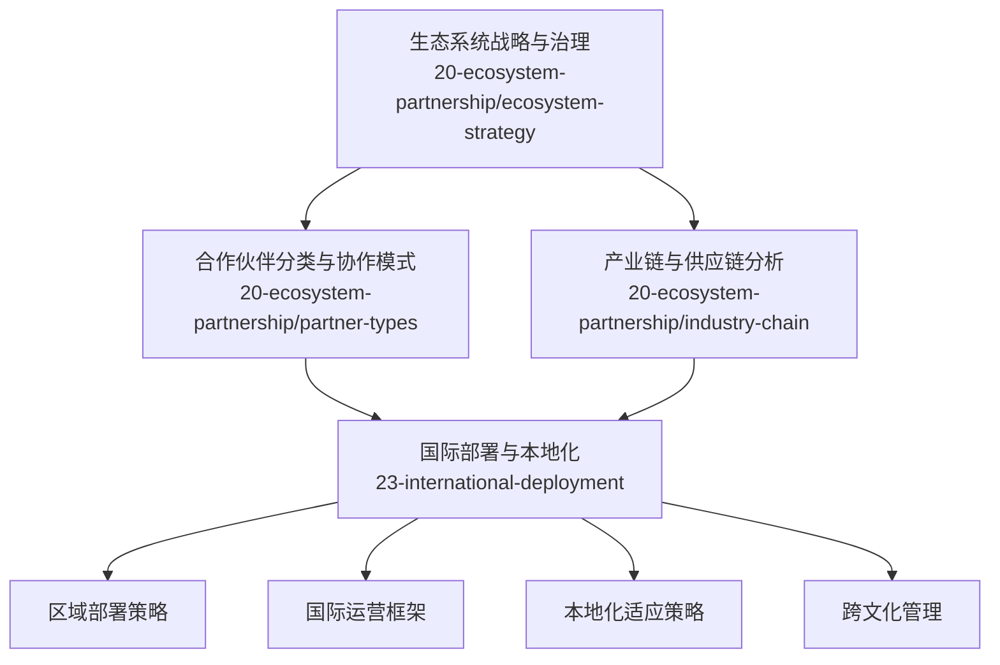
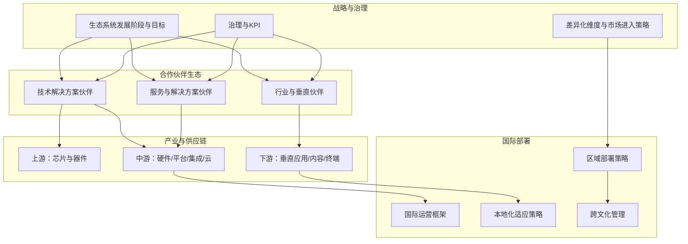
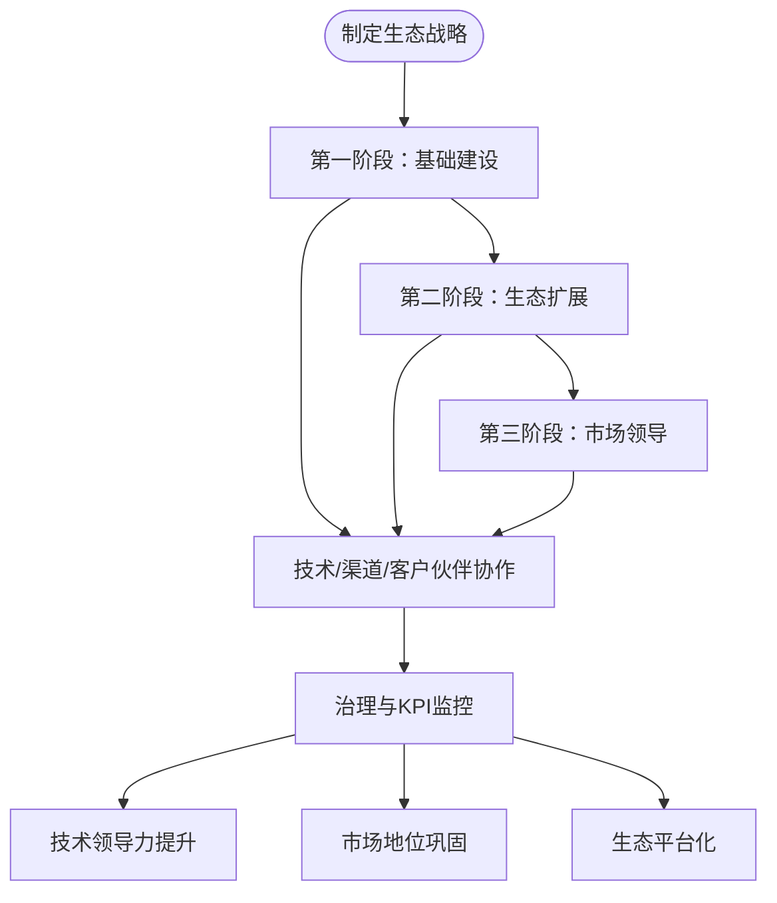
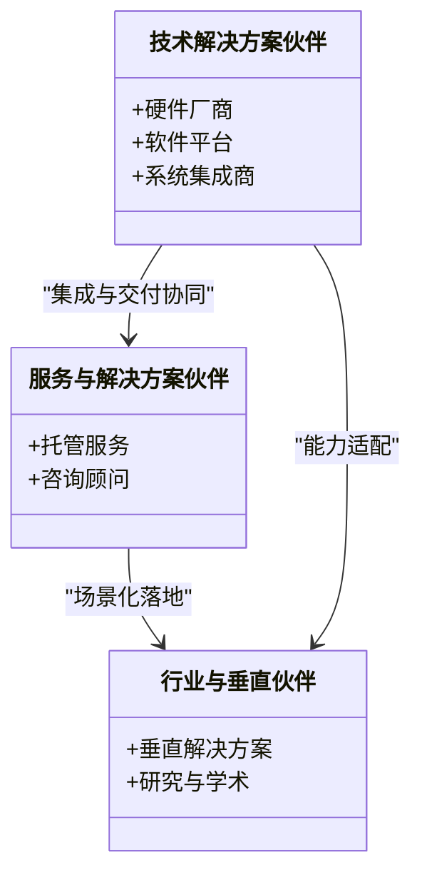
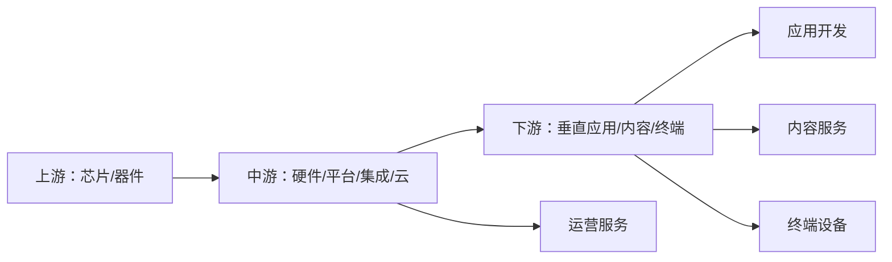
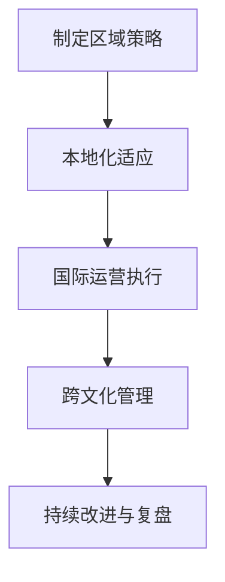
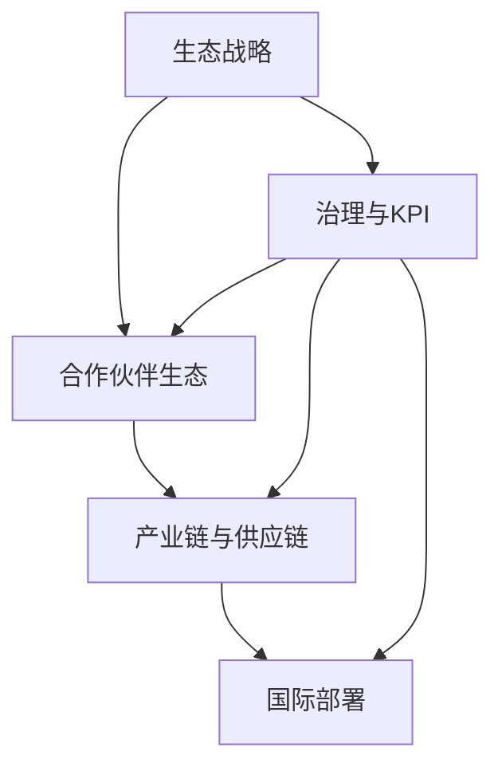

# 生态合作

<cite>
**本文引用的文件**
- [O-RAN 生态系统战略框架](file://20-ecosystem-partnership/ecosystem-strategy/o-ran-ecosystem-strategy-zh.md)
- [O-RAN 合作伙伴类型与协作模式](file://20-ecosystem-partnership/partner-types/o-ran-partner-classification-zh.md)
- [O-RAN 产业链生态分析](file://20-ecosystem-partnership/industry-chain/ecosystem-analysis.md)
- [O-RAN 区域部署策略](file://23-international-deployment/regional-strategies/o-ran-regional-deployment-strategies-zh.md)
- [O-RAN 国际运营框架](file://23-international-deployment/international-operations/international-operations-framework-zh.md)
- [O-RAN 本地化适应策略](file://23-international-deployment/localization-adaptation/o-ran-localization-strategies-zh.md)
- [O-RAN 跨文化管理](file://23-international-deployment/cross-cultural-management/o-ran-cross-cultural-management-zh.md)
</cite>

## 目录
1. 引言
2. 项目结构
3. 核心组件
4. 架构总览
5. 详细组件分析
6. 依赖分析
7. 性能考虑
8. 故障排查指南
9. 结论
10. 附录

## 引言
本文件面向O-RAN生态合作的实践者，系统梳理生态战略、合作伙伴分类与协作模式、产业链与供应链视角、国际部署框架（区域策略、本地化与跨文化管理），并总结多厂商协作的关键抓手（标准统一、接口兼容、技术共享与利益分配）以及治理与决策机制，帮助各方建立高效、可持续的合作体系。

## 项目结构
围绕“生态合作”主题，仓库中与之直接相关的内容主要分布在以下模块：
- 生态系统战略与治理：20-ecosystem-partnership/ecosystem-strategy
- 合作伙伴分类与协作模式：20-ecosystem-partnership/partner-types
- 产业链与供应链分析：20-ecosystem-partnership/industry-chain
- 国际部署与本地化：23-international-deployment

**章节来源**
- file://20-ecosystem-partnership/ecosystem-strategy/o-ran-ecosystem-strategy-zh.md#L1-L189
- file://20-ecosystem-partnership/partner-types/o-ran-partner-classification-zh.md#L1-L218
- file://20-ecosystem-partnership/industry-chain/ecosystem-analysis.md#L1-L127
- file://23-international-deployment/regional-strategies/o-ran-regional-deployment-strategies-zh.md
- file://23-international-deployment/international-operations/international-operations-framework-zh.md
- file://23-international-deployment/localization-adaptation/o-ran-localization-strategies-zh.md
- file://23-international-deployment/cross-cultural-management/o-ran-cross-cultural-management-zh.md

## 核心组件
- 生态系统战略与阶段目标：明确基础建设、生态扩展、市场领导三个阶段的目标与关键活动，提出技术、生态与客户价值三大差异化维度，并给出绿地市场与现有系统转型两类市场进入策略。
- 合作伙伴分类与协作模式：将合作伙伴分为技术解决方案、服务与解决方案、行业与垂直领域三类，细化硬件厂商、软件平台、系统集成商、托管服务、咨询顾问等子类，给出授权/集成、专业/托管、项目/保留等协作模式。
- 产业链与供应链分析：绘制上游（芯片/器件）、中游（硬件/平台/集成/云）、下游（垂直应用/内容/终端）全景，给出各环节价值占比、竞争者类型、开放合作与商业模式创新、趋势预测与投资机会。
- 国际部署框架：提供区域部署策略、国际运营框架、本地化适应策略与跨文化管理要点，支撑全球化落地。

**章节来源**
- file://20-ecosystem-partnership/ecosystem-strategy/o-ran-ecosystem-strategy-zh.md#L6-L189
- file://20-ecosystem-partnership/partner-types/o-ran-partner-classification-zh.md#L6-L218
- file://20-ecosystem-partnership/industry-chain/ecosystem-analysis.md#L6-L127
- file://23-international-deployment/regional-strategies/o-ran-regional-deployment-strategies-zh.md
- file://23-international-deployment/international-operations/international-operations-framework-zh.md
- file://23-international-deployment/localization-adaptation/o-ran-localization-strategies-zh.md
- file://23-international-deployment/cross-cultural-management/o-ran-cross-cultural-management-zh.md

## 架构总览
下图从“战略—伙伴—产业—国际”的维度，展示O-RAN生态合作的整体架构与交互关系。

**图表来源**
- file://20-ecosystem-partnership/ecosystem-strategy/o-ran-ecosystem-strategy-zh.md#L6-L189
- file://20-ecosystem-partnership/partner-types/o-ran-partner-classification-zh.md#L6-L218
- file://20-ecosystem-partnership/industry-chain/ecosystem-analysis.md#L6-L127
- file://23-international-deployment/regional-strategies/o-ran-regional-deployment-strategies-zh.md
- file://23-international-deployment/international-operations/international-operations-framework-zh.md
- file://23-international-deployment/localization-adaptation/o-ran-localization-strategies-zh.md
- file://23-international-deployment/cross-cultural-management/o-ran-cross-cultural-management-zh.md

## 详细组件分析

### 生态系统战略与治理
- 发展阶段与目标
  - 基础建设阶段：聚焦核心能力建设、关键伙伴接触、最小可行产品与知识产权布局。
  - 生态扩展阶段：扩大产品供应与市场影响力，拓展跨价值链合作伙伴网络，建立思想领导力与综合解决方案组合。
  - 市场领导阶段：追求细分市场领先、推动行业标准与最佳实践、构建具备网络效应的平台生态。
- 合作伙伴策略
  - 技术合作伙伴：联合开发、技术授权、参考实现、标准协作。
  - 渠道合作伙伴：系统集成商、经销商、托管服务、咨询伙伴；强调赋能计划（培训、认证、销售材料、技术文档、联合销售）。
  - 客户合作伙伴：早期采用者、联合概念验证、客户咨询委员会、长期战略合作与风险/回报共享。
- 差异化维度
  - 技术领导力：创新管道、性能基准、上市速度、质量保证。
  - 生态系统实力：合作伙伴网络、多厂商集成能力、平台可扩展性、社区参与。
  - 客户价值主张：TCO、风险缓解、未来保障、定制化灵活性。
- 市场进入策略
  - 绿地市场：新网络部署、企业专网、农村/未服务地区、实验/研究部署。
  - 现有系统转型：分阶段迁移、遗留集成与共存、清晰路线图与回退程序。
- 治理与KPI
  - 治理：战略指导委员会、运营治理、创新委员会的职责边界。
  - KPI：活跃合作伙伴数量、专利申请数量、市场份额增长、NPS、生态系统收入等。

**图表来源**
- file://20-ecosystem-partnership/ecosystem-strategy/o-ran-ecosystem-strategy-zh.md#L8-L48
- file://20-ecosystem-partnership/ecosystem-strategy/o-ran-ecosystem-strategy-zh.md#L50-L114
- file://20-ecosystem-partnership/ecosystem-strategy/o-ran-ecosystem-strategy-zh.md#L115-L142
- file://20-ecosystem-partnership/ecosystem-strategy/o-ran-ecosystem-strategy-zh.md#L143-L189

**章节来源**
- file://20-ecosystem-partnership/ecosystem-strategy/o-ran-ecosystem-strategy-zh.md#L6-L189

### 合作伙伴分类与协作模式
- 技术解决方案伙伴
  - 硬件厂商：白盒制造、专业射频、时钟同步、边缘计算硬件；授权/集成两类协作模式。
  - 软件平台：RIC平台、网络管理、自动化编排、分析监控；强调互操作性、可扩展性、创新与成本效率。
  - 系统集成商：多厂商集成、定制方案、遗留系统集成、端到端部署；提供专业服务与托管服务。
- 服务与解决方案伙伴
  - 托管服务：网络运营中心、远程运营、现场服务、客户支持；服务交付与定价模式多样化。
  - 咨询与顾问：技术战略、业务转型、技术架构、厂商选择；项目制与保留服务。
- 行业与垂直伙伴
  - 垂直解决方案：智能制造、医疗、交通、能源、零售与酒店；强调领域专业知识、法规合规、用例优化与生态集成。
  - 研究与学术：基础研究、概念验证、人才培养、标准制定；联合研究、资助、学生实习、教师交流、孵化与技术转让。
- 成功因素与关系管理
  - 对齐标准：愿景兼容、市场定位、技术路线图、商业价值观；流程集成、沟通协议、质量标准、资源配置。
  - 绩效测量：财务、运营、战略三类指标；收入、成本节约、ROI、交付绩效、客户满意度、创新产出、市场扩张、能力增强、品牌关联、生态增长。
  - 治理与沟通：指导委员会、工作组、定期评审、升级程序；高管简报、技术评审、项目状态、临时沟通。

**图表来源**
- file://20-ecosystem-partnership/partner-types/o-ran-partner-classification-zh.md#L6-L218

**章节来源**
- file://20-ecosystem-partnership/partner-types/o-ran-partner-classification-zh.md#L6-L218

### 产业链与供应链分析
- 产业链全景
  - 上游：芯片设计制造、射频器件、光电器件、存储器件。
  - 中游：白盒硬件、软件平台、集成服务、云服务。
  - 下游：垂直行业应用、应用开发、内容服务、终端设备。
- 价值链与竞争格局
  - 价值占比：芯片设计（25-30%）、硬件制造（20-25%）、软件平台（15-20%）、集成服务（15-20%）、运营服务（10-15%）。
  - 竞争者类型：传统设备商转型、新兴创新企业、云服务提供商。
- 生态模式与趋势
  - 开放合作：标准统一、互操作性测试、开源社区、产业联盟。
  - 商业模式：网络即服务（NaaS）、切片即服务（SlaaS）、平台即服务（PaaS）、算法即服务（AaaS）。
  - 短期至长期趋势：标准化加速、试点扩大、生态完善、成本下降；商用部署、垂直应用、技术融合、竞争加剧；6G演进、生态成熟、价值重构、全球普及。
- 投资机会与风险
  - 高潜力：软件定义RAN、边缘智能、安全防护、自动化运维。
  - 风险：技术成熟度、市场接受度、投资回报周期、监管政策。

**图表来源**
- file://20-ecosystem-partnership/industry-chain/ecosystem-analysis.md#L8-L32
- file://20-ecosystem-partnership/industry-chain/ecosystem-analysis.md#L34-L44

**章节来源**
- file://20-ecosystem-partnership/industry-chain/ecosystem-analysis.md#L1-L127

### 国际部署框架
- 区域部署策略：针对不同区域的市场条件、政策环境、技术成熟度与竞争态势制定差异化策略。
- 国际运营框架：明确国际项目的组织架构、流程、资源与风险管理机制。
- 本地化适应策略：在产品、服务、流程、合规与文化层面进行本地化调整。
- 跨文化管理：建立跨文化沟通机制、冲突解决流程与多元团队协作模式。

**图表来源**
- file://23-international-deployment/regional-strategies/o-ran-regional-deployment-strategies-zh.md
- file://23-international-deployment/international-operations/international-operations-framework-zh.md
- file://23-international-deployment/localization-adaptation/o-ran-localization-strategies-zh.md
- file://23-international-deployment/cross-cultural-management/o-ran-cross-cultural-management-zh.md

**章节来源**
- file://23-international-deployment/regional-strategies/o-ran-regional-deployment-strategies-zh.md
- file://23-international-deployment/international-operations/international-operations-framework-zh.md
- file://23-international-deployment/localization-adaptation/o-ran-localization-strategies-zh.md
- file://23-international-deployment/cross-cultural-management/o-ran-cross-cultural-management-zh.md

## 依赖分析
- 战略与伙伴：生态战略决定伙伴类型与协作模式，伙伴生态反过来影响技术、生态与客户价值的差异化实现。
- 产业与国际：中游平台与集成能力是国际运营与本地化落地的基础；下游垂直应用驱动区域策略差异。
- 治理与绩效：KPI与治理机制确保战略、伙伴与产业协同的闭环推进。

**图表来源**
- file://20-ecosystem-partnership/ecosystem-strategy/o-ran-ecosystem-strategy-zh.md#L143-L189
- file://20-ecosystem-partnership/partner-types/o-ran-partner-classification-zh.md#L168-L218
- file://20-ecosystem-partnership/industry-chain/ecosystem-analysis.md#L67-L127
- file://23-international-deployment/regional-strategies/o-ran-regional-deployment-strategies-zh.md

**章节来源**
- file://20-ecosystem-partnership/ecosystem-strategy/o-ran-ecosystem-strategy-zh.md#L143-L189
- file://20-ecosystem-partnership/partner-types/o-ran-partner-classification-zh.md#L168-L218
- file://20-ecosystem-partnership/industry-chain/ecosystem-analysis.md#L67-L127
- file://23-international-deployment/regional-strategies/o-ran-regional-deployment-strategies-zh.md

## 性能考虑
- 战略阶段的资源配置与优先级应与KPI保持一致，避免资源错配导致的生态失衡。
- 伙伴协作模式需与自身能力边界匹配，避免过度集成导致的交付风险。
- 供应链端到端协同（硬件、平台、集成、云）是国际部署效率与成本控制的关键。
- 国际运营的本地化与跨文化管理直接影响交付质量与客户满意度。

## 故障排查指南
- 合作伙伴不匹配
  - 症状：交付延迟、质量不达标、沟通不畅。
  - 排查：对照“对齐标准”（愿景、市场定位、技术路线图、商业价值观；流程、沟通、质量、资源）进行评估，必要时调整协作模式或替换伙伴。
- 治理失效
  - 症状：决策滞后、KPI失真、风险失控。
  - 排查：检查治理结构（指导委员会、工作组、评审与升级程序）是否健全，沟通节奏（高管简报、技术评审、项目状态、临时沟通）是否到位。
- 国际化落地困难
  - 症状：合规风险、文化冲突、交付偏差。
  - 排查：核对区域策略、本地化流程与跨文化管理机制，强化本地团队与流程嵌入。

**章节来源**
- file://20-ecosystem-partnership/partner-types/o-ran-partner-classification-zh.md#L170-L218
- file://20-ecosystem-partnership/ecosystem-strategy/o-ran-ecosystem-strategy-zh.md#L143-L189
- file://23-international-deployment/cross-cultural-management/o-ran-cross-cultural-management-zh.md

## 结论
O-RAN生态合作需要以清晰的战略为牵引，通过科学的伙伴分类与协作模式，结合产业链与供应链的协同，配合国际部署的区域策略、本地化与跨文化管理，最终在标准统一、接口兼容、技术共享与利益分配等方面形成稳定的合作机制与治理结构，实现可持续的生态繁荣。

## 附录
- 多厂商协作的关键抓手
  - 标准统一：积极参与O-RAN联盟与相关机构，推动接口规范与互操作性测试。
  - 接口兼容：通过参考实现与认证程序，确保多厂商软硬件协同。
  - 技术共享：在知识产权与保密框架下开展联合开发与交叉授权。
  - 利益分配：建立清晰的收入分成、成本分摊与风险共担机制，保障长期合作稳定性。

**章节来源**
- file://20-ecosystem-partnership/ecosystem-strategy/o-ran-ecosystem-strategy-zh.md#L52-L92
- file://20-ecosystem-partnership/partner-types/o-ran-partner-classification-zh.md#L18-L29
- file://20-ecosystem-partnership/industry-chain/ecosystem-analysis.md#L67-L80