# O-RAN生态系统战略

<cite>
**本文引用的文件**
- [O-RAN生态系统战略框架](file://20-ecosystem-partnership/ecosystem-strategy/o-ran-ecosystem-strategy.md)
- [O-RAN合作伙伴分类](file://20-ecosystem-partnership/partner-types/o-ran-partner-classification.md)
- [O-RAN商业模式](file://20-ecosystem-partnership/business-models/o-ran-business-models.md)
- [O-RAN产业链生态分析](file://20-ecosystem-partnership/industry-chain/ecosystem-analysis.md)
- [O-RAN开放源代码生态系统](file://17-open-source-ecosystem/readme.md)
- [O-RAN可持续发展](file://24-sustainable-development/readme.md)
- [O-RAN法律法规与合规](file://25-legal-regulations/readme.md)
- [O-RAN人才培养](file://19-talent-development/readme.md)
- [O-RAN成本效益分析](file://18-cost-benefit-analysis/readme.md)
- [O-RAN案例研究](file://21-case-studies/readme.md)
- [O-RAN工具平台](file://22-tool-platforms/readme.md)
- [O-RAN国际部署](file://23-international-deployment/readme.md)
- [O-RAN知识库总览](file://README.md)
</cite>

## 目录
1. [引言](#引言)
2. [项目结构](#项目结构)
3. [核心组件](#核心组件)
4. [架构概览](#架构概览)
5. [详细组件分析](#详细组件分析)
6. [依赖分析](#依赖分析)
7. [性能考虑](#性能考虑)
8. [故障排查指南](#故障排查指南)
9. [结论](#结论)
10. [附录](#附录)

## 引言
本文件面向O-RAN生态系统战略制定与实施，围绕“技术开放、市场开放、治理开放”三大基本原则，系统阐述价值共创机制（专业化分工、协同创新、互补优势），设计可持续发展模式（生态繁荣、良性循环、长期发展），并明确各角色定位与责任分工，帮助各方在O-RAN生态中找准定位、协同演进、实现共赢。

## 项目结构
该知识库以主题域划分，覆盖O-RAN全栈能力与生态实践，支撑本战略文档的系统化落地。关键目录与职责如下：
- 架构与标准：O-RAN架构、接口标准、工作组职责等
- 核心组件：O-RU、O-DU、O-CU、O-RIC、SMO等
- 云与集成：云原生架构、容器编排、微服务、自动化部署
- 生态与业务：合作伙伴分类、商业模式、产业分析、生态系统战略
- 开源生态：O-RAN软件社区、开发者工具、贡献参与
- 可持续发展：环境、社会、治理与长期规划
- 法律与合规：国际法、区域监管、合规体系与风险控制
- 人才培养：训练体系、认证、学习路径、职业发展
- 成本效益：投资模型、ROI分析、财务指标
- 国际部署：区域特征、本地化、跨文化管理
- 工具平台：开发、测试、管理、监控与运维工具
- 案例研究：运营商部署、垂直行业、技术创新与最佳实践

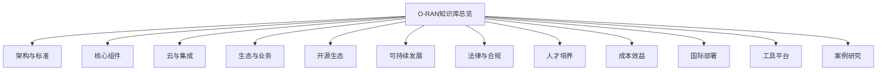

**图表来源**
- [O-RAN知识库总览](file://README.md#L1-L472)

**章节来源**
- [O-RAN知识库总览](file://README.md#L1-L472)

## 核心组件
本节聚焦O-RAN生态战略的四大支柱：技术开放、市场开放、治理开放与价值共创。

- 技术开放
  - 标准统一与互操作：通过O-RAN联盟、ETSI、3GPP等标准组织推动接口一致性与互通测试（Plugfest）。
  - 开源与开放接口：依托O-RAN软件社区（O-RAN SC）、RIC开源实现、CU/DU开源版本等，促进技术共享与快速迭代。
  - 云原生与容器化：基于Kubernetes、ONOS、ONAP等平台，实现弹性扩展与多厂商协同。

- 市场开放
  - 多元化参与主体：硬件厂商、软件平台、系统集成商、运营商、垂直行业、研究机构等共同参与。
  - 价值共享与收益分配：依据产业链价值占比，合理分配硬件、软件、服务与运营环节收益。
  - 商业模式创新：网络即服务（NaaS）、切片即服务（SlaaS）、平台即服务（PaaS）、算法即服务（AaaS）等。

- 治理开放
  - 决策框架：战略指导委员会（技术方向、资源分配、风险管理）、运营治理（协议管理、知识产权、质量标准）、创新委员会（技术评估、专利策略、开源贡献）。
  - 指标与评估：生态系统健康、技术领导力、市场份额、客户满意度、财务表现等KPI定期评估。

- 价值共创机制
  - 专业化分工：上游芯片/器件、中游设备/平台、下游应用/服务各司其职。
  - 协同创新：联合研发、参考实现、标准协作、开源社区贡献。
  - 互补优势：软硬互补、平台与应用互补、多厂商集成互补。

**章节来源**
- [O-RAN生态系统战略框架](file://20-ecosystem-partnership/ecosystem-strategy/o-ran-ecosystem-strategy.md#L1-L189)
- [O-RAN合作伙伴分类](file://20-ecosystem-partnership/partner-types/o-ran-partner-classification.md#L1-L218)
- [O-RAN商业模式](file://20-ecosystem-partnership/business-models/o-ran-business-models.md#L1-L299)
- [O-RAN产业链生态分析](file://20-ecosystem-partnership/industry-chain/ecosystem-analysis.md#L1-L127)
- [O-RAN开放源代码生态系统](file://17-open-source-ecosystem/readme.md#L1-L66)

## 架构概览
下图展示O-RAN生态系统的三层价值流与治理结构，体现技术开放、市场开放、治理开放的协同关系。

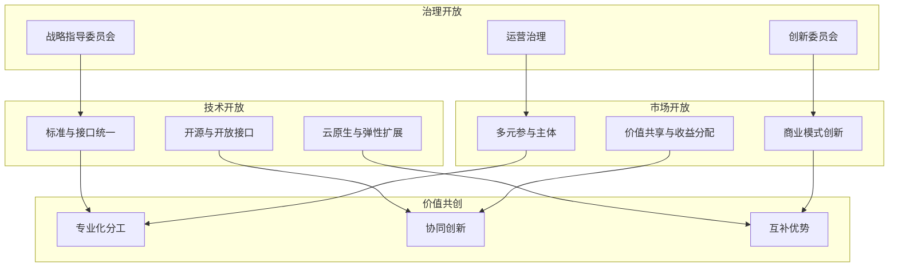

**图表来源**
- [O-RAN生态系统战略框架](file://20-ecosystem-partnership/ecosystem-strategy/o-ran-ecosystem-strategy.md#L143-L164)
- [O-RAN合作伙伴分类](file://20-ecosystem-partnership/partner-types/o-ran-partner-classification.md#L168-L217)
- [O-RAN商业模式](file://20-ecosystem-partnership/business-models/o-ran-business-models.md#L184-L215)

## 详细组件分析

### 技术开放：标准、开源与云原生
- 标准与接口统一
  - 接口协议：F1、O-FH、E2、A1、O1、O2、OAM等接口的规范与互通测试。
  - 工作组职责：WG1-WG8覆盖架构、接口、硬件、软件、安全、测试等。
- 开源与开放接口
  - O-RAN软件社区（O-RAN SC）项目、RIC开源实现、CU/DU开源版本、RU接口开源实现。
  - 开发者工具：模拟器、SDK/API、CI/CD流水线、监控与调试工具。
- 云原生与弹性扩展
  - 容器编排：Kubernetes/OpenShift等；服务网格：Istio/Linkerd。
  - 平台能力：ONOS、ONAP、Kubernetes Operator等。

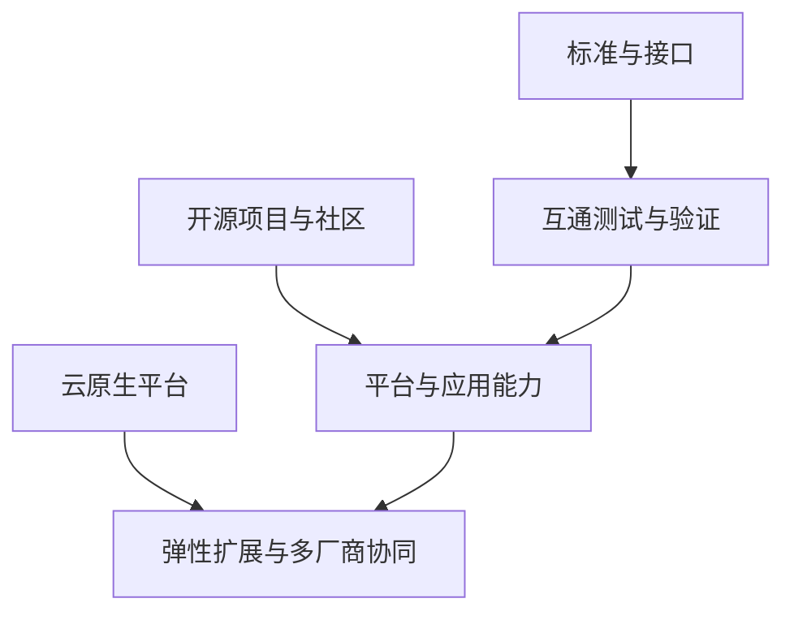

**图表来源**
- [O-RAN开放源代码生态系统](file://17-open-source-ecosystem/readme.md#L1-L66)
- [O-RAN知识库总览](file://README.md#L1-L472)

**章节来源**
- [O-RAN开放源代码生态系统](file://17-open-source-ecosystem/readme.md#L1-L66)
- [O-RAN知识库总览](file://README.md#L1-L472)

### 市场开放：多元主体与价值共享
- 多元参与主体
  - 硬件厂商：白盒制造商、专用射频设备、时钟同步、边缘计算硬件。
  - 软件平台：RIC平台、网络管理系统、自动化与编排、分析与监控。
  - 系统集成商：多厂商集成、定制化方案、遗留系统对接、全生命周期交付。
  - 运营商与服务提供商：网络运营中心、远程运维、现场服务、客户服务。
  - 咨询与顾问：技术战略、业务转型、技术架构、供应商选择。
  - 垂直行业：智能制造、医疗健康、交通运输、能源电力、零售酒店。
  - 研究与学术：基础研究、概念验证、人才培养、标准制定。
- 价值共享与收益分配
  - 产业链价值占比：芯片设计（25-30%）、硬件制造（20-25%）、软件平台（15-20%）、集成服务（15-20%）、运营服务（10-15%）。
  - 收益分配：硬件厂商（30-40%）、软件厂商（25-35%）、服务提供商（20-30%）、运营商（10-15%）。
- 商业模式创新
  - NaaS、SlaaS、PaaS、AaaS等服务化与平台化模式。

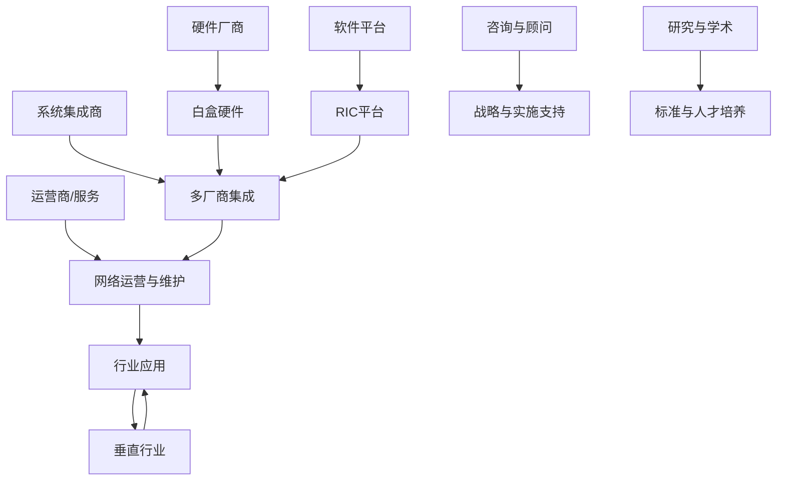

**图表来源**
- [O-RAN合作伙伴分类](file://20-ecosystem-partnership/partner-types/o-ran-partner-classification.md#L6-L217)
- [O-RAN商业模式](file://20-ecosystem-partnership/business-models/o-ran-business-models.md#L184-L215)

**章节来源**
- [O-RAN合作伙伴分类](file://20-ecosystem-partnership/partner-types/o-ran-partner-classification.md#L1-L218)
- [O-RAN商业模式](file://20-ecosystem-partnership/business-models/o-ran-business-models.md#L1-L299)
- [O-RAN产业链生态分析](file://20-ecosystem-partnership/industry-chain/ecosystem-analysis.md#L36-L44)

### 治理开放：决策框架与评估体系
- 决策框架
  - 战略指导委员会：技术方向、合作伙伴优先级、资源分配、风险管理。
  - 运营治理：合作伙伴协议管理、知识产权协调、质量标准、绩效监控与报告。
  - 创新委员会：新兴技术评估、研究优先级、专利策略、开源贡献指导。
- 成功指标与KPI
  - 生态系统健康：活跃合作伙伴数量。
  - 技术领导力：专利申请数量。
  - 市场地位：市场份额增长。
  - 客户满意度：NPS分数。
  - 财务绩效：生态系统收入。

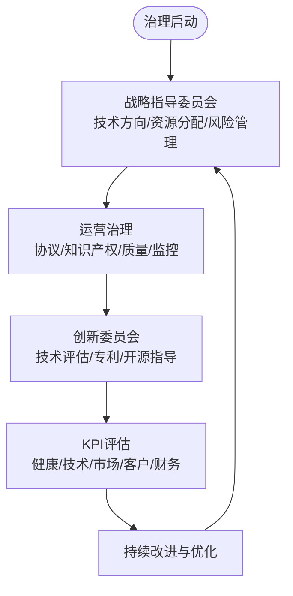

**图表来源**
- [O-RAN生态系统战略框架](file://20-ecosystem-partnership/ecosystem-strategy/o-ran-ecosystem-strategy.md#L143-L174)

**章节来源**
- [O-RAN生态系统战略框架](file://20-ecosystem-partnership/ecosystem-strategy/o-ran-ecosystem-strategy.md#L143-L189)

### 价值共创：专业化分工、协同创新与互补优势
- 专业化分工
  - 上游：芯片设计制造、射频器件、光电器件、存储器件。
  - 中游：白盒硬件、软件平台、集成服务、云服务。
  - 下游：垂直行业、应用开发、内容服务、终端设备。
- 协同创新
  - 联合研发、参考实现、标准协作、开源社区贡献。
- 互补优势
  - 软硬互补、平台与应用互补、多厂商集成互补。

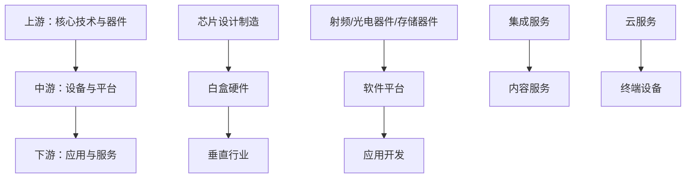

**图表来源**
- [O-RAN产业链生态分析](file://20-ecosystem-partnership/industry-chain/ecosystem-analysis.md#L6-L33)

**章节来源**
- [O-RAN产业链生态分析](file://20-ecosystem-partnership/industry-chain/ecosystem-analysis.md#L1-L127)

### 可持续发展：环境、社会、治理与长期规划
- 环境保护：绿色通信技术、节能设计、可再生能源、碳足迹管理、循环经济。
- 社会责任：数字包容、无障碍设计、教育支持、社区发展、员工关怀。
- 企业治理：透明治理、伦理标准、技术伦理、行业自律。
- 长期规划：技术演进路线图（短期、中期、长期）、创新驱动、价值创造模型（经济、社会、环境综合价值）。

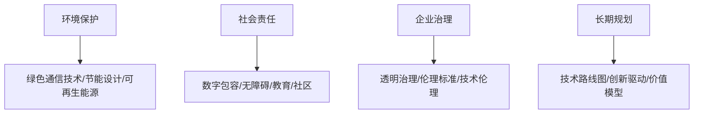

**图表来源**
- [O-RAN可持续发展](file://24-sustainable-development/readme.md#L1-L65)

**章节来源**
- [O-RAN可持续发展](file://24-sustainable-development/readme.md#L1-L65)

### 法律与合规：国际法、区域监管与合规体系
- 国际法与监管：频谱管理、网络安全法、数据保护法、知识产权法。
- 区域监管：中国《网络安全法》《数据安全法》《个人信息保护法》、欧盟GDPR/NIS指令、美国FCC规则/CLOUD Act。
- 合规体系：政策制定、组织架构、流程管理、监督机制、风险控制、持续改进。

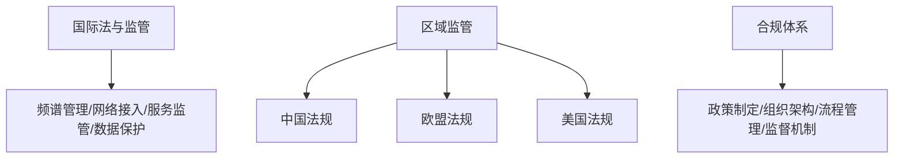

**图表来源**
- [O-RAN法律法规与合规](file://25-legal-regulations/readme.md#L1-L74)

**章节来源**
- [O-RAN法律法规与合规](file://25-legal-regulations/readme.md#L1-L74)

### 人才培养：训练体系、认证与职业发展
- 训练体系：网络基础、云与容器、编程能力、Linux系统、O-RAN架构、RIC开发、网络优化、安全保护。
- 认证体系：O-RAN联盟认证、设备厂商认证、云服务提供商认证、开源项目认证、运营商/咨询机构认证、国际认证。
- 学习路径：初级工程师、中级工程师、高级专家路径与时间规划。
- 职业通道：技术专家、管理、创业。

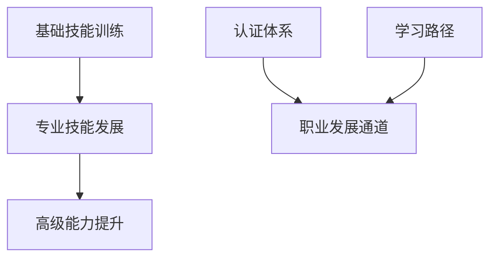

**图表来源**
- [O-RAN人才培养](file://19-talent-development/readme.md#L1-L71)

**章节来源**
- [O-RAN人才培养](file://19-talent-development/readme.md#L1-L71)

### 成本效益：投资模型、ROI与财务指标
- 成本构成：初期投资（硬件设备、软件许可、集成服务、培训认证、基础设施）、运维成本（人工、软件维护、硬件维护、能耗、管理费用）。
- 收益评估：直接收益（CAPEX降低、OPEX优化、灵活性增强、创新加速）、间接收益（竞争优势、运营效率、客户体验、生态价值）。
- ROI模型：NPV、IRR、回收期、BCR，敏感性分析与风险量化。
- 决策工具：财务模型、评估框架、成熟度评估、风险矩阵、实施优先级、阶段性目标。

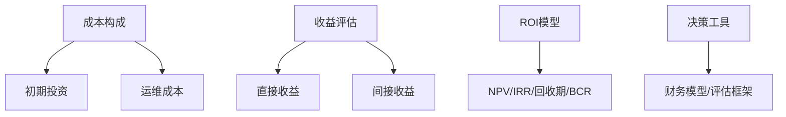

**图表来源**
- [O-RAN成本效益分析](file://18-cost-benefit-analysis/readme.md#L1-L62)

**章节来源**
- [O-RAN成本效益分析](file://18-cost-benefit-analysis/readme.md#L1-L62)

### 国际部署：区域特征、本地化与跨文化管理
- 区域特征：北美（FCC合规、严格网络安全审查、数据保护）、欧洲（CE认证、GDPR、绿色低碳）、亚太（快速部署、规模效应、成本敏感）、拉美与非洲（基础设施缺口、跨越式发展、南南合作）。
- 本地化策略：频谱适配、标准兼容、设备定制、接口本地化、语言与用户习惯、业务文化、法律法规。
- 跨文化管理：多元团队协作、远程协作、知识转移、冲突解决、供应链管理、政治与汇率风险。

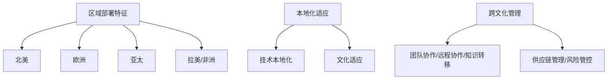

**图表来源**
- [O-RAN国际部署](file://23-international-deployment/readme.md#L1-L72)

**章节来源**
- [O-RAN国际部署](file://23-international-deployment/readme.md#L1-L72)

### 工具平台：开发、测试、管理与监控
- 开发工具集：IDE、版本控制、代码质量、API设计。
- 模拟与测试：网络仿真、协议分析、性能测试、安全测试。
- 容器化：容器引擎、编排平台、镜像仓库、服务网格。
- 管理平台：SDN控制器、网络编排、配置管理、监控告警。
- RIC管理：近实时RIC、非实时RIC、应用管理、策略管理。
- 自动化运维：CI/CD、基础设施即代码、配置自动化、部署工具。
- 监控与分析：性能监控、日志分析、故障诊断、可视化。
- 实用程序：命令行工具、网络工具、运维脚本。

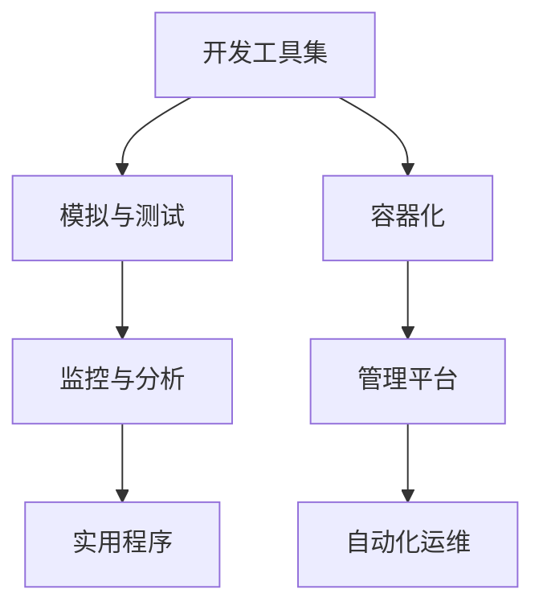

**图表来源**
- [O-RAN工具平台](file://22-tool-platforms/readme.md#L1-L69)

**章节来源**
- [O-RAN工具平台](file://22-tool-platforms/readme.md#L1-L69)

### 案例研究：运营商部署、垂直行业与最佳实践
- 运营商部署：欧洲运营商5G网络、亚洲运营商私有网络、北美运营商边缘计算、拉丁美洲运营商农村覆盖。
- 垂直行业：智能制造工厂、智慧港口物流、智能电网监测、远程医疗系统。
- 技术创新：AI驱动网络优化、边缘智能部署、网络切片实践、零信任安全解决方案。
- 成功要素：清晰业务需求、合适技术选型、充足资源投入、有效项目管理、持续优化改进。
- 常见挑战与对策：技术复杂性、成本控制、人员技能、集成难度、运营转型。
- 失败案例分析：架构缺陷、接口兼容性、安全漏洞、性能不足、管理问题。
- 最佳实践提炼：规划阶段、实施阶段、运营阶段的要点与方法论。

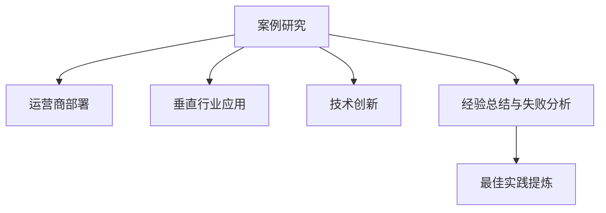

**图表来源**
- [O-RAN案例研究](file://21-case-studies/readme.md#L1-L74)

**章节来源**
- [O-RAN案例研究](file://21-case-studies/readme.md#L1-L74)

## 依赖分析
O-RAN生态系统的成功依赖于以下关键耦合关系：
- 技术开放与市场开放相互促进：标准统一与开源生态推动多厂商参与，市场开放带来更大收益分配空间，激励更多主体加入。
- 治理开放保障价值共创：清晰的决策与评估机制确保资源高效配置，避免技术碎片化与恶性竞争。
- 可持续发展与法律合规为长期繁荣奠定基础：ESG与合规体系降低运营风险，提升品牌与信任度。
- 人才培养与工具平台支撑生态能力：持续的人才供给与完善的工具链是生态繁荣的底层能力。

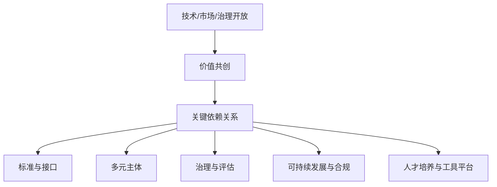

**图表来源**
- [O-RAN生态系统战略框架](file://20-ecosystem-partnership/ecosystem-strategy/o-ran-ecosystem-strategy.md#L143-L189)
- [O-RAN合作伙伴分类](file://20-ecosystem-partnership/partner-types/o-ran-partner-classification.md#L168-L217)
- [O-RAN可持续发展](file://24-sustainable-development/readme.md#L1-L65)
- [O-RAN法律法规与合规](file://25-legal-regulations/readme.md#L1-L74)
- [O-RAN人才培养](file://19-talent-development/readme.md#L1-L71)
- [O-RAN工具平台](file://22-tool-platforms/readme.md#L1-L69)

**章节来源**
- [O-RAN生态系统战略框架](file://20-ecosystem-partnership/ecosystem-strategy/o-ran-ecosystem-strategy.md#L143-L189)
- [O-RAN合作伙伴分类](file://20-ecosystem-partnership/partner-types/o-ran-partner-classification.md#L168-L217)
- [O-RAN可持续发展](file://24-sustainable-development/readme.md#L1-L65)
- [O-RAN法律法规与合规](file://25-legal-regulations/readme.md#L1-L74)
- [O-RAN人才培养](file://19-talent-development/readme.md#L1-L71)
- [O-RAN工具平台](file://22-tool-platforms/readme.md#L1-L69)

## 性能考虑
- 标准与互操作性：通过持续参与标准制定与互通测试，降低集成成本与故障率。
- 开源与平台化：利用开源社区与平台能力，缩短开发周期、提升可扩展性与稳定性。
- 云原生与弹性：容器化与编排提升资源利用率与弹性，支持按需扩容与多厂商协同。
- 成本与收益平衡：通过ROI分析与财务模型，优化资源配置与投资节奏，确保长期可持续。

## 故障排查指南
- 标准与接口问题：检查接口规范一致性、互通测试结果、协议解析工具使用。
- 集成与兼容性：多厂商设备对接、兼容性测试、参考实现验证。
- 安全与合规：安全基线检查、合规审计、数据保护与隐私措施落实。
- 运维与监控：性能监控告警、日志分析、根因定位、预测性维护与知识库复用。
- 国际化与本地化：频谱适配、标准认证、语言与文化差异、供应链与合规风险。

**章节来源**
- [O-RAN工具平台](file://22-tool-platforms/readme.md#L1-L69)
- [O-RAN案例研究](file://21-case-studies/readme.md#L1-L74)
- [O-RAN法律法规与合规](file://25-legal-regulations/readme.md#L1-L74)

## 结论
O-RAN生态系统的发展需要以“技术开放、市场开放、治理开放”为三大基石，通过专业化分工、协同创新与互补优势实现价值共创，并以可持续发展模式构建生态繁荣、良性循环与长期发展。在此过程中，标准与开源是技术开放的抓手，多元主体与收益分配是市场开放的体现，治理与评估是治理开放的保障。同时，可持续发展与合规体系、人才培养与工具平台为生态提供长期动能。通过系统化的战略规划与执行，O-RAN生态将形成强大的网络效应与竞争优势。

## 附录
- 关键术语：O-RAN、RIC、CU/DU、O-RU、F1/O-FH/E2/A1/O1/O2/OAM、NaaS/SlaaS/PaaS/AaaS、Plugfest、O-RAN SC、ONOS/ONAP/Kubernetes。
- 参考资料：O-RAN联盟官网、ETSI标准、3GPP规范、O-RAN软件社区、5G Americas等。