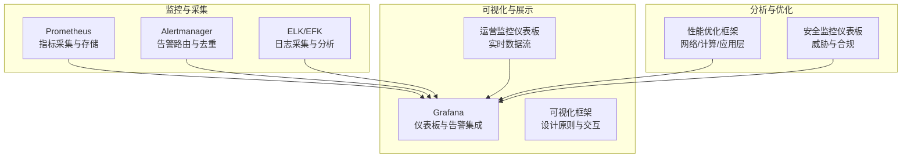
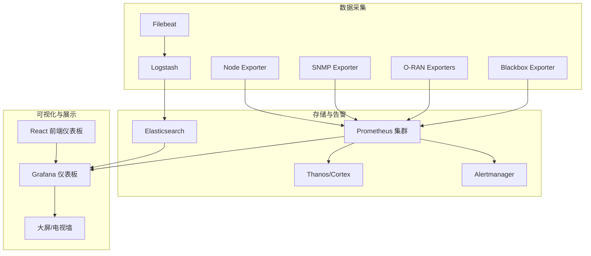
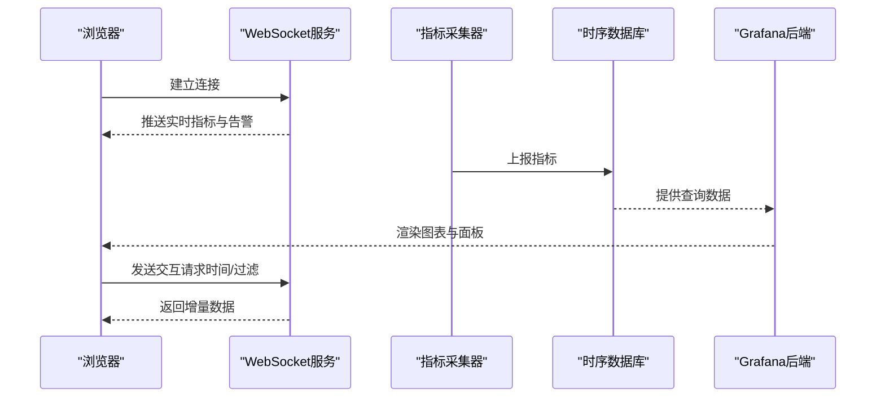
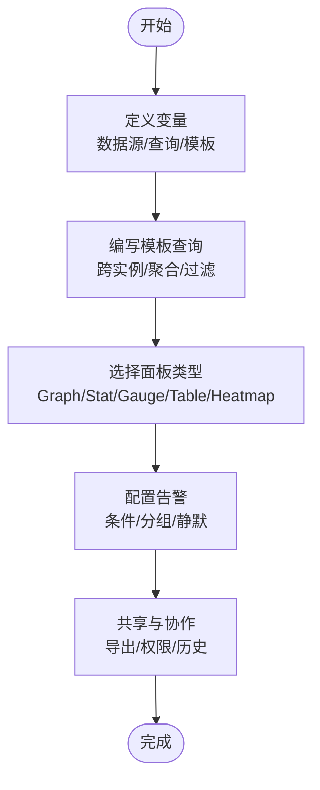
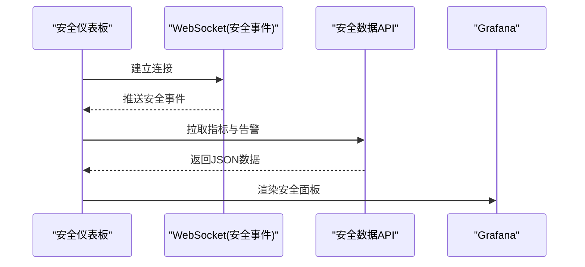
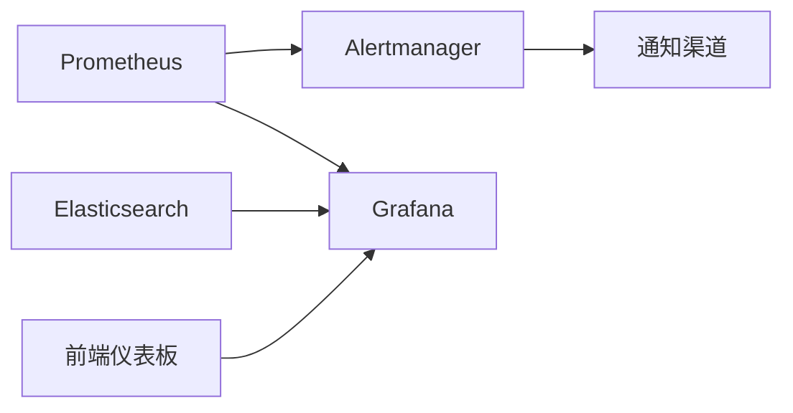
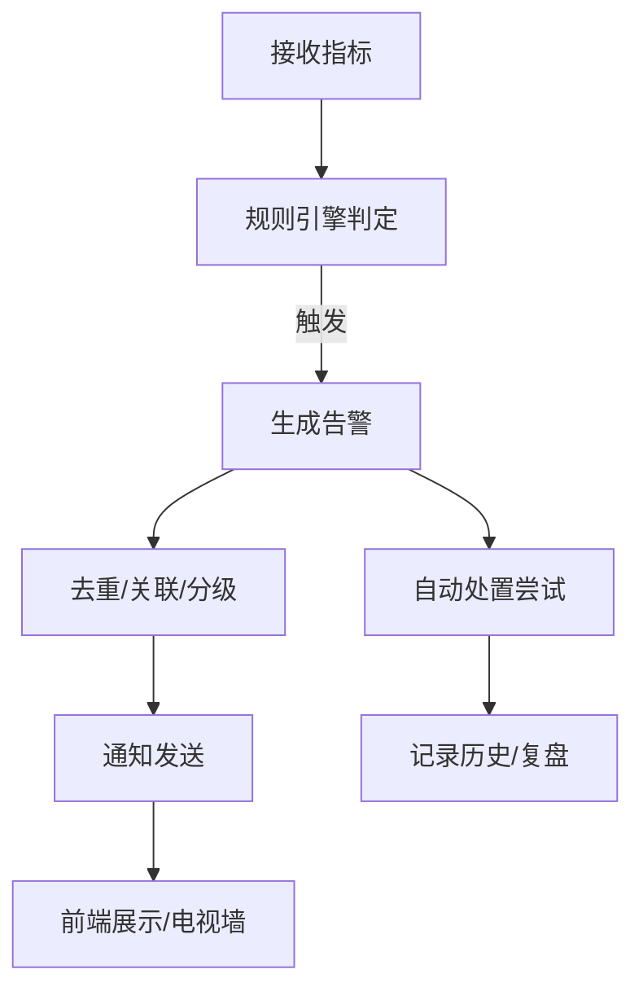

# 可视化展示

<cite>
**本文引用的文件**
- [O-RAN监控系统.md](file://22-tool-platforms/monitoring-systems/o-ran-monitoring-systems.md)
- [监控与告警.md](file://28-monitoring-alerting/readme.md)
- [可视化框架.md](file://28-monitoring-alerting/visualization/o-ran-monitoring-visualization.md)
- [运营监控框架.md](file://14-operations-management/monitoring-alerting/operations-monitoring-framework.md)
- [性能优化框架.md](file://14-operations-management/performance-optimization/performance-optimization-framework.md)
- [监控工具.md](file://26-performance-optimization/monitoring-tools/o-ran-monitoring-tools.md)
- [安全监控框架.md](file://12-security-privacy/monitoring-alerting/security-monitoring-framework.md)
</cite>

## 目录
1. [简介](#简介)
2. [项目结构](#项目结构)
3. [核心组件](#核心组件)
4. [架构总览](#架构总览)
5. [详细组件分析](#详细组件分析)
6. [依赖关系分析](#依赖关系分析)
7. [性能考量](#性能考量)
8. [故障排查指南](#故障排查指南)
9. [结论](#结论)
10. [附录](#附录)

## 简介
本文件面向O-RAN可视化展示，围绕“概览仪表板、网络拓扑图、性能趋势图、告警中心”等不同类型的仪表板，系统阐述设计原则、数据可视化技术、Grafana等工具的高级配置、实时监控实现方案、报表生成与移动端适配策略。文档以仓库中已有的监控体系、可视化框架与运营实践为基础，结合最佳实践给出可落地的实现建议。

## 项目结构
本仓库提供了从监控采集、存储、告警到可视化的完整链路与样例，重点涉及以下模块：
- 监控系统与工具：Prometheus、Grafana、ELK、Alertmanager 等
- 可视化框架：仪表板设计原则、实时数据呈现、交互探索、响应式布局
- 运营监控：实时仪表板、告警管理、自动化处置
- 性能优化：网络/计算层优化与性能仪表板
- 安全监控：安全事件可视化与威胁态势展示

**图表来源**
- [O-RAN监控系统.md](file://22-tool-platforms/monitoring-systems/o-ran-monitoring-systems.md#L10-L78)
- [可视化框架.md](file://28-monitoring-alerting/visualization/o-ran-monitoring-visualization.md#L197-L255)
- [运营监控框架.md](file://14-operations-management/monitoring-alerting/operations-monitoring-framework.md#L532-L692)
- [性能优化框架.md](file://14-operations-management/performance-optimization/performance-optimization-framework.md#L380-L448)
- [安全监控框架.md](file://12-security-privacy/monitoring-alerting/security-monitoring-framework.md#L219-L304)

**章节来源**
- [O-RAN监控系统.md](file://22-tool-platforms/monitoring-systems/o-ran-monitoring-systems.md#L1-L545)
- [监控与告警.md](file://28-monitoring-alerting/readme.md#L1-L95)
- [可视化框架.md](file://28-monitoring-alerting/visualization/o-ran-monitoring-visualization.md#L1-L257)
- [运营监控框架.md](file://14-operations-management/monitoring-alerting/operations-monitoring-framework.md#L1-L909)
- [性能优化框架.md](file://14-operations-management/performance-optimization/performance-optimization-framework.md#L1-L650)
- [监控工具.md](file://26-performance-optimization/monitoring-tools/o-ran-monitoring-tools.md#L216-L284)
- [安全监控框架.md](file://12-security-privacy/monitoring-alerting/security-monitoring-framework.md#L219-L304)

## 核心组件
- 指标采集与存储：Prometheus 提供高可用集群、长期存储（Thanos/Cortex）、指标联邦；支持自定义Exporter与RAN特定指标。
- 告警与通知：Alertmanager 路由、分组、静默与抑制规则；集成Slack、PagerDuty、邮件与Webhook。
- 可视化与仪表板：Grafana 提供O-RAN专用仪表板模板与自定义面板；支持变量、模板查询、面板组合与共享。
- 实时监控：WebSocket/轮询驱动的前端仪表板，展示系统健康、网络KPI、业务指标与活跃告警。
- 日志分析：ELK/EFK管道，支持结构化解析、地理信息增强、输出路由与生命周期管理。
- 性能优化：网络接口调优、NUMA感知绑定、内核调度与内存优化、容器资源与GC参数调优。
- 安全监控：安全事件可视化、威胁级别与合规状态展示、实时事件流。

**章节来源**
- [O-RAN监控系统.md](file://22-tool-platforms/monitoring-systems/o-ran-monitoring-systems.md#L10-L78)
- [运营监控框架.md](file://14-operations-management/monitoring-alerting/operations-monitoring-framework.md#L532-L692)
- [可视化框架.md](file://28-monitoring-alerting/visualization/o-ran-monitoring-visualization.md#L197-L255)

## 架构总览
下图展示了O-RAN可视化展示的端到端架构：数据采集层（Prometheus/日志）→ 存储与告警层（Prometheus/Thanos/Alertmanager/ELK）→ 可视化层（Grafana/自定义前端）→ 用户交互（桌面/移动端/电视墙）。

**图表来源**
- [O-RAN监控系统.md](file://22-tool-platforms/monitoring-systems/o-ran-monitoring-systems.md#L10-L78)
- [运营监控框架.md](file://14-operations-management/monitoring-alerting/operations-monitoring-framework.md#L532-L692)

## 详细组件分析

### 仪表板设计原则与布局
- 分层结构：面向管理层（高层KPI）、操作层（组件监控与告警）、技术层（深度指标与排障）、历史层（趋势与容量规划）。
- 信息架构：关键指标优先展示、逻辑分组、渐进披露、统一导航。
- 视觉规范：颜色编码（绿/黄/橙/红/蓝）、字体层级、标签与注释一致性。
- 响应式设计：桌面/平板/移动端/电视墙适配，网格系统、可缩放图表、触控友好控件、横竖屏支持。

**章节来源**
- [可视化框架.md](file://28-monitoring-alerting/visualization/o-ran-monitoring-visualization.md#L6-L52)

### 实时监控与数据流
- 实时仪表板：系统健康概览（可用性、性能指标、资源利用率、告警摘要）、网络性能视图（拓扑图、流量图、延迟热力图、带宽利用率）。
- 流式数据：WebSocket直连浏览器、轮询刷新、增量更新、降级回退。
- 交互特性：钻取导航、时间范围选择、维度过滤、对比分析、悬停/点击/缩放、导出分享。

**图表来源**
- [运营监控框架.md](file://14-operations-management/monitoring-alerting/operations-monitoring-framework.md#L532-L692)

**章节来源**
- [可视化框架.md](file://28-monitoring-alerting/visualization/o-ran-monitoring-visualization.md#L54-L99)
- [运营监控框架.md](file://14-operations-management/monitoring-alerting/operations-monitoring-framework.md#L532-L692)

### 图表类型与可视化技术
- 时间序列：折线图、面积图、迷你线图、水平图。
- 统计分析：直方图、箱线图、小提琴图、Q-Q图。
- 关联分析：散点图、相关矩阵、平行坐标、径向图。
- 专题地图：地理分布、时隙模式、热点识别、相关矩阵。
- 3D/景观：网络拓扑立方体、性能表面、3D地理图、数据雕塑。

**章节来源**
- [可视化框架.md](file://28-monitoring-alerting/visualization/o-ran-monitoring-visualization.md#L101-L193)

### Grafana高级配置与最佳实践
- 变量定义：数据源变量、查询变量、模板变量、隐藏/只读/多选。
- 模板查询：跨实例/组件聚合、时间范围联动、层级过滤。
- 面板组合：Graph/Stat/Gauge/Table/Heatmap/状态时间线/注解叠加。
- 共享与协作：仪表板导出/导入、版本历史、团队权限、公开分享。

**图表来源**
- [O-RAN监控系统.md](file://22-tool-platforms/monitoring-systems/o-ran-monitoring-systems.md#L80-L131)
- [监控工具.md](file://26-performance-optimization/monitoring-tools/o-ran-monitoring-tools.md#L216-L284)

**章节来源**
- [O-RAN监控系统.md](file://22-tool-platforms/monitoring-systems/o-ran-monitoring-systems.md#L80-L131)
- [监控工具.md](file://26-performance-optimization/monitoring-tools/o-ran-monitoring-tools.md#L216-L284)

### 实时监控展示实现方案
- 数据刷新机制：WebSocket长连接推送、定时轮询、增量差分更新、断线重连与降级。
- 动态更新：按需加载、虚拟滚动、Canvas渲染、Web Workers后台计算。
- 用户体验：无障碍（WCAG 2.1）、键盘导航、屏幕阅读器支持、颜色盲友好、提示与撤销/重做、可定制视图。

**章节来源**
- [可视化框架.md](file://28-monitoring-alerting/visualization/o-ran-monitoring-visualization.md#L212-L240)
- [运营监控框架.md](file://14-operations-management/monitoring-alerting/operations-monitoring-framework.md#L532-L692)

### 报表生成功能与自动化
- 日报/周报/月报：周期性性能统计、故障分析、优化建议。
- 容量规划：资源使用趋势、扩容建议、成本分析。
- 安全审计：安全事件统计、合规检查、风险评估。
- 业务影响：服务可用性、用户体验、业务价值分析。

**章节来源**
- [监控与告警.md](file://28-monitoring-alerting/readme.md#L57-L61)

### 移动端监控与适配
- 多设备兼容：桌面全功能、平板触控优化、移动端关键指标摘要、电视墙大屏。
- 交互优化：触摸友好控件、横竖屏切换、轻量图表与紧凑布局。
- 交付方式：PWA或原生App封装，离线缓存与弱网降级。

**章节来源**
- [可视化框架.md](file://28-monitoring-alerting/visualization/o-ran-monitoring-visualization.md#L39-L52)

### 安全监控可视化
- 实时事件流：WebSocket订阅安全事件，前端渲染威胁级别与合规状态。
- 面板组成：活动威胁计数、合规分数、加密健康度；告警列表与处置追踪。
- 与主监控集成：统一登录、权限继承、跨域数据源与注解。

**图表来源**
- [安全监控框架.md](file://12-security-privacy/monitoring-alerting/security-monitoring-framework.md#L219-L304)

**章节来源**
- [安全监控框架.md](file://12-security-privacy/monitoring-alerting/security-monitoring-framework.md#L219-L304)

## 依赖关系分析
- 组件耦合：Grafana依赖Prometheus/Thanos提供时序数据，依赖Alertmanager进行告警路由；前端仪表板通过WebSocket与后端服务交互。
- 外部依赖：Prometheus生态（Node/SNMP/Blackbox Exporter）、ELK生态（Filebeat/Logstash/Elasticsearch）、消息中间件（Kafka/消息队列）用于日志流处理。
- 潜在环路：监控→可视化→告警→处置→反馈→优化，形成闭环。

**图表来源**
- [O-RAN监控系统.md](file://22-tool-platforms/monitoring-systems/o-ran-monitoring-systems.md#L10-L78)
- [运营监控框架.md](file://14-operations-management/monitoring-alerting/operations-monitoring-framework.md#L532-L692)

**章节来源**
- [O-RAN监控系统.md](file://22-tool-platforms/monitoring-systems/o-ran-monitoring-systems.md#L10-L78)
- [运营监控框架.md](file://14-operations-management/monitoring-alerting/operations-monitoring-framework.md#L532-L692)

## 性能考量
- 渲染效率：虚拟滚动、懒加载、Canvas硬件加速、Web Workers。
- 数据优化：预聚合统计、渐进增强、压缩传输、客户端/服务端缓存。
- 访问性与可用性：WCAG 2.1、屏幕阅读器、键盘导航、色盲友好、提示与可定制视图。

**章节来源**
- [可视化框架.md](file://28-monitoring-alerting/visualization/o-ran-monitoring-visualization.md#L212-L240)

## 故障排查指南
- 告警相关：重复告警抑制、波动检测与合并、阈值迟滞、季节性识别；分层路由（严重级别/组件类别）。
- 根因定位：症状驱动诊断、依赖映射、影响评估；故障树分析与根因定位。
- 日志分析：实时流处理（Kafka/Storm/Flink）、异常检测、统计/ML异常识别、预测性故障分析。
- 自动化处置：匹配告警→执行动作→超时与重试→记录历史。

**图表来源**
- [O-RAN监控系统.md](file://22-tool-platforms/monitoring-systems/o-ran-monitoring-systems.md#L356-L413)
- [运营监控框架.md](file://14-operations-management/monitoring-alerting/operations-monitoring-framework.md#L262-L486)

**章节来源**
- [O-RAN监控系统.md](file://22-tool-platforms/monitoring-systems/o-ran-monitoring-systems.md#L356-L413)
- [运营监控框架.md](file://14-operations-management/monitoring-alerting/operations-monitoring-framework.md#L262-L486)

## 结论
本文件基于仓库现有监控与可视化资料，给出了O-RAN可视化展示的系统化设计与实现建议。通过Prometheus+Grafana+ELK的监控栈，结合可视化框架与运营仪表板实践，可构建覆盖概览、拓扑、趋势与告警的全场景仪表板；配合性能优化与自动化处置，实现高效可观测与快速响应。

## 附录
- 技术栈选择：前端（React/Vue/D3/Chart.js/Plotly），后端（GraphQL/REST/WebSocket/Kafka）。
- CI/CD与质量：自动化测试、性能监控、安全扫描、发布自动化、用户行为追踪与错误上报。

**章节来源**
- [可视化框架.md](file://28-monitoring-alerting/visualization/o-ran-monitoring-visualization.md#L197-L255)
- [监控工具.md](file://26-performance-optimization/monitoring-tools/o-ran-monitoring-tools.md#L216-L284)