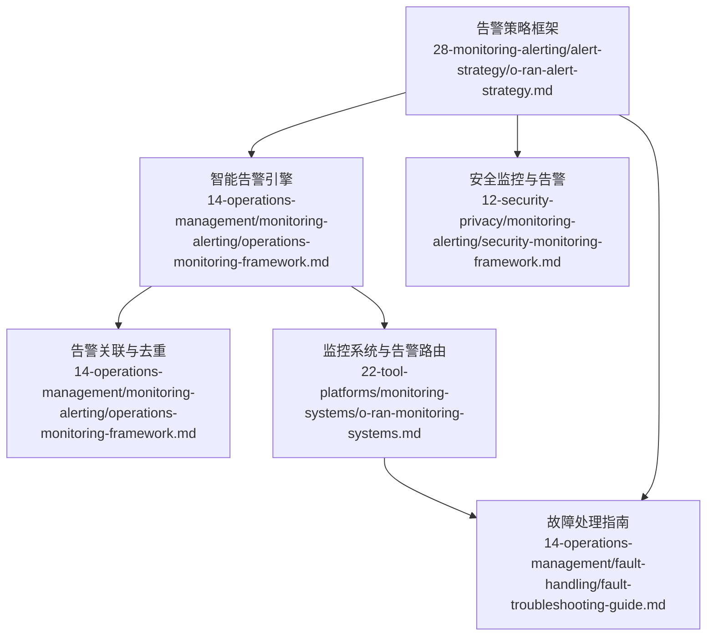
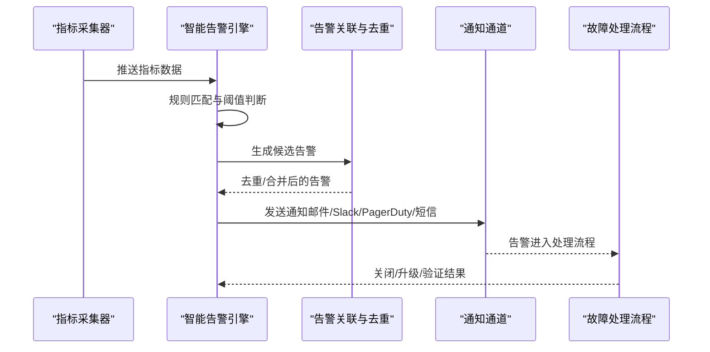
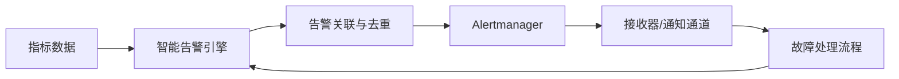

# 告警策略设计

<cite>
**本文引用的文件**
- [告警策略框架](file://28-monitoring-alerting/alert-strategy/o-ran-alert-strategy.md)
- [监控与告警框架（英文）](file://14-operations-management/monitoring-alerting/operations-monitoring-framework.md)
- [监控与告警框架（中文）](file://14-operations-management/monitoring-alerting/operations-monitoring-framework-zh.md)
- [故障处理指南](file://14-operations-management/fault-handling/fault-troubleshooting-guide.md)
- [监控系统（英文）](file://22-tool-platforms/monitoring-systems/o-ran-monitoring-systems.md)
- [安全监控与告警框架](file://12-security-privacy/monitoring-alerting/security-monitoring-framework.md)
</cite>

## 目录
1. [简介](#简介)
2. [项目结构](#项目结构)
3. [核心组件](#核心组件)
4. [架构总览](#架构总览)
5. [详细组件分析](#详细组件分析)
6. [依赖关系分析](#依赖关系分析)
7. [性能考量](#性能考量)
8. [故障排查指南](#故障排查指南)
9. [结论](#结论)
10. [附录](#附录)

## 简介
本文件面向O-RAN告警策略设计，围绕告警级别定义、规则配置、抑制与聚合、通知渠道、处理流程与优化建议进行系统化说明。文档以仓库中现有的监控与告警相关文件为基础，结合告警策略框架、智能告警引擎、告警关联与去重、通知通道集成以及故障处理实践，形成可落地的告警管理方案。

## 项目结构
与告警策略直接相关的文档主要分布在以下目录：
- 28-monitoring-alerting/alert-strategy：告警策略框架与最佳实践
- 14-operations-management/monitoring-alerting：智能告警引擎与告警规则
- 14-operations-management/fault-handling：故障诊断与处理流程
- 22-tool-platforms/monitoring-systems：监控系统与告警路由配置
- 12-security-privacy/monitoring-alerting：安全监控与威胁检测

图表来源
- [告警策略框架](file://28-monitoring-alerting/alert-strategy/o-ran-alert-strategy.md#L1-L247)
- [监控与告警框架（英文）](file://14-operations-management/monitoring-alerting/operations-monitoring-framework.md#L262-L528)
- [监控系统（英文）](file://22-tool-platforms/monitoring-systems/o-ran-monitoring-systems.md#L355-L413)
- [故障处理指南](file://14-operations-management/fault-handling/fault-troubleshooting-guide.md#L1-L633)
- [安全监控与告警框架](file://12-security-privacy/monitoring-alerting/security-monitoring-framework.md#L1-L733)

章节来源
- file://28-monitoring-alerting/alert-strategy/o-ran-alert-strategy.md#L1-L247
- file://14-operations-management/monitoring-alerting/operations-monitoring-framework.md#L262-L528
- file://22-tool-platforms/monitoring-systems/o-ran-monitoring-systems.md#L355-L413
- file://14-operations-management/fault-handling/fault-troubleshooting-guide.md#L1-L633
- file://12-security-privacy/monitoring-alerting/security-monitoring-framework.md#L1-L733

## 核心组件
- 告警级别与分类体系：明确严重等级与业务分类，支撑优先级与路由决策
- 智能告警引擎：基于阈值规则与指标提取，生成告警并进行去重
- 告警关联与去重：识别重复、级联与趋势性告警，降低噪声
- 通知通道集成：邮件、Slack、PagerDuty、短信等多通道联动
- 故障处理流程：从告警到根因定位、修复与闭环验证
- 预测与自愈：异常检测与自动化处置能力

章节来源
- file://28-monitoring-alerting/alert-strategy/o-ran-alert-strategy.md#L29-L54
- file://14-operations-management/monitoring-alerting/operations-monitoring-framework.md#L262-L486
- file://14-operations-management/monitoring-alerting/operations-monitoring-framework.md#L488-L528
- file://22-tool-platforms/monitoring-systems/o-ran-monitoring-systems.md#L355-L413
- file://14-operations-management/fault-handling/fault-troubleshooting-guide.md#L1-L633

## 架构总览
下图展示从指标采集到告警生成、通知与处理的整体流程。

图表来源
- [监控与告警框架（英文）](file://14-operations-management/monitoring-alerting/operations-monitoring-framework.md#L262-L486)
- [监控与告警框架（中文）](file://14-operations-management/monitoring-alerting/operations-monitoring-framework-zh.md#L262-L486)
- [监控系统（英文）](file://22-tool-platforms/monitoring-systems/o-ran-monitoring-systems.md#L355-L413)

## 详细组件分析

### 告警级别定义与业务含义
- Critical（严重）：直接影响服务可用性、安全事件、性能严重退化、数据丢失
- High（高）：潜在服务中断风险、性能趋势恶化、资源接近临界、非关键组件故障
- Medium（中）：需要关注的预警、性能异常调查、配置变更验证、计划内维护通知
- Low（低）：运营感知信息、系统健康状态更新、例行维护完成通知、容量规划提示

章节来源
- file://28-monitoring-alerting/alert-strategy/o-ran-alert-strategy.md#L29-L54

### 告警规则配置与阈值设置
- 规则加载与阈值：内置CPU、内存、RIC响应时间、接口可用性、KPI等阈值规则
- 指标提取：支持“点号路径”提取嵌套指标值，如“kpi_metrics.availability_percentage”
- 去重逻辑：同一类别与标题且未解决的告警不重复生成
- 通知策略：按严重度选择通知渠道（如严重/错误时触发短信/PagerDuty）

章节来源
- file://14-operations-management/monitoring-alerting/operations-monitoring-framework.md#L308-L346
- file://14-operations-management/monitoring-alerting/operations-monitoring-framework.md#L376-L389
- file://14-operations-management/monitoring-alerting/operations-monitoring-framework.md#L420-L427
- file://14-operations-management/monitoring-alerting/operations-monitoring-framework.md#L429-L447

### 告警抑制与智能聚合
- 重复告警抑制：同一活跃告警不重复生成
- 关联分析：资源耗尽、级联故障、网络性能下降等模式识别
- 阈值优化与基线对比：结合趋势与历史基线减少误报
- 分组与静默：Alertmanager分组等待、间隔与重复周期配置，支持静默与抑制规则

章节来源
- file://14-operations-management/monitoring-alerting/operations-monitoring-framework.md#L488-L528
- file://22-tool-platforms/monitoring-systems/o-ran-monitoring-systems.md#L355-L413

### 通知渠道配置与集成
- 邮件、Slack、PagerDuty、短信等通道在告警引擎中预留
- Alertmanager路由与接收器配置示例：按严重度与告警名称路由至不同接收器
- 可扩展：新增通道只需在通知函数或Alertmanager接收器中添加对应实现

章节来源
- file://14-operations-management/monitoring-alerting/operations-monitoring-framework.md#L305
- file://14-operations-management/monitoring-alerting/operations-monitoring-framework.md#L429-L447
- file://22-tool-platforms/monitoring-systems/o-ran-monitoring-systems.md#L376-L413

### 告警生命周期与处理流程
- 生命周期状态：新建→确认→处理中→已解决→已关闭
- 处理流程：告警接收→分类→升级→处置→验证→关闭
- 解决度量：MTTA、MTTR、首呼解决率、复现率；质量保证包含根因分析与预防措施
- 自动化：基于规则的自动处置与自愈动作（如重启、扩缩容、清理缓存）

章节来源
- file://28-monitoring-alerting/alert-strategy/o-ran-alert-strategy.md#L113-L139
- file://14-operations-management/monitoring-alerting/operations-monitoring-framework.md#L488-L528
- file://22-tool-platforms/monitoring-systems/o-ran-monitoring-systems.md#L355-L413

### 安全告警与威胁检测
- 威胁级别：低、中、高、严重
- 威胁检测引擎：基于日志模式匹配与推荐动作
- 安全仪表盘：可视化威胁与合规状态
- 响应编排：基于Playbook的自动化处置（封禁IP、禁用账户等）

章节来源
- file://12-security-privacy/monitoring-alerting/security-monitoring-framework.md#L120-L217
- file://12-security-privacy/monitoring-alerting/security-monitoring-framework.md#L442-L516
- file://12-security-privacy/monitoring-alerting/security-monitoring-framework.md#L518-L637

### 故障诊断与根因分析
- 故障分类：网络功能、接口协议、基础设施、平台失败
- 诊断方法：系统化故障定位、根因分析（RCA）、依赖图与症状聚类
- 工具链：日志分析、网络抓包、资源监控、性能与同步问题诊断
- 自动化恢复：针对常见故障的自动恢复脚本与流程

章节来源
- file://14-operations-management/fault-handling/fault-troubleshooting-guide.md#L6-L30
- file://14-operations-management/fault-handling/fault-troubleshooting-guide.md#L100-L180
- file://14-operations-management/fault-handling/fault-troubleshooting-guide.md#L264-L537
- file://14-operations-management/fault-handling/fault-troubleshooting-guide.md#L539-L631

## 依赖关系分析
- 告警引擎依赖指标采集器提供的指标数据
- 告警规则与阈值由配置文件加载，支持动态更新
- 告警经由关联与去重后进入通知通道
- Alertmanager负责路由、分组与静默，对接多种接收器
- 故障处理流程与告警生命周期配合，形成闭环

图表来源
- [监控与告警框架（英文）](file://14-operations-management/monitoring-alerting/operations-monitoring-framework.md#L262-L486)
- [监控系统（英文）](file://22-tool-platforms/monitoring-systems/o-ran-monitoring-systems.md#L355-L413)

章节来源
- file://14-operations-management/monitoring-alerting/operations-monitoring-framework.md#L262-L486
- file://22-tool-platforms/monitoring-systems/o-ran-monitoring-systems.md#L355-L413

## 性能考量
- 告警风暴控制：通过分组等待、间隔与重复周期降低通知风暴
- 去抖与静默：阈值迟滞与静默窗口避免频繁波动引发的噪声
- 告警聚合：将相关告警合并，减少重复与上下文切换
- 自动化处置：对可预测的故障进行自动恢复，缩短MTTR
- 监控系统扩展：Prometheus+Grafana+Alertmanager组合，具备高可用与联邦能力

章节来源
- file://22-tool-platforms/monitoring-systems/o-ran-monitoring-systems.md#L355-L413
- file://14-operations-management/monitoring-alerting/operations-monitoring-framework.md#L488-L528

## 故障排查指南
- 故障分类与影响评估：网络功能、接口协议、基础设施、平台失败
- 诊断方法：症状识别、根因分析、依赖图与聚类、日志与抓包分析
- 典型场景：E2/F1/O-FH接口问题、同步与时钟问题、性能与资源瓶颈
- 自动化恢复：针对常见故障的自动恢复脚本与流程

章节来源
- file://14-operations-management/fault-handling/fault-troubleshooting-guide.md#L6-L30
- file://14-operations-management/fault-handling/fault-troubleshooting-guide.md#L100-L180
- file://14-operations-management/fault-handling/fault-troubleshooting-guide.md#L264-L537
- file://14-operations-management/fault-handling/fault-troubleshooting-guide.md#L539-L631

## 结论
本告警策略设计以告警级别与分类为基础，结合智能告警引擎、告警关联与去重、多通道通知与自动化处置，构建了从告警到闭环的完整流程。通过阈值规则、静默与分组策略、根因分析与自动化恢复，可有效提升告警有效性与准确性，降低误报与漏报，缩短MTTR，保障O-RAN系统的稳定运行。

## 附录
- 规则模板与阈值示例：CPU使用率、内存使用率、RIC响应时间、接口可用性、KPI可用性
- 通知通道：邮件、Slack、PagerDuty、短信
- 告警生命周期：新建→确认→处理中→已解决→已关闭
- 安全告警：威胁级别划分、检测引擎、响应编排与仪表盘
- 故障处理：系统化诊断、根因分析、典型场景与自动化恢复

章节来源
- file://14-operations-management/monitoring-alerting/operations-monitoring-framework.md#L308-L346
- file://14-operations-management/monitoring-alerting/operations-monitoring-framework.md#L305
- file://28-monitoring-alerting/alert-strategy/o-ran-alert-strategy.md#L113-L139
- file://12-security-privacy/monitoring-alerting/security-monitoring-framework.md#L120-L217
- file://14-operations-management/fault-handling/fault-troubleshooting-guide.md#L264-L537