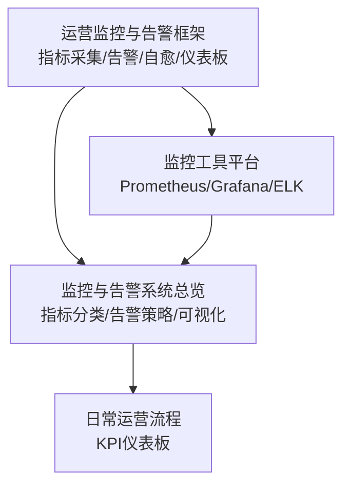
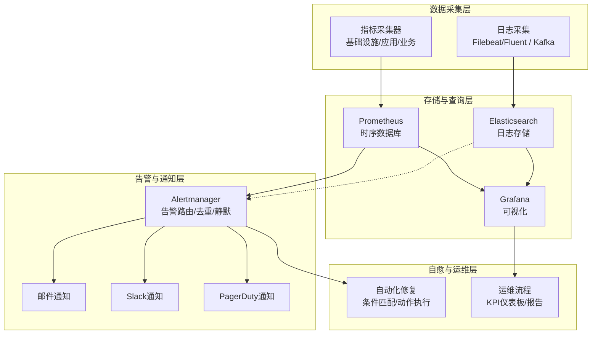
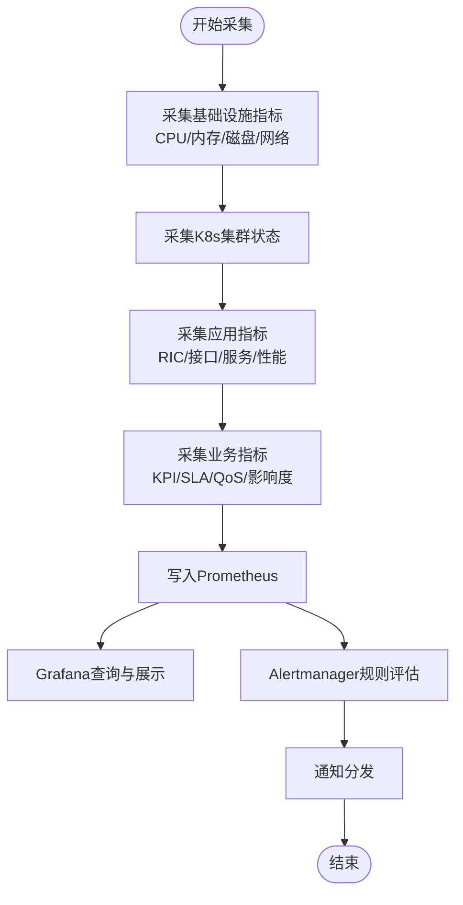
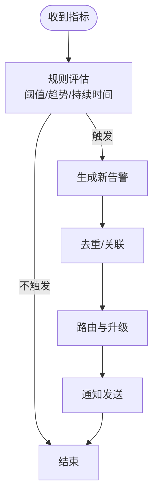
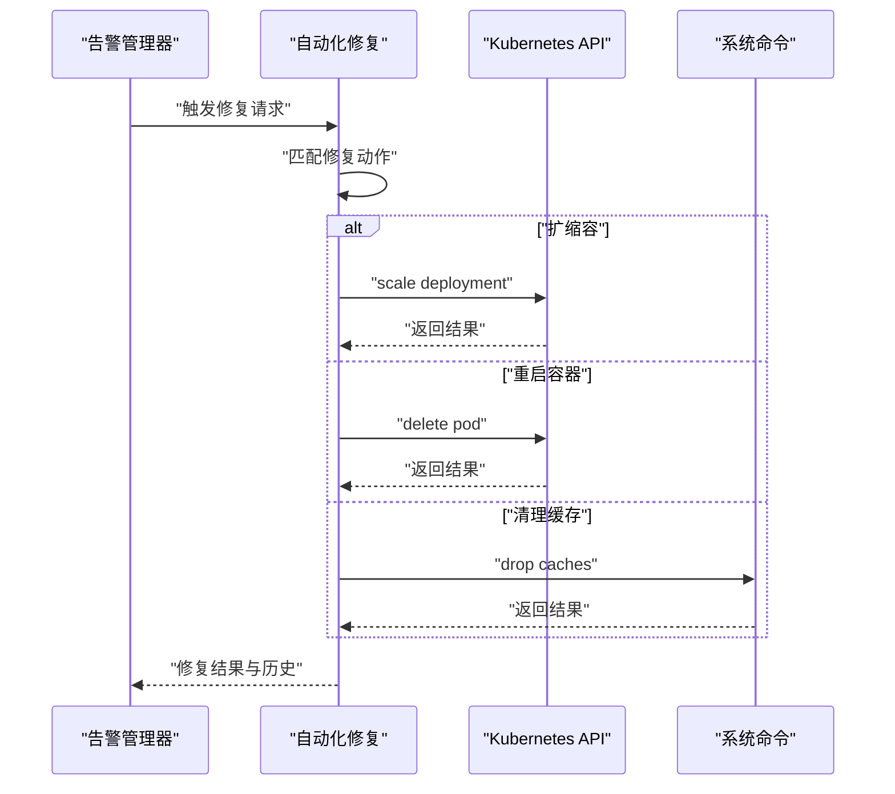
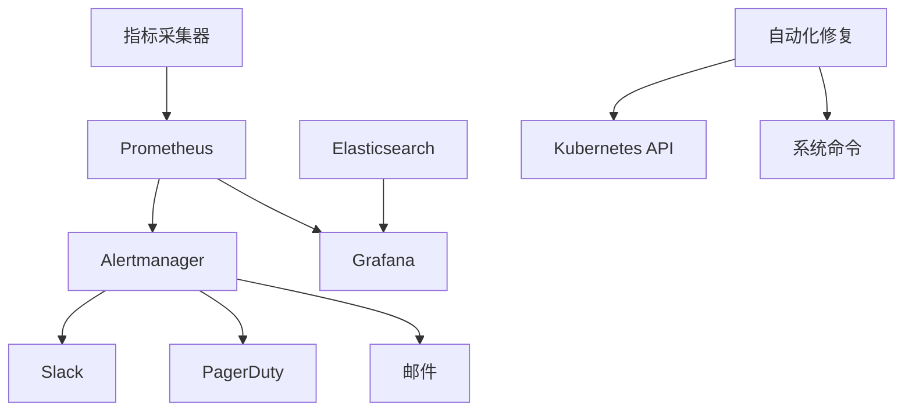

# 监控告警系统

<cite>
**本文引用的文件**
- [O-RAN 运营监控告警系统（英文）](file://14-operations-management/monitoring-alerting/operations-monitoring-framework.md)
- [O-RAN 运营监控告警系统（中文）](file://14-operations-management/monitoring-alerting/operations-monitoring-framework-zh.md)
- [O-RAN 监控系统（英文）](file://22-tool-platforms/monitoring-systems/o-ran-monitoring-systems.md)
- [O-RAN 监控与告警系统（总览）](file://28-monitoring-alerting/readme.md)
- [每日运营流程（KPI仪表板）](file://14-operations-management/daily-operations/daily-operation-procedures.md)
</cite>

## 目录
1. [简介](#简介)
2. [项目结构](#项目结构)
3. [核心组件](#核心组件)
4. [架构总览](#架构总览)
5. [详细组件分析](#详细组件分析)
6. [依赖关系分析](#依赖关系分析)
7. [性能考量](#性能考量)
8. [故障排查指南](#故障排查指南)
9. [结论](#结论)
10. [附录](#附录)

## 简介
本文件面向O-RAN网络的监控与告警体系建设，基于仓库中的运营监控框架、工具平台与指标体系文档，提供一套可落地的监控指导：覆盖指标体系、采集与存储、告警策略、可视化展示、工具链建设与运维管理，并给出最佳实践与常见问题处理建议。

## 项目结构
围绕监控告警主题，相关知识分布在以下目录与文件：
- 运营监控与告警框架（含指标采集、告警引擎、自愈动作、仪表板）
- 监控工具平台（Prometheus/Grafana/ELK等栈）
- 监控与告警系统总览（指标分类、告警分级、可视化与报告）
- 日常运营流程（KPI仪表板示例）

**章节来源**
- file://14-operations-management/monitoring-alerting/operations-monitoring-framework.md#L1-L909
- file://22-tool-platforms/monitoring-systems/o-ran-monitoring-systems.md#L1-L545
- file://28-monitoring-alerting/readme.md#L1-L95
- file://14-operations-management/daily-operations/daily-operation-procedures.md#L361-L407

## 核心组件
- 指标采集与存储
  - 多层指标采集：基础设施、应用、业务层
  - 时间序列存储与查询：Prometheus、Grafana、长期存储（Thanos/Cortex）
- 告警管理
  - 阈值型告警、告警规则、去重与关联
  - 通知通道：邮件、Slack、PagerDuty、短信等
- 可视化与仪表板
  - 实时仪表板、趋势图、告警中心、拓扑图
- 自动化修复（自愈）
  - 条件匹配、动作编排、执行与历史记录

**章节来源**
- file://14-operations-management/monitoring-alerting/operations-monitoring-framework.md#L46-L260
- file://22-tool-platforms/monitoring-systems/o-ran-monitoring-systems.md#L80-L131
- file://22-tool-platforms/monitoring-systems/o-ran-monitoring-systems.md#L355-L413
- file://14-operations-management/monitoring-alerting/operations-monitoring-framework.md#L694-L907

## 架构总览
下图展示了O-RAN监控告警系统的整体架构：从指标采集、存储与查询，到告警规则与通知，再到可视化与自愈动作。

**图示来源**
- [O-RAN 监控系统（英文）](file://22-tool-platforms/monitoring-systems/o-ran-monitoring-systems.md#L10-L78)
- [O-RAN 运营监控告警系统（英文）](file://14-operations-management/monitoring-alerting/operations-monitoring-framework.md#L262-L486)
- [O-RAN 运营监控告警系统（英文）](file://14-operations-management/monitoring-alerting/operations-monitoring-framework.md#L694-L907)

## 详细组件分析

### 指标体系与采集
- 分层指标
  - 基础设施：CPU、内存、磁盘、网络；Kubernetes状态、存储IOPS、利用率
  - 应用：RIC健康、接口可用性、服务响应时间、消息吞吐、性能基准
  - 业务：KPI、SLA、QoS、业务影响度
- 采集方式
  - 本地系统指标：psutil、系统接口
  - 容器与集群：Kubernetes API、Node Exporter
  - 自定义导出器：O-RAN特有指标（如E2/A1/O1接口、用户面吞吐）
- 存储与查询
  - Prometheus：抓取、聚合、告警规则、查询
  - Grafana：面板、图表、告警联动
  - 长期存储：Thanos/Cortex联邦与归档

**图示来源**
- [O-RAN 运营监控告警系统（英文）](file://14-operations-management/monitoring-alerting/operations-monitoring-framework.md#L46-L260)
- [O-RAN 监控系统（英文）](file://22-tool-platforms/monitoring-systems/o-ran-monitoring-systems.md#L10-L78)

**章节来源**
- file://14-operations-management/monitoring-alerting/operations-monitoring-framework.md#L46-L260
- file://22-tool-platforms/monitoring-systems/o-ran-monitoring-systems.md#L10-L78

### 告警策略设计
- 告警级别
  - 关键（Critical）、主要（Major）、次要（Minor）、警告（Warning）
- 规则设计
  - 阈值型规则：持续时间、趋势、聚合窗口
  - 告警关联：噪声抑制、重复告警抑制、依赖抑制、时段抑制、智能聚合
- 通知与升级
  - 多通道通知：邮件、Slack、PagerDuty、短信
  - 分级路由：按严重级别与组件类型路由至不同接收人

**图示来源**
- [O-RAN 运营监控告警系统（英文）](file://14-operations-management/monitoring-alerting/operations-monitoring-framework.md#L262-L486)
- [O-RAN 监控系统（英文）](file://22-tool-platforms/monitoring-systems/o-ran-monitoring-systems.md#L355-L413)

**章节来源**
- file://22-tool-platforms/monitoring-systems/o-ran-monitoring-systems.md#L355-L413
- file://28-monitoring-alerting/readme.md#L26-L48

### 可视化与仪表板
- 仪表板组成
  - 总览面板：系统健康、关键指标
  - 网络拓扑与流量：设备连接关系、状态指示
  - 趋势与预测：历史趋势、异常检测
  - 告警中心：实时告警列表、处理状态、历史记录
- 报表生成
  - 日报/周报/月报：性能统计、故障分析、优化建议
  - 容量规划：资源趋势、扩容建议、成本分析
  - 安全审计与业务影响：事件统计、合规检查、风险评估

**图示来源**
- [O-RAN 监控系统（英文）](file://22-tool-platforms/monitoring-systems/o-ran-monitoring-systems.md#L80-L131)
- [O-RAN 监控与告警系统（总览）](file://28-monitoring-alerting/readme.md#L49-L61)

**章节来源**
- file://22-tool-platforms/monitoring-systems/o-ran-monitoring-systems.md#L80-L131
- file://28-monitoring-alerting/readme.md#L49-L61

### 自动化修复（自愈）
- 动作框架
  - 条件匹配：基于告警标题或指标阈值
  - 动作编排：扩缩容、重启、清理缓存、驱逐Pod、检查连接
  - 执行与记录：超时控制、最大尝试次数、历史记录
- 典型场景
  - 高CPU：扩缩容部署、重启容器、清理缓存
  - 内存耗尽：重启内存密集型Pod、提升内存限制、驱逐低优先级Pod
  - RIC无响应：重启RIC容器、检查E2连接、验证数据库连通性

**图示来源**
- [O-RAN 运营监控告警系统（英文）](file://14-operations-management/monitoring-alerting/operations-monitoring-framework.md#L694-L907)

**章节来源**
- file://14-operations-management/monitoring-alerting/operations-monitoring-framework.md#L694-L907

## 依赖关系分析
- 组件耦合
  - 指标采集器与Prometheus紧密耦合，负责数据入湖
  - Alertmanager依赖Prometheus查询表达式进行规则评估
  - Grafana依赖Prometheus/ES作为数据源
  - 自动化修复依赖Kubernetes API与系统命令
- 外部依赖
  - Prometheus生态：Node Exporter、Blackbox Exporter、自定义导出器
  - 日志栈：Filebeat、Logstash、Elasticsearch
  - 通知平台：Slack、PagerDuty、邮件网关

**图示来源**
- [O-RAN 监控系统（英文）](file://22-tool-platforms/monitoring-systems/o-ran-monitoring-systems.md#L10-L78)
- [O-RAN 运营监控告警系统（英文）](file://14-operations-management/monitoring-alerting/operations-monitoring-framework.md#L262-L486)
- [O-RAN 运营监控告警系统（英文）](file://14-operations-management/monitoring-alerting/operations-monitoring-framework.md#L694-L907)

**章节来源**
- file://22-tool-platforms/monitoring-systems/o-ran-monitoring-systems.md#L10-L78
- file://14-operations-management/monitoring-alerting/operations-monitoring-framework.md#L262-L486
- file://14-operations-management/monitoring-alerting/operations-monitoring-framework.md#L694-L907

## 性能考量
- 指标规模与查询复杂度
  - 合理设置抓取间隔与保留策略，避免Prometheus膨胀
  - 使用标签规范化与指标聚合，降低Series数量
- 告警风暴防护
  - 合理设置去重与静默窗口，避免重复通知
  - 使用告警关联规则合并相似告警
- 可视化性能
  - 控制面板查询复杂度，使用降采样与预聚合
  - 对趋势图设置合理的时间窗口与采样频率

[本节为通用指导，无需具体文件引用]

## 故障排查指南
- 告警不触发/误触发
  - 检查阈值与持续时间设置是否合理
  - 核对规则表达式与指标路径
- 通知未送达
  - 核对通知通道配置与凭据
  - 检查Alertmanager路由与接收器配置
- 自愈动作失败
  - 查看动作执行历史与错误信息
  - 确认Kubernetes权限与命令可用性
- 可视化异常
  - 检查数据源连接与查询表达式
  - 核对Grafana版本与插件兼容性

**章节来源**
- file://22-tool-platforms/monitoring-systems/o-ran-monitoring-systems.md#L355-L413
- file://14-operations-management/monitoring-alerting/operations-monitoring-framework.md#L262-L486
- file://14-operations-management/monitoring-alerting/operations-monitoring-framework.md#L694-L907

## 结论
本指导以仓库中的运营监控框架与工具平台文档为基础，构建了从指标体系、采集存储、告警策略、可视化到自动化修复的完整闭环。结合日常运营流程与报告体系，可形成端到端的O-RAN监控告警能力，支撑网络性能与业务连续性目标。

[本节为总结性内容，无需具体文件引用]

## 附录

### 监控工具链选型与集成
- 开源方案
  - Prometheus（采集与存储）、Grafana（可视化）、Alertmanager（告警）、ELK（日志）
- 商业平台
  - Splunk（企业日志分析）、Datadog（云监控）、New Relic（应用监控）、Dynatrace（全栈监控）

**章节来源**
- file://28-monitoring-alerting/readme.md#L63-L76

### 运维管理要点
- 配置管理
  - 标准化抓取任务与告警规则模板
  - 版本化监控配置，纳入CI/CD
- 性能优化
  - 定期审查规则与查询，优化Series与索引
- 故障处理
  - 建立标准化处置流程与知识库
- 容量规划
  - 基于历史趋势与业务增长预测制定扩容策略

**章节来源**
- file://28-monitoring-alerting/readme.md#L77-L95

### 日常运营仪表板示例
- KPI仪表板包含：系统可用性、接口延迟、活动连接数等关键指标
- 刷新策略与阈值设定，确保实时性与稳定性

**章节来源**
- file://14-operations-management/daily-operations/daily-operation-procedures.md#L361-L407