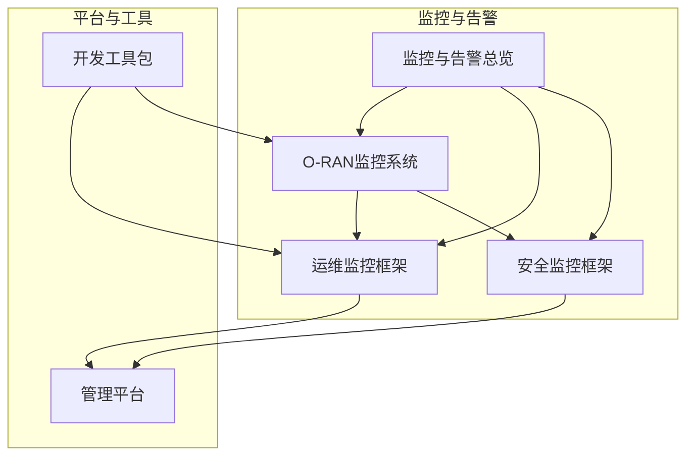
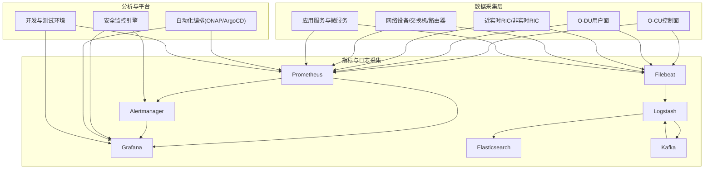
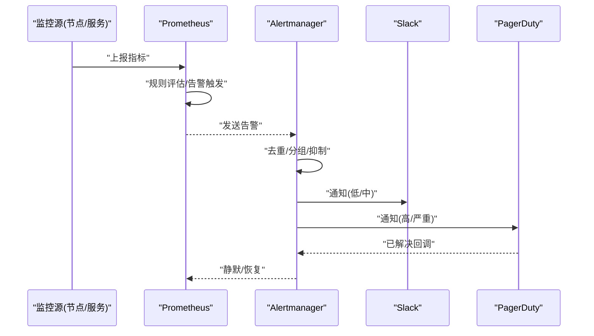
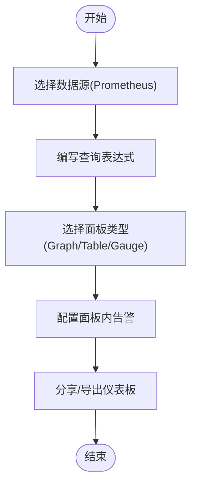
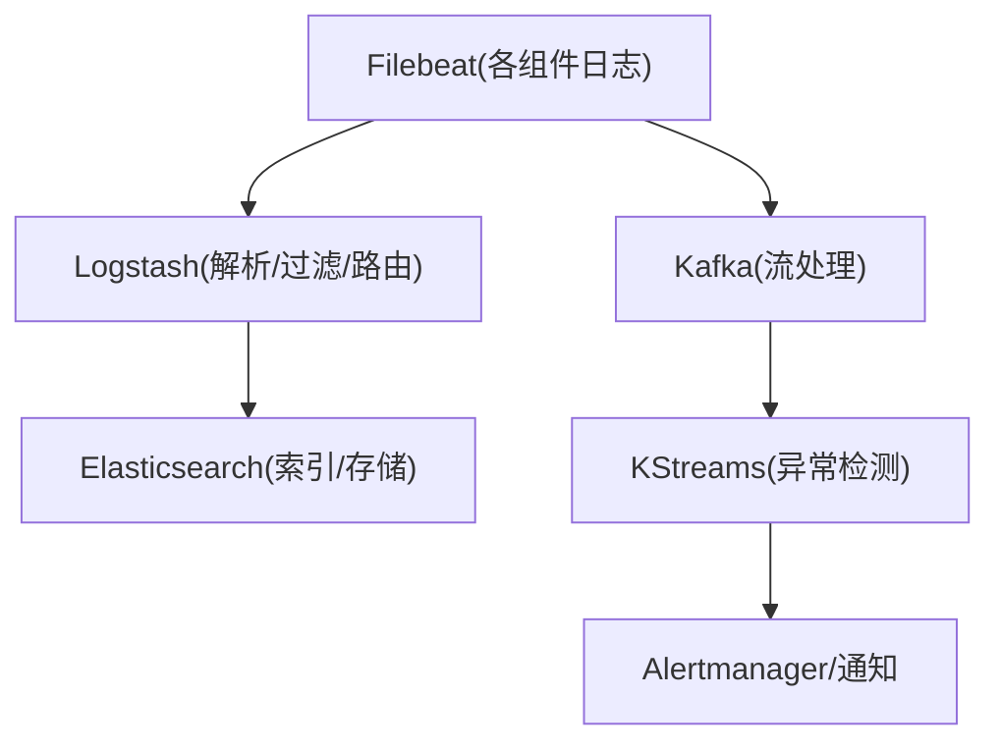
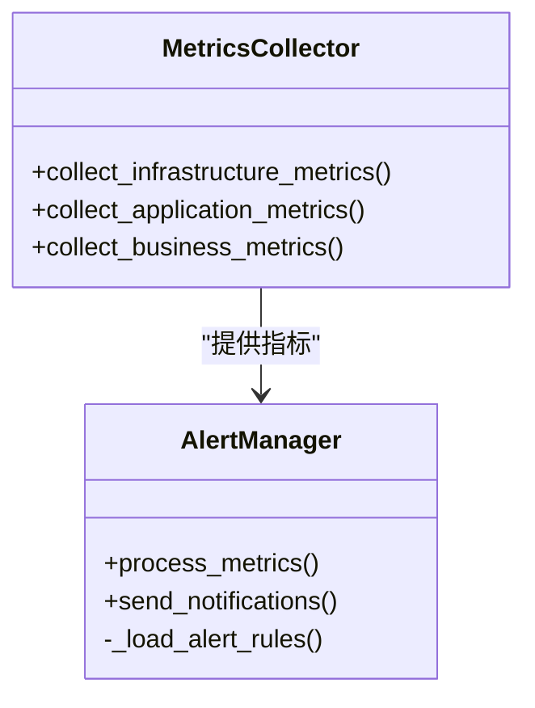
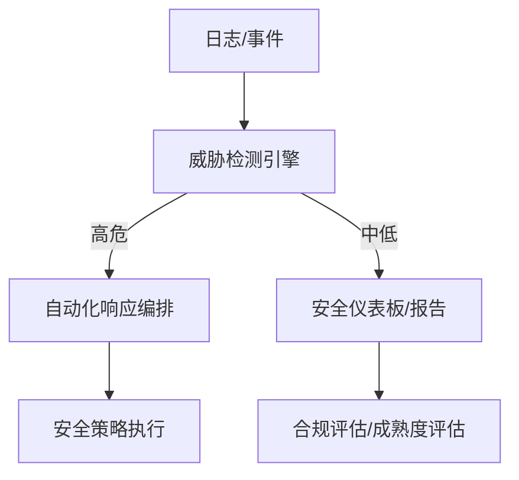
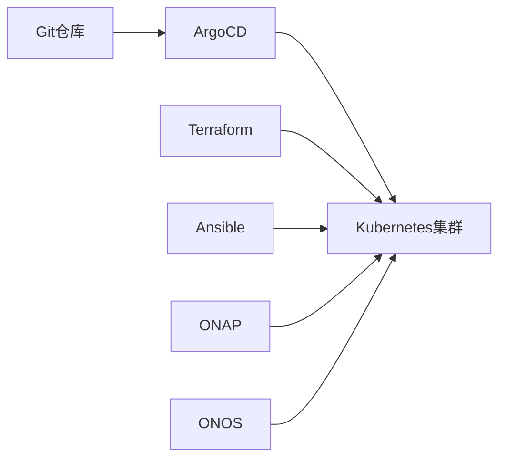
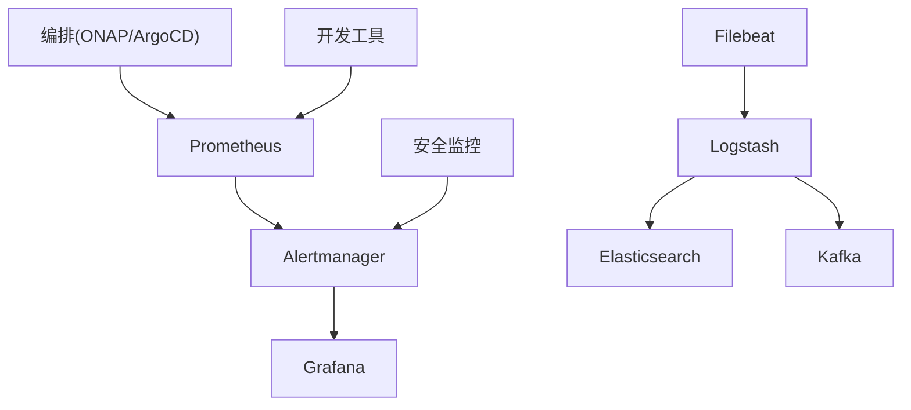

# 监控工具链

<cite>
**本文引用的文件**
- [监控与告警总览](file://28-monitoring-alerting/readme.md)
- [O-RAN监控系统](file://22-tool-platforms/monitoring-systems/o-ran-monitoring-systems.md)
- [O-RAN运维监控框架](file://14-operations-management/monitoring-alerting/operations-monitoring-framework.md)
- [O-RAN安全监控框架](file://12-security-privacy/monitoring-alerting/security-monitoring-framework.md)
- [O-RAN管理平台](file://22-tool-platforms/management-platforms/o-ran-management-platforms.md)
- [O-RAN开发工具包](file://22-tool-platforms/development-tools/o-ran-development-toolkit.md)
</cite>

## 目录
1. [简介](#简介)
2. [项目结构](#项目结构)
3. [核心组件](#核心组件)
4. [架构总览](#架构总览)
5. [详细组件分析](#详细组件分析)
6. [依赖关系分析](#依赖关系分析)
7. [性能考量](#性能考量)
8. [故障排查指南](#故障排查指南)
9. [结论](#结论)
10. [附录](#附录)

## 简介
本文件面向O-RAN网络的监控工具链，围绕开源监控（Prometheus/Grafana/Alertmanager/ELK）与商业平台（Splunk/Datadog/New Relic/Dynatrace），结合O-RAN特有的控制面、用户面、RIC与接口特性，提供从指标采集、存储、可视化、告警、日志分析到故障诊断与预测性维护的完整方案。文档同时给出选型评估标准、实施指南与整体架构设计，帮助读者按需构建高可用、可观测、可扩展的O-RAN监控体系。

## 项目结构
本仓库中与监控工具链直接相关的内容主要分布在以下目录：
- 28-monitoring-alerting：监控与告警总览、指标体系、可视化与最佳实践
- 22-tool-platforms/monitoring-systems：O-RAN专用监控系统（Prometheus/Grafana/ELK/Alertmanager）
- 14-operations-management/monitoring-alerting：运维监控架构、指标采集框架、告警引擎
- 12-security-privacy/monitoring-alerting：安全监控与威胁检测
- 22-tool-platforms/management-platforms：SDN控制器、自动化编排与平台集成
- 22-tool-platforms/development-tools：开发环境、容器与CI/CD工具链

**图表来源**
- [监控与告警总览](file://28-monitoring-alerting/readme.md#L1-L95)
- [O-RAN监控系统](file://22-tool-platforms/monitoring-systems/o-ran-monitoring-systems.md#L1-L545)
- [O-RAN运维监控框架](file://14-operations-management/monitoring-alerting/operations-monitoring-framework.md#L1-L909)
- [O-RAN安全监控框架](file://12-security-privacy/monitoring-alerting/security-monitoring-framework.md#L1-L733)
- [O-RAN管理平台](file://22-tool-platforms/management-platforms/o-ran-management-platforms.md#L1-L711)
- [O-RAN开发工具包](file://22-tool-platforms/development-tools/o-ran-development-toolkit.md#L1-L488)

**章节来源**
- [监控与告警总览](file://28-monitoring-alerting/readme.md#L1-L95)
- [O-RAN监控系统](file://22-tool-platforms/monitoring-systems/o-ran-monitoring-systems.md#L1-L545)
- [O-RAN运维监控框架](file://14-operations-management/monitoring-alerting/operations-monitoring-framework.md#L1-L909)
- [O-RAN安全监控框架](file://12-security-privacy/monitoring-alerting/security-monitoring-framework.md#L1-L733)
- [O-RAN管理平台](file://22-tool-platforms/management-platforms/o-ran-management-platforms.md#L1-L711)
- [O-RAN开发工具包](file://22-tool-platforms/development-tools/o-ran-development-toolkit.md#L1-L488)

## 核心组件
- 指标采集与存储
  - Prometheus：O-RAN控制面、用户面、RIC的指标采集与长期存储（含联邦/高可用）
  - 自定义导出器与黑盒探测，覆盖基础设施、网络设备、应用服务与业务KPI
- 可视化与仪表板
  - Grafana：O-RAN网络性能总览、RAN组件健康度、RIC性能指标等
- 告警与通知
  - Alertmanager：路由、去重、静默、抑制规则；与Slack、PagerDuty等集成
- 日志与分析
  - ELK Stack：Filebeat输入、Logstash解析与GeoIP增强、Elasticsearch索引策略
  - Kafka流处理：实时日志分析、异常检测与告警生成
- 安全监控与合规
  - 多层安全指标采集、威胁检测引擎、合规检查脚本、自动化响应编排
- 平台与自动化
  - SDN控制器（ONOS/OpenDaylight）、ONAP编排、Ansible/ArgoCD/CI流程
  - Helm/Kubernetes部署、容器镜像与本地开发集群

**章节来源**
- [O-RAN监控系统](file://22-tool-platforms/monitoring-systems/o-ran-monitoring-systems.md#L10-L78)
- [O-RAN运维监控框架](file://14-operations-management/monitoring-alerting/operations-monitoring-framework.md#L8-L44)
- [O-RAN安全监控框架](file://12-security-privacy/monitoring-alerting/security-monitoring-framework.md#L8-L31)
- [O-RAN管理平台](file://22-tool-platforms/management-platforms/o-ran-management-platforms.md#L8-L72)

## 架构总览
下图展示O-RAN监控工具链的整体数据流与组件交互：从各网元与组件导出/上报指标与日志，经Prometheus与ELK进行采集与处理，再由Grafana呈现仪表板，Alertmanager统一告警路由并通知，同时结合安全监控与自动化编排提升运维效率。

**图表来源**
- [O-RAN监控系统](file://22-tool-platforms/monitoring-systems/o-ran-monitoring-systems.md#L10-L78)
- [O-RAN监控系统](file://22-tool-platforms/monitoring-systems/o-ran-monitoring-systems.md#L135-L211)
- [O-RAN运维监控框架](file://14-operations-management/monitoring-alerting/operations-monitoring-framework.md#L46-L260)
- [O-RAN安全监控框架](file://12-security-privacy/monitoring-alerting/security-monitoring-framework.md#L33-L117)
- [O-RAN管理平台](file://22-tool-platforms/management-platforms/o-ran-management-platforms.md#L136-L206)

## 详细组件分析

### Prometheus与Alertmanager（指标采集与告警）
- 采集目标与任务
  - 控制面：O-CU CP节点
  - 用户面：O-DU节点
  - RIC：近实时RIC实例
  - 黑盒探测：服务可用性测试
- 报警规则示例
  - E2接口延迟阈值、用户面吞吐量异常等
- Alertmanager路由
  - 按严重级别与组件分发至Slack/PagerDuty等接收器
  - 支持分组、等待、间隔与重复抑制

**图表来源**
- [O-RAN监控系统](file://22-tool-platforms/monitoring-systems/o-ran-monitoring-systems.md#L29-L78)
- [O-RAN监控系统](file://22-tool-platforms/monitoring-systems/o-ran-monitoring-systems.md#L376-L413)

**章节来源**
- [O-RAN监控系统](file://22-tool-platforms/monitoring-systems/o-ran-monitoring-systems.md#L10-L78)
- [O-RAN监控系统](file://22-tool-platforms/monitoring-systems/o-ran-monitoring-systems.md#L376-L413)

### Grafana仪表板生态
- O-RAN专用面板
  - 网络性能总览、地理覆盖、流量模式、QoS指标
  - RAN组件健康度（O-CU/O-DU状态、前传链路质量、处理负载）
  - RIC性能（xApp/rApp表现、策略执行效果、模型准确率）
- 配置示例
  - 面板查询、告警条件、注解与时间线面板

**图表来源**
- [O-RAN监控系统](file://22-tool-platforms/monitoring-systems/o-ran-monitoring-systems.md#L80-L131)

**章节来源**
- [O-RAN监控系统](file://22-tool-platforms/monitoring-systems/o-ran-monitoring-systems.md#L80-L131)

### ELK日志采集与分析
- Filebeat：多行解析、字段提取、SSL传输、多实例负载均衡
- Logstash：O-RAN日志格式Grok、GeoIP增强、协议标签与输出路由
- Elasticsearch：生命周期策略、跨集群复制、热/温/冷分层、安全访问控制
- 实时分析：Kafka流处理（KStreams）进行异常检测与告警下发

**图表来源**
- [O-RAN监控系统](file://22-tool-platforms/monitoring-systems/o-ran-monitoring-systems.md#L135-L211)
- [O-RAN监控系统](file://22-tool-platforms/monitoring-systems/o-ran-monitoring-systems.md#L215-L263)

**章节来源**
- [O-RAN监控系统](file://22-tool-platforms/monitoring-systems/o-ran-monitoring-systems.md#L135-L211)
- [O-RAN监控系统](file://22-tool-platforms/monitoring-systems/o-ran-monitoring-systems.md#L215-L263)

### 运维监控与告警引擎
- 多层监控体系
  - 基础设施层、虚拟资源层、应用层（RIC/接口/服务）、业务层（KPI/SLA/体验）
- 指标采集框架
  - 系统指标（CPU/内存/磁盘/网络）、K8s状态、存储与网络接口
  - 应用指标（RIC健康、接口可用性、服务响应时间、事务量）
  - 业务指标（连接用户数、可用性、QoE、收入影响事件）
- 智能告警引擎
  - 阈值规则、持续时间、分类与严重等级
  - 告警关联与去抖、通知通道（邮件/Slack/PagerDuty/SMS）

**图表来源**
- [O-RAN运维监控框架](file://14-operations-management/monitoring-alerting/operations-monitoring-framework.md#L48-L260)
- [O-RAN运维监控框架](file://14-operations-management/monitoring-alerting/operations-monitoring-framework.md#L266-L486)

**章节来源**
- [O-RAN运维监控框架](file://14-operations-management/monitoring-alerting/operations-monitoring-framework.md#L8-L44)
- [O-RAN运维监控框架](file://14-operations-management/monitoring-alerting/operations-monitoring-framework.md#L46-L260)
- [O-RAN运维监控框架](file://14-operations-management/monitoring-alerting/operations-monitoring-framework.md#L266-L486)

### 安全监控与合规
- 多层安全监控
  - 网络层（流量分析/协议校验/入侵检测）、应用层（API安全/认证日志/权限审计）、系统层（容器安全/主机入侵检测/基线漂移）、数据层（加密合规/数据防泄漏/密钥审计）
- 威胁检测与告警
  - 布式攻击、端口扫描、数据外泄等模式匹配与告警
- 合规检查
  - 自动化脚本检查加密标准、访问控制、防火墙与不必要服务
- 自动化响应编排
  - 基于Playbook的阻断可疑IP、禁用受损账户、取证与通知

**图表来源**
- [O-RAN安全监控框架](file://12-security-privacy/monitoring-alerting/security-monitoring-framework.md#L119-L217)
- [O-RAN安全监控框架](file://12-security-privacy/monitoring-alerting/security-monitoring-framework.md#L306-L440)
- [O-RAN安全监控框架](file://12-security-privacy/monitoring-alerting/security-monitoring-framework.md#L518-L637)

**章节来源**
- [O-RAN安全监控框架](file://12-security-privacy/monitoring-alerting/security-monitoring-framework.md#L6-L31)
- [O-RAN安全监控框架](file://12-security-privacy/monitoring-alerting/security-monitoring-framework.md#L119-L217)
- [O-RAN安全监控框架](file://12-security-privacy/monitoring-alerting/security-monitoring-framework.md#L306-L440)
- [O-RAN安全监控框架](file://12-security-privacy/monitoring-alerting/security-monitoring-framework.md#L518-L637)

### 平台与自动化编排
- SDN控制器集成
  - ONOS/OpenDaylight的北向/南向接口、YANG模型、集群配置与应用集成
- ONAP编排
  - TOSCA模板、服务/资源编排、策略框架、意图化管理
- 自动化与GitOps
  - ArgoCD应用配置、ArgoCD Application资源、Helm参数化
  - Terraform模块化基础设施（多云/混合云）、安全组与子网划分
- Ansible自动化
  - 角色化部署（O-DU/O-CU/Near-RT RIC/监控栈）、验证与归档

**图表来源**
- [O-RAN管理平台](file://22-tool-platforms/management-platforms/o-ran-management-platforms.md#L136-L206)
- [O-RAN管理平台](file://22-tool-platforms/management-platforms/o-ran-management-platforms.md#L538-L616)
- [O-RAN管理平台](file://22-tool-platforms/management-platforms/o-ran-management-platforms.md#L618-L709)

**章节来源**
- [O-RAN管理平台](file://22-tool-platforms/management-platforms/o-ran-management-platforms.md#L8-L72)
- [O-RAN管理平台](file://22-tool-platforms/management-platforms/o-ran-management-platforms.md#L136-L206)
- [O-RAN管理平台](file://22-tool-platforms/management-platforms/o-ran-management-platforms.md#L538-L616)
- [O-RAN管理平台](file://22-tool-platforms/management-platforms/o-ran-management-platforms.md#L618-L709)

### 开发工具与测试
- IDE与代码质量
  - VS Code扩展、JetBrains配置、SonarQube与多语言静态分析
- 协议分析与仿真
  - Wireshark O-RAN解析器、NS-3扩展（PHY/eCPRI/E2/O1）
- 容器与Kubernetes
  - Docker多阶段构建、Compose开发环境、kind/minikube/k3d本地集群
- API与测试
  - OpenAPI规范、Postman/Newman、契约测试与性能测试
- CI/CD流水线
  - GitHub Actions工作流、Docker镜像安全扫描、覆盖率与报告

**章节来源**
- [O-RAN开发工具包](file://22-tool-platforms/development-tools/o-ran-development-toolkit.md#L64-L109)
- [O-RAN开发工具包](file://22-tool-platforms/development-tools/o-ran-development-toolkit.md#L111-L173)
- [O-RAN开发工具包](file://22-tool-platforms/development-tools/o-ran-development-toolkit.md#L174-L257)
- [O-RAN开发工具包](file://22-tool-platforms/development-tools/o-ran-development-toolkit.md#L259-L366)
- [O-RAN开发工具包](file://22-tool-platforms/development-tools/o-ran-development-toolkit.md#L419-L488)

## 依赖关系分析
- 组件耦合
  - Prometheus与Alertmanager强耦合，Grafana依赖Prometheus作为数据源
  - ELK与Kafka形成日志流处理闭环，Logstash与Elasticsearch紧密耦合
  - 安全监控与告警引擎通过统一告警通道联动
- 外部依赖
  - SDN控制器（ONOS/OpenDaylight）与网络设备/控制器协议
  - ONAP与TOSCA模板、策略与编排能力
  - GitOps与基础设施即代码（ArgoCD/Terraform）
- 循环依赖
  - 文档中未发现循环依赖；监控与平台之间以接口/配置形式解耦

**图表来源**
- [O-RAN监控系统](file://22-tool-platforms/monitoring-systems/o-ran-monitoring-systems.md#L10-L78)
- [O-RAN监控系统](file://22-tool-platforms/monitoring-systems/o-ran-monitoring-systems.md#L135-L211)
- [O-RAN运维监控框架](file://14-operations-management/monitoring-alerting/operations-monitoring-framework.md#L46-L260)
- [O-RAN安全监控框架](file://12-security-privacy/monitoring-alerting/security-monitoring-framework.md#L119-L217)
- [O-RAN管理平台](file://22-tool-platforms/management-platforms/o-ran-management-platforms.md#L136-L206)

**章节来源**
- [O-RAN监控系统](file://22-tool-platforms/monitoring-systems/o-ran-monitoring-systems.md#L10-L78)
- [O-RAN监控系统](file://22-tool-platforms/monitoring-systems/o-ran-monitoring-systems.md#L135-L211)
- [O-RAN运维监控框架](file://14-operations-management/monitoring-alerting/operations-monitoring-framework.md#L46-L260)
- [O-RAN安全监控框架](file://12-security-privacy/monitoring-alerting/security-monitoring-framework.md#L119-L217)
- [O-RAN管理平台](file://22-tool-platforms/management-platforms/o-ran-management-platforms.md#L136-L206)

## 性能考量
- 指标规模与存储
  - 使用Prometheus联邦或Thanos/Cortex扩展，合理设置保留周期与压缩策略
- 查询与告警
  - 谨慎设计规则表达式，避免高基数标签风暴；利用分组与抑制减少噪声
- 日志处理
  - Logstash并发与缓冲区配置、Elasticsearch分片与副本策略、索引生命周期管理
- 实时分析
  - Kafka分区与副本、消费者组平衡、背压与重试策略
- 安全与合规
  - 加密传输与访问控制、定期合规扫描与基线对比

## 故障排查指南
- 告警风暴与误报
  - 检查重复告警、阈值回滞、季节性模式识别；调整分组与抑制规则
- 指标缺失或延迟
  - 校验导出器连通性、抓取间隔与超时、Relabel与标签规范化
- 日志解析失败
  - 校验Grok模式、时间字段、GeoIP映射与输出路由
- 安全事件响应
  - 回放事件流、验证自动化动作、更新Playbook并复盘

**章节来源**
- [O-RAN监控系统](file://22-tool-platforms/monitoring-systems/o-ran-monitoring-systems.md#L359-L413)
- [O-RAN运维监控框架](file://14-operations-management/monitoring-alerting/operations-monitoring-framework.md#L488-L528)
- [O-RAN安全监控框架](file://12-security-privacy/monitoring-alerting/security-monitoring-framework.md#L442-L516)

## 结论
本方案以Prometheus为核心指标体系，结合Grafana可视化与Alertmanager统一告警，辅以ELK进行日志采集与分析，并通过安全监控与自动化编排提升整体可观测性与运维效率。针对O-RAN特性，建议优先覆盖控制面、用户面、接口与RIC关键指标，配合安全合规与预测性维护能力，构建端到端的监控工具链。

## 附录

### 选型评估标准
- 功能覆盖
  - 是否支持O-RAN关键接口与组件（E2/A1/O1、O-DU/O-CU、RIC）
- 易用性
  - 部署复杂度、配置门槛、文档与社区支持
- 扩展性
  - 水平扩展、联邦/多租户、插件与自定义能力
- 成本
  - 许可证、硬件/云资源、运维人力成本
- 集成能力
  - 与现有SDN/编排/CI流程的对接程度

### 实施指南
- 分阶段落地
  - 第一阶段：Prometheus+Grafana+Alertmanager基础监控
  - 第二阶段：ELK日志与Kafka流处理
  - 第三阶段：安全监控与自动化编排
- 最佳实践
  - 标签规范化、规则分层、告警分级与抑制、可视化分层、合规与安全双轨制