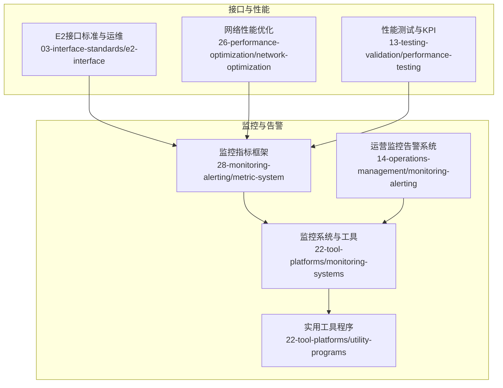
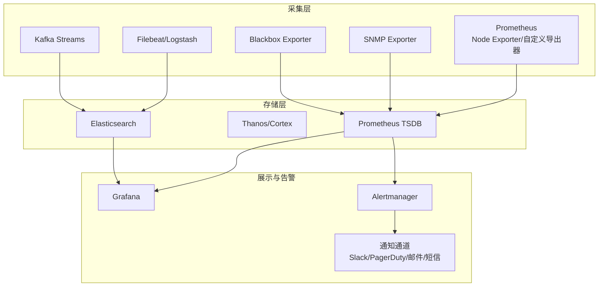
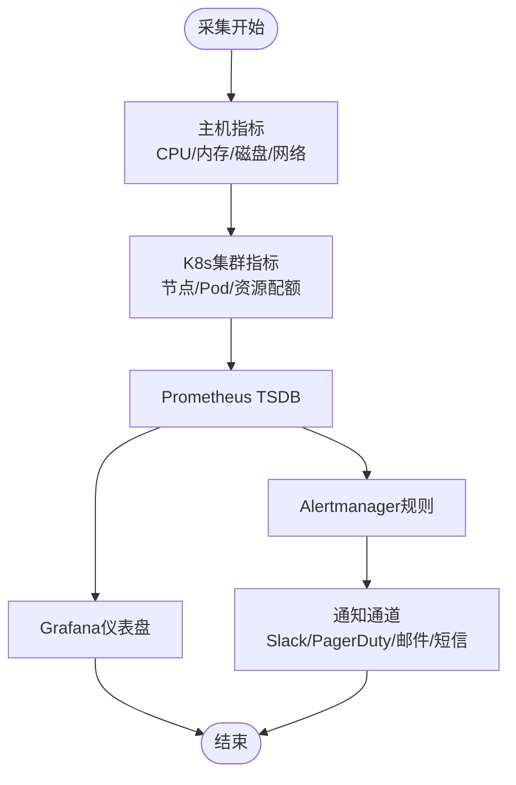
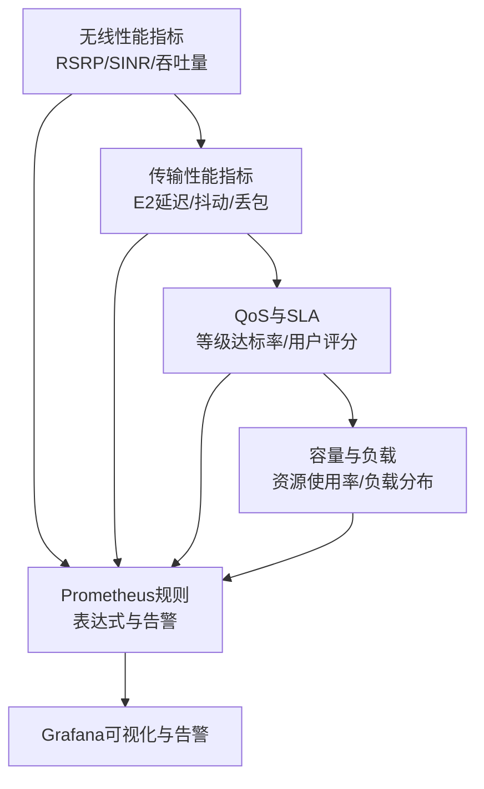
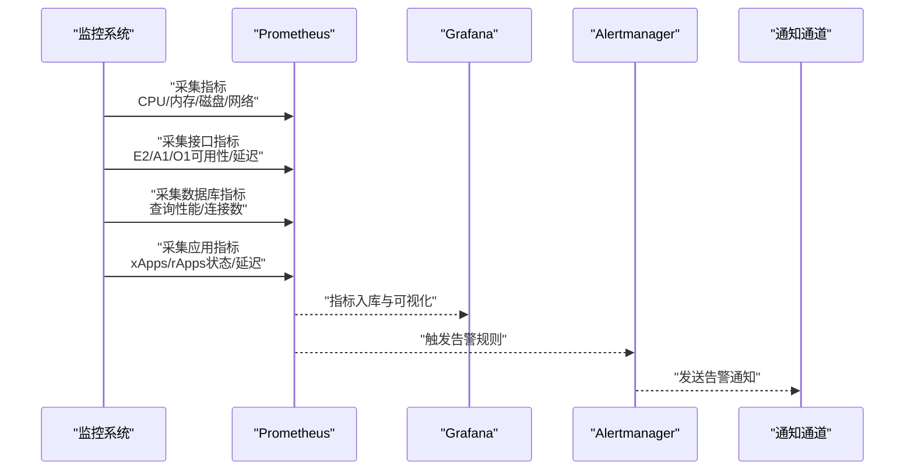
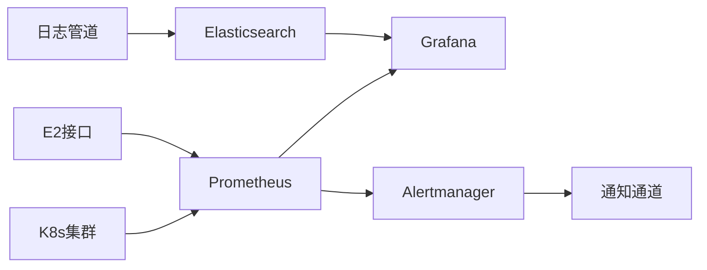

# 监控指标体系

<cite>
**本文引用的文件**
- [监控指标框架.md](file://28-monitoring-alerting/metric-system/monitoring-metrics-framework.md)
- [O-RAN监控系统.md](file://22-tool-platforms/monitoring-systems/o-ran-monitoring-systems.md)
- [O-RAN运营监控告警系统.md](file://14-operations-management/monitoring-alerting/operations-monitoring-framework.md)
- [E2接口.md](file://03-interface-standards/e2-interface.md)
- [O-RAN监控系统.md](file://22-tool-platforms/monitoring-systems/o-ran-monitoring-systems.md)
- [O-RAN工具程序.md](file://22-tool-platforms/utility-programs/o-ran-utility-programs.md)
- [网络性能优化.md](file://26-performance-optimization/network-optimization/network-performance-tuning.md)
- [性能测试.md](file://13-testing-validation/performance-testing/performance-testing-zh.md)
- [监控告警总览.md](file://28-monitoring-alerting/readme.md)
</cite>

## 目录
1. [简介](#简介)
2. [项目结构](#项目结构)
3. [核心组件](#核心组件)
4. [架构总览](#架构总览)
5. [详细组件分析](#详细组件分析)
6. [依赖关系分析](#依赖关系分析)
7. [性能考虑](#性能考虑)
8. [故障排查指南](#故障排查指南)
9. [结论](#结论)
10. [附录](#附录)

## 简介
本文件面向O-RAN监控指标体系，围绕基础设施监控、网络性能监控、应用服务监控三大维度，结合O-RAN标准接口与云原生监控栈，提供指标定义、采集方法、阈值设置、可视化与告警策略、工具集成与数据存储的最佳实践。旨在帮助工程团队建立可落地、可扩展、可观测的O-RAN监控体系，支撑网络性能优化与业务SLA达成。

## 项目结构
本仓库中与监控指标体系直接相关的文档主要分布在以下目录：
- 28-monitoring-alerting：监控指标系统、告警策略与可视化
- 22-tool-platforms：监控系统与工具程序（Prometheus、Grafana、日志分析等）
- 14-operations-management：运营监控框架与告警引擎
- 03-interface-standards：接口标准（E2等）及其运维要点
- 26-performance-optimization：网络性能优化与KPI参考
- 13-testing-validation：性能测试与KPI基线
- 22-tool-platforms/utility-programs：实用工具与命令行程序

图表来源
- [监控指标框架.md](file://28-monitoring-alerting/metric-system/monitoring-metrics-framework.md#L1-L120)
- [O-RAN运营监控告警系统.md](file://14-operations-management/monitoring-alerting/operations-monitoring-framework.md#L1-L120)
- [O-RAN监控系统.md](file://22-tool-platforms/monitoring-systems/o-ran-monitoring-systems.md#L1-L120)
- [E2接口.md](file://03-interface-standards/e2-interface.md#L1-L120)
- [网络性能优化.md](file://26-performance-optimization/network-optimization/network-performance-tuning.md#L84-L98)
- [性能测试.md](file://13-testing-validation/performance-testing/performance-testing-zh.md#L29-L327)

章节来源
- [监控指标框架.md](file://28-monitoring-alerting/metric-system/monitoring-metrics-framework.md#L1-L120)
- [O-RAN运营监控告警系统.md](file://14-operations-management/monitoring-alerting/operations-monitoring-framework.md#L1-L120)
- [O-RAN监控系统.md](file://22-tool-platforms/monitoring-systems/o-ran-monitoring-systems.md#L1-L120)

## 核心组件
- 基础设施监控：CPU、内存、磁盘I/O、网络流量、容器与K8s集群状态、虚拟化层健康度
- 网络性能监控：无线性能（RSRP、SINR、吞吐量、连接数、切换成功率）、传输性能（延迟、抖动、丢包率、带宽利用率）、QoS与SLA、容量利用率
- 应用服务监控：RIC应用（xApps/rApps运行状态、处理延迟、错误率）、接口服务（E2/A1/O1可用性、消息处理量、响应时间）、数据库（查询性能、连接数、缓存命中、锁等待）、微服务（调用链、API延迟、服务依赖）

章节来源
- [监控指标框架.md](file://28-monitoring-alerting/metric-system/monitoring-metrics-framework.md#L8-L44)
- [O-RAN运营监控告警系统.md](file://14-operations-management/monitoring-alerting/operations-monitoring-framework.md#L8-L44)
- [监控告警总览.md](file://28-monitoring-alerting/readme.md#L8-L24)

## 架构总览
O-RAN监控体系采用“三层监控”与“多工具栈”协同：
- 采集层：Prometheus、自定义导出器、SNMP导出器、黑盒探测器、日志采集（Filebeat/Logstash）、Kafka流处理
- 存储层：Prometheus TSDB、长租期存储（Thanos/Cortex）、Elasticsearch
- 展示与告警层：Grafana仪表盘、Alertmanager、通知通道（Slack、PagerDuty、邮件、短信/微信）
- 运维层：自动化巡检、健康检查脚本、备份与恢复、故障诊断与根因分析

图表来源
- [O-RAN监控系统.md](file://22-tool-platforms/monitoring-systems/o-ran-monitoring-systems.md#L10-L78)
- [O-RAN工具程序.md](file://22-tool-platforms/utility-programs/o-ran-utility-programs.md#L175-L233)

章节来源
- [O-RAN监控系统.md](file://22-tool-platforms/monitoring-systems/o-ran-monitoring-systems.md#L10-L78)
- [O-RAN工具程序.md](file://22-tool-platforms/utility-programs/o-ran-utility-programs.md#L175-L233)

## 详细组件分析

### 基础设施监控指标
- 指标类别
  - 物理资源：CPU使用率、内存占用、磁盘I/O、网络吞吐
  - 虚拟资源：容器/Pod资源消耗、K8s集群健康、VM资源利用率、宿主机虚拟化层状态
- 采集方法
  - Node Exporter采集主机指标；Prometheus按job拉取；K8s指标通过聚合代理或直接抓取
  - 容器指标可通过cAdvisor或Prometheus Node Exporter采集
- 阈值设置
  - CPU：>85%持续5分钟告警；>95%持续2分钟严重
  - 内存：>95%持续2分钟严重；>90%持续3分钟一般
  - 磁盘：使用率>90%持续5分钟告警；>95%持续1分钟严重
  - 网络：错误率>阈值、带宽利用率>阈值、丢包率>阈值触发告警
- 可视化与告警
  - Grafana仪表盘展示CPU/内存/磁盘/网络趋势与告警中心
  - Alertmanager去重、静默与抑制规则，按严重等级路由至不同通知渠道

图表来源
- [O-RAN运营监控告警系统.md](file://14-operations-management/monitoring-alerting/operations-monitoring-framework.md#L48-L130)
- [O-RAN监控系统.md](file://22-tool-platforms/monitoring-systems/o-ran-monitoring-systems.md#L10-L78)

章节来源
- [O-RAN运营监控告警系统.md](file://14-operations-management/monitoring-alerting/operations-monitoring-framework.md#L48-L130)
- [O-RAN监控系统.md](file://22-tool-platforms/monitoring-systems/o-ran-monitoring-systems.md#L10-L78)

### 网络性能监控指标
- 无线性能
  - RSRP、SINR、吞吐量、连接数、切换成功率、时延/抖动/丢包率
- 传输性能
  - E2接口延迟、抖动、丢包率、吞吐量；前传链路带宽利用率、同步精度
- QoS与SLA
  - QoS等级达标率、SLA达成率、用户感知评分（如VoIP/视频质量）
- 容量与负载
  - 资源使用率、负载分布、瓶颈识别
- 采集与阈值
  - Prometheus表达式规则：如E2消息平均延迟、用户面吞吐低于阈值触发告警
  - Grafana图表联动告警，结合历史趋势与预测模型
- 参考KPI
  - 无线KPI目标与测量方法、端到端时延、控制面时延、峰值吞吐量、切换成功率等

图表来源
- [监控指标框架.md](file://28-monitoring-alerting/metric-system/monitoring-metrics-framework.md#L14-L18)
- [O-RAN监控系统.md](file://22-tool-platforms/monitoring-systems/o-ran-monitoring-systems.md#L57-L78)
- [网络性能优化.md](file://26-performance-optimization/network-optimization/network-performance-tuning.md#L84-L98)
- [性能测试.md](file://13-testing-validation/performance-testing/performance-testing-zh.md#L29-L37)

章节来源
- [监控指标框架.md](file://28-monitoring-alerting/metric-system/monitoring-metrics-framework.md#L14-L18)
- [O-RAN监控系统.md](file://22-tool-platforms/monitoring-systems/o-ran-monitoring-systems.md#L57-L78)
- [网络性能优化.md](file://26-performance-optimization/network-optimization/network-performance-tuning.md#L84-L98)
- [性能测试.md](file://13-testing-validation/performance-testing/performance-testing-zh.md#L29-L37)

### 应用服务监控指标
- RIC应用
  - Near-RT RIC与Non-RT RIC健康状态、xApps/rApps运行状态、处理延迟、错误率、E2/A1接口可用性
- 接口服务
  - E2/A1/O1接口可用性、消息处理量、响应时间、错误率
- 数据库
  - 查询性能、连接数、缓存命中率、锁等待、事务延迟
- 微服务
  - 服务调用链、API响应时间、服务依赖关系、熔断与降级指标
- 采集与阈值
  - Prometheus指标与表达式规则；Grafana仪表盘与告警；日志分析与根因定位

图表来源
- [O-RAN运营监控告警系统.md](file://14-operations-management/monitoring-alerting/operations-monitoring-framework.md#L262-L486)
- [O-RAN监控系统.md](file://22-tool-platforms/monitoring-systems/o-ran-monitoring-systems.md#L10-L78)

章节来源
- [O-RAN运营监控告警系统.md](file://14-operations-management/monitoring-alerting/operations-monitoring-framework.md#L262-L486)
- [O-RAN监控系统.md](file://22-tool-platforms/monitoring-systems/o-ran-monitoring-systems.md#L10-L78)

### 指标采集工具与配置
- Prometheus
  - 抓取配置：控制面、用户面、Near-RT RIC等job；bearer token认证；relabel标签
  - 告警规则：E2高延迟、用户面低吞吐等
- Grafana
  - O-RAN专用仪表盘：网络性能概览、RAN组件健康、RIC性能指标
- 日志分析
  - Filebeat/Logstash：多格式解析、GeoIP增强、索引生命周期管理
  - Kafka流处理：实时异常检测、相关告警生成
- 实用工具
  - oran-metrics：实时采集与导出、快照与流式推送
  - oran-logproc：日志解析、关联分析、实时监控与告警阈值
  - oran-health：K8s组件与O-RAN接口健康检查

章节来源
- [O-RAN监控系统.md](file://22-tool-platforms/monitoring-systems/o-ran-monitoring-systems.md#L10-L131)
- [O-RAN工具程序.md](file://22-tool-platforms/utility-programs/o-ran-utility-programs.md#L175-L326)

### 数据存储与查询最佳实践
- 时间序列存储
  - Prometheus TSDB用于短期高频指标；Thanos/Cortex用于长期归档与联邦
- 结构化日志
  - Elasticsearch索引策略、热温冷分层、跨集群复制与安全访问
- 查询与可视化
  - Grafana模板变量与变量查询；跨数据源聚合；仪表盘权限与共享
- 数据保留与清理
  - 自动保留策略、压缩与归档、磁盘空间监控与告警

章节来源
- [O-RAN监控系统.md](file://22-tool-platforms/monitoring-systems/o-ran-monitoring-systems.md#L18-L27)
- [O-RAN监控系统.md](file://22-tool-platforms/monitoring-systems/o-ran-monitoring-systems.md#L135-L211)

## 依赖关系分析
- 组件耦合
  - Prometheus与Grafana强耦合，Alertmanager作为告警中枢
  - 日志管道与监控管道并行，但共享告警与通知通道
- 外部依赖
  - K8s集群健康度直接影响应用服务监控准确性
  - E2接口稳定性决定无线与传输性能指标的真实性
- 告警关联
  - 多级告警处理：噪声抑制、时间/空间关联、业务影响关联、分级升级

图表来源
- [O-RAN运营监控告警系统.md](file://14-operations-management/monitoring-alerting/operations-monitoring-framework.md#L488-L528)
- [O-RAN监控系统.md](file://22-tool-platforms/monitoring-systems/o-ran-monitoring-systems.md#L34-L78)

章节来源
- [O-RAN运营监控告警系统.md](file://14-operations-management/monitoring-alerting/operations-monitoring-framework.md#L488-L528)
- [O-RAN监控系统.md](file://22-tool-platforms/monitoring-systems/o-ran-monitoring-systems.md#L34-L78)

## 性能考虑
- 指标采样与抓取间隔
  - 控制面与用户面差异：控制面更关注低延迟，用户面更关注吞吐与时延抖动
- 告警风暴防护
  - 去重、抑制、静默、阈值滞后与持续时间
- 可扩展性
  - Prometheus联邦、远端写入、日志分片与分区
- 预测与容量规划
  - 基于历史趋势与预测模型的容量规划与成本优化

章节来源
- [O-RAN运营监控告警系统.md](file://14-operations-management/monitoring-alerting/operations-monitoring-framework.md#L488-L528)
- [O-RAN监控系统.md](file://22-tool-platforms/monitoring-systems/o-ran-monitoring-systems.md#L415-L485)

## 故障排查指南
- 告警处理
  - 告警分级与抑制、关联分析、自动处置与升级
- 根因分析
  - 故障树分析、症状检测、依赖图谱、影响评估
- 日志分析
  - 多组件日志关联、时间窗口对齐、异常模式识别
- 自动化巡检
  - K8s组件与接口健康检查、配置一致性校验、备份与恢复演练

章节来源
- [O-RAN运营监控告警系统.md](file://14-operations-management/monitoring-alerting/operations-monitoring-framework.md#L262-L486)
- [O-RAN监控系统.md](file://22-tool-platforms/monitoring-systems/o-ran-monitoring-systems.md#L265-L353)
- [O-RAN工具程序.md](file://22-tool-platforms/utility-programs/o-ran-utility-programs.md#L434-L561)

## 结论
通过将基础设施、网络性能与应用服务三类指标有机融合，并借助Prometheus/Grafana/PagerDuty等工具栈与自动化脚本，O-RAN监控体系可实现从“可观测”到“可预警”再到“可自愈”的闭环。结合接口标准与性能测试基线，可有效支撑网络性能优化与SLA达成，提升整体运维效率与客户体验。

## 附录
- 关键术语
  - Near-RT RIC：近实时控制闭环，毫秒级响应
  - Non-RT RIC：长期策略优化，秒到分钟级响应
  - E2接口：RIC与CU/DU之间的服务化接口
  - A1接口：RIC与外部系统（如Non-RT RIC）的策略接口
  - O1接口：OAM接口，用于配置与管理
- 参考文档
  - E2接口标准与运维要点
  - 网络性能优化与KPI参考
  - 性能测试与KPI基线

章节来源
- [E2接口.md](file://03-interface-standards/e2-interface.md#L1-L120)
- [网络性能优化.md](file://26-performance-optimization/network-optimization/network-performance-tuning.md#L84-L98)
- [性能测试.md](file://13-testing-validation/performance-testing/performance-testing-zh.md#L29-L37)