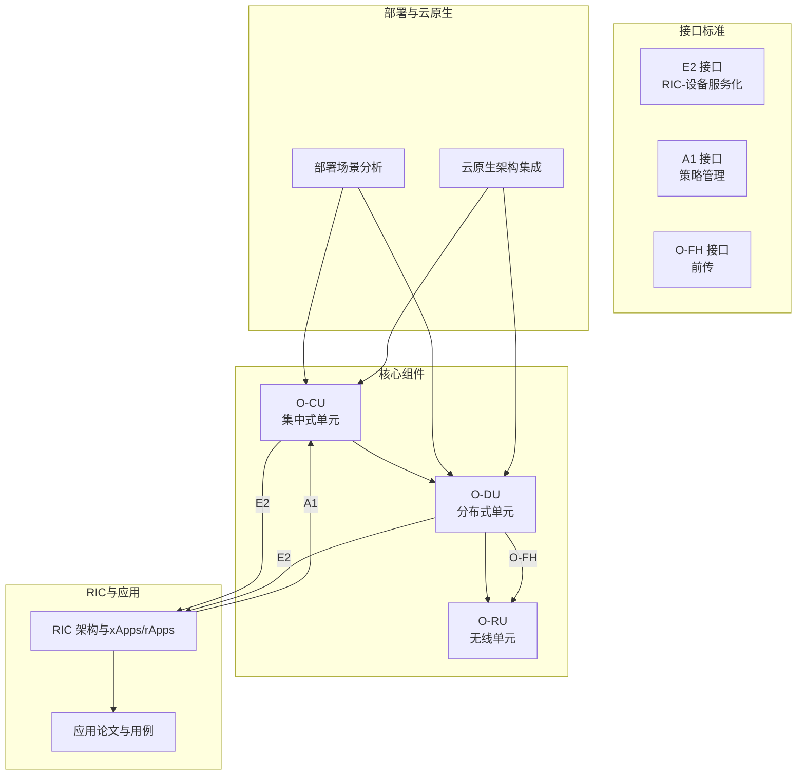
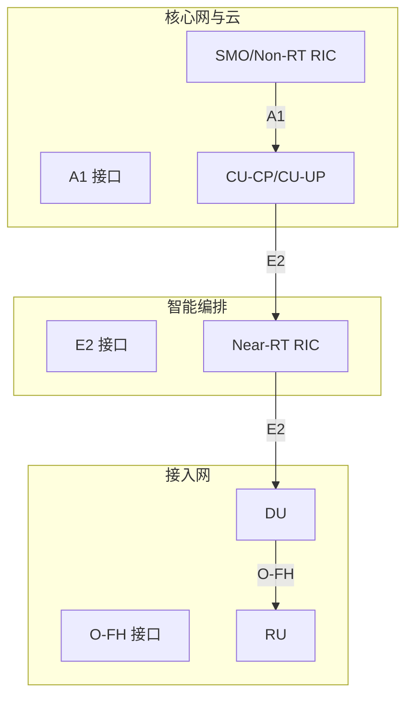
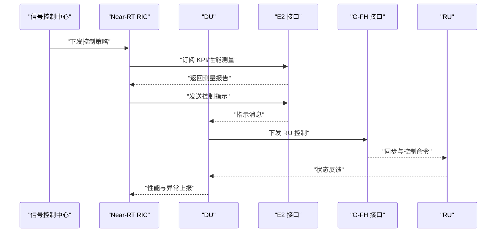
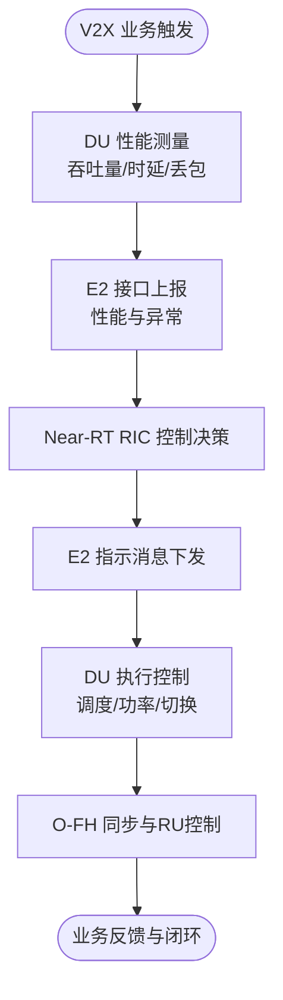
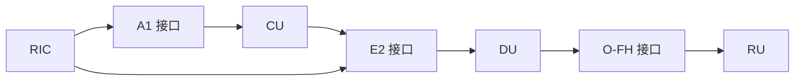

# 交通运输解决方案

<cite>
**本文引用的文件**
- [O-CU.md](file://02-core-components/o-cu.md)
- [O-DU.md](file://02-core-components/o-du.md)
- [E2接口.md](file://03-interface-standards/e2-interface.md)
- [O-FH接口.md](file://03-interface-standards/o-fh-interface.md)
- [部署场景分析.md](file://04-disaggregation-options/deployment-scenarios.md)
- [云原生架构与O-RAN集成.md](file://05-cloud-integration/cloud-native-architecture.md)
- [O-RAN高级技术.md](file://07-ric-development/readme-zh.md)
- [应用论文综述.md](file://11-academic-papers/applications/readme.md)
</cite>

## 目录
1. [引言](#引言)
2. [项目结构](#项目结构)
3. [核心组件](#核心组件)
4. [架构总览](#架构总览)
5. [详细组件分析](#详细组件分析)
6. [依赖分析](#依赖分析)
7. [性能考虑](#性能考虑)
8. [故障排查指南](#故障排查指南)
9. [结论](#结论)
10. [附录](#附录)

## 引言
本文件面向交通运输行业，系统化梳理 O-RAN 在智能交通管理、车联网（V2X）通信、交通信号优化与拥堵缓解、车载信息服务与应急救援、轨道交通控制与安全、物流运输与仓储自动化等场景中的应用方法论与工程实践。围绕实时性与高可靠性的关键诉求，结合 O-RAN 的 CU/DU/RU 分层架构、RIC 智能编排、E2/A1 接口与 O-FH 前传接口，给出部署架构、技术标准、性能优化与运维保障的全景指导，并提供可落地的实施策略与案例参考。

## 项目结构
本知识库围绕 O-RAN 架构的“核心组件—接口标准—解耦与部署—云原生—RIC开发—应用论文”六大维度组织，支撑交通运输领域的端到端解决方案设计与落地。

**图示来源**
- [O-CU.md](file://02-core-components/o-cu.md#L1-L419)
- [O-DU.md](file://02-core-components/o-du.md#L1-L415)
- [E2接口.md](file://03-interface-standards/e2-interface.md#L1-L337)
- [O-FH接口.md](file://03-interface-standards/o-fh-interface.md#L1-L397)
- [部署场景分析.md](file://04-disaggregation-options/deployment-scenarios.md#L1-L563)
- [云原生架构与O-RAN集成.md](file://05-cloud-integration/cloud-native-architecture.md#L1-L481)
- [O-RAN高级技术.md](file://07-ric-development/readme-zh.md#L1-L340)
- [应用论文综述.md](file://11-academic-papers/applications/readme.md#L1-L102)

**章节来源**
- [O-CU.md](file://02-core-components/o-cu.md#L1-L419)
- [O-DU.md](file://02-core-components/o-du.md#L1-L415)
- [E2接口.md](file://03-interface-standards/e2-interface.md#L1-L337)
- [O-FH接口.md](file://03-interface-standards/o-fh-interface.md#L1-L397)
- [部署场景分析.md](file://04-disaggregation-options/deployment-scenarios.md#L1-L563)
- [云原生架构与O-RAN集成.md](file://05-cloud-integration/cloud-native-architecture.md#L1-L481)
- [O-RAN高级技术.md](file://07-ric-development/readme-zh.md#L1-L340)
- [应用论文综述.md](file://11-academic-papers/applications/readme.md#L1-L102)

## 核心组件
- O-CU（集中式单元）：负责非实时高层协议栈（控制面/用户面分离），提供 RRC、NG/F1 接口控制面、E1 接口控制与用户面交互，支持容器化与云原生编排。
- O-DU（分布式单元）：负责物理层与 MAC 层处理，强调低延迟与高可靠性，支持 eCPRI/RoE 前传协议与 PTP/SyncE 同步。
- O-RU（无线单元）：与 DU 通过 O-FH 接口连接，完成射频与基带处理。

上述组件共同构成 O-RAN 的 RAN 架构，支撑交通运输场景下的高并发、低时延与高可靠通信。

**章节来源**
- [O-CU.md](file://02-core-components/o-cu.md#L1-L419)
- [O-DU.md](file://02-core-components/o-du.md#L1-L415)
- [O-FH接口.md](file://03-interface-standards/o-fh-interface.md#L1-L397)

## 架构总览
面向交通运输的 O-RAN 解决架构建议如下：
- 控制面与用户面分离：CU-CP/CU-UP 分离，结合云原生弹性与就近处理的 DU，实现“集中管控、边缘处理”的混合部署。
- RIC 智能编排：Near-RT RIC 通过 E2 接口对 DU 进行闭环控制，Non-RT RIC 通过 A1 接口下发长期策略，形成“策略—控制—反馈”的闭环。
- 前传与同步：O-FH 接口承载 IQ 数据与 RU 控制，PTP/SyncE 保障纳秒级同步精度，满足 URLLC 与高精度协同需求。
- 部署策略：依据业务密度与延迟要求，采用集中式、分布式或混合式部署，结合网络切片与 QoS 保障差异化服务。

**图示来源**
- [O-CU.md](file://02-core-components/o-cu.md#L1-L419)
- [O-DU.md](file://02-core-components/o-du.md#L1-L415)
- [E2接口.md](file://03-interface-standards/e2-interface.md#L1-L337)
- [O-FH接口.md](file://03-interface-standards/o-fh-interface.md#L1-L397)
- [云原生架构与O-RAN集成.md](file://05-cloud-integration/cloud-native-architecture.md#L1-L481)

## 详细组件分析

### 1) 智能交通管理与信号优化
- 闭环控制：Near-RT RIC 通过 E2 接口订阅 DU 的 KPI 与性能测量，结合 xApp 实现信号灯时序优化、交叉口通行能力动态调度。
- 数据驱动：Non-RT RIC 通过 A1 接口下发长期策略（如高峰时段配时方案、事件联动预案），并结合历史与实时流量数据进行预测与规划。
- 同步与低时延：O-FH 与 PTP/SyncE 保障多交叉口协同控制的同步精度，满足毫秒级控制闭环。
- 部署建议：在城市核心区采用集中式 CU-CP 与区域 DU 部署，边缘部署 Near-RT RIC，实现“策略集中、控制下沉”。

**图示来源**
- [E2接口.md](file://03-interface-standards/e2-interface.md#L1-L337)
- [O-FH接口.md](file://03-interface-standards/o-fh-interface.md#L1-L397)
- [O-RAN高级技术.md](file://07-ric-development/readme-zh.md#L1-L340)

**章节来源**
- [E2接口.md](file://03-interface-standards/e2-interface.md#L1-L337)
- [O-FH接口.md](file://03-interface-standards/o-fh-interface.md#L1-L397)
- [O-RAN高级技术.md](file://07-ric-development/readme-zh.md#L1-L340)

### 2) 车联网（V2X）通信与车路协同
- 低时延与高可靠：URLLC 业务（如紧急制动、碰撞预警）需满足亚毫秒级端到端时延与 99.999% 可用性，O-DU 的物理层与 MAC 层处理、O-FH 的低延迟与同步保障是关键。
- 多 RU 协同：通过 PTP/SyncE 实现多 RU 时间/频率同步，保障车路协同感知与控制的一致性。
- 云原生弹性：DU/Near-RT RIC 的容器化与弹性扩缩容，应对交通事件引发的突发流量。
- 部署建议：在交通繁忙路段与事故多发区部署 DU 与 Near-RT RIC，结合边缘云实现就近处理与快速响应。

**图示来源**
- [O-DU.md](file://02-core-components/o-du.md#L1-L415)
- [O-FH接口.md](file://03-interface-standards/o-fh-interface.md#L1-L397)
- [E2接口.md](file://03-interface-standards/e2-interface.md#L1-L337)

**章节来源**
- [O-DU.md](file://02-core-components/o-du.md#L1-L415)
- [O-FH接口.md](file://03-interface-standards/o-fh-interface.md#L1-L397)
- [云原生架构与O-RAN集成.md](file://05-cloud-integration/cloud-native-architecture.md#L1-L481)

### 3) 交通流量监控与拥堵缓解
- 实时监控：通过 E2 接口订阅 DU 的 KPI（吞吐量、时延、切换失败率、干扰指标），结合 Non-RT RIC 的策略管理，形成“感知—决策—执行—反馈”的闭环。
- 动态分流与限速：Near-RT RIC 基于实时流量与预测模型，下发 DU 的调度与功率控制策略，缓解拥堵；Non-RT RIC 制定长期分流与限速方案。
- 同步保障：多路口 RU 的 PTP 同步确保协同控制，避免“一放一堵”的局部优化。

**章节来源**
- [E2接口.md](file://03-interface-standards/e2-interface.md#L1-L337)
- [O-RAN高级技术.md](file://07-ric-development/readme-zh.md#L1-L340)

### 4) 车载通信、路况信息服务与应急救援
- 车载通信：O-DU 的 URLLC 与 eMBB 能力满足车载娱乐、导航与安全通信；通过 DU 与 RU 的协同，保障移动过程中的连续性与低时延。
- 路况信息服务：Non-RT RIC 基于 A1 接口下发策略，DU 侧基于 E2 接口采集的 KPI 与事件，实现事件驱动的信息推送与路径引导。
- 应急救援：在紧急事件场景下，Near-RT RIC 快速调整 DU 的资源分配，保障救援通道优先；Non-RT RIC 下发专用网络切片与优先级策略。

**章节来源**
- [O-CU.md](file://02-core-components/o-cu.md#L1-L419)
- [E2接口.md](file://03-interface-standards/e2-interface.md#L1-L337)
- [O-RAN高级技术.md](file://07-ric-development/readme-zh.md#L1-L340)

### 5) 轨道交通：列车控制、乘客信息系统与安全管理
- 列车控制：URLLC 场景对时延与可靠性要求极高，O-DU 的物理层与 MAC 层处理、O-FH 的低时延与同步保障至关重要；Near-RT RIC 通过 E2 接口实现车地协同控制（如车门与站台门联动、精确停车）。
- 乘客信息系统：eMBB 场景满足站厅/车厢视频与多媒体服务，Non-RT RIC 通过 A1 接口下发 QoS 与切片策略，保障关键业务优先。
- 安全管理：Non-RT RIC 结合策略与事件，实现异常检测与应急处置；DU 侧通过 E2 接口上报异常，形成闭环。

**章节来源**
- [O-DU.md](file://02-core-components/o-du.md#L1-L415)
- [O-FH接口.md](file://03-interface-standards/o-fh-interface.md#L1-L397)
- [E2接口.md](file://03-interface-standards/e2-interface.md#L1-L337)
- [O-RAN高级技术.md](file://07-ric-development/readme-zh.md#L1-L340)

### 6) 物流运输：货物跟踪、车队管理与仓储自动化
- 货物跟踪：mMTC 场景支持海量设备接入，O-RU 的广覆盖与低功耗能力满足物流标签与传感器网络；Non-RT RIC 通过 A1 接口下发切片与 QoS，保障关键任务优先。
- 车队管理：URLLC 场景支持车队协同与编队行驶，Near-RT RIC 通过 E2 接口实现车辆间通信与协同控制；O-FH 的同步保障多车动作一致性。
- 仓储自动化：在自动化仓库中，DU 的低时延与高可靠性保障 AGV/机器人控制；Non-RT RIC 下发策略，实现动态路径与负载分配。

**章节来源**
- [部署场景分析.md](file://04-disaggregation-options/deployment-scenarios.md#L1-L563)
- [O-FH接口.md](file://03-interface-standards/o-fh-interface.md#L1-L397)
- [O-RAN高级技术.md](file://07-ric-development/readme-zh.md#L1-L340)

## 依赖分析
- 组件耦合：DU 与 RU 通过 O-FH 强耦合（低时延与同步），CU 与 DU 通过 E2 接口弱耦合（策略与控制），RIC 作为中间层实现解耦与智能编排。
- 外部依赖：A1 接口依赖策略管理与数据平台，E2 接口依赖 DU 的实时处理能力与 O-FH 的同步质量。
- 风险点：同步精度劣化、前传带宽拥塞、DU 性能退化、RIC 控制回路延迟过大，均可能引发业务中断或服务质量下降。

**图示来源**
- [E2接口.md](file://03-interface-standards/e2-interface.md#L1-L337)
- [O-FH接口.md](file://03-interface-standards/o-fh-interface.md#L1-L397)
- [O-RAN高级技术.md](file://07-ric-development/readme-zh.md#L1-L340)

**章节来源**
- [E2接口.md](file://03-interface-standards/e2-interface.md#L1-L337)
- [O-FH接口.md](file://03-interface-standards/o-fh-interface.md#L1-L397)
- [O-RAN高级技术.md](file://07-ric-development/readme-zh.md#L1-L340)

## 性能考虑
- 时延与同步：URLLC 场景端到端时延应低于 1ms，O-DU 的物理层与 MAC 层处理、O-FH 的低延迟与 PTP/SyncE 的纳秒级同步是关键。
- 带宽与 QoS：高带宽场景（如 4K/8K 视频、VR/AR）需结合网络切片与 QoS 保障；mMTC 场景需关注连接数与能耗。
- 弹性与可靠性：云原生容器化与弹性扩缩容提升资源利用率与可用性；多副本、自动故障转移与灾备机制保障 99.999% 可用性。
- 监控与优化：建立端到端监控体系，结合 AI/ML 实现异常检测、根因分析与预测性维护。

**章节来源**
- [O-DU.md](file://02-core-components/o-du.md#L1-L415)
- [O-FH接口.md](file://03-interface-standards/o-fh-interface.md#L1-L397)
- [云原生架构与O-RAN集成.md](file://05-cloud-integration/cloud-native-architecture.md#L1-L481)
- [应用论文综述.md](file://11-academic-papers/applications/readme.md#L1-L102)

## 故障排查指南
- 告警与分级：按严重程度分级处理，避免告警风暴；建立告警关联与抑制机制。
- 定位流程：从接口状态（E2/O-FH）、DU 性能（吞吐量/时延/误码率）、同步状态（PTP/SyncE）到 RU 状态（温度/功率/同步），逐层定位。
- 恢复策略：接口断连—修复传输；同步丢失—检查同步源与配置；性能劣化—优化调度与资源分配；硬件故障—更换与隔离。
- 自动化：CI/CD、自动化测试与故障自愈，缩短恢复时间。

**章节来源**
- [E2接口.md](file://03-interface-standards/e2-interface.md#L1-L337)
- [O-FH接口.md](file://03-interface-standards/o-fh-interface.md#L1-L397)
- [O-DU.md](file://02-core-components/o-du.md#L1-L415)
- [云原生架构与O-RAN集成.md](file://05-cloud-integration/cloud-native-architecture.md#L1-L481)

## 结论
O-RAN 通过 CU/DU/RU 分层、E2/A1 接口与 O-FH 前传的标准化能力，为交通运输提供了高实时性、高可靠性的网络底座。结合 RIC 的智能编排与云原生弹性，可在智能交通管理、V2X 通信、轨道交通与物流自动化等场景实现端到端的优化与保障。建议以“集中策略、边缘控制、云原生弹性、闭环优化”为核心思路，分阶段推进部署与优化。

## 附录
- 部署场景选择：依据业务密度、传输条件与成本预算，选择集中式、分布式或混合式部署，并配套网络切片与 QoS。
- 标准与规范：遵循 O-RAN 联盟与 3GPP/ETSI 标准，确保互操作与一致性。
- 成功案例参考：结合学术论文与应用用例，借鉴低时延、高可靠与大规模连接的实践经验。

**章节来源**
- [部署场景分析.md](file://04-disaggregation-options/deployment-scenarios.md#L1-L563)
- [应用论文综述.md](file://11-academic-papers/applications/readme.md#L1-L102)