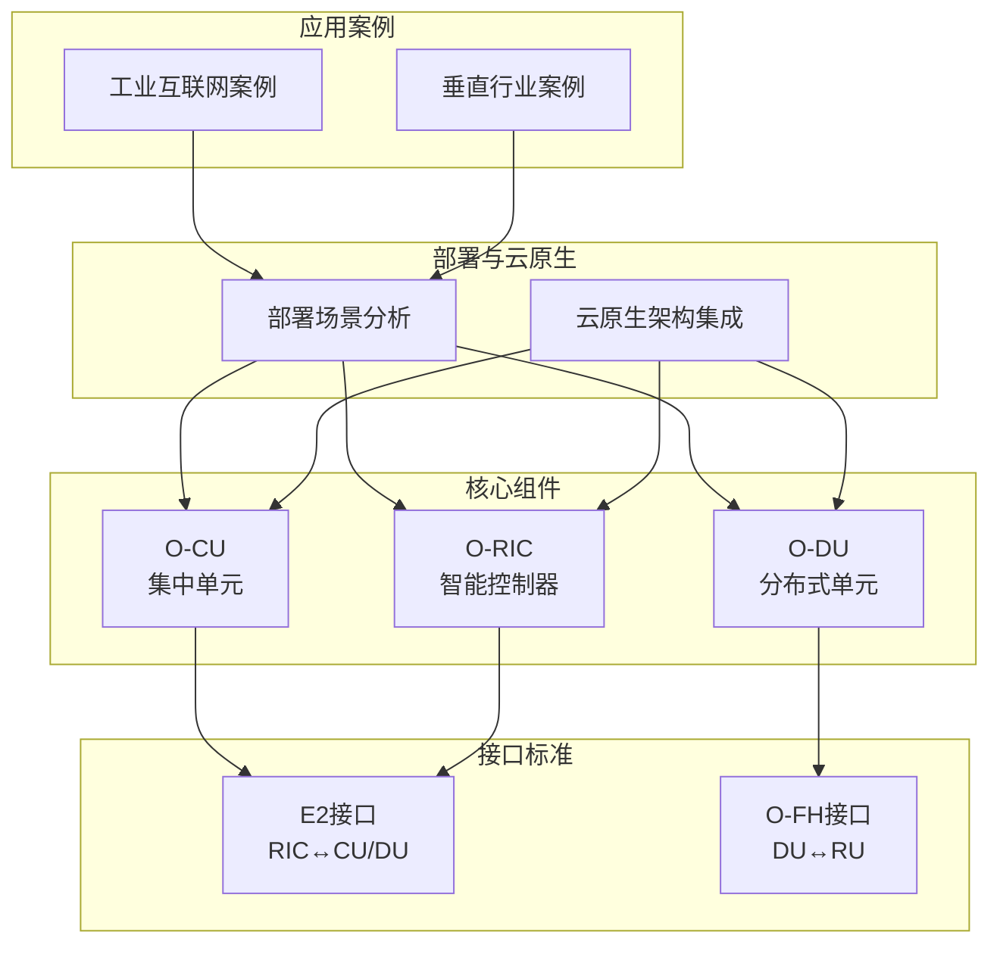
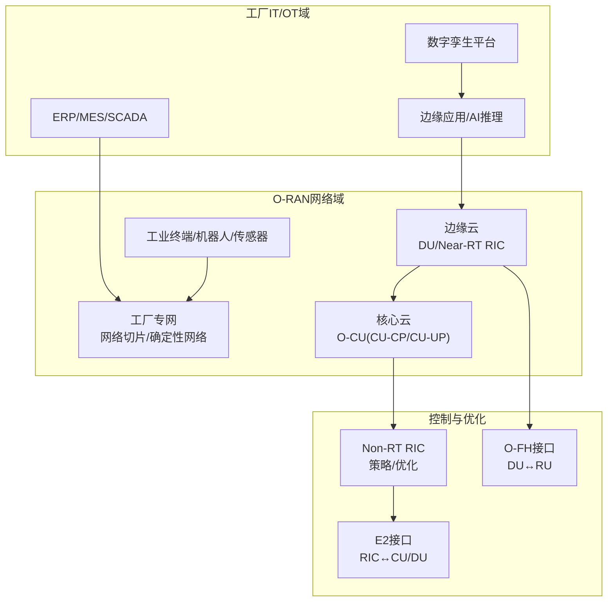
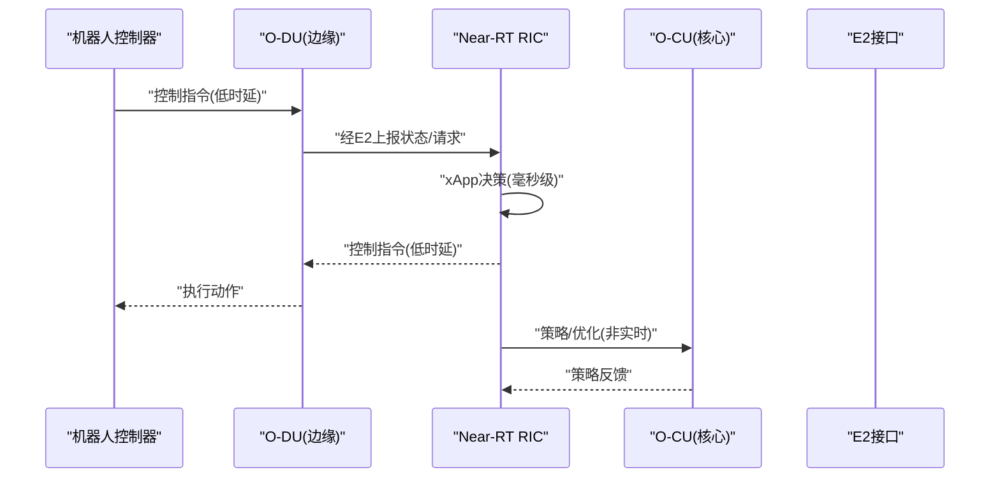
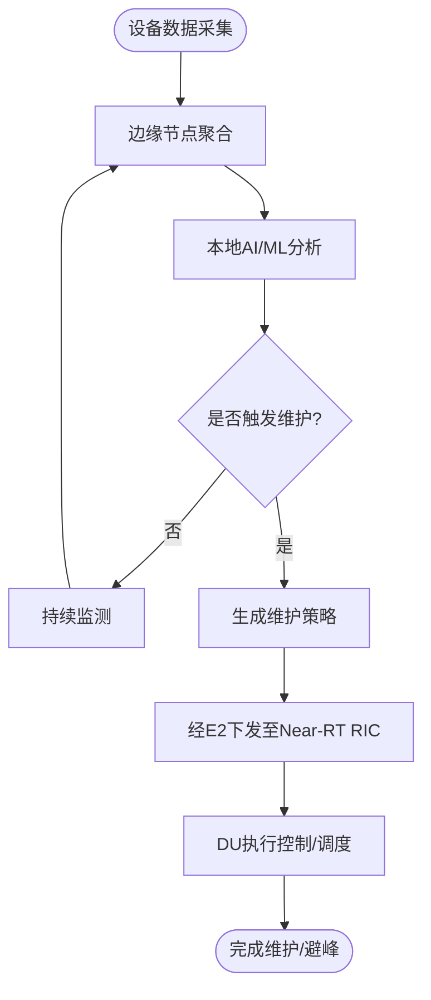
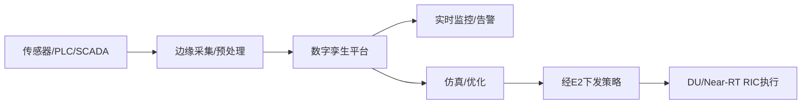
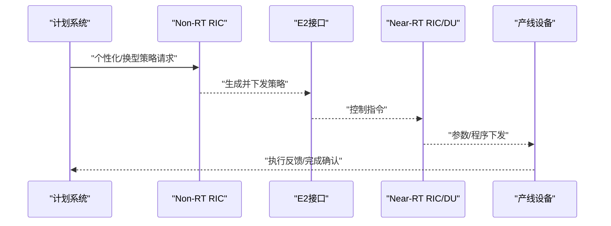
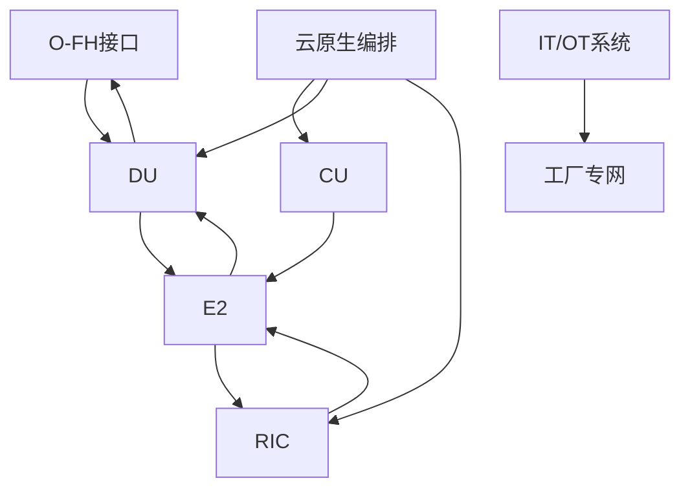

# 制造4.0解决方案

<cite>
**本文引用的文件**
- [O-CU.md](file://02-core-components/o-cu.md)
- [O-DU.md](file://02-core-components/o-du.md)
- [O-RIC.md](file://02-core-components/o-ric.md)
- [E2接口.md](file://03-interface-standards/e2-interface.md)
- [O-FH接口.md](file://03-interface-standards/o-fh-interface.md)
- [部署场景分析.md](file://04-disaggregation-options/deployment-scenarios.md)
- [云原生架构与O-RAN集成.md](file://05-cloud-integration/cloud-native-architecture.md)
- [应用案例：大型运营商工业互联网案例.md](file://10-application-scenarios/readme.md)
- [垂直行业O-RAN案例.md](file://21-case-studies/industry-applications/vertical-industry-o-ran-cases.md)
- [应用案例：云原生O-RAN部署.md](file://05-cloud-integration/cloud-native-architecture.md)
</cite>

## 目录
1. [引言](#引言)
2. [项目结构](#项目结构)
3. [核心组件](#核心组件)
4. [架构总览](#架构总览)
5. [详细组件分析](#详细组件分析)
6. [依赖分析](#依赖分析)
7. [性能考量](#性能考量)
8. [故障排查指南](#故障排查指南)
9. [结论](#结论)
10. [附录](#附录)

## 引言
本文件面向制造4.0行业应用，系统化阐述O-RAN技术在智能制造工厂中的落地路径，覆盖自动化生产线、机器人协作、质量控制等核心场景；说明工业物联网的设备连接、数据采集与预测性维护；解释数字孪生在虚拟工厂建模、实时监控与优化仿真中的作用；并分析柔性制造系统的动态资源配置、个性化生产与快速换型。文档同时给出部署架构、技术选型与实施案例，包括网络切片设计、边缘计算节点部署与OT系统集成方案，帮助运营商与设备商制定可执行的制造4.0解决方案。

## 项目结构
本仓库围绕O-RAN架构的“核心组件—接口标准—解耦与部署—云原生—应用案例”形成完整知识体系，支撑制造4.0场景的工程化落地。

图示来源
- [O-CU.md](file://02-core-components/o-cu.md#L1-L419)
- [O-DU.md](file://02-core-components/o-du.md#L1-L415)
- [O-RIC.md](file://02-core-components/o-ric.md#L1-L437)
- [E2接口.md](file://03-interface-standards/e2-interface.md#L1-L337)
- [O-FH接口.md](file://03-interface-standards/o-fh-interface.md#L1-L397)
- [部署场景分析.md](file://04-disaggregation-options/deployment-scenarios.md#L1-L563)
- [云原生架构与O-RAN集成.md](file://05-cloud-integration/cloud-native-architecture.md#L1-L481)
- [应用案例：大型运营商工业互联网案例.md](file://10-application-scenarios/readme.md#L389-L404)
- [垂直行业O-RAN案例.md](file://21-case-studies/industry-applications/vertical-industry-o-ran-cases.md#L43-L73)

章节来源
- [O-CU.md](file://02-core-components/o-cu.md#L1-L419)
- [O-DU.md](file://02-core-components/o-du.md#L1-L415)
- [O-RIC.md](file://02-core-components/o-ric.md#L1-L437)
- [E2接口.md](file://03-interface-standards/e2-interface.md#L1-L337)
- [O-FH接口.md](file://03-interface-standards/o-fh-interface.md#L1-L397)
- [部署场景分析.md](file://04-disaggregation-options/deployment-scenarios.md#L1-L563)
- [云原生架构与O-RAN集成.md](file://05-cloud-integration/cloud-native-architecture.md#L1-L481)
- [应用案例：大型运营商工业互联网案例.md](file://10-application-scenarios/readme.md#L389-L404)
- [垂直行业O-RAN案例.md](file://21-case-studies/industry-applications/vertical-industry-o-ran-cases.md#L43-L73)

## 核心组件
- O-CU（集中单元）：负责非实时高层协议栈，控制面（CU-CP）与用户面（CU-UP）分离，支持容器化与弹性扩展，满足大规模并发与多样化业务（eMBB/URLLC/mMTC）。
- O-DU（分布式单元）：负责物理层与MAC层处理，强调毫秒级实时性与确定性，支持边缘部署与前传接口（O-FH）。
- O-RIC（智能控制器）：提供Near-RT与Non-RT两层智能控制，支撑xApps/rApps运行与策略下发，实现网络自优化与业务自适应。

章节来源
- [O-CU.md](file://02-core-components/o-cu.md#L1-L419)
- [O-DU.md](file://02-core-components/o-du.md#L1-L415)
- [O-RIC.md](file://02-core-components/o-ric.md#L1-L437)

## 架构总览
制造4.0场景下的O-RAN架构以“核心集中、边缘分布、云边协同”为指导思想，结合网络切片与确定性网络，满足工厂内低时延控制、高可靠通信与海量物联接入。

图示来源
- [O-CU.md](file://02-core-components/o-cu.md#L122-L196)
- [O-DU.md](file://02-core-components/o-du.md#L131-L147)
- [O-RIC.md](file://02-core-components/o-ric.md#L118-L133)
- [E2接口.md](file://03-interface-standards/e2-interface.md#L90-L130)
- [O-FH接口.md](file://03-interface-standards/o-fh-interface.md#L117-L178)
- [部署场景分析.md](file://04-disaggregation-options/deployment-scenarios.md#L216-L243)
- [云原生架构与O-RAN集成.md](file://05-cloud-integration/cloud-native-architecture.md#L235-L296)

## 详细组件分析

### 自动化生产线与机器人协作
- 低时延控制闭环：通过Near-RT RIC与E2接口实现毫秒级控制闭环，满足机器人关节控制与AGV路径协同。
- 边缘就近处理：DU与Near-RT RIC下沉至车间边缘，降低端到端时延，满足URLLC需求。
- 网络切片隔离：为机器人控制、视觉检测、设备监控等业务划分切片，保障差异化SLA。

图示来源
- [O-DU.md](file://02-core-components/o-du.md#L51-L67)
- [O-RIC.md](file://02-core-components/o-ric.md#L7-L32)
- [E2接口.md](file://03-interface-standards/e2-interface.md#L90-L130)

章节来源
- [O-DU.md](file://02-core-components/o-du.md#L51-L67)
- [O-RIC.md](file://02-core-components/o-ric.md#L7-L32)
- [E2接口.md](file://03-interface-standards/e2-interface.md#L90-L130)

### 工业物联网：设备连接、数据采集与预测性维护
- 设备连接与前传：O-FH接口承载DU与RU之间的IQ数据与控制面消息，支持eCPRI/RoE协议，满足高带宽、低延迟与高精度同步。
- 数据采集与边缘分析：边缘节点汇聚设备数据，结合AI/ML进行局部预测性维护，降低回传压力。
- 预测性维护闭环：Non-RT RIC基于历史数据与模型生成维护策略，经E2下发至Near-RT RIC，DU执行控制动作。

图示来源
- [O-FH接口.md](file://03-interface-standards/o-fh-interface.md#L117-L178)
- [O-RIC.md](file://02-core-components/o-ric.md#L33-L58)
- [E2接口.md](file://03-interface-standards/e2-interface.md#L90-L130)

章节来源
- [O-FH接口.md](file://03-interface-standards/o-fh-interface.md#L117-L178)
- [O-RIC.md](file://02-core-components/o-ric.md#L33-L58)
- [E2接口.md](file://03-interface-standards/e2-interface.md#L90-L130)

### 数字孪生：虚拟工厂建模、实时监控与优化仿真
- 虚拟建模：基于真实设备与产线数据构建数字孪生体，实现物理与虚拟的双向驱动。
- 实时监控：通过边缘采集与核心分析，实时反映产线健康状态与性能指标。
- 优化仿真：Non-RT RIC在离线空间进行仿真与策略优化，再通过E2下发至现场验证。

图示来源
- [云原生架构与O-RAN集成.md](file://05-cloud-integration/cloud-native-architecture.md#L297-L341)
- [O-RIC.md](file://02-core-components/o-ric.md#L33-L58)
- [E2接口.md](file://03-interface-standards/e2-interface.md#L90-L130)

章节来源
- [云原生架构与O-RAN集成.md](file://05-cloud-integration/cloud-native-architecture.md#L297-L341)
- [O-RIC.md](file://02-core-components/o-ric.md#L33-L58)
- [E2接口.md](file://03-interface-standards/e2-interface.md#L90-L130)

### 柔性制造：动态资源配置、个性化生产与快速换型
- 动态资源分配：基于云原生弹性能力与网络切片，按订单/产品族动态调度DU、CU-UP与边缘算力。
- 个性化生产：通过Non-RT RIC的策略与E2接口的快速下发，实现产线参数与工艺的快速调整。
- 快速换型：利用确定性网络与边缘AI，缩短换型调试时间，提升设备利用率。

图示来源
- [部署场景分析.md](file://04-disaggregation-options/deployment-scenarios.md#L162-L215)
- [O-RIC.md](file://02-core-components/o-ric.md#L33-L58)
- [E2接口.md](file://03-interface-standards/e2-interface.md#L90-L130)

章节来源
- [部署场景分析.md](file://04-disaggregation-options/deployment-scenarios.md#L162-L215)
- [O-RIC.md](file://02-core-components/o-ric.md#L33-L58)
- [E2接口.md](file://03-interface-standards/e2-interface.md#L90-L130)

## 依赖分析
- 组件耦合与协作
  - DU与RU：O-FH接口承载IQ数据与控制面消息，需满足带宽、延迟与同步精度。
  - RIC与CU/DU：E2接口提供服务化通信，Near-RT RIC负责毫秒级闭环，Non-RT RIC负责策略与优化。
  - CU-CP/CU-UP：分离设计提升灵活性，结合云原生实现弹性与可观测性。
- 外部依赖与集成
  - IT/OT系统：ERP/MES/SCADA与工厂专网集成，实现数据互通与业务协同。
  - 第三方应用：xApps/rApps通过RIC运行，需遵循服务模型与安全策略。

图示来源
- [O-FH接口.md](file://03-interface-standards/o-fh-interface.md#L117-L178)
- [O-DU.md](file://02-core-components/o-du.md#L68-L87)
- [O-RIC.md](file://02-core-components/o-ric.md#L118-L133)
- [E2接口.md](file://03-interface-standards/e2-interface.md#L90-L130)
- [云原生架构与O-RAN集成.md](file://05-cloud-integration/cloud-native-architecture.md#L65-L122)

章节来源
- [O-FH接口.md](file://03-interface-standards/o-fh-interface.md#L117-L178)
- [O-DU.md](file://02-core-components/o-du.md#L68-L87)
- [O-RIC.md](file://02-core-components/o-ric.md#L118-L133)
- [E2接口.md](file://03-interface-standards/e2-interface.md#L90-L130)
- [云原生架构与O-RAN集成.md](file://05-cloud-integration/cloud-native-architecture.md#L65-L122)

## 性能考量
- 时延与可靠性
  - URLLC场景：端到端时延<1ms，可用性≥99.999%，依赖DU边缘部署与O-FH低延迟路径。
  - E2接口：Near-RT RIC到DU的延迟<10ms，需SCTP参数优化与多路径传输。
- 带宽与同步
  - O-FH带宽按天线数、带宽与调制方式计算，预留冗余；同步采用PTP/SyncE，精度<100ns。
- 弹性与可观测性
  - 云原生容器化与微服务化，结合HPA/VPA与服务网格，实现弹性扩缩容与自愈。
  - 统一监控体系（指标/日志/追踪），支持AI驱动的异常检测与根因分析。

章节来源
- [O-DU.md](file://02-core-components/o-du.md#L51-L67)
- [E2接口.md](file://03-interface-standards/e2-interface.md#L131-L147)
- [O-FH接口.md](file://03-interface-standards/o-fh-interface.md#L117-L178)
- [云原生架构与O-RAN集成.md](file://05-cloud-integration/cloud-native-architecture.md#L123-L176)

## 故障排查指南
- 常见故障与定位
  - O-FH：连接断开、同步丢失、性能劣化、硬件故障；通过接口状态、RU状态、告警关联与日志分析定位。
  - E2：连接断连、消息失败、服务不可用、性能退化；通过接口监控、服务监控与信令分析定位。
  - RIC：接口故障、应用异常、资源不足、配置错误；通过监控与日志、性能分析与测试验证定位。
- 恢复与优化
  - 重启服务/调整配置/资源扩容/修复接口/应用重启；结合自动化运维与容量管理，持续优化。

章节来源
- [O-FH接口.md](file://03-interface-standards/o-fh-interface.md#L199-L266)
- [E2接口.md](file://03-interface-standards/e2-interface.md#L148-L189)
- [O-RIC.md](file://02-core-components/o-ric.md#L214-L282)

## 结论
O-RAN为制造4.0提供了开放、灵活、可云原生演进的网络底座。通过DU边缘化、RIC智能化与E2/O-FH标准化接口，结合网络切片与确定性网络，可有效支撑自动化产线、机器人协作、工业物联网与数字孪生等关键场景。云原生架构进一步提升了弹性、可观测性与运维效率，配合完善的监控、告警与自动化流程，可实现工厂网络的高质量、低成本与可持续运营。

## 附录

### 部署架构与技术选型
- 集中式/边缘/混合部署：依据业务密度、传输条件与延迟要求选择合适架构。
- 网络切片：为控制、监控、AI推理与物联接入划分切片，保障差异化SLA。
- 边缘计算：在产线周边部署边缘节点，就近处理控制与分析任务。
- OT系统集成：通过工厂专网与安全边界，实现ERP/MES/SCADA与O-RAN的IT/OT融合。

章节来源
- [部署场景分析.md](file://04-disaggregation-options/deployment-scenarios.md#L216-L243)
- [云原生架构与O-RAN集成.md](file://05-cloud-integration/cloud-native-architecture.md#L235-L296)

### 实施案例参考
- 工业互联网案例：某汽车制造企业通过O-RAN私网覆盖全厂区，实现确定性网络与边缘AI，提升效率、降低故障率与能耗。
- 垂直行业案例：BMW/西门子等在多工厂部署O-RAN，支撑数字孪生与网络切片，实现全球复制与规模化推广。

章节来源
- [应用案例：大型运营商工业互联网案例.md](file://10-application-scenarios/readme.md#L389-L404)
- [垂直行业O-RAN案例.md](file://21-case-studies/industry-applications/vertical-industry-o-ran-cases.md#L43-L73)