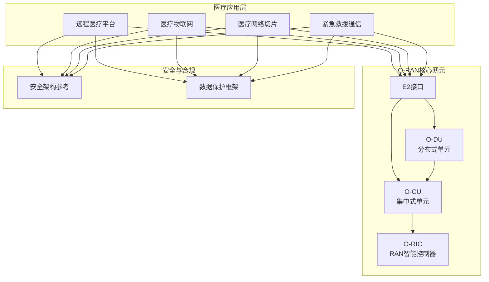
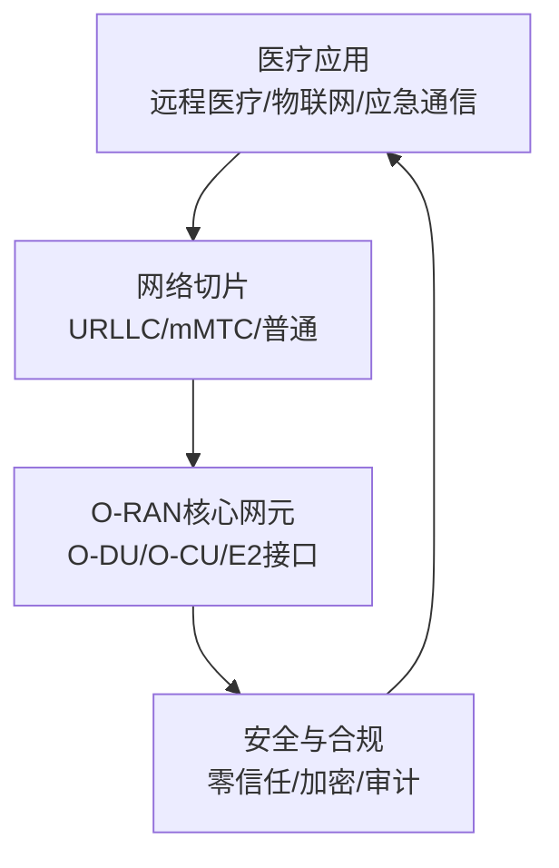
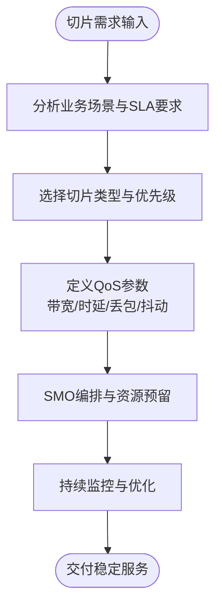
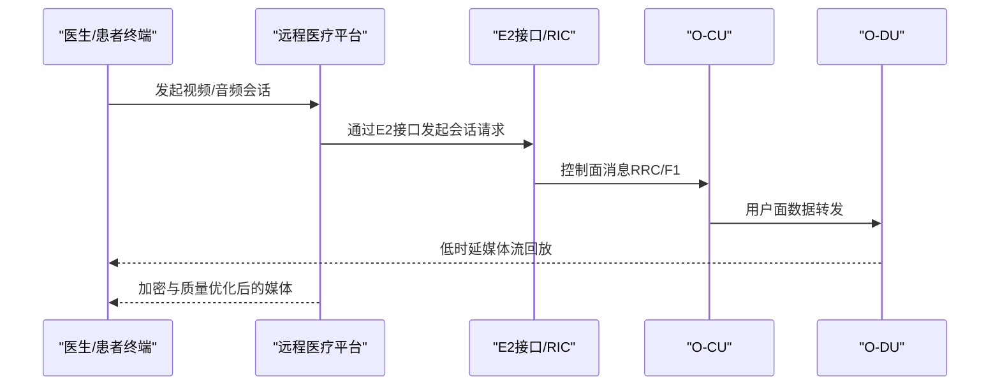
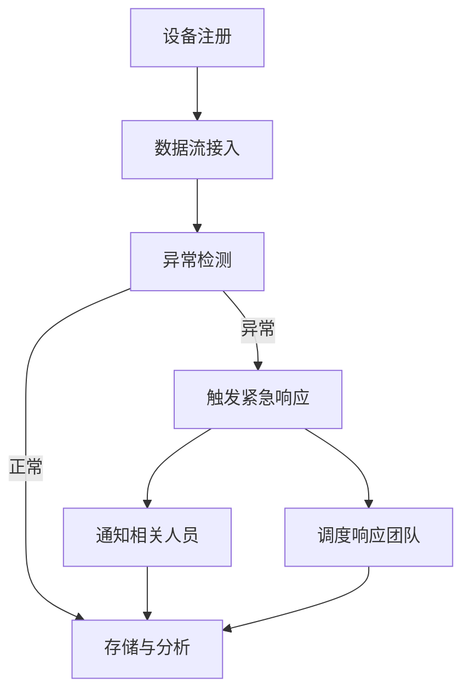
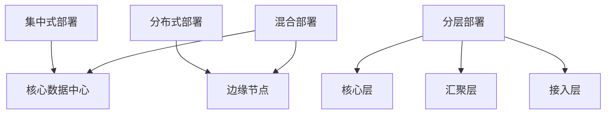
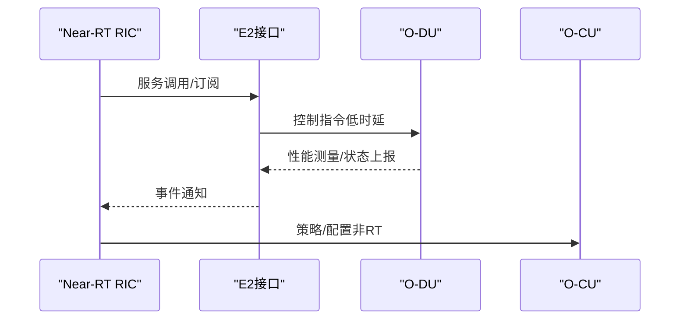
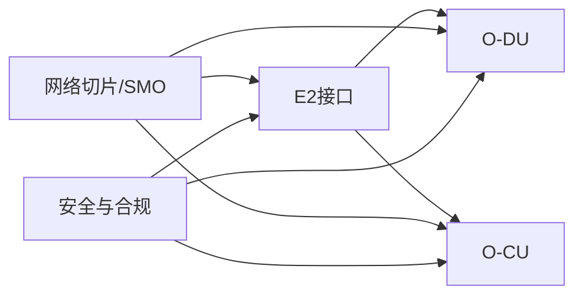
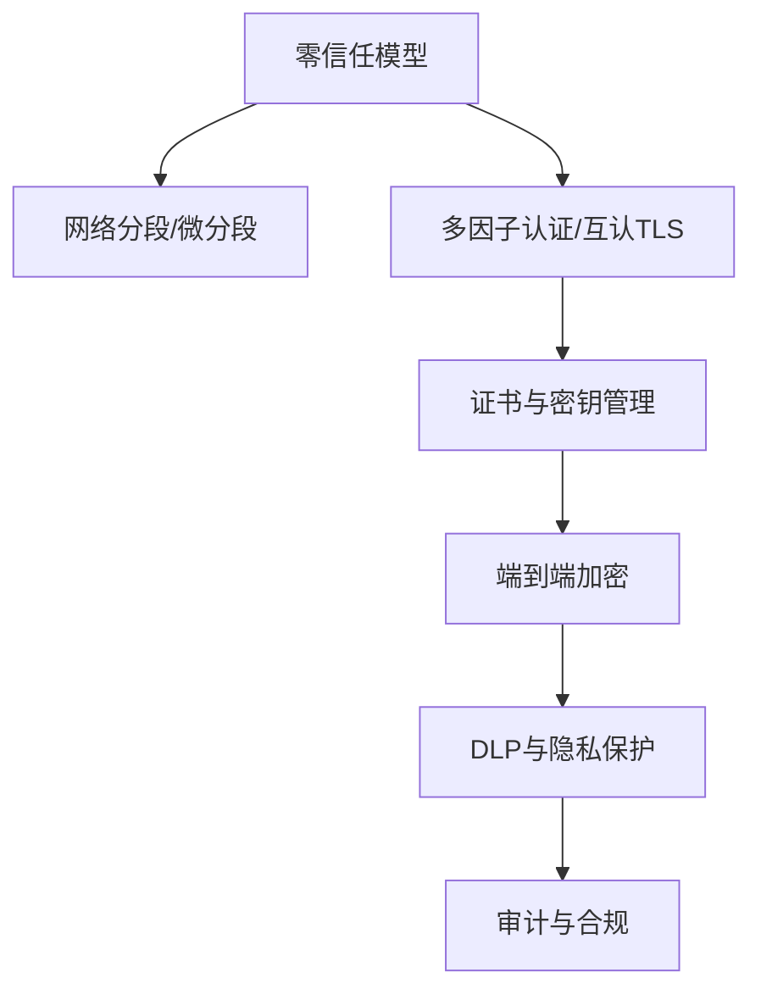

# 医疗健康解决方案

<cite>
**本文引用的文件**
- [O-RAN 医疗解决方案](file://16-industry-solutions/healthcare/o-ran-healthcare-solutions-zh.md)
- [O-RAN 医疗解决方案](file://16-industry-solutions/healthcare/o-ran-healthcare-solutions.md)
- [O-RAN 应用场景](file://10-application-scenarios/readme.md)
- [O-RAN 分布式单元](file://02-core-components/o-du.md)
- [O-RAN 集中式单元](file://02-core-components/o-cu.md)
- [E2 接口](file://03-interface-standards/e2-interface.md)
- [O-RAN 部署场景分析](file://04-disaggregation-options/deployment-scenarios.md)
- [O-RAN 安全架构参考](file://12-security-privacy/security-architecture/security-reference-architecture.md)
- [O-RAN 数据保护框架](file://12-security-privacy/data-protection/data-protection-framework.md)
- [O-RAN 未来应用与趋势](file://15-future-development/emerging-applications/emerging-applications-roadmap.md)
</cite>

## 目录
1. [引言](#引言)
2. [项目结构](#项目结构)
3. [核心组件](#核心组件)
4. [架构总览](#架构总览)
5. [详细组件分析](#详细组件分析)
6. [依赖关系分析](#依赖关系分析)
7. [性能与可靠性](#性能与可靠性)
8. [安全与隐私保障](#安全与隐私保障)
9. [部署策略与最佳实践](#部署策略与最佳实践)
10. [故障排查与运维](#故障排查与运维)
11. [结论](#结论)
12. [附录](#附录)

## 引言
本文件面向医疗健康行业，系统化梳理O-RAN技术在远程医疗、远程患者监测、医疗物联网集成、网络切片与安全隔离等方面的工程化落地方法。结合O-RAN核心网元（O-DU/O-CU）、RIC接口（E2）与部署场景，给出面向5G医疗应用的网络QoS保障、安全隔离与可靠性要求，并提供可操作的部署策略与最佳实践，帮助运营商与医疗机构构建高可靠、低时延、可扩展的智慧医疗网络。

## 项目结构
围绕医疗健康解决方案，仓库提供了从基础架构到行业应用、从安全合规到未来演进的完整知识体系：
- 基础架构：O-DU/O-CU、E2接口、功能拆分与部署场景
- 行业应用：医疗网络切片、远程医疗平台、医疗物联网与应急通信
- 安全与合规：零信任架构、证书与密钥管理、数据保护与审计
- 未来演进：6G融合、AI原生架构、沉浸式通信与智慧医疗

**图表来源**
- [O-RAN 医疗解决方案](file://16-industry-solutions/healthcare/o-ran-healthcare-solutions-zh.md#L1-L484)
- [O-RAN 分布式单元](file://02-core-components/o-du.md#L1-L415)
- [O-RAN 集中式单元](file://02-core-components/o-cu.md#L1-L419)
- [E2 接口](file://03-interface-standards/e2-interface.md#L1-L337)
- [O-RAN 安全架构参考](file://12-security-privacy/security-architecture/security-reference-architecture.md#L1-L559)
- [O-RAN 数据保护框架](file://12-security-privacy/data-protection/data-protection-framework.md#L1-L376)

**章节来源**
- [O-RAN 医疗解决方案](file://16-industry-solutions/healthcare/o-ran-healthcare-solutions-zh.md#L1-L484)
- [O-RAN 应用场景](file://10-application-scenarios/readme.md#L185-L206)

## 核心组件
- 医疗网络切片：针对紧急手术、连续监测与行政办公等场景，分别设定超低时延、高可靠与普通级别的QoS目标
- 远程医疗平台：定义高质量视频/音频能力与端到端加密、合规与审计要求
- 医疗物联网：设备注册、数据处理、异常检测与紧急响应联动
- 网络切片与QoS：基于SMO的切片编排与隔离，保障不同业务的带宽、抖动与丢包目标
- 安全与合规：零信任、证书与密钥管理、差分隐私与DLP策略

**章节来源**
- [O-RAN 医疗解决方案](file://16-industry-solutions/healthcare/o-ran-healthcare-solutions-zh.md#L8-L50)
- [O-RAN 医疗解决方案](file://16-industry-solutions/healthcare/o-ran-healthcare-solutions-zh.md#L251-L275)
- [O-RAN 医疗解决方案](file://16-industry-solutions/healthcare/o-ran-healthcare-solutions-zh.md#L52-L249)
- [O-RAN 应用场景](file://10-application-scenarios/readme.md#L185-L206)

## 架构总览
O-RAN在医疗场景中的典型架构由“业务应用—网络切片—O-RAN核心网元—安全与合规”四层组成。业务应用通过E2接口与RIC/O-CU/O-DU交互，网络切片按需提供差异化QoS；安全与合规贯穿全链路，确保数据隐私与系统安全。

**图表来源**
- [O-RAN 医疗解决方案](file://16-industry-solutions/healthcare/o-ran-healthcare-solutions-zh.md#L1-L484)
- [E2 接口](file://03-interface-standards/e2-interface.md#L1-L337)
- [O-RAN 安全架构参考](file://12-security-privacy/security-architecture/security-reference-architecture.md#L1-L559)

## 详细组件分析

### 医疗网络切片与QoS保障
- 切片类型与优先级：紧急服务（最高优先级，<1ms时延，99.999%可靠性）、患者监测（高优先级，<10ms时延，99.9%可靠性）、行政管理（普通优先级，<100ms时延，99.5%可靠性）
- QoS参数：保证带宽、丢包率与抖动目标，结合SMO进行生命周期管理与资源隔离
- 业务场景：远程手术、远程诊断、连续生命体征监测、医疗影像传输、医护沟通

**图表来源**
- [O-RAN 医疗解决方案](file://16-industry-solutions/healthcare/o-ran-healthcare-solutions-zh.md#L8-L50)
- [O-RAN 应用场景](file://10-application-scenarios/readme.md#L185-L206)

**章节来源**
- [O-RAN 医疗解决方案](file://16-industry-solutions/healthcare/o-ran-healthcare-solutions-zh.md#L8-L50)
- [O-RAN 应用场景](file://10-application-scenarios/readme.md#L185-L206)

### 远程医疗平台（视频/音频与安全）
- 视频质量：4K/60fps、压缩算法、带宽需求与端到端时延目标
- 音频质量：采样率、位深、空间音效与AI降噪
- 安全特性：端到端加密、多因子认证、HIPAA合规与审计日志

**图表来源**
- [O-RAN 医疗解决方案](file://16-industry-solutions/healthcare/o-ran-healthcare-solutions-zh.md#L251-L275)
- [E2 接口](file://03-interface-standards/e2-interface.md#L1-L337)
- [O-RAN 分布式单元](file://02-core-components/o-du.md#L1-L415)
- [O-RAN 集中式单元](file://02-core-components/o-cu.md#L1-L419)

**章节来源**
- [O-RAN 医疗解决方案](file://16-industry-solutions/healthcare/o-ran-healthcare-solutions-zh.md#L251-L275)

### 医疗物联网（IoMT）与紧急响应
- 设备注册与状态管理：设备ID、类型、绑定患者、能力清单、信号强度与电池状态
- 数据处理与异常检测：心率、血压、血氧等指标的异常判定与紧急条件触发
- 紧急响应：自动触发通知、派队与响应团队，记录事件与处置结果

**图表来源**
- [O-RAN 医疗解决方案](file://16-industry-solutions/healthcare/o-ran-healthcare-solutions-zh.md#L52-L249)

**章节来源**
- [O-RAN 医疗解决方案](file://16-industry-solutions/healthcare/o-ran-healthcare-solutions-zh.md#L52-L249)

### 网络切片与部署场景
- 部署场景：集中式、分布式、混合式；核心/汇聚/接入分层；工业园区、交通枢纽、偏远地区等特定场景
- 关键考量：传输带宽/时延/可靠性、计算与存储、安全隔离、成本与TCO、技术成熟度与风险
- 实施策略：分阶段部署、混合架构优化、自动化部署与运维

**图表来源**
- [O-RAN 部署场景分析](file://04-disaggregation-options/deployment-scenarios.md#L1-L563)

**章节来源**
- [O-RAN 部署场景分析](file://04-disaggregation-options/deployment-scenarios.md#L1-L563)

### RIC与E2接口在医疗场景中的作用
- E2接口：基于SCTP/STREAMS的服务化接口，支持RIC与CU/DU之间的服务发现、调用、事件通知与订阅管理
- Near-RT RIC：毫秒级控制闭环，支撑远程手术等超低时延场景
- 非RT RIC：秒至分钟级策略管理，支撑资源编排与策略下发

**图表来源**
- [E2 接口](file://03-interface-standards/e2-interface.md#L1-L337)
- [O-RAN 分布式单元](file://02-core-components/o-du.md#L1-L415)
- [O-RAN 集中式单元](file://02-core-components/o-cu.md#L1-L419)

**章节来源**
- [E2 接口](file://03-interface-standards/e2-interface.md#L1-L337)

## 依赖关系分析
- 组件耦合：E2接口是RIC与O-DU/O-CU的纽带；O-DU承担物理层与MAC层实时处理；O-CU负责控制面与用户面处理；切片与SMO共同决定资源隔离与QoS保障
- 外部依赖：安全与合规框架（零信任、证书与密钥管理、差分隐私、DLP）贯穿系统全生命周期

**图表来源**
- [E2 接口](file://03-interface-standards/e2-interface.md#L1-L337)
- [O-RAN 分布式单元](file://02-core-components/o-du.md#L1-L415)
- [O-RAN 集中式单元](file://02-core-components/o-cu.md#L1-L419)
- [O-RAN 安全架构参考](file://12-security-privacy/security-architecture/security-reference-architecture.md#L1-L559)

**章节来源**
- [O-RAN 医疗解决方案](file://16-industry-solutions/healthcare/o-ran-healthcare-solutions-zh.md#L1-L484)
- [O-RAN 安全架构参考](file://12-security-privacy/security-architecture/security-reference-architecture.md#L1-L559)

## 性能与可靠性
- 时延与可靠性：紧急服务<1ms、患者监测<10ms、行政管理<100ms；丢包率与抖动目标见切片定义
- 实时性与同步：O-DU对物理层与MAC层处理延迟有严格要求，支持PTP时间同步
- 可靠性设计：N+1冗余、多路径路由、快速故障检测与自动恢复
- 自动化运维：监控可视化、智能告警、自动化配置与性能优化

**章节来源**
- [O-RAN 医疗解决方案](file://16-industry-solutions/healthcare/o-ran-healthcare-solutions-zh.md#L8-L50)
- [O-RAN 分布式单元](file://02-core-components/o-du.md#L51-L67)
- [O-RAN 应用场景](file://10-application-scenarios/readme.md#L316-L351)

## 安全与隐私保障
- 零信任模型：永不信任、始终验证；按域划分安全域并实施最小权限与微分段
- 证书与密钥管理：多级CA、组件证书签发与轮换、HSM/密钥派生与加解密
- 数据保护：传输加密（TLS/IPSec）、静止加密、差分隐私、DLP策略与审计日志
- 合规框架：GDPR、NIST、ISO 27001、3GPP安全要求

**图表来源**
- [O-RAN 安全架构参考](file://12-security-privacy/security-architecture/security-reference-architecture.md#L1-L559)
- [O-RAN 数据保护框架](file://12-security-privacy/data-protection/data-protection-framework.md#L1-L376)

**章节来源**
- [O-RAN 安全架构参考](file://12-security-privacy/security-architecture/security-reference-architecture.md#L1-L559)
- [O-RAN 数据保护框架](file://12-security-privacy/data-protection/data-protection-framework.md#L1-L376)

## 部署策略与最佳实践
- 分阶段部署：核心城市集中式→工业园区边缘式→农村混合式
- 混合部署优化：核心层集中管理、边缘层就近处理、接入层灵活扩展
- 自动化与智能化：IaC、自动化运维、AI驱动的网络优化与故障预测
- 未来演进：6G融合、AI原生架构、沉浸式通信、意识感知与集体智能

**章节来源**
- [O-RAN 部署场景分析](file://04-disaggregation-options/deployment-scenarios.md#L436-L563)
- [O-RAN 未来应用与趋势](file://15-future-development/emerging-applications/emerging-applications-roadmap.md#L1-L800)

## 故障排查与运维
- 监控与告警：接口状态、消息吞吐与时延、服务调用成功率、异常检测与分级
- 故障定位：告警分析、日志与信令分析、测试验证
- 安全事件：SIEM集成、威胁检测与响应建议、事件处置与恢复
- 容量与性能：容量评估、动态资源调整、QoS保障与优化

**章节来源**
- [E2 接口](file://03-interface-standards/e2-interface.md#L148-L260)
- [O-RAN 安全架构参考](file://12-security-privacy/security-architecture/security-reference-architecture.md#L339-L513)

## 结论
O-RAN为医疗健康行业提供了可扩展、低时延、高可靠的网络底座。通过医疗专用网络切片、远程医疗平台、IoMT与紧急救援通信，结合零信任与端到端加密的安全体系，可有效支撑远程手术、连续监测、慢病管理与公共卫生等关键场景。建议以分阶段、混合式部署策略推进，并持续引入AI与自动化能力，确保网络性能与安全合规的长期领先。

## 附录
- 医疗场景下的网络QoS与安全合规清单
- 切片与SMO配置模板与参数建议
- 紧急响应与IoMT联动处置流程
- 6G与AI原生架构的演进路线图