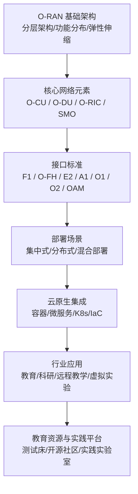
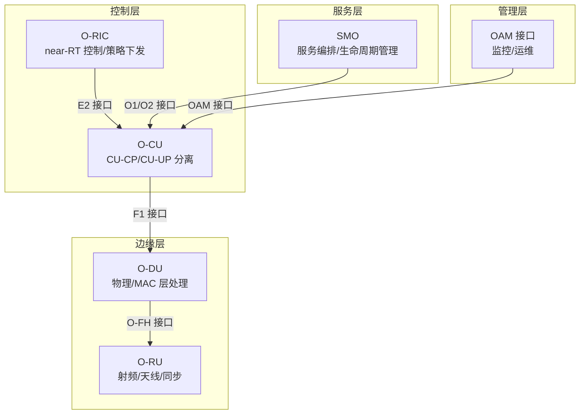
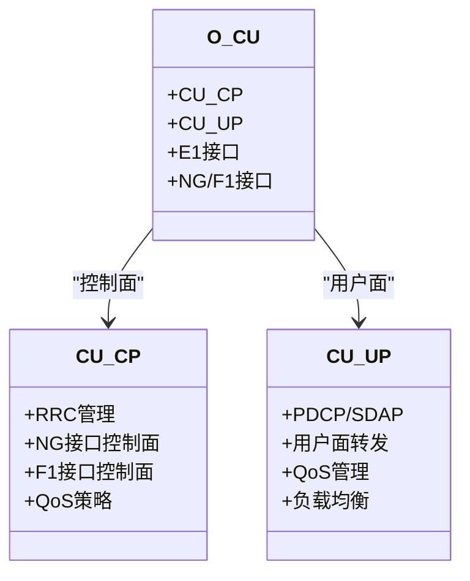
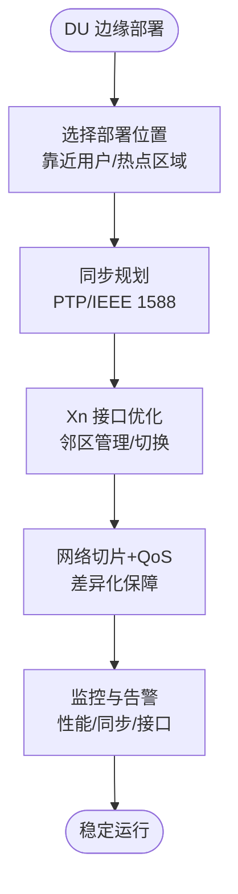
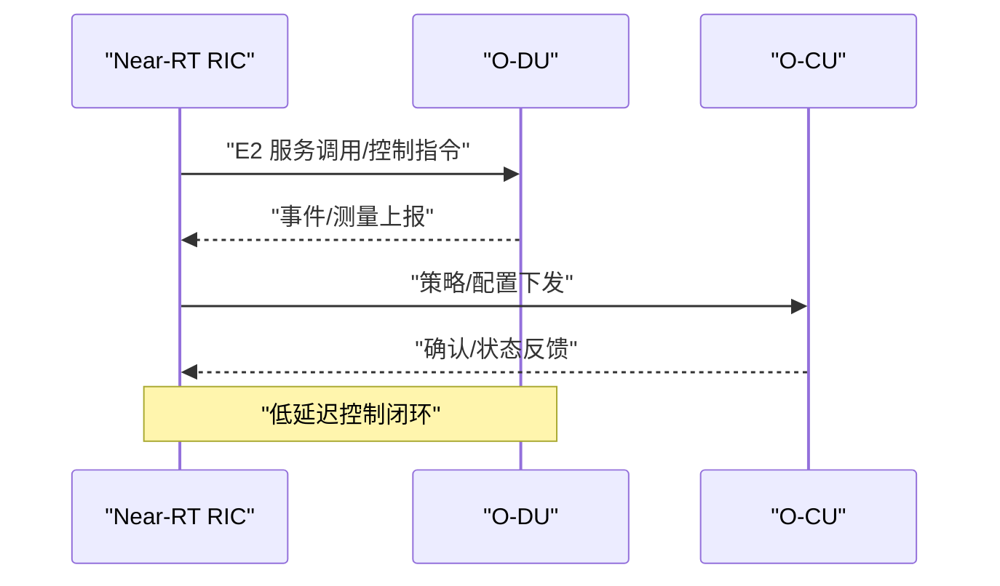
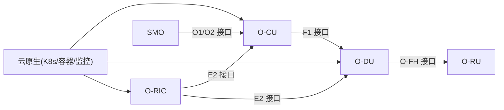

# 教育科研解决方案

<cite>
**本文引用的文件**
- [O-RAN 应用场景](file://10-application-scenarios/readme.md)
- [O-RAN 基础架构](file://01-architecture-system/readme.md)
- [集中式单元 O-CU](file://02-core-components/o-cu.md)
- [分布式单元 O-DU](file://02-core-components/o-du.md)
- [E2 接口](file://03-interface-standards/e2-interface.md)
- [部署场景分析](file://04-disaggregation-options/deployment-scenarios.md)
- [云原生架构与 O-RAN 集成](file://05-cloud-integration/cloud-native-architecture.md)
- [教育与研究应用](file://16-industry-solutions/education-research/o-ran-education-research-zh.md)
- [教育与研究应用（英文）](file://16-industry-solutions/education-research/o-ran-education-research.md)
- [可持续发展与社会责任](file://24-sustainable-development/social-responsibility/o-ran-social-responsibility.md)
- [开源生态与社区资源](file://17-open-source-ecosystem/community-resources/open-source-community-guide-zh.md)
</cite>

## 目录
1. [引言](#引言)
2. [项目结构](#项目结构)
3. [核心组件](#核心组件)
4. [架构总览](#架构总览)
5. [详细组件分析](#详细组件分析)
6. [依赖关系分析](#依赖关系分析)
7. [性能与QoS考量](#性能与qos考量)
8. [部署与实施指南](#部署与实施指南)
9. [教育资源与实践平台](#教育资源与实践平台)
10. [案例研究](#案例研究)
11. [故障排查与运维](#故障排查与运维)
12. [结论](#结论)
13. [附录](#附录)

## 引言
本文件面向教育科研领域的数字化转型需求，系统化梳理 O-RAN 技术在智慧校园、远程教育与科研协作中的应用路径与实施方法。围绕校园网络覆盖、教学资源共享、虚拟实验室、数据与计算资源池、协同研究平台、数字图书馆与知识服务平台等方向，给出基于 O-RAN 架构的网络设计、带宽保障与 QoS 策略，并提供可落地的部署方案与实施案例，兼顾教育资源均衡发展与行业特殊需求。

## 项目结构
本知识库以“分层架构 + 核心组件 + 接口标准 + 部署场景 + 云原生集成 + 行业应用 + 社会责任”为主线，形成从技术原理到行业实践的完整知识图谱。教育科研解决方案可直接复用该结构中的架构、组件与接口规范，结合云原生与边缘计算能力，支撑教学与科研的多样化场景。

图表来源
- [O-RAN 基础架构](file://01-architecture-system/readme.md#L1-L161)
- [集中式单元 O-CU](file://02-core-components/o-cu.md#L1-L419)
- [分布式单元 O-DU](file://02-core-components/o-du.md#L1-L415)
- [E2 接口](file://03-interface-standards/e2-interface.md#L1-L337)
- [部署场景分析](file://04-disaggregation-options/deployment-scenarios.md#L1-L563)
- [云原生架构与 O-RAN 集成](file://05-cloud-integration/cloud-native-architecture.md#L1-L481)
- [教育与研究应用](file://16-industry-solutions/education-research/o-ran-education-research-zh.md#L1-L102)

章节来源
- [O-RAN 基础架构](file://01-architecture-system/readme.md#L1-L161)
- [部署场景分析](file://04-disaggregation-options/deployment-scenarios.md#L1-L563)

## 核心组件
- O-CU（集中式单元）：负责控制面与用户面分离、会话管理、QoS 策略与流量管理；支持 CU-CP/CU-UP 分离部署，便于弹性扩展与就近处理。
- O-DU（分布式单元）：承担物理层与 MAC 层处理，强调低延迟与高可靠性；支持边缘部署与前传网络优化。
- O-RIC（RAN 智能控制器）：通过 E2 接口与 CU/DU 协同，提供 near-RT 控制闭环与 rApp/xApp 执行环境。
- SMO（服务管理与编排）：贯穿生命周期管理、配置与故障管理，与 O2/O1 接口对接云资源与管理域。

章节来源
- [集中式单元 O-CU](file://02-core-components/o-cu.md#L1-L419)
- [分布式单元 O-DU](file://02-core-components/o-du.md#L1-L415)
- [O-RAN 基础架构](file://01-architecture-system/readme.md#L15-L26)
- [E2 接口](file://03-interface-standards/e2-interface.md#L1-L337)

## 架构总览
O-RAN 采用分层架构与功能解耦，结合云原生弹性与边缘计算能力，形成“核心集中、边缘分布、服务化编排”的总体形态。在教育科研场景中，可通过 CU-UP 边缘下沉、DU 靠近用户、RIC 靠近业务域，实现低延迟与高可靠。

图表来源
- [O-RAN 基础架构](file://01-architecture-system/readme.md#L8-L35)
- [E2 接口](file://03-interface-standards/e2-interface.md#L74-L89)
- [集中式单元 O-CU](file://02-core-components/o-cu.md#L101-L122)
- [分布式单元 O-DU](file://02-core-components/o-du.md#L68-L87)

## 详细组件分析

### O-CU 在教学与科研中的作用
- 控制面（CU-CP）：负责 RRC、NG 接口与移动性管理，支撑大规模并发用户的接入与会话管理。
- 用户面（CU-UP）：面向高带宽教学与实验场景，提供端到端 QoS 保障与流量调度。
- 部署建议：在校园核心区域集中部署 CU-CP，边缘区域部署 CU-UP，结合网络切片为教学、科研、虚拟实验分别提供隔离资源池。

图表来源
- [集中式单元 O-CU](file://02-core-components/o-cu.md#L7-L61)

章节来源
- [集中式单元 O-CU](file://02-core-components/o-cu.md#L122-L196)

### O-DU 的低延迟与边缘处理
- 物理层与 MAC 层处理：满足 eMBB/URLLC 场景的实时性与可靠性。
- 边缘部署：在教学楼、实验楼、图书馆等靠近用户处部署 DU，降低端到端时延。
- 前传网络优化：结合 O-FH 接口与同步机制，保障时延与抖动。

图表来源
- [分布式单元 O-DU](file://02-core-components/o-du.md#L51-L86)
- [部署场景分析](file://04-disaggregation-options/deployment-scenarios.md#L110-L161)

章节来源
- [分布式单元 O-DU](file://02-core-components/o-du.md#L148-L224)

### E2 接口与智能编排
- 服务化接口：支持 RIC 与 CU/DU 的服务发现、调用与事件通知。
- Near-RT 控制闭环：毫秒级控制延迟，满足教学演示与实验控制的实时性。
- 部署策略：Near-RT RIC 分布式部署，Non-RT RIC 集中管理，结合 QoS 与安全策略。

图表来源
- [E2 接口](file://03-interface-standards/e2-interface.md#L9-L32)
- [O-RAN 基础架构](file://01-architecture-system/readme.md#L21-L24)

章节来源
- [E2 接口](file://03-interface-standards/e2-interface.md#L90-L147)

## 依赖关系分析
- 组件耦合：O-CU 与 O-DU 通过 F1 接口耦合，O-DU 与 O-RU 通过 O-FH 接口耦合；O-RIC 通过 E2 接口与 CU/DU 解耦协作。
- 云原生依赖：Kubernetes 编排、容器化部署、服务网格与监控体系，支撑弹性与可观测性。
- 部署场景依赖：集中式/分布式/混合部署对传输网络、同步与安全提出差异化要求。

图表来源
- [O-RAN 基础架构](file://01-architecture-system/readme.md#L27-L35)
- [E2 接口](file://03-interface-standards/e2-interface.md#L74-L89)
- [云原生架构与 O-RAN 集成](file://05-cloud-integration/cloud-native-architecture.md#L65-L122)

章节来源
- [O-RAN 基础架构](file://01-architecture-system/readme.md#L1-L161)
- [云原生架构与 O-RAN 集成](file://05-cloud-integration/cloud-native-architecture.md#L1-L481)

## 性能与QoS考量
- QoS 策略：区分 eMBB（高带宽）、URLLC（低时延/高可靠）、mMTC（海量连接），在 CU-UP 与 DU 层实现差异化调度与资源预留。
- 弹性伸缩：结合云原生自动扩缩容与网络切片，按业务高峰/低谷动态分配资源。
- 监控与优化：通过指标、日志与分布式追踪，持续优化端到端时延、吞吐量与丢包率。

章节来源
- [O-RAN 应用场景](file://10-application-scenarios/readme.md#L9-L43)
- [集中式单元 O-CU](file://02-core-components/o-cu.md#L264-L282)
- [云原生架构与 O-RAN 集成](file://05-cloud-integration/cloud-native-architecture.md#L297-L341)

## 部署与实施指南

### 校园网络覆盖与边缘计算
- 边缘 DU 部署：在教学楼、图书馆、实验中心等热点区域就近部署 DU，降低时延并提升用户体验。
- 前传与中传：采用 O-FH 接口与同步机制，结合 QoS 保障，确保低抖动与高可靠。
- 安全与隔离：网络分段、访问控制与加密传输，满足教育数据安全要求。

章节来源
- [分布式单元 O-DU](file://02-core-components/o-du.md#L171-L206)
- [部署场景分析](file://04-disaggregation-options/deployment-scenarios.md#L110-L161)

### 教学资源共享与虚拟实验室
- 网络切片：为在线课堂、远程实验、虚拟仿真等场景划分专用切片，保障带宽与时延。
- CU-UP 边缘下沉：就近处理用户面数据，降低回传压力，提升互动流畅度。
- 云原生编排：容器化与微服务化部署，支持弹性扩缩容与快速故障恢复。

章节来源
- [O-RAN 应用场景](file://10-application-scenarios/readme.md#L30-L36)
- [云原生架构与 O-RAN 集成](file://05-cloud-integration/cloud-native-architecture.md#L235-L296)

### 数据共享与计算资源池
- SMO 编排：统一管理网络服务生命周期与资源配置，支持跨域数据共享与资源池化。
- 容器与 K8s：实现资源动态分配与弹性调度，支撑科研计算任务的按需使用。
- 安全与合规：端到端加密、访问控制与审计日志，满足教育数据隐私与合规要求。

章节来源
- [O-RAN 基础架构](file://01-architecture-system/readme.md#L24-L26)
- [云原生架构与 O-RAN 集成](file://05-cloud-integration/cloud-native-architecture.md#L342-L377)

### 协同研究平台
- near-RT 控制闭环：通过 E2 接口实现毫秒级控制，支撑远程操控与协同实验。
- 多厂商互操作：遵循 O-RAN 接口标准，实现跨厂商设备的集成与编排。
- 自动化运维：CI/CD、基础设施即代码与统一监控，降低平台运维复杂度。

章节来源
- [E2 接口](file://03-interface-standards/e2-interface.md#L111-L147)
- [部署场景分析](file://04-disaggregation-options/deployment-scenarios.md#L436-L496)

## 教育资源与实践平台
- 测试床与沙箱：提供虚拟与实体测试床，支持教学与科研实验。
- 开源社区：鼓励参与开源项目与社区活动，促进技术共享与能力培养。
- 社会责任：通过 STEM 教育、教师培训、学生实习与在线课程，推动教育资源均衡。

章节来源
- [教育与研究应用](file://16-industry-solutions/education-research/o-ran-education-research-zh.md#L1-L102)
- [教育与研究应用（英文）](file://16-industry-solutions/education-research/o-ran-education-research.md#L38-L102)
- [开源生态与社区资源](file://17-open-source-ecosystem/community-resources/open-source-community-guide-zh.md#L345-L399)
- [可持续发展与社会责任](file://24-sustainable-development/social-responsibility/o-ran-social-responsibility.md#L58-L83)

## 案例研究
- 工业园区边缘部署案例：端到端时延降至 0.5ms，可靠性达 99.999%，满足工业控制与智能制造需求。可借鉴其边缘 DU 部署、同步与 QoS 策略，应用于教学实验与科研控制场景。
- 核心城市集中式部署案例：管理效率提升 50%，资源利用率提高 30%，业务开通时间缩短 70%。可借鉴其云原生集中编排与自动化运维经验，支撑大规模教学与科研平台。

章节来源
- [部署场景分析](file://04-disaggregation-options/deployment-scenarios.md#L497-L558)
- [云原生架构与 O-RAN 集成](file://05-cloud-integration/cloud-native-architecture.md#L378-L436)

## 故障排查与运维
- 监控体系：建立分层监控（基础设施/容器/服务/业务），统一指标、日志与追踪。
- 告警与自动化：告警分级、关联分析与自动恢复，降低故障影响面。
- 容量与性能：定期评估容量使用，预测增长并优化资源分配与调度策略。

章节来源
- [云原生架构与 O-RAN 集成](file://05-cloud-integration/cloud-native-architecture.md#L297-L341)
- [集中式单元 O-CU](file://02-core-components/o-cu.md#L197-L282)
- [分布式单元 O-DU](file://02-core-components/o-du.md#L224-L308)

## 结论
O-RAN 以分层架构、功能解耦与接口标准化为基础，结合云原生弹性与边缘计算能力，为教育科研提供了高带宽、低时延、高可靠的网络底座。通过 CU-UP 边缘下沉、DU 热点部署、网络切片与 QoS 策略，可有效支撑智慧校园、远程教育与虚拟实验室等场景；借助 SMO 编排与开源社区生态，可实现资源池化、自动化运维与可持续发展。

## 附录
- 关键术语：CU-CP/CU-UP、F1/O-FH/E2 接口、SMO、O-RIC、网络切片、QoS、边缘计算、云原生。
- 标准与规范：遵循 O-RAN 联盟架构与接口规范，结合 3GPP、ETSI 等标准推进互操作与合规。