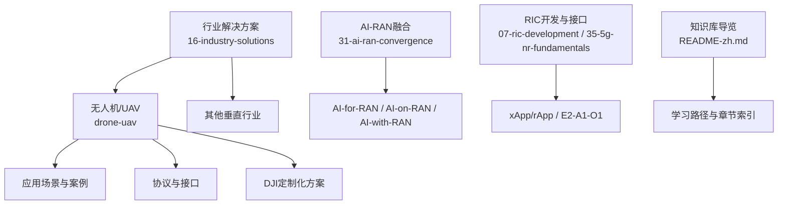
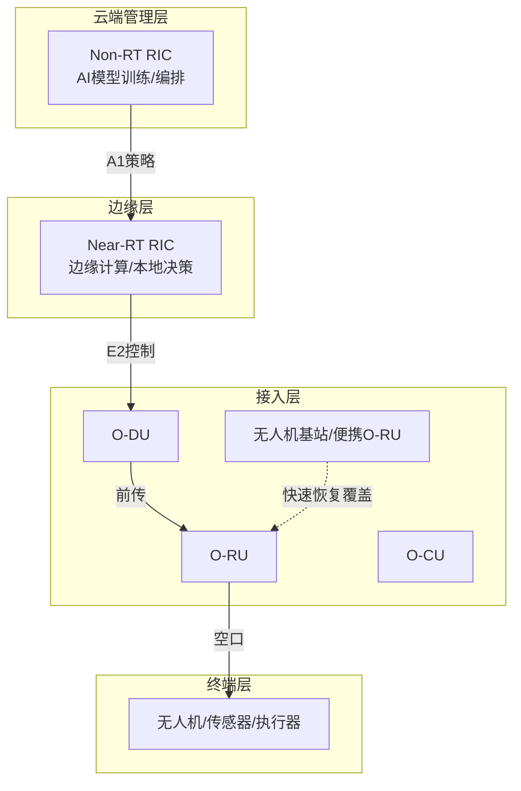
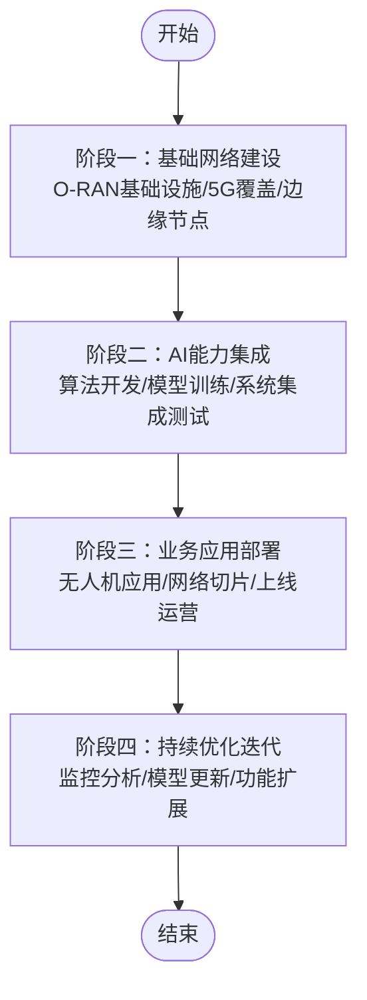
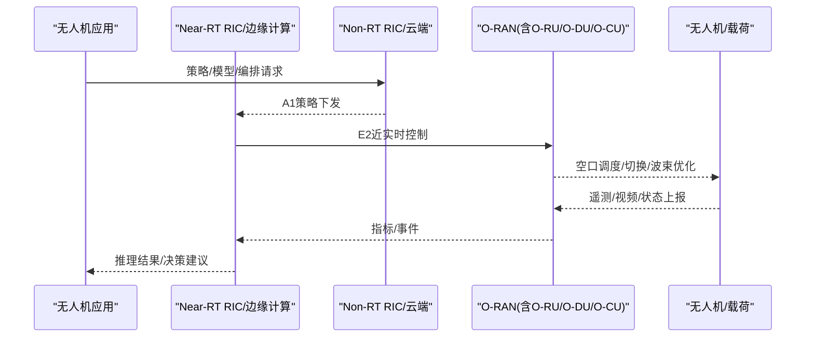
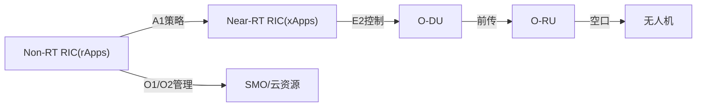

# 无人机/UAV行业解决方案

<cite>
**本文引用的文件**
- [16-industry-solutions/drone-uav/readme.md](file://16-industry-solutions/drone-uav/readme.md)
- [16-industry-solutions/drone-uav/drone-application-scenarios.md](file://16-industry-solutions/drone-uav/drone-application-scenarios.md)
- [README-zh.md](file://README-zh.md)
- [31-ai-ran-convergence/readme.md](file://31-ai-ran-convergence/readme.md)
- [07-ric-development/readme-zh.md](file://07-ric-development/readme-zh.md)
- [35-5g-nr-fundamentals/5g-nr-o-ran-integration.md](file://35-5g-nr-fundamentals/5g-nr-o-ran-integration.md)
</cite>

## 目录
1. [引言](#引言)
2. [项目结构](#项目结构)
3. [核心组件](#核心组件)
4. [架构总览](#架构总览)
5. [详细组件分析](#详细组件分析)
6. [依赖关系分析](#依赖关系分析)
7. [性能考量](#性能考量)
8. [故障排查指南](#故障排查指南)
9. [结论](#结论)
10. [附录](#附录)

## 引言
本方案面向无人机（UAV）与低空经济，提供基于O-RAN与AI-RAN的端到端技术参考：涵盖5G网联无人机、DJI生态集成、编队协同与应急通信、通感一体与低空智联网等方向。文档以“可落地”为目标，为创业者、集成商与运营商提供从架构设计到场景落地的系统化指引。

## 项目结构
围绕无人机/UAV解决方案，仓库提供了分层、分主题的知识体系：
- 行业解决方案总览与导航：位于16-industry-solutions，其中drone-uav子目录聚焦无人机AI-RAN方案
- AI-RAN融合与前沿：31-ai-ran-convergence提供AI-for/on/with RAN范式、平台与生态全景
- RIC开发与接口：07-ric-development与35-5g-nr-fundamentals提供RIC架构、xApp/rApp开发、E2/A1/O1接口实践
- 知识库导览：README-zh.md提供整体学习路径与章节索引

图表来源
- [16-industry-solutions/drone-uav/readme.md:11-44](file://16-industry-solutions/drone-uav/readme.md#L11-L44)
- [31-ai-ran-convergence/readme.md:15-52](file://31-ai-ran-convergence/readme.md#L15-L52)
- [07-ric-development/readme-zh.md:11-61](file://07-ric-development/readme-zh.md#L11-L61)
- [35-5g-nr-fundamentals/5g-nr-o-ran-integration.md:666-810](file://35-5g-nr-fundamentals/5g-nr-o-ran-integration.md#L666-L810)

章节来源
- [README-zh.md:109-115](file://README-zh.md#L109-L115)
- [16-industry-solutions/drone-uav/readme.md:11-44](file://16-industry-solutions/drone-uav/readme.md#L11-L44)

## 核心组件
- O-RAN接入网与RIC：O-RU/O-DU/O-CU构成接入层；Near-RT RIC与Non-RT RIC通过E2/A1实现近实时控制与非实时策略下发
- AI-RAN能力：AI-for-RAN优化无线资源；AI-on-RAN在基站侧承载边缘推理；AI-with-RAN共享GPU基带算力
- 无人机应用栈：飞行控制、任务载荷、数据链路、地面站与云端编排；结合网络切片、边缘计算与AI模型
- DJI生态集成：机场（Dock）作为边缘节点，Cloud API对接上层业务系统

章节来源
- [16-industry-solutions/drone-uav/readme.md:26-32](file://16-industry-solutions/drone-uav/readme.md#L26-L32)
- [31-ai-ran-convergence/readme.md:23-52](file://31-ai-ran-convergence/readme.md#L23-L52)
- [35-5g-nr-fundamentals/5g-nr-o-ran-integration.md:666-810](file://35-5g-nr-fundamentals/5g-nr-o-ran-integration.md#L666-L810)

## 架构总览
无人机/UAV的AI-RAN总体架构分为四层：云端管理层（Non-RT RIC、AI训练、编排）、边缘层（Near-RT RIC、边缘计算、本地决策）、接入层（O-RU/O-DU/O-CU、无人机基站）、终端层（无人机、传感器、执行器）。该架构支持网络切片、边缘推理与AI驱动的无线资源管理，满足超视距飞行、编队协同与应急通信等需求。

图表来源
- [16-industry-solutions/drone-uav/drone-application-scenarios.md:1916-1931](file://16-industry-solutions/drone-uav/drone-application-scenarios.md#L1916-L1931)
- [31-ai-ran-convergence/readme.md:150-177](file://31-ai-ran-convergence/readme.md#L150-L177)

## 详细组件分析

### 无人机AI-RAN技术架构
- 分层架构：云端Non-RT RIC负责策略与模型训练；边缘Near-RT RIC负责近实时控制与推理；接入层由O-RAN解耦组件组成；终端层包含无人机与载荷
- 关键接口：A1用于策略下发，E2用于近实时控制，O1/O2用于管理与云资源编排
- 实施路径：基础网络建设→AI能力集成→业务应用部署→持续优化迭代

图表来源
- [16-industry-solutions/drone-uav/drone-application-scenarios.md:1947-1968](file://16-industry-solutions/drone-uav/drone-application-scenarios.md#L1947-L1968)

章节来源
- [16-industry-solutions/drone-uav/drone-application-scenarios.md:1916-1968](file://16-industry-solutions/drone-uav/drone-application-scenarios.md#L1916-L1968)

### DJI定制化AI-RAN方案
- 生态切入：利用DJI Cloud API与机场（Dock）边缘节点，将无人机作业与O-RAN网络编排打通
- 四大核心方案：5G网联无人机、编队协同、应急通信、低空智联网（通感一体）
- 合作模式与路线图：明确设备选型、网络切片、边缘推理与云平台集成的实施步骤与成本效益评估

章节来源
- [16-industry-solutions/drone-uav/readme.md:19-32](file://16-industry-solutions/drone-uav/readme.md#L19-L32)

### 无人机通信协议与接口
- 协议栈全景：C2链路、数据链路、视频链路；编队与应急协议；安全与多模通信
- 标准化进展：3GPP UAS（Rel-16+）、UAS NF、网络切片与BVLOS支持
- DJI生态集成附录：Cloud API对接、机场边缘节点部署与运维要点

章节来源
- [16-industry-solutions/drone-uav/readme.md:21-24](file://16-industry-solutions/drone-uav/readme.md#L21-L24)

### 无人机应用场景与案例
- 十二大垂直场景：农业、物流、巡检、安防、测绘、应急、环保、能源、交通、建筑、娱乐等
- 成功案例：城市安防、农业蜂群作业、应急救援通信保障等
- 挑战与市场分析：续航、覆盖、时延、可靠性与商业模式

图表来源
- [31-ai-ran-convergence/readme.md:150-177](file://31-ai-ran-convergence/readme.md#L150-L177)
- [16-industry-solutions/drone-uav/drone-application-scenarios.md:1916-1931](file://16-industry-solutions/drone-uav/drone-application-scenarios.md#L1916-L1931)

章节来源
- [16-industry-solutions/drone-uav/drone-application-scenarios.md:34-124](file://16-industry-solutions/drone-uav/drone-application-scenarios.md#L34-L124)
- [16-industry-solutions/drone-uav/drone-application-scenarios.md:1868-1910](file://16-industry-solutions/drone-uav/drone-application-scenarios.md#L1868-L1910)

### RIC与xApp/rApp在无人机中的应用
- xApp：在Near-RT RIC中实现近实时控制（如切换、波束、干扰协调、能效优化）
- rApp：在Non-RT RIC中实现策略制定、模型训练与网络编排
- 接口与工具：E2/A1/O1接口API、SDK、模拟器与CI/CD流水线

章节来源
- [07-ric-development/readme-zh.md:11-61](file://07-ric-development/readme-zh.md#L11-L61)
- [35-5g-nr-fundamentals/5g-nr-o-ran-integration.md:666-810](file://35-5g-nr-fundamentals/5g-nr-o-ran-integration.md#L666-L810)

## 依赖关系分析
- 组件耦合：Near-RT RIC与O-RAN接入层通过E2紧密耦合；Non-RT RIC与Near-RT RIC通过A1松耦合；云端与边缘通过标准接口协作
- 外部依赖：3GPP UAS规范、DJI Cloud API、边缘AI平台（如NVIDIA ARC）
- 潜在风险：多厂商互操作、模型更新与版本管理、边缘算力与能耗平衡

图表来源
- [31-ai-ran-convergence/readme.md:150-177](file://31-ai-ran-convergence/readme.md#L150-L177)
- [35-5g-nr-fundamentals/5g-nr-o-ran-integration.md:666-810](file://35-5g-nr-fundamentals/5g-nr-o-ran-integration.md#L666-L810)

章节来源
- [31-ai-ran-convergence/readme.md:150-177](file://31-ai-ran-convergence/readme.md#L150-L177)
- [35-5g-nr-fundamentals/5g-nr-o-ran-integration.md:666-810](file://35-5g-nr-fundamentals/5g-nr-o-ran-integration.md#L666-L810)

## 性能考量
- 时延与带宽：超视距飞行需要低时延高可靠链路；高清视频回传需要大带宽
- 覆盖与切换：空中UE移动性强，需优化切换与波束管理
- 边缘推理：在基站侧进行图像识别与目标检测，降低云端依赖
- 能效与容量：AI节能、动态资源分配与网络切片提升整体效率

章节来源
- [16-industry-solutions/drone-uav/drone-application-scenarios.md:65-80](file://16-industry-solutions/drone-uav/drone-application-scenarios.md#L65-L80)
- [31-ai-ran-convergence/readme.md:23-52](file://31-ai-ran-convergence/readme.md#L23-L52)

## 故障排查指南
- 常见问题分类：网络覆盖不足、切换失败、视频卡顿、AI推理延迟、边缘节点异常
- 排查流程：定位问题层级（终端/接入/边缘/云端）→采集指标（E2/A1/O1）→根因分析→修复验证
- 工具与方法：使用RIC监控、日志聚合、性能基准测试与一致性验证

章节来源
- [35-5g-nr-fundamentals/5g-nr-o-ran-integration.md:666-810](file://35-5g-nr-fundamentals/5g-nr-o-ran-integration.md#L666-L810)

## 结论
本方案以O-RAN与AI-RAN为核心，构建面向无人机/UAV的低空智联网：通过分层架构、标准化接口与边缘智能，支撑5G网联无人机、编队协同、应急通信与通感一体等关键场景。结合DJI生态与RIC/xApp/rApp能力，可实现从网络到应用的闭环优化，推动低空经济的规模化落地。

## 附录
- 学习路径：从架构基础→RIC开发→AI-RAN融合→行业场景落地
- 参考资源：O-RAN联盟规范、3GPP UAS、AI-RAN Alliance与厂商白皮书

章节来源
- [README-zh.md:245-275](file://README-zh.md#L245-L275)
- [16-industry-solutions/drone-uav/readme.md:33-38](file://16-industry-solutions/drone-uav/readme.md#L33-L38)